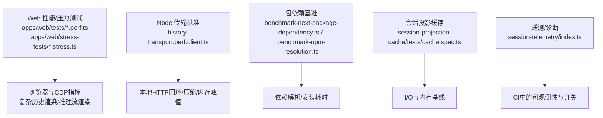
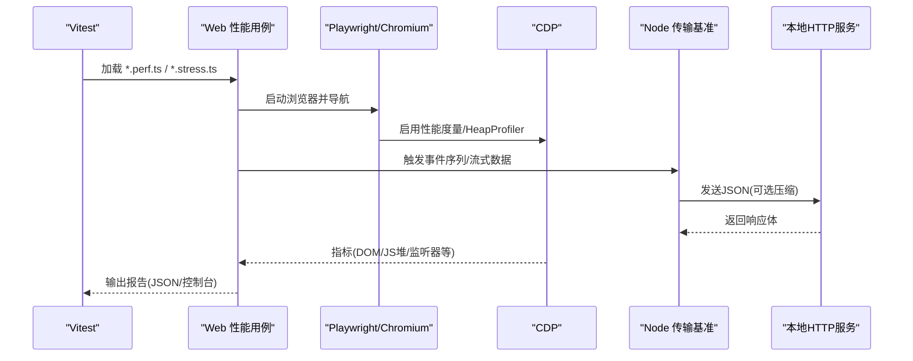
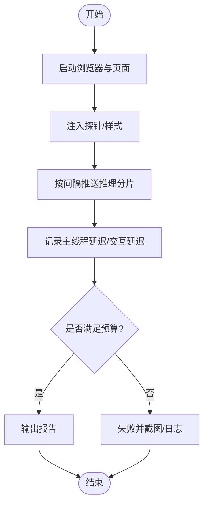
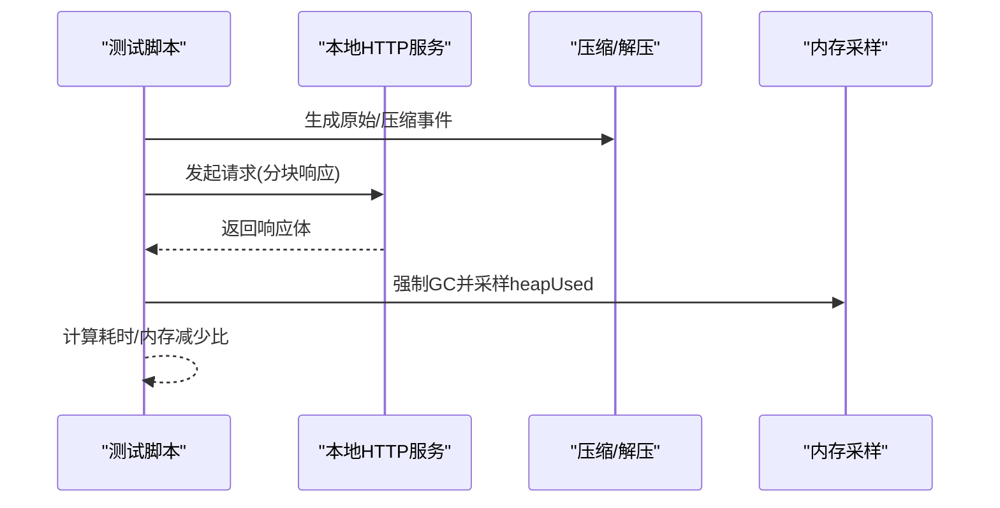
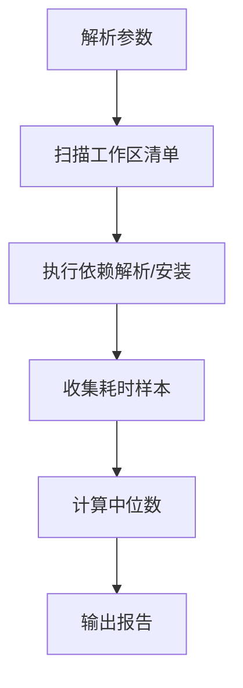
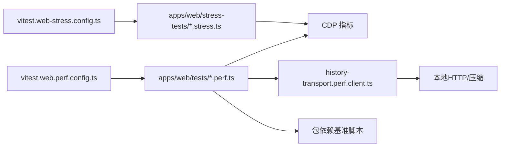

# 性能分析与优化

<cite>
**本文引用的文件**
- [BENCHMARK.md](file://BENCHMARK.md)
- [vitest.web-stress.config.ts](file://vitest.web-stress.config.ts)
- [vitest.web.perf.config.ts](file://vitest.web.perf.config.ts)
- [apps/web/stress-tests/reasoning-chunks.stress.ts](file://apps/web/stress-tests/reasoning-chunks.stress.ts)
- [apps/web/tests/complex-history.perf.ts](file://apps/web/tests/complex-history.perf.ts)
- [packages/client/ui-conversation/tests/history-transport.perf.client.ts](file://packages/client/ui-conversation/tests/history-transport.perf.client.ts)
- [scripts/benchmark-next-package-dependency.ts](file://scripts/benchmark-next-package依赖.ts)
- [scripts/benchmark-npm-resolution.ts](file://scripts/benchmark-npm-resolution.ts)
- [packages/session/session-projection-cache/tests/cache.spec.ts](file://packages/session/session-projection-cache/tests/cache.spec.ts)
- [packages/experimental/inspector/src/host/cdp/profiler.ts](file://packages/experimental/inspector/src/host/cdp/profiler.ts)
- [packages/experimental/inspector/src/client/cdp/profiler.ts](file://packages/experimental/inspector/src/client/cdp/profiler.ts)
- [packages/experimental/inspector/src/host/cdp/heap-profiler.ts](file://packages/experimental/inspector/src/host/cdp/heap-profiler.ts)
- [packages/session/session-telemetry/src/index.ts](file://packages/session/session-telemetry/src/index.ts)
- [scripts/run-gates.ts](file://scripts/run-gates.ts)
</cite>

## 目录
1. [简介](#简介)
2. [项目结构](#项目结构)
3. [核心组件](#核心组件)
4. [架构总览](#架构总览)
5. [详细组件分析](#详细组件分析)
6. [依赖关系分析](#依赖关系分析)
7. [性能注意事项](#性能注意事项)
8. [故障排查指南](#故障排查指南)
9. [结论](#结论)
10. [附录](#附录)

## 简介
本文件面向 deepseek-harness 仓库的性能分析与优化，聚焦以下目标：
- 使用内置的基准测试与压力测试能力，对 CPU、内存、网络传输与渲染进行量化评估。
- 提供瓶颈识别与定位方法，覆盖浏览器端（Playwright + CDP）、Node 进程与包解析链路。
- 说明如何编写与执行负载、压力与稳定性测试，并建立回归检测与持续监控机制。
- 给出代码优化、资源管理与缓存策略的实践建议，以及常见问题解决方案。

## 项目结构
仓库围绕“端到端性能验证”构建了多层能力：
- Web 性能与压力测试：基于 Playwright + Vitest，提供高基数历史渲染、推理流渲染等场景。
- Node 侧传输与压缩基准：对事件序列化、压缩与响应时间进行测量。
- 包依赖与 NPM 解析基准：用于评估依赖安装与解析耗时。
- 会话投影缓存与持久化：通过配置控制写入频率与间隔，影响 I/O 与内存占用。
- 诊断与遥测：提供严重级别分类与可观测性开关，便于在 CI 中隔离或关闭遥测。

**图示来源**
- [apps/web/tests/complex-history.perf.ts:1-200](file://apps/web/tests/complex-history.perf.ts#L1-L200)
- [apps/web/stress-tests/reasoning-chunks.stress.ts:1-154](file://apps/web/stress-tests/reasoning-chunks.stress.ts#L1-L154)
- [packages/client/ui-conversation/tests/history-transport.perf.client.ts:1-200](file://packages/client/ui-conversation/tests/history-transport.perf.client.ts#L1-L200)
- [scripts/benchmark-next-package-dependency.ts:43-73](file://scripts/benchmark-next-package依赖.ts#L43-L73)
- [scripts/benchmark-npm-resolution.ts:105-143](file://scripts/benchmark-npm-resolution.ts#L105-L143)
- [packages/session/session-projection-cache/tests/cache.spec.ts:119-149](file://packages/session/session-projection-cache/tests/cache.spec.ts#L119-L149)
- [packages/session/session-telemetry/src/index.ts:47-55](file://packages/session/session-telemetry/src/index.ts#L47-L55)

**章节来源**
- [apps/web/tests/complex-history.perf.ts:1-200](file://apps/web/tests/complex-history.perf.ts#L1-L200)
- [apps/web/stress-tests/reasoning-chunks.stress.ts:1-154](file://apps/web/stress-tests/reasoning-chunks.stress.ts#L1-L154)
- [packages/client/ui-conversation/tests/history-transport.perf.client.ts:1-200](file://packages/client/ui-conversation/tests/history-transport.perf.client.ts#L1-L200)
- [scripts/benchmark-next-package-dependency.ts:43-73](file://scripts/benchmark-next-package依赖.ts#L43-L73)
- [scripts/benchmark-npm-resolution.ts:105-143](file://scripts/benchmark-npm-resolution.ts#L105-L143)
- [packages/session/session-projection-cache/tests/cache.spec.ts:119-149](file://packages/session/session-projection-cache/tests/cache.spec.ts#L119-L149)
- [packages/session/session-telemetry/src/index.ts:47-55](file://packages/session/session-telemetry/src/index.ts#L47-L55)

## 核心组件
- Web 性能与压力测试套件
  - 复杂历史渲染：构造大量工作区与会话条目，采集 DOM、监听器、堆大小等指标，评估长会话打开与继续对话时的渲染成本。
  - 推理流压力：向页面注入海量推理分片，测量主线程阻塞与交互延迟，确保 UI 保持响应。
- Node 传输与压缩基准
  - 对事件包装、JSON 序列化、Gzip/Brotli 压缩、本地 HTTP 传输、客户端解析与校验进行计时与内存采样。
- 包依赖与 NPM 解析基准
  - 支持多轮运行、超时与并行度控制，对比候选依赖版本或分支，输出中位数耗时。
- 会话投影缓存
  - 通过写批次数与写间隔参数控制持久化行为，观察其对 I/O 与内存的影响。
- 遥测与诊断
  - 提供严重级别分类与遥测开关，便于在性能测试中禁用遥测以减少干扰。

**章节来源**
- [apps/web/tests/complex-history.perf.ts:1-200](file://apps/web/tests/complex-history.perf.ts#L1-L200)
- [apps/web/stress-tests/reasoning-chunks.stress.ts:1-154](file://apps/web/stress-tests/reasoning-chunks.stress.ts#L1-L154)
- [packages/client/ui-conversation/tests/history-transport.perf.client.ts:1-200](file://packages/client/ui-conversation/tests/history-transport.perf.client.ts#L1-L200)
- [scripts/benchmark-next-package-dependency.ts:43-73](file://scripts/benchmark-next-package依赖.ts#L43-L73)
- [scripts/benchmark-npm-resolution.ts:105-143](file://scripts/benchmark-npm-resolution.ts#L105-L143)
- [packages/session/session-projection-cache/tests/cache.spec.ts:119-149](file://packages/session/session-projection-cache/tests/cache.spec.ts#L119-L149)
- [packages/session/session-telemetry/src/index.ts:47-55](file://packages/session/session-telemetry/src/index.ts#L47-L55)

## 架构总览
下图展示了从测试入口到指标采集的关键路径：Vitest 配置选择性能用例，Playwright 启动浏览器并通过 CDP 获取指标；Node 侧通过本地服务器模拟传输；包依赖基准直接调用系统工具与文件系统。

**图示来源**
- [vitest.web.perf.config.ts:1-22](file://vitest.web.perf.config.ts#L1-L22)
- [vitest.web-stress.config.ts:1-16](file://vitest.web-stress.config.ts#L1-L16)
- [apps/web/tests/complex-history.perf.ts:520-547](file://apps/web/tests/complex-history.perf.ts#L520-L547)
- [packages/client/ui-conversation/tests/history-transport.perf.client.ts:151-186](file://packages/client/ui-conversation/tests/history-transport.perf.client.ts#L151-L186)

## 详细组件分析

### Web 性能与压力测试
- 复杂历史渲染
  - 通过构造大量会话与工作区，打开长历史并继续对话，采集 wall/task/script/layout/recalcStyle/devtools 等指标，以及 DOM 节点数、监听器数量与堆大小变化。
  - 使用 CDP 启用性能度量，并在关键阶段采集保留状态，形成前后对比。
- 推理流压力
  - 以固定间隔推送大量推理分片，测量主线程最大延迟与交互处理延迟，断言 UI 仍保持响应。
  - 通过自定义事件与定时器探针记录心跳样本与交互时延。

**图示来源**
- [apps/web/stress-tests/reasoning-chunks.stress.ts:46-154](file://apps/web/stress-tests/reasoning-chunks.stress.ts#L46-L154)
- [apps/web/tests/complex-history.perf.ts:520-547](file://apps/web/tests/complex-history.perf.ts#L520-L547)

**章节来源**
- [apps/web/stress-tests/reasoning-chunks.stress.ts:46-154](file://apps/web/stress-tests/reasoning-chunks.stress.ts#L46-L154)
- [apps/web/tests/complex-history.perf.ts:520-547](file://apps/web/tests/complex-history.perf.ts#L520-L547)

### Node 传输与压缩基准
- 事件包装与序列化
  - 对原始与压缩后的事件集合分别计时，比较 JSON 序列化与压缩耗时。
- 本地 HTTP 传输
  - 启动本地服务器，模拟生产环境无 content-length 的分块响应，测量头部与主体传输耗时。
- 内存峰值采样
  - 强制 GC 后读取 heapUsed，多次采样取中位数，得到额外堆峰值与减少百分比。

**图示来源**
- [packages/client/ui-conversation/tests/history-transport.perf.client.ts:151-186](file://packages/client/ui-conversation/tests/history-transport.perf.client.ts#L151-L186)
- [packages/client/ui-conversation/tests/history-transport.perf.client.ts:188-211](file://packages/client/ui-conversation/tests/history-transport.perf.client.ts#L188-L211)
- [packages/client/ui-conversation/tests/history-transport.perf.client.ts:496-553](file://packages/client/ui-conversation/tests/history-transport.perf.client.ts#L496-L553)

**章节来源**
- [packages/client/ui-conversation/tests/history-transport.perf.client.ts:151-186](file://packages/client/ui-conversation/tests/history-transport.perf.client.ts#L151-L186)
- [packages/client/ui-conversation/tests/history-transport.perf.client.ts:188-211](file://packages/client/ui-conversation/tests/history-transport.perf.client.ts#L188-L211)
- [packages/client/ui-conversation/tests/history-transport.perf.client.ts:496-553](file://packages/client/ui-conversation/tests/history-transport.perf.client.ts#L496-L553)

### 包依赖与 NPM 解析基准
- 选项与运行
  - 支持候选包列表、运行次数、最终入围者数量、并发任务数与超时设置。
- 工作区清单扫描
  - 通过 glob 或 git ls-tree 收集 package.json 路径，限定范围提升可比性。
- 结果统计
  - 输出每个包的多次运行耗时与中位数，便于回归检测。

**图示来源**
- [scripts/benchmark-next-package-dependency.ts:43-73](file://scripts/benchmark-next-package依赖.ts#L43-L73)
- [scripts/benchmark-npm-resolution.ts:105-143](file://scripts/benchmark-npm-resolution.ts#L105-L143)

**章节来源**
- [scripts/benchmark-next-package-dependency.ts:43-73](file://scripts/benchmark-next-package依赖.ts#L43-L73)
- [scripts/benchmark-npm-resolution.ts:105-143](file://scripts/benchmark-npm-resolution.ts#L105-L143)

### 会话投影缓存与持久化
- 通过 writeEveryEvents 与 writeIntervalMs 控制批量写入与周期落盘，平衡 I/O 与内存。
- 在测试中临时根目录创建存储后端，验证不同配置下的行为与开销。

**章节来源**
- [packages/session/session-projection-cache/tests/cache.spec.ts:119-149](file://packages/session/session-projection-cache/tests/cache.spec.ts#L119-L149)

### 遥测与诊断
- 严重级别：info/warn/error，便于自动告警。
- 遥测开关：可在组合中禁用遥测，避免性能测试受外部上报影响。
- 进程树与子进程管理：在门禁脚本中枚举子进程，辅助排查泄漏或僵尸进程。

**章节来源**
- [packages/session/session-telemetry/src/index.ts:47-55](file://packages/session/session-telemetry/src/index.ts#L47-L55)
- [scripts/run-gates.ts:1353-1385](file://scripts/run-gates.ts#L1353-L1385)

## 依赖关系分析
- Vitest 配置层
  - 性能用例与压力用例通过独立配置文件引入，避免默认测试集包含高开销用例。
- 浏览器与 CDP
  - 复杂历史渲染通过 CDP 启用性能度量与堆分析，获取 DOM、监听器与 JS 堆指标。
- Node 传输层
  - 本地 HTTP 服务器与压缩库配合，模拟真实传输路径并测量各阶段耗时。
- 包依赖基准
  - 依赖系统命令与文件系统 API 扫描工作区，保证跨平台一致性。

**图示来源**
- [vitest.web.perf.config.ts:1-22](file://vitest.web.perf.config.ts#L1-L22)
- [vitest.web-stress.config.ts:1-16](file://vitest.web-stress.config.ts#L1-L16)
- [apps/web/tests/complex-history.perf.ts:520-547](file://apps/web/tests/complex-history.perf.ts#L520-L547)
- [packages/client/ui-conversation/tests/history-transport.perf.client.ts:151-186](file://packages/client/ui-conversation/tests/history-transport.perf.client.ts#L151-L186)
- [scripts/benchmark-next-package-dependency.ts:43-73](file://scripts/benchmark-next-package依赖.ts#L43-L73)
- [scripts/benchmark-npm-resolution.ts:105-143](file://scripts/benchmark-npm-resolution.ts#L105-L143)

**章节来源**
- [vitest.web.perf.config.ts:1-22](file://vitest.web.perf.config.ts#L1-L22)
- [vitest.web-stress.config.ts:1-16](file://vitest.web-stress.config.ts#L1-L16)
- [apps/web/tests/complex-history.perf.ts:520-547](file://apps/web/tests/complex-history.perf.ts#L520-L547)
- [packages/client/ui-conversation/tests/history-transport.perf.client.ts:151-186](file://packages/client/ui-conversation/tests/history-transport.perf.client.ts#L151-L186)
- [scripts/benchmark-next-package-dependency.ts:43-73](file://scripts/benchmark-next-package依赖.ts#L43-L73)
- [scripts/benchmark-npm-resolution.ts:105-143](file://scripts/benchmark-npm-resolution.ts#L105-L143)

## 性能注意事项
- 浏览器端
  - 使用 CDP 的 Performance.enable 与 HeapProfiler 采集 DOM、监听器与堆指标，注意在关键阶段触发垃圾回收以获得稳定基线。
  - 在压力测试中限制主线程延迟预算，确保交互响应性。
- Node 端
  - 对大对象进行压缩与分批传输，减少内存峰值与网络耗时。
  - 使用 --expose-gc 与 process.memoryUsage 进行内存采样，结合多次运行取中位数。
- 包依赖
  - 合理设置 runs、jobs 与 timeout-ms，避免 CI 抖动与超时。
  - 使用 ref 限定比较范围，提高可比性。
- 持久化
  - 调整 writeEveryEvents 与 writeIntervalMs，平衡 I/O 与内存占用。
- 遥测
  - 在性能测试中禁用遥测，避免外部网络与磁盘写入干扰。

[本节为通用指导，不直接分析具体文件]

## 故障排查指南
- 浏览器无指标
  - 确认已启用 CDP 性能度量，且页面上下文可用。
  - 检查 vitest 配置是否正确包含性能用例。
- 内存采样失败
  - 确认启用了 --expose-gc，并确保在采样前执行强制 GC。
- 传输基准不稳定
  - 增加样本数与预热请求，排除首次连接开销。
- 包依赖基准超时
  - 调整 timeout-ms 与 max-ms，降低并发或缩小比较范围。
- 子进程泄漏
  - 使用门禁脚本枚举子进程树，定位未清理的子进程。

**章节来源**
- [apps/web/tests/complex-history.perf.ts:520-547](file://apps/web/tests/complex-history.perf.ts#L520-L547)
- [packages/client/ui-conversation/tests/history-transport.perf.client.ts:188-211](file://packages/client/ui-conversation/tests/history-transport.perf.client.ts#L188-L211)
- [scripts/benchmark-npm-resolution.ts:105-143](file://scripts/benchmark-npm-resolution.ts#L105-L143)
- [scripts/run-gates.ts:1353-1385](file://scripts/run-gates.ts#L1353-L1385)

## 结论
该仓库提供了完整的性能分析与优化基础设施：
- Web 端通过 Playwright + CDP 实现高保真渲染与交互性能验证。
- Node 端通过本地传输与压缩基准，量化序列化、压缩与内存峰值。
- 包依赖基准帮助评估依赖变更对构建与安装耗时的影响。
- 会话投影缓存与遥测开关为持久化与可观测性提供可控变量。
建议在 CI 中集成这些用例作为性能回归门禁，并结合中位数与预算断言，持续保障性能质量。

[本节为总结，不直接分析具体文件]

## 附录
- 快速开始
  - Python SDK 基准：遵循文档安装并运行最小变体，使用独立工作区与会话 ID 执行独立基准任务。
- 运行方式
  - 性能用例：使用 vitest.web.perf.config.ts 执行 *.perf.ts。
  - 压力用例：使用 vitest.web-stress.config.ts 执行 *.stress.ts。
  - 包依赖基准：使用 scripts 中的基准脚本，传入候选、运行次数与超时等参数。

**章节来源**
- [BENCHMARK.md:1-4](file://BENCHMARK.md#L1-L4)
- [vitest.web.perf.config.ts:1-22](file://vitest.web.perf.config.ts#L1-L22)
- [vitest.web-stress.config.ts:1-16](file://vitest.web-stress.config.ts#L1-L16)
- [scripts/benchmark-next-package-dependency.ts:43-73](file://scripts/benchmark-next-package依赖.ts#L43-L73)
- [scripts/benchmark-npm-resolution.ts:105-143](file://scripts/benchmark-npm-resolution.ts#L105-L143)