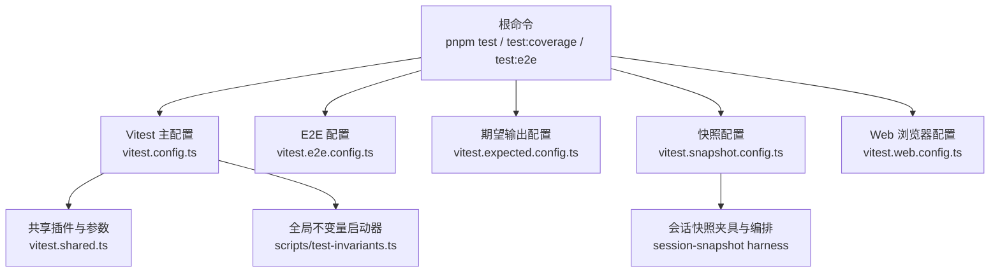
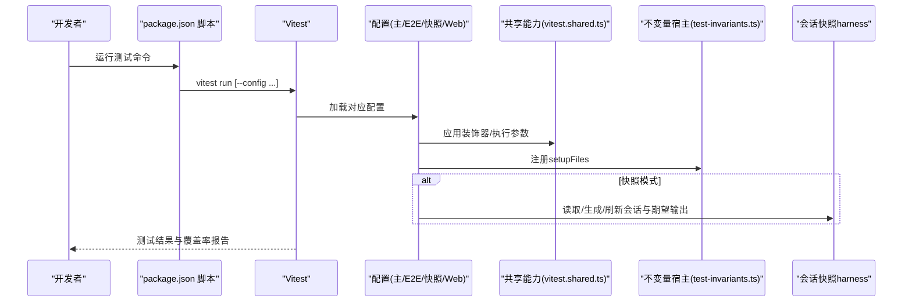
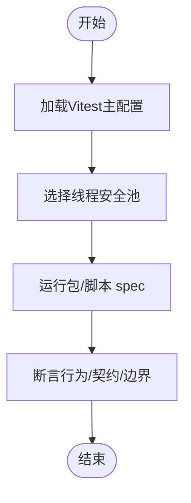
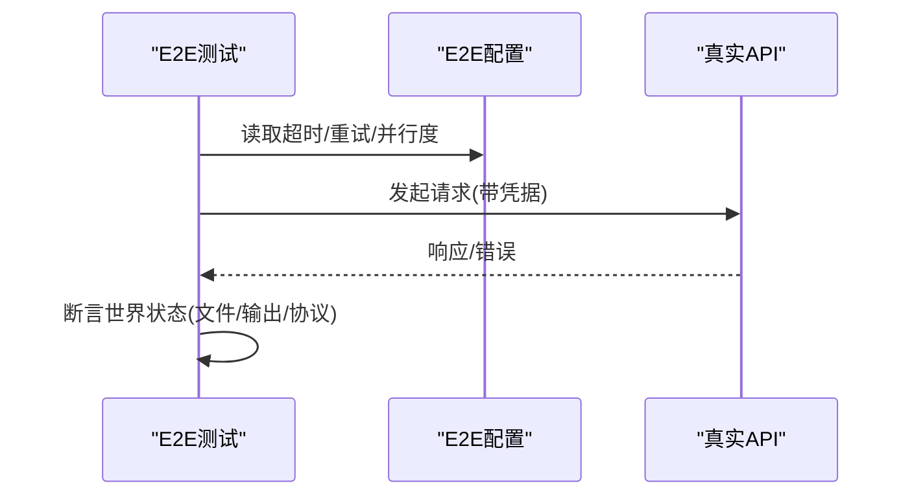
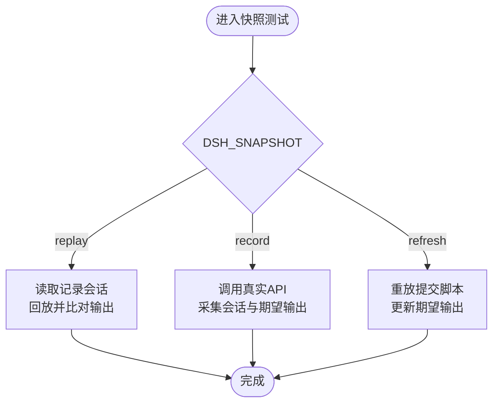
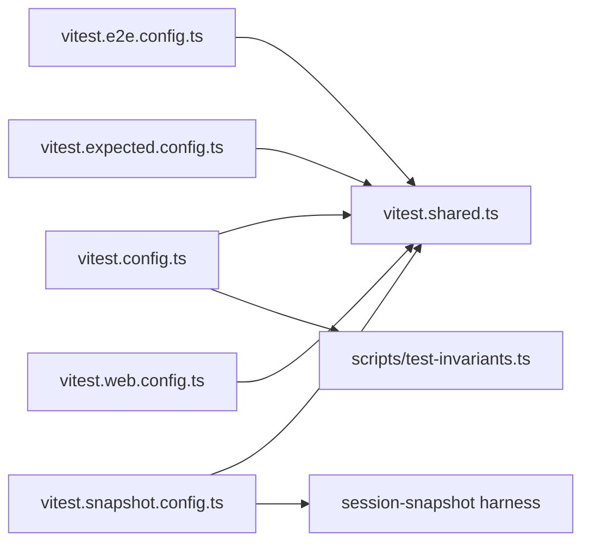

# 测试与调试

<cite>
**本文引用的文件**
- [vitest.config.ts](file://vitest.config.ts)
- [vitest.e2e.config.ts](file://vitest.e2e.config.ts)
- [vitest.expected.config.ts](file://vitest.expected.config.ts)
- [vitest.snapshot.config.ts](file://vitest.snapshot.config.ts)
- [vitest.web.config.ts](file://vitest.web.config.ts)
- [vitest.shared.ts](file://vitest.shared.ts)
- [package.json](file://package.json)
- [docs/testing.md](file://docs/testing.md)
- [scripts/test-invariants.ts](file://scripts/test-invariants.ts)
- [packages/test-support/session-snapshot/src/harness.ts](file://packages/test-support/session-snapshot/src/harness.ts)
- [apps/cli/tests/args.spec.ts](file://apps/cli/tests/args.spec.ts)
- [packages/acp/acp/tests/approval.spec.ts](file://packages/acp/acp/tests/approval.spec.ts)
</cite>

## 目录
1. [简介](#简介)
2. [项目结构](#项目结构)
3. [核心组件](#核心组件)
4. [架构总览](#架构总览)
5. [详细组件分析](#详细组件分析)
6. [依赖关系分析](#依赖关系分析)
7. [性能考虑](#性能考虑)
8. [故障排查指南](#故障排查指南)
9. [结论](#结论)
10. [附录](#附录)

## 简介
本文件面向DeepSeek Harness的测试与调试，覆盖单元测试、集成测试、端到端（E2E）与快照测试的策略、配置与执行方式；说明Vitest多工程与多环境配置、覆盖率门禁、测试夹具管理与断言实践；并提供日志、性能分析与问题诊断方法，帮助开发者编写高质量测试并高效定位问题。

## 项目结构
仓库采用多包工作区组织，测试按“层”划分：
- 单元测试：基于Vitest，运行在包与脚本的tests目录下，强调边缘路径、并发与契约回归。
- 覆盖率门禁：对源码进行逐文件100%阈值检查，排除类型/入口/浏览器特定区域。
- 真实API E2E：调用真实模型与第三方服务，具备重试与超时保护。
- 期望输出测试：无需会话回放，直接组装CLI/进程预期输出。
- 快照测试：以记录会话为输入，回放并比对持久化结果或UI渲染。
- Web浏览器快照：在Chromium下比较会话驱动与纯UI输出。

**图表来源**
- [vitest.config.ts:149-191](file://vitest.config.ts#L149-L191)
- [vitest.e2e.config.ts:31-61](file://vitest.e2e.config.ts#L31-L61)
- [vitest.expected.config.ts:7-18](file://vitest.expected.config.ts#L7-L18)
- [vitest.snapshot.config.ts:39-66](file://vitest.snapshot.config.ts#L39-L66)
- [vitest.web.config.ts:16-36](file://vitest.web.config.ts#L16-L36)
- [vitest.shared.ts:15-42](file://vitest.shared.ts#L15-L42)
- [scripts/test-invariants.ts:159-210](file://scripts/test-invariants.ts#L159-L210)
- [packages/test-support/session-snapshot/src/harness.ts:157-200](file://packages/test-support/session-snapshot/src/harness.ts#L157-L200)

**章节来源**
- [package.json:19-52](file://package.json#L19-L52)
- [docs/testing.md:7-15](file://docs/testing.md#L7-L15)

## 核心组件
- Vitest多工程与多环境
  - 主工程：线程安全用例池 + 进程绑定用例池，统一覆盖率收集与严格阈值。
  - E2E：真实API调用，独立超时、重试与并行度控制。
  - 期望输出：仅包含CLI期望输出场景。
  - 快照：支持replay/record/refresh三种模式，控制并发与写入策略。
  - Web：浏览器级E2E与快照，串行执行避免HMR与动态生命周期冲突。
- 共享能力
  - 装饰器预转换与Node标志注入，保证测试稳定性与可测性。
  - 全局不变量宿主，自动挂载各包的invariant伴生插件，确保运行时契约生效。
- 覆盖率
  - V8提供者，逐文件100%阈值，CI与本地差异化报告。
  - 平台/工具链差异通过排除列表与探针豁免保持绿色。

**章节来源**
- [vitest.config.ts:151-191](file://vitest.config.ts#L151-L191)
- [vitest.config.ts:192-362](file://vitest.config.ts#L192-L362)
- [vitest.e2e.config.ts:31-61](file://vitest.e2e.config.ts#L31-L61)
- [vitest.expected.config.ts:7-18](file://vitest.expected.config.ts#L7-L18)
- [vitest.snapshot.config.ts:39-66](file://vitest.snapshot.config.ts#L39-L66)
- [vitest.web.config.ts:16-36](file://vitest.web.config.ts#L16-L36)
- [vitest.shared.ts:1-42](file://vitest.shared.ts#L1-L42)
- [scripts/test-invariants.ts:159-210](file://scripts/test-invariants.ts#L159-L210)

## 架构总览
下图展示从命令到具体测试执行的调用链，以及关键配置文件与共享能力的协作关系。

**图表来源**
- [package.json:19-52](file://package.json#L19-L52)
- [vitest.config.ts:149-191](file://vitest.config.ts#L149-L191)
- [vitest.e2e.config.ts:31-61](file://vitest.e2e.config.ts#L31-L61)
- [vitest.snapshot.config.ts:39-66](file://vitest.snapshot.config.ts#L39-L66)
- [vitest.web.config.ts:16-36](file://vitest.web.config.ts#L16-L36)
- [vitest.shared.ts:15-42](file://vitest.shared.ts#L15-L42)
- [scripts/test-invariants.ts:159-210](file://scripts/test-invariants.ts#L159-L210)
- [packages/test-support/session-snapshot/src/harness.ts:157-200](file://packages/test-support/session-snapshot/src/harness.ts#L157-L200)

## 详细组件分析

### 单元测试：策略与示例
- 目标与范围
  - 覆盖包与脚本的spec文件，关注边缘分支、错误路径、事件顺序、并发竞态与契约回归。
  - 每个注册点需有HMR安全测试，确保资源释放与清理。
- 执行要点
  - 使用Vitest默认工程，线程安全用例池隔离进程级状态。
  - 通过tsconfig paths解析源码，避免加载已构建产物导致单例重复。
- 示例参考
  - CLI参数解析测试：验证路由、转发、帮助与错误退出码。
  - ACP审批策略测试：通过桥接夹具装配会话、工具调用与审批流程，断言协议映射与失败关闭行为。

**图表来源**
- [vitest.config.ts:151-191](file://vitest.config.ts#L151-L191)
- [apps/cli/tests/args.spec.ts:1-107](file://apps/cli/tests/args.spec.ts#L1-L107)
- [packages/acp/acp/tests/approval.spec.ts:1-87](file://packages/acp/acp/tests/approval.spec.ts#L1-L87)

**章节来源**
- [docs/testing.md:7-15](file://docs/testing.md#L7-L15)
- [apps/cli/tests/args.spec.ts:1-107](file://apps/cli/tests/args.spec.ts#L1-L107)
- [packages/acp/acp/tests/approval.spec.ts:1-87](file://packages/acp/acp/tests/approval.spec.ts#L1-L87)

### 集成测试：真实API E2E
- 目标与范围
  - 针对真实模型与第三方服务的冒烟与集成测试，验证端到端链路。
- 执行要点
  - 独立配置文件，设置较长超时与重试，限制最大工作进程数。
  - 无密钥时自跳过，保障无凭据CI与贡献者体验。
- 最佳实践
  - 优先真实实现而非Mock，仅在昂贵/非确定性边界使用Mock。
  - 外部资源由测试创建并在afterEach中释放。

**图表来源**
- [vitest.e2e.config.ts:31-61](file://vitest.e2e.config.ts#L31-L61)
- [docs/testing.md:18-30](file://docs/testing.md#L18-L30)

**章节来源**
- [vitest.e2e.config.ts:31-61](file://vitest.e2e.config.ts#L31-L61)
- [docs/testing.md:18-30](file://docs/testing.md#L18-L30)

### 期望输出测试
- 目标与范围
  - 无需会话回放的CLI/进程期望输出测试，聚焦组装后的可观测输出。
- 执行要点
  - 独立配置，限定include路径，合理设置超时与并行度上限。

**章节来源**
- [vitest.expected.config.ts:7-18](file://vitest.expected.config.ts#L7-L18)
- [docs/testing.md:12-15](file://docs/testing.md#L12-L15)

### 快照测试：回放/录制/刷新
- 目标与范围
  - 以记录的会话JSONL为输入，回放并比对持久化结果或用户可见输出。
- 执行要点
  - replay模式：只读对比，允许文件级并行与内联并发限制。
  - record模式：调用真实API并更新fixtures与期望输出，串行以避免竞争。
  - refresh模式：重放并提交脚本，更新当前期望输出。
- 夹具与编排
  - harness提供输入脚本、权限应答队列、工作区快照与子会话采集能力。

**图表来源**
- [vitest.snapshot.config.ts:24-66](file://vitest.snapshot.config.ts#L24-L66)
- [packages/test-support/session-snapshot/src/harness.ts:157-200](file://packages/test-support/session-snapshot/src/harness.ts#L157-L200)

**章节来源**
- [vitest.snapshot.config.ts:24-66](file://vitest.snapshot.config.ts#L24-L66)
- [packages/test-support/session-snapshot/src/harness.ts:157-200](file://packages/test-support/session-snapshot/src/harness.ts#L157-L200)
- [docs/testing.md:13-15](file://docs/testing.md#L13-L15)

### Web浏览器快照
- 目标与范围
  - 在Chromium下比较会话驱动输出与纯UI输出，作为Linux PR门禁。
- 执行要点
  - 串行执行避免HMR与动态生命周期干扰；CI强制replay模式。

**章节来源**
- [vitest.web.config.ts:5-36](file://vitest.web.config.ts#L5-L36)
- [docs/testing.md:14-15](file://docs/testing.md#L14-L15)

### 测试夹具管理
- 会话快照夹具
  - harness负责启动真实代理子进程、通过ACP JSON-RPI stdio驱动、收集stdout与session日志，并在record模式下产出持久化数据。
  - 支持输入脚本步骤、权限应答队列、工作区快照与子会话采集。
- 通用夹具清理
  - 提供安全的夹具树移除逻辑，处理Windows句柄异步释放导致的删除失败。

**章节来源**
- [packages/test-support/session-snapshot/src/harness.ts:1-200](file://packages/test-support/session-snapshot/src/harness.ts#L1-L200)
- [scripts/test-fixture-cleanup.ts:36-49](file://scripts/test-fixture-cleanup.ts#L36-L49)

### 调试工具与技巧
- 日志系统
  - 快照与E2E会捕获stderr用于失败诊断；会话回放/录制过程输出原始JSON-RPC帧便于定位。
- 性能分析
  - 覆盖率报告结合V8提供者，CI与本地分别输出文本与HTML；未覆盖位置自定义报告精确到行/列。
- 问题诊断
  - 使用replay模式快速复现问题；通过快照diff确认变更影响；利用E2E重试与超时调整缓解偶发抖动。

**章节来源**
- [vitest.config.ts:10-14](file://vitest.config.ts#L10-L14)
- [vitest.config.ts:344-362](file://vitest.config.ts#L344-L362)
- [vitest.snapshot.config.ts:24-66](file://vitest.snapshot.config.ts#L24-L66)
- [vitest.e2e.config.ts:50-61](file://vitest.e2e.config.ts#L50-L61)

### 测试最佳实践与覆盖率要求
- 策略
  - 优先真实实现，仅在昂贵/非确定性边界使用Mock；断言“世界状态”而非自我报告。
  - 测试真实入口路径，包括已构建产物与worker线程入口。
- 覆盖率
  - 逐文件100%阈值，排除类型/入口/浏览器特定区域；pwsh相关路径在无pwsh主机上豁免。
- 断言
  - 对外部资源创建与释放负责；使用快照与期望输出固化人类可见结果。

**章节来源**
- [docs/testing.md:18-47](file://docs/testing.md#L18-L47)
- [vitest.config.ts:192-362](file://vitest.config.ts#L192-L362)

## 依赖关系分析
- 配置依赖
  - 所有Vitest配置均引入共享装饰器插件与执行参数，确保一致的TS装饰器转译与Node标志。
  - 主配置定义两个工程：线程安全与进程绑定，分别控制包含/排除与池策略。
- 运行时依赖
  - 全局不变量宿主拦截Cordis插件注册，确保测试期间契约校验生效。
  - 快照测试依赖会话快照harness，封装子进程启动、输入脚本执行与结果采集。

**图表来源**
- [vitest.config.ts:149-191](file://vitest.config.ts#L149-L191)
- [vitest.e2e.config.ts:31-61](file://vitest.e2e.config.ts#L31-L61)
- [vitest.expected.config.ts:7-18](file://vitest.expected.config.ts#L7-L18)
- [vitest.snapshot.config.ts:39-66](file://vitest.snapshot.config.ts#L39-L66)
- [vitest.web.config.ts:16-36](file://vitest.web.config.ts#L16-L36)
- [vitest.shared.ts:15-42](file://vitest.shared.ts#L15-L42)
- [scripts/test-invariants.ts:159-210](file://scripts/test-invariants.ts#L159-L210)
- [packages/test-support/session-snapshot/src/harness.ts:157-200](file://packages/test-support/session-snapshot/src/harness.ts#L157-L200)

**章节来源**
- [vitest.config.ts:149-191](file://vitest.config.ts#L149-L191)
- [vitest.shared.ts:15-42](file://vitest.shared.ts#L15-L42)
- [scripts/test-invariants.ts:159-210](file://scripts/test-invariants.ts#L159-L210)
- [packages/test-support/session-snapshot/src/harness.ts:157-200](file://packages/test-support/session-snapshot/src/harness.ts#L157-L200)

## 性能考虑
- 并行与隔离
  - 主工程将进程绑定用例分离到独立工程，避免全局状态污染；E2E与快照通过环境变量控制并行度。
- 超时与重试
  - E2E与快照配置设置较长超时与重试，降低网络波动与配额限制带来的抖动。
- 覆盖率开销
  - 覆盖率收集集中在主工程，E2E与快照不纳入覆盖率以减少额外开销。

[本节为通用指导，不直接分析具体文件]

## 故障排查指南
- 常见问题
  - Windows平台不支持的套件：通过配置排除列表避免误报。
  - pwsh缺失导致覆盖豁免：探针检测后自动豁免相应路径。
  - 快照写入竞争：record/refresh串行执行，避免并发写损坏期望输出。
- 诊断步骤
  - 使用replay模式复现问题，查看stderr与原始JSON-RPC帧。
  - 检查覆盖率报告中的未覆盖位置，定位死代码或缺失断言。
  - 逐步缩小范围：先跑最小集spec，再扩展至全量。

**章节来源**
- [vitest.config.ts:22-110](file://vitest.config.ts#L22-L110)
- [vitest.snapshot.config.ts:24-66](file://vitest.snapshot.config.ts#L24-L66)
- [vitest.e2e.config.ts:50-61](file://vitest.e2e.config.ts#L50-L61)

## 结论
本指南系统化梳理了DeepSeek Harness的测试分层、Vitest配置与覆盖率门禁、快照与期望输出机制，以及调试与性能优化建议。遵循“真实实现优先、断言世界状态、严格覆盖率”的原则，配合replay/record/refresh工作流，可有效提升测试质量与问题定位效率。

## 附录
- 常用命令
  - 单元测试：pnpm test
  - 覆盖率：pnpm test:coverage
  - E2E：pnpm test:e2e
  - 期望输出：pnpm test:expected
  - 快照：pnpm test:snapshot / :record / :refresh
  - Web：pnpm test:web / :refresh / :ci
- 环境变量
  - DSH_E2E_MAX_WORKERS：控制E2E最大并行度
  - DSH_SNAPSHOT：replay/record/refresh
  - DSH_SNAPSHOT_MAX_CONCURRENCY：快照内联并发上限

[本节为补充信息，不直接分析具体文件]