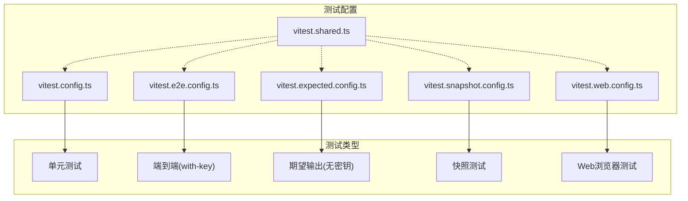
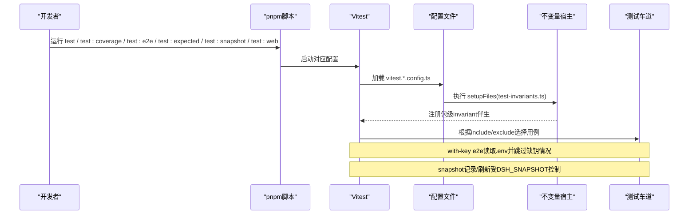
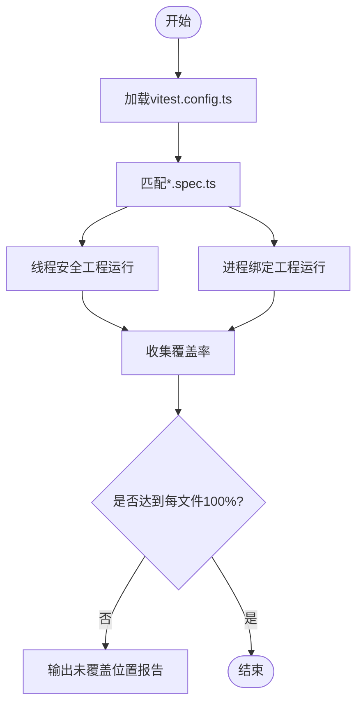
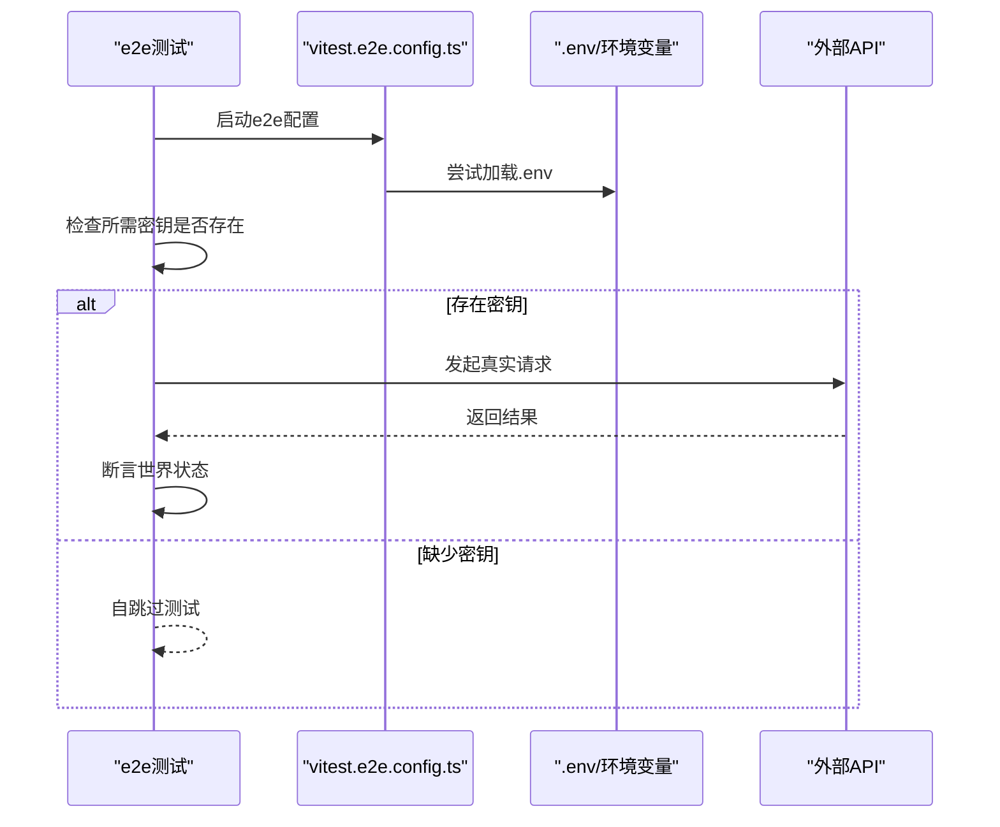
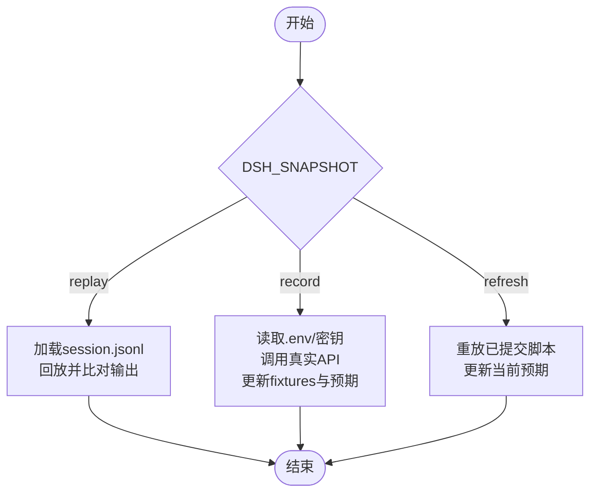
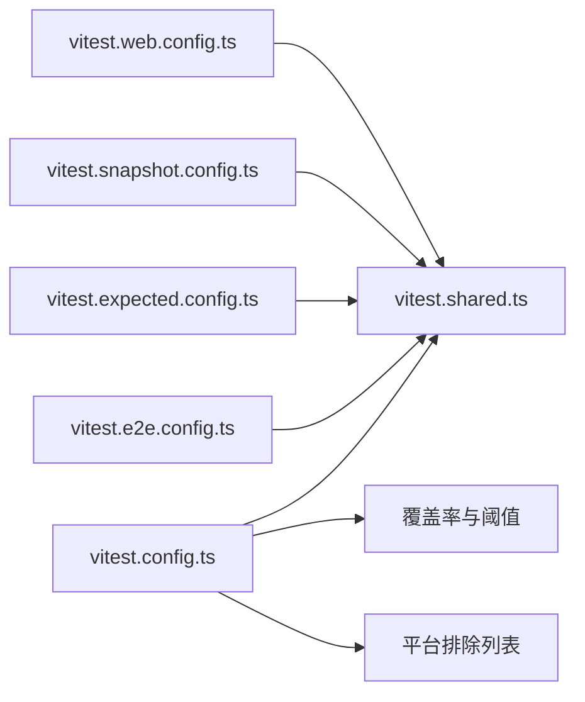

# 测试策略

<cite>
**本文引用的文件**
- [docs/testing.md](file://docs/testing.md)
- [package.json](file://package.json)
- [vitest.config.ts](file://vitest.config.ts)
- [vitest.e2e.config.ts](file://vitest.e2e.config.ts)
- [vitest.expected.config.ts](file://vitest.expected.config.ts)
- [vitest.snapshot.config.ts](file://vitest.snapshot.config.ts)
- [vitest.web.config.ts](file://vitest.web.config.ts)
- [vitest.shared.ts](file://vitest.shared.ts)
- [scripts/test-invariants.ts](file://scripts/test-invariants.ts)
- [AGENTS.md](file://AGENTS.md)
</cite>

## 目录
1. [简介](#简介)
2. [项目结构](#项目结构)
3. [核心组件](#核心组件)
4. [架构总览](#架构总览)
5. [详细组件分析](#详细组件分析)
6. [依赖关系分析](#依赖关系分析)
7. [性能考量](#性能考量)
8. [故障排查指南](#故障排查指南)
9. [结论](#结论)
10. [附录](#附录)

## 简介
本文件面向DeepSeek Harness的测试策略，系统化说明分层测试（单元测试、集成测试、端到端测试、快照测试）的职责边界、覆盖率要求与执行方式；明确with-key与without-key策略、测试夹具管理、资源清理机制；给出编写高质量用例的最佳实践、命令使用指南与CI/CD集成要点。目标是让不同技术背景的读者都能理解并正确参与测试工作。

## 项目结构
仓库采用多包Monorepo布局，测试按层组织：
- 单元测试：位于各包的tests目录，遵循“与代码同域”原则，覆盖业务逻辑、错误路径、并发与事件顺序等。
- 端到端测试：分为真实API调用（with-key）与无密钥期望输出（without-key）。
- 快照测试：基于已录制会话回放或构建产物对比，确保模型/协议/用户可见变更可追溯。
- Web浏览器测试：在Chromium下比较会话驱动输出与UI输出，CI强制只读回放模式。

图表来源
- [vitest.config.ts:150-191](file://vitest.config.ts#L150-L191)
- [vitest.e2e.config.ts:31-61](file://vitest.e2e.config.ts#L31-L61)
- [vitest.expected.config.ts:7-19](file://vitest.expected.config.ts#L7-L19)
- [vitest.snapshot.config.ts:39-67](file://vitest.snapshot.config.ts#L39-L67)
- [vitest.web.config.ts:16-37](file://vitest.web.config.ts#L16-L37)
- [vitest.shared.ts:15-42](file://vitest.shared.ts#L15-L42)

章节来源
- [docs/testing.md:7-16](file://docs/testing.md#L7-L16)
- [package.json:19-66](file://package.json#L19-L66)

## 核心组件
- 统一测试入口与脚本：通过根package.json暴露test、test:coverage、test:e2e、test:expected、test:snapshot、test:web等命令，分别对应不同测试层与场景。
- Vitest多工程与覆盖率门控：默认工程拆分thread-safe与process-bound两类，覆盖率以v8提供器统计，强制每文件100%阈值（含语句、分支、函数、行），并通过自定义报告器输出未覆盖位置。
- 装饰器预处理：共享插件在Vite解析前将TypeScript装饰器转译为ES2024，避免运行时差异。
- 不变量宿主：全局setup注入测试不变量服务，自动挂载各包invariant companion，保证插件注册与生命周期一致性。

章节来源
- [package.json:19-66](file://package.json#L19-L66)
- [vitest.config.ts:150-191](file://vitest.config.ts#L150-L191)
- [vitest.config.ts:192-362](file://vitest.config.ts#L192-L362)
- [vitest.shared.ts:15-42](file://vitest.shared.ts#L15-L42)
- [scripts/test-invariants.ts:1-47](file://scripts/test-invariants.ts#L1-L47)

## 架构总览
下图展示测试层与配置的映射关系，以及关键环境变量对行为的影响。

图表来源
- [package.json:19-66](file://package.json#L19-L66)
- [vitest.e2e.config.ts:5-14](file://vitest.e2e.config.ts#L5-L14)
- [vitest.snapshot.config.ts:24-37](file://vitest.snapshot.config.ts#L24-L37)
- [scripts/test-invariants.ts:159-210](file://scripts/test-invariants.ts#L159-L210)

## 详细组件分析

### 单元测试（Unit Tests）
- 范围：packages/*/tests/**/*.spec.ts、apps/*/tests/**/*.spec.ts、scripts/**/*.spec.ts。
- 目标：验证函数/类/模块行为，覆盖边缘情况、错误路径、事件顺序、并发竞态与持久化契约回归。
- 覆盖率：覆盖率门禁仅针对packages/*/*/src/**/*.{ts,tsx}，要求每文件100%（语句/分支/函数/行）。
- 隔离：线程安全用例与进程绑定用例分属不同工程，避免进程级状态污染。

图表来源
- [vitest.config.ts:112-116](file://vitest.config.ts#L112-L116)
- [vitest.config.ts:150-191](file://vitest.config.ts#L150-L191)
- [vitest.config.ts:192-362](file://vitest.config.ts#L192-L362)

章节来源
- [docs/testing.md:7-10](file://docs/testing.md#L7-L10)
- [vitest.config.ts:112-116](file://vitest.config.ts#L112-L116)
- [vitest.config.ts:150-191](file://vitest.config.ts#L150-L191)
- [vitest.config.ts:192-362](file://vitest.config.ts#L192-L362)

### 端到端测试（With-Key）
- 范围：apps/cli/tests/**/*.e2e.ts与packages/*/tests/**/*.e2e.ts。
- 行为：真实调用外部模型/服务，具备较长超时与重试；当缺少密钥时自跳过，保障无密钥CI与本地开发不受阻。
- 并发：可通过DSH_E2E_MAX_WORKERS限制并行度，避免配额争用。

图表来源
- [vitest.e2e.config.ts:5-14](file://vitest.e2e.config.ts#L5-L14)
- [vitest.e2e.config.ts:31-61](file://vitest.e2e.config.ts#L31-L61)

章节来源
- [docs/testing.md:11-12](file://docs/testing.md#L11-L12)
- [docs/testing.md:18-21](file://docs/testing.md#L18-L21)
- [vitest.e2e.config.ts:5-14](file://vitest.e2e.config.ts#L5-L14)
- [vitest.e2e.config.ts:31-61](file://vitest.e2e.config.ts#L31-L61)

### 端到端测试（Without-Key，期望输出）
- 范围：apps/cli/tests/**/*.expected.e2e.ts。
- 行为：不依赖外部密钥，通过组装CLI/进程期望输出进行校验；支持刷新期望值。
- 并发：最多按可用CPU数限制并行。

章节来源
- [docs/testing.md:12](file://docs/testing.md#L12)
- [vitest.expected.config.ts:6-19](file://vitest.expected.config.ts#L6-L19)

### 快照测试（Snapshot）
- 范围：snapshots/**/*.snapshot.ts及可选的apps/web/tests/**/*.snapshot.ts（取决于DSH_EXAMPLE_MODE）。
- 模式：
  - replay（默认）：从已录制session.jsonl回放输入，比对持久化结果与规范化输出，禁止写入预期文件。
  - record：读取密钥，调用真实API并更新fixtures与预期输出。
  - refresh：重放已提交脚本并更新当前预期输出。
- 并发：replay可并行但限制文件内并发；record/refresh串行以避免竞争写。

图表来源
- [vitest.snapshot.config.ts:24-37](file://vitest.snapshot.config.ts#L24-L37)
- [vitest.snapshot.config.ts:39-67](file://vitest.snapshot.config.ts#L39-L67)

章节来源
- [docs/testing.md:13-16](file://docs/testing.md#L13-L16)
- [vitest.snapshot.config.ts:24-37](file://vitest.snapshot.config.ts#L24-L37)
- [vitest.snapshot.config.ts:39-67](file://vitest.snapshot.config.ts#L39-L67)

### Web浏览器快照测试
- 范围：apps/web/tests/**/*.e2e.ts与*.snapshot.ts，以及特定inspector浏览器用例。
- 行为：构建前端后运行，CI强制只读回放模式（DSH_SNAPSHOT=replay），本地可刷新。
- 并发：文件串行执行，避免HMR与动态生命周期干扰。

章节来源
- [docs/testing.md:14](file://docs/testing.md#L14)
- [vitest.web.config.ts:5-14](file://vitest.web.config.ts#L5-L14)
- [vitest.web.config.ts:16-37](file://vitest.web.config.ts#L16-L37)

### 测试夹具管理与资源清理
- 不变量宿主：每个测试根自动挂载所属包的invariant companion，确保插件注册与生命周期一致；附件存储使用最小限制以加速测试。
- 资源清理：e2e测试需自行创建与销毁资源，afterEach中释放；共享夹具放在tests/harness.ts，避免重复注册。
- 子进程/工作线程：进程绑定用例单独工程运行，避免跨进程状态泄漏；worker相关用例在Linux lane持有差异对比。

章节来源
- [scripts/test-invariants.ts:114-135](file://scripts/test-invariants.ts#L114-L135)
- [scripts/test-invariants.ts:159-210](file://scripts/test-invariants.ts#L159-L210)
- [docs/testing.md:28-31](file://docs/testing.md#L28-L31)
- [vitest.config.ts:135-147](file://vitest.config.ts#L135-L147)

### 最佳实践：边缘情况、错误路径与并发
- 优先真实实现而非模拟：仅对昂贵或非确定性边界（LLM适配器、网络、时钟）做mock，下游保持真实。
- 验证“世界”，而非“自报告”：通过外部文件或命令重新读取结果断言；关键字探针不可靠。
- 覆盖恢复路径：分步覆盖失败点，证明失败chunk不产生消息或工具副作用；覆盖耗尽、取消、策略组合、持久化、状态、传输关闭空闲超时等。
- 并发与时间：关注事件顺序、竞态条件、超时与重试；进程绑定用例独立工程隔离。

章节来源
- [docs/testing.md:22-27](file://docs/testing.md#L22-L27)
- [docs/testing.md:28-31](file://docs/testing.md#L28-L31)

## 依赖关系分析
- 配置依赖：所有vitest配置均引入shared装饰器插件与paths解析，保证源码平面解析与装饰器兼容。
- 覆盖率依赖：v8提供器+自定义未覆盖位置报告；排除大量客户端/UI与实验性模块，聚焦产品源。
- 平台差异：Windows不支持bash/sandbox等套件；非Linux环境排除部分Worker对比用例；pwsh可用性影响覆盖率豁免。

图表来源
- [vitest.config.ts:150-191](file://vitest.config.ts#L150-L191)
- [vitest.config.ts:22-87](file://vitest.config.ts#L22-L87)
- [vitest.config.ts:192-362](file://vitest.config.ts#L192-L362)
- [vitest.shared.ts:15-42](file://vitest.shared.ts#L15-L42)

章节来源
- [vitest.config.ts:22-87](file://vitest.config.ts#L22-L87)
- [vitest.config.ts:192-362](file://vitest.config.ts#L192-L362)

## 性能考量
- 并行度控制：e2e通过DSH_E2E_MAX_WORKERS限制并发；snapshot在replay模式下允许文件级并行但限制文件内并发；web测试串行以避免HMR冲突。
- 超时设置：e2e与snapshot使用较长超时与重试，web测试更长超时以适应浏览器交互。
- 覆盖率开销：覆盖率门禁仅针对产品源，排除大量UI/实验模块；进程绑定用例独立工程减少干扰。

[本节为通用指导，无需具体文件引用]

## 故障排查指南
- 覆盖率不达标：查看未覆盖位置报告（由自定义报告器输出），确认是否属于被排除范围或需要补充测试；注意pwsh缺失导致的豁免。
- e2e自跳过：检查环境变量或.env是否包含所需密钥；确认provider端点配置。
- snapshot不一致：区分replay/record/refresh模式；CI仅回放不写入；本地刷新后需审查diff。
- web测试不稳定：确认已构建前端；CI强制只读回放；必要时降低并发或增加超时。

章节来源
- [vitest.config.ts:10-14](file://vitest.config.ts#L10-L14)
- [vitest.config.ts:98-110](file://vitest.config.ts#L98-L110)
- [vitest.e2e.config.ts:5-14](file://vitest.e2e.config.ts#L5-L14)
- [vitest.snapshot.config.ts:24-37](file://vitest.snapshot.config.ts#L24-L37)
- [vitest.web.config.ts:5-14](file://vitest.web.config.ts#L5-L14)

## 结论
DeepSeek Harness采用清晰的分层测试策略：以高覆盖率的单元测试为基础，辅以真实API的端到端测试与健壮的快照测试，确保模型、协议与用户可见变更的可追溯性与稳定性。通过严格的覆盖率门控、平台适配与环境变量控制，兼顾了本地开发与CI效率。遵循with-key/without-key策略、夹具与清理规范、以及“验证世界”的原则，可以持续产出高质量的测试用例。

[本节为总结性内容，无需具体文件引用]

## 附录

### 测试命令速查
- 单元测试：pnpm run test
- 覆盖率门禁：pnpm run test:coverage
- 端到端（with-key）：pnpm run test:e2e
- 期望输出（without-key）：pnpm run test:expected / pnpm run test:expected:refresh
- 快照测试：pnpm run test:snapshot / :record / :refresh
- Web浏览器测试：pnpm run test:web / :refresh / :ci / :perf / :stress

章节来源
- [package.json:19-66](file://package.json#L19-L66)
- [AGENTS.md:62-84](file://AGENTS.md#L62-L84)

### 环境变量与开关
- DEEPSEEK_API_KEY、EXA_API_KEY、PERPLEXITY_API_KEY等：用于with-key e2e与快照record。
- DSH_E2E_MAX_WORKERS：控制e2e并发。
- DSH_SNAPSHOT：replay（默认）、record、refresh。
- DSH_EXAMPLE_MODE：决定是否包含web快照用例。
- COVERAGE_EXEMPT_ENV、COVERAGE_PARTITION_MODE_ENV：覆盖率豁免与分区模式开关。

章节来源
- [vitest.e2e.config.ts:5-14](file://vitest.e2e.config.ts#L5-L14)
- [vitest.snapshot.config.ts:24-37](file://vitest.snapshot.config.ts#L24-L37)
- [vitest.config.ts:118-132](file://vitest.config.ts#L118-L132)

### 覆盖率例外与平台差异
- Windows不支持bash/sandbox等套件；非Linux环境排除部分Worker对比用例。
- pwsh缺失时豁免相应覆盖率文件，CI仍强制执行完整门槛。
- 客户端/UI/实验模块广泛排除，聚焦产品源覆盖率。

章节来源
- [vitest.config.ts:22-87](file://vitest.config.ts#L22-L87)
- [vitest.config.ts:192-362](file://vitest.config.ts#L192-L362)