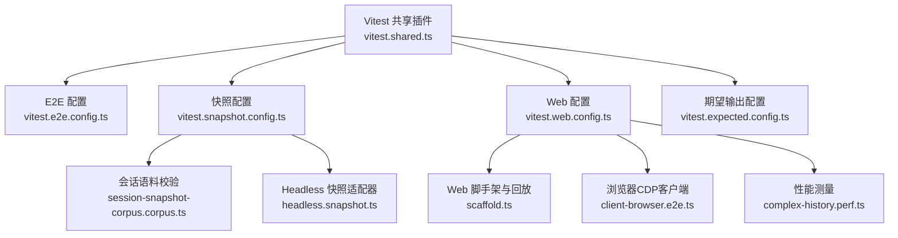
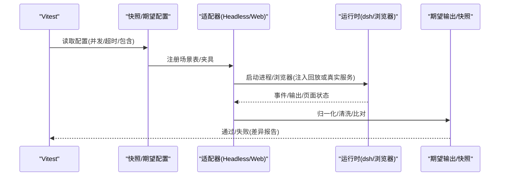
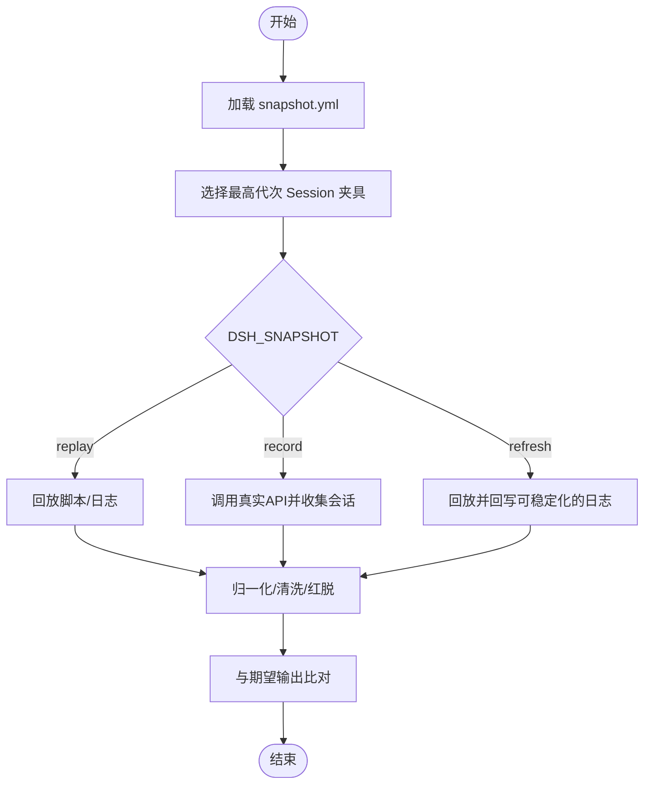
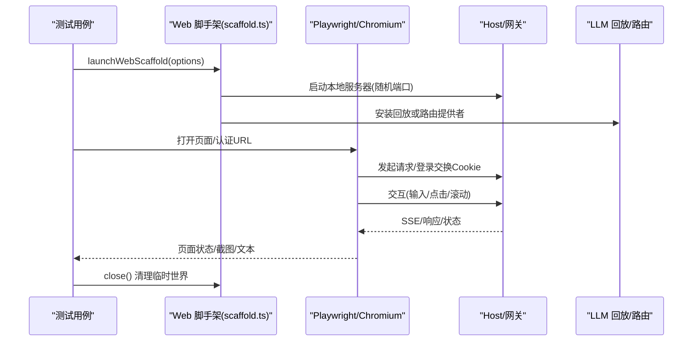
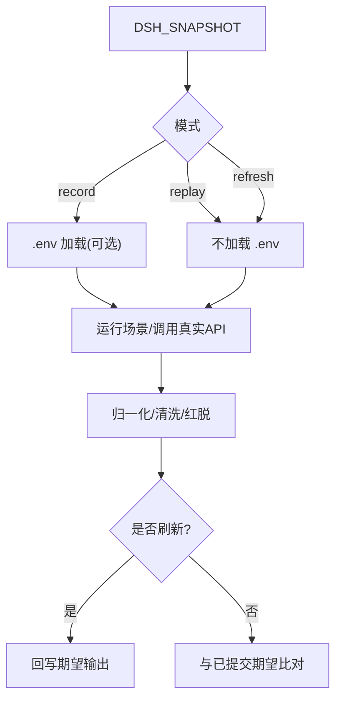
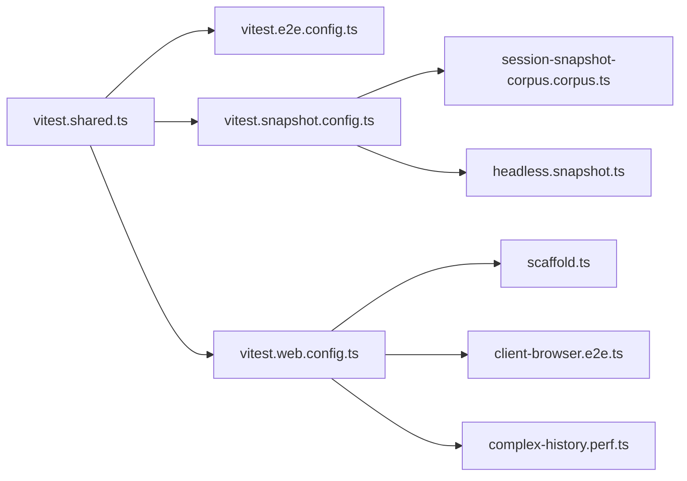

# 端到端测试与快照测试

<cite>
**本文引用的文件**
- [vitest.e2e.config.ts](file://vitest.e2e.config.ts)
- [vitest.snapshot.config.ts](file://vitest.snapshot.config.ts)
- [vitest.web.config.ts](file://vitest.web.config.ts)
- [vitest.expected.config.ts](file://vitest.expected.config.ts)
- [vitest.shared.ts](file://vitest.shared.ts)
- [testing.md](file://docs/testing.md)
- [session-snapshot-corpus.corpus.ts](file://scripts/session-snapshot-corpus.corpus.ts)
- [headless.snapshot.ts](file://snapshots/session/headless.snapshot.ts)
- [scaffold.ts](file://apps/web/tests/scaffold.ts)
- [client-browser.e2e.ts](file://packages/experimental/inspector/tests/client-browser.e2e.ts)
- [complex-history.perf.ts](file://apps/web/tests/complex-history.perf.ts)
- [index.ts](file://packages/test-support/session-snapshot/src/index.ts)
</cite>

## 目录
1. [简介](#简介)
2. [项目结构](#项目结构)
3. [核心组件](#核心组件)
4. [架构总览](#架构总览)
5. [详细组件分析](#详细组件分析)
6. [依赖关系分析](#依赖关系分析)
7. [性能考虑](#性能考虑)
8. [故障排查指南](#故障排查指南)
9. [结论](#结论)
10. [附录](#附录)

## 简介
本文件系统性梳理仓库中的端到端（E2E）与快照测试体系，覆盖会话驱动测试、浏览器自动化测试、CLI工具测试；解释快照测试的工作原理（录制、回放、预期结果验证）；说明Web界面测试的实现方式（Chromium自动化、UI组件测试、用户交互模拟）；给出快照管理流程（录制、更新、版本控制）、性能优化技巧与调试方法，以及测试环境搭建与配置指南。

## 项目结构
仓库通过多份 Vitest 配置文件划分不同测试车道：
- 真实API的E2E车道：针对带密钥的真实模型调用，隔离于其他套件，支持并发与重试。
- 快照车道：无密钥回放为主，支持录制与刷新模式，按场景并行或串行执行。
- Web浏览器车道：基于Chromium的会话驱动输出与UI快照对比。
- 期望输出车道：不依赖录制会话的组装式CLI/进程期望断言。

**图表来源**
- [vitest.shared.ts:1-43](file://vitest.shared.ts#L1-L43)
- [vitest.e2e.config.ts:1-63](file://vitest.e2e.config.ts#L1-L63)
- [vitest.snapshot.config.ts:1-68](file://vitest.snapshot.config.ts#L1-L68)
- [vitest.web.config.ts:1-38](file://vitest.web.config.ts#L1-L38)
- [vitest.expected.config.ts:1-19](file://vitest.expected.config.ts#L1-L19)
- [session-snapshot-corpus.corpus.ts:1-210](file://scripts/session-snapshot-corpus.corpus.ts#L1-L210)
- [headless.snapshot.ts:1-941](file://snapshots/session/headless.snapshot.ts#L1-L941)
- [scaffold.ts:1-800](file://apps/web/tests/scaffold.ts#L1-L800)
- [client-browser.e2e.ts:30-65](file://packages/experimental/inspector/tests/client-browser.e2e.ts#L30-L65)
- [complex-history.perf.ts:520-547](file://apps/web/tests/complex-history.perf.ts#L520-L547)

**章节来源**
- [vitest.e2e.config.ts:1-63](file://vitest.e2e.config.ts#L1-L63)
- [vitest.snapshot.config.ts:1-68](file://vitest.snapshot.config.ts#L1-L68)
- [vitest.web.config.ts:1-38](file://vitest.web.config.ts#L1-L38)
- [vitest.expected.config.ts:1-19](file://vitest.expected.config.ts#L1-L19)
- [vitest.shared.ts:1-43](file://vitest.shared.ts#L1-L43)
- [testing.md:1-55](file://docs/testing.md#L1-L55)

## 核心组件
- 会话快照支持库：提供运行器、归一化、工作区快照、清单解析、适配器等能力，被各快照适配器复用。
- Headless 快照适配器：通过已构建的 CLI 入口驱动真实进程，完成录制/回放/刷新与持久化会话比对。
- Web 脚手架：在真实宿主入口上装配测试专用组合，注入回放提供者或路由提供者，配合 Playwright 进行浏览器自动化与截图/文本断言。
- 浏览器CDP客户端：用于与 Chromium 通信，发送协议命令并等待响应。
- 性能测量：通过 CDP 指标采集内存、节点、监听器等，支撑回归基线。

**章节来源**
- [index.ts:1-116](file://packages/test-support/session-snapshot/src/index.ts#L1-L116)
- [headless.snapshot.ts:1-941](file://snapshots/session/headless.snapshot.ts#L1-L941)
- [scaffold.ts:1-800](file://apps/web/tests/scaffold.ts#L1-L800)
- [client-browser.e2e.ts:30-65](file://packages/experimental/inspector/tests/client-browser.e2e.ts#L30-L65)
- [complex-history.perf.ts:520-547](file://apps/web/tests/complex-history.perf.ts#L520-L547)

## 架构总览
端到端与快照测试由“配置层 + 适配器层 + 运行时层”构成：
- 配置层：定义包含范围、超时、并发、环境变量加载等。
- 适配器层：将具体场景（CLI、Web、ACP、SDK）映射到统一的录制/回放/刷新流程。
- 运行时层：启动真实进程或服务（CLI、Web Server），使用 Playwright/CDP 驱动浏览器，或通过子进程执行 dsh。

**图表来源**
- [vitest.snapshot.config.ts:1-68](file://vitest.snapshot.config.ts#L1-L68)
- [vitest.web.config.ts:1-38](file://vitest.web.config.ts#L1-L38)
- [headless.snapshot.ts:1-941](file://snapshots/session/headless.snapshot.ts#L1-L941)
- [scaffold.ts:1-800](file://apps/web/tests/scaffold.ts#L1-L800)

## 详细组件分析

### 会话驱动测试（Headless）
- 通过已构建的 CLI 入口驱动真实进程，读取 scenario 清单，选择父/子会话夹具，执行录制/回放/刷新。
- 对持久化会话、stdout、stderr、系统提示、工具Schema等进行归一化与清洗，写入或比对期望输出。
- 支持侧车文件（system-prompt.expected.md、tool-schemas.expected.json）独立维护。

**图表来源**
- [headless.snapshot.ts:1-941](file://snapshots/session/headless.snapshot.ts#L1-L941)
- [session-snapshot-corpus.corpus.ts:1-210](file://scripts/session-snapshot-corpus.corpus.ts#L1-L210)

**章节来源**
- [headless.snapshot.ts:1-941](file://snapshots/session/headless.snapshot.ts#L1-L941)
- [session-snapshot-corpus.corpus.ts:1-210](file://scripts/session-snapshot-corpus.corpus.ts#L1-L210)

### 浏览器自动化测试（Web）
- 使用真实宿主入口与打包产物，装配测试专用组合（临时持久化、固定端口、禁用遥测等）。
- 注入回放提供者或仅路由提供者，避免真实模型调用；Playwright 驱动 Chromium，固定视口与语言。
- 通过角色、data-* 属性与可见文本定位元素，采集帧与会话区域，进行截图与文本断言。

**图表来源**
- [scaffold.ts:1-800](file://apps/web/tests/scaffold.ts#L1-L800)
- [client-browser.e2e.ts:30-65](file://packages/experimental/inspector/tests/client-browser.e2e.ts#L30-L65)

**章节来源**
- [scaffold.ts:1-800](file://apps/web/tests/scaffold.ts#L1-L800)
- [client-browser.e2e.ts:30-65](file://packages/experimental/inspector/tests/client-browser.e2e.ts#L30-L65)

### CLI 工具测试
- 通过已构建的 CLI 二进制或源码入口驱动真实进程，验证命令行参数、配置文件、退出码、输出流。
- 结合期望输出与录制会话，确保行为与契约一致。

**章节来源**
- [vitest.expected.config.ts:1-19](file://vitest.expected.config.ts#L1-L19)
- [headless.snapshot.ts:1-941](file://snapshots/session/headless.snapshot.ts#L1-L941)

### 快照测试工作原理
- 录制：在 record 模式下加载根 .env 获取密钥，调用真实模型，收集会话与期望输出。
- 回放：默认 keyless 模式，从已提交会话回放请求与响应，比较标准化后的协议或转录输出。
- 刷新：keyless 回放后重写当前期望输出，但不会改写已提交的 fixture。
- 语料校验：全局校验每个场景的清单、头信息、侧车文件、Session 格式版本与迁移集合。

**图表来源**
- [vitest.snapshot.config.ts:1-68](file://vitest.snapshot.config.ts#L1-L68)
- [session-snapshot-corpus.corpus.ts:1-210](file://scripts/session-snapshot-corpus.corpus.ts#L1-L210)

**章节来源**
- [vitest.snapshot.config.ts:1-68](file://vitest.snapshot.config.ts#L1-L68)
- [session-snapshot-corpus.corpus.ts:1-210](file://scripts/session-snapshot-corpus.corpus.ts#L1-L210)

### Web 界面测试实现要点
- 固定视口与语言，使用 role/data-* 与可见文本锚点，避免脆弱选择器。
- 分页驱动等待交互行退出 pending，滚动前记录行数基线，保证可观测性。
- 任何 pageerror 或连接丢失/修复警告都会导致失败，防止自愈掩盖问题。

**章节来源**
- [scaffold.ts:1-800](file://apps/web/tests/scaffold.ts#L1-L800)

### 测试快照管理流程
- 录制：生成 session.vN.jsonl、stdout.expected.jsonl、workspace.expected（如声明 final），并写入 sidecar。
- 更新：refresh 模式重写可稳定化的日志与 stdout，保留已提交 fixture 不被覆盖。
- 版本控制：强制 v2 主体与有限 v0/v1 迁移集合；头信息与侧车文件集中 pin，避免漂移。

**章节来源**
- [headless.snapshot.ts:1-941](file://snapshots/session/headless.snapshot.ts#L1-L941)
- [session-snapshot-corpus.corpus.ts:1-210](file://scripts/session-snapshot-corpus.corpus.ts#L1-L210)

## 依赖关系分析
- 配置层依赖共享插件以处理装饰器与执行参数。
- Headless 适配器依赖会话快照支持库进行归一化、清洗与工作区快照。
- Web 脚手架依赖 Cordis Loader、Include、Group 等插件机制，注入回放/路由提供者，并与 Playwright/CDP 协作。
- 性能测量依赖 CDP 指标接口。

**图表来源**
- [vitest.shared.ts:1-43](file://vitest.shared.ts#L1-L43)
- [vitest.e2e.config.ts:1-63](file://vitest.e2e.config.ts#L1-L63)
- [vitest.snapshot.config.ts:1-68](file://vitest.snapshot.config.ts#L1-L68)
- [vitest.web.config.ts:1-38](file://vitest.web.config.ts#L1-L38)
- [session-snapshot-corpus.corpus.ts:1-210](file://scripts/session-snapshot-corpus.corpus.ts#L1-L210)
- [headless.snapshot.ts:1-941](file://snapshots/session/headless.snapshot.ts#L1-L941)
- [scaffold.ts:1-800](file://apps/web/tests/scaffold.ts#L1-L800)
- [client-browser.e2e.ts:30-65](file://packages/experimental/inspector/tests/client-browser.e2e.ts#L30-L65)
- [complex-history.perf.ts:520-547](file://apps/web/tests/complex-history.perf.ts#L520-L547)

**章节来源**
- [vitest.shared.ts:1-43](file://vitest.shared.ts#L1-L43)
- [vitest.e2e.config.ts:1-63](file://vitest.e2e.config.ts#L1-L63)
- [vitest.snapshot.config.ts:1-68](file://vitest.snapshot.config.ts#L1-L68)
- [vitest.web.config.ts:1-38](file://vitest.web.config.ts#L1-L38)

## 性能考虑
- 并发控制：E2E 与快照可通过环境变量限制最大工作进程数，避免共享配额竞争。
- 超时预算：为真实API与Web测试设置更宽松的超时，减少瞬态抖动导致的失败。
- 浏览器性能：通过 CDP 指标采集堆内存、DOM 节点、事件监听器数量，建立基线并检测泄漏。
- 回放节奏：在回放中设置分块延迟，使浏览器能观察到增量SSE，提升稳定性与可观测性。

**章节来源**
- [vitest.e2e.config.ts:1-63](file://vitest.e2e.config.ts#L1-L63)
- [vitest.snapshot.config.ts:1-68](file://vitest.snapshot.config.ts#L1-L68)
- [complex-history.perf.ts:520-547](file://apps/web/tests/complex-history.perf.ts#L520-L547)
- [scaffold.ts:1-800](file://apps/web/tests/scaffold.ts#L1-L800)

## 故障排查指南
- 缺少密钥：record 模式需要 DEEPSEEK_API_KEY；若未提供会抛出明确错误。
- 端口冲突：确保监听绑定 OS 分配端口（port: 0），避免硬编码端口导致 CI 不稳定。
- 资源清理：脚手架在 close 时释放 Fiber、删除临时工作区与持久化根，聚合所有清理失败以便诊断。
- 回放消费检查：teardown 阶段检查回放句柄是否完全消费，未耗尽将报错，便于发现少放/错绑。
- 浏览器异常：pageerror 或连接丢失/修复警告直接失败，避免自愈掩盖问题。

**章节来源**
- [scaffold.ts:1-800](file://apps/web/tests/scaffold.ts#L1-L800)
- [headless.snapshot.ts:1-941](file://snapshots/session/headless.snapshot.ts#L1-L941)

## 结论
该仓库构建了分层清晰、可复用的端到端与快照测试体系：通过多套 Vitest 配置隔离不同车道，借助会话快照支持库统一录制/回放/刷新流程，并以 Headless 与 Web 两种适配器覆盖 CLI 与浏览器场景。严格的清单与侧车管理、稳定的归一化与清洗策略、以及完善的并发与超时控制，使得测试既具备高保真度又具备良好的可维护性与可扩展性。

## 附录
- 测试政策与层级说明：参见文档中的测试分层、with-key 策略、真实入口路径测试原则等。
- 环境搭建与配置：
  - 安装依赖并准备 Node 环境。
  - 根据车道设置环境变量：DSH_E2E_MAX_WORKERS、DSH_SNAPSHOT、DSH_SNAPSHOT_MAX_CONCURRENCY。
  - 录制模式需准备 DEEPSEEK_API_KEY（或根 .env）。
  - 首次运行建议先执行快照回放，确认基线后再进行录制或刷新。

**章节来源**
- [testing.md:1-55](file://docs/testing.md#L1-L55)
- [vitest.e2e.config.ts:1-63](file://vitest.e2e.config.ts#L1-L63)
- [vitest.snapshot.config.ts:1-68](file://vitest.snapshot.config.ts#L1-L68)
- [vitest.web.config.ts:1-38](file://vitest.web.config.ts#L1-L38)