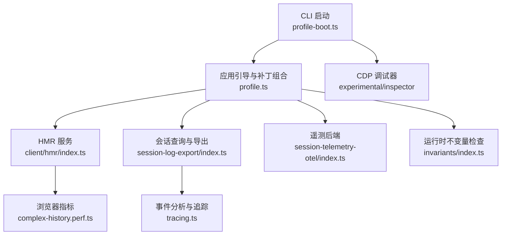
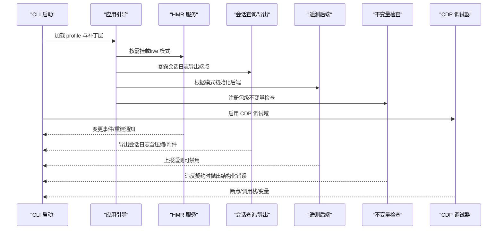
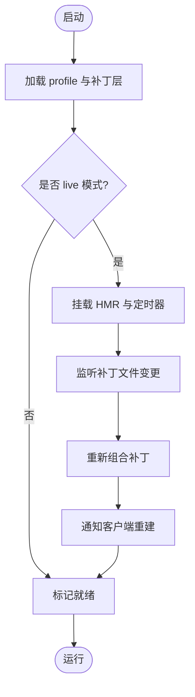
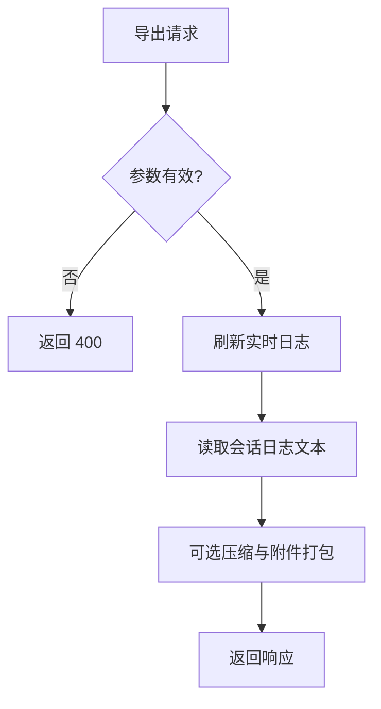
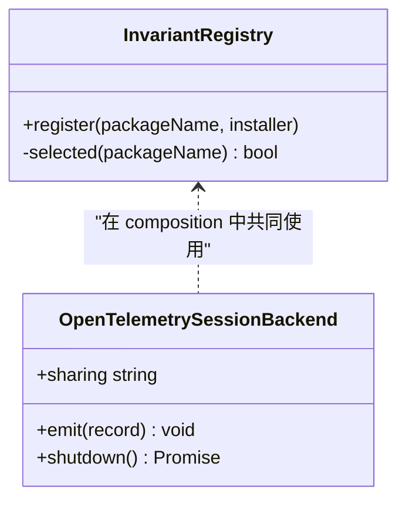
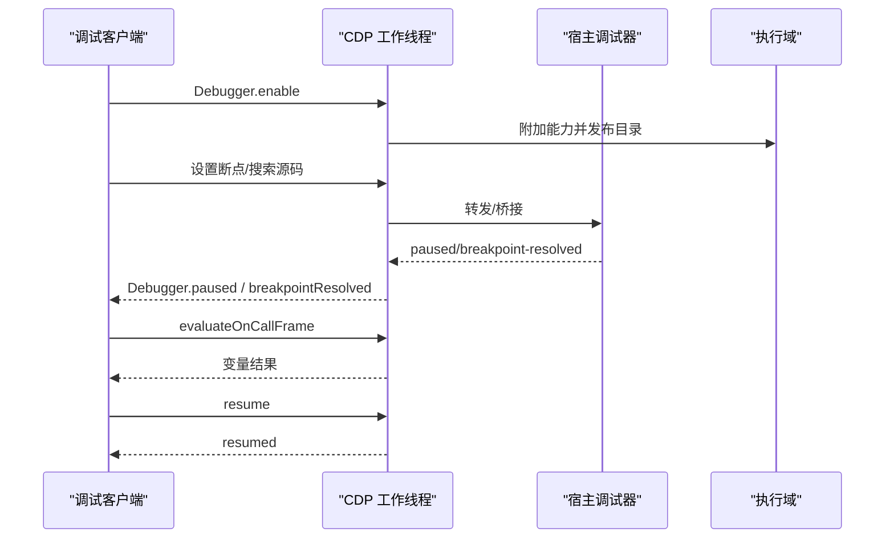
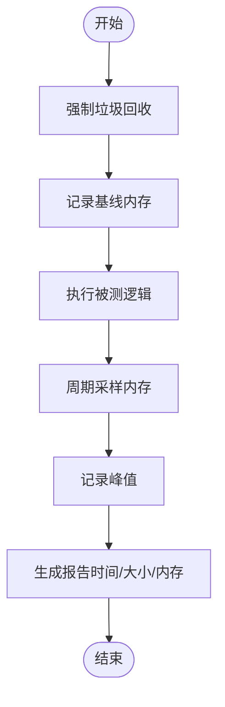
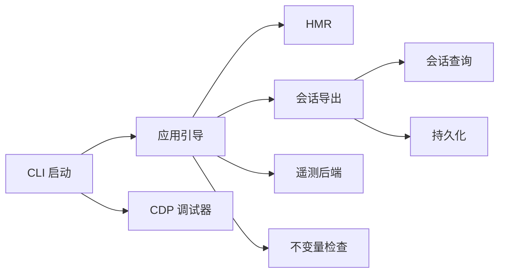

# 调试工具与方法

<cite>
**本文引用的文件**
- [profile-boot.ts](file://apps/cli/src/profile-boot.ts)
- [profile.ts](file://packages/boot/app-boot/src/profile.ts)
- [index.ts（HMR）](file://packages/client/hmr/src/index.ts)
- [inherited.md](file://docs/cordis-api/inherited.md)
- [hmr-config.spec.ts](file://packages/boot/app-boot/tests/hmr-config.spec.ts)
- [session-controller/history.ts](file://packages/api/session-controller/src/history.ts)
- [tracing.ts](file://packages/session-query/session-query/src/tracing.ts)
- [session-log-export/index.ts](file://packages/session-query/session-log-export/src/index.ts)
- [session-telemetry-otel/index.ts](file://packages/session/session-telemetry-otel/src/index.ts)
- [session-telemetry/index.ts](file://packages/session/session-telemetry/src/index.ts)
- [runtime-diagnostics/README.md](file://packages/runtime-diagnostics/README.md)
- [invariants/index.ts](file://packages/runtime-diagnostics/invariants/src/index.ts)
- [worker/cdp/dom/debugger/session.ts](file://packages/experimental/inspector/src/worker/cdp/domains/debugger/session.ts)
- [worker/realms/host/debugger.ts](file://packages/experimental/inspector/src/worker/realms/host/debugger.ts)
- [worker/cdp/domains/debugger/projector.ts](file://packages/experimental/inspector/src/worker/cdp/domains/debugger/projector.ts)
- [complex-history.perf.ts](file://apps/web/tests/complex-history.perf.ts)
- [history-transport.perf.client.ts](file://packages/client/ui-conversation/tests/history-transport.perf.client.ts)
</cite>

## 目录
1. [简介](#简介)
2. [项目结构](#项目结构)
3. [核心组件](#核心组件)
4. [架构总览](#架构总览)
5. [详细组件分析](#详细组件分析)
6. [依赖关系分析](#依赖关系分析)
7. [性能考量](#性能考量)
8. [故障排查指南](#故障排查指南)
9. [结论](#结论)
10. [附录](#附录)

## 简介
本文件面向开发者与运维人员，系统化梳理 DeepSeek Harness 的调试工具与方法，覆盖：
- 内置诊断能力：日志、运行时不变量检查、会话事件追踪、遥测导出。
- 开发模式调试：热重载（HMR）、断点调试、变量监视。
- 会话调试技术：事件流分析、状态跟踪、错误定位。
- 远程调试与分布式调试思路。
- 常见问题诊断流程与解决方案。
- 生产环境监控与故障排查方法。
- 最佳实践与性能调优技巧。

## 项目结构
调试相关能力分布在 CLI 启动层、应用引导层、客户端 HMR、会话查询与导出、遥测后端以及实验性 CDP 调试器中。整体组织方式以“功能域”划分：
- 启动与配置：CLI profile 启动、补丁层组合、用户补丁热更新。
- 前端/客户端：HMR 插件、浏览器指标采集。
- 会话与事件：事件分页、折叠、导出、追踪分析。
- 遥测与诊断：开关控制、后端接入、运行时不变量检查。
- 调试器：CDP 协议桥接、断点、调用栈投影。

图表来源
- [profile-boot.ts:157-321](file://apps/cli/src/profile-boot.ts#L157-L321)
- [profile.ts:1-120](file://packages/boot/app-boot/src/profile.ts#L1-L120)
- [index.ts（HMR）:63-91](file://packages/client/hmr/src/index.ts#L63-L91)
- [session-log-export/index.ts:106-139](file://packages/session-query/session-log-export/src/index.ts#L106-L139)
- [session-telemetry-otel/index.ts:141-168](file://packages/session/session-telemetry-otel/src/index.ts#L141-L168)
- [invariants/index.ts:94-197](file://packages/runtime-diagnostics/invariants/src/index.ts#L94-L197)
- [worker/cdp/domains/debugger/session.ts:48-123](file://packages/experimental/inspector/src/worker/cdp/domains/debugger/session.ts#L48-L123)

章节来源
- [profile-boot.ts:157-321](file://apps/cli/src/profile-boot.ts#L157-L321)
- [profile.ts:1-120](file://packages/boot/app-boot/src/profile.ts#L1-L120)

## 核心组件
- 启动与热重载
  - CLI profile 启动负责解析 profile、组合补丁层、安装代理、监听信号、挂载 HMR 并暴露就绪信号。
  - 应用引导维护模块回退、bundle 层、用户补丁层与覆盖层的组合顺序，支持 live 与 startup 两种热更新策略。
  - HMR 插件通过轮询或文件系统事件触发重建，并通过 SSE 通道通知客户端刷新。
- 会话调试与事件追踪
  - 会话事件分页与折叠，支持当前可见面与日志面区分，便于定位被替换的事件。
  - 会话日志导出接口提供压缩与附件打包，便于离线分析。
- 遥测与诊断
  - 遥测后端支持全量、仅反馈、禁用三种模式；禁用时记录本地警告。
  - 运行时不变量检查按包注册，支持全局开关与包名白/黑名单过滤，失败抛出结构化异常。
- 调试器（CDP）
  - 实现 Debugger 域请求处理、断点解析、暂停/恢复、调用栈与返回值投影，支持多领域与多进程。

章节来源
- [profile-boot.ts:210-321](file://apps/cli/src/profile-boot.ts#L210-L321)
- [profile.ts:121-170](file://packages/boot/app-boot/src/profile.ts#L121-L170)
- [index.ts（HMR）:63-91](file://packages/client/hmr/src/index.ts#L63-L91)
- [session-controller/history.ts:373-409](file://packages/api/session-controller/src/history.ts#L373-L409)
- [tracing.ts:181-254](file://packages/session-query/session-query/src/tracing.ts#L181-L254)
- [session-log-export/index.ts:106-139](file://packages/session-query/session-log-export/src/index.ts#L106-L139)
- [session-telemetry-otel/index.ts:141-168](file://packages/session/session-telemetry-otel/src/index.ts#L141-L168)
- [invariants/index.ts:94-197](file://packages/runtime-diagnostics/invariants/src/index.ts#L94-L197)
- [worker/cdp/domains/debugger/session.ts:48-123](file://packages/experimental/inspector/src/worker/cdp/domains/debugger/session.ts#L48-L123)

## 架构总览
下图展示从 CLI 启动到各调试能力的交互关系，包括 HMR、会话导出、遥测与不变量检查，以及 CDP 调试器。

图表来源
- [profile-boot.ts:210-321](file://apps/cli/src/profile-boot.ts#L210-L321)
- [profile.ts:121-170](file://packages/boot/app-boot/src/profile.ts#L121-L170)
- [index.ts（HMR）:63-91](file://packages/client/hmr/src/index.ts#L63-L91)
- [session-log-export/index.ts:106-139](file://packages/session-query/session-log-export/src/index.ts#L106-L139)
- [session-telemetry-otel/index.ts:141-168](file://packages/session/session-telemetry-otel/src/index.ts#L141-L168)
- [invariants/index.ts:94-197](file://packages/runtime-diagnostics/invariants/src/index.ts#L94-L197)
- [worker/cdp/domains/debugger/session.ts:48-123](file://packages/experimental/inspector/src/worker/cdp/domains/debugger/session.ts#L48-L123)

## 详细组件分析

### 启动与热重载（HMR）
- 启动流程
  - 解析 profile，组合 bundle 层、用户补丁层、home 补丁层与覆盖层。
  - 在 live 模式下自动挂载 HMR 与定时器，监听用户补丁文件变化并重新组合。
  - 暴露就绪信号，确保外部依赖在应用完全启动后再连接。
- HMR 机制
  - 通过轮询或文件系统事件检测变更，调用重建回调，向客户端发送 SSE 消息。
  - 测试覆盖精确路径与行为，确保最小化树不包含不必要的 HMR 模块。

图表来源
- [profile-boot.ts:210-321](file://apps/cli/src/profile-boot.ts#L210-L321)
- [index.ts（HMR）:63-91](file://packages/client/hmr/src/index.ts#L63-L91)
- [hmr-config.spec.ts:15-27](file://packages/boot/app-boot/tests/hmr-config.spec.ts#L15-L27)

章节来源
- [profile-boot.ts:210-321](file://apps/cli/src/profile-boot.ts#L210-L321)
- [index.ts（HMR）:63-91](file://packages/client/hmr/src/index.ts#L63-L91)
- [hmr-config.spec.ts:15-27](file://packages/boot/app-boot/tests/hmr-config.spec.ts#L15-L27)

### 会话事件分析与导出
- 事件分页与折叠
  - 分页函数按追加表面事件计数，结合 sourceEventSeqs 计算分组起始位置，返回 hasMore 标志。
  - 事件分析将事件映射为 current/shadowed/log-only 三类，便于理解 UI 可见性与历史日志的关系。
- 日志导出
  - 导出接口校验参数，等待实时日志落盘后读取文本内容，支持压缩与附件打包。

图表来源
- [session-controller/history.ts:373-409](file://packages/api/session-controller/src/history.ts#L373-L409)
- [tracing.ts:181-254](file://packages/session-query/session-query/src/tracing.ts#L181-L254)
- [session-log-export/index.ts:106-139](file://packages/session-query/session-log-export/src/index.ts#L106-L139)

章节来源
- [session-controller/history.ts:373-409](file://packages/api/session-controller/src/history.ts#L373-L409)
- [tracing.ts:181-254](file://packages/session-query/session-query/src/tracing.ts#L181-L254)
- [session-log-export/index.ts:106-139](file://packages/session-query/session-log-export/src/index.ts#L106-L139)

### 遥测与运行时不变量
- 遥测后端
  - 支持 FULL、FEEDBACK_ONLY、DISABLED 三种模式；禁用时仅记录本地警告，不上传数据。
  - 通过协调器统一捕获与上报，生命周期由后端管理。
- 运行时不变量
  - 每个包注册自身不变量检查，支持全局开关与包名白/黑名单过滤。
  - 违反契约时抛出带包名的结构化错误，便于快速定位责任方。

图表来源
- [invariants/index.ts:94-197](file://packages/runtime-diagnostics/invariants/src/index.ts#L94-L197)
- [session-telemetry-otel/index.ts:141-168](file://packages/session/session-telemetry-otel/src/index.ts#L141-L168)

章节来源
- [session-telemetry-otel/index.ts:141-168](file://packages/session/session-telemetry-otel/src/index.ts#L141-L168)
- [invariants/index.ts:94-197](file://packages/runtime-diagnostics/invariants/src/index.ts#L94-L197)
- [runtime-diagnostics/README.md:1-50](file://packages/runtime-diagnostics/README.md#L1-L50)

### 调试器（CDP）与断点调试
- 调试域处理
  - 支持 enable/disable、getScriptSource、searchInContent、evaluateOnCallFrame、pause/resume 等请求。
  - 对不支持的请求转发至原生实现，保证兼容性。
- 事件与投影
  - 将底层 paused/breakpoint-resolved/resumed 事件转换为标准 CDP 事件。
  - 调用栈帧、this、返回值进行对象投影，便于查看变量。
- 宿主侧桥接
  - 通过 HostNotificationChannel 订阅调试事件，封装 enable/pause/resume 等方法。

图表来源
- [worker/cdp/domains/debugger/session.ts:48-123](file://packages/experimental/inspector/src/worker/cdp/domains/debugger/session.ts#L48-L123)
- [worker/realms/host/debugger.ts:22-57](file://packages/experimental/inspector/src/worker/realms/host/debugger.ts#L22-L57)
- [worker/cdp/domains/debugger/projector.ts:65-88](file://packages/experimental/inspector/src/worker/cdp/domains/debugger/projector.ts#L65-L88)

章节来源
- [worker/cdp/domains/debugger/session.ts:48-123](file://packages/experimental/inspector/src/worker/cdp/domains/debugger/session.ts#L48-L123)
- [worker/realms/host/debugger.ts:22-57](file://packages/experimental/inspector/src/worker/realms/host/debugger.ts#L22-L57)
- [worker/cdp/domains/debugger/projector.ts:65-88](file://packages/experimental/inspector/src/worker/cdp/domains/debugger/projector.ts#L65-L88)

### 性能分析与内存泄漏检测
- 浏览器指标
  - 通过 CDP 获取 Performance.getMetrics，统计 DOM 节点数、事件监听器数量、JS Heap 使用等。
  - 收集保留状态用于回归对比。
- 内存峰值采样
  - 在测试环境中强制 GC，测量基线与峰值差异，评估额外堆占用。
  - 输出原始与压缩后的时间/大小对比，辅助优化。

图表来源
- [complex-history.perf.ts:520-547](file://apps/web/tests/complex-history.perf.ts#L520-L547)
- [history-transport.perf.client.ts:188-211](file://packages/client/ui-conversation/tests/history-transport.perf.client.ts#L188-L211)

章节来源
- [complex-history.perf.ts:520-547](file://apps/web/tests/complex-history.perf.ts#L520-L547)
- [history-transport.perf.client.ts:188-211](file://packages/client/ui-conversation/tests/history-transport.perf.client.ts#L188-L211)

## 依赖关系分析
- 启动层依赖应用引导与 HMR；应用引导维护补丁层组合与模块回退。
- 会话导出依赖会话查询与持久化服务；事件分析依赖会话事件模型。
- 遥测后端依赖会话事件流；不变量检查依赖 Cordis 上下文与服务注册。
- 调试器依赖 CDP 协议与执行域能力。

图表来源
- [profile-boot.ts:210-321](file://apps/cli/src/profile-boot.ts#L210-L321)
- [profile.ts:121-170](file://packages/boot/app-boot/src/profile.ts#L121-L170)
- [session-log-export/index.ts:106-139](file://packages/session-query/session-log-export/src/index.ts#L106-L139)
- [session-telemetry-otel/index.ts:141-168](file://packages/session/session-telemetry-otel/src/index.ts#L141-L168)
- [invariants/index.ts:94-197](file://packages/runtime-diagnostics/invariants/src/index.ts#L94-L197)
- [worker/cdp/domains/debugger/session.ts:48-123](file://packages/experimental/inspector/src/worker/cdp/domains/debugger/session.ts#L48-L123)

章节来源
- [profile-boot.ts:210-321](file://apps/cli/src/profile-boot.ts#L210-L321)
- [profile.ts:121-170](file://packages/boot/app-boot/src/profile.ts#L121-L170)

## 性能考量
- 热重载开销
  - 合理配置轮询间隔与忽略列表，避免频繁重建导致 CPU 抖动。
  - 在最小化树中排除不必要的 HMR 模块，减少带宽与解析成本。
- 事件处理
  - 分页与折叠仅在必要时启用，避免大会话的内存压力。
  - 导出时优先使用压缩格式，降低网络传输与存储成本。
- 遥测与不变量
  - 在生产环境默认禁用遥测或仅启用反馈模式，减少上报开销。
  - 使用包名过滤限制不变量检查范围，避免无关包的性能影响。
- 内存与堆
  - 使用强制 GC 与峰值采样识别热点路径，关注字符串与大型对象的生命周期。
  - 对比压缩前后的时间与大小，选择合适的数据表示。

[本节为通用指导，无需特定文件来源]

## 故障排查指南
- 热重载不生效
  - 确认 profile 是否为 live 模式；检查 HMR 是否已挂载；验证补丁文件路径与监听。
  - 参考测试用例中的期望行为，确保最小化树未包含多余 HMR 模块。
- 会话日志缺失或不可见
  - 检查导出接口参数是否正确；确认会话查询与持久化服务可用。
  - 使用事件分析区分当前面与日志面，定位被替换的事件。
- 遥测未上报
  - 检查遥测模式是否为 DISABLED；若禁用，仅记录本地警告。
  - 确认协调器与后端生命周期正常。
- 不变量报错
  - 根据抛出的包名定位责任包；检查包内契约是否符合预期。
  - 调整白/黑名单，聚焦问题包。
- 断点无效或无法查看变量
  - 确认已启用 Debugger 域；检查断点位置是否可解析。
  - 使用 evaluateOnCallFrame 查看局部变量与作用域。

章节来源
- [hmr-config.spec.ts:15-27](file://packages/boot/app-boot/tests/hmr-config.spec.ts#L15-L27)
- [session-log-export/index.ts:106-139](file://packages/session-query/session-log-export/src/index.ts#L106-L139)
- [session-telemetry-otel/index.ts:141-168](file://packages/session/session-telemetry-otel/src/index.ts#L141-L168)
- [invariants/index.ts:94-197](file://packages/runtime-diagnostics/invariants/src/index.ts#L94-L197)
- [worker/cdp/domains/debugger/session.ts:48-123](file://packages/experimental/inspector/src/worker/cdp/domains/debugger/session.ts#L48-L123)

## 结论
DeepSeek Harness 提供了完善的调试与诊断体系：从启动与热重载、会话事件分析、遥测与不变量检查，到 CDP 调试器与性能分析工具。通过合理的配置与实践，可在开发与生产环境中高效定位问题、保障稳定性与性能。建议：
- 开发阶段充分利用 HMR 与断点调试，结合事件分析与导出进行根因定位。
- 生产环境谨慎启用遥测与不变量检查，采用最小化配置与过滤策略。
- 持续进行性能基准与内存采样，优化关键路径与数据结构。

[本节为总结，无需特定文件来源]

## 附录
- 开发模式调试清单
  - 启用 live 模式与 HMR；配置轮询间隔与忽略列表。
  - 使用 CDP 调试器设置断点、查看调用栈与变量。
  - 通过会话导出获取完整事件序列，配合事件分析定位问题。
- 生产环境监控与排查
  - 遥测模式设为禁用或仅反馈；关注本地警告。
  - 开启必要的不变量检查并限定范围；定期审查违规报告。
  - 使用性能指标与内存采样建立基线，发现回归及时回滚。

[本节为补充信息，无需特定文件来源]