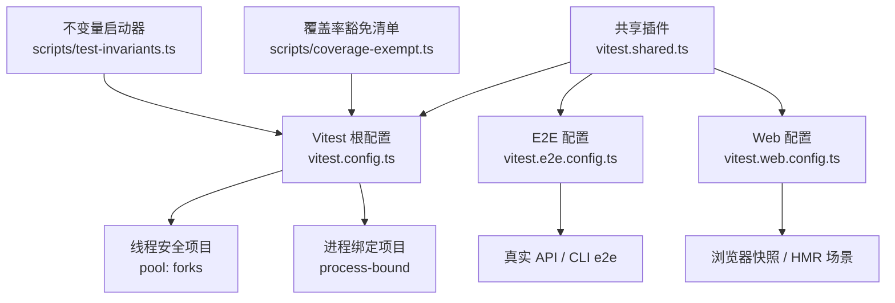
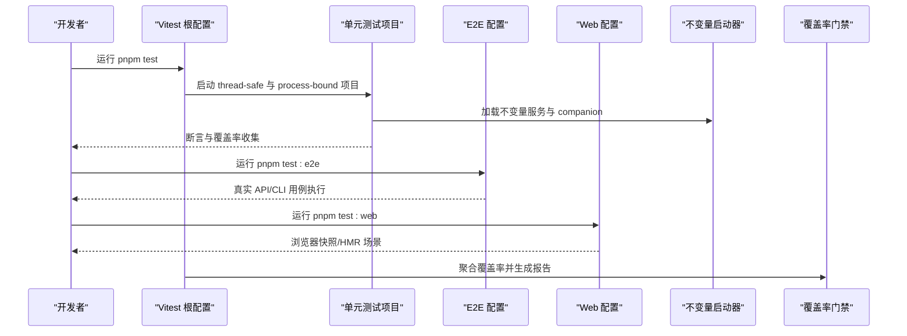
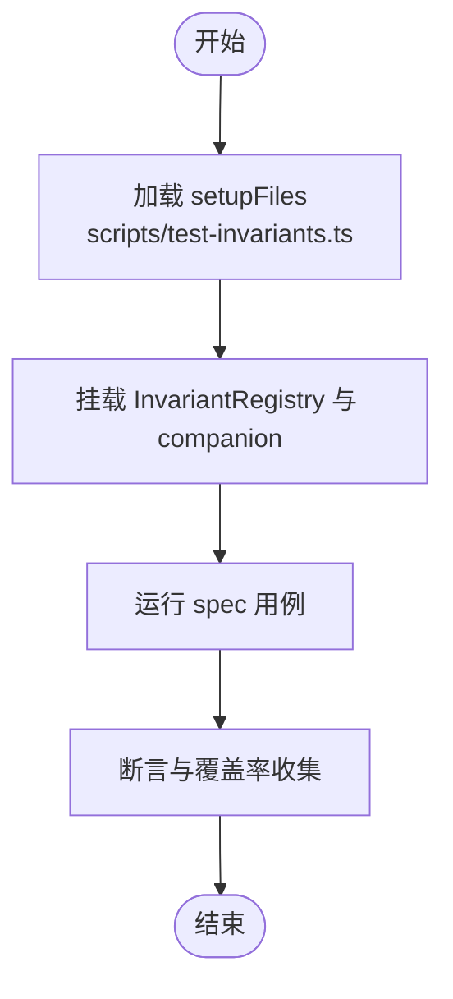
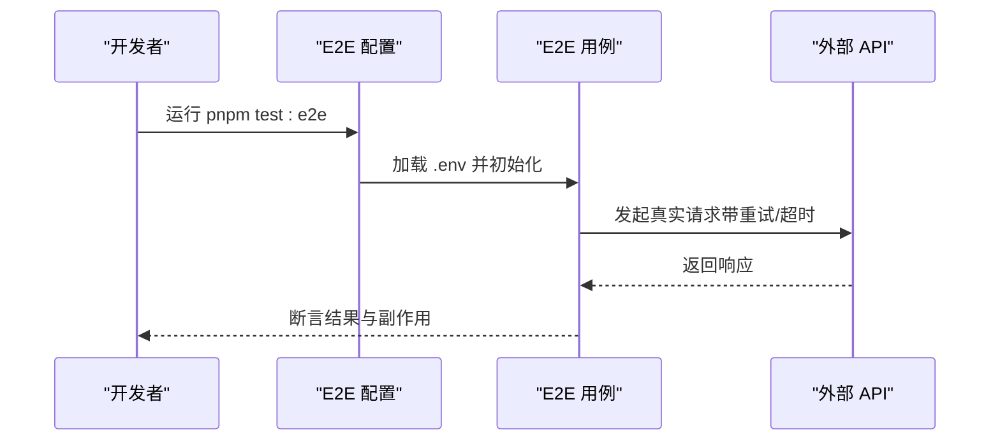
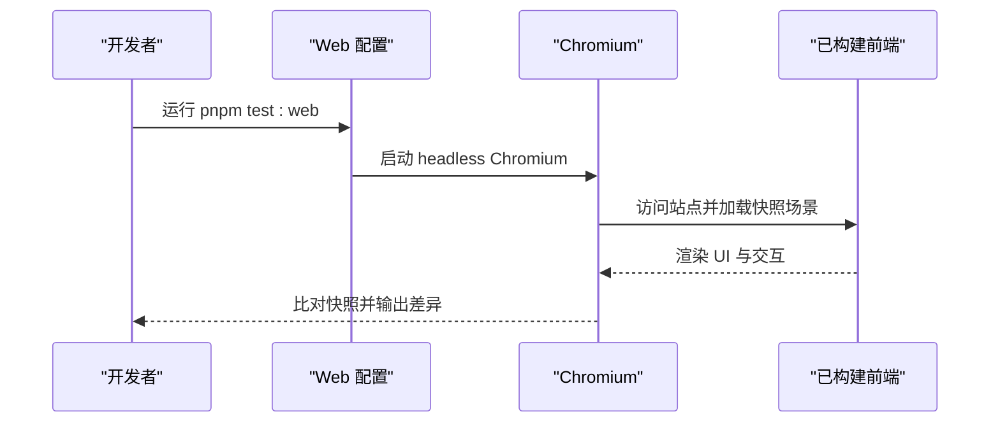
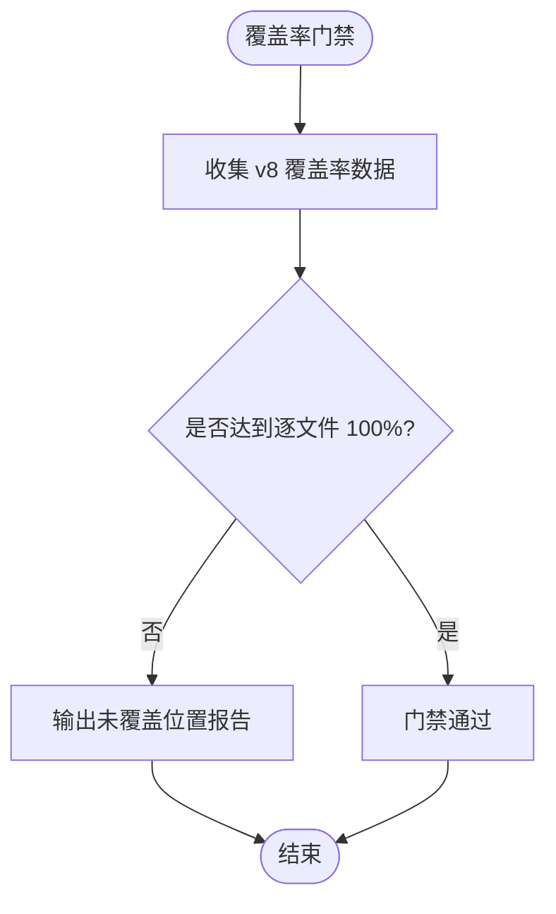
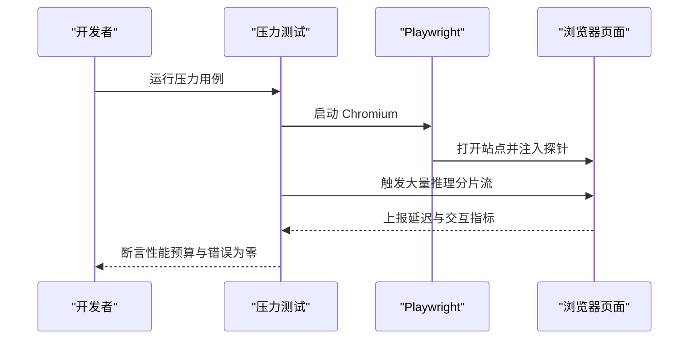
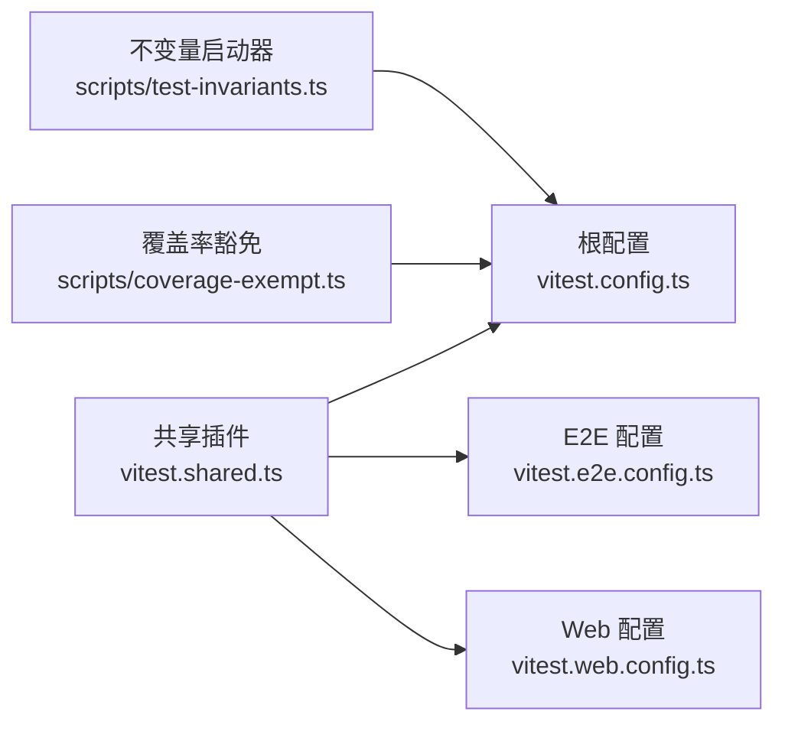

# 测试指南

<cite>
**本文引用的文件**
- [vitest.config.ts](file://vitest.config.ts)
- [vitest.e2e.config.ts](file://vitest.e2e.config.ts)
- [vitest.shared.ts](file://vitest.shared.ts)
- [vitest.web.config.ts](file://vitest.web.config.ts)
- [testing.md](file://docs/testing.md)
- [test-invariants.ts](file://scripts/test-invariants.ts)
- [coverage-exempt.ts](file://scripts/coverage-exempt.ts)
- [args.spec.ts](file://apps/cli/tests/args.spec.ts)
- [cleanup.e2e.ts](file://examples/acp-agent/tests/cleanup.e2e.ts)
- [reasoning-chunks.stress.ts](file://apps/web/stress-tests/reasoning-chunks.stress.ts)
</cite>

## 目录
1. [简介](#简介)
2. [项目结构](#项目结构)
3. [核心组件](#核心组件)
4. [架构总览](#架构总览)
5. [详细组件分析](#详细组件分析)
6. [依赖分析](#依赖分析)
7. [性能考虑](#性能考虑)
8. [故障排查指南](#故障排查指南)
9. [结论](#结论)
10. [附录](#附录)

## 简介
本指南面向 DeepSeek Harness 的测试实践，覆盖单元测试、集成测试、端到端（E2E）与浏览器快照测试、覆盖率门禁、性能与负载测试，以及持续集成中的自动化配置。文档基于仓库中现有的 Vitest 配置与测试规范，提供可操作的步骤、示例路径与最佳实践，帮助你在本地与 CI 中稳定地运行与维护测试套件。

## 项目结构
仓库采用多包 monorepo 组织，测试按层级与用途划分：
- 单元测试：位于各包的 tests 目录与 scripts 下的 spec 文件，使用 vitest 运行，包含线程安全与进程绑定两类执行项目。
- E2E 测试：针对真实 API 与 CLI 行为，独立配置文件，支持重试与并行度控制。
- Web 浏览器测试：针对前端构建产物与交互快照，串行执行以保证稳定性。
- 覆盖率门禁：对 packages/*/src 进行逐文件 100% 阈值检查，并提供未覆盖位置报告。
- 性能与压力测试：浏览器侧压力用例与性能回归场景。

图表来源
- [vitest.config.ts:128-170](file://vitest.config.ts#L128-L170)
- [vitest.e2e.config.ts:31-57](file://vitest.e2e.config.ts#L31-L57)
- [vitest.web.config.ts:16-35](file://vitest.web.config.ts#L16-L35)
- [vitest.shared.ts:15-42](file://vitest.shared.ts#L15-L42)
- [test-invariants.ts:1-47](file://scripts/test-invariants.ts#L1-L47)
- [coverage-exempt.ts:1-43](file://scripts/coverage-exempt.ts#L1-L43)

章节来源
- [vitest.config.ts:90-170](file://vitest.config.ts#L90-L170)
- [vitest.e2e.config.ts:1-59](file://vitest.e2e.config.ts#L1-L59)
- [vitest.web.config.ts:1-37](file://vitest.web.config.ts#L1-L37)
- [vitest.shared.ts:1-43](file://vitest.shared.ts#L1-L43)
- [test-invariants.ts:1-47](file://scripts/test-invariants.ts#L1-L47)
- [coverage-exempt.ts:1-43](file://scripts/coverage-exempt.ts#L1-L43)

## 核心组件
- Vitest 根配置：定义测试包含范围、双项目（线程安全/进程绑定）、覆盖率策略与报告器。
- E2E 配置：加载 .env、设置超时、重试、并行度，聚焦真实 API 与 CLI 的 e2e 用例。
- Web 配置：浏览器环境下的快照与 HMR 场景，默认串行执行以保障稳定性。
- 共享插件：预转换 TypeScript 装饰器，统一 execArgv 以避免 Web Storage 冲突。
- 不变量启动器：在测试根自动挂载 invariants 服务与配套 companion，确保契约校验生效。
- 覆盖率豁免：将重型或编译器相关套件从仪器化运行中排除，保持门禁效率与正确性。

章节来源
- [vitest.config.ts:128-298](file://vitest.config.ts#L128-L298)
- [vitest.e2e.config.ts:31-57](file://vitest.e2e.config.ts#L31-L57)
- [vitest.web.config.ts:16-35](file://vitest.web.config.ts#L16-L35)
- [vitest.shared.ts:1-43](file://vitest.shared.ts#L1-L43)
- [test-invariants.ts:1-47](file://scripts/test-invariants.ts#L1-L47)
- [coverage-exempt.ts:1-43](file://scripts/coverage-exempt.ts#L1-L43)

## 架构总览
下图展示了测试在不同层级的入口与协作关系：单元测试通过根配置的双项目隔离；E2E 与 Web 测试各自拥有专用配置；不变量启动器在所有测试前注入契约校验；覆盖率门禁聚合所有包源码并输出详细报告。

图表来源
- [vitest.config.ts:128-170](file://vitest.config.ts#L128-L170)
- [vitest.e2e.config.ts:31-57](file://vitest.e2e.config.ts#L31-L57)
- [vitest.web.config.ts:16-35](file://vitest.web.config.ts#L16-L35)
- [test-invariants.ts:160-210](file://scripts/test-invariants.ts#L160-L210)
- [vitest.config.ts:171-298](file://vitest.config.ts#L171-L298)

## 详细组件分析

### 单元测试编写与运行
- 文件组织：每个包与脚本的 spec 文件位于 tests 或 scripts 下，遵循“就近测试”原则。
- 执行模型：
  - 线程安全项目：使用 fork 池避免共享状态污染，适合大多数单元场景。
  - 进程绑定项目：针对进程全局状态、子进程与时序敏感的用例单独运行。
- 不变量注入：通过 setupFiles 加载不变量启动器，自动为测试根挂载 invariants 服务与对应 companion，保证契约校验在测试期间生效。
- 示例参考：
  - CLI 参数解析用例展示如何拦截 process.exit 并验证错误退出码与路由逻辑。
  - ACP 清理用例演示异步资源释放与异常聚合断言。

图表来源
- [vitest.config.ts:131-170](file://vitest.config.ts#L131-L170)
- [test-invariants.ts:160-210](file://scripts/test-invariants.ts#L160-L210)

章节来源
- [vitest.config.ts:128-170](file://vitest.config.ts#L128-L170)
- [test-invariants.ts:1-47](file://scripts/test-invariants.ts#L1-L47)
- [args.spec.ts:1-107](file://apps/cli/tests/args.spec.ts#L1-L107)
- [cleanup.e2e.ts:1-39](file://examples/acp-agent/tests/cleanup.e2e.ts#L1-L39)

### 端到端测试（真实 API/CLI）
- 配置要点：
  - 加载 .env 环境变量，支持密钥驱动的真实 API 调用。
  - 设置较长超时与重试，缓解并发配额导致的瞬态失败。
  - 限制文件级并行度，平衡 CI 速度与资源占用。
- 最佳实践：
  - 自包含资源管理：在每个测试中创建与销毁 harness，避免跨测试共享导致重复调用。
  - 关键路径冒烟：优先编写能引导真实应用并发送一次请求的冒烟用例，捕获“单测全绿但产品不可用”的问题。
  - 无密钥跳过：当缺少密钥时用例应自跳过，保证 keyless CI 绿色。

图表来源
- [vitest.e2e.config.ts:1-59](file://vitest.e2e.config.ts#L1-L59)

章节来源
- [vitest.e2e.config.ts:1-59](file://vitest.e2e.config.ts#L1-L59)
- [testing.md:1-50](file://docs/testing.md#L1-L50)

### Web 浏览器快照与 HMR 测试
- 配置要点：
  - 仅包含 apps/web/tests 下的 e2e 与 snapshot 文件。
  - 默认禁用文件级并行，保证 HMR 与动态生命周期场景的稳定。
  - 较长的钩子与测试超时，适配构建与回放流程。
- 最佳实践：
  - CI 强制只读回放模式，禁止写入预期输出，所有差异需人工审查。
  - 本地记录/刷新快照后，务必逐项审阅变更。

图表来源
- [vitest.web.config.ts:1-37](file://vitest.web.config.ts#L1-L37)

章节来源
- [vitest.web.config.ts:1-37](file://vitest.web.config.ts#L1-L37)
- [testing.md:1-50](file://docs/testing.md#L1-L50)

### 覆盖率报告生成与分析
- 策略：
  - 使用 v8 提供者测量 packages/*/src 的可执行代码。
  - 逐文件 100% 阈值门禁，未达标会报错并输出精确位置。
  - 自定义 reporter 输出未覆盖语句、分支与函数的具体行号。
- 豁免与分区：
  - 重型套件可在不仪器化的并行门中运行，不影响覆盖率门禁。
  - 分区模式下关闭阈值与报告，便于流水线拆分。
- 最佳实践：
  - 覆盖率是必要非充分条件，需结合行为断言与快照。
  - 对类型文件或入口二进制等无运行时代码的路径进行合理排除。

图表来源
- [vitest.config.ts:171-298](file://vitest.config.ts#L171-L298)
- [coverage-exempt.ts:1-43](file://scripts/coverage-exempt.ts#L1-L43)

章节来源
- [vitest.config.ts:171-298](file://vitest.config.ts#L171-L298)
- [coverage-exempt.ts:1-43](file://scripts/coverage-exempt.ts#L1-L43)

### 性能测试与负载测试
- 浏览器压力测试：
  - 通过 Playwright 启动 Chromium，注入大量推理分片流，测量主线程延迟与交互响应。
  - 使用心跳采样与事件监听评估渲染性能与可响应性。
- 性能回归保护：
  - 确定性用例守护发布计数、累积内容与抢占顺序。
  - 默认测试通道保持快速，显式性能证据用于定位问题。
- 建议：
  - 将压力测试作为可选通道，避免阻塞常规 CI。
  - 结合指标阈值与截图/日志，便于回溯与对比。

图表来源
- [reasoning-chunks.stress.ts:1-154](file://apps/web/stress-tests/reasoning-chunks.stress.ts#L1-L154)

章节来源
- [reasoning-chunks.stress.ts:1-154](file://apps/web/stress-tests/reasoning-chunks.stress.ts#L1-L154)
- [testing.md:1-50](file://docs/testing.md#L1-L50)

### 测试数据管理与模拟对象
- 数据管理：
  - 使用临时目录与文件系统工具创建/清理工作区，确保测试隔离。
  - 通过 fixtures 与快照维持稳定的输入与期望输出。
- 模拟对象：
  - 使用 vi.spyOn 拦截 process.exit/stdout/stderr，验证 CLI 行为。
  - 对外部依赖（网络、时钟、LLM 适配器）进行可控替换，保持下游链路真实。
- 最佳实践：
  - 仅在昂贵或非确定性边界使用 mock，其余保持真实实现。
  - 每个测试负责自身资源的生命周期，避免跨测试共享。

章节来源
- [args.spec.ts:1-107](file://apps/cli/tests/args.spec.ts#L1-L107)
- [cleanup.e2e.ts:1-39](file://examples/acp-agent/tests/cleanup.e2e.ts#L1-L39)
- [testing.md:1-50](file://docs/testing.md#L1-L50)

### 异步测试处理
- 超时与重试：
  - E2E 与 Web 测试设置较长超时与 hook 超时，适应构建与外部调用。
  - E2E 启用重试以缓解瞬态失败。
- 资源清理：
  - 在 afterEach 中清理临时目录与浏览器实例，确保失败或超时时也能释放资源。
- 最佳实践：
  - 明确区分同步与异步阶段，避免竞态条件。
  - 对可能失败的异步操作进行聚合错误断言，便于定位问题。

章节来源
- [vitest.e2e.config.ts:31-57](file://vitest.e2e.config.ts#L31-L57)
- [vitest.web.config.ts:16-35](file://vitest.web.config.ts#L16-L35)
- [cleanup.e2e.ts:1-39](file://examples/acp-agent/tests/cleanup.e2e.ts#L1-L39)

## 依赖分析
测试配置之间的依赖关系如下：
- 根配置依赖共享插件与不变量启动器，定义双项目与覆盖率策略。
- E2E 与 Web 配置复用共享插件，分别聚焦不同场景。
- 覆盖率豁免清单影响根配置的排除与阈值策略。

图表来源
- [vitest.shared.ts:15-42](file://vitest.shared.ts#L15-L42)
- [vitest.config.ts:128-170](file://vitest.config.ts#L128-L170)
- [vitest.e2e.config.ts:31-57](file://vitest.e2e.config.ts#L31-L57)
- [vitest.web.config.ts:16-35](file://vitest.web.config.ts#L16-L35)
- [test-invariants.ts:160-210](file://scripts/test-invariants.ts#L160-L210)
- [coverage-exempt.ts:1-43](file://scripts/coverage-exempt.ts#L1-L43)

章节来源
- [vitest.config.ts:128-170](file://vitest.config.ts#L128-L170)
- [vitest.e2e.config.ts:31-57](file://vitest.e2e.config.ts#L31-L57)
- [vitest.web.config.ts:16-35](file://vitest.web.config.ts#L16-L35)
- [test-invariants.ts:160-210](file://scripts/test-invariants.ts#L160-L210)
- [coverage-exempt.ts:1-43](file://scripts/coverage-exempt.ts#L1-L43)

## 性能考虑
- 并行与隔离：
  - 单元测试使用 fork 池隔离进程全局状态，避免竞争条件。
  - E2E 限制文件级并行，平衡速度与安全。
- 覆盖率开销：
  - 重型套件通过豁免机制在不仪器化通道运行，减少编译与子进程带来的开销。
- 浏览器性能：
  - 压力测试关注主线程延迟与交互响应，设定预算并断言。
- 建议：
  - 将耗时任务拆分为独立通道，避免阻塞关键路径。
  - 定期审视覆盖率豁免列表，确保其合理性。

章节来源
- [vitest.config.ts:114-170](file://vitest.config.ts#L114-L170)
- [coverage-exempt.ts:1-43](file://scripts/coverage-exempt.ts#L1-L43)
- [reasoning-chunks.stress.ts:1-154](file://apps/web/stress-tests/reasoning-chunks.stress.ts#L1-L154)

## 故障排查指南
- 常见失败原因：
  - 缺少密钥导致 E2E 自跳过或失败，需检查环境变量。
  - 浏览器快照差异，需确认回放模式与本地刷新流程。
  - 覆盖率未达标，查看未覆盖位置报告并补充测试或调整排除。
- 调试技巧：
  - 使用 vi.spyOn 拦截系统调用，验证 CLI 行为。
  - 在压力测试中采集指标与截图，辅助定位性能瓶颈。
- 资源清理：
  - 确保 afterEach 中清理临时目录与浏览器实例，避免残留影响后续测试。

章节来源
- [vitest.e2e.config.ts:1-59](file://vitest.e2e.config.ts#L1-L59)
- [vitest.web.config.ts:1-37](file://vitest.web.config.ts#L1-L37)
- [vitest.config.ts:171-298](file://vitest.config.ts#L171-L298)
- [args.spec.ts:1-107](file://apps/cli/tests/args.spec.ts#L1-L107)
- [cleanup.e2e.ts:1-39](file://examples/acp-agent/tests/cleanup.e2e.ts#L1-L39)

## 结论
DeepSeek Harness 的测试体系以 Vitest 为核心，分层覆盖单元、E2E、Web 快照与性能场景，并通过不变量启动器与覆盖率门禁保障质量。遵循本指南的配置与实践，可以在本地与 CI 中高效地运行与维护测试，快速定位问题并持续提升产品质量。

## 附录
- 命令速查：
  - 单元测试：pnpm run test
  - 覆盖率门禁：pnpm run test:coverage
  - E2E 测试：pnpm run test:e2e
  - Web 快照：pnpm run test:web
  - 快照记录/刷新：pnpm run test:snapshot:record / pnpm run test:snapshot:refresh
- 参考路径：
  - 测试策略与规范：[testing.md](file://docs/testing.md)
  - 不变量启动器：[test-invariants.ts](file://scripts/test-invariants.ts)
  - 覆盖率豁免：[coverage-exempt.ts](file://scripts/coverage-exempt.ts)
  - 示例用例：
    - CLI 参数解析：[args.spec.ts](file://apps/cli/tests/args.spec.ts)
    - ACP 清理：[cleanup.e2e.ts](file://examples/acp-agent/tests/cleanup.e2e.ts)
    - 浏览器压力：[reasoning-chunks.stress.ts](file://apps/web/stress-tests/reasoning-chunks.stress.ts)