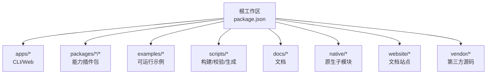
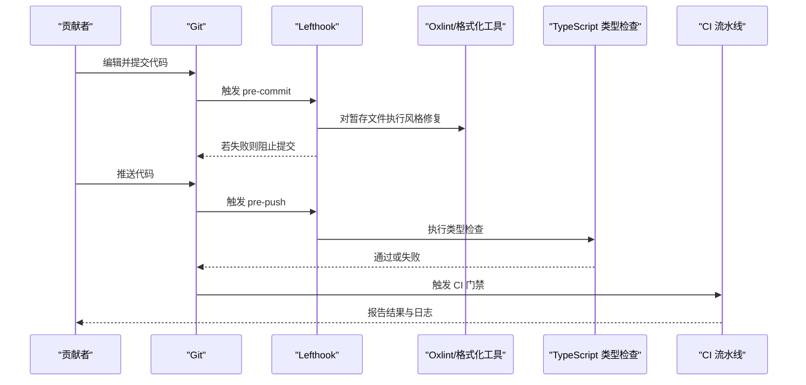
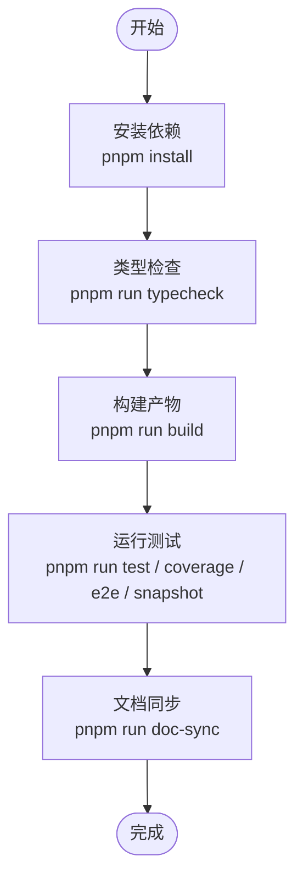
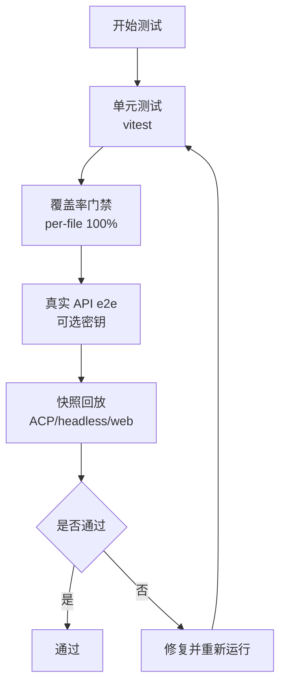
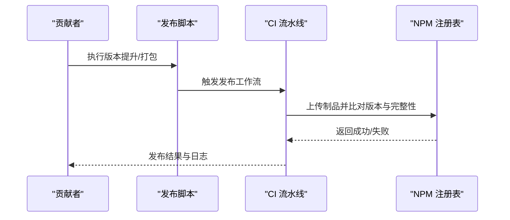
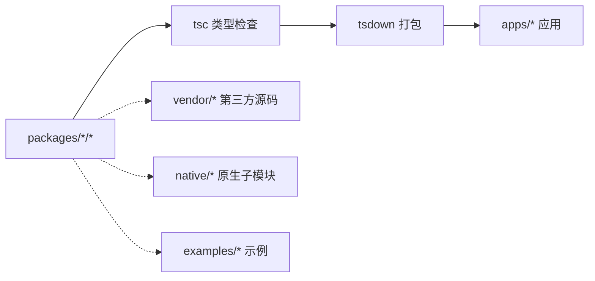

# 贡献指南

<cite>
**本文引用的文件**
- [CONTRIBUTING.md](file://CONTRIBUTING.md)
- [README.md](file://README.md)
- [package.json](file://package.json)
- [pnpm-workspace.yaml](file://pnpm-workspace.yaml)
- [lefthook.yml](file://lefthook.yml)
- [docs/development.md](file://docs/development.md)
- [docs/testing.md](file://docs/testing.md)
- [.oxlintrc.json](file://.oxlintrc.json)
- [vitest.config.ts](file://vitest.config.ts)
- [AGENTS.md](file://AGENTS.md)
- [docs/i18n/README.md](file://docs/i18n/README.md)
- [BRAND_GUIDELINES.md](file://BRAND_GUIDELINES.md)
- [.github/pull_request_template.md](file://.github/pull_request_template.md)
- [.github/workflows/ci.yml](file://.github/workflows/ci.yml)
- [.github/workflows/release.yml](file://.github/workflows/release.yml)
- [.github/workflows/python-release.yml](file://.github/workflows/python-release.yml)
- [.github/workflows/release-vendor.yml](file://.github/workflows/release-vendor.yml)
</cite>

## 目录
1. [简介](#简介)
2. [项目结构](#项目结构)
3. [核心组件](#核心组件)
4. [架构总览](#架构总览)
5. [详细组件分析](#详细组件分析)
6. [依赖分析](#依赖分析)
7. [性能考虑](#性能考虑)
8. [故障排查指南](#故障排查指南)
9. [结论](#结论)
10. [附录](#附录)

## 简介
本指南面向希望参与 DeepSeek Harness（简称 dsh）开发与维护的贡献者，涵盖开发环境搭建、仓库结构与职责划分、代码与提交规范、分支与合并策略、Pull Request 流程与审查要求、测试与质量保证、发布与版本管理、新贡献者入门以及社区行为准则与沟通渠道。当前项目处于开发者预览阶段，迭代迅速且可能包含破坏性变更；官方仓库暂不接收外部 Pull Request，但欢迎通过问题反馈、生态插件、文档与社区支持等方式参与。

**章节来源**
- [CONTRIBUTING.md:1-24](file://CONTRIBUTING.md#L1-L24)
- [README.md:9-53](file://README.md#L9-L53)

## 项目结构
仓库采用 pnpm monorepo 组织，根工作区聚合了产品应用、包集合、示例、网站与脚本工具等。关键目录与职责：
- apps：产品级可执行程序（CLI、Web 前端）
- packages：按能力域划分的插件包（core、llm、shell、session、web 等）
- examples：可运行的 Cordis 配置与演示用例
- scripts：构建、校验、生成与质量门禁脚本
- docs：架构、子系统、用户与开发者文档
- native：原生子模块（如 landlock-run）
- website：文档站点构建与发布
- vendor：第三方源码镜像与同步流程

**图表来源**
- [package.json:11-18](file://package.json#L11-L18)
- [pnpm-workspace.yaml:1-22](file://pnpm-workspace.yaml#L1-L22)

**章节来源**
- [package.json:11-18](file://package.json#L11-L18)
- [pnpm-workspace.yaml:1-22](file://pnpm-workspace.yaml#L1-L22)
- [AGENTS.md:9-58](file://AGENTS.md#L9-L58)

## 核心组件
- 构建与类型检查
  - 使用 TypeScript 双聚合（Host/Client），分别编译并打包，确保客户端与服务端边界清晰。
  - 提供 typecheck、lint、build 等命令，覆盖从源码到制品的完整链路。
- 本地钩子与质量门禁
  - Lefthook 在 pre-commit/pre-push 阶段执行翻译配对校验、staged 代码风格修复、第三方声明更新、空白字符检查与类型检查。
- 测试体系
  - 单元测试、覆盖率门禁（每文件 100%）、真实 API e2e、快照回放、Web 浏览器快照等分层测试。
- 国际化文档
  - 中英双语文档成对维护，强制一致性记录与合并驱动，保证内容一致性与可追溯性。

**章节来源**
- [docs/development.md:44-90](file://docs/development.md#L44-L90)
- [lefthook.yml:5-56](file://lefthook.yml#L5-L56)
- [docs/testing.md:7-15](file://docs/testing.md#L7-L15)
- [docs/i18n/README.md:7-23](file://docs/i18n/README.md#L7-L23)

## 架构总览
下图展示了贡献者在本地进行代码改动时的典型流程：编辑代码 → 本地 lint/类型检查 → 提交触发钩子 → 推送前类型检查 → CI 全量门禁。

**图表来源**
- [lefthook.yml:5-56](file://lefthook.yml#L5-L56)
- [.github/workflows/ci.yml](file://.github/workflows/ci.yml)

**章节来源**
- [lefthook.yml:5-56](file://lefthook.yml#L5-L56)
- [.github/workflows/ci.yml](file://.github/workflows/ci.yml)

## 详细组件分析

### 开发环境与日常命令
- 前置条件
  - Node.js 版本范围由根 package.json 指定；推荐使用 Corepack 管理的 pnpm 版本。
  - 首次安装会配置 worktree-local 的 Lefthook 钩子与翻译合并驱动。
- 常用命令
  - 安装依赖、清理、类型检查、构建、测试、文档同步、网站构建等。
  - 演示模式包括 headless、cordis 自引用、ACP 自动化服务器等。

**图表来源**
- [package.json:19-147](file://package.json#L19-L147)
- [docs/development.md:16-40](file://docs/development.md#L16-L40)

**章节来源**
- [docs/development.md:16-40](file://docs/development.md#L16-L40)
- [package.json:19-147](file://package.json#L19-L147)

### 代码规范与静态检查
- 语言与模块
  - 统一使用 ESM；跨包引用使用包名；相对导入使用 .ts。
- 风格规则
  - Oxlint 严格规则启用类型感知检查；样式规则由 Stylistic 插件约束缩进、分号、引号、行尾等。
- 忽略与例外
  - vendor、native、配置文件与生成目录不参与常规检查；fixture 与特定场景有精确覆盖豁免。

**章节来源**
- [AGENTS.md:99-131](file://AGENTS.md#L99-L131)
- [.oxlintrc.json:1-322](file://.oxlintrc.json#L1-L322)

### 提交规范与本地门禁
- 提交前
  - 翻译配对校验、归档 Agent Notes 校验、staged 代码风格修复与自动修正、第三方通知再生成、空白字符检查、vendor 清单守卫。
- 推送前
  - 执行类型检查，确保 Host/Client 两阶段均通过。
- 建议
  - 仅运行与变更相关的检查；CI 负责全量矩阵与制品验证。

**章节来源**
- [lefthook.yml:5-56](file://lefthook.yml#L5-L56)
- [docs/development.md:109-119](file://docs/development.md#L109-L119)

### 分支管理与合并策略
- 分支命名与变更粒度
  - 独立变更拆分 PR；修复引入问题的 PR 先于传播性修改合并。
- 历史与重放
  - 重写使用 --force-with-lease，避免直接 force；合并-forward 保留检查点后再取最新基线。
- 标签与标识
  - 遵循统一的 GitHub 标签分类（kind/*、area/*）。

**章节来源**
- [AGENTS.md:123-131](file://AGENTS.md#L123-L131)

### Pull Request 提交流程与审查要求
- PR 模板
  - 关联 Issue、简述变更与验证方式；非 Draft 的人类 PR 至少引用一个同仓库 Issue。
- 审查要点
  - 行为变更需配套测试与快照；模型或用户可见输出变更必须更新键无关的快照。
  - 保持源平面与制品平面分离；公共路径需通过构建后 smoke 验证。
- 当前状态
  - 官方仓库暂不接受外部 PR；可通过讨论区反馈问题与需求。

**章节来源**
- [.github/pull_request_template.md:1-14](file://.github/pull_request_template.md#L1-L14)
- [docs/testing.md:47-50](file://docs/testing.md#L47-L50)
- [CONTRIBUTING.md:9-23](file://CONTRIBUTING.md#L9-L23)

### 测试要求与质量保证
- 分层测试
  - 单元、覆盖率门禁（每文件 100%）、真实 API e2e、快照回放、Web 浏览器快照。
- 覆盖率策略
  - 针对 packages/*/*/src 的每文件 100% 阈值；pwsh 相关路径在无 pwsh 主机上豁免。
- 快照与回放
  - 键无关场景覆盖外部行为；ACP/headless 回放 JSON-RPC 与持久化日志；Web 快照在 Linux CI 强制只读回放。
- 真实入口路径
  - 通过构建产物运行 bin/worker 等入口，暴露 tsx 掩盖的问题。

**图表来源**
- [docs/testing.md:7-15](file://docs/testing.md#L7-L15)
- [vitest.config.ts:171-298](file://vitest.config.ts#L171-L298)

**章节来源**
- [docs/testing.md:7-15](file://docs/testing.md#L7-L15)
- [vitest.config.ts:171-298](file://vitest.config.ts#L171-L298)

### 发布流程与版本管理
- 版本与发布
  - 根 package.json 维护版本号与工作区；提供 release 系列脚本用于 bump、verify、pack、publish。
- 发布管线
  - CI 中定义 release、python-release、release-vendor 等工作流；发布仅在 GitHub Actions 中运行。
- 幂等与完整性
  - 发布基于 tarball 与 registry 版本比对；相同 integrity 跳过，不同则失败以捕获未升版的变更。
- 原生与 Python 发布
  - native/landlock-run 与 python/sdk 拥有各自发布脚本与流程。

**图表来源**
- [package.json:134-140](file://package.json#L134-L140)
- [.github/workflows/release.yml](file://.github/workflows/release.yml)
- [.github/workflows/python-release.yml](file://.github/workflows/python-release.yml)
- [.github/workflows/release-vendor.yml](file://.github/workflows/release-vendor.yml)

**章节来源**
- [package.json:134-140](file://package.json#L134-L140)
- [.github/workflows/release.yml](file://.github/workflows/release.yml)
- [.github/workflows/python-release.yml](file://.github/workflows/python-release.yml)
- [.github/workflows/release-vendor.yml](file://.github/workflows/release-vendor.yml)

### 新贡献者入门与资源
- 快速上手
  - 克隆仓库、安装依赖、构建、运行 Web UI 或 CLI。
- 文档与架构
  - 阅读 development 与 architecture 文档；遵循 AGENTS 中的约定与命令。
- 社区与支持
  - 通过 GitHub Discussions 反馈问题；加入 Discord 社区；为插件添加 dsh-plugin 主题以提升发现度。

**章节来源**
- [README.md:15-53](file://README.md#L15-L53)
- [docs/development.md:16-40](file://docs/development.md#L16-L40)
- [AGENTS.md:60-81](file://AGENTS.md#L60-L81)

### 社区行为准则与沟通渠道
- 行为准则
  - 倡导清晰有序的社区环境；对不合规情况将联系相关方调整以维护生态秩序。
- 沟通渠道
  - GitHub Discussions 用于反馈与建议；Discord 社区用于实时交流与协作。

**章节来源**
- [BRAND_GUIDELINES.md:12-13](file://BRAND_GUIDELINES.md#L12-L13)
- [README.md:39-47](file://README.md#L39-L47)

## 依赖分析
- 工作区与包管理
  - pnpm workspace 聚合 vendor、packages、apps、website、native、examples 等成员；linkWorkspacePackages 确保本地解析优先。
- 依赖白名单与补丁
  - allowBuilds 限制允许带构建脚本的依赖；patchedDependencies 对 node-pty 打补丁。
- 构建与类型系统
  - 双聚合（Host/Client）通过 tsc 与 tsdown 协同产出；Typert 在 Host 阶段生成远程契约供 Client 消费。

**图表来源**
- [pnpm-workspace.yaml:1-22](file://pnpm-workspace.yaml#L1-L22)
- [pnpm-workspace.yaml:27-73](file://pnpm-workspace.yaml#L27-L73)
- [docs/development.md:64-80](file://docs/development.md#L64-L80)

**章节来源**
- [pnpm-workspace.yaml:1-22](file://pnpm-workspace.yaml#L1-L22)
- [pnpm-workspace.yaml:27-73](file://pnpm-workspace.yaml#L27-L73)
- [docs/development.md:64-80](file://docs/development.md#L64-L80)

## 性能考虑
- 测试并行与隔离
  - vitest 使用 fork 池避免线程共享问题；进程绑定测试单独分组，减少竞争。
- 覆盖率优化
  - 对重型套件与平台专属路径进行豁免，确保 CI 效率与稳定性。
- 构建顺序
  - 先 Host 再 Client，减少重复分析与冲突；生成的远程契约仅在 Host 阶段生成。

**章节来源**
- [vitest.config.ts:114-170](file://vitest.config.ts#L114-L170)
- [vitest.config.ts:171-298](file://vitest.config.ts#L171-L298)
- [docs/development.md:64-80](file://docs/development.md#L64-L80)

## 故障排查指南
- 本地钩子失败
  - 检查翻译配对、staged 文件、第三方通知与空白字符；必要时重新安装 lefthook。
- 类型检查失败
  - 先执行 Host 构建与类型检查，再处理 Client 侧问题；关注生成的远程契约。
- 测试失败
  - 区分单元、覆盖率、e2e、快照与 Web 快照；根据失败定位具体套件与环境变量。
- 发布失败
  - 核对版本与完整性；确认 CI 凭据与工作流输入；查看注册表响应。

**章节来源**
- [lefthook.yml:5-56](file://lefthook.yml#L5-L56)
- [docs/development.md:109-119](file://docs/development.md#L109-L119)
- [docs/testing.md:7-15](file://docs/testing.md#L7-L15)
- [package.json:134-140](file://package.json#L134-L140)

## 结论
DeepSeek Harness 提供了完善的 monorepo 工程实践、严格的本地与 CI 质量门禁、分层测试与快照机制，以及清晰的发布与版本管理流程。尽管目前暂不接受外部 PR，贡献者仍可通过问题反馈、生态插件、文档与社区支持积极参与。遵循本指南的规范与流程，有助于高效协作与维护项目的长期健康。

## 附录
- 环境变量
  - 真实 API 与演示需要 DEEPSEEK_API_KEY 与可选的 DEEPSEEK_BASE_URL；切勿提交敏感信息。
- 文档国际化
  - 所有受控文档需维持中英双语配对；使用翻译配对工具与合并驱动保持一致性。
- 常用命令速查
  - 参考 AGENTS 与 package.json 中的脚本清单，按需选择最小集检查。

**章节来源**
- [docs/development.md:92-101](file://docs/development.md#L92-L101)
- [docs/i18n/README.md:7-23](file://docs/i18n/README.md#L7-L23)
- [AGENTS.md:60-81](file://AGENTS.md#L60-L81)