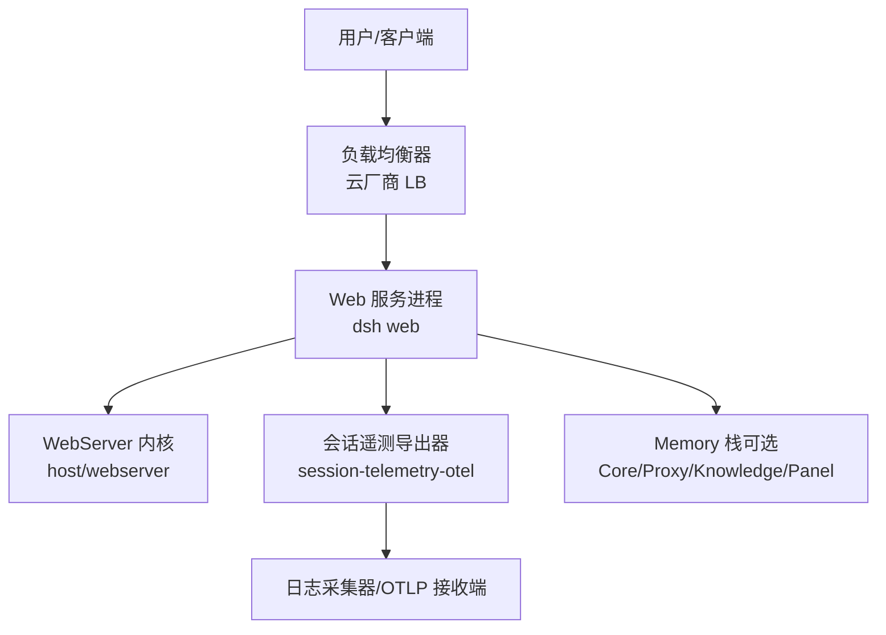
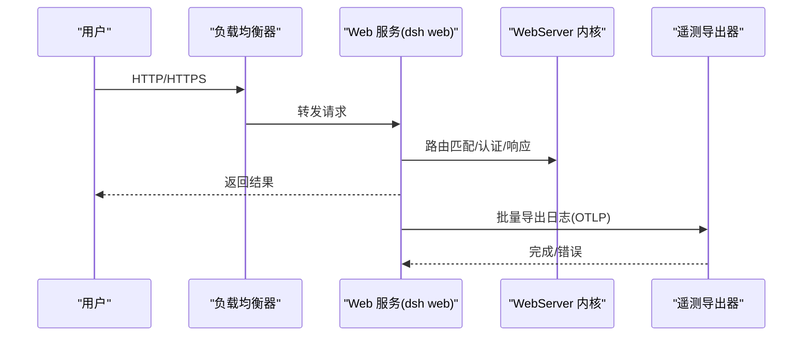
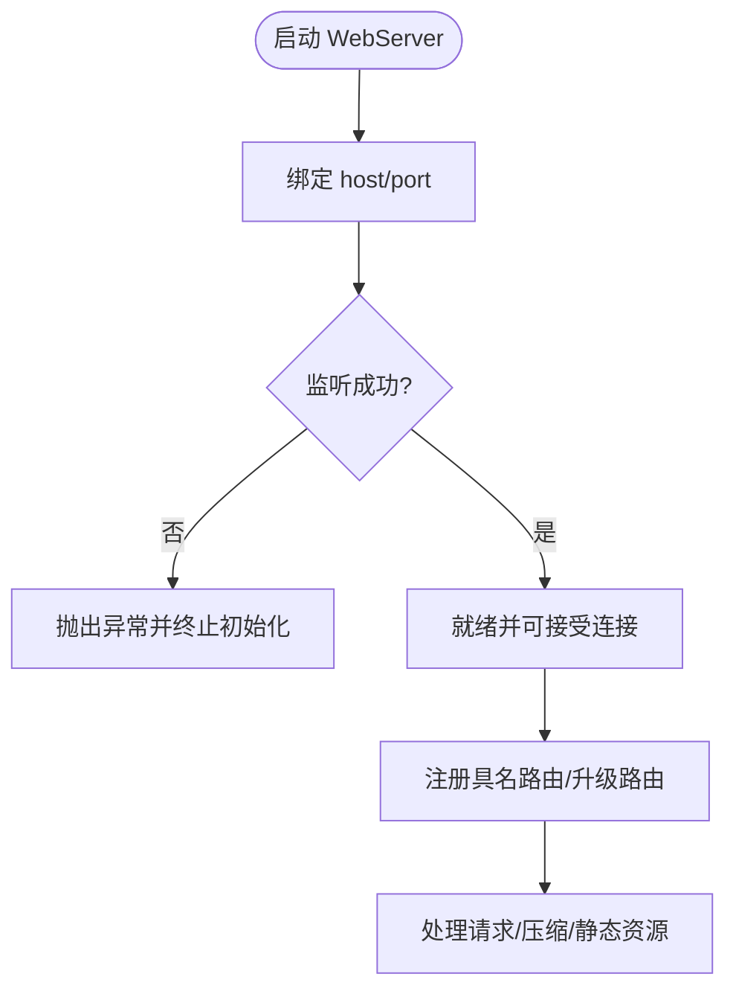
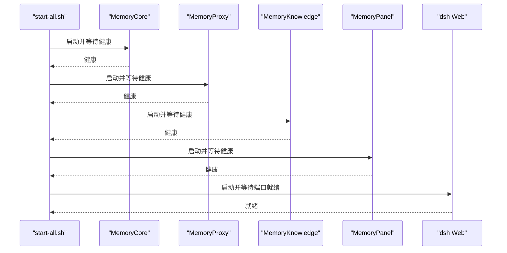
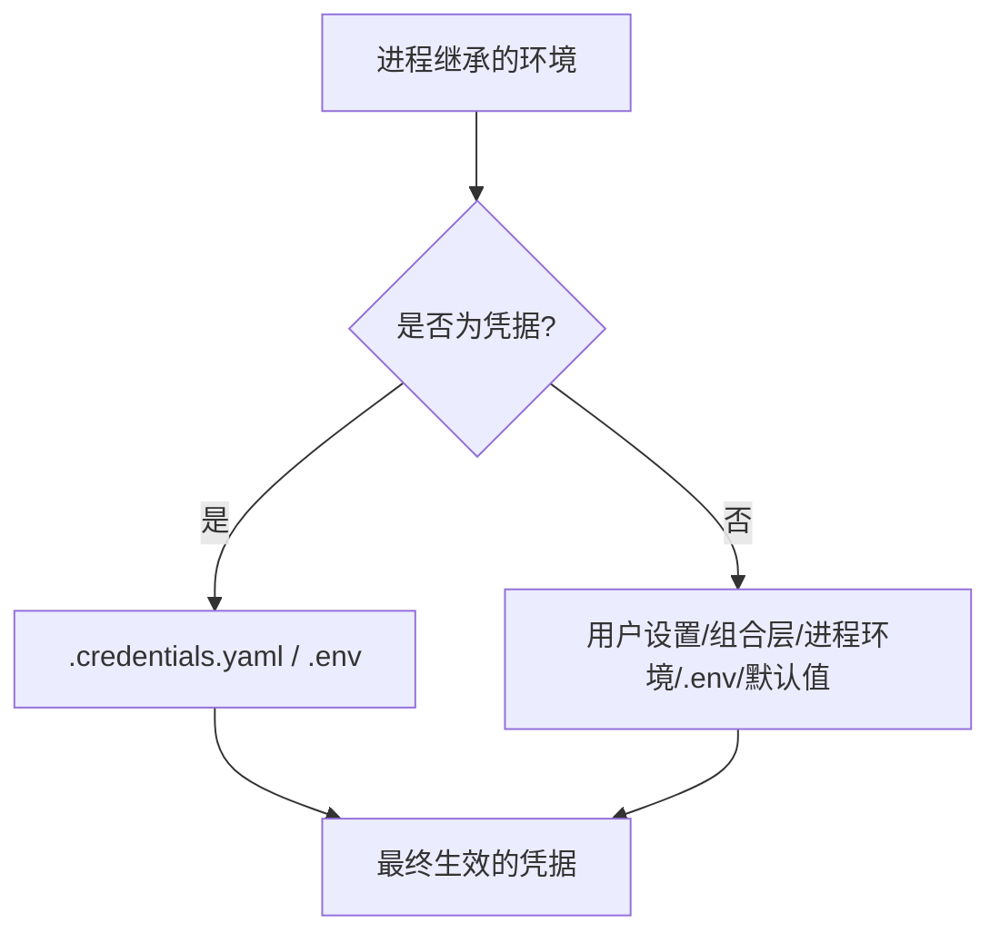
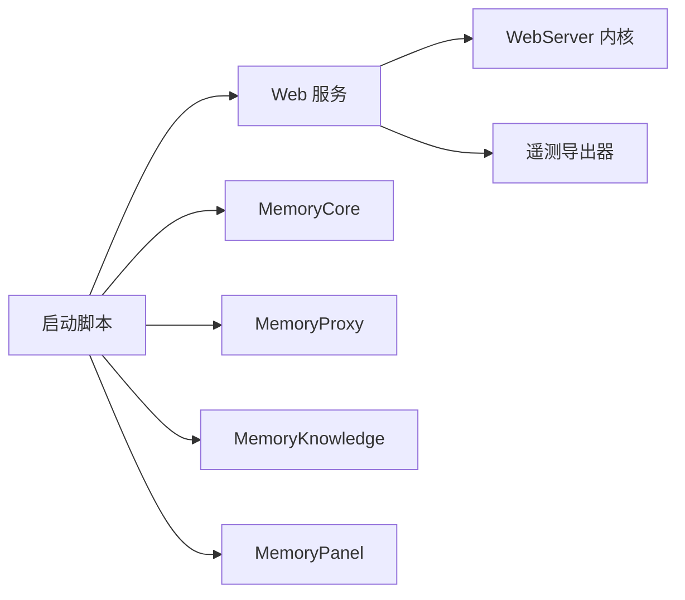

# 云平台部署

<cite>
**本文引用的文件**
- [scripts/setup-dsh/start-all.sh](file://scripts/setup-dsh/start-all.sh)
- [scripts/setup-dsh/stop-all.sh](file://scripts/setup-dsh/stop-all.sh)
- [scripts/setup-dsh/setup.env.example](file://scripts/setup-dsh/setup.env.example)
- [packages/host/webserver/src/index.d.ts](file://packages/host/webserver/src/index.d.ts)
- [packages/host/webserver/src/index.ts](file://packages/host/webserver/src/index.ts)
- [docs/subsystems/web-server.zh.md](file://docs/subsystems/web-server.zh.md)
- [packages/session/session-telemetry-otel/src/index.ts](file://packages/session/session-telemetry-otel/src/index.ts)
- [.github/workflows/ci.yml](file://.github/workflows/ci.yml)
- [scripts/setup-dsh/export-env.sh](file://scripts/setup-dsh/export-env.sh)
- [packages/util/launch-environment/src/index.ts](file://packages/util/launch-environment/src/index.ts)
</cite>

## 目录
1. [简介](#简介)
2. [项目结构](#项目结构)
3. [核心组件](#核心组件)
4. [架构总览](#架构总览)
5. [详细组件分析](#详细组件分析)
6. [依赖关系分析](#依赖关系分析)
7. [性能与扩缩容](#性能与扩缩容)
8. [监控与日志](#监控与日志)
9. [故障排查指南](#故障排查指南)
10. [结论](#结论)
11. [附录：云平台部署模板与 IaC 示例](#附录云平台部署模板与-iac-示例)

## 简介
本文档面向在主流云平台（AWS、Azure、Google Cloud）上部署 DeepSeek Harness 的运维与平台工程团队，聚焦以下目标：
- 给出可落地的云平台部署方案与关键配置要点
- 设计负载均衡与高可用架构
- 制定自动扩缩容策略与资源管理最佳实践
- 提供云平台特定的监控告警与日志收集方案
- 提供完整的部署模板与基础设施即代码（IaC）示例

DeepSeek Harness 的核心运行单元包括 Web 服务、Web 服务器内核、遥测导出器以及本地/容器化的 Memory 栈。通过统一的启动脚本与环境变量注入，可在任意云平台的计算实例或托管容器中稳定运行。

## 项目结构
与部署直接相关的代码与脚本集中在如下位置：
- 应用入口与 Web 服务：apps/web、packages/host/webserver
- 启动与生命周期管理：scripts/setup-dsh/*
- 遥测与日志导出：packages/session/session-telemetry-otel
- CI/CD 流水线：.github/workflows/ci.yml

图表来源
- [packages/host/webserver/src/index.ts:133-186](file://packages/host/webserver/src/index.ts#L133-L186)
- [packages/session/session-telemetry-otel/src/index.ts:86-214](file://packages/session/session-telemetry-otel/src/index.ts#L86-L214)
- [scripts/setup-dsh/start-all.sh:99-196](file://scripts/setup-dsh/start-all.sh#L99-L196)

章节来源
- [scripts/setup-dsh/start-all.sh:1-212](file://scripts/setup-dsh/start-all.sh#L1-L212)
- [packages/host/webserver/src/index.d.ts:28-63](file://packages/host/webserver/src/index.d.ts#L28-L63)
- [packages/session/session-telemetry-otel/src/index.ts:86-214](file://packages/session/session-telemetry-otel/src/index.ts#L86-L214)

## 核心组件
- Web 服务进程：通过 dsh web 命令启动，支持绑定主机与端口；默认回环地址，可按需暴露到所有接口。
- WebServer 内核：提供路由注册、HTTP 升级、压缩等能力；监听失败会拒绝初始化。
- 会话遥测导出器：将日志以 OTLP 格式导出至指定端点，支持批处理器与关闭超时控制。
- 启动脚本：按依赖顺序拉起 Memory 栈与 Web UI，健康检查后继续下一步。

章节来源
- [docs/subsystems/web-server.zh.md:27-51](file://docs/subsystems/web-server.zh.md#L27-L51)
- [packages/host/webserver/src/index.ts:133-186](file://packages/host/webserver/src/index.ts#L133-L186)
- [packages/session/session-telemetry-otel/src/index.ts:86-214](file://packages/session/session-telemetry-otel/src/index.ts#L86-L214)
- [scripts/setup-dsh/start-all.sh:99-196](file://scripts/setup-dsh/start-all.sh#L99-L196)

## 架构总览
下图展示从负载均衡到后端服务的请求路径与健康检查流程，适用于任何云平台。

图表来源
- [packages/host/webserver/src/index.ts:133-186](file://packages/host/webserver/src/index.ts#L133-L186)
- [packages/session/session-telemetry-otel/src/index.ts:86-214](file://packages/session/session-telemetry-otel/src/index.ts#L86-L214)

## 详细组件分析

### Web 服务与网络绑定
- 绑定策略：仅允许 127.0.0.1 或 0.0.0.0；后者为显式暴露，需配合外部 TLS、鉴权与访问控制。
- 端口分配：支持操作系统动态分配端口（port=0）。
- 压缩：支持 gzip，默认关闭，可通过组合层启用。
- 路由：精确匹配优先，其次前缀匹配，最后回退处理；重复注册会报错。

图表来源
- [packages/host/webserver/src/index.d.ts:28-63](file://packages/host/webserver/src/index.d.ts#L28-L63)
- [packages/host/webserver/src/index.ts:133-186](file://packages/host/webserver/src/index.ts#L133-L186)
- [docs/subsystems/web-server.zh.md:27-51](file://docs/subsystems/web-server.zh.md#L27-L51)

章节来源
- [packages/host/webserver/src/index.d.ts:28-63](file://packages/host/webserver/src/index.d.ts#L28-L63)
- [packages/host/webserver/src/index.ts:133-186](file://packages/host/webserver/src/index.ts#L133-L186)
- [docs/subsystems/web-server.zh.md:27-51](file://docs/subsystems/web-server.zh.md#L27-L51)

### 启动与依赖编排
- 启动顺序：MemoryCore → MemoryProxy → MemoryKnowledge → MemoryPanel → dsh Web UI。
- 健康检查：每个服务启动后通过健康端点探测，成功后再启动下一个。
- 守护与停止：使用 pidfile 管理进程，停止时按反向依赖顺序优雅退出，必要时强制结束。

图表来源
- [scripts/setup-dsh/start-all.sh:99-196](file://scripts/setup-dsh/start-all.sh#L99-L196)
- [scripts/setup-dsh/stop-all.sh:1-59](file://scripts/setup-dsh/stop-all.sh#L1-L59)

章节来源
- [scripts/setup-dsh/start-all.sh:1-212](file://scripts/setup-dsh/start-all.sh#L1-L212)
- [scripts/setup-dsh/stop-all.sh:1-59](file://scripts/setup-dsh/stop-all.sh#L1-L59)

### 环境变量与凭据注入
- 非密钥配置优先级：运行时显式 > 用户设置 > 组合层 > 进程环境 > 发现的文件 .env > 默认值。
- 凭据优先级：进程环境 > $DSH_HOME/.credentials.yaml > 项目 .env > $DSH_HOME/.env。
- 启动环境快照：记录每个变量的来源层，便于审计与排障。

图表来源
- [packages/util/launch-environment/src/index.ts:1-29](file://packages/util/launch-environment/src/index.ts#L1-L29)
- [scripts/setup-dsh/setup.env.example:1-88](file://scripts/setup-dsh/setup.env.example#L1-L88)
- [scripts/setup-dsh/export-env.sh:43-76](file://scripts/setup-dsh/export-env.sh#L43-L76)

章节来源
- [packages/util/launch-environment/src/index.ts:1-29](file://packages/util/launch-environment/src/index.ts#L1-L29)
- [scripts/setup-dsh/setup.env.example:1-88](file://scripts/setup-dsh/setup.env.example#L1-L88)
- [scripts/setup-dsh/export-env.sh:43-76](file://scripts/setup-dsh/export-env.sh#L43-L76)

## 依赖关系分析
- Web 服务依赖 WebServer 内核进行路由与响应处理。
- 遥测导出器独立于业务逻辑，负责将日志以 OTLP 协议导出。
- 启动脚本对 Memory 栈各组件存在强依赖顺序，并通过健康检查保证就绪。

图表来源
- [packages/host/webserver/src/index.ts:133-186](file://packages/host/webserver/src/index.ts#L133-L186)
- [packages/session/session-telemetry-otel/src/index.ts:86-214](file://packages/session/session-telemetry-otel/src/index.ts#L86-L214)
- [scripts/setup-dsh/start-all.sh:99-196](file://scripts/setup-dsh/start-all.sh#L99-L196)

章节来源
- [packages/host/webserver/src/index.ts:133-186](file://packages/host/webserver/src/index.ts#L133-L186)
- [packages/session/session-telemetry-otel/src/index.ts:86-214](file://packages/session/session-telemetry-otel/src/index.ts#L86-L214)
- [scripts/setup-dsh/start-all.sh:99-196](file://scripts/setup-dsh/start-all.sh#L99-L196)

## 性能与扩缩容
- 水平扩展：将 Web 服务无状态化，置于云负载均衡器之后，按 CPU/内存/请求数指标自动扩缩容。
- 连接与压缩：开启 gzip 可降低带宽占用；合理设置压缩阈值与级别。
- 健康探针：使用 TCP/HTTP 健康检查确保流量只进入就绪实例。
- 冷启动优化：预拉取镜像、预热依赖、使用持久缓存（如 pnpm store）。
- 资源配额：为实例设置合理的 CPU/内存上限，避免邻居干扰；结合 Pod/任务级限制保障多租户隔离。

[本节为通用指导，不直接分析具体文件]

## 监控与日志
- 遥测导出：通过 session-telemetry-otel 插件将日志以 OTLP 导出至云端日志系统（如 AWS CloudWatch Logs、Azure Monitor Logs、Google Cloud Logging），配置 exporter.url 与批处理器参数。
- 关闭超时：设置 shutdownTimeoutMillis 以控制 SDK 完全关闭的时间预算。
- 指标与告警：基于日志关键字与结构化字段建立告警规则（错误率、延迟、资源使用率）。
- 链路追踪：如需端到端追踪，可在网关/代理层集成分布式追踪，并将 trace_id 写入日志。

章节来源
- [packages/session/session-telemetry-otel/src/index.ts:86-214](file://packages/session/session-telemetry-otel/src/index.ts#L86-L214)

## 故障排查指南
- 启动失败：检查端口冲突、健康端点不可达、依赖未就绪；参考 start-all.sh 的健康检查逻辑。
- 无法访问：确认 host/port 配置与防火墙/安全组；若绑定 0.0.0.0，需补充 TLS 与鉴权。
- 凭据问题：核对进程环境与 .credentials.yaml 的优先级；避免在 .env 中硬编码敏感信息。
- 日志缺失：检查 OTLP exporter.url 可达性与凭据；关注关闭超时是否过短导致导出未完成。
- 停止不彻底：使用 stop-all.sh 按反向依赖停止；必要时通过端口检测强制释放。

章节来源
- [scripts/setup-dsh/start-all.sh:99-196](file://scripts/setup-dsh/start-all.sh#L99-L196)
- [scripts/setup-dsh/stop-all.sh:1-59](file://scripts/setup-dsh/stop-all.sh#L1-L59)
- [packages/session/session-telemetry-otel/src/index.ts:86-214](file://packages/session/session-telemetry-otel/src/index.ts#L86-L214)

## 结论
DeepSeek Harness 的部署以“无状态 Web 服务 + 可插拔遥测导出”为核心，借助启动脚本实现依赖编排与健康检查。在云平台上，通过负载均衡、自动扩缩容、集中日志与告警，可实现高可用与可观测性。建议在生产环境中统一使用 IaC 管理资源，严格管理凭据与网络边界，持续验证健康与容量。

[本节为总结，不直接分析具体文件]

## 附录：云平台部署模板与 IaC 示例

### 通用部署清单
- 计算：选择支持 Node.js 22+ 的实例或容器运行时（EC2/ECS/AKS/GKE）。
- 网络：VPC/VNet/子网、安全组/防火墙/NACL、公网出口与内网互通。
- 负载均衡：启用 HTTPS、健康检查、跨可用区分发。
- 存储：挂载日志卷或对接远端日志服务；如需持久化会话，使用云托管数据库或对象存储。
- 凭据：使用云密钥管理服务（KMS/Secrets Manager/Secrets Manager）注入环境变量。
- 监控：启用系统指标、应用指标、日志采集与告警。

[本节为通用指导，不直接分析具体文件]

### AWS 部署要点
- 计算：ECS Fargate 或 EC2 Auto Scaling Group；容器镜像包含 dsh web 与依赖。
- 网络：ALB 作为入口，TLS 终止于 ALB；安全组放行 443/80。
- 扩缩容：基于 CPU/内存/请求数的目标跟踪策略；最小/最大实例数。
- 日志：CloudWatch Agent 或 FireLens 收集 stdout/stderr；OTLP 发送至 CloudWatch Logs。
- 密钥：Parameter Store/Secrets Manager 注入 DEEPSEEK_* 等变量。

[本节为通用指导，不直接分析具体文件]

### Azure 部署要点
- 计算：AKS 或 Container Apps；使用 Helm/ARM/Bicep 部署。
- 网络：Application Gateway 或 AKS Ingress；TLS 终止于网关。
- 扩缩容：HPA 基于 CPU/内存/自定义指标；Pod 反亲和分散故障域。
- 日志：Container Insights 或 Log Analytics；OTLP 发送至 Log Analytics。
- 密钥：Key Vault 注入环境变量；使用 Managed Identity 访问其他资源。

[本节为通用指导，不直接分析具体文件]

### Google Cloud 部署要点
- 计算：GKE 或 Cloud Run；使用 Deployment/Service 或 Service 资源。
- 网络：Load Balancer 或 Ingress；TLS 终止于 LB。
- 扩缩容：HPA 或 Cloud Run 自动伸缩；设置最小/最大实例。
- 日志：Cloud Logging；OTLP 发送至 Logging。
- 密钥：Secret Manager 注入环境变量；IAM 最小权限原则。

[本节为通用指导，不直接分析具体文件]

### 健康检查与就绪探针
- HTTP/TCP 探针：对 Web 服务端口进行健康检查；Memory 栈各组件通过 /health 端点就绪。
- 启动顺序：遵循 start-all.sh 的依赖顺序，确保下游服务先于上游可用。
- 失败恢复：探针失败则移除实例流量；重启策略设置为 Always/OnFailure。

章节来源
- [scripts/setup-dsh/start-all.sh:99-196](file://scripts/setup-dsh/start-all.sh#L99-L196)

### 环境变量与凭据管理
- 使用 setup.env.example 中的键作为参考，将敏感值放入云密钥服务。
- 非密钥配置通过配置文件或组合层注入；避免在 .env 中硬编码。
- 启动环境快照记录来源层，便于审计与排障。

章节来源
- [scripts/setup-dsh/setup.env.example:1-88](file://scripts/setup-dsh/setup.env.example#L1-L88)
- [packages/util/launch-environment/src/index.ts:1-29](file://packages/util/launch-environment/src/index.ts#L1-L29)

### 监控与告警模板
- 指标：CPU、内存、磁盘、网络、请求数、错误率、延迟分位。
- 日志：关键字告警（错误、异常堆栈）、OTLP 导出失败告警。
- 告警：阈值与复合条件；通知渠道（邮件、短信、IM）。
- 可视化：仪表盘聚合关键指标，便于快速定位问题。

章节来源
- [packages/session/session-telemetry-otel/src/index.ts:86-214](file://packages/session/session-telemetry-otel/src/index.ts#L86-L214)

### CI/CD 与发布流水线
- 构建与测试：Node 版本矩阵、覆盖率、兼容性检查。
- 工件：打包镜像/二进制，签名与校验。
- 发布：灰度发布、蓝绿/金丝雀、回滚策略。
- 回退：保留旧版本镜像与配置，一键回滚。

章节来源
- [.github/workflows/ci.yml:1-678](file://.github/workflows/ci.yml#L1-L678)