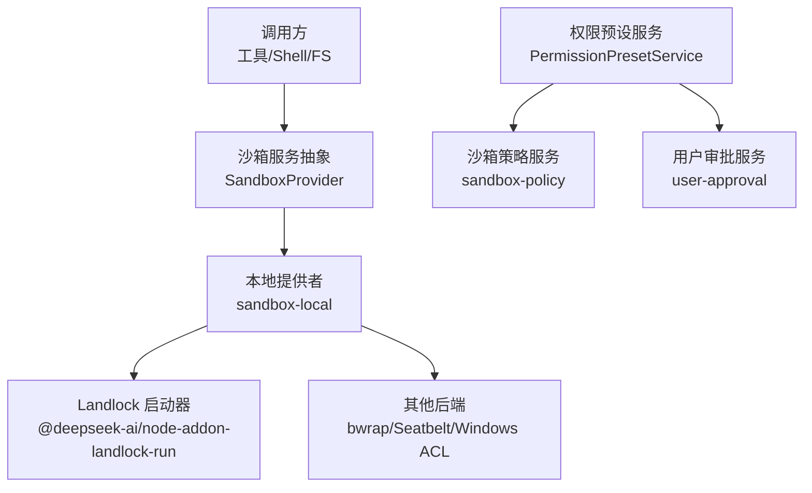
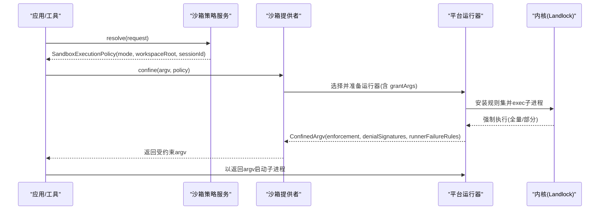
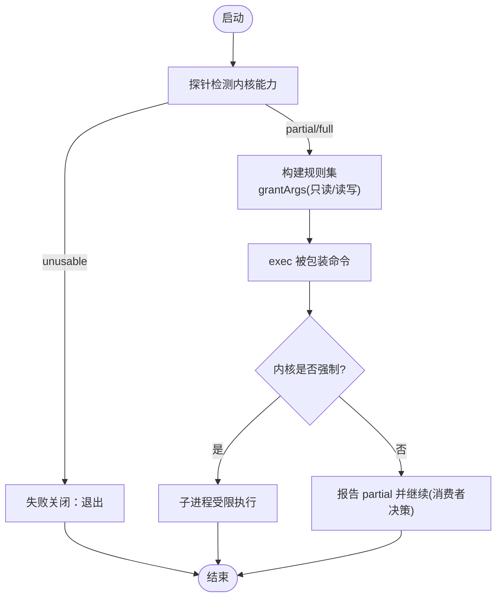
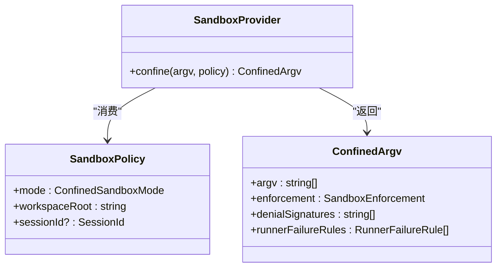
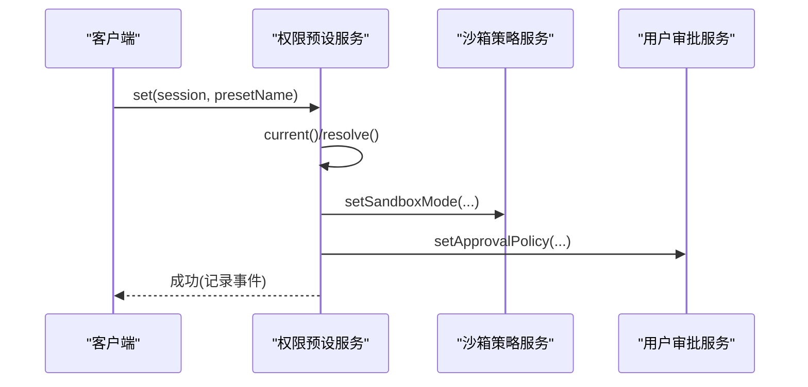
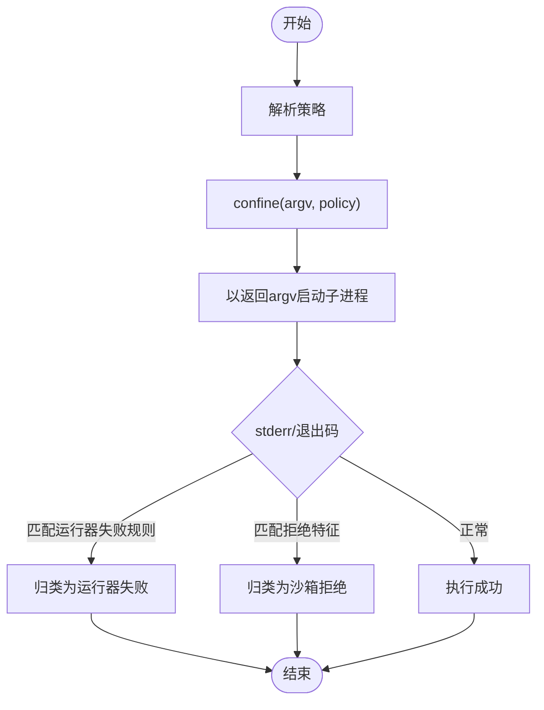
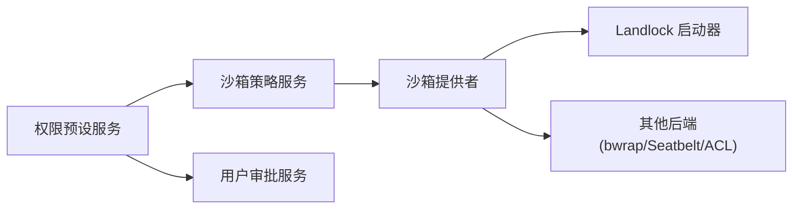

# 安全沙箱与权限控制

<cite>
**本文引用的文件**
- [packages/sandbox/sandbox/src/index.ts](file://packages/sandbox/sandbox/src/index.ts)
- [native/landlock-run/README.md](file://native/landlock-run/README.md)
- [native/landlock-run/docs/architecture.md](file://native/landlock-run/docs/architecture.md)
- [docs/subsystems/sandbox.md](file://docs/subsystems/sandbox.md)
- [docs/subsystems/permission-presets.md](file://docs/subsystems/permission-presets.md)
- [packages/interaction/permission-presets/src/index.ts](file://packages/interaction/permission-presets/src/index.ts)
</cite>

## 目录
1. [简介](#简介)
2. [项目结构](#项目结构)
3. [核心组件](#核心组件)
4. [架构总览](#架构总览)
5. [详细组件分析](#详细组件分析)
6. [依赖关系分析](#依赖关系分析)
7. [性能考虑](#性能考虑)
8. [故障排查指南](#故障排查指南)
9. [结论](#结论)
10. [附录](#附录)

## 简介
本文件面向 DeepSeek Harness 的安全沙箱与权限控制，聚焦以下目标：
- 详细说明 Landlock 安全沙箱的实现原理、可用性与回退策略。
- 阐述细粒度权限控制系统：文件系统访问控制、网络访问限制、进程隔离机制。
- 介绍权限预设策略与自定义规则的配置方法。
- 提供安全审计与合规性检查工具的使用建议。
- 给出常见安全威胁的防护方案与应急响应流程。

## 项目结构
围绕“沙箱能力抽象 + 平台实现 + 权限预设”的分层组织如下：
- 能力抽象层：定义统一的进程沙箱接口、执行策略与错误模型。
- 平台实现层：Linux 使用 Landlock 自限制后 exec 的二进制启动器；其他平台由本地提供者适配（如 bwrap/Seatbelt/ACL）。
- 权限预设层：将“沙箱模式 + 审批策略”打包为可切换的预设，统一写入底层开关。

图表来源
- [packages/sandbox/sandbox/src/index.ts:152-176](file://packages/sandbox/sandbox/src/index.ts#L152-L176)
- [native/landlock-run/README.md:1-48](file://native/landlock-run/README.md#L1-L48)
- [docs/subsystems/sandbox.md:9-39](file://docs/subsystems/sandbox.md#L9-L39)
- [docs/subsystems/permission-presets.md:1-44](file://docs/subsystems/permission-presets.md#L1-L44)

章节来源
- [docs/subsystems/sandbox.md:9-39](file://docs/subsystems/sandbox.md#L9-L39)
- [docs/subsystems/permission-presets.md:1-44](file://docs/subsystems/permission-presets.md#L1-L44)
- [native/landlock-run/README.md:1-48](file://native/landlock-run/README.md#L1-L48)

## 核心组件
- 沙箱能力抽象（SandboxProvider）
  - 定义 confine(argv, policy) 契约：返回受约束的可执行 argv、强制完整度、拒绝特征与运行器失败规则。
  - 禁止静默降级到无约束执行；不可用时抛出不可用错误。
- 执行策略（SandboxPolicy / SandboxExecutionPolicy）
  - 以“每调用一次”的方式携带 mode、workspaceRoot、sessionId 等上下文。
  - 支持 read-only、workspace-write、danger-full-access 三种文件影响模式。
- 平台实现（Landlock 启动器）
  - 通过 probe 探测内核是否可强制；grantArgs 构造白名单；失败关闭（fail-closed）。
- 权限预设（PermissionPresetService）
  - 将 sandbox/mode 与 approval/policy 组合为预设，提供选择、持久化与回写。

章节来源
- [packages/sandbox/sandbox/src/index.ts:23-72](file://packages/sandbox/sandbox/src/index.ts#L23-L72)
- [packages/sandbox/sandbox/src/index.ts:90-144](file://packages/sandbox/sandbox/src/index.ts#L90-L144)
- [native/landlock-run/README.md:25-48](file://native/landlock-run/README.md#L25-L48)
- [docs/subsystems/permission-presets.md:1-44](file://docs/subsystems/permission-presets.md#L1-L44)

## 架构总览
下图展示从调用方到平台沙箱的执行路径，以及权限预设如何驱动底层开关。

图表来源
- [packages/sandbox/sandbox/src/index.ts:152-176](file://packages/sandbox/sandbox/src/index.ts#L152-L176)
- [native/landlock-run/README.md:25-48](file://native/landlock-run/README.md#L25-L48)
- [docs/subsystems/sandbox.md:9-39](file://docs/subsystems/sandbox.md#L9-L39)

## 详细组件分析

### Landlock 安全沙箱：原理与配置
- 原理要点
  - 自限制后 exec：在自身安装 Landlock 规则集后再 exec 被包装命令，规则跨 execve 继承，子进程及后续派生进程均受限。
  - 白名单授权：通过 grantArgs 声明只读/读写路径，未授权即拒绝。
  - 可用性探测：probe 返回 full/partial/unusable，区分内核 ABI 差异与不可用场景。
  - 失败关闭：任何 launcher 级错误直接退出，不执行命令。
- 配置要点
  - 仅授予必要路径：最小化 readWrite/readOnly 集合。
  - 结合工作区根目录：workspace-write 模式下允许在工作区与后端临时目录写入。
  - 非 Linux 平台：由本地提供者切换到其他后端（bwrap/Seatbelt/ACL），保持统一抽象。

图表来源
- [native/landlock-run/README.md:25-48](file://native/landlock-run/README.md#L25-L48)
- [native/landlock-run/docs/architecture.md:16-24](file://native/landlock-run/docs/architecture.md#L16-L24)

章节来源
- [native/landlock-run/README.md:1-48](file://native/landlock-run/README.md#L1-L48)
- [native/landlock-run/docs/architecture.md:1-35](file://native/landlock-run/docs/architecture.md#L1-L35)

### 细粒度权限控制：文件系统、网络与进程隔离
- 文件系统访问控制
  - 通过 SandboxMode 限定文件影响范围：read-only、workspace-write、danger-full-access。
  - 每个调用独立解析策略，避免全局状态污染；workspaceRoot 作为写入边界。
- 网络访问限制
  - 文档明确网络与进程可见性不在沙箱模式词汇内，需由上层或运行时策略另行限制（例如容器/微VM/远程执行）。
- 进程隔离机制
  - 通过 confine 返回的 argv 启动受限子进程；不同后端（Landlock/bwrap/Seatbelt/ACL）提供各自隔离语义。
  - 失败分类：区分“运行器失败”和“被沙箱拒绝”，便于诊断与告警。

图表来源
- [packages/sandbox/sandbox/src/index.ts:23-72](file://packages/sandbox/sandbox/src/index.ts#L23-L72)
- [packages/sandbox/sandbox/src/index.ts:90-116](file://packages/sandbox/sandbox/src/index.ts#L90-L116)

章节来源
- [docs/subsystems/sandbox.md:9-39](file://docs/subsystems/sandbox.md#L9-L39)
- [packages/sandbox/sandbox/src/index.ts:23-72](file://packages/sandbox/sandbox/src/index.ts#L23-L72)
- [packages/sandbox/sandbox/src/index.ts:90-116](file://packages/sandbox/sandbox/src/index.ts#L90-L116)

### 权限预设策略与自定义规则
- 预设表
  - 默认包含 workspace-write（配合 ask）与 danger-full-access（never）。
  - 名称 custom 保留用于“当前值不匹配任何预设”的派生态。
- 切换与持久化
  - set(session, name) 会记录 permission/preset 事件，并仅对变化的开关调用对应 setter（沙箱模式、审批策略）。
  - 新会话创建时自动注入默认预设或根据已有状态推导。
- 自定义规则
  - 通过配置 presets 表扩展预设；确保 shell 具备 confinement 能力事实，否则插件加载失败。

图表来源
- [docs/subsystems/permission-presets.md:44-69](file://docs/subsystems/permission-presets.md#L44-L69)
- [packages/interaction/permission-presets/src/index.ts:373-396](file://packages/interaction/permission-presets/src/index.ts#L373-L396)

章节来源
- [docs/subsystems/permission-presets.md:1-44](file://docs/subsystems/permission-presets.md#L1-L44)
- [packages/interaction/permission-presets/src/index.ts:142-181](file://packages/interaction/permission-presets/src/index.ts#L142-L181)
- [packages/interaction/permission-presets/src/index.ts:373-396](file://packages/interaction/permission-presets/src/index.ts#L373-L396)

### 执行流程与错误分类
- 执行流程
  - 调用方先解析策略，再请求 confine 获取受约束 argv，最后以该 argv 启动子进程。
- 错误分类
  - 运行器失败：在命令执行前失败，依据 runnerFailureRules 判定。
  - 沙箱拒绝：命令执行中被后端拒绝，依据 denialSignatures 判定。
  - 不可用：无可用后端时抛出不可用错误，禁止静默降级。

图表来源
- [packages/sandbox/sandbox/src/index.ts:74-116](file://packages/sandbox/sandbox/src/index.ts#L74-L116)
- [docs/subsystems/sandbox.md:96-158](file://docs/subsystems/sandbox.md#L96-L158)

章节来源
- [packages/sandbox/sandbox/src/index.ts:74-116](file://packages/sandbox/sandbox/src/index.ts#L74-L116)
- [docs/subsystems/sandbox.md:96-158](file://docs/subsystems/sandbox.md#L96-L158)

## 依赖关系分析
- 组件耦合
  - 沙箱抽象与服务解耦：具体后端由本地提供者选择与封装。
  - 权限预设依赖沙箱策略与用户审批两个独立开关，但不直接执行。
- 外部依赖
  - Landlock 启动器依赖 Linux 内核能力；非 Linux 走其他后端。
- 潜在循环
  - 通过 Cordis 服务注入与类型合并，避免直接值依赖，降低耦合。

图表来源
- [packages/interaction/permission-presets/src/index.ts:183-197](file://packages/interaction/permission-presets/src/index.ts#L183-L197)
- [packages/sandbox/sandbox/src/index.ts:152-176](file://packages/sandbox/sandbox/src/index.ts#L152-L176)
- [native/landlock-run/README.md:15-24](file://native/landlock-run/README.md#L15-L24)

章节来源
- [packages/interaction/permission-presets/src/index.ts:183-197](file://packages/interaction/permission-presets/src/index.ts#L183-L197)
- [packages/sandbox/sandbox/src/index.ts:152-176](file://packages/sandbox/sandbox/src/index.ts#L152-L176)
- [native/landlock-run/README.md:15-24](file://native/landlock-run/README.md#L15-L24)

## 性能考虑
- 启动开销
  - Landlock 启动器在短生命周期子进程中构建并验证规则集，开销可控；应避免频繁重启同一受限任务。
- 规则复杂度
  - 白名单路径越多，规则构建越复杂；建议按任务最小化授权路径。
- 探测与缓存
  - 使用 probe 结果进行一次性能力判断，避免重复探测；多后端链路的仲裁应在提供者层缓存。

[本节为通用指导，无需特定文件引用]

## 故障排查指南
- 常见问题定位
  - 不可用：当无可用后端时，confine 抛出不适用错误；检查平台包与内核能力。
  - 运行器失败：依据 runnerFailureRules 匹配 stderr 与退出码，优先判定基础设施问题。
  - 沙箱拒绝：依据 denialSignatures 匹配后端特定的拒绝文本，确认是否误配白名单。
- 快速自检清单
  - 确认 probe 结果为 full/partial；若 unusable，更换环境或回退策略。
  - 校验 grantArgs 中读写路径是否正确；必要时扩大 workspaceRoot。
  - 在非 Linux 平台，确认本地提供者可用（bwrap/Seatbelt/ACL）。
- 应急流程
  - 立即降级：在严格模式下无法恢复时，可临时切换到 danger-full-access（仅限应急），并记录审计日志。
  - 回滚变更：回退最近的预设或白名单变更，复测关键路径。
  - 上报与复盘：收集 stderr、退出码、策略快照，形成事后报告。

章节来源
- [packages/sandbox/sandbox/src/index.ts:118-144](file://packages/sandbox/sandbox/src/index.ts#L118-L144)
- [docs/subsystems/sandbox.md:96-158](file://docs/subsystems/sandbox.md#L96-L158)
- [native/landlock-run/README.md:25-48](file://native/landlock-run/README.md#L25-L48)

## 结论
DeepSeek Harness 通过“抽象 + 平台实现 + 预设”的分层设计，实现了可移植、可审计、可回退的沙箱与权限控制体系。Landlock 提供强隔离能力，配合最小授权与失败关闭策略，有效降低不受信代码的风险面。权限预设简化了运维与用户体验，同时保留了细粒度定制空间。建议在部署中持续评估内核能力、收紧白名单，并结合审批策略与审计日志，形成闭环的安全治理。

[本节为总结性内容，无需特定文件引用]

## 附录
- 安全审计与合规性检查建议
  - 定期审查预设表与白名单，遵循最小权限原则。
  - 在 CI 中集成 probe 能力检测与受限执行冒烟测试。
  - 对关键路径启用审批策略，留存 decision 日志。
- 常见威胁与防护
  - 路径穿越/符号链接滥用：使用 canonicalPath 与工作区根限制。
  - 信息泄露：限制只读路径，避免暴露敏感目录。
  - 逃逸尝试：严格拒绝未知系统调用与设备访问（依赖内核与后端）。
- 参考实现位置
  - 沙箱抽象与错误模型：packages/sandbox/sandbox/src/index.ts
  - Landlock 启动器与架构说明：native/landlock-run/*
  - 子系统文档：docs/subsystems/sandbox.md, docs/subsystems/permission-presets.md
  - 权限预设实现：packages/interaction/permission-presets/src/index.ts

[本节为补充信息，无需特定文件引用]