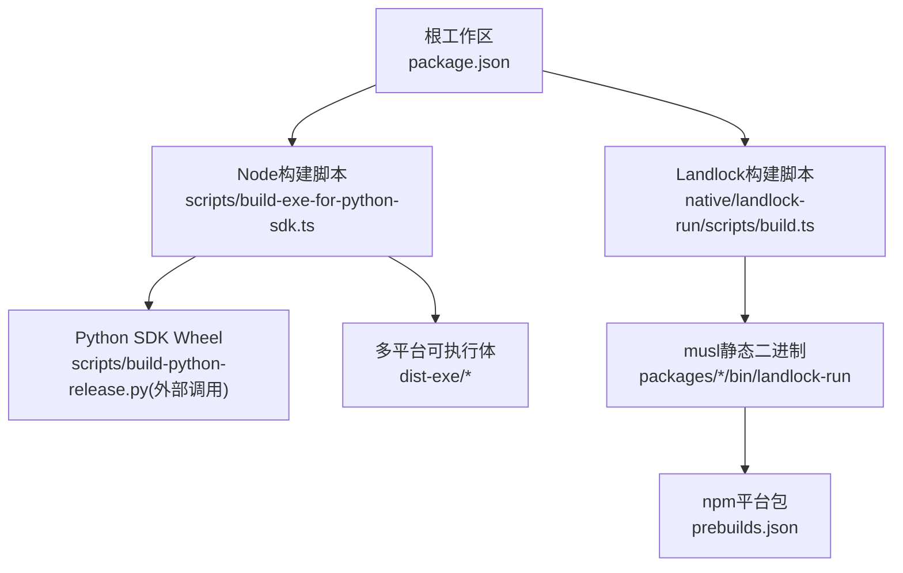
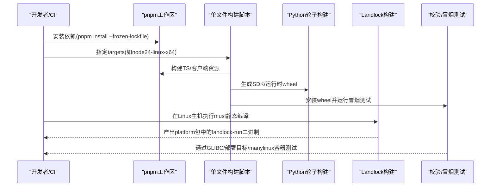
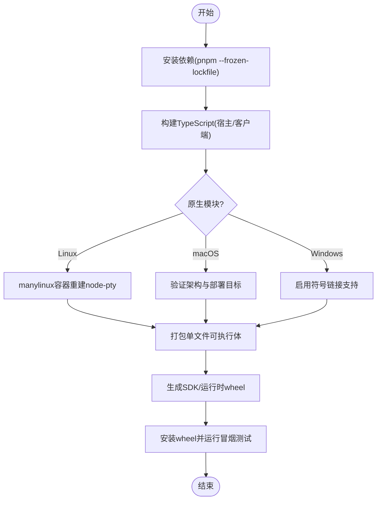
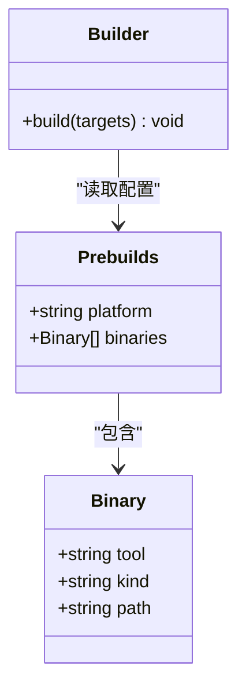
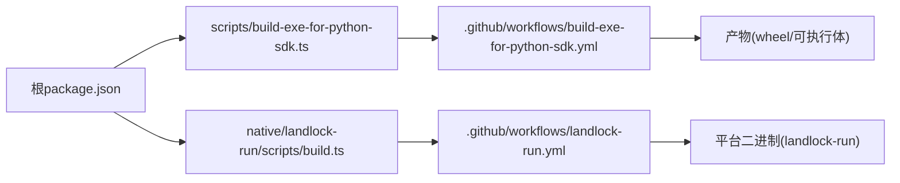

# Docker镜像构建

<cite>
**本文引用的文件**
- [.github/workflows/build-exe-for-python-sdk.yml](file://.github/workflows/build-exe-for-python-sdk.yml)
- [.github/workflows/landlock-run.yml](file://.github/workflows/landlock-run.yml)
- [scripts/build-exe-for-python-sdk.ts](file://scripts/build-exe-for-python-sdk.ts)
- [native/landlock-run/scripts/build.ts](file://native/landlock-run/scripts/build.ts)
- [native/landlock-run/packages/linux-x64/prebuilds.json](file://native/landlock-run/packages/linux-x64/prebuilds.json)
- [native/landlock-run/packages/linux-arm64/prebuilds.json](file://native/landlock-run/packages/linux-arm64/prebuilds.json)
- [package.json](file://package.json)
</cite>

## 目录
1. [简介](#简介)
2. [项目结构](#项目结构)
3. [核心组件](#核心组件)
4. [架构总览](#架构总览)
5. [详细组件分析](#详细组件分析)
6. [依赖关系分析](#依赖关系分析)
7. [性能与缓存优化](#性能与缓存优化)
8. [故障排查指南](#故障排查指南)
9. [结论](#结论)
10. [附录：Dockerfile示例与最佳实践](#附录dockerfile示例与最佳实践)

## 简介
本文件面向DeepSeek Harness的Docker镜像构建，聚焦多阶段构建流程、镜像分层策略、最小化镜像体积与缓存效率，以及Landlock安全沙箱二进制文件的跨平台编译（musl静态链接与内核API兼容性）。文档基于仓库中的CI工作流与构建脚本进行梳理，提供可操作的构建步骤与最佳实践。

## 项目结构
仓库采用Monorepo组织，Node.js应用与原生工具分别位于不同子目录：
- Node.js/TypeScript应用与打包产物由根脚本与pnpm工作区管理
- Python SDK运行时单文件可执行体通过专用脚本在多目标平台上构建
- Landlock原生工具在native/landlock-run下按平台发布预构建二进制



**图表来源**
- [package.json:1-202](file://package.json#L1-L202)
- [scripts/build-exe-for-python-sdk.ts:601-623](file://scripts/build-exe-for-python-sdk.ts#L601-L623)
- [native/landlock-run/scripts/build.ts:1-87](file://native/landlock-run/scripts/build.ts#L1-L87)
- [native/landlock-run/packages/linux-x64/prebuilds.json:1-10](file://native/landlock-run/packages/linux-x64/prebuilds.json#L1-L10)
- [native/landlock-run/packages/linux-arm64/prebuilds.json:1-10](file://native/landlock-run/packages/linux-arm64/prebuilds.json#L1-L10)

**章节来源**
- [package.json:1-202](file://package.json#L1-L202)

## 核心组件
- 多目标单文件可执行体构建：通过脚本在Linux/macOS/Windows上为Node 24目标构建SDK运行时可执行体，并生成对应平台的Python wheel
- Landlock原生工具构建：在Linux主机上以musl-gcc静态编译，产出可在glibc/musl发行版运行的自包含二进制
- CI矩阵与校验：GitHub Actions与GitLab CI协同，完成多平台构建、GLIBC版本检查、macOS部署目标验证、manylinux容器内冒烟测试等

**章节来源**
- [.github/workflows/build-exe-for-python-sdk.yml:1-483](file://.github/workflows/build-exe-for-python-sdk.yml#L1-L483)
- [.github/workflows/landlock-run.yml:1-145](file://.github/workflows/landlock-run.yml#L1-L145)
- [scripts/build-exe-for-python-sdk.ts:601-623](file://scripts/build-exe-for-python-sdk.ts#L601-L623)
- [native/landlock-run/scripts/build.ts:1-87](file://native/landlock-run/scripts/build.ts#L1-L87)

## 架构总览
下图展示从源码到最终产物的端到端构建链路，包括Node环境准备、TypeScript编译、原生模块编译、打包与校验。



**图表来源**
- [.github/workflows/build-exe-for-python-sdk.yml:150-483](file://.github/workflows/build-exe-for-python-sdk.yml#L150-L483)
- [.github/workflows/landlock-run.yml:55-109](file://.github/workflows/landlock-run.yml#L55-L109)
- [scripts/build-exe-for-python-sdk.ts:601-623](file://scripts/build-exe-for-python-sdk.ts#L601-L623)
- [native/landlock-run/scripts/build.ts:60-86](file://native/landlock-run/scripts/build.ts#L60-L86)

## 详细组件分析

### 多阶段构建流程（Node.js + TypeScript + 原生模块）
- Node环境准备：使用固定Node版本与工作区缓存，确保依赖解析一致
- TypeScript编译：通过工作区脚本触发宿主与客户端库构建，输出至各包lib目录
- 原生模块编译：
  - Linux：将node-pty在manylinux_2_28容器中重新编译，保证GLIBC上限合规
  - macOS：验证多架构与最低部署目标
  - Windows：启用开发者模式以支持符号链接
- 单文件打包：将Node应用与依赖打包为单一可执行体，便于分发与部署
- 产物封装：生成Python SDK与运行时wheel，供后续Docker镜像或系统安装使用



**图表来源**
- [.github/workflows/build-exe-for-python-sdk.yml:175-239](file://.github/workflows/build-exe-for-python-sdk.yml#L175-L239)
- [.github/workflows/build-exe-for-python-sdk.yml:425-453](file://.github/workflows/build-exe-for-python-sdk.yml#L425-L453)
- [.github/workflows/build-exe-for-python-sdk.yml:455-475](file://.github/workflows/build-exe-for-python-sdk.yml#L455-L475)

**章节来源**
- [.github/workflows/build-exe-for-python-sdk.yml:150-483](file://.github/workflows/build-exe-for-python-sdk.yml#L150-L483)
- [scripts/build-exe-for-python-sdk.ts:601-623](file://scripts/build-exe-for-python-sdk.ts#L601-L623)

### Landlock安全沙箱二进制跨平台编译
- 构建策略：仅在Linux主机上以musl-gcc静态编译，避免交叉工具链；每个Linux架构在其对应runner上作为“记录构建器”
- 静态链接：使用-static与-musl工具链，使二进制不依赖宿主libc，兼容glibc与musl发行版
- 平台包：通过prebuilds.json声明平台与二进制路径，CI按矩阵构建并验证
- 内核API兼容性：Landlock能力受内核支持限制，CI在具备能力的平台上强制要求启用Landlock，在不支持的平台优雅降级



**图表来源**
- [native/landlock-run/packages/linux-x64/prebuilds.json:1-10](file://native/landlock-run/packages/linux-x64/prebuilds.json#L1-L10)
- [native/landlock-run/packages/linux-arm64/prebuilds.json:1-10](file://native/landlock-run/packages/linux-arm64/prebuilds.json#L1-L10)
- [native/landlock-run/scripts/build.ts:40-58](file://native/landlock-run/scripts/build.ts#L40-L58)

**章节来源**
- [.github/workflows/landlock-run.yml:55-109](file://.github/workflows/landlock-run.yml#L55-L109)
- [native/landlock-run/scripts/build.ts:1-87](file://native/landlock-run/scripts/build.ts#L1-L87)

### 环境变量与依赖管理最佳实践
- 固定Node与pnpm版本：在工作区与CI中声明，确保一致性
- 冻结依赖：使用--frozen-lockfile防止意外变更
- 缓存策略：对pnpm store、pkg缓存等进行键控缓存，提升重复构建速度
- 隔离测试：在clean venv中安装wheel并运行冒烟测试，避免环境污染
- 安全开关：设置DSH_TELEMETRY_DISABLED=1，避免CI上报遥测

**章节来源**
- [.github/workflows/build-exe-for-python-sdk.yml:175-197](file://.github/workflows/build-exe-for-python-sdk.yml#L175-L197)
- [.github/workflows/build-exe-for-python-sdk.yml:293-334](file://.github/workflows/build-exe-for-python-sdk.yml#L293-L334)
- [.github/workflows/landlock-run.yml:34-37](file://.github/workflows/landlock-run.yml#L34-L37)

## 依赖关系分析
- 工作区依赖：根package.json定义workspaces，统一管理与构建入口
- 构建脚本依赖：
  - scripts/build-exe-for-python-sdk.ts驱动多目标构建与产物同步
  - native/landlock-run/scripts/build.ts负责原生工具静态编译
- CI依赖：
  - GitHub Actions用于多平台构建与校验
  - GitLab CI用于Python轮子构建与发布



**图表来源**
- [package.json:1-202](file://package.json#L1-L202)
- [scripts/build-exe-for-python-sdk.ts:601-623](file://scripts/build-exe-for-python-sdk.ts#L601-L623)
- [native/landlock-run/scripts/build.ts:1-87](file://native/landlock-run/scripts/build.ts#L1-L87)
- [.github/workflows/build-exe-for-python-sdk.yml:1-483](file://.github/workflows/build-exe-for-python-sdk.yml#L1-L483)
- [.github/workflows/landlock-run.yml:1-145](file://.github/workflows/landlock-run.yml#L1-L145)

**章节来源**
- [package.json:1-202](file://package.json#L1-L202)

## 性能与缓存优化
- 依赖缓存：
  - pnpm store按平台与架构缓存，减少重复下载
  - pkg-fetch缓存Node二进制，加速打包阶段
- 构建并行：
  - 利用CI矩阵并行构建多目标
  - manylinux容器内并行编译原生模块
- 镜像分层建议：
  - 基础镜像层：仅包含必要运行时（如glibc/musl、Python解释器）
  - 依赖层：安装wheel与系统依赖，利用缓存层避免重复安装
  - 应用层：复制构建产物，保持只读
  - 启动层：最小化命令与环境变量，减少攻击面
- 体积优化：
  - 使用多阶段构建，仅将最终产物复制到生产镜像
  - 清理构建缓存与临时文件
  - 选择更小的基础镜像（如alpine或精简glibc镜像）

[本节为通用指导，无需特定文件引用]

## 故障排查指南
- 原生模块编译失败：
  - Linux：确认manylinux镜像可用且权限正确；检查node-pty是否生成Makefile与产物
  - macOS：验证架构与部署目标是否符合预期
  - Windows：确认已启用开发者模式以支持符号链接
- GLIBC版本不匹配：
  - 使用readelf检查可执行体的GLIBC需求，确保不超过manylinux_2_28上限
- Landlock不可用：
  - 在不支持Landlock的内核上，测试应优雅跳过；若强制要求则需确保内核支持
- 依赖解析异常：
  - 使用--frozen-lockfile并确保pnpm版本一致；清理缓存后重试

**章节来源**
- [.github/workflows/build-exe-for-python-sdk.yml:199-235](file://.github/workflows/build-exe-for-python-sdk.yml#L199-L235)
- [.github/workflows/build-exe-for-python-sdk.yml:425-453](file://.github/workflows/build-exe-for-python-sdk.yml#L425-L453)
- [.github/workflows/landlock-run.yml:95-109](file://.github/workflows/landlock-run.yml#L95-L109)

## 结论
DeepSeek Harness的构建体系通过工作区管理、多目标CI矩阵与严格的校验流程，实现了高可靠的多平台产物交付。Landlock原生工具采用静态musl链接，确保跨发行版兼容性与最小化依赖。结合多阶段Docker构建与分层策略，可进一步降低镜像体积并提升缓存效率。建议在本地与CI中遵循冻结依赖、缓存键控与隔离测试的最佳实践，以获得稳定高效的构建体验。

[本节为总结性内容，无需特定文件引用]

## 附录：Dockerfile示例与最佳实践
以下示例展示了如何将上述构建产物集成到Docker镜像中，采用多阶段构建与最小化镜像策略。请根据实际产物路径调整COPY指令。

```dockerfile
# 阶段一：构建
FROM node:24-alpine AS builder
WORKDIR /app
COPY . .
RUN corepack enable && \
    pnpm install --frozen-lockfile && \
    pnpm exec tsx scripts/build-exe-for-python-sdk.ts --targets=node24-linux-x64 && \
    python scripts/build-python-release.py --package sdk --output-dir dist-python && \
    python scripts/build-python-release.py --package runtime --platform linux-x64 --runtime-exe ./dist-exe/deepseek-harness-sdk-runtime-linux-x64 --output-dir dist-python

# 阶段二：运行
FROM alpine:latest
RUN apk add --no-cache python3 tini
WORKDIR /app
COPY --from=builder /app/dist-python/*.whl ./wheels/
RUN pip install --no-cache-dir --find-links ./wheels deepseek_harness_sdk && \
    pip install --no-cache-dir --find-links ./wheels deepseek_harness_runtime_bin
COPY --from=builder /app/native/landlock-run/packages/linux-x64/bin/landlock-run /usr/local/bin/landlock-run
ENV DSH_TELEMETRY_DISABLED=1
ENTRYPOINT ["tini", "--"]
CMD ["deepseek-harness-cli", "run"]
```

注意事项：
- 使用多阶段构建，仅将必要产物复制到运行镜像
- 使用alpine或精简glibc基础镜像以减少体积
- 通过环境变量禁用遥测，避免CI/生产环境外泄
- 若需Landlock功能，确保运行内核支持并正确配置权限

[本节为概念性示例，无需特定文件引用]