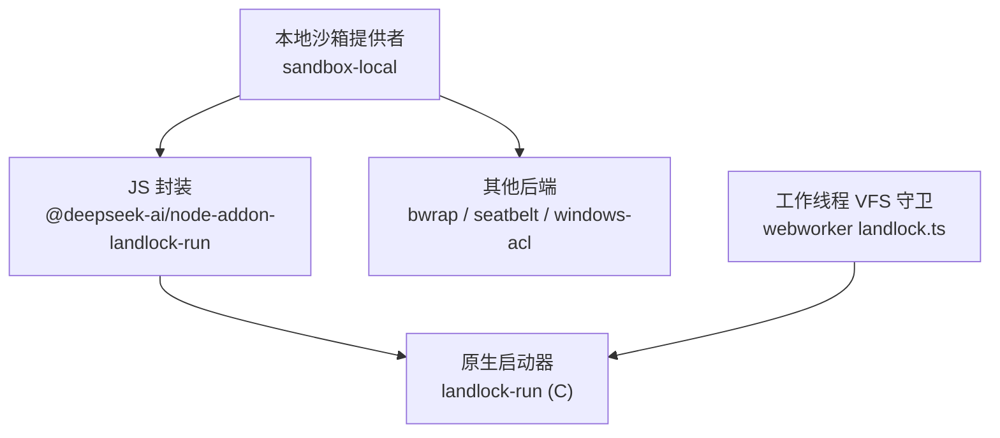
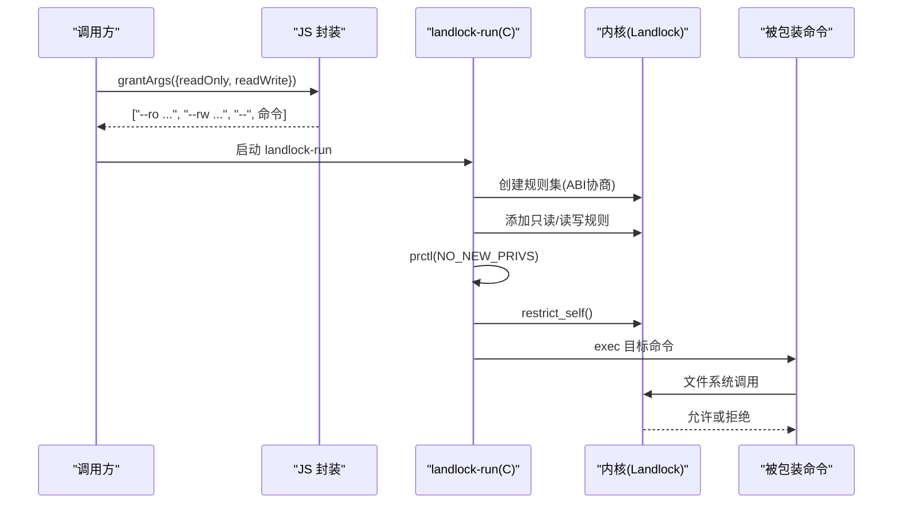
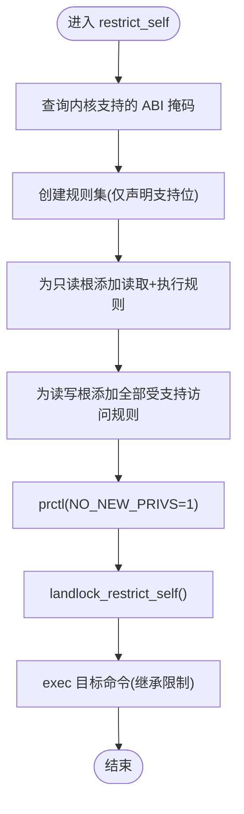
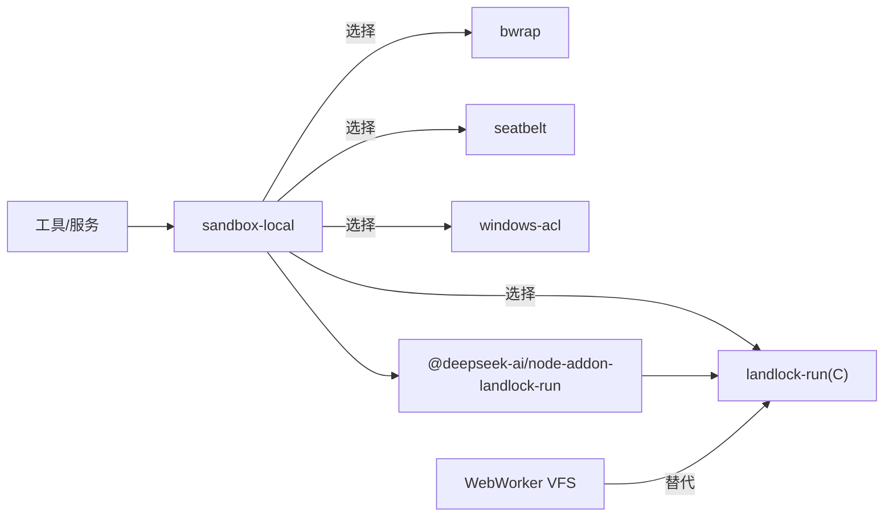

# 安全沙箱机制

<cite>
**本文引用的文件**
- [native/landlock-run/packages/entry/src/main.c](file://native/landlock-run/packages/entry/src/main.c)
- [native/landlock-run/packages/entry/src/index.ts](file://native/landlock-run/packages/entry/src/index.ts)
- [packages/experimental/webworker-runtime/src/shell/process/landlock.ts](file://packages/experimental/webworker-runtime/src/shell/process/landlock.ts)
- [packages/sandbox/sandbox-local/src/index.ts](file://packages/sandbox/sandbox-local/src/index.ts)
- [native/landlock-run/docs/architecture.md](file://native/landlock-run/docs/architecture.md)
- [packages/fs/tool-fs/src/sandbox.ts](file://packages/fs/tool-fs/src/sandbox.ts)
- [packages/sandbox/sandbox/src/escalation.ts](file://packages/sandbox/sandbox/src/escalation.ts)
- [native/landlock-run/test/launcher.test.js](file://native/landlock-run/test/launcher.test.js)
- [packages/experimental/webworker-runtime/tests/node/child-process.spec.ts](file://packages/experimental/webworker-runtime/tests/node/child-process.spec.ts)
</cite>

## 目录
1. [简介](#简介)
2. [项目结构](#项目结构)
3. [核心组件](#核心组件)
4. [架构总览](#架构总览)
5. [详细组件分析](#详细组件分析)
6. [依赖关系分析](#依赖关系分析)
7. [性能与兼容性](#性能与兼容性)
8. [故障排查指南](#故障排查指南)
9. [结论](#结论)
10. [附录](#附录)

## 简介
本文件面向 DeepSeek Harness 的安全沙箱机制，聚焦 Linux Landlock 文件系统权限控制。内容涵盖：
- 自限制执行模式与子进程隔离的工作原理
- 不同内核 ABI 的兼容性与 full/partial/unusable 支持级别
- 只读与读写路径配置及 grantArgs 精确授权
- 容器环境下的安全最佳实践（资源限制、网络隔离、进程监控）
- 常见问题定位与解决方案

## 项目结构
围绕 Landlock 的沙箱由“原生启动器 + JS 封装 + 平台选择器”三层组成：
- 原生启动器：以 C 实现 landlock-run，负责创建规则集、设置 no_new_privs、调用 restrict_self，并继承到 exec 后的子进程
- JS 封装：提供 launcherPath、grantArgs、probe 等 API，统一 CLI 契约与可用性探测
- 平台选择器：根据平台链（Linux: bwrap → Landlock；macOS: Seatbelt；Windows: ACL）选择并探测可用后端

图表来源
- [native/landlock-run/packages/entry/src/index.ts:1-128](file://native/landlock-run/packages/entry/src/index.ts#L1-L128)
- [native/landlock-run/packages/entry/src/main.c:67-130](file://native/landlock-run/packages/entry/src/main.c#L67-L130)
- [packages/sandbox/sandbox-local/src/index.ts:159-187](file://packages/sandbox/sandbox-local/src/index.ts#L159-L187)
- [packages/experimental/webworker-runtime/src/shell/process/landlock.ts:1-195](file://packages/experimental/webworker-runtime/src/shell/process/landlock.ts#L1-L195)

章节来源
- [native/landlock-run/docs/architecture.md:1-35](file://native/landlock-run/docs/architecture.md#L1-L35)
- [packages/sandbox/sandbox-local/src/index.ts:159-187](file://packages/sandbox/sandbox-local/src/index.ts#L159-L187)

## 核心组件
- landlock-run（C 启动器）：解析 --ro/--rw 与命令 argv，构建 Landlock 规则集，设置 no_new_privs，restrict_self 后 exec 目标命令；失败统一返回退出码 125 并输出诊断前缀
- JS 封装：提供 grantArgs 生成 --ro/--rw 参数；probe 通过 --probe 功能测试内核是否可执行限制，返回 full/partial/unusable
- 平台选择器：按平台链选择 runner，缓存探测结果；对 Landlock 使用 probe 返回值区分 full/partial
- 工作线程 VFS 守卫：在 Worker 环境中模拟 landlock-run 行为，基于 granted roots 做路径白名单拦截

章节来源
- [native/landlock-run/packages/entry/src/main.c:220-267](file://native/landlock-run/packages/entry/src/main.c#L220-L267)
- [native/landlock-run/packages/entry/src/index.ts:85-127](file://native/landlock-run/packages/entry/src/index.ts#L85-L127)
- [packages/sandbox/sandbox-local/src/index.ts:512-539](file://packages/sandbox/sandbox-local/src/index.ts#L512-L539)
- [packages/experimental/webworker-runtime/src/shell/process/landlock.ts:87-165](file://packages/experimental/webworker-runtime/src/shell/process/landlock.ts#L87-L165)

## 架构总览
Landlock 自限制执行流程如下：
- 启动器解析参数，计算当前内核支持的 ABI 掩码
- 为只读根授予“读取+执行”，为读写根授予全部受支持访问
- 设置 no_new_privs 并 restrict_self，随后 exec 目标命令
- 子进程继承受限上下文，任何未授权的文件系统访问将被内核拒绝

图表来源
- [native/landlock-run/packages/entry/src/main.c:220-267](file://native/landlock-run/packages/entry/src/main.c#L220-L267)
- [native/landlock-run/packages/entry/src/index.ts:85-127](file://native/landlock-run/packages/entry/src/index.ts#L85-L127)

## 详细组件分析

### Landlock 启动器（C）
- 自限制执行：通过 create_ruleset/add_rule/restrict_self 将自身限制在最小文件系统能力集合
- 子进程隔离：restrict_self 后 exec 的命令及其后续子进程均继承受限上下文
- 兼容性：根据内核返回的 ABI 能力位掩码裁剪规则集，避免请求不支持的能力
- 错误处理：所有致命错误输出固定前缀并返回 125，便于上层识别“启动器失败”而非“命令失败”

图表来源
- [native/landlock-run/packages/entry/src/main.c:220-267](file://native/landlock-run/packages/entry/src/main.c#L220-L267)

章节来源
- [native/landlock-run/packages/entry/src/main.c:67-130](file://native/landlock-run/packages/entry/src/main.c#L67-L130)
- [native/landlock-run/packages/entry/src/main.c:220-267](file://native/landlock-run/packages/entry/src/main.c#L220-L267)

### JS 封装与探针
- grantArgs：将 {readOnly, readWrite} 转换为 --ro/--rw 参数序列，顺序保证只读在前
- probe：以 --probe 运行短生命周期子进程，若成功且无“部分”标记则判定 full，否则 partial；无法启动或超时则为 unusable
- 二进制解析：通过 per-platform package 解析出本机对应二进制路径，不存在时 fallback 到不会存在的绝对路径，统一由 probe 判断可用性

章节来源
- [native/landlock-run/packages/entry/src/index.ts:21-41](file://native/landlock-run/packages/entry/src/index.ts#L21-L41)
- [native/landlock-run/packages/entry/src/index.ts:69-99](file://native/landlock-run/packages/entry/src/index.ts#L69-L99)
- [native/landlock-run/packages/entry/src/index.ts:101-127](file://native/landlock-run/packages/entry/src/index.ts#L101-L127)

### 平台选择器（sandbox-local）
- 平台链：Linux 优先尝试 bwrap，再回退到 Landlock；macOS 使用 Seatbelt；Windows 使用 ACL
- 探测策略：多候选时按序功能探测，首个可用者即选中；单候选直接采用静态声明的 enforcement 级别
- 失败分类：为各后端维护 denial signatures 与 runner failure rules，用于区分“命令失败”和“启动器失败”

章节来源
- [packages/sandbox/sandbox-local/src/index.ts:159-187](file://packages/sandbox/sandbox-local/src/index.ts#L159-L187)
- [packages/sandbox/sandbox-local/src/index.ts:512-539](file://packages/sandbox/sandbox-local/src/index.ts#L512-L539)

### 工作线程 VFS 守卫（WebWorker）
- 作用：在不具备内核 Landlock 的环境中，以用户态 VFS 守卫实现等价的最小授权语义
- 路径归一化：将 /tmp 映射到会话临时目录；拒绝 /dev/null 的子路径访问
- 读写分离：readPath 校验是否在 readOnly ∪ readWrite 中；writePath 仅允许在 readWrite 中
- 虚拟设备：暴露 /dev 目录但仅列出 null，不持久化存储

章节来源
- [packages/experimental/webworker-runtime/src/shell/process/landlock.ts:52-79](file://packages/experimental/webworker-runtime/src/shell/process/landlock.ts#L52-L79)
- [packages/experimental/webworker-runtime/src/shell/process/landlock.ts:87-165](file://packages/experimental/webworker-runtime/src/shell/process/landlock.ts#L87-L165)

## 依赖关系分析
- 上层工具/服务通过 sandbox-local 选择具体后端；当选择 Landlock 时，调用 JS 封装的 grantArgs/probe
- 启动器与内核交互，不感知上层策略；JS 封装仅负责 CLI 契约与可用性探测
- 工作线程 VFS 守卫作为纯用户态替代方案，与 native 启动器并行存在

图表来源
- [packages/sandbox/sandbox-local/src/index.ts:316-343](file://packages/sandbox/sandbox-local/src/index.ts#L316-L343)
- [native/landlock-run/packages/entry/src/index.ts:21-41](file://native/landlock-run/packages/entry/src/index.ts#L21-L41)
- [packages/experimental/webworker-runtime/src/shell/process/landlock.ts:167-195](file://packages/experimental/webworker-runtime/src/shell/process/landlock.ts#L167-L195)

章节来源
- [packages/sandbox/sandbox-local/src/index.ts:316-343](file://packages/sandbox/sandbox-local/src/index.ts#L316-L343)

## 性能与兼容性
- 兼容性矩阵（内核 ABI）
  - 全量支持（full）：内核支持启动器能声明的全部访问位，规则集完整生效
  - 部分支持（partial）：内核 ABI 较旧，仅支持部分访问位；仍受限于已支持范围，stderr 会提示“older ABI”
  - 不可用（unusable）：缺少 Landlock、LSM 禁用、二进制缺失或架构不匹配；此时应降级或拒绝执行
- 探测方式：通过 --probe 实际构建并应用最大规则集，避免仅版本检查导致的误判
- 子进程继承：restrict_self 后 exec 的命令及其子进程均继承限制，无需额外注入

章节来源
- [native/landlock-run/packages/entry/src/index.ts:33-41](file://native/landlock-run/packages/entry/src/index.ts#L33-L41)
- [native/landlock-run/packages/entry/src/index.ts:101-127](file://native/landlock-run/packages/entry/src/index.ts#L101-L127)
- [native/landlock-run/packages/entry/src/main.c:90-105](file://native/landlock-run/packages/entry/src/main.c#L90-L105)

## 故障排查指南
- 常见症状与定位
  - 启动器失败（exit 125，stderr 含 “landlock-run: ”）：多为 ABI 不支持、规则路径不可打开、exec 失败
  - 命令失败：非 125 退出码或不含启动器诊断前缀
  - 部分支持警告：stderr 包含 “partially enforced (older Landlock ABI)”
- 验证步骤
  - 使用 probe 确认当前环境可用性
  - 使用 grantArgs 构造最小授权参数，逐步扩大范围复现问题
  - 检查只读/读写根是否存在且可 stat
- 典型用例参考
  - 写入不在授权路径会被拒绝，且不落地磁盘
  - 嵌套子进程同样受限制
  - 相对路径授权会被规范化，防止逃逸到兄弟目录

章节来源
- [native/landlock-run/packages/entry/src/main.c:107-130](file://native/landlock-run/packages/entry/src/main.c#L107-L130)
- [native/landlock-run/test/launcher.test.js:70-137](file://native/landlock-run/test/launcher.test.js#L70-L137)
- [packages/experimental/webworker-runtime/tests/node/child-process.spec.ts:219-273](file://packages/experimental/webworker-runtime/tests/node/child-process.spec.ts#L219-L273)

## 结论
DeepSeek Harness 通过“原生 Landlock 启动器 + JS 封装 + 平台选择器”的分层设计，实现了：
- 最小权限的文件系统访问控制
- 跨内核 ABI 的自适应兼容
- 统一的可用性探测与失败分类
- 在无内核能力时的用户态等效保护
在生产环境中建议结合资源限制、网络隔离与进程监控，形成纵深防御体系。

## 附录

### 只读与读写路径配置与 grantArgs
- 只读根：授予读取与执行，适合系统库、脚本、只读数据
- 读写根：授予全部受支持访问，适合工作区、临时目录
- 推荐实践：
  - 先最小化授权，按需扩展
  - 避免将敏感目录纳入授权范围
  - 使用绝对路径或确保工作目录可控

章节来源
- [native/landlock-run/packages/entry/src/index.ts:85-99](file://native/landlock-run/packages/entry/src/index.ts#L85-L99)
- [packages/experimental/webworker-runtime/src/shell/process/landlock.ts:99-125](file://packages/experimental/webworker-runtime/src/shell/process/landlock.ts#L99-L125)

### 容器环境安全最佳实践
- 资源限制：为容器与子进程设置 CPU/内存/文件句柄上限；注意父进程硬限制不可被子进程提高
- 网络隔离：默认禁止出站或仅放行必要域名/IP；必要时通过 eBPF/iptables 细化
- 进程监控：记录受限进程的 syscall 审计日志与异常退出码；对 125 类启动器失败进行告警
- 最小镜像：仅打包必要二进制与只读数据，减少攻击面
- 运行时加固：启用 no_new_privs、禁用不必要 capabilities、使用只读根文件系统

[本节为通用指导，不直接分析具体文件]

### 权限升级（Escalation）与审批
- 文件系统工具可通过 escalation 申请更宽松模式（如 workspace-write），需满足严格 widening 约束并通过审批通道
- 若无审批服务或未提供 agent，升级请求将失败关闭

章节来源
- [packages/fs/tool-fs/src/sandbox.ts:26-108](file://packages/fs/tool-fs/src/sandbox.ts#L26-L108)
- [packages/sandbox/sandbox/src/escalation.ts:143-189](file://packages/sandbox/sandbox/src/escalation.ts#L143-L189)