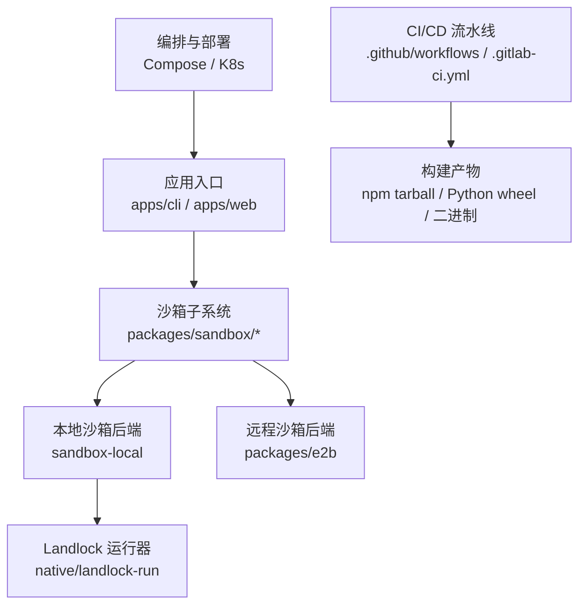
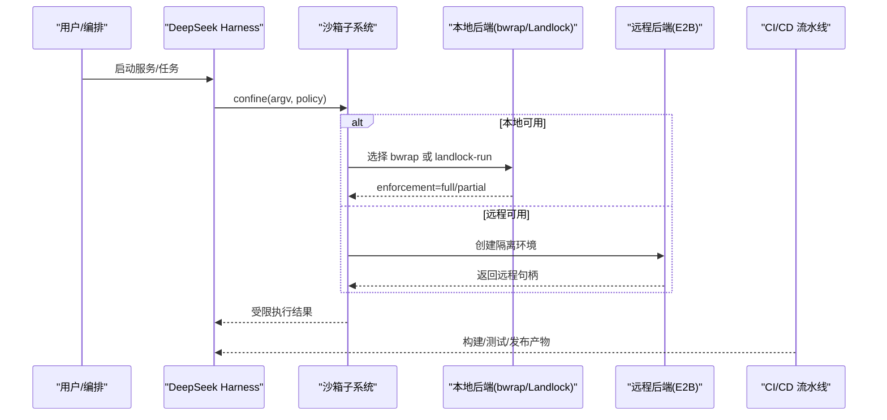
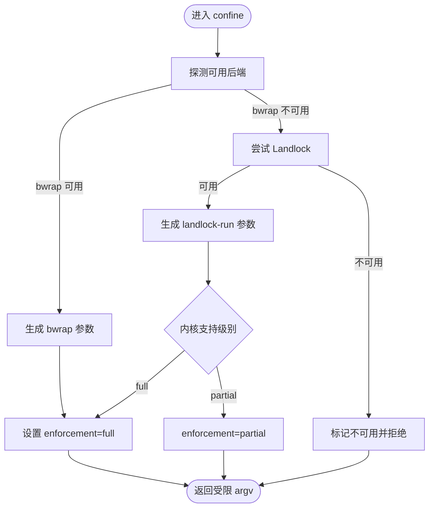
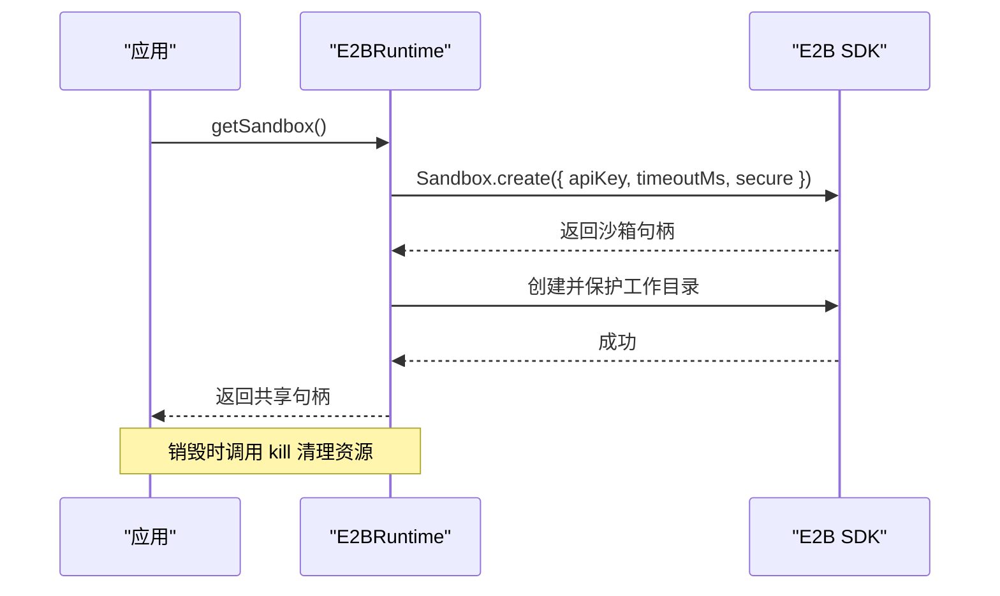
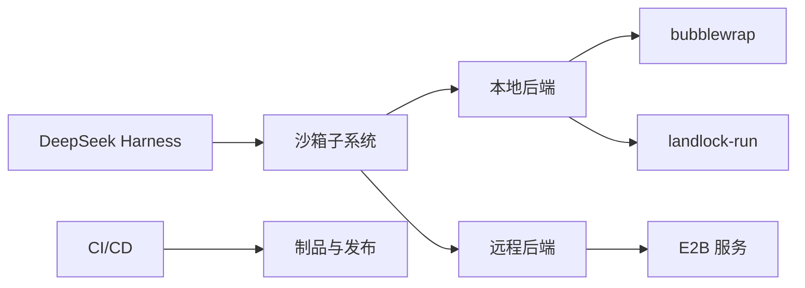

# 容器化部署

<cite>
**本文引用的文件**
- [CI 工作流](file://.github/workflows/ci.yml)
- [发布打包工作流](file://.github/workflows/release.yml)
- [GitLab CI（Python 运行时）](file://.gitlab-ci.yml)
- [本地沙箱配置文件](file://packages/sandbox/sandbox-local/src/profiles.ts)
- [E2B 远程沙箱服务](file://packages/e2b/e2b/src/index.ts)
- [Landlock 运行器说明](file://native/landlock-run/README.md)
- [沙箱子系统文档](file://docs/subsystems/sandbox.md)
- [准备 bubblewrap 脚本](file://scripts/prepare-ci-bubblewrap.sh)
</cite>

## 目录
1. [简介](#简介)
2. [项目结构](#项目结构)
3. [核心组件](#核心组件)
4. [架构总览](#架构总览)
5. [详细组件分析](#详细组件分析)
6. [依赖关系分析](#依赖关系分析)
7. [性能与镜像大小优化](#性能与镜像大小优化)
8. [故障排查指南](#故障排查指南)
9. [结论](#结论)
10. [附录：部署脚本与流水线示例](#附录部署脚本与流水线示例)

## 简介
本章节面向在容器环境中部署 DeepSeek Harness 的工程团队，聚焦以下目标：
- 构建可重复、可验证的 Docker 镜像，包含多阶段构建与体积控制策略。
- 提供容器编排配置思路（Docker Compose 与 Kubernetes），适配不同运行环境。
- 在容器中实现安全沙箱机制，包括 Landlock 权限控制与资源限制。
- 设计监控与健康检查方案，确保服务可观测性与稳定性。
- 给出完整的部署脚本与自动化流水线示例，覆盖构建、测试、发布与回滚。

## 项目结构
仓库采用多包 monorepo 组织，关键与容器化相关的代码集中在如下位置：
- 工作流与 CI：`.github/workflows`、`.gitlab-ci.yml`
- 沙箱子系统：`packages/sandbox/*`、`packages/e2b/*`
- 原生 Landlock 运行器：`native/landlock-run`
- 构建与发布脚本：`scripts/*`

**图示来源**
- [CI 工作流](file://.github/workflows/ci.yml:1-120)
- [发布打包工作流](file://.github/workflows/release.yml:1-101)
- [本地沙箱配置文件](file://packages/sandbox/sandbox-local/src/profiles.ts:1-36)
- [E2B 远程沙箱服务](file://packages/e2b/e2b/src/index.ts:1-182)
- [Landlock 运行器说明](file://native/landlock-run/README.md:1-61)

**章节来源**
- [CI 工作流](file://.github/workflows/ci.yml:1-120)
- [发布打包工作流](file://.github/workflows/release.yml:1-101)

## 核心组件
- 沙箱子系统：提供统一的隔离能力抽象，支持只读、工作区写入等模式，并报告执行完整度（full/partial）。
- 本地沙箱后端：优先使用 bubblewrap，其次尝试 Landlock；根据平台与内核能力选择最佳路径。
- 远程沙箱后端：通过 E2B 创建隔离的 Linux 环境，适合需要更强隔离或云端的场景。
- Landlock 运行器：以最小权限启动子进程，仅授予必要文件系统访问，失败即关闭。
- CI/CD：多平台构建、打包、校验与发布，保证产物一致性与可追溯性。

**章节来源**
- [沙箱子系统文档](file://docs/subsystems/sandbox.md:23-39)
- [本地沙箱配置文件](file://packages/sandbox/sandbox-local/src/profiles.ts:1-36)
- [E2B 远程沙箱服务](file://packages/e2b/e2b/src/index.ts:1-182)
- [Landlock 运行器说明](file://native/landlock-run/README.md:1-61)

## 架构总览
下图展示容器内外的关键交互：应用通过沙箱子系统调用本地或远程隔离后端；CI 流水线负责构建与发布；编排层将服务与依赖组合起来。

**图示来源**
- [本地沙箱配置文件](file://packages/sandbox/sandbox-local/src/profiles.ts:1-36)
- [E2B 远程沙箱服务](file://packages/e2b/e2b/src/index.ts:1-182)
- [CI 工作流](file://.github/workflows/ci.yml:1-120)

## 详细组件分析

### 本地沙箱后端（bubblewrap 与 Landlock）
- 行为特征：
  - 优先探测 bubblewrap，若不可用则回退到 Landlock。
  - 根据策略生成参数：只读根文件系统、挂载临时目录、绑定工作区等。
  - 报告执行完整度：full 表示完全受控，partial 表示部分受控（如旧 ABI）。
- 容器影响：
  - 容器需具备相应工具链（bubblewrap）或内核能力（Landlock）。
  - 可通过环境变量或配置切换后端，便于在不同集群中灵活部署。

**图示来源**
- [本地沙箱配置文件](file://packages/sandbox/sandbox-local/src/profiles.ts:1-36)
- [沙箱子系统文档](file://docs/subsystems/sandbox.md:23-39)

**章节来源**
- [本地沙箱配置文件](file://packages/sandbox/sandbox-local/src/profiles.ts:1-36)
- [沙箱子系统文档](file://docs/subsystems/sandbox.md:23-39)

### 远程沙箱后端（E2B）
- 行为特征：
  - 通过 API Key 创建远程 Linux 沙箱，设置超时与生命周期策略。
  - 为每个会话分配独立的工作目录与运行时目录，确保隔离。
  - 在销毁时清理资源，避免残留。
- 容器影响：
  - 容器需能访问外部 E2B 服务，配置密钥与环境变量。
  - 适用于强隔离需求或无法启用内核级沙箱的环境。

**图示来源**
- [E2B 远程沙箱服务](file://packages/e2b/e2b/src/index.ts:1-182)

**章节来源**
- [E2B 远程沙箱服务](file://packages/e2b/e2b/src/index.ts:1-182)

### Landlock 运行器
- 行为特征：
  - 自限制后执行目标命令，继承规则至所有子进程。
  - 仅授予白名单文件系统访问，未授权操作被拒绝。
  - 探针用于检测内核支持与 ABI 级别。
- 容器影响：
  - 容器需启用 Landlock 内核能力；否则回退到其他后端或拒绝执行。
  - 建议将运行器作为静态链接二进制嵌入镜像，减少依赖。

**章节来源**
- [Landlock 运行器说明](file://native/landlock-run/README.md:1-61)

### CI/CD 流水线
- 行为特征：
  - 多阶段构建：安装依赖、静态检查、覆盖率、快照与制品打包。
  - 多平台发布：Linux x64/arm64、macOS arm64、Windows x64。
  - 产物校验：验证 packed install、兼容性、签名与版本一致性。
- 容器影响：
  - 可在容器化环境中复现相同构建步骤，确保一致性。
  - 利用缓存与并行化加速构建，降低流水线成本。

**章节来源**
- [CI 工作流](file://.github/workflows/ci.yml:1-120)
- [发布打包工作流](file://.github/workflows/release.yml:1-101)
- [GitLab CI（Python 运行时）](file://.gitlab-ci.yml:1-171)

## 依赖关系分析
- 应用依赖沙箱子系统提供的统一接口，屏蔽底层差异。
- 本地后端依赖 bubblewrap 或 Landlock 运行器，取决于宿主能力。
- 远程后端依赖 E2B 服务，需要网络可达与凭据配置。
- CI/CD 依赖 Node.js、Python、pnpm 等工具链，产出 npm tarball、wheel 与二进制。

**图示来源**
- [本地沙箱配置文件](file://packages/sandbox/sandbox-local/src/profiles.ts:1-36)
- [E2B 远程沙箱服务](file://packages/e2b/e2b/src/index.ts:1-182)
- [CI 工作流](file://.github/workflows/ci.yml:1-120)

**章节来源**
- [本地沙箱配置文件](file://packages/sandbox/sandbox-local/src/profiles.ts:1-36)
- [E2B 远程沙箱服务](file://packages/e2b/e2b/src/index.ts:1-182)
- [CI 工作流](file://.github/workflows/ci.yml:1-120)

## 性能与镜像大小优化
- 多阶段构建：
  - 构建阶段：安装依赖、编译、打包。
  - 运行阶段：仅拷贝必要产物与运行时依赖，剔除构建工具与源码。
- 镜像分层与缓存：
  - 将基础镜像、依赖安装与业务代码分层，提升缓存命中率。
  - 使用 `.dockerignore` 排除无关文件，减少上下文体积。
- 依赖精简：
  - 仅引入运行所需模块，移除开发依赖与调试符号。
  - 对静态链接的二进制（如 landlock-run）直接嵌入，避免动态库缺失。
- 资源限制：
  - 在编排层设置 CPU/内存上限，防止资源争用。
  - 结合沙箱子系统限制子进程的文件系统与网络访问。

[本节为通用指导，不直接分析具体文件]

## 故障排查指南
- 沙箱不可用：
  - 检查 bubblewrap 是否安装且可执行。
  - 检查内核是否启用 Landlock，以及 ABI 级别是否满足要求。
  - 查看探针输出与错误日志，确认后端选择与执行完整度。
- 远程沙箱失败：
  - 检查 E2B API Key 是否正确，网络是否可达。
  - 查看超时与生命周期配置，确保资源及时释放。
- 构建失败：
  - 检查依赖缓存与锁文件一致性。
  - 查看流水线日志中的错误定位信息，逐步缩小问题范围。

**章节来源**
- [准备 bubblewrap 脚本](file://scripts/prepare-ci-bubblewrap.sh:1-200)
- [CI 工作流](file://.github/workflows/ci.yml:1-120)

## 结论
通过在容器环境中集成沙箱子系统与 CI/CD 流水线，DeepSeek Harness 能够在不同平台上提供一致的隔离与执行能力。结合多阶段构建与资源限制，可实现高效、安全的部署与运行。建议在生产环境中优先使用本地后端（bwrap/Landlock），在强隔离需求下使用远程后端（E2B），并通过编排层统一管理健康检查与监控。

[本节为总结性内容，不直接分析具体文件]

## 附录：部署脚本与流水线示例
- Docker 镜像构建：
  - 使用多阶段构建，分离构建与运行环境。
  - 将 landlock-run 静态二进制嵌入镜像，确保最小依赖。
- Docker Compose：
  - 定义服务、网络与卷，挂载工作区与配置。
  - 设置环境变量与资源限制，启用健康检查。
- Kubernetes：
  - 使用 Deployment/Service/ConfigMap/Secret 管理应用与配置。
  - 配置 Pod 资源配额、探针与滚动更新策略。
- 流水线示例：
  - 触发条件：PR、推送、手动触发。
  - 步骤：安装依赖、构建、测试、打包、发布。
  - 缓存与并行化：提升构建速度与稳定性。

[本节为概念性指导，不直接分析具体文件]