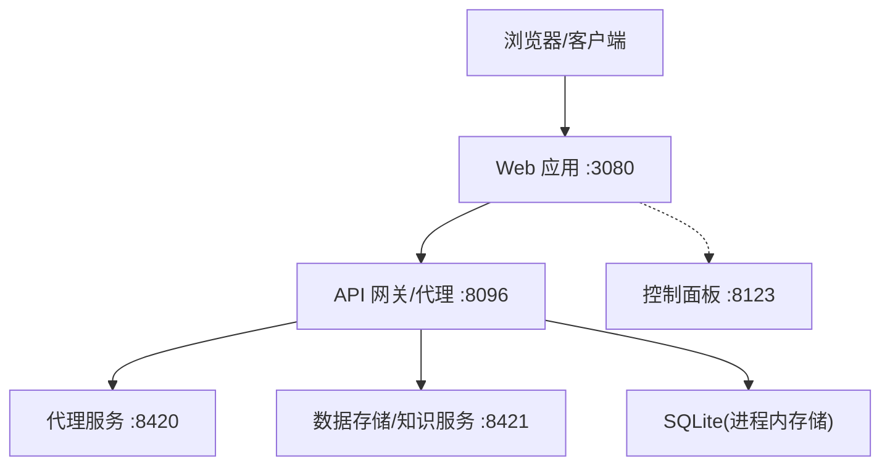
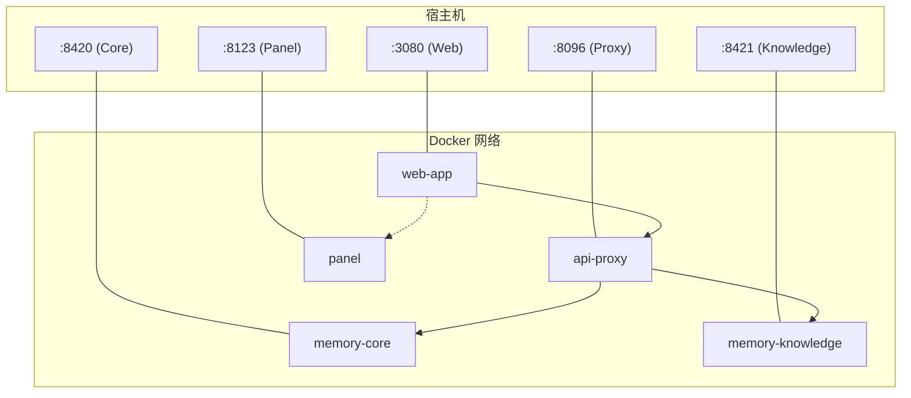
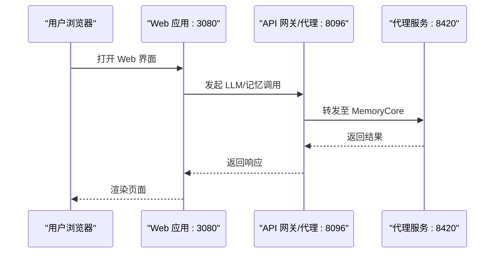
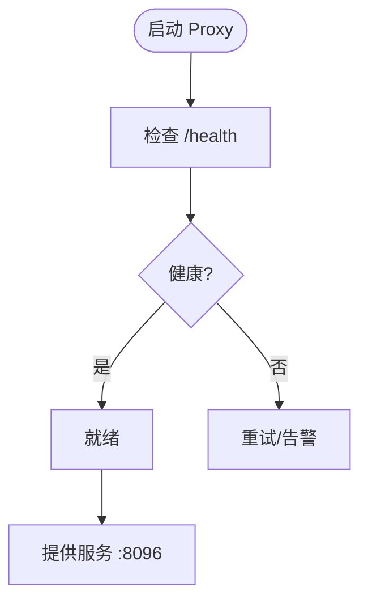
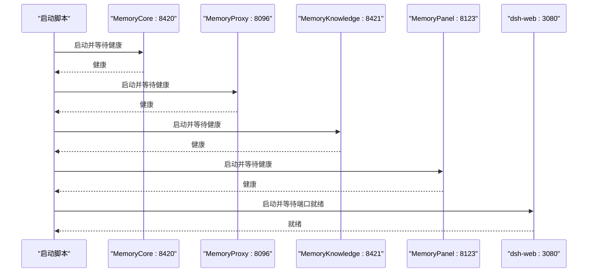

# Docker Compose配置

<cite>
**本文引用的文件**
- [scripts/setup-dsh/start-all.sh](file://scripts/setup-dsh/start-all.sh)
- [scripts/setup-dsh/setup.sh](file://scripts/setup-dsh/setup.sh)
- [scripts/setup-dsh/lib.sh](file://scripts/setup-dsh/lib.sh)
- [scripts/setup-dsh/setup.env.example](file://scripts/setup-dsh/setup.env.example)
- [scripts/setup-dsh/templates/tdai-stack/proxy-config.yaml](file://scripts/setup-dsh/templates/tdai-stack/proxy-config.yaml)
- [scripts/setup-dsh/templates/tdai-stack/tdai-gateway.yaml](file://scripts/setup-dsh/templates/tdai-stack/tdai-gateway.yaml)
- [scripts/setup-dsh/templates/settings.yaml](file://scripts/setup-dsh/templates/settings.yaml)
- [packages/host/webserver/src/index.ts](file://packages/host/webserver/src/index.ts)
- [packages/host/webserver/src/index.d.ts](file://packages/host/webserver/src/index.d.ts)
</cite>

## 目录
1. [简介](#简介)
2. [项目结构](#项目结构)
3. [核心组件](#核心组件)
4. [架构总览](#架构总览)
5. [详细组件分析](#详细组件分析)
6. [依赖关系分析](#依赖关系分析)
7. [性能考虑](#性能考虑)
8. [故障排查指南](#故障排查指南)
9. [结论](#结论)
10. [附录：Docker Compose 示例与最佳实践](#附录docker-compose-示例与最佳实践)

## 简介
本文件面向希望将 DeepSeek Harness（含 Web 应用、API 网关/代理、代理服务和数据存储）容器化部署的读者，提供基于仓库现有脚本与模板的 Docker Compose 设计说明。仓库未直接提供 docker-compose.yml，但提供了完整的本地启动脚本、环境变量模板与服务配置模板。本文将据此推导服务定义、网络、数据卷、环境变量注入策略，并给出可直接落地的 Compose 编排建议与最佳实践。

## 项目结构
仓库通过 scripts/setup-dsh 下的脚本与模板，定义了本地运行所需的完整栈：
- Web 应用：dsh Web UI（端口 3080），由 pnpm dsh web 命令启动，支持 host/port 绑定。
- API 网关/代理：MemoryProxy（端口 8096），转发到上游 LLM，并集成 MemoryCore 能力。
- 代理服务：MemoryCore（端口 8420），独立网关，负责记忆、会话、嵌入等。
- 数据存储：MemoryKnowledge（端口 8421），Wiki/代码图等服务；以及 MemoryProxy 的 SQLite 存储。
- 控制面板：MemoryPanel（端口 8123），无状态面板，绑定所有接口用于局域网访问。

图表来源
- [scripts/setup-dsh/start-all.sh:99-196](file://scripts/setup-dsh/start-all.sh#L99-L196)
- [scripts/setup-dsh/templates/tdai-stack/proxy-config.yaml:5-7](file://scripts/setup-dsh/templates/tdai-stack/proxy-config.yaml#L5-L7)
- [scripts/setup-dsh/templates/tdai-stack/tdai-gateway.yaml:7-9](file://scripts/setup-dsh/templates/tdai-stack/tdai-gateway.yaml#L7-L9)

章节来源
- [scripts/setup-dsh/start-all.sh:1-212](file://scripts/setup-dsh/start-all.sh#L1-L212)
- [scripts/setup-dsh/lib.sh:10-135](file://scripts/setup-dsh/lib.sh#L10-L135)

## 核心组件
- Web 应用（dsh-web）
  - 启动方式：pnpm dsh web --host 0.0.0.0 --port 3080
  - 监听地址：默认回环或全接口（由组合层控制）
  - 健康检查：无公开 /health，需使用 TCP 端口探测
- API 网关/代理（MemoryProxy）
  - 端口：8096
  - 上游 LLM：可配置 URL 与 API Key
  - 存储：SQLite（better-sqlite3 原生绑定）
  - 健康检查：/health
- 代理服务（MemoryCore）
  - 端口：8420
  - 模式：standalone + sqlite
  - 健康检查：/health
- 数据存储/知识服务（MemoryKnowledge）
  - 端口：8421
  - 健康检查：/health
- 控制面板（MemoryPanel）
  - 端口：8123
  - 健康检查：/health
  - 绑定：0.0.0.0（便于局域网访问）

章节来源
- [scripts/setup-dsh/start-all.sh:99-196](file://scripts/setup-dsh/start-all.sh#L99-L196)
- [scripts/setup-dsh/templates/tdai-stack/proxy-config.yaml:5-75](file://scripts/setup-dsh/templates/tdai-stack/proxy-config.yaml#L5-L75)
- [scripts/setup-dsh/templates/tdai-stack/tdai-gateway.yaml:1-69](file://scripts/setup-dsh/templates/tdai-stack/tdai-gateway.yaml#L1-L69)

## 架构总览
下图展示了容器间通信、端口映射与服务发现机制。每个服务以独立容器运行，通过 Docker 内部网络进行通信；对外暴露端口供浏览器或外部系统访问。

图表来源
- [scripts/setup-dsh/start-all.sh:99-196](file://scripts/setup-dsh/start-all.sh#L99-L196)
- [scripts/setup-dsh/lib.sh:126-135](file://scripts/setup-dsh/lib.sh#L126-L135)

## 详细组件分析

### Web 应用（dsh-web）
- 启动参数：--host 0.0.0.0 --port 3080
- 安全边界：WebServer 支持 host 为 127.0.0.1 或 0.0.0.0；绑定 0.0.0.0 会暴露到局域网，需配合防火墙或反向代理。
- 健康检查：无 HTTP /health，仅能使用 TCP 端口就绪检测。

图表来源
- [scripts/setup-dsh/start-all.sh:190-196](file://scripts/setup-dsh/start-all.sh#L190-L196)
- [packages/host/webserver/src/index.ts:154-186](file://packages/host/webserver/src/index.ts#L154-L186)
- [packages/host/webserver/src/index.d.ts:37-42](file://packages/host/webserver/src/index.d.ts#L37-L42)

章节来源
- [scripts/setup-dsh/start-all.sh:190-196](file://scripts/setup-dsh/start-all.sh#L190-L196)
- [packages/host/webserver/src/index.ts:154-186](file://packages/host/webserver/src/index.ts#L154-L186)
- [packages/host/webserver/src/index.d.ts:37-42](file://packages/host/webserver/src/index.d.ts#L37-L42)

### API 网关/代理（MemoryProxy）
- 端口：8096
- 上游 LLM：url 与 apiKey 可配置
- 存储：sqlite（需要 better-sqlite3 原生绑定）
- 健康检查：/health

图表来源
- [scripts/setup-dsh/start-all.sh:154-180](file://scripts/setup-dsh/start-all.sh#L154-L180)
- [scripts/setup-dsh/templates/tdai-stack/proxy-config.yaml:5-75](file://scripts/setup-dsh/templates/tdai-stack/proxy-config.yaml#L5-L75)

章节来源
- [scripts/setup-dsh/start-all.sh:154-180](file://scripts/setup-dsh/start-all.sh#L154-L180)
- [scripts/setup-dsh/templates/tdai-stack/proxy-config.yaml:5-75](file://scripts/setup-dsh/templates/tdai-stack/proxy-config.yaml#L5-L75)

### 代理服务（MemoryCore）
- 端口：8420
- 模式：standalone + sqlite
- 健康检查：/health

章节来源
- [scripts/setup-dsh/start-all.sh:99-101](file://scripts/setup-dsh/start-all.sh#L99-L101)
- [scripts/setup-dsh/templates/tdai-stack/tdai-gateway.yaml:1-69](file://scripts/setup-dsh/templates/tdai-stack/tdai-gateway.yaml#L1-L69)

### 数据存储/知识服务（MemoryKnowledge）
- 端口：8421
- 健康检查：/health

章节来源
- [scripts/setup-dsh/start-all.sh:182-184](file://scripts/setup-dsh/start-all.sh#L182-L184)

### 控制面板（MemoryPanel）
- 端口：8123
- 健康检查：/health
- 绑定：0.0.0.0（便于局域网访问）

章节来源
- [scripts/setup-dsh/start-all.sh:186-188](file://scripts/setup-dsh/start-all.sh#L186-L188)

## 依赖关系分析
- 启动顺序：MemoryCore → MemoryProxy → MemoryKnowledge → MemoryPanel → dsh-web
- 健康检查：每个服务在启动后等待其 /health 或 TCP 端口就绪再启动下一个
- 存储依赖：MemoryProxy 依赖 better-sqlite3 原生绑定；缺失时降级为内存存储，导致 memory-bridge 返回 40101

图表来源
- [scripts/setup-dsh/start-all.sh:99-196](file://scripts/setup-dsh/start-all.sh#L99-L196)
- [scripts/setup-dsh/lib.sh:88-107](file://scripts/setup-dsh/lib.sh#L88-L107)

章节来源
- [scripts/setup-dsh/start-all.sh:99-196](file://scripts/setup-dsh/start-all.sh#L99-L196)
- [scripts/setup-dsh/lib.sh:88-107](file://scripts/setup-dsh/lib.sh#L88-L107)

## 性能考虑
- 日志与磁盘：各服务均输出日志到指定目录（如 tdai-stack/logs），应挂载持久卷以避免重启丢失。
- 存储后端：MemoryProxy 使用 SQLite，确保 better-sqlite3 原生绑定可用；否则降级影响功能。
- 网络绑定：Web 应用与 Panel 默认可能绑定 0.0.0.0，生产环境建议通过反向代理限制来源 IP。
- 资源限制：在生产环境中为每个服务设置 CPU/内存上限，避免相互影响。

[本节为通用指导，不直接分析具体文件]

## 故障排查指南
- 端口占用：若端口已被占用，脚本会尝试卸载旧实例并等待端口释放；Compose 中可通过 restart 策略与 depends_on 管理。
- 健康检查失败：确认服务 /health 可达；Web 应用无 /health，需使用 TCP 端口就绪。
- 存储降级：若 Proxy 报告 storage.effective 为空或不匹配，检查 better-sqlite3 安装与 Node ABI 一致性。
- 配置缺失：确保 .env.local、proxy-config.yaml、.env 等配置文件存在且权限正确（0600）。

章节来源
- [scripts/setup-dsh/start-all.sh:76-97](file://scripts/setup-dsh/start-all.sh#L76-L97)
- [scripts/setup-dsh/start-all.sh:160-180](file://scripts/setup-dsh/start-all.sh#L160-L180)
- [scripts/setup-dsh/lib.sh:88-107](file://scripts/setup-dsh/lib.sh#L88-L107)

## 结论
仓库通过脚本与模板定义了完整的本地运行栈。基于这些材料，可以构建出稳定、可维护的 Docker Compose 编排：明确服务定义、网络与端口映射、数据卷挂载、环境变量注入与健康检查策略。生产环境建议引入反向代理、认证与限流，并对敏感信息进行集中管理。

[本节为总结性内容，不直接分析具体文件]

## 附录：Docker Compose 示例与最佳实践

### 服务定义与端口映射
- web-app: 暴露 3080，命令参考 pnpm dsh web --host 0.0.0.0 --port 3080
- api-proxy: 暴露 8096，命令参考 node --import tsx/esm src/index.ts --config <路径>
- memory-core: 暴露 8420，命令参考 node --import tsx src/gateway/server.ts
- memory-knowledge: 暴露 8421，命令参考 pnpm dev
- panel: 暴露 8123，命令参考 pnpm dev

章节来源
- [scripts/setup-dsh/start-all.sh:99-196](file://scripts/setup-dsh/start-all.sh#L99-L196)

### 网络配置
- 使用自定义桥接网络隔离服务
- 服务间通过容器名解析（如 api-proxy、memory-core）
- 对外仅暴露必要端口（3080、8096、8123 等）

章节来源
- [scripts/setup-dsh/start-all.sh:99-196](file://scripts/setup-dsh/start-all.sh#L99-L196)

### 数据卷挂载策略
- 日志卷：挂载 tdai-stack/logs 以便持久化
- 配置卷：挂载 proxy-config.yaml、tdai-gateway.yaml、settings.yaml
- 数据卷：根据实际存储位置挂载（如 MemoryCore 的数据目录）

章节来源
- [scripts/setup-dsh/templates/tdai-stack/proxy-config.yaml:14-17](file://scripts/setup-dsh/templates/tdai-stack/proxy-config.yaml#L14-L17)
- [scripts/setup-dsh/templates/tdai-stack/tdai-gateway.yaml:10-11](file://scripts/setup-dsh/templates/tdai-stack/tdai-gateway.yaml#L10-L11)

### 环境变量管理
- 敏感信息：通过 .env 文件或密钥管理服务注入（如 DEEPSEEK_API_KEY、FEISHU_*、TDAI_LLM_*）
- 多环境：使用不同 .env 文件与环境变量前缀区分
- 配置注入：通过模板生成配置文件（proxy-config.yaml、tdai-gateway.yaml、settings.yaml）

章节来源
- [scripts/setup-dsh/setup.env.example:22-88](file://scripts/setup-dsh/setup.env.example#L22-L88)
- [scripts/setup-dsh/setup.sh:41-60](file://scripts/setup-dsh/setup.sh#L41-L60)
- [scripts/setup-dsh/templates/settings.yaml:5-56](file://scripts/setup-dsh/templates/settings.yaml#L5-L56)

### 健康检查与启动顺序
- 使用 depends_on 与 healthcheck 确保依赖就绪
- Web 应用无 /health，使用 TCP 端口就绪检测

章节来源
- [scripts/setup-dsh/start-all.sh:99-196](file://scripts/setup-dsh/start-all.sh#L99-L196)
- [scripts/setup-dsh/lib.sh:88-107](file://scripts/setup-dsh/lib.sh#L88-L107)

### 最佳实践建议
- 使用只读配置卷与可写数据卷分离
- 为每个服务设置资源限制与重启策略
- 生产环境启用反向代理与认证
- 定期备份数据卷与配置文件
- 监控健康端点与日志聚合

[本节为通用指导，不直接分析具体文件]