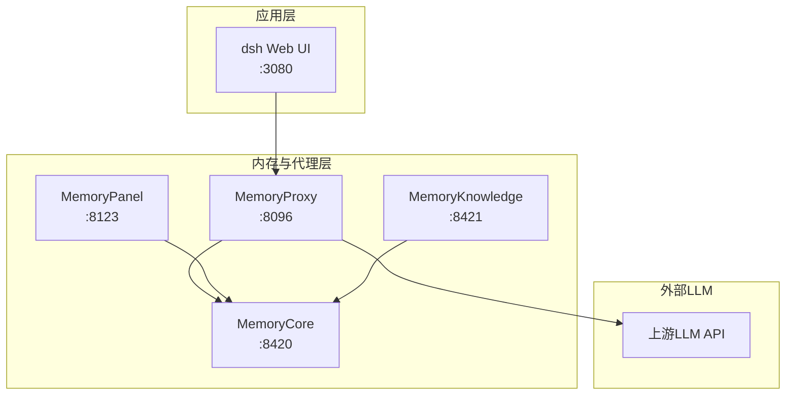
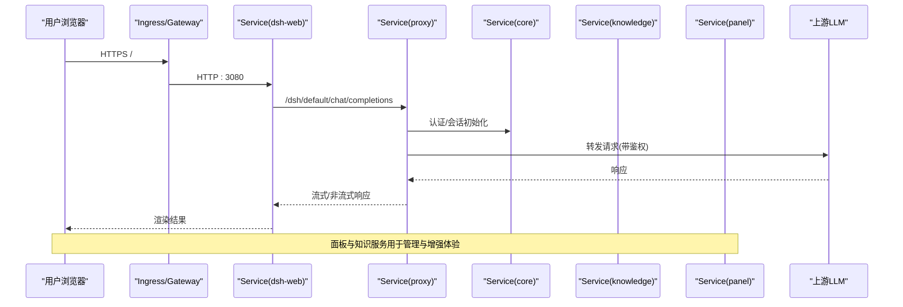
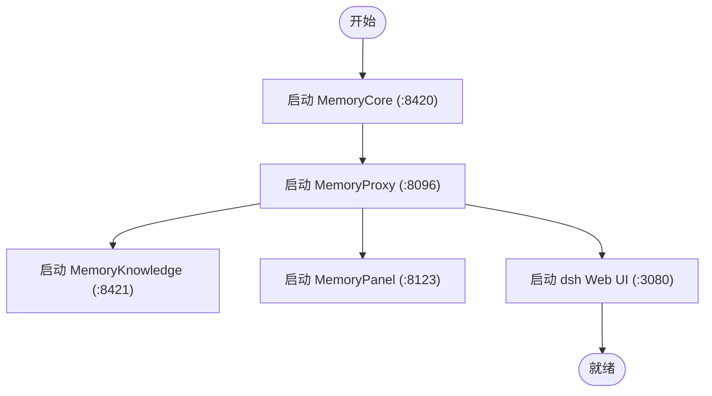

# Kubernetes部署清单

<cite>
**本文引用的文件**
- [scripts/setup-dsh/start-all.sh](file://scripts/setup-dsh/start-all.sh)
- [scripts/setup-dsh/setup.sh](file://scripts/setup-dsh/setup.sh)
- [scripts/setup-dsh/lib.sh](file://scripts/setup-dsh/lib.sh)
- [scripts/setup-dsh/templates/tdai-stack/proxy-config.yaml](file://scripts/setup-dsh/templates/tdai-stack/proxy-config.yaml)
- [scripts/setup-dsh/templates/tdai-stack/tdai-gateway.yaml](file://scripts/setup-dsh/templates/tdai-stack/tdai-gateway.yaml)
- [scripts/setup-dsh/templates/settings.yaml](file://scripts/setup-dsh/templates/settings.yaml)
</cite>

## 目录
1. [简介](#简介)
2. [项目结构](#项目结构)
3. [核心组件](#核心组件)
4. [架构总览](#架构总览)
5. [详细组件分析](#详细组件分析)
6. [依赖关系分析](#依赖关系分析)
7. [性能与资源建议](#性能与资源建议)
8. [故障排查指南](#故障排查指南)
9. [结论](#结论)
10. [附录：Kubernetes清单模板](#附录kubernetes清单模板)

## 简介
本文件面向在Kubernetes上部署DeepSeek Harness及其TencentDB-Agent-Memory（TDAI）栈的运维与平台团队。文档基于仓库内本地启动脚本与配置模板，提炼出生产可用的Deployment、Service、ConfigMap/Secret、Ingress、健康检查、自动扩缩容与监控集成方案，帮助你在不同环境（开发/测试/生产）中安全、可观测地运行该套件。

## 项目结构
仓库未包含现成的Kubernetes清单，但提供了完整的本地部署脚本与配置模板，可用于推导容器化编排要素：
- 服务端口与依赖顺序由启动脚本定义
- 各服务的运行时配置以YAML模板形式提供
- 敏感信息通过环境变量或外部密钥管理注入

**图示来源**
- [scripts/setup-dsh/start-all.sh:99-196](file://scripts/setup-dsh/start-all.sh#L99-L196)
- [scripts/setup-dsh/templates/tdai-stack/proxy-config.yaml:5-75](file://scripts/setup-dsh/templates/tdai-stack/proxy-config.yaml#L5-L75)
- [scripts/setup-dsh/templates/tdai-stack/tdai-gateway.yaml:5-69](file://scripts/setup-dsh/templates/tdai-stack/tdai-gateway.yaml#L5-L69)

**章节来源**
- [scripts/setup-dsh/start-all.sh:1-212](file://scripts/setup-dsh/start-all.sh#L1-L212)
- [scripts/setup-dsh/templates/tdai-stack/proxy-config.yaml:1-75](file://scripts/setup-dsh/templates/tdai-stack/proxy-config.yaml#L1-L75)
- [scripts/setup-dsh/templates/tdai-stack/tdai-gateway.yaml:1-69](file://scripts/setup-dsh/templates/tdai-stack/tdai-gateway.yaml#L1-L69)

## 核心组件
- dsh Web UI：前端入口，默认绑定所有接口并监听3080端口；无公开健康端点，需以TCP就绪探测替代HTTP探针。
- MemoryProxy：统一LLM网关，负责认证、会话注入、技能工具注入与存储持久化；对外暴露8096端口。
- MemoryCore：独立模式网关，承载元数据、记忆抽取与检索等能力；监听8420端口。
- MemoryKnowledge：Wiki与代码图服务；监听8421端口。
- MemoryPanel：控制台面板，绑定所有接口，监听8123端口。

上述组件的启动顺序与健康检查逻辑由启动脚本统一管理，便于映射为Kubernetes中的Pod生命周期与探针。

**章节来源**
- [scripts/setup-dsh/start-all.sh:99-196](file://scripts/setup-dsh/start-all.sh#L99-L196)
- [scripts/setup-dsh/lib.sh:88-107](file://scripts/setup-dsh/lib.sh#L88-L107)

## 架构总览
下图展示了从浏览器到上游LLM的完整调用链，以及各组件在Kubernetes中的职责边界。

**图示来源**
- [scripts/setup-dsh/templates/settings.yaml:5-41](file://scripts/setup-dsh/templates/settings.yaml#L5-L41)
- [scripts/setup-dsh/templates/tdai-stack/proxy-config.yaml:19-64](file://scripts/setup-dsh/templates/tdai-stack/proxy-config.yaml#L19-L64)
- [scripts/setup-dsh/start-all.sh:99-196](file://scripts/setup-dsh/start-all.sh#L99-L196)

## 详细组件分析

### Deployment设计要点
- 副本数
  - dsh Web UI：建议按流量设置HPA，初始副本1-2；无状态，可水平扩展。
  - MemoryProxy：有状态存储（SQLite），单实例即可；若启用高可用存储后端可多副本，但当前模板使用sqlite，推荐单副本。
  - MemoryCore：单实例（standalone + sqlite）。
  - MemoryKnowledge/MemoryPanel：无状态，可按需要水平扩展。
- 滚动更新策略
  - 使用RollingUpdate，maxUnavailable=1，maxSurge=1，确保零停机升级。
  - 对Web UI与面板类服务可放宽至maxSurge=2以提升更新速度。
- 资源限制
  - 为每个容器设置requests/limits（CPU/内存），结合HPA实现弹性伸缩。
  - 对LLM相关服务适当提高内存上限，避免OOM。
- 启动命令与参数
  - 参考启动脚本中的实际命令与参数，例如Node版本、配置文件路径、工作目录等，确保容器镜像内环境与本地一致。

**章节来源**
- [scripts/setup-dsh/start-all.sh:99-196](file://scripts/setup-dsh/start-all.sh#L99-L196)
- [scripts/setup-dsh/templates/tdai-stack/proxy-config.yaml:5-75](file://scripts/setup-dsh/templates/tdai-stack/proxy-config.yaml#L5-L75)
- [scripts/setup-dsh/templates/tdai-stack/tdai-gateway.yaml:5-69](file://scripts/setup-dsh/templates/tdai-stack/tdai-gateway.yaml#L5-L69)

### Service定义
- ClusterIP
  - 内部服务通信首选ClusterIP，如proxy:8096、core:8420、knowledge:8421、panel:8123。
- LoadBalancer
  - 对外暴露dsh Web UI（:3080）时可使用LoadBalancer，配合Ingress进行TLS终止与路由。
- NodePort
  - 仅在临时调试环境使用，不建议在生产暴露。

健康检查
- dsh Web UI：无HTTP健康端点，使用TCP探针检测3080端口。
- 其他服务：优先使用其/health端点（如proxy:8096/health、core:8420/health等），否则回退到TCP探针。

**章节来源**
- [scripts/setup-dsh/start-all.sh:99-196](file://scripts/setup-dsh/start-all.sh#L99-L196)
- [scripts/setup-dsh/lib.sh:88-107](file://scripts/setup-dsh/lib.sh#L88-L107)

### ConfigMap与Secret管理
- 配置分离
  - 将非敏感配置（如服务地址、功能开关）放入ConfigMap，通过环境变量或挂载卷注入。
  - 示例：proxy-config.yaml、tdai-gateway.yaml中的非敏感项可通过ConfigMap挂载。
- 敏感信息加密
  - 将API Key、令牌等敏感字段放入Secret，并通过环境变量注入到对应容器。
  - 示例：上游LLM的apiKey、PROXY_USER_KEY等应来自Secret。
- 多环境支持
  - 使用命名空间隔离不同环境（dev/staging/prod）。
  - 通过Kustomize或Helm对不同环境的ConfigMap/Secret进行差异化覆盖。

**章节来源**
- [scripts/setup-dsh/templates/tdai-stack/proxy-config.yaml:10-23](file://scripts/setup-dsh/templates/tdai-stack/proxy-config.yaml#L10-L23)
- [scripts/setup-dsh/templates/tdai-stack/tdai-gateway.yaml:12-17](file://scripts/setup-dsh/templates/tdai-stack/tdai-gateway.yaml#L12-L17)
- [scripts/setup-dsh/templates/settings.yaml:5-41](file://scripts/setup-dsh/templates/settings.yaml#L5-L41)

### Ingress配置示例
- 外部访问
  - 将域名解析到集群Ingress控制器，创建Ingress资源将域名路由到dsh Web UI Service。
- TLS终止
  - 在Ingress中配置TLS证书，关闭下游HTTPS透传，减轻后端压力。
- 路径规则
  - 根路径“/”指向dsh Web UI；如需暴露面板，可增加子路径或单独域名。

健康检查与超时
- 根据应用特性调整readinessProbe/livenessProbe与Ingress超时时间，避免误判。

**章节来源**
- [scripts/setup-dsh/start-all.sh:190-196](file://scripts/setup-dsh/start-all.sh#L190-L196)

### 健康检查探针配置
- dsh Web UI：由于无HTTP健康端点，使用TCP探针检测3080端口。
- 其他服务：优先使用/health端点；若无则回退到TCP探针。
- 探针参数建议
  - initialDelaySeconds：根据启动耗时设置（如60-120秒）。
  - periodSeconds：10-30秒。
  - timeoutSeconds：5-10秒。
  - failureThreshold：3-5次失败后标记不健康。

**章节来源**
- [scripts/setup-dsh/start-all.sh:99-196](file://scripts/setup-dsh/start-all.sh#L99-L196)
- [scripts/setup-dsh/lib.sh:88-107](file://scripts/setup-dsh/lib.sh#L88-L107)

### 自动扩缩容策略（HPA）
- CPU/内存指标
  - 基于CPU利用率或自定义指标（如QPS、延迟）进行扩缩容。
- 目标值
  - 建议CPU targetUtilization=60%-70%，内存targetUtilization=70%-80%。
- 最小/最大副本
  - 根据业务峰值与成本设定minReplicas/maxReplicas。
- 预热与冷却
  - 合理设置scaleUp/scaleDown阈值与稳定窗口，避免抖动。

**章节来源**
- [scripts/setup-dsh/start-all.sh:190-196](file://scripts/setup-dsh/start-all.sh#L190-L196)

### 监控集成方案
- 日志采集
  - 将各服务日志输出到stdout/stderr，由日志收集器（如Fluent Bit/Vector）统一采集。
- 指标暴露
  - 为关键服务暴露Prometheus指标端点（如/metrics），由Prometheus抓取。
- 链路追踪
  - 对LLM调用链路增加trace上下文传递，便于定位瓶颈。
- 告警
  - 基于错误率、延迟、资源使用率设置告警规则。

**章节来源**
- [scripts/setup-dsh/templates/tdai-stack/proxy-config.yaml:14-17](file://scripts/setup-dsh/templates/tdai-stack/proxy-config.yaml#L14-L17)

## 依赖关系分析
- 启动顺序
  - MemoryCore → MemoryProxy → MemoryKnowledge → MemoryPanel → dsh Web UI
- 网络依赖
  - dsh Web UI依赖Proxy；Proxy依赖Core与上游LLM；Knowledge/Panel依赖Core。
- 配置依赖
  - Proxy与Gateway的配置分别来自模板文件；settings.yaml定义LLM提供商与模型路由。

**图示来源**
- [scripts/setup-dsh/start-all.sh:99-196](file://scripts/setup-dsh/start-all.sh#L99-L196)

**章节来源**
- [scripts/setup-dsh/start-all.sh:99-196](file://scripts/setup-dsh/start-all.sh#L99-L196)
- [scripts/setup-dsh/templates/settings.yaml:5-41](file://scripts/setup-dsh/templates/settings.yaml#L5-L41)

## 性能与资源建议
- 资源配额
  - 为每个容器设置合理的requests/limits，避免资源争用。
- 存储
  - SQLite作为单实例存储，注意磁盘I/O与备份策略。
- 缓存
  - 可在Proxy层引入Redis（当前模板禁用），提升会话与注入状态命中率。
- 连接池与超时
  - 调整上游LLM调用超时与重试策略，避免雪崩。

[本节为通用指导，无需特定文件引用]

## 故障排查指南
- 启动失败
  - 检查依赖配置是否存在（如.env.local、proxy-config.yaml），参考启动脚本的预检逻辑。
- 健康检查失败
  - 确认/health端点是否可达；对于dsh Web UI，使用TCP探针验证端口。
- 存储降级
  - 若Proxy存储后端不可用，会降级为内存存储，导致部分功能异常；需修复存储依赖。
- 权限问题
  - 确保敏感文件权限正确（如0600），避免读取失败。

**章节来源**
- [scripts/setup-dsh/start-all.sh:51-72](file://scripts/setup-dsh/start-all.sh#L51-L72)
- [scripts/setup-dsh/start-all.sh:160-180](file://scripts/setup-dsh/start-all.sh#L160-L180)
- [scripts/setup-dsh/setup.sh:611-642](file://scripts/setup-dsh/setup.sh#L611-L642)

## 结论
通过将本地启动脚本与配置模板抽象为Kubernetes编排要素，可实现DeepSeek Harness的稳定部署。重点在于：明确服务依赖与健康检查、合理划分ConfigMap/Secret、使用Ingress进行外部访问与TLS终止、结合HPA实现弹性伸缩，并完善监控与告警体系。

[本节为总结性内容，无需特定文件引用]

## 附录：Kubernetes清单模板
以下为可直接使用的Kubernetes清单模板，涵盖Deployment、Service、ConfigMap/Secret、Ingress、HPA与探针配置。请根据实际环境替换变量与证书。

- Deployment（示例：dsh Web UI）
  - 容器镜像：使用构建后的dsh-web镜像
  - 端口：3080
  - 探针：readinessProbe与livenessProbe使用tcpSocket:3080
  - 资源：requests/limits按需设置
  - 环境变量：从ConfigMap/Secret注入

- Service（示例：dsh Web UI）
  - type: LoadBalancer（或Ingress+ClusterIP）
  - port: 3080

- ConfigMap/Secret
  - ConfigMap：存放非敏感配置（如proxy地址、功能开关）
  - Secret：存放API Key、令牌等敏感信息

- Ingress
  - 域名：app.example.com
  - TLS：配置证书
  - 路由：/ → dsh Web UI Service

- HPA
  - 目标：CPU利用率60%-70%
  - 副本范围：min=1, max=5（根据负载调整）

- 探针参数建议
  - initialDelaySeconds: 60-120
  - periodSeconds: 10-30
  - timeoutSeconds: 5-10
  - failureThreshold: 3-5

[本节为模板说明，无需特定文件引用]