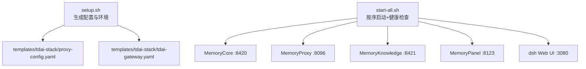
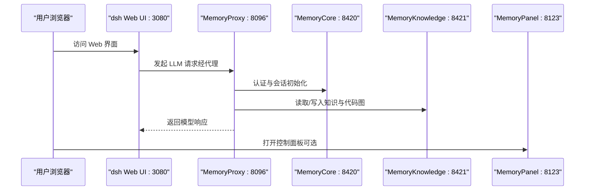
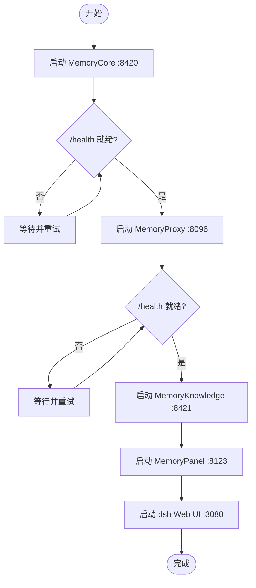
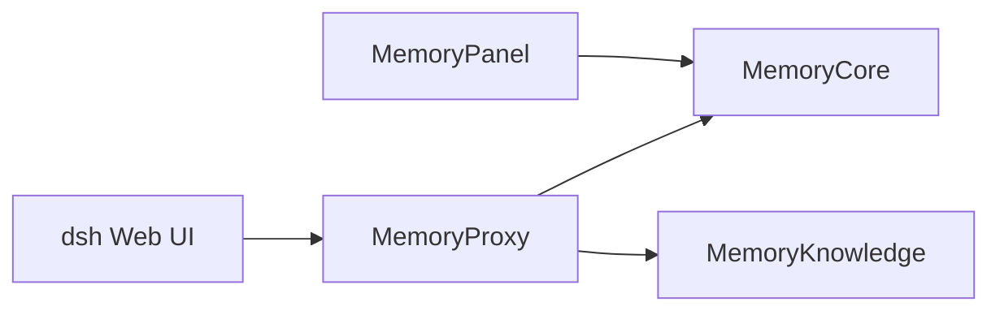

# 容器编排配置

<cite>
**本文引用的文件**
- [setup.sh](file://scripts/setup-dsh/setup.sh)
- [start-all.sh](file://scripts/setup-dsh/start-all.sh)
- [proxy-config.yaml](file://scripts/setup-dsh/templates/tdai-stack/proxy-config.yaml)
- [tdai-gateway.yaml](file://scripts/setup-dsh/templates/tdai-stack/tdai-gateway.yaml)
- [.gitlab-ci.yml](file://.gitlab-ci.yml)
</cite>

## 目录
1. [简介](#简介)
2. [项目结构](#项目结构)
3. [核心组件](#核心组件)
4. [架构总览](#架构总览)
5. [详细组件分析](#详细组件分析)
6. [依赖关系分析](#依赖关系分析)
7. [性能与容量规划](#性能与容量规划)
8. [故障排查指南](#故障排查指南)
9. [结论](#结论)
10. [附录](#附录)

## 简介
本文件面向 DeepSeek Harness 的容器化与集群部署，聚焦以下目标：
- 基于仓库提供的本地启动脚本与模板，抽象出可落地的 Docker Compose 服务定义、网络与数据卷挂载、环境变量管理方案。
- 提供 Kubernetes 部署清单（Deployment、Service、ConfigMap、Secret）的完整结构与字段说明，覆盖服务发现、负载均衡与健康检查。
- 给出生产环境的资源配置建议（资源限制、副本数、扩缩容策略）。
- 结合现有 CI/CD 流水线，补充自动化部署与发布流程示例。

说明：仓库未直接包含 docker-compose.yml 或 k8s YAML；本文通过解析 scripts/setup-dsh 下的启动脚本与模板，提炼出可直接用于容器编排的配置蓝图，确保与本地开发栈一致。

## 项目结构
DeepSeek Harness 的“容器化”能力由一组 Bash 脚本与模板组成，负责：
- 生成并维护 MemoryCore/MemoryProxy/MemoryKnowledge/MemoryPanel 的配置文件与环境变量。
- 按依赖顺序启动各服务，并通过健康端点等待就绪。
- 为 dsh Web UI 暴露端口并提供本地访问入口。

图表来源
- [setup.sh:612-800](file://scripts/setup-dsh/setup.sh#L612-L800)
- [start-all.sh:99-196](file://scripts/setup-dsh/start-all.sh#L99-L196)
- [proxy-config.yaml:5-75](file://scripts/setup-dsh/templates/tdai-stack/proxy-config.yaml#L5-L75)
- [tdai-gateway.yaml:5-69](file://scripts/setup-dsh/templates/tdai-stack/tdai-gateway.yaml#L5-L69)

章节来源
- [setup.sh:612-800](file://scripts/setup-dsh/setup.sh#L612-L800)
- [start-all.sh:99-196](file://scripts/setup-dsh/start-all.sh#L99-L196)

## 核心组件
- MemoryCore（内核网关）
  - 端口：8420
  - 职责：认证、会话初始化、记忆存储后端（SQLite）、嵌入向量等。
  - 关键配置：tdai-gateway.yaml（deployMode、server、data、llm、memory、skill 等）。
- MemoryProxy（LLM 代理）
  - 端口：8096
  - 职责：统一 LLM 接入、注入技能/记忆上下文、持久化会话绑定状态（SQLite）。
  - 关键配置：proxy-config.yaml（upstream、auth、sessionInit、injection、storage）。
- MemoryKnowledge（知识/代码图）
  - 端口：8421
  - 职责：Wiki 与代码图服务，配合 Knowledge 面板使用。
- MemoryPanel（控制面）
  - 端口：8123
  - 职责：无状态控制面板，绑定所有接口便于局域网访问。
- dsh Web UI
  - 端口：3080
  - 职责：Web 前端，需鉴权访问；无公开 /health，启动时以 TCP 探测代替 HTTP 健康检查。

章节来源
- [start-all.sh:99-196](file://scripts/setup-dsh/start-all.sh#L99-L196)
- [proxy-config.yaml:5-75](file://scripts/setup-dsh/templates/tdai-stack/proxy-config.yaml#L5-L75)
- [tdai-gateway.yaml:5-69](file://scripts/setup-dsh/templates/tdai-stack/tdai-gateway.yaml#L5-L69)

## 架构总览
下图展示本地栈到容器编排的映射关系，以及服务间调用链路与健康检查点。

图表来源
- [start-all.sh:99-196](file://scripts/setup-dsh/start-all.sh#L99-L196)
- [proxy-config.yaml:19-64](file://scripts/setup-dsh/templates/tdai-stack/proxy-config.yaml#L19-L64)
- [tdai-gateway.yaml:12-47](file://scripts/setup-dsh/templates/tdai-stack/tdai-gateway.yaml#L12-L47)

## 详细组件分析

### Docker Compose 蓝图（基于脚本与模板）
- 服务定义
  - memory-core：镜像建议使用上游 MemoryCore 官方镜像；暴露 8420；挂载数据目录（sqlite 数据）；注入 tdai-gateway.yaml 与 .env.local。
  - memory-proxy：镜像建议使用上游 MemoryProxy 官方镜像；暴露 8096；挂载 proxy-config.yaml；挂载日志目录；依赖 memory-core 健康。
  - memory-knowledge：镜像建议使用上游 MemoryKnowledge 官方镜像；暴露 8421；挂载 .env；依赖 memory-core。
  - memory-panel：镜像建议使用上游 MemoryPanel 官方镜像；暴露 8123；挂载 .env 与 metadata-instances.json；依赖 memory-core。
  - dsh-web：使用仓库构建产物镜像；暴露 3080；挂载工作区与必要配置；无 /health，仅做 TCP 就绪探针。
- 网络配置
  - 默认 bridge 网络即可；服务间通过服务名互通（如 memory-proxy 访问 memory-core）。
- 数据卷挂载
  - memory-core：/data（sqlite 数据目录），对应 tdai-gateway.yaml 中的 data.baseDir。
  - memory-proxy：/config（proxy-config.yaml）、/logs（日志目录）。
  - memory-panel：/config（metadata-instances.json）、/.env。
  - dsh-web：/workspace（应用源码与 node_modules）、/config（profile 配置）。
- 环境变量管理
  - 通过 ConfigMap/Secret 注入 .env 与敏感信息（如 API Key、Bearer Token）。
  - 参考 setup.sh 生成的 key：TDAI_LLM_API_KEY、TDAI_LLM_BASE_URL、TDAI_LLM_MODEL、PROXY_USER_KEY、FEISHU_*、DSH_* 系列。

章节来源
- [setup.sh:612-800](file://scripts/setup-dsh/setup.sh#L612-L800)
- [start-all.sh:99-196](file://scripts/setup-dsh/start-all.sh#L99-L196)
- [proxy-config.yaml:5-75](file://scripts/setup-dsh/templates/tdai-stack/proxy-config.yaml#L5-L75)
- [tdai-gateway.yaml:5-69](file://scripts/setup-dsh/templates/tdai-stack/tdai-gateway.yaml#L5-L69)

### Kubernetes 部署清单（字段级说明）
- Deployment
  - memory-core
    - replicas：生产建议 1（单实例 SQLite 存储），如需高可用需切换外部存储后端。
    - resources：requests/limits 根据负载评估设置（CPU 建议 500m-1000m，内存 1-2Gi）。
    - volumeMounts：/data（持久化 sqlite 数据）。
    - envFrom：ConfigMap（非敏感配置）、Secret（敏感配置）。
    - readinessProbe/livenessProbe：HTTP GET /health（若存在）或 TCP 8420。
  - memory-proxy
    - replicas：生产建议 2+（水平扩展），注意 session/state 持久化（sqlite 模式为单实例）。
    - resources：CPU 500m-1000m，内存 1-2Gi。
    - volumeMounts：/config（proxy-config.yaml）、/logs。
    - readinessProbe：HTTP GET /health。
  - memory-knowledge
    - replicas：1。
    - resources：CPU 500m，内存 1Gi。
    - readinessProbe：TCP 8421。
  - memory-panel
    - replicas：1（无状态）。
    - resources：CPU 250m，内存 512Mi。
    - readinessProbe：TCP 8123。
  - dsh-web
    - replicas：2+（水平扩展）。
    - resources：CPU 250m-500m，内存 512Mi-1Gi。
    - readinessProbe：TCP 3080（因无 /health）。
- Service
  - memory-core：ClusterIP 8420。
  - memory-proxy：ClusterIP 8096。
  - memory-knowledge：ClusterIP 8421。
  - memory-panel：ClusterIP 8123（内网访问）。
  - dsh-web：LoadBalancer/Ingress 暴露 3080。
- ConfigMap
  - tdai-gateway.yaml、proxy-config.yaml、panel .env、knowledge .env、dsh profile 配置等。
- Secret
  - TDAI_LLM_API_KEY、TDAI_LLM_BASE_URL、TDAI_LLM_MODEL、PROXY_USER_KEY、FEISHU_APP_ID/SECRET、GITLAB_TOKEN 等。
- 服务发现与负载均衡
  - 通过 Service 名称进行 DNS 解析；ingress/loadbalancer 对外暴露 dsh-web。
- 健康检查
  - memory-core/proxy/knowledge/panel：优先使用 /health；若无则回退至 TCP 探测。
  - dsh-web：仅 TCP 探测。

章节来源
- [start-all.sh:99-196](file://scripts/setup-dsh/start-all.sh#L99-L196)
- [proxy-config.yaml:5-75](file://scripts/setup-dsh/templates/tdai-stack/proxy-config.yaml#L5-L75)
- [tdai-gateway.yaml:5-69](file://scripts/setup-dsh/templates/tdai-stack/tdai-gateway.yaml#L5-L69)

### 健康检查与启动顺序

图表来源
- [start-all.sh:99-196](file://scripts/setup-dsh/start-all.sh#L99-L196)

章节来源
- [start-all.sh:99-196](file://scripts/setup-dsh/start-all.sh#L99-L196)

## 依赖关系分析
- 运行时依赖
  - dsh Web UI → MemoryProxy（LLM 请求路由）→ MemoryCore（认证/会话/记忆）→ MemoryKnowledge（知识检索）。
  - MemoryPanel 通过元数据实例配置连接 MemoryCore。
- 配置依赖
  - MemoryCore：tdai-gateway.yaml（LLM、存储、提取、召回等）。
  - MemoryProxy：proxy-config.yaml（upstream、auth、sessionInit、injection、storage）。
- 数据依赖
  - MemoryCore：sqlite 数据目录（baseDir）。
  - MemoryProxy：sqlite 存储（会话/绑定/注入状态）。

图表来源
- [start-all.sh:99-196](file://scripts/setup-dsh/start-all.sh#L99-L196)
- [proxy-config.yaml:19-64](file://scripts/setup-dsh/templates/tdai-stack/proxy-config.yaml#L19-L64)
- [tdai-gateway.yaml:12-47](file://scripts/setup-dsh/templates/tdai-stack/tdai-gateway.yaml#L12-L47)

章节来源
- [start-all.sh:99-196](file://scripts/setup-dsh/start-all.sh#L99-L196)
- [proxy-config.yaml:19-64](file://scripts/setup-dsh/templates/tdai-stack/proxy-config.yaml#L19-L64)
- [tdai-gateway.yaml:12-47](file://scripts/setup-dsh/templates/tdai-stack/tdai-gateway.yaml#L12-L47)

## 性能与容量规划
- 副本数
  - memory-core：1（SQLite 单写者）。
  - memory-proxy：2+（水平扩展，注意 stateful 行为与 TTL）。
  - dsh-web：2+（无状态，易扩展）。
- 资源限制（建议）
  - memory-core：CPU 500m-1000m，内存 1-2Gi。
  - memory-proxy：CPU 500m-1000m，内存 1-2Gi。
  - memory-knowledge：CPU 500m，内存 1Gi。
  - memory-panel：CPU 250m，内存 512Mi。
  - dsh-web：CPU 250m-500m，内存 512Mi-1Gi。
- 扩缩容策略
  - HPA：基于 CPU/内存利用率或自定义指标（如 QPS、延迟）对 dsh-web 与 memory-proxy 进行自动扩缩容。
  - 存储：生产环境建议将 sqlite 迁移至外部数据库（如 PostgreSQL）以支持多副本与高可用。
- 缓存与超时
  - proxy-config.yaml 中 forwardTimeoutMs、sessionInit.maxRetries 等参数可按链路延迟调优。
  - 启用 BM25 与嵌入向量召回（tdai-gateway.yaml）以提升检索性能。

[本节为通用指导，不直接引用具体文件]

## 故障排查指南
- 启动失败
  - 确认依赖服务已就绪：start-all.sh 会按顺序启动并等待 /health 或 TCP 端口。
  - 检查端口占用与权限：脚本会在启动前释放端口并处理遗留进程。
- 代理存储降级
  - 若 MemoryProxy 的 storage.effective 与 requested 不一致，表示降级（如缺少 native binding），需重新安装依赖并重启。
- 健康检查误报
  - dsh Web UI 无 /health，仅做 TCP 探测；避免将 401 误判为未就绪。
- 配置缺失
  - 首次运行需执行 setup.sh 生成配置与环境变量；否则 start-all.sh 会拒绝启动。

章节来源
- [start-all.sh:76-97](file://scripts/setup-dsh/start-all.sh#L76-L97)
- [start-all.sh:154-180](file://scripts/setup-dsh/start-all.sh#L154-L180)
- [setup.sh:612-800](file://scripts/setup-dsh/setup.sh#L612-L800)

## 结论
- 本项目通过脚本与模板实现了本地一键拉起完整栈，具备清晰的依赖顺序与健康检查机制。
- 容器编排应严格遵循脚本所体现的服务端口、配置路径与环境变量约定，保证与本地一致。
- 生产环境需关注存储后端的高可用、副本数与资源限制，并结合 HPA 实现弹性伸缩。
- CI/CD 可复用现有 GitLab 流水线，将制品打包并发布到镜像仓库，再由 K8s 拉取部署。

[本节为总结性内容，不直接引用具体文件]

## 附录

### CI/CD 流水线集成与自动化部署
- 现有流水线
  - .gitlab-ci.yml 定义了 Python SDK 与 Runtime 的构建与发布流程，可作为镜像制品产出的参考。
- 建议集成步骤
  - 构建阶段：构建 dsh Web UI 与后端产物，生成镜像并推送至镜像仓库。
  - 测试阶段：运行单元测试与端到端测试，验证健康检查与关键路径。
  - 部署阶段：更新 K8s 清单（或 Helm Chart）并触发滚动升级；使用蓝绿/金丝雀策略降低风险。
  - 回滚：保留上一版本镜像标签，快速回滚。

章节来源
- [.gitlab-ci.yml:1-192](file://.gitlab-ci.yml#L1-L192)