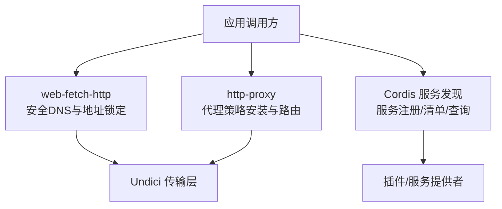
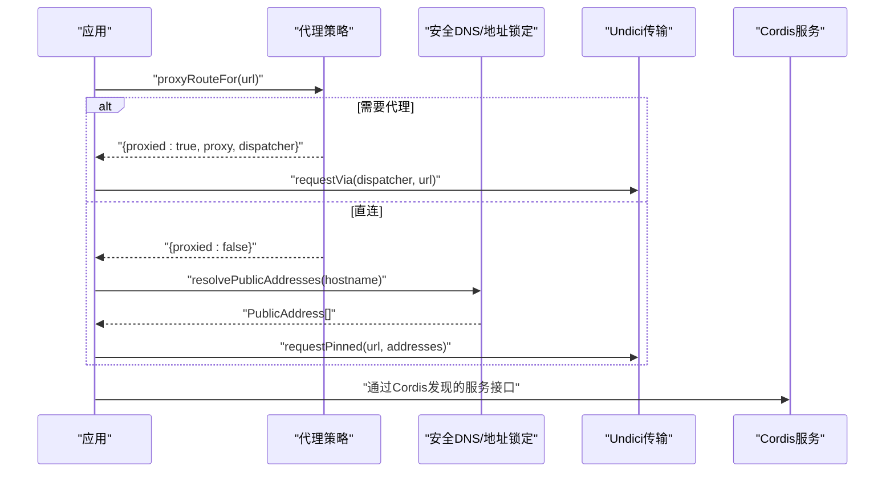
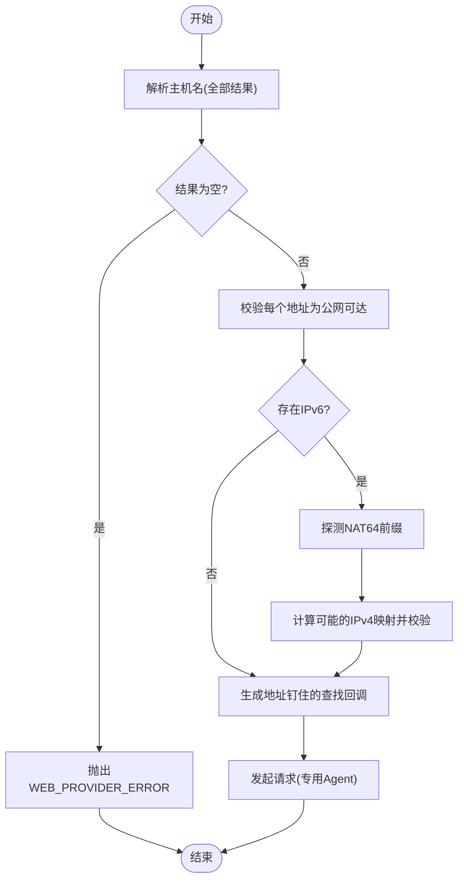
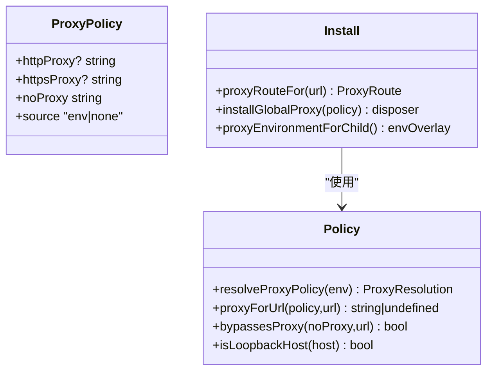
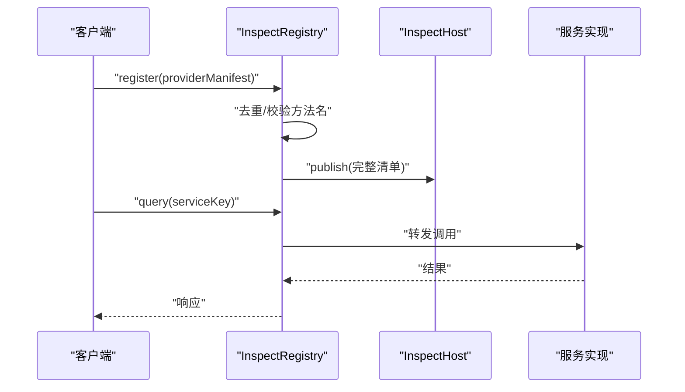
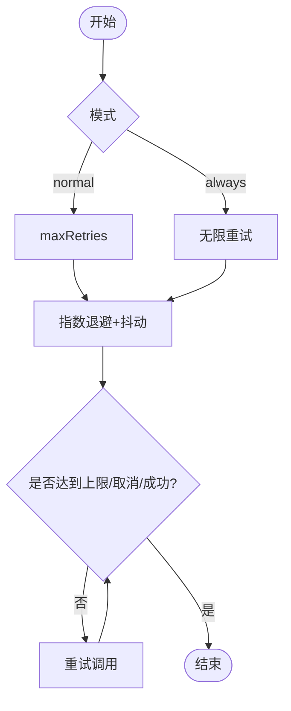
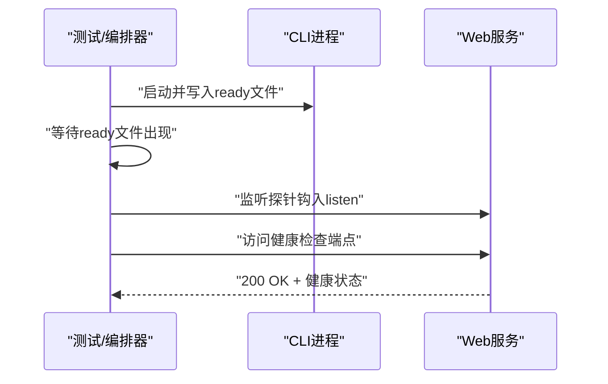
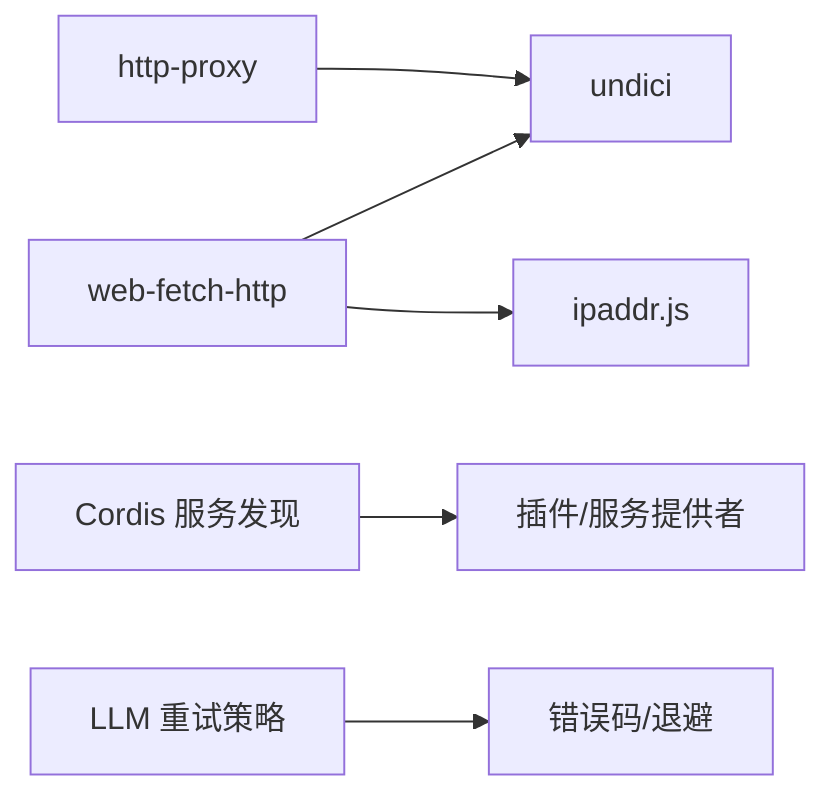

# 服务发现与负载均衡

<cite>
**本文引用的文件**
- [packages/web/web-fetch-http/src/network.ts](file://packages/web/web-fetch-http/src/network.ts)
- [packages/util/http-proxy/src/install.ts](file://packages/util/http-proxy/src/install.ts)
- [packages/util/http-proxy/src/policy.ts](file://packages/util/http-proxy/src/policy.ts)
- [packages/llm/llm/src/retry-policy.ts](file://packages/llm/llm/src/retry-policy.ts)
- [packages/extensions/tool-cordis/src/inspect.ts](file://packages/extensions/tool-cordis/src/inspect.ts)
- [packages/extensions/cordis-client-runner/src/client/inspect-registry.ts](file://packages/extensions/cordis-client-runner/src/client/inspect-registry.ts)
- [apps/cli/tests/built-bin.e2e.ts](file://apps/cli/tests/built-bin.e2e.ts)
- [apps/web/tests/support/listen-probe.mjs](file://apps/web/tests/support/listen-probe.mjs)
</cite>

## 目录
1. [简介](#简介)
2. [项目结构](#项目结构)
3. [核心组件](#核心组件)
4. [架构总览](#架构总览)
5. [详细组件分析](#详细组件分析)
6. [依赖关系分析](#依赖关系分析)
7. [性能考量](#性能考量)
8. [故障排查指南](#故障排查指南)
9. [结论](#结论)
10. [附录](#附录)

## 简介
本文件聚焦 DeepSeek Harness 在服务发现、负载均衡与健康检查方面的实现与最佳实践，覆盖：
- 内部服务发现机制：DNS 解析策略、服务注册与发现协议（Cordis）
- 负载均衡策略：轮询、加权轮询、基于会话的负载均衡配置建议
- 健康检查：存活探针、就绪探针与自定义健康检查端点
- 服务网格集成：Istio 与 Linkerd 的配置示例
- 可靠性：故障转移、重试机制与熔断器配置的最佳实践

## 项目结构
围绕网络与服务治理的关键代码分布在以下模块：
- 网络与安全 DNS：对域名进行一次性解析并锁定地址集，防止连接时 DNS 切换导致的安全风险
- HTTP 代理策略：统一决定请求是否走代理、走哪个代理，以及直连白名单
- Cordis 服务发现：进程内服务注册、清单发布与查询分发
- 重试策略：面向 LLM 提供方的可配置重试与退避

图表来源
- [packages/web/web-fetch-http/src/network.ts:1-302](file://packages/web/web-fetch-http/src/network.ts#L1-L302)
- [packages/util/http-proxy/src/install.ts:1-316](file://packages/util/http-proxy/src/install.ts#L1-L316)
- [packages/util/http-proxy/src/policy.ts:1-344](file://packages/util/http-proxy/src/policy.ts#L1-L344)
- [packages/extensions/tool-cordis/src/inspect.ts:53-80](file://packages/extensions/tool-cordis/src/inspect.ts#L53-L80)
- [packages/extensions/cordis-client-runner/src/client/inspect-registry.ts:38-73](file://packages/extensions/cordis-client-runner/src/client/inspect-registry.ts#L38-L73)

章节来源
- [packages/web/web-fetch-http/src/network.ts:1-302](file://packages/web/web-fetch-http/src/network.ts#L1-L302)
- [packages/util/http-proxy/src/install.ts:1-316](file://packages/util/http-proxy/src/install.ts#L1-L316)
- [packages/util/http-proxy/src/policy.ts:1-344](file://packages/util/http-proxy/src/policy.ts#L1-L344)
- [packages/extensions/tool-cordis/src/inspect.ts:53-80](file://packages/extensions/tool-cordis/src/inspect.ts#L53-L80)
- [packages/extensions/cordis-client-runner/src/client/inspect-registry.ts:38-73](file://packages/extensions/cordis-client-runner/src/client/inspect-registry.ts#L38-L73)

## 核心组件
- 安全 DNS 与地址锁定：在发起连接前对主机名进行一次解析，校验所有返回地址为公网可达，并将该地址集“钉住”到本次请求的连接查找中，避免连接阶段再次解析被劫持或漂移。
- HTTP 代理策略：将环境变量中的代理配置解析为统一策略，按 URL 协议、回环地址与白名单决定是否走代理；支持安装全局调度器并在卸载时恢复。
- Cordis 服务发现：通过清单与运行时状态暴露进程内服务，客户端侧维护提供者注册表并发布完整清单，支持查询分发。
- 重试策略：为 LLM 提供方定义可配置的“正常模式”与“始终重试”模式，包含指数退避与抖动参数，用于瞬态失败的重试与恢复。

章节来源
- [packages/web/web-fetch-http/src/network.ts:66-110](file://packages/web/web-fetch-http/src/network.ts#L66-L110)
- [packages/util/http-proxy/src/policy.ts:306-343](file://packages/util/http-proxy/src/policy.ts#L306-L343)
- [packages/util/http-proxy/src/install.ts:174-223](file://packages/util/http-proxy/src/install.ts#L174-L223)
- [packages/extensions/tool-cordis/src/inspect.ts:53-80](file://packages/extensions/tool-cordis/src/inspect.ts#L53-L80)
- [packages/extensions/cordis-client-runner/src/client/inspect-registry.ts:38-73](file://packages/extensions/cordis-client-runner/src/client/inspect-registry.ts#L38-L73)
- [packages/llm/llm/src/retry-policy.ts:14-24](file://packages/llm/llm/src/retry-policy.ts#L14-L24)

## 架构总览
下图展示了从应用到网络与服务的整体流程：HTTP 请求先经代理策略判定是否走代理；若直连则使用安全 DNS 解析并锁定地址；服务发现由 Cordis 提供进程内服务清单与查询能力；LLM 调用可通过重试策略处理瞬态错误。

图表来源
- [packages/util/http-proxy/src/install.ts:62-68](file://packages/util/http-proxy/src/install.ts#L62-L68)
- [packages/web/web-fetch-http/src/network.ts:191-212](file://packages/web/web-fetch-http/src/network.ts#L191-L212)
- [packages/web/web-fetch-http/src/network.ts:229-239](file://packages/web/web-fetch-http/src/network.ts#L229-L239)
- [packages/extensions/tool-cordis/src/inspect.ts:53-80](file://packages/extensions/tool-cordis/src/inspect.ts#L53-L80)

## 详细组件分析

### 安全 DNS 与地址锁定（web-fetch-http）
- 一次性解析与校验：对主机名执行系统解析，过滤非公网地址，必要时探测 NAT64 前缀并验证转换后的 IPv4 仍为公网可达。
- 地址钉住：为每次请求创建专用 Agent，注入仅返回已验证地址集的查找回调，杜绝连接阶段的二次解析。
- 取消与超时：与 AbortSignal 联动，避免阻塞的 OS 解析影响上层取消。

图表来源
- [packages/web/web-fetch-http/src/network.ts:66-110](file://packages/web/web-fetch-http/src/network.ts#L66-L110)
- [packages/web/web-fetch-http/src/network.ts:112-146](file://packages/web/web-fetch-http/src/network.ts#L112-L146)
- [packages/web/web-fetch-http/src/network.ts:191-212](file://packages/web/web-fetch-http/src/network.ts#L191-L212)
- [packages/web/web-fetch-http/src/network.ts:260-285](file://packages/web/web-fetch-http/src/network.ts#L260-L285)

章节来源
- [packages/web/web-fetch-http/src/network.ts:66-110](file://packages/web/web-fetch-http/src/network.ts#L66-L110)
- [packages/web/web-fetch-http/src/network.ts:112-146](file://packages/web/web-fetch-http/src/network.ts#L112-L146)
- [packages/web/web-fetch-http/src/network.ts:191-212](file://packages/web/web-fetch-http/src/network.ts#L191-L212)
- [packages/web/web-fetch-http/src/network.ts:260-285](file://packages/web/web-fetch-http/src/network.ts#L260-L285)

### HTTP 代理策略（http-proxy）
- 策略解析：从环境变量读取 http_proxy/https_proxy/no_proxy/all_proxy，合并回环白名单，输出统一策略。
- 全局安装：替换 undici 的全局调度器，按 URL 协议与白名单决定代理或直接连接；支持卸载恢复。
- 子进程传播：为子进程生成环境覆盖，确保一致的路由决策。

图表来源
- [packages/util/http-proxy/src/policy.ts:67-79](file://packages/util/http-proxy/src/policy.ts#L67-L79)
- [packages/util/http-proxy/src/policy.ts:306-343](file://packages/util/http-proxy/src/policy.ts#L306-L343)
- [packages/util/http-proxy/src/install.ts:174-223](file://packages/util/http-proxy/src/install.ts#L174-L223)
- [packages/util/http-proxy/src/install.ts:262-279](file://packages/util/http-proxy/src/install.ts#L262-L279)

章节来源
- [packages/util/http-proxy/src/policy.ts:306-343](file://packages/util/http-proxy/src/policy.ts#L306-L343)
- [packages/util/http-proxy/src/install.ts:174-223](file://packages/util/http-proxy/src/install.ts#L174-L223)
- [packages/util/http-proxy/src/install.ts:262-279](file://packages/util/http-proxy/src/install.ts#L262-L279)

### 服务发现与注册（Cordis）
- 服务清单与运行状态：将“正在运行”的服务与“声明能做什么”的目录合并，未覆盖的运行时服务仍可被发现但无签名信息。
- 缺失服务检测：列出已声明但未运行的服务，便于运维观察。
- 客户端注册表：客户端侧维护提供者注册表，发布完整清单并支持查询分发。

图表来源
- [packages/extensions/cordis-client-runner/src/client/inspect-registry.ts:38-73](file://packages/extensions/cordis-client-runner/src/client/inspect-registry.ts#L38-L73)
- [packages/extensions/tool-cordis/src/inspect.ts:53-80](file://packages/extensions/tool-cordis/src/inspect.ts#L53-L80)

章节来源
- [packages/extensions/tool-cordis/src/inspect.ts:53-80](file://packages/extensions/tool-cordis/src/inspect.ts#L53-L80)
- [packages/extensions/cordis-client-runner/src/client/inspect-registry.ts:38-73](file://packages/extensions/cordis-client-runner/src/client/inspect-registry.ts#L38-L73)

### 重试与退避（LLM 提供方）
- 两种模式：
  - 正常模式：仅对配置的可重试错误码重试，最多 N 次
  - 始终重试：对所有失败持续重试直到成功、取消或销毁
- 退避参数：初始延迟、最大延迟、抖动比例，均受上限约束并做严格校验
- 默认行为：未配置时采用正常模式与默认重试码集合

图表来源
- [packages/llm/llm/src/retry-policy.ts:14-24](file://packages/llm/llm/src/retry-policy.ts#L14-L24)
- [packages/llm/llm/src/retry-policy.ts:73-79](file://packages/llm/llm/src/retry-policy.ts#L73-L79)
- [packages/llm/llm/src/retry-policy.ts:87-103](file://packages/llm/llm/src/retry-policy.ts#L87-L103)
- [packages/llm/llm/src/retry-policy.ts:149-195](file://packages/llm/llm/src/retry-policy.ts#L149-L195)

章节来源
- [packages/llm/llm/src/retry-policy.ts:14-24](file://packages/llm/llm/src/retry-policy.ts#L14-L24)
- [packages/llm/llm/src/retry-policy.ts:73-79](file://packages/llm/llm/src/retry-policy.ts#L73-L79)
- [packages/llm/llm/src/retry-policy.ts:87-103](file://packages/llm/llm/src/retry-policy.ts#L87-L103)
- [packages/llm/llm/src/retry-policy.ts:149-195](file://packages/llm/llm/src/retry-policy.ts#L149-L195)

### 健康检查与探针
- 就绪探针：CLI 测试中使用“ready”文件作为就绪信号，外部等待该文件出现即认为服务就绪
- 监听探针：Web 测试中拦截 Node 的 Server.listen 以记录端口绑定事件，辅助判断服务是否真正可访问
- 自定义健康检查端点：可在服务中暴露 JSON 端点，返回服务状态与依赖检查结果

图表来源
- [apps/cli/tests/built-bin.e2e.ts:66-79](file://apps/cli/tests/built-bin.e2e.ts#L66-L79)
- [apps/cli/tests/built-bin.e2e.ts:102-146](file://apps/cli/tests/built-bin.e2e.ts#L102-L146)
- [apps/web/tests/support/listen-probe.mjs:1-9](file://apps/web/tests/support/listen-probe.mjs#L1-L9)

章节来源
- [apps/cli/tests/built-bin.e2e.ts:66-79](file://apps/cli/tests/built-bin.e2e.ts#L66-L79)
- [apps/cli/tests/built-bin.e2e.ts:102-146](file://apps/cli/tests/built-bin.e2e.ts#L102-L146)
- [apps/web/tests/support/listen-probe.mjs:1-9](file://apps/web/tests/support/listen-probe.mjs#L1-L9)

### 负载均衡策略与配置建议
仓库未内置显式的负载均衡算法实现，但可通过以下方式达成目标：
- 轮询：在调用上游多实例服务时，客户端侧维护实例列表并按顺序选择，或使用服务网格（见下节）提供的轮询策略
- 加权轮询：在服务网格层配置权重，或在客户端侧按权重随机化选择
- 基于会话的负载均衡：通过 Cookie/Token 等会话标识，结合一致性哈希或粘性会话策略，保证同一会话命中同一实例

建议：
- 将负载均衡逻辑下沉至服务网格或网关层，减少应用复杂度
- 配合健康检查与重试，提升整体可用性

[本节为概念性说明，不直接分析具体文件]

### 服务网格集成方案（Istio 与 Linkerd）
- Istio
  - 使用 DestinationRule 配置负载均衡策略（如 ROUND_ROBIN、LEAST_REQUEST）
  - 通过 ServiceEntry 暴露外部服务，结合 HealthCheck 与 OutlierDetection 实现故障转移
  - 利用 VirtualService 进行流量切分与灰度发布
- Linkerd
  - 使用 Profile 配置负载均衡策略（如 request-per-endpoint、random）
  - 借助 Sidecar 自动注入，简化重试与熔断配置
  - 通过 Metrics 与 Tracing 观测服务间调用质量

[本节为概念性说明，不直接分析具体文件]

## 依赖关系分析
- web-fetch-http 依赖 Node DNS 与 ipaddr.js 进行地址解析与校验，并通过 Undici 发起请求
- http-proxy 依赖 undici 的全局调度器进行代理安装与路由
- Cordis 相关模块通过清单与注册表实现进程内服务发现与查询
- LLM 重试策略独立于网络栈，专注于失败恢复

图表来源
- [packages/web/web-fetch-http/src/network.ts:9-15](file://packages/web/web-fetch-http/src/network.ts#L9-L15)
- [packages/util/http-proxy/src/install.ts:10-19](file://packages/util/http-proxy/src/install.ts#L10-L19)
- [packages/extensions/tool-cordis/src/inspect.ts:53-80](file://packages/extensions/tool-cordis/src/inspect.ts#L53-L80)
- [packages/llm/llm/src/retry-policy.ts:14-24](file://packages/llm/llm/src/retry-policy.ts#L14-L24)

章节来源
- [packages/web/web-fetch-http/src/network.ts:9-15](file://packages/web/web-fetch-http/src/network.ts#L9-L15)
- [packages/util/http-proxy/src/install.ts:10-19](file://packages/util/http-proxy/src/install.ts#L10-L19)
- [packages/extensions/tool-cordis/src/inspect.ts:53-80](file://packages/extensions/tool-cordis/src/inspect.ts#L53-L80)
- [packages/llm/llm/src/retry-policy.ts:14-24](file://packages/llm/llm/src/retry-policy.ts#L14-L24)

## 性能考量
- DNS 解析开销：一次性解析并钉住地址可减少连接阶段的重复解析，降低延迟与安全风险
- 代理策略缓存：全局调度器复用连接池，减少握手与 TLS 开销
- 重试退避：合理设置初始延迟与最大延迟，避免雪崩；抖动有助于分散重试峰值
- 健康检查频率：根据服务特性调整探针间隔，避免过度探测造成负载

[本节为通用指导，不直接分析具体文件]

## 故障排查指南
- DNS 解析失败：检查 resolvePublicAddresses 抛出的 WEB_PROVIDER_ERROR，确认域名解析是否正常且返回公网地址
- 代理路由异常：核对 proxyForUrl 与 bypassesProxy 的判断，确认 noProxy 与回环地址未被误匹配
- 服务未就绪：检查 ready 文件是否存在，或监听探针是否记录了 listen 事件
- 重试风暴：调整 retry-policy 的 backoff 参数，限制 maxRetries，避免级联失败

章节来源
- [packages/web/web-fetch-http/src/network.ts:66-110](file://packages/web/web-fetch-http/src/network.ts#L66-L110)
- [packages/util/http-proxy/src/policy.ts:306-343](file://packages/util/http-proxy/src/policy.ts#L306-L343)
- [apps/cli/tests/built-bin.e2e.ts:66-79](file://apps/cli/tests/built-bin.e2e.ts#L66-L79)
- [packages/llm/llm/src/retry-policy.ts:149-195](file://packages/llm/llm/src/retry-policy.ts#L149-L195)

## 结论
DeepSeek Harness 在网络层提供了安全的 DNS 解析与地址锁定机制，并通过统一的代理策略管理出站流量；进程内服务发现由 Cordis 提供，支持清单发布与查询分发；LLM 重试策略为上层调用提供稳健的失败恢复能力。结合服务网格可实现更丰富的负载均衡、健康检查与熔断能力。建议在复杂部署中将负载均衡与健康检查下沉至网格层，应用专注业务逻辑。

[本节为总结性内容，不直接分析具体文件]

## 附录
- 配置项参考
  - 代理策略：http_proxy/https_proxy/no_proxy/all_proxy
  - 重试策略：mode、maxRetries、retryableCodes、backoff.initialDelayMs/maxDelayMs/jitterRatio
- 最佳实践
  - 使用服务网格统一管理负载均衡与健康检查
  - 为关键服务暴露健康检查端点，配合编排器进行就绪判断
  - 合理配置重试退避，避免过载与雪崩

[本节为补充信息，不直接分析具体文件]