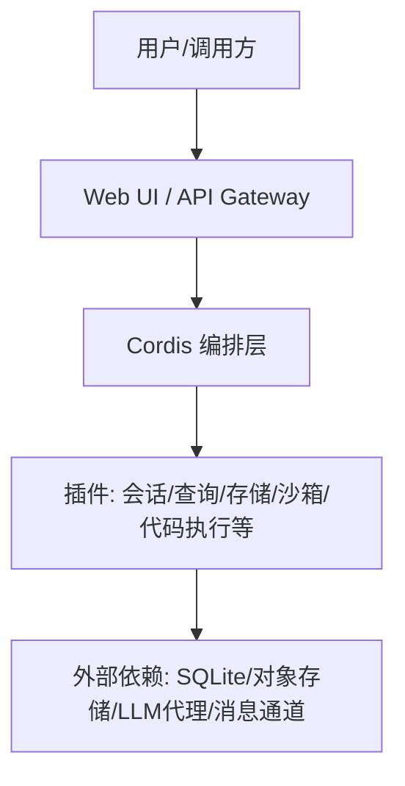
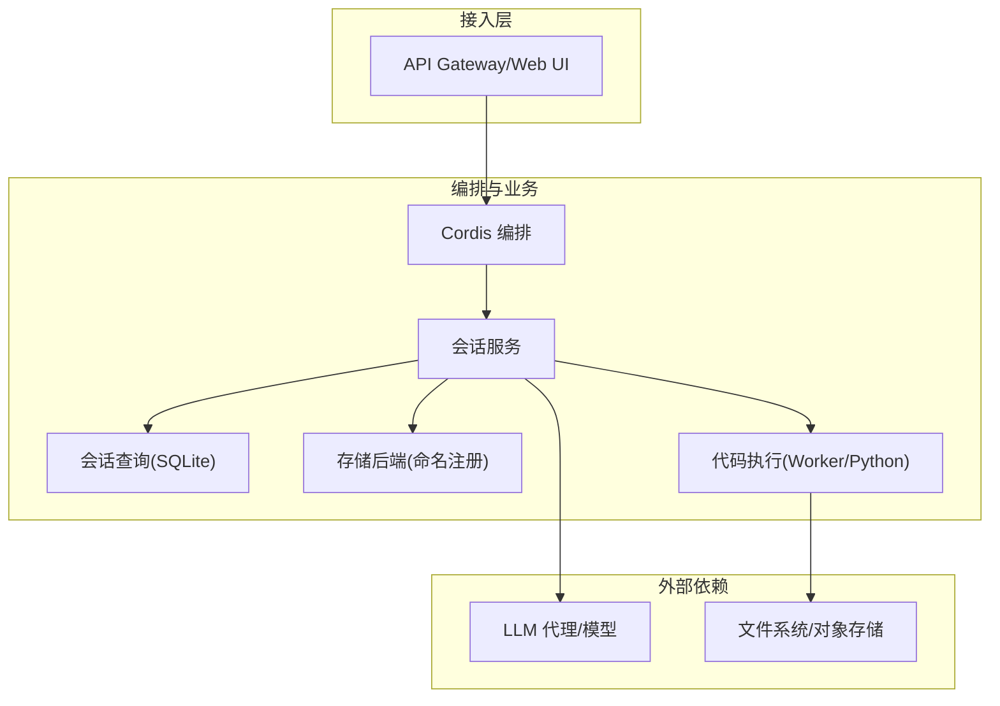
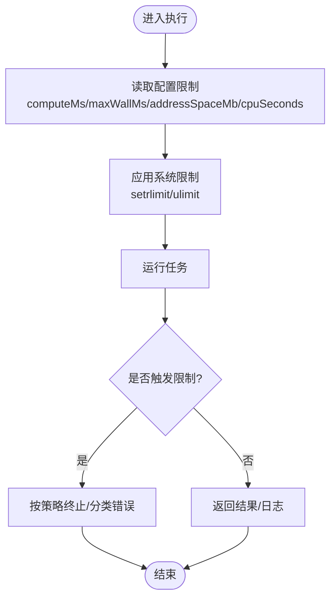
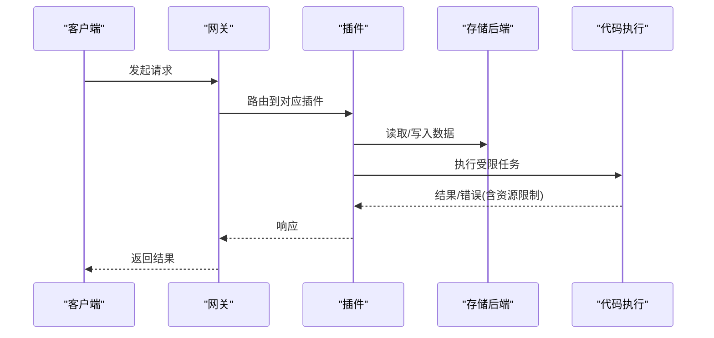
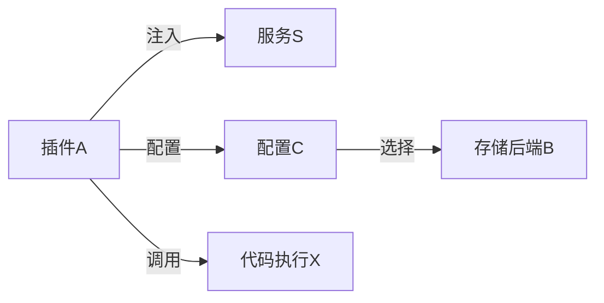

# 生产环境配置

<cite>
**本文引用的文件**
- [README.md](file://README.md)
- [config-catalog.md](file://docs/config-catalog.md)
- [setup-dsh/README.md](file://scripts/setup-dsh/README.md)
- [profile-web/cordis.yml](file://scripts/setup-dsh/templates/profile-web/cordis.yml)
- [session-query/index.ts](file://packages/session-query/session-query/src/index.ts)
- [session-query-sqlite/index.ts](file://packages/session-query/session-query-sqlite/src/index.ts)
- [code-runtime-worker-thread/index.ts](file://packages/code-runtime/code-runtime-worker-thread/src/index.ts)
- [experimental/code-runtime-python/index.ts](file://packages/experimental/code-runtime-python/src/index.ts)
- [bootstrap.py](file://packages/experimental/code-runtime-python/py/bootstrap.py)
- [storage/registry.ts](file://packages/storage/storage/src/registry.ts)
- [remote-error.ts](file://packages/typert/protocol/src/remote-error.ts)
- [adding-a-remote-api.md](file://docs/cookbook/adding-a-remote-api.md)
</cite>

## 目录
1. [简介](#简介)
2. [项目结构](#项目结构)
3. [核心组件](#核心组件)
4. [架构总览](#架构总览)
5. [详细组件分析](#详细组件分析)
6. [依赖关系分析](#依赖关系分析)
7. [性能考虑](#性能考虑)
8. [故障排查指南](#故障排查指南)
9. [结论](#结论)
10. [附录](#附录)

## 简介
本指南面向在生产环境中部署 DeepSeek Harness（dsh）的运维与平台团队，聚焦以下目标：
- 资源限制与隔离：CPU、内存、请求配额、容器级隔离策略
- 副本与扩缩容：水平 Pod 自动扩缩容（HPA）、垂直 Pod 自动扩缩容（VPA）策略
- 高可用设计：多副本、数据备份与灾难恢复
- 性能调优：连接池、缓存、数据库优化
- 监控告警、日志收集与故障诊断

DeepSeek Harness 采用“一切皆插件”的架构，通过 Cordis 编排插件组合。生产部署需围绕插件配置、运行时边界与外部依赖进行系统化治理。

**章节来源**
- [README.md:1-64](file://README.md#L1-L64)

## 项目结构
- 应用入口与运行方式由 README 提供；本地一键启动脚本位于 scripts/setup-dsh，包含模板与生命周期管理。
- 插件配置以 cordis.yml 为根，支持 profile 与 patch 叠加；生产环境应基于模板生成并版本化管理。
- 关键可配置项集中在各插件的 Config 类型中，可通过生成的配置目录 docs/config-catalog.md 查阅。

**图表来源**
- [setup-dsh/README.md:161-194](file://scripts/setup-dsh/README.md#L161-L194)
- [profile-web/cordis.yml:1-5](file://scripts/setup-dsh/templates/profile-web/cordis.yml#L1-L5)

**章节来源**
- [README.md:17-41](file://README.md#L17-L41)
- [setup-dsh/README.md:161-194](file://scripts/setup-dsh/README.md#L161-L194)
- [profile-web/cordis.yml:1-5](file://scripts/setup-dsh/templates/profile-web/cordis.yml#L1-L5)

## 核心组件
- 插件配置体系：所有可调参数必须通过配置暴露，禁止硬编码；配置在加载时校验，错误会阻断插件加载。
- 会话与查询：会话查询引擎支持 SQLite 后端，具备并发度、窗口大小、缓存等可调参数。
- 代码执行沙箱：Worker 线程与 Python 子进程均提供 CPU/内存/超时/输出大小等严格上限，确保隔离与安全。
- 存储注册表：命名后端注册机制，避免重复挂载，便于替换与扩展。
- 远程错误协议：统一的 RemoteError 跨进程/跨边界传递，便于网关与客户端统一处理。

**章节来源**
- [config-catalog.md:4-10](file://docs/config-catalog.md#L4-L10)
- [session-query/index.ts:100-131](file://packages/session-query/session-query/src/index.ts#L100-L131)
- [session-query-sqlite/index.ts:1044-1091](file://packages/session-query/session-query-sqlite/src/index.ts#L1044-L1091)
- [code-runtime-worker-thread/index.ts:357-392](file://packages/code-runtime/code-runtime-worker-thread/src/index.ts#L357-L392)
- [experimental/code-runtime-python/index.ts:538-603](file://packages/experimental/code-runtime-python/src/index.ts#L538-L603)
- [storage/registry.ts:1-37](file://packages/storage/storage/src/registry.ts#L1-L37)
- [remote-error.ts:1-31](file://packages/typert/protocol/src/remote-error.ts#L1-L31)

## 架构总览
下图展示生产环境中的主要组件与交互：Web/Gateway 接收请求，交由 Cordis 编排的插件处理；会话查询使用 SQLite 索引；代码执行通过 Worker 或 Python 子进程在严格资源限制下运行；存储通过命名后端注册接入。

**图表来源**
- [setup-dsh/README.md:161-194](file://scripts/setup-dsh/README.md#L161-L194)
- [session-query-sqlite/index.ts:1044-1091](file://packages/session-query/session-query-sqlite/src/index.ts#L1044-L1091)
- [storage/registry.ts:1-37](file://packages/storage/storage/src/registry.ts#L1-L37)
- [code-runtime-worker-thread/index.ts:357-392](file://packages/code-runtime/code-runtime-worker-thread/src/index.ts#L357-L392)
- [experimental/code-runtime-python/index.ts:538-603](file://packages/experimental/code-runtime-python/src/index.ts#L538-L603)

## 详细组件分析

### 资源限制与隔离（CPU/内存/请求配额）
- 代码执行 Worker（Node 线程）
  - computeMs：事件循环忙时预算，超过即判定超时
  - maxWallMs：墙钟上限，兜底不可见等待
  - maxOutputBytes：序列化结果/日志/失败消息的字节上限
  - maxOldGenerationSizeMb：旧生代堆上限，溢出则终止 worker
- 代码执行 Python（子进程）
  - cpuSeconds：RLIMIT_CPU 秒级软/硬限制，SIGXCPU/SIGKILL 保护
  - maxWallMs：墙钟上限
  - addressSpaceMb：RLIMIT_AS 地址空间上限（Darwin 不适用）
  - maxLogBytes/maxValueBytes：日志与返回值字节预算，受地址空间与宿主堆约束
  - graceMs：SIGTERM→SIGKILL 宽限期
  - pythonBin：解释器路径解析与验证
- 沙箱与命令执行
  - bash-local：cwd、timeoutMs、maxTimeoutMs、maxOutputBytes、maxSpillBytes、graceMs
- 请求与连接
  - client-connection：trustedHosts、cookieMaxAgeDays、maxRequestBodyBytes
  - api-gateway：websocketHeartbeatIntervalMs

**图表来源**
- [code-runtime-worker-thread/index.ts:357-392](file://packages/code-runtime/code-runtime-worker-thread/src/index.ts#L357-L392)
- [experimental/code-runtime-python/index.ts:538-603](file://packages/experimental/code-runtime-python/src/index.ts#L538-L603)
- [bootstrap.py:910-939](file://packages/experimental/code-runtime-python/py/bootstrap.py#L910-L939)
- [bash-local 配置参考:267-291](file://docs/config-catalog.md#L267-L291)
- [client-connection 配置参考:314-339](file://docs/config-catalog.md#L314-L339)
- [api-gateway 配置参考:186-200](file://docs/config-catalog.md#L186-L200)

**章节来源**
- [code-runtime-worker-thread/index.ts:357-392](file://packages/code-runtime/code-runtime-worker-thread/src/index.ts#L357-L392)
- [experimental/code-runtime-python/index.ts:538-603](file://packages/experimental/code-runtime-python/src/index.ts#L538-L603)
- [bootstrap.py:910-939](file://packages/experimental/code-runtime-python/py/bootstrap.py#L910-L939)
- [config-catalog.md:267-339](file://docs/config-catalog.md#L267-L339)
- [config-catalog.md:186-200](file://docs/config-catalog.md#L186-L200)

### 副本数与扩缩容策略（HPA/VPA）
- HPA（水平 Pod 自动扩缩容）
  - 指标建议：CPU 利用率、内存利用率、WebSocket 心跳失败率、请求队列长度、P95/P99 延迟
  - 行为：最小副本≥2，最大副本根据容量与成本设定；扩容冷却时间避免抖动
- VPA（垂直 Pod 自动扩缩容）
  - 建议模式：推荐模式先观察，稳定后切换为自动；结合工作负载特征调整 requests/limits
- 结合 dsh 特性
  - 代码执行 Worker/Python 子进程有独立资源上限，Pod 级别限制需高于单实例上限之和
  - 会话查询 SQLite 读并发与缓存大小影响内存占用，需纳入 VPA 参考

[本节为通用实践说明，不直接引用具体源码]

### 高可用架构设计
- 多副本部署：Gateway/Web UI 至少双副本，配合负载均衡与健康检查
- 数据备份与恢复
  - SQLite WAL 模式与只读副本：开启 WAL 提升并发读能力；定期快照与增量备份
  - 存储后端：对象存储或持久化卷，保证会话与附件持久性
- 灾难恢复
  - 配置与密钥：settings.yaml/.credentials.yaml 版本化与加密存储
  - 回滚策略：镜像与配置分离，快速回滚到稳定版本

**章节来源**
- [session-query-sqlite/index.ts:1044-1091](file://packages/session-query/session-query-sqlite/src/index.ts#L1044-L1091)
- [setup-dsh/README.md:161-194](file://scripts/setup-dsh/README.md#L161-L194)

### 性能调优建议
- 连接池与会话查询
  - persistedReadConcurrency：控制持久化读并发，避免 I/O 饱和
  - preparedSessionCacheSize：准备语句缓存大小，减少重复解析
  - readWindowMax：单次读取窗口上限，平衡吞吐与内存
  - journalMode：WAL/DELETE/TRUNCATE/PERSIST 选择，按写入/读取比例权衡
- 缓存策略
  - 投影缓存：writeEveryEvents/writeIntervalMs 控制落盘频率，降低写放大
  - 附件压缩：imageCompressionConcurrency 控制并发，避免阻塞主流程
- 数据库优化
  - SQLite PRAGMA 与索引维护；定期 VACUUM；读写分离（WAL + 只读副本）
- 代码执行
  - 合理设置 computeMs/maxWallMs/addressSpaceMb/cpuSeconds，避免长尾任务拖垮节点
  - 限制输出大小，防止大响应导致内存峰值

**章节来源**
- [session-query/index.ts:100-131](file://packages/session-query/session-query/src/index.ts#L100-L131)
- [session-query-sqlite/index.ts:1044-1091](file://packages/session-query/session-query-sqlite/src/index.ts#L1044-L1091)
- [config-catalog.md:232-265](file://docs/config-catalog.md#L232-L265)
- [config-catalog.md:357-392](file://docs/config-catalog.md#L357-L392)
- [config-catalog.md:538-603](file://docs/config-catalog.md#L538-L603)

### 监控告警、日志收集与故障诊断
- 监控指标
  - 系统：CPU/内存/磁盘 IO/网络
  - 应用：请求 QPS、延迟分布、错误率、WebSocket 心跳失败、Worker 退出率
  - 数据库：SQLite 事务耗时、WAL 文件大小、连接数
- 日志收集
  - 标准输出/文件日志集中采集；敏感信息脱敏
  - 代码执行产物（日志/结果）受 maxOutputBytes/maxLogBytes 限制，避免日志风暴
- 故障诊断
  - 远程错误：RemoteError 携带稳定 code 与 details，便于网关与客户端统一处理
  - 配置错误：插件加载期 schema 校验失败，立即报错，便于定位
  - 存储注册：重复注册/未找到后端会抛出明确错误码

**图表来源**
- [remote-error.ts:1-31](file://packages/typert/protocol/src/remote-error.ts#L1-L31)
- [adding-a-remote-api.md:51-60](file://docs/cookbook/adding-a-remote-api.md#L51-L60)
- [storage/registry.ts:1-37](file://packages/storage/storage/src/registry.ts#L1-L37)
- [code-runtime-worker-thread/index.ts:357-392](file://packages/code-runtime/code-runtime-worker-thread/src/index.ts#L357-L392)

**章节来源**
- [remote-error.ts:1-31](file://packages/typert/protocol/src/remote-error.ts#L1-L31)
- [adding-a-remote-api.md:51-60](file://docs/cookbook/adding-a-remote-api.md#L51-L60)
- [storage/registry.ts:1-37](file://packages/storage/storage/src/registry.ts#L1-L37)

## 依赖关系分析
- 插件间依赖通过 Cordis 注入与服务键声明；生产环境需确保所有 Required Services 已正确提供
- 存储后端通过命名注册表挂载，消费者通过配置选择后端，避免全局耦合
- 代码执行与沙箱对宿主资源强依赖，需在容器/主机层面提供足够余量与隔离

**图表来源**
- [config-catalog.md:4-10](file://docs/config-catalog.md#L4-L10)
- [storage/registry.ts:1-37](file://packages/storage/storage/src/registry.ts#L1-L37)

**章节来源**
- [config-catalog.md:4-10](file://docs/config-catalog.md#L4-L10)
- [storage/registry.ts:1-37](file://packages/storage/storage/src/registry.ts#L1-L37)

## 性能考虑
- 将 persistedReadConcurrency、preparedSessionCacheSize、readWindowMax 与工作负载匹配，避免过度并发导致抖动
- 针对高并发读场景启用 SQLite WAL，并评估只读副本可行性
- 代码执行侧严格限制 computeMs/maxWallMs/addressSpaceMb/cpuSeconds，结合 Pod 资源限制形成双重保障
- 附件处理与图片压缩并发度需与 CPU/IO 能力匹配，避免争用

[本节为通用实践说明，不直接引用具体源码]

## 故障排查指南
- 配置错误
  - 插件加载期 schema 校验失败会立即报错，优先检查 cordis.yml 与 settings.yaml
- 存储问题
  - backend-not-found/form-not-mounted/duplicate-backend/duplicate-mount 等错误码用于快速定位
- 远程错误
  - 使用 RemoteError.code 进行分类处理，避免依赖 instanceof
- 代码执行异常
  - 关注超时、内存溢出、地址空间不足等错误；核对 Worker/Python 配置与宿主限制

**章节来源**
- [storage/registry.ts:1-37](file://packages/storage/storage/src/registry.ts#L1-L37)
- [remote-error.ts:1-31](file://packages/typert/protocol/src/remote-error.ts#L1-L31)
- [adding-a-remote-api.md:51-60](file://docs/cookbook/adding-a-remote-api.md#L51-L60)

## 结论
生产环境部署 DeepSeek Harness 的关键在于：
- 以插件配置为中心，严格限制资源与行为
- 通过 HPA/VPA 实现弹性伸缩，结合 SQLite 与存储后端的高可用策略
- 建立完善的监控、日志与故障诊断体系，确保可观测性与可恢复性

[本节为总结性内容，不直接引用具体源码]

## 附录
- 本地一键启动与端口说明：参考 setup-dsh 文档，了解服务顺序、健康检查与端口映射
- 配置文件模板：cordis.yml 作为空根，实际配置通过 patches 与 profiles 叠加

**章节来源**
- [setup-dsh/README.md:161-194](file://scripts/setup-dsh/README.md#L161-L194)
- [profile-web/cordis.yml:1-5](file://scripts/setup-dsh/templates/profile-web/cordis.yml#L1-L5)