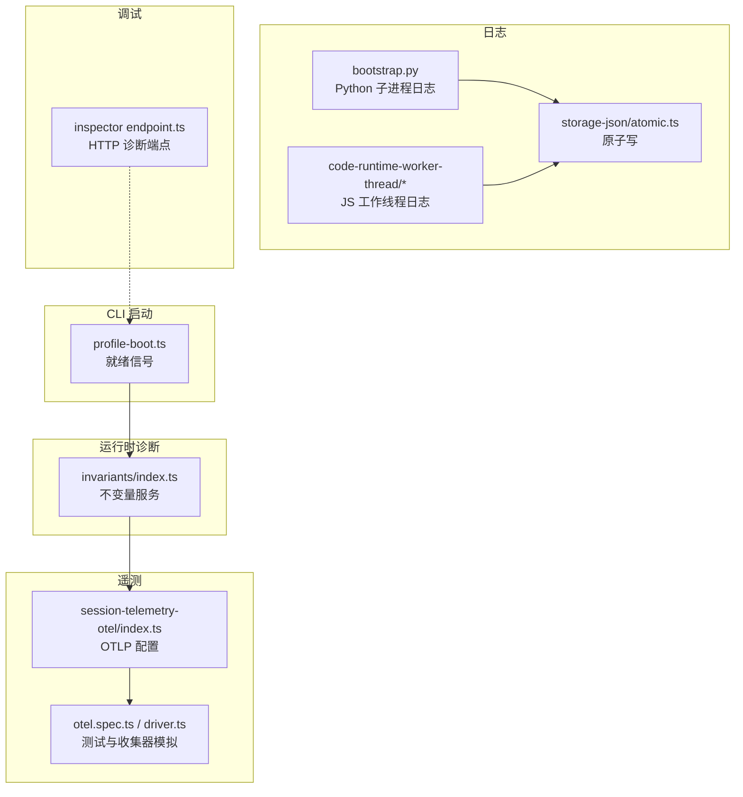
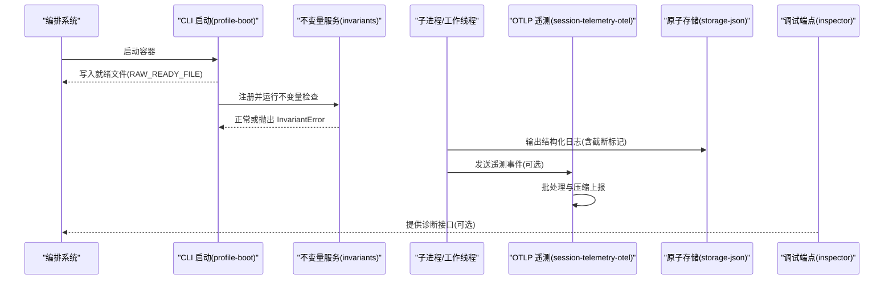
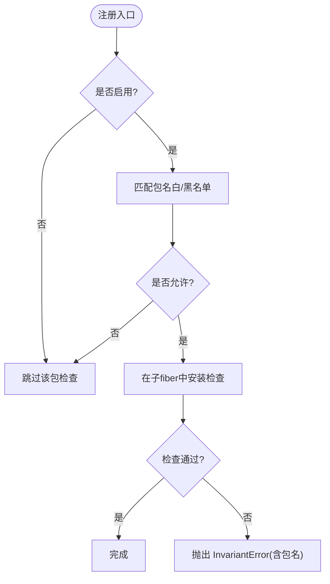
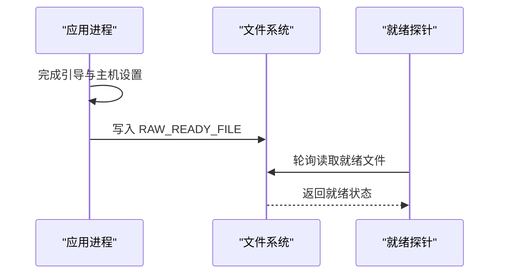
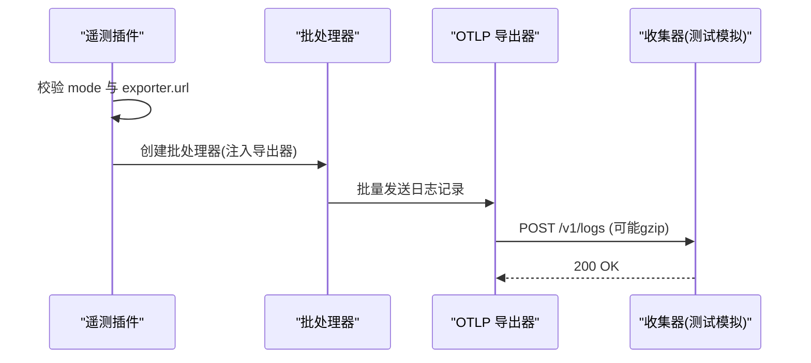
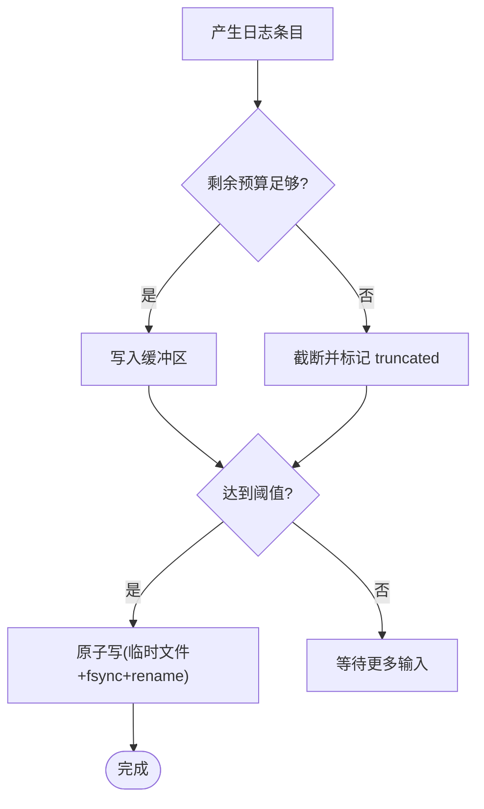
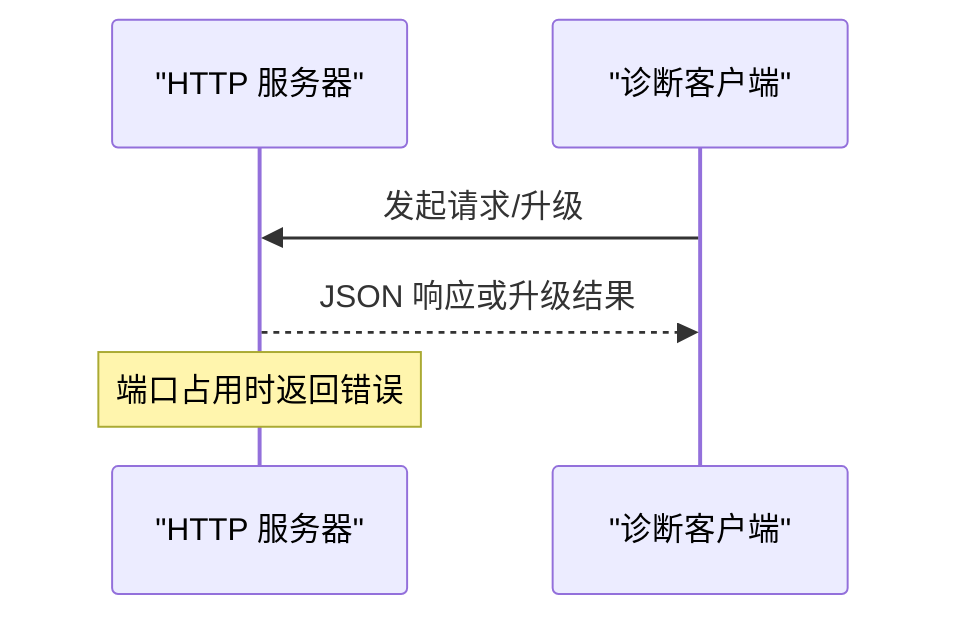
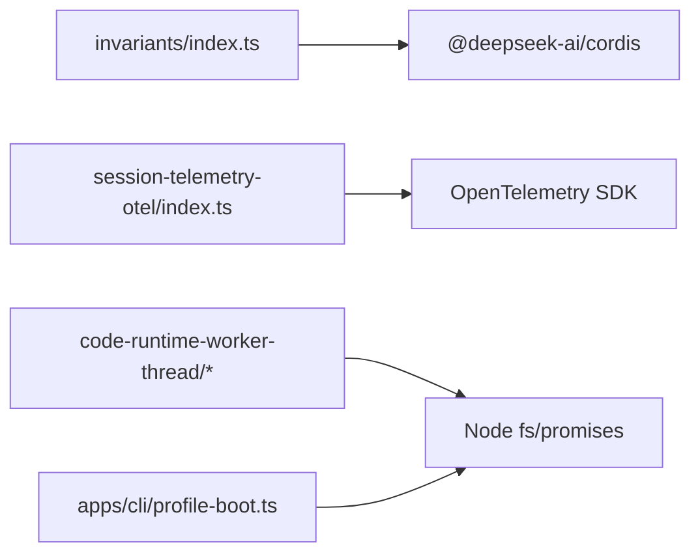

# 监控与健康检查

<cite>
**本文引用的文件**
- [packages/runtime-diagnostics/invariants/src/index.ts](file://packages/runtime-diagnostics/invariants/src/index.ts)
- [packages/runtime-diagnostics/README.md](file://packages/runtime-diagnostics/README.md)
- [apps/cli/src/profile-boot.ts](file://apps/cli/src/profile-boot.ts)
- [apps/cli/tests/built-bin.e2e.ts](file://apps/cli/tests/built-bin.e2e.ts)
- [packages/session/session-telemetry-otel/src/index.ts](file://packages/session/session-telemetry-otel/src/index.ts)
- [packages/session/session-telemetry-otel/tests/otel.spec.ts](file://packages/session/session-telemetry-otel/tests/otel.spec.ts)
- [packages/session/session-telemetry-otel/tests/fixtures/driver.ts](file://packages/session/session-telemetry-otel/tests/fixtures/driver.ts)
- [packages/experimental/code-runtime-python/py/bootstrap.py](file://packages/experimental/code-runtime-python/py/bootstrap.py)
- [packages/code-runtime/code-runtime-worker-thread/src/bootstrap.ts](file://packages/code-runtime/code-runtime-worker-thread/src/bootstrap.ts)
- [packages/code-runtime/code-runtime-worker-thread/src/index.ts](file://packages/code-runtime/code-runtime-worker-thread/src/index.ts)
- [packages/code-runtime/code-runtime-worker-thread/src/output-json.ts](file://packages/code-runtime/code-runtime-worker-thread/src/output-json.ts)
- [packages/storage/storage-json/src/atomic.ts](file://packages/storage/storage-json/src/atomic.ts)
- [packages/util/output-retention/src/index.ts](file://packages/util/output-retention/src/index.ts)
- [packages/experimental/inspector/src/worker/bridge/endpoint.ts](file://packages/experimental/inspector/src/worker/bridge/endpoint.ts)
</cite>

## 目录
1. [简介](#简介)
2. [项目结构](#项目结构)
3. [核心组件](#核心组件)
4. [架构总览](#架构总览)
5. [详细组件分析](#详细组件分析)
6. [依赖关系分析](#依赖关系分析)
7. [性能考量](#性能考量)
8. [故障排查指南](#故障排查指南)
9. [结论](#结论)
10. [附录](#附录)

## 简介
本文件面向容器化部署的 DeepSeek Harness，聚焦运行时诊断、健康检查与可观测性。内容涵盖：
- 指标收集与暴露：性能指标、错误统计、资源使用情况的采集与上报路径
- 健康检查端点：启动就绪信号与运行状态验证机制
- 日志策略：结构化日志格式、输出限流与持久化
- 监控系统集成：OTLP 日志导出到 Prometheus/Grafana 等生态
- 告警与自动恢复：基于指标与日志的告警规则建议与自愈示例

## 项目结构
DeepSeek Harness 的可观测性与健康能力由多个子系统协作完成：
- 运行时不变量（invariants）：在运行期校验包级契约，失败时抛出带包名的异常，便于定位问题来源
- CLI 启动流程：通过环境变量写入“就绪”标记文件，作为外部就绪探针的依据
- OTLP 遥测：将会话事件以 OpenTelemetry 日志形式批量导出至远端收集器
- 子进程/工作线程日志：结构化 JSON 日志，具备字节预算限制与截断标记
- 存储原子写：保障日志与快照文件的崩溃安全替换
- 调试端点：实验性 HTTP 服务器用于内部诊断

图表来源
- [apps/cli/src/profile-boot.ts:40-60](file://apps/cli/src/profile-boot.ts#L40-L60)
- [packages/runtime-diagnostics/invariants/src/index.ts:94-197](file://packages/runtime-diagnostics/invariants/src/index.ts#L94-L197)
- [packages/session/session-telemetry-otel/src/index.ts:86-111](file://packages/session/session-telemetry-otel/src/index.ts#L86-L111)
- [packages/session/session-telemetry-otel/tests/otel.spec.ts:69-107](file://packages/session/session-telemetry-otel/tests/otel.spec.ts#L69-L107)
- [packages/session/session-telemetry-otel/tests/fixtures/driver.ts:18-38](file://packages/session/session-telemetry-otel/tests/fixtures/driver.ts#L18-L38)
- [packages/experimental/code-runtime-python/py/bootstrap.py:1095-1110](file://packages/experimental/code-runtime-python/py/bootstrap.py#L1095-L1110)
- [packages/code-runtime/code-runtime-worker-thread/src/bootstrap.ts:70-100](file://packages/code-runtime/code-runtime-worker-thread/src/bootstrap.ts#L70-L100)
- [packages/storage/storage-json/src/atomic.ts:24-40](file://packages/storage/storage-json/src/atomic.ts#L24-L40)
- [packages/experimental/inspector/src/worker/bridge/endpoint.ts:247-291](file://packages/experimental/inspector/src/worker/bridge/endpoint.ts#L247-L291)

章节来源
- [packages/runtime-diagnostics/README.md:1-50](file://packages/runtime-diagnostics/README.md#L1-L50)

## 核心组件
- 运行时不变量服务：提供全局开关与包名白/黑名单过滤，按包注册并执行运行期检查；违反契约时抛出带包名的 InvariantError，便于告警与归因
- CLI 就绪信号：在应用准备就绪后写入指定文件路径，供容器编排系统探测
- OTLP 遥测插件：集中管理日志导出模式、导出器 URL、批处理器选项与关闭超时
- 结构化日志与限流：Python 子进程与 JS 工作线程均输出结构化 JSON 日志，支持截断标记与字节预算控制
- 原子持久化：日志与快照采用临时文件 + fsync + rename 的原子替换，确保崩溃一致性
- 调试 HTTP 端点：实验性 HTTP 服务器，支持 JSON 响应与升级协议，用于本地诊断

章节来源
- [packages/runtime-diagnostics/invariants/src/index.ts:14-66](file://packages/runtime-diagnostics/invariants/src/index.ts#L14-L66)
- [packages/runtime-diagnostics/invariants/src/index.ts:94-197](file://packages/runtime-diagnostics/invariants/src/index.ts#L94-L197)
- [apps/cli/src/profile-boot.ts:40-60](file://apps/cli/src/profile-boot.ts#L40-L60)
- [packages/session/session-telemetry-otel/src/index.ts:86-111](file://packages/session/session-telemetry-otel/src/index.ts#L86-L111)
- [packages/experimental/code-runtime-python/py/bootstrap.py:1095-1110](file://packages/experimental/code-runtime-python/py/bootstrap.py#L1095-L1110)
- [packages/code-runtime/code-runtime-worker-thread/src/bootstrap.ts:70-100](file://packages/code-runtime/code-runtime-worker-thread/src/bootstrap.ts#L70-L100)
- [packages/storage/storage-json/src/atomic.ts:24-40](file://packages/storage/storage-json/src/atomic.ts#L24-L40)
- [packages/experimental/inspector/src/worker/bridge/endpoint.ts:247-291](file://packages/experimental/inspector/src/worker/bridge/endpoint.ts#L247-L291)

## 架构总览
下图展示了从启动到可观测数据产出的完整链路：CLI 启动完成后写入就绪文件；运行期不变量检查在必要时触发错误；子进程与工作线程输出结构化日志；遥测插件将事件以 OTLP 日志形式批量上报；调试端点提供额外诊断通道。

图表来源
- [apps/cli/src/profile-boot.ts:40-60](file://apps/cli/src/profile-boot.ts#L40-L60)
- [packages/runtime-diagnostics/invariants/src/index.ts:128-197](file://packages/runtime-diagnostics/invariants/src/index.ts#L128-L197)
- [packages/experimental/code-runtime-python/py/bootstrap.py:1095-1110](file://packages/experimental/code-runtime-python/py/bootstrap.py#L1095-L1110)
- [packages/code-runtime/code-runtime-worker-thread/src/bootstrap.ts:70-100](file://packages/code-runtime/code-runtime-worker-thread/src/bootstrap.ts#L70-L100)
- [packages/session/session-telemetry-otel/src/index.ts:86-111](file://packages/session/session-telemetry-otel/src/index.ts#L86-L111)
- [packages/storage/storage-json/src/atomic.ts:24-40](file://packages/storage/storage-json/src/atomic.ts#L24-L40)
- [packages/experimental/inspector/src/worker/bridge/endpoint.ts:247-291](file://packages/experimental/inspector/src/worker/bridge/endpoint.ts#L247-L291)

## 详细组件分析

### 运行时不变量（Invariants）
- 功能要点
  - 全局开关与包名白/黑名单过滤，控制检查范围
  - 每个包可在独立 fiber 中安装检查，失败时抛出 InvariantError，包含包名以便定位
  - 注册过程具备生命周期管理与清理
- 复杂度与影响
  - 注册与选择为 O(n) 正则匹配，n 为允许/排除列表长度
  - 失败即中断对应 fiber，避免污染主流程
- 优化建议
  - 合理设置 allowlist/blocklist，减少不必要的检查
  - 对高频检查进行采样或延迟执行

图表来源
- [packages/runtime-diagnostics/invariants/src/index.ts:94-197](file://packages/runtime-diagnostics/invariants/src/index.ts#L94-L197)

章节来源
- [packages/runtime-diagnostics/invariants/src/index.ts:14-66](file://packages/runtime-diagnostics/invariants/src/index.ts#L14-L66)
- [packages/runtime-diagnostics/invariants/src/index.ts:94-197](file://packages/runtime-diagnostics/invariants/src/index.ts#L94-L197)

### 启动就绪检查（Readiness）
- 实现方式
  - CLI 在应用准备就绪后，向 RAW_READY_FILE 写入就绪标记
  - 编排系统可通过轮询该文件判断服务是否就绪
- 注意事项
  - 就绪标记仅在成功完成引导与主机设置后写入
  - 删除标记可触发重新就绪流程（见 e2e 用例）

图表来源
- [apps/cli/src/profile-boot.ts:40-60](file://apps/cli/src/profile-boot.ts#L40-L60)
- [apps/cli/tests/built-bin.e2e.ts:66-102](file://apps/cli/tests/built-bin.e2e.ts#L66-L102)
- [apps/cli/tests/built-bin.e2e.ts:218-323](file://apps/cli/tests/built-bin.e2e.ts#L218-L323)
- [apps/cli/tests/built-bin.e2e.ts:672-712](file://apps/cli/tests/built-bin.e2e.ts#L672-L712)

章节来源
- [apps/cli/src/profile-boot.ts:40-60](file://apps/cli/src/profile-boot.ts#L40-L60)
- [apps/cli/tests/built-bin.e2e.ts:66-102](file://apps/cli/tests/built-bin.e2e.ts#L66-L102)
- [apps/cli/tests/built-bin.e2e.ts:218-323](file://apps/cli/tests/built-bin.e2e.ts#L218-L323)
- [apps/cli/tests/built-bin.e2e.ts:672-712](file://apps/cli/tests/built-bin.e2e.ts#L672-L712)

### 遥测与指标上报（OTLP）
- 配置项
  - mode：遥测模式（如 FULL/DISABLED）
  - exporter.url：日志导出端点（必填于非禁用模式）
  - processor：批处理器选项（由 SDK 文档定义）
  - shutdownTimeoutMillis：关闭超时
- 工作流程
  - 插件加载时校验模式与端点
  - 使用 BatchLogRecordProcessor 批量上报
  - 测试中通过模拟 OTLP 服务端捕获请求体（JSON 序列化，可能 gzip）

图表来源
- [packages/session/session-telemetry-otel/src/index.ts:86-111](file://packages/session/session-telemetry-otel/src/index.ts#L86-L111)
- [packages/session/session-telemetry-otel/tests/otel.spec.ts:69-107](file://packages/session/session-telemetry-otel/tests/otel.spec.ts#L69-L107)
- [packages/session/session-telemetry-otel/tests/fixtures/driver.ts:18-38](file://packages/session/session-telemetry-otel/tests/fixtures/driver.ts#L18-L38)

章节来源
- [packages/session/session-telemetry-otel/src/index.ts:86-111](file://packages/session/session-telemetry-otel/src/index.ts#L86-L111)
- [packages/session/session-telemetry-otel/tests/otel.spec.ts:69-107](file://packages/session/session-telemetry-otel/tests/otel.spec.ts#L69-L107)
- [packages/session/session-telemetry-otel/tests/fixtures/driver.ts:18-38](file://packages/session/session-telemetry-otel/tests/fixtures/driver.ts#L18-L38)

### 日志收集策略（结构化日志与轮转）
- Python 子进程日志
  - 输出结构化 JSON，字段包括 type、text、truncated、open 等
  - 通过 LogBuffer 控制最大字节数，超出时截断并报告一次
- JS 工作线程日志
  - 同样采用字节预算与截断策略，保证输出可控
  - 输出 JSON 字符串并按预算裁剪，避免内存膨胀
- 持久化与轮转
  - 原子写：先写临时文件，fsync 后再 rename 覆盖目标，确保崩溃一致
  - 日志轮转：仓库未内置轮转逻辑，建议在容器层或日志采集侧（如 Filebeat/Fluent Bit）按大小/时间切分

图表来源
- [packages/experimental/code-runtime-python/py/bootstrap.py:1095-1110](file://packages/experimental/code-runtime-python/py/bootstrap.py#L1095-L1110)
- [packages/code-runtime/code-runtime-worker-thread/src/bootstrap.ts:70-100](file://packages/code-runtime/code-runtime-worker-thread/src/bootstrap.ts#L70-L100)
- [packages/code-runtime/code-runtime-worker-thread/src/index.ts:178-200](file://packages/code-runtime/code-runtime-worker-thread/src/index.ts#L178-L200)
- [packages/code-runtime/code-runtime-worker-thread/src/output-json.ts:117-163](file://packages/code-runtime/code-runtime-worker-thread/src/output-json.ts#L117-L163)
- [packages/storage/storage-json/src/atomic.ts:24-40](file://packages/storage/storage-json/src/atomic.ts#L24-L40)

章节来源
- [packages/experimental/code-runtime-python/py/bootstrap.py:1095-1110](file://packages/experimental/code-runtime-python/py/bootstrap.py#L1095-L1110)
- [packages/code-runtime/code-runtime-worker-thread/src/bootstrap.ts:70-100](file://packages/code-runtime/code-runtime-worker-thread/src/bootstrap.ts#L70-L100)
- [packages/code-runtime/code-runtime-worker-thread/src/index.ts:178-200](file://packages/code-runtime/code-runtime-worker-thread/src/index.ts#L178-L200)
- [packages/code-runtime/code-runtime-worker-thread/src/output-json.ts:117-163](file://packages/code-runtime/code-runtime-worker-thread/src/output-json.ts#L117-L163)
- [packages/storage/storage-json/src/atomic.ts:24-40](file://packages/storage/storage-json/src/atomic.ts#L24-L40)

### 调试与诊断端点
- 功能
  - 启动 HTTP 服务器，支持普通请求与协议升级
  - 提供 JSON 响应方法，便于诊断工具交互
- 注意事项
  - 端口绑定失败会抛出明确错误（如地址占用）
  - 仅用于开发/调试场景

图表来源
- [packages/experimental/inspector/src/worker/bridge/endpoint.ts:247-291](file://packages/experimental/inspector/src/worker/bridge/endpoint.ts#L247-L291)

章节来源
- [packages/experimental/inspector/src/worker/bridge/endpoint.ts:247-291](file://packages/experimental/inspector/src/worker/bridge/endpoint.ts#L247-L291)

## 依赖关系分析
- 不变量服务依赖 Cordis 上下文与服务模型，通过插件机制在子 fiber 中运行检查
- 遥测插件依赖 OpenTelemetry SDK，配置批处理器与导出器
- 日志模块依赖 Node.js 文件系统 API 实现原子写
- CLI 就绪信号依赖环境变量与文件系统

图表来源
- [packages/runtime-diagnostics/invariants/src/index.ts:9-12](file://packages/runtime-diagnostics/invariants/src/index.ts#L9-L12)
- [packages/session/session-telemetry-otel/src/index.ts:86-111](file://packages/session/session-telemetry-otel/src/index.ts#L86-L111)
- [packages/storage/storage-json/src/atomic.ts:14-16](file://packages/storage/storage-json/src/atomic.ts#L14-L16)
- [apps/cli/src/profile-boot.ts:40-60](file://apps/cli/src/profile-boot.ts#L40-L60)

章节来源
- [packages/runtime-diagnostics/invariants/src/index.ts:9-12](file://packages/runtime-diagnostics/invariants/src/index.ts#L9-L12)
- [packages/session/session-telemetry-otel/src/index.ts:86-111](file://packages/session/session-telemetry-otel/src/index.ts#L86-L111)
- [packages/storage/storage-json/src/atomic.ts:14-16](file://packages/storage/storage-json/src/atomic.ts#L14-L16)
- [apps/cli/src/profile-boot.ts:40-60](file://apps/cli/src/profile-boot.ts#L40-L60)

## 性能考量
- 日志输出
  - 使用字节预算与截断，避免大输出导致内存压力与阻塞
  - 原子写带来 fsync 开销，适合关键日志；高频日志建议降低频率或采样
- 遥测上报
  - 批处理器可减少网络往返；合理设置 batch size 与 flush 间隔
  - 压缩与 keepAlive 可降低带宽与连接开销
- 不变量检查
  - 白/黑名单应精简，避免过多正则匹配
  - 对昂贵检查进行延迟或条件执行

[本节为通用指导，不直接分析具体文件]

## 故障排查指南
- 启动失败或未就绪
  - 检查 RAW_READY_FILE 是否被正确写入与读取
  - 确认端口未被占用（EADDRINUSE）
- 日志丢失或过大
  - 查看 truncated 标记与 remainingOutputBytes
  - 调整 maxLogBytes 或采样策略
- 遥测无数据
  - 核对 exporter.url 与认证头
  - 检查批处理器与关闭超时
- 不变量报错
  - 根据 InvariantError 中的包名定位来源
  - 通过 allowlist/blocklist 控制检查范围

章节来源
- [apps/cli/tests/built-bin.e2e.ts:672-712](file://apps/cli/tests/built-bin.e2e.ts#L672-L712)
- [packages/experimental/inspector/src/worker/bridge/endpoint.ts:289-291](file://packages/experimental/inspector/src/worker/bridge/endpoint.ts#L289-L291)
- [packages/experimental/code-runtime-python/py/bootstrap.py:1095-1110](file://packages/experimental/code-runtime-python/py/bootstrap.py#L1095-L1110)
- [packages/code-runtime/code-runtime-worker-thread/src/bootstrap.ts:70-100](file://packages/code-runtime/code-runtime-worker-thread/src/bootstrap.ts#L70-L100)
- [packages/session/session-telemetry-otel/src/index.ts:86-111](file://packages/session/session-telemetry-otel/src/index.ts#L86-L111)
- [packages/runtime-diagnostics/invariants/src/index.ts:49-66](file://packages/runtime-diagnostics/invariants/src/index.ts#L49-L66)

## 结论
DeepSeek Harness 在容器环境中提供了完善的运行时诊断与健康检查能力：通过 CLI 就绪信号、运行期不变量检查、结构化日志与 OTLP 遥测，形成从启动到运行的全链路可观测性。结合原子持久化与调试端点，可有效支撑生产环境的稳定性与排障效率。建议在生产中配合日志采集与指标平台，完善告警与自愈策略。

[本节为总结，不直接分析具体文件]

## 附录

### 监控系统集成方案（Prometheus/Grafana）
- 指标来源
  - 通过 OTLP 日志导出到收集器（如 Grafana Alloy/OpenTelemetry Collector），再转发至时序数据库（如 Prometheus/Loki）
  - 利用标签与属性（如 event.type、包名）进行分类与聚合
- 可视化
  - 在 Grafana 中构建仪表盘，展示错误率、日志量、资源使用趋势
- 告警
  - 基于错误率突增、日志截断频繁、就绪失败等指标设置阈值告警
  - 结合不变量失败事件快速定位问题包

[本节为概念性说明，不直接分析具体文件]

### 告警规则与自动恢复示例
- 告警规则建议
  - 不变量失败：当 InvariantError 出现时立即告警，附带包名与消息
  - 日志截断：当 truncated 标记频繁出现时告警，提示调整预算或采样
  - 就绪失败：RAW_READY_FILE 长时间未更新时告警
- 自动恢复机制
  - 重启策略：对频繁失败的包进行隔离与重试
  - 降级策略：在不变量失败时关闭相关功能，保持核心服务可用
  - 回滚策略：结合版本信息与日志，自动回滚到稳定版本

[本节为概念性说明，不直接分析具体文件]