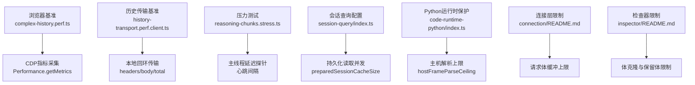
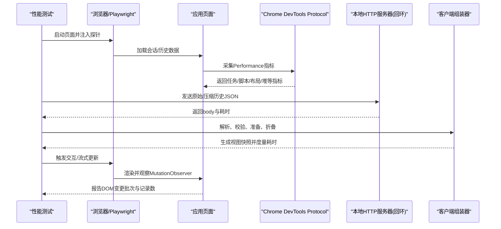
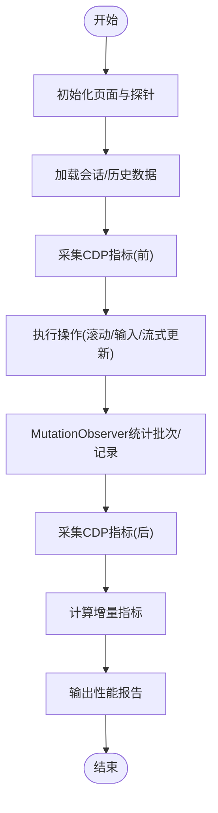
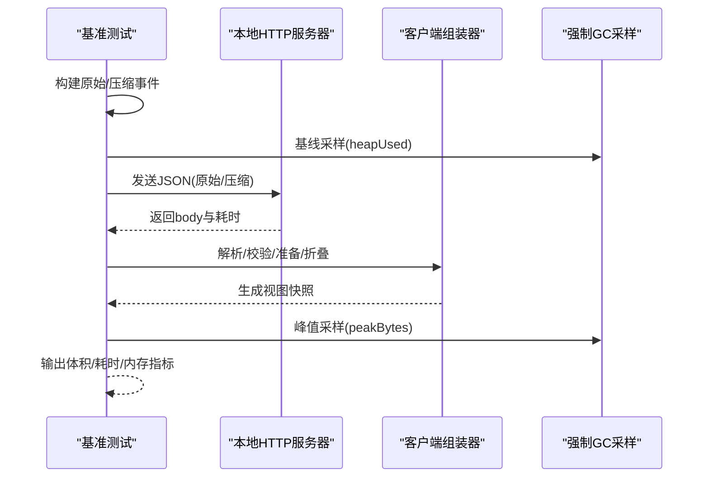
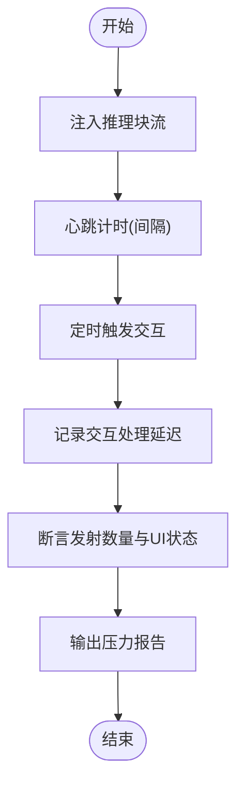
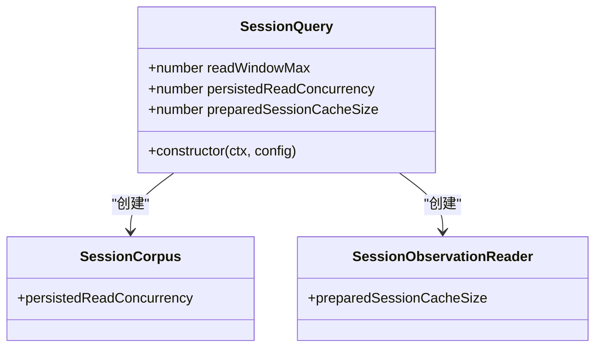
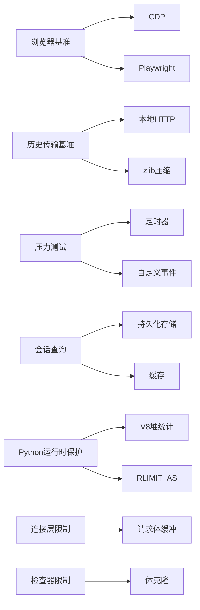

# 性能调优

<cite>
**本文引用的文件**
- [BENCHMARK.md](file://BENCHMARK.md)
- [vitest.web.perf.config.ts](file://vitest.web.perf.config.ts)
- [vitest.web-stress.config.ts](file://vitest.web-stress.config.ts)
- [apps/web/tests/complex-history.perf.ts](file://apps/web/tests/complex-history.perf.ts)
- [packages/client/ui-conversation/tests/history-transport.perf.client.ts](file://packages/client/ui-conversation/tests/history-transport.perf.client.ts)
- [apps/web/stress-tests/reasoning-chunks.stress.ts](file://apps/web/stress-tests/reasoning-chunks.stress.ts)
- [packages/session-query/session-query/src/index.ts](file://packages/session-query/session-query/src/index.ts)
- [packages/experimental/code-runtime-python/src/index.ts](file://packages/experimental/code-runtime-python/src/index.ts)
- [packages/client/connection/README.md](file://packages/client/connection/README.md)
- [packages/experimental/inspector/README.md](file://packages/experimental/inspector/README.md)
</cite>

## 目录
1. [简介](#简介)
2. [项目结构](#项目结构)
3. [核心组件](#核心组件)
4. [架构总览](#架构总览)
5. [详细组件分析](#详细组件分析)
6. [依赖关系分析](#依赖关系分析)
7. [性能考量](#性能考量)
8. [故障排查指南](#故障排查指南)
9. [结论](#结论)
10. [附录](#附录)

## 简介
本文件面向DeepSeek Harness的性能调优，聚焦以下目标：
- 建立可复现的系统性能基准测试方法，覆盖浏览器渲染、历史传输与压缩、流式推理等关键路径。
- 提供识别内存与CPU瓶颈的技巧，结合强制GC采样、CDP指标与主线程延迟探针。
- 给出内存管理与垃圾回收优化策略，包括V8堆基线、峰值采样与解析开销控制。
- 总结并发处理与资源池配置的最佳实践，如会话查询的持久化读取并发与缓存大小。
- 提供数据库查询优化与缓存策略建议（以SQLite会话查询为例）。
- 指导负载测试工具使用与监控指标解读，并针对不同部署场景给出参数调优建议。

## 项目结构
仓库包含多套性能与压力测试：
- 浏览器端高基数历史渲染与流式交互基准：apps/web/tests/complex-history.perf.ts
- 客户端历史传输与压缩（Gzip/Brotli）及折叠成本基准：packages/client/ui-conversation/tests/history-transport.perf.client.ts
- 浏览器压力测试（大量推理块渲染）：apps/web/stress-tests/reasoning-chunks.stress.ts
- 性能测试运行配置：vitest.web.perf.config.ts、vitest.web-stress.config.ts
- 会话查询并发与缓存配置入口：packages/session-query/session-query/src/index.ts
- Python代码运行时地址空间与解析上限保护：packages/experimental/code-runtime-python/src/index.ts
- 连接层请求体缓冲限制说明：packages/client/connection/README.md
- 检查器（Inspector）体克隆与保留体限制说明：packages/experimental/inspector/README.md

图表来源
- [apps/web/tests/complex-history.perf.ts:524-585](file://apps/web/tests/complex-history.perf.ts#L524-L585)
- [packages/client/ui-conversation/tests/history-transport.perf.client.ts:151-186](file://packages/client/ui-conversation/tests/history-transport.perf.client.ts#L151-L186)
- [apps/web/stress-tests/reasoning-chunks.stress.ts:68-93](file://apps/web/stress-tests/reasoning-chunks.stress.ts#L68-L93)
- [packages/session-query/session-query/src/index.ts:104-131](file://packages/session-query/session-query/src/index.ts#L104-L131)
- [packages/experimental/code-runtime-python/src/index.ts:343-365](file://packages/experimental/code-runtime-python/src/index.ts#L343-L365)
- [packages/client/connection/README.md:61](file://packages/client/connection/README.md#L61)
- [packages/experimental/inspector/README.md:143](file://packages/experimental/inspector/README.md#L143)

章节来源
- [BENCHMARK.md:1-4](file://BENCHMARK.md#L1-L4)
- [vitest.web.perf.config.ts:5-21](file://vitest.web.perf.config.ts#L5-L21)
- [vitest.web-stress.config.ts:5-15](file://vitest.web-stress.config.ts#L5-L15)

## 核心组件
- 浏览器性能测量：通过CDP获取任务时长、脚本执行、布局与样式重算、节点数、监听器数量与JS堆使用量，计算增量并报告。
- 历史传输基准：构建原始与压缩后的会话事件序列，比较JSON体积、Gzip/Brotli压缩比、本地回环传输耗时、客户端解析验证与折叠成本，以及V8堆峰值增量。
- 压力测试：在真实应用中注入大量推理块，保持“思考”行可见，测量主线程心跳最大延迟与交互响应延迟，确保UI可响应。
- 会话查询并发与缓存：通过readWindowMax、persistedReadConcurrency、preparedSessionCacheSize控制读窗口与并发，影响磁盘I/O与内存占用。
- Python运行时保护：基于主机堆限制推导解析上限，避免宽对象帧导致主机OOM；同时约束子进程地址空间，防止输出预算与地址空间不兼容。
- 连接层与检查器限制：对请求体缓冲、体克隆与保留体进行上限控制，降低内存与I/O压力。

章节来源
- [apps/web/tests/complex-history.perf.ts:524-585](file://apps/web/tests/complex-history.perf.ts#L524-L585)
- [packages/client/ui-conversation/tests/history-transport.perf.client.ts:188-211](file://packages/client/ui-conversation/tests/history-transport.perf.client.ts#L188-L211)
- [packages/client/ui-conversation/tests/history-transport.perf.client.ts:391-569](file://packages/client/ui-conversation/tests/history-transport.perf.client.ts#L391-L569)
- [apps/web/stress-tests/reasoning-chunks.stress.ts:46-153](file://apps/web/stress-tests/reasoning-chunks.stress.ts#L46-L153)
- [packages/session-query/session-query/src/index.ts:104-131](file://packages/session-query/session-query/src/index.ts#L104-L131)
- [packages/experimental/code-runtime-python/src/index.ts:343-365](file://packages/experimental/code-runtime-python/src/index.ts#L343-L365)
- [packages/client/connection/README.md:61](file://packages/client/connection/README.md#L61)
- [packages/experimental/inspector/README.md:143](file://packages/experimental/inspector/README.md#L143)

## 架构总览
下图展示从测试驱动到被测系统的关键数据流与性能观测点：

图表来源
- [apps/web/tests/complex-history.perf.ts:524-585](file://apps/web/tests/complex-history.perf.ts#L524-L585)
- [packages/client/ui-conversation/tests/history-transport.perf.client.ts:151-186](file://packages/client/ui-conversation/tests/history-transport.perf.client.ts#L151-L186)
- [packages/client/ui-conversation/tests/history-transport.perf.client.ts:391-569](file://packages/client/ui-conversation/tests/history-transport.perf.client.ts#L391-L569)

## 详细组件分析

### 浏览器历史渲染与流式交互基准
- 目标：在高基数工作区与长历史场景下评估渲染与流式更新的稳定性与性能。
- 方法：
  - 使用CDP采集任务时长、脚本执行、布局与样式重算、节点与监听器数量、JS堆使用量，计算前后差值。
  - 通过MutationObserver统计流式更新的批次与记录数，衡量DOM变更频率。
  - 注入用户渲染探针，测量从点击发送到DOM可见再到首次绘制的时延。
- 关键指标：
  - wallMs、taskMs、scriptMs、layoutMs、recalcStyleMs、devtoolsMs
  - nodesDelta、listenersDelta、heapDeltaMb
  - mutationBatches、mutationRecords
  - sendToDomMs、sendToPaintMs、domToPaintMs

图表来源
- [apps/web/tests/complex-history.perf.ts:524-585](file://apps/web/tests/complex-history.perf.ts#L524-L585)
- [apps/web/tests/complex-history.perf.ts:587-622](file://apps/web/tests/complex-history.perf.ts#L587-L622)

章节来源
- [apps/web/tests/complex-history.perf.ts:524-585](file://apps/web/tests/complex-history.perf.ts#L524-L585)
- [apps/web/tests/complex-history.perf.ts:587-622](file://apps/web/tests/complex-history.perf.ts#L587-L622)

### 历史传输与压缩基准
- 目标：对比原始与压缩（Gzip/Brotli）的历史传输在体积、传输耗时、客户端解析与折叠成本上的差异，并测量V8堆峰值增量。
- 方法：
  - 构建等价的原始与压缩事件序列，分别序列化、压缩并本地回环传输。
  - 使用强制GC基线采样额外堆峰值，评估不同阶段的内存占用。
  - 对客户端侧进行解析、校验、准备与折叠，汇总各阶段耗时。
- 关键指标：
  - bytes（rawJson、compactJson）、gzip/brotli压缩比
  - transport（headersMs、bodyMs、totalMs）
  - client（parse、validation、prepare、fold耗时）
  - memory（host/client additional heap peak bytes）

图表来源
- [packages/client/ui-conversation/tests/history-transport.perf.client.ts:188-211](file://packages/client/ui-conversation/tests/history-transport.perf.client.ts#L188-L211)
- [packages/client/ui-conversation/tests/history-transport.perf.client.ts:391-569](file://packages/client/ui-conversation/tests/history-transport.perf.client.ts#L391-L569)

章节来源
- [packages/client/ui-conversation/tests/history-transport.perf.client.ts:188-211](file://packages/client/ui-conversation/tests/history-transport.perf.client.ts#L188-L211)
- [packages/client/ui-conversation/tests/history-transport.perf.client.ts:391-569](file://packages/client/ui-conversation/tests/history-transport.perf.client.ts#L391-L569)

### 推理块压力测试
- 目标：在真实应用中持续注入大量推理块，确保主线程可响应且交互延迟可控。
- 方法：
  - 通过页面内定时器测量主线程心跳最大延迟。
  - 定时触发自定义交互事件，测量交互处理延迟。
  - 断言已发射的块数与UI状态，确保渲染未阻塞。
- 关键指标：
  - maxMainThreadDelayMs、interactionDelayMs
  - emitted、heartbeatSamples

图表来源
- [apps/web/stress-tests/reasoning-chunks.stress.ts:68-93](file://apps/web/stress-tests/reasoning-chunks.stress.ts#L68-L93)
- [apps/web/stress-tests/reasoning-chunks.stress.ts:113-147](file://apps/web/stress-tests/reasoning-chunks.stress.ts#L113-L147)

章节来源
- [apps/web/stress-tests/reasoning-chunks.stress.ts:46-153](file://apps/web/stress-tests/reasoning-chunks.stress.ts#L46-L153)

### 会话查询并发与缓存
- 目标：通过调整读窗口、持久化读取并发与预编译会话缓存大小，平衡磁盘I/O与内存占用。
- 方法：
  - readWindowMax限制单次读取窗口大小，避免一次性加载过多数据。
  - persistedReadConcurrency控制并发读取持久化数据的线程/协程数。
  - preparedSessionCacheSize管理预编译会话的缓存条目数，减少重复解析开销。
- 关键配置：
  - readWindowMax: 非负整数
  - persistedReadConcurrency: 正安全整数
  - preparedSessionCacheSize: 正安全整数

图表来源
- [packages/session-query/session-query/src/index.ts:104-131](file://packages/session-query/session-query/src/index.ts#L104-L131)

章节来源
- [packages/session-query/session-query/src/index.ts:104-131](file://packages/session-query/session-query/src/index.ts#L104-L131)

### Python代码运行时地址空间与解析上限保护
- 目标：防止子进程输出预算与地址空间不兼容导致的OOM，避免主机解析宽对象帧时的内存爆炸。
- 方法：
  - 在加载时拒绝不兼容的maxLogBytes/maxValueBytes与addressSpaceMb组合，考虑最坏情况倍数与解释器基线预留。
  - 根据主机堆限制推导解析上限，避免JSON.parse阶段产生过多属性存储。
- 关键概念：
  - addressSpaceMb：子进程地址空间上限
  - hostFrameParseCeiling：主机解析上限，基于heap_size_limit与最坏情况倍数
  - OUTPUT_BUDGET_WORST_CASE_ADDRESS_SPACE_MULTIPLE：输出预算的最坏情况倍数

章节来源
- [packages/experimental/code-runtime-python/src/index.ts:343-365](file://packages/experimental/code-runtime-python/src/index.ts#L343-L365)

## 依赖关系分析
- 浏览器基准依赖CDP与Playwright，用于指标采集与页面交互。
- 历史传输基准依赖本地HTTP服务器与zlib压缩库，模拟网络传输与压缩效果。
- 压力测试依赖页面内定时器与自定义事件，测量主线程与交互延迟。
- 会话查询模块依赖持久化存储与缓存机制，受并发与缓存大小影响。
- Python运行时保护依赖V8堆统计与RLIMIT_AS，确保子进程与主机安全边界。
- 连接层与检查器限制为整体内存与I/O压力提供兜底。

图表来源
- [apps/web/tests/complex-history.perf.ts:524-585](file://apps/web/tests/complex-history.perf.ts#L524-L585)
- [packages/client/ui-conversation/tests/history-transport.perf.client.ts:151-186](file://packages/client/ui-conversation/tests/history-transport.perf.client.ts#L151-L186)
- [apps/web/stress-tests/reasoning-chunks.stress.ts:68-93](file://apps/web/stress-tests/reasoning-chunks.stress.ts#L68-L93)
- [packages/session-query/session-query/src/index.ts:104-131](file://packages/session-query/session-query/src/index.ts#L104-L131)
- [packages/experimental/code-runtime-python/src/index.ts:343-365](file://packages/experimental/code-runtime-python/src/index.ts#L343-L365)
- [packages/client/connection/README.md:61](file://packages/client/connection/README.md#L61)
- [packages/experimental/inspector/README.md:143](file://packages/experimental/inspector/README.md#L143)

## 性能考量
- 内存管理
  - 使用强制GC基线采样额外堆峰值，避免随机波动影响结果。
  - 关注JSON解析与对象展开的内存放大效应，尤其是宽对象帧。
  - 合理设置readWindowMax与preparedSessionCacheSize，控制内存占用与I/O吞吐。
- 垃圾回收优化
  - 在基准中启用--expose-gc，确保可重复的基线与峰值测量。
  - 避免长时间持有大对象引用，及时释放临时数据结构。
- 并发与资源池
  - 调整persistedReadConcurrency匹配磁盘能力，避免过度并发导致I/O争用。
  - 对连接层请求体与检查器体克隆设置上限，防止内存尖峰。
- 数据库查询优化
  - 使用readWindowMax限制单次查询范围，分页或窗口化读取。
  - 利用preparedSessionCacheSize缓存热点会话，减少重复解析。
- 负载测试与监控
  - 使用浏览器基准与压力测试模拟真实负载，关注主线程延迟与交互响应。
  - 通过CDP指标与日志输出定位瓶颈（脚本、布局、堆增长）。

## 故障排查指南
- 浏览器卡顿
  - 检查layoutMs与recalcStyleMs是否异常升高，优化DOM结构与样式。
  - 观察nodesDelta与listenersDelta，减少不必要的节点与监听器。
- 内存泄漏
  - 对比raw与compact历史传输的heapDeltaMb，确认压缩是否有效降低内存。
  - 使用强制GC基线采样，定位峰值增长阶段。
- 解析失败或OOM
  - 检查hostFrameParseCeiling与addressSpaceMb配置，避免宽对象帧。
  - 调整连接层请求体缓冲上限，防止过大请求体驻留内存。
- 检查器体克隆开销
  - 降低保留体限制，减少体克隆带来的内存与I/O压力。

章节来源
- [apps/web/tests/complex-history.perf.ts:524-585](file://apps/web/tests/complex-history.perf.ts#L524-L585)
- [packages/client/ui-conversation/tests/history-transport.perf.client.ts:188-211](file://packages/client/ui-conversation/tests/history-transport.perf.client.ts#L188-L211)
- [packages/experimental/code-runtime-python/src/index.ts:343-365](file://packages/experimental/code-runtime-python/src/index.ts#L343-L365)
- [packages/client/connection/README.md:61](file://packages/client/connection/README.md#L61)
- [packages/experimental/inspector/README.md:143](file://packages/experimental/inspector/README.md#L143)

## 结论
通过浏览器基准、历史传输基准与压力测试，结合强制GC采样、CDP指标与主线程延迟探针，可以系统化识别DeepSeek Harness的性能瓶颈。配合会话查询并发与缓存配置、Python运行时保护、连接层与检查器限制，可在不同部署场景中实现稳定的性能表现。建议在生产环境中持续运行性能基准，监控关键指标，并根据实际负载调整参数。

## 附录
- 运行基准：遵循仓库中的基准说明，使用独立工作区与会话ID进行隔离测试。
- 性能测试配置：启用--expose-gc与专用配置文件，确保可重复的内存与时间测量。
- 压力测试：仅作为显式性能证据，硬件与调度差异较大，需结合确定性测试验证正确性。

章节来源
- [BENCHMARK.md:1-4](file://BENCHMARK.md#L1-L4)
- [vitest.web.perf.config.ts:5-21](file://vitest.web.perf.config.ts#L5-L21)
- [vitest.web-stress.config.ts:5-15](file://vitest.web-stress.config.ts#L5-L15)