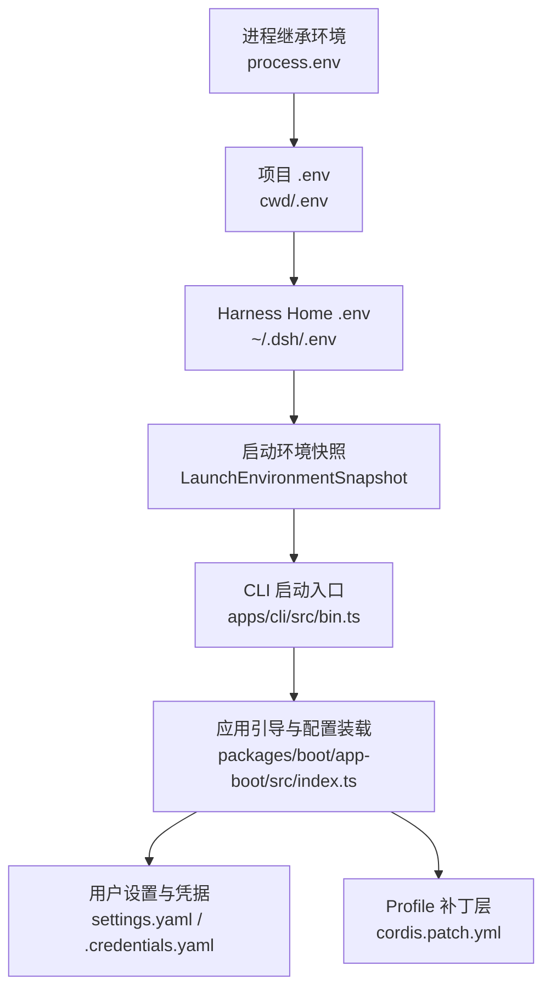
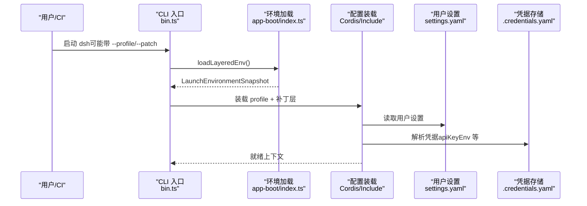
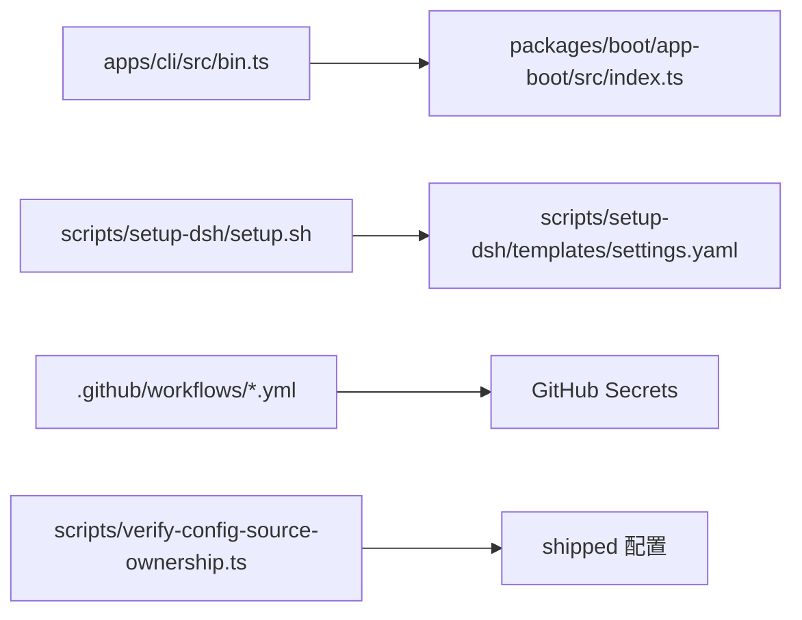

# 多环境支持

<cite>
**本文引用的文件**
- [packages/boot/app-boot/src/index.ts](file://packages/boot/app-boot/src/index.ts)
- [apps/cli/src/bin.ts](file://apps/cli/src/bin.ts)
- [scripts/setup-dsh/setup.sh](file://scripts/setup-dsh/setup.sh)
- [scripts/setup-dsh/setup.env.example](file://scripts/setup-dsh/setup.env.example)
- [scripts/setup-dsh/.gitignore](file://scripts/setup-dsh/.gitignore)
- [scripts/client-build-environment.client.spec.ts](file://scripts/client-build-environment.client.spec.ts)
- [.github/workflows/ci.yml](file://.github/workflows/ci.yml)
- [.github/workflows/build-exe-for-python-sdk.yml](file://.github/workflows/build-exe-for-python-sdk.yml)
- [scripts/verify-config-source-ownership.ts](file://scripts/verify-config-source-ownership.ts)
- [.agents/notes/implemented/architecture/2026-08-04-configuration-source-ownership.md](file://.agents/notes/implemented/architecture/2026-08-04-configuration-source-ownership.md)
- [packages/util/launch-environment/tests/launch-environment.spec.ts](file://packages/util/launch-environment/tests/launch-environment.spec.ts)
</cite>

## 目录
1. [简介](#简介)
2. [项目结构](#项目结构)
3. [核心组件](#核心组件)
4. [架构总览](#架构总览)
5. [详细组件分析](#详细组件分析)
6. [依赖关系分析](#依赖关系分析)
7. [性能考虑](#性能考虑)
8. [故障排查指南](#故障排查指南)
9. [结论](#结论)
10. [附录](#附录)

## 简介
本文件面向 DeepSeek Harness 的多环境支持，覆盖开发、测试、生产等环境的配置差异与管理策略；说明环境变量优先级与覆盖规则；提供环境切换方法与自动化脚本；解释在 CI/CD 流水线中管理不同环境配置的方式；给出环境隔离最佳实践与安全注意事项；并为团队项目建立标准化环境配置方案。

## 项目结构
DeepSeek Harness 的环境配置由“启动时加载的层”和“用户/部署侧配置”共同构成：
- 启动时环境层：进程继承环境 > 项目 .env > Harness home .env（受安全白名单限制）
- 用户/部署配置：$DSH_HOME/settings.yaml、$DSH_HOME/.credentials.yaml、profile 补丁层 cordis.patch.yml
- 本地一键初始化：scripts/setup-dsh/* 负责生成并维护上述文件
- CI/CD：.github/workflows/* 注入运行期变量与密钥

图表来源
- [packages/boot/app-boot/src/index.ts:187-218](file://packages/boot/app-boot/src/index.ts#L187-L218)
- [apps/cli/src/bin.ts:11-30](file://apps/cli/src/bin.ts#L11-L30)

章节来源
- [packages/boot/app-boot/src/index.ts:187-218](file://packages/boot/app-boot/src/index.ts#L187-L218)
- [apps/cli/src/bin.ts:11-30](file://apps/cli/src/bin.ts#L11-L30)

## 核心组件
- 分层环境加载器：读取并校验项目与 Harness home 的 .env，构建不可变的环境快照，防止敏感或引导类变量被错误覆盖。
- CLI 启动装配：将环境快照注入到宿主上下文，供后续配置消费。
- 本地初始化脚本：一键生成 settings.yaml、.credentials.yaml、profile 补丁层、Memory 栈配置与仓库 .env。
- CI 工作流：为不同任务注入运行期环境变量与密钥，确保可重复、安全的构建与测试。
- 配置来源审计：静态检查禁止在 shipped 配置中内联凭据或端点，强制通过凭据与端点解析通道获取。

章节来源
- [packages/boot/app-boot/src/index.ts:95-218](file://packages/boot/app-boot/src/index.ts#L95-L218)
- [scripts/setup-dsh/setup.sh:1-800](file://scripts/setup-dsh/setup.sh#L1-L800)
- [.github/workflows/ci.yml:1-678](file://.github/workflows/ci.yml#L1-L678)
- [scripts/verify-config-source-ownership.ts:24-55](file://scripts/verify-config-source-ownership.ts#L24-L55)

## 架构总览
下图展示了从进程环境到最终配置生效的关键路径，以及各层的职责与边界。

图表来源
- [apps/cli/src/bin.ts:11-30](file://apps/cli/src/bin.ts#L11-L30)
- [packages/boot/app-boot/src/index.ts:187-218](file://packages/boot/app-boot/src/index.ts#L187-L218)

## 详细组件分析

### 环境变量优先级与覆盖规则
- 非机密值统一顺序（从高到低）：
  - 本次运行显式参数/操作级覆盖
  - 用户设置（settings.yaml）
  - 组合层（profile bundles、用户补丁层 cordis.patch.yml、--patch overlays）
  - 本次启动的 shell 继承环境
  - 发现的文件（先 cwd/.env，再 $DSH_HOME/.env）
  - 默认值（schema 默认、提供方公开默认）
- 凭据采用更窄的顺序（从高到低）：
  - 进程继承环境（只读且胜出）
  - $DSH_HOME/.credentials.yaml（提供商管理、可写）
  - <调用目录>/.env
  - $DSH_HOME/.env
- 安全约束：
  - 某些“引导类”变量（如 PATH、NODE_OPTIONS、代理相关等）仅允许来自进程继承环境；项目 .env 若声明会被拒绝，除非是 Harness home .env 中的有限代理白名单。
  - 禁止在 shipped 配置中直接内联凭据或端点，必须通过凭据与端点解析通道获取。

章节来源
- [.agents/notes/implemented/architecture/2026-08-04-configuration-source-ownership.md:17-74](file://.agents/notes/implemented/architecture/2026-08-04-configuration-source-ownership.md#L17-L74)
- [packages/boot/app-boot/src/index.ts:95-218](file://packages/boot/app-boot/src/index.ts#L95-L218)
- [scripts/verify-config-source-ownership.ts:24-55](file://scripts/verify-config-source-ownership.ts#L24-L55)

### 环境切换方法
- 通过 CLI 参数切换 Profile：
  - 使用 --profile 指定 $DSH_HOME/profiles 下的目标 profile。
- 通过补丁层叠加：
  - 使用 --patch 指向外部 overlay 补丁，或在 $DSH_HOME/cordis.patch.yml 中追加 patch 条目进行覆盖。
- 通过用户设置覆盖：
  - 编辑 $DSH_HOME/settings.yaml 调整模型、提供者、UI 等选项。
- 通过凭据存储切换：
  - 修改 $DSH_HOME/.credentials.yaml 中的 PROXY_USER_KEY 或其他凭据项。

章节来源
- [apps/cli/src/args.ts:131](file://apps/cli/src/args.ts#L131)
- [packages/boot/app-boot/src/index.ts:287-326](file://packages/boot/app-boot/src/index.ts#L287-L326)
- [scripts/setup-dsh/setup.sh:611-670](file://scripts/setup-dsh/setup.sh#L611-L670)

### 自动化脚本与环境初始化
- 一键初始化：
  - scripts/setup-dsh/setup.sh 会创建/更新 $DSH_HOME 下的 settings.yaml、.credentials.yaml、profile 补丁层，并可克隆/配置 Memory 栈（TencentDB-Agent-Memory），同时写入仓库 .env。
- 无交互模式：
  - 通过 DSH_* 环境变量预填所有必填项，配合 --non-interactive 实现完全自动化。
- 升级模式：
  - --upgrade 在不重新生成密钥的前提下迁移现有部署（追加 feishu-bot 多 bot 配置、刷新依赖、重建面板 UI、同步 Knowledge LLM 配置等）。
- 模板与示例：
  - setup.env.example 列出所有 DSH_* 变量及用途；templates/settings.yaml 提供默认模型与提供者配置。

章节来源
- [scripts/setup-dsh/setup.sh:1-800](file://scripts/setup-dsh/setup.sh#L1-L800)
- [scripts/setup-dsh/setup.env.example:1-88](file://scripts/setup-dsh/setup.env.example#L1-L88)
- [scripts/setup-dsh/templates/settings.yaml:1-56](file://scripts/setup-dsh/templates/settings.yaml#L1-L56)

### CI/CD 中的环境管理
- 全局开关：
  - 在 workflow 顶层 env 中设置 DSH_TELEMETRY_DISABLED=1，避免向生产遥测上报。
- 矩阵与并发：
  - 通过 DSH_GATE_CONCURRENCY、DSH_COVERAGE_*、DSH_SNAPSHOT_MAX_CONCURRENCY 等控制并行度与资源占用。
- 失败快速中止：
  - 设置 DSH_GATE_FAIL_FAST=1，使一个门失败即中止同 runner 上的其他门。
- 密钥注入：
  - 使用 GitHub Secrets（如 DEEPSEEK_API_KEY_EXTERNAL）注入到需要真实 API 的 job。
- 客户端构建环境隔离：
  - 测试断言确保工作流不泄露 DSH_CLIENT_* 等客户端专用变量到工作流级环境。

章节来源
- [.github/workflows/ci.yml:8-13](file://.github/workflows/ci.yml#L8-L13)
- [.github/workflows/ci.yml:47-52](file://.github/workflows/ci.yml#L47-L52)
- [.github/workflows/ci.yml:102-111](file://.github/workflows/ci.yml#L102-L111)
- [.github/workflows/ci.yml:167-179](file://.github/workflows/ci.yml#L167-L179)
- [.github/workflows/build-exe-for-python-sdk.yml:30-416](file://.github/workflows/build-exe-for-python-sdk.yml#L30-L416)
- [scripts/client-build-environment.client.spec.ts:276-290](file://scripts/client-build-environment.client.spec.ts#L276-L290)

### 环境隔离与最佳实践
- 严格区分“发现的文件”与“启动环境”：
  - 项目 .env 不应决定路由与凭据的高危字段；这些应由进程环境或用户凭据存储提供。
- 最小权限原则：
  - 仅在需要的 job 注入必要密钥；避免在公共分支暴露敏感信息。
- 幂等与可回滚：
  - 使用 --upgrade 与 write_if_absent 模式保证多次运行安全；对关键文件保留备份或版本化。
- 可观测性与诊断：
  - 利用 renderConfigDump 输出有效配置来源注释，便于定位覆盖来源。
- 团队标准化：
  - 以 setup.env.example 为模板，结合 CI secrets 与 $DSH_HOME 配置，形成“共享基线 + 个人覆盖”的模式。

章节来源
- [.agents/notes/implemented/architecture/2026-08-04-configuration-source-ownership.md:17-74](file://.agents/notes/implemented/architecture/2026-08-04-configuration-source-ownership.md#L17-L74)
- [packages/boot/app-boot/src/index.ts:287-506](file://packages/boot/app-boot/src/index.ts#L287-L506)

## 依赖关系分析
- CLI 入口依赖环境加载器，后者依赖路径解析与 YAML 解析库。
- 本地初始化脚本依赖 Node/pnpm/npm 工具链，用于安装与构建 Memory 栈服务。
- CI 工作流依赖 GitHub Actions 缓存、Runner 镜像与 Secrets 管理。
- 配置来源审计脚本扫描 shipped 配置，阻止内联凭据/端点。

图表来源
- [apps/cli/src/bin.ts:11-30](file://apps/cli/src/bin.ts#L11-L30)
- [packages/boot/app-boot/src/index.ts:187-218](file://packages/boot/app-boot/src/index.ts#L187-L218)
- [scripts/setup-dsh/setup.sh:1-800](file://scripts/setup-dsh/setup.sh#L1-L800)
- [scripts/verify-config-source-ownership.ts:24-55](file://scripts/verify-config-source-ownership.ts#L24-L55)

章节来源
- [apps/cli/src/bin.ts:11-30](file://apps/cli/src/bin.ts#L11-L30)
- [packages/boot/app-boot/src/index.ts:187-218](file://packages/boot/app-boot/src/index.ts#L187-L218)
- [scripts/setup-dsh/setup.sh:1-800](file://scripts/setup-dsh/setup.sh#L1-L800)
- [scripts/verify-config-source-ownership.ts:24-55](file://scripts/verify-config-source-ownership.ts#L24-L55)

## 性能考虑
- CI 并行度与超时：
  - 通过 DSH_GATE_CONCURRENCY、DSH_COVERAGE_*、DSH_SNAPSHOT_MAX_CONCURRENCY 控制并发，缩短整体耗时。
- 缓存策略：
  - pnpm store、Playwright 浏览器缓存、Wine apt 缓存等减少冷启动时间。
- 失败快速中止：
  - DSH_GATE_FAIL_FAST=1 避免无效等待，提高反馈速度。
- 构建产物一致性：
  - 使用固定 Node 版本与冻结锁文件，确保跨平台一致性与可复现性。

章节来源
- [.github/workflows/ci.yml:47-52](file://.github/workflows/ci.yml#L47-L52)
- [.github/workflows/ci.yml:102-111](file://.github/workflows/ci.yml#L102-L111)
- [.github/workflows/ci.yml:167-179](file://.github/workflows/ci.yml#L167-L179)

## 故障排查指南
- 常见错误与原因：
  - 在 .env 中设置了引导类变量（如 PATH、NODE_OPTIONS、代理相关等）将被拒绝；应改为在进程环境导出或放入 Harness home .env（仅限允许的代理名）。
  - 缺少必需密钥（如 DEEPSEEK_API_KEY、PROXY_USER_KEY）会导致启动失败或功能降级。
  - CI 中未注入必要密钥导致真实 API 测试无法自跳过或失败。
- 诊断手段：
  - 使用 renderConfigDump 查看最终配置来源与覆盖情况。
  - 检查 $DSH_HOME/.credentials.yaml 权限（应为 0600）与内容。
  - 在 CI 中确认 secrets 已正确映射到 job 环境变量。
- 修复步骤：
  - 移除 .env 中的引导类变量，改用进程环境或 Harness home .env。
  - 补充缺失密钥或使用 --non-interactive 提前填充。
  - 在 CI 中添加/修正 secrets 引用。

章节来源
- [packages/boot/app-boot/src/index.ts:95-218](file://packages/boot/app-boot/src/index.ts#L95-L218)
- [packages/util/launch-environment/tests/launch-environment.spec.ts:21-42](file://packages/util/launch-environment/tests/launch-environment.spec.ts#L21-L42)
- [.github/workflows/build-exe-for-python-sdk.yml:30-416](file://.github/workflows/build-exe-for-python-sdk.yml#L30-L416)

## 结论
DeepSeek Harness 通过严格的分层环境加载、用户设置与凭据分离、本地一键初始化与 CI 注入机制，实现了开发、测试、生产等多环境的清晰隔离与可控覆盖。遵循本文的优先级规则、脚本用法与 CI 实践，可在保障安全的前提下高效切换环境、稳定交付并快速排障。

## 附录
- 环境变量参考：
  - DSH_PROXY_USER_KEY、DSH_DEEPSEEK_API_KEY、DSH_FEISHU_*、DSH_PROXY_UPSTREAM_*、DSH_TDAI_LLM_*、DSH_MEMORY_DATA_DIR、DSH_GITLAB_* 等，详见 setup.env.example。
- 配置文件位置：
  - $DSH_HOME/settings.yaml、$DSH_HOME/.credentials.yaml、$DSH_HOME/profiles/web/cordis.patch.yml、仓库 .env。
- 常用命令：
  - 初始化：./scripts/setup-dsh/setup.sh [--force|--non-interactive]
  - 升级：./scripts/setup-dsh/setup.sh --upgrade
  - 切换 Profile：dsh --profile <name>
  - 叠加补丁：dsh --patch <path>

章节来源
- [scripts/setup-dsh/setup.env.example:1-88](file://scripts/setup-dsh/setup.env.example#L1-L88)
- [scripts/setup-dsh/setup.sh:1-800](file://scripts/setup-dsh/setup.sh#L1-L800)