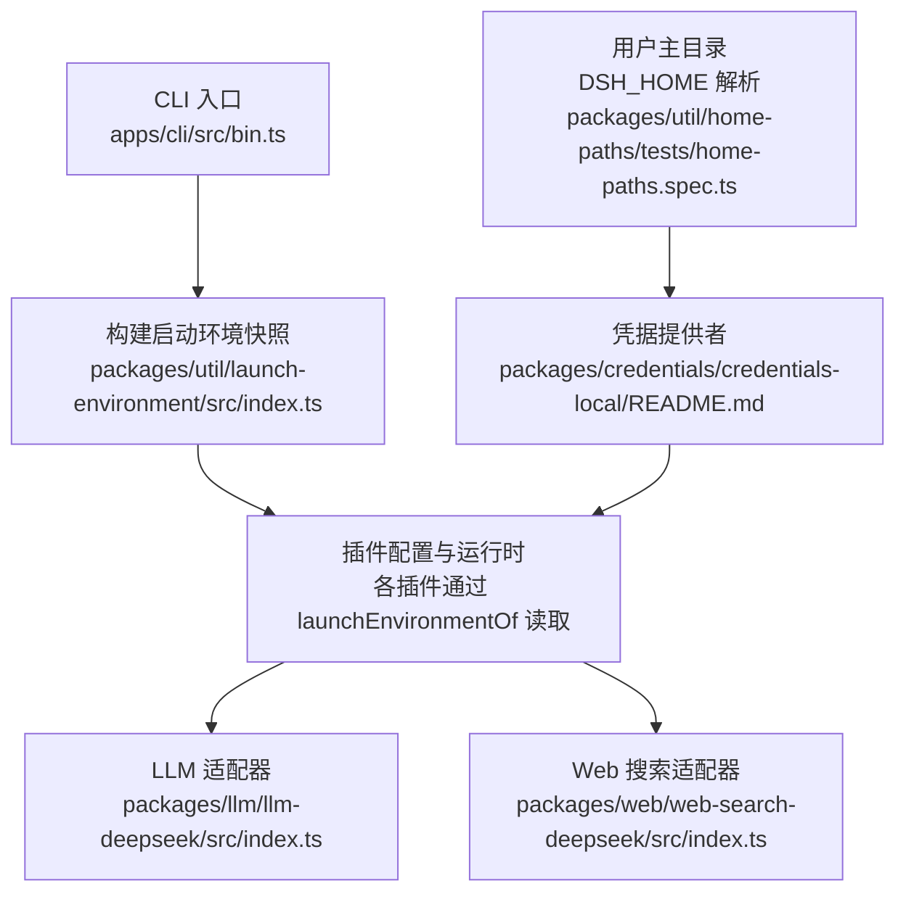
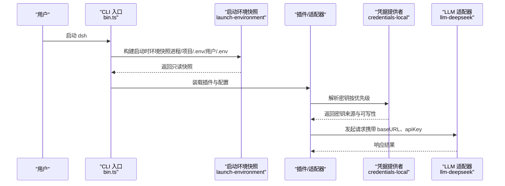
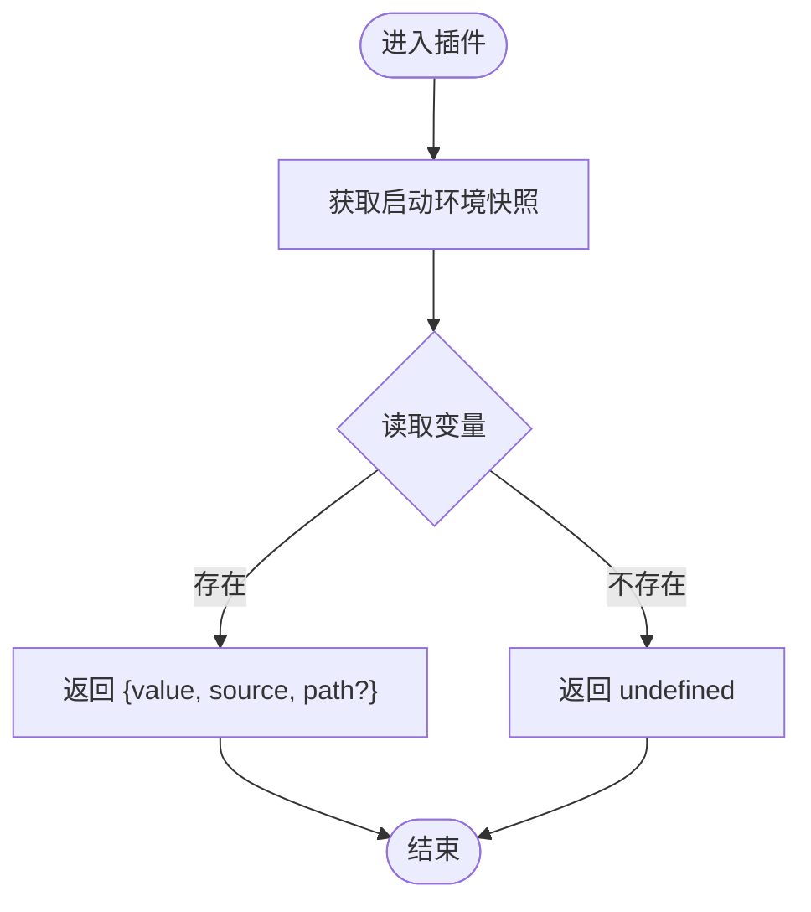
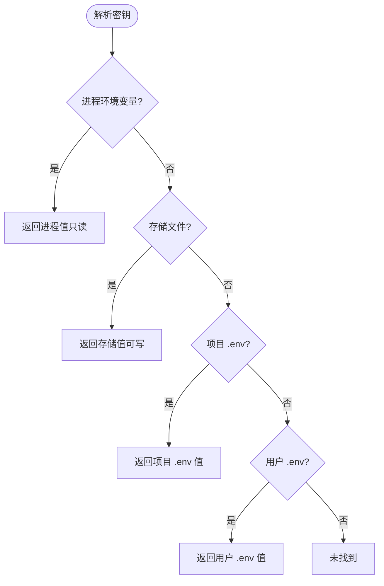
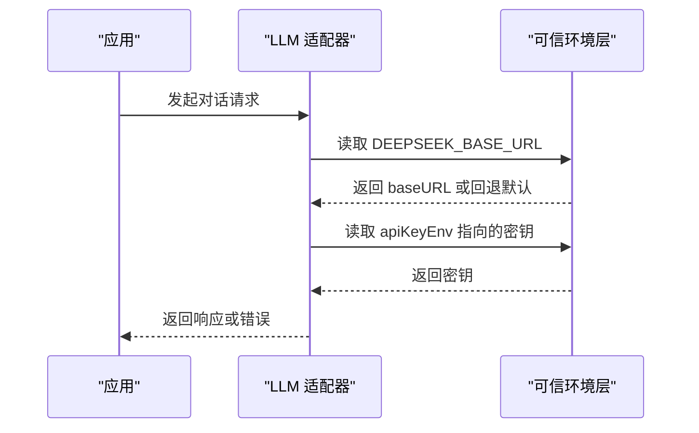
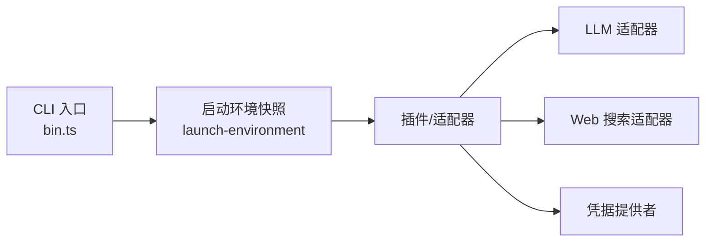

# 环境变量配置

<cite>
**本文引用的文件**
- [packages/util/launch-environment/src/index.ts](file://packages/util/launch-environment/src/index.ts)
- [packages/credentials/credentials-local/README.md](file://packages/credentials/credentials-local/README.md)
- [packages/llm/llm-deepseek/src/index.ts](file://packages/llm/llm-deepseek/src/index.ts)
- [packages/web/web-search-deepseek/src/index.ts](file://packages/web/web-search-deepseek/src/index.ts)
- [apps/cli/src/bin.ts](file://apps/cli/src/bin.ts)
- [apps/cli/src/profile-boot.ts](file://apps/cli/src/profile-boot.ts)
- [scripts/setup-dsh/setup.env.example](file://scripts/setup-dsh/setup.env.example)
- [packages/util/home-paths/tests/home-paths.spec.ts](file://packages/util/home-paths/tests/home-paths.spec.ts)
- [docs/config-catalog.zh.md](file://docs/config-catalog.zh.md)
</cite>

## 目录
1. [简介](#简介)
2. [项目结构](#项目结构)
3. [核心组件](#核心组件)
4. [架构总览](#架构总览)
5. [详细组件分析](#详细组件分析)
6. [依赖关系分析](#依赖关系分析)
7. [性能与可靠性考虑](#性能与可靠性考虑)
8. [故障排查指南](#故障排查指南)
9. [结论](#结论)
10. [附录：完整环境变量清单与示例](#附录完整环境变量清单与示例)

## 简介
本文件聚焦 DeepSeek Harness 的环境变量配置，覆盖关键变量（如 DEEPSEEK_API_KEY、DEEPSEEK_BASE_URL、DSH_HOME 等）的作用、默认值、格式要求与最佳实践；说明环境变量与配置文件的关系，以及在不同环境下的设置策略；并提供常见问题排查方法。文档同时给出完整的变量清单与示例配置路径，帮助你在本地、CI、容器等多环境中稳定运行。

## 项目结构
DeepSeek Harness 将“启动时环境快照”和“凭据解析层”解耦：
- 启动时环境快照：由 CLI 在进程启动时构建，记录每个变量的来源（进程、项目 .env、用户 .env），并在后续配置解析中作为权威来源。
- 凭据解析层：提供统一的密钥解析顺序（进程 > 存储文件 > 项目 .env > 用户 .env），并支持热重载与权限校验。
- LLM 适配器：通过配置项引用环境变量名（如 apiKeyEnv），在每次请求时从可信环境层读取端点与密钥。
- Web 搜索适配器：使用独立的环境变量命名空间，避免与聊天适配器的 BASE_URL 冲突。

图表来源
- [apps/cli/src/bin.ts:30-35](file://apps/cli/src/bin.ts#L30-L35)
- [packages/util/launch-environment/src/index.ts:1-124](file://packages/util/launch-environment/src/index.ts#L1-L124)
- [packages/credentials/credentials-local/README.md:69-80](file://packages/credentials/credentials-local/README.md#L69-L80)
- [packages/llm/llm-deepseek/src/index.ts:118-212](file://packages/llm/llm-deepseek/src/index.ts#L118-L212)
- [packages/web/web-search-deepseek/src/index.ts:63-85](file://packages/web/web-search-deepseek/src/index.ts#L63-L85)
- [packages/util/home-paths/tests/home-paths.spec.ts:35-57](file://packages/util/home-paths/tests/home-paths.spec.ts#L35-L57)

章节来源
- [apps/cli/src/bin.ts:30-35](file://apps/cli/src/bin.ts#L30-L35)
- [packages/util/launch-environment/src/index.ts:1-124](file://packages/util/launch-environment/src/index.ts#L1-L124)
- [packages/credentials/credentials-local/README.md:69-80](file://packages/credentials/credentials-local/README.md#L69-L80)
- [packages/llm/llm-deepseek/src/index.ts:118-212](file://packages/llm/llm-deepseek/src/index.ts#L118-L212)
- [packages/web/web-search-deepseek/src/index.ts:63-85](file://packages/web/web-search-deepseek/src/index.ts#L63-L85)
- [packages/util/home-paths/tests/home-paths.spec.ts:35-57](file://packages/util/home-paths/tests/home-paths.spec.ts#L35-L57)

## 核心组件
- 启动环境快照（Launch Environment Snapshot）
  - 作用：冻结进程启动时的环境变量，并记录每个值的来源（process/project-env/user-env）。
  - 关键点：按信任度排序（进程 > 项目 .env > 用户 .env），不可变，供所有插件统一读取。
  - 参考：[packages/util/launch-environment/src/index.ts:1-124](file://packages/util/launch-environment/src/index.ts#L1-L124)

- 凭据解析层（Credentials Local Provider）
  - 作用：统一管理 API Key 等敏感信息，提供 set/describe/unset 等操作，支持热重载与严格权限检查。
  - 解析顺序：进程环境变量 > 存储文件 > 项目 .env > 用户 .env。
  - 参考：[packages/credentials/credentials-local/README.md:69-80](file://packages/credentials/credentials-local/README.md#L69-L80)

- LLM 适配器（DeepSeek Chat Completions）
  - 作用：通过配置项 apiKeyEnv 指向环境变量名，在每次请求时从可信环境层读取密钥；baseURL 优先来自受信任的 DEEPSEEK_BASE_URL，否则回退到公共端点。
  - 参考：[packages/llm/llm-deepseek/src/index.ts:118-212](file://packages/llm/llm-deepseek/src/index.ts#L118-L212)

- Web 搜索适配器（DeepSeek Search）
  - 作用：使用独立的 BASE_URL 环境变量（DEEPSEEK_SEARCH_BASE_URL），避免与聊天适配器共用同一变量导致冲突。
  - 参考：[packages/web/web-search-deepseek/src/index.ts:63-85](file://packages/web/web-search-deepseek/src/index.ts#L63-L85)

- 用户主目录（DSH_HOME）
  - 作用：定义 Harness 的用户根目录，用于存放 .env、凭证文件、配置补丁等。空或空白视为未设置，将回退到默认位置。
  - 参考：[packages/util/home-paths/tests/home-paths.spec.ts:35-57](file://packages/util/home-paths/tests/home-paths.spec.ts#L35-L57)

章节来源
- [packages/util/launch-environment/src/index.ts:1-124](file://packages/util/launch-environment/src/index.ts#L1-L124)
- [packages/credentials/credentials-local/README.md:69-80](file://packages/credentials/credentials-local/README.md#L69-L80)
- [packages/llm/llm-deepseek/src/index.ts:118-212](file://packages/llm/llm-deepseek/src/index.ts#L118-L212)
- [packages/web/web-search-deepseek/src/index.ts:63-85](file://packages/web/web-search-deepseek/src/index.ts#L63-L85)
- [packages/util/home-paths/tests/home-paths.spec.ts:35-57](file://packages/util/home-paths/tests/home-paths.spec.ts#L35-L57)

## 架构总览
下图展示了环境变量在启动、配置加载与请求阶段的流转过程。

图表来源
- [apps/cli/src/bin.ts:30-35](file://apps/cli/src/bin.ts#L30-L35)
- [packages/util/launch-environment/src/index.ts:1-124](file://packages/util/launch-environment/src/index.ts#L1-L124)
- [packages/credentials/credentials-local/README.md:69-80](file://packages/credentials/credentials-local/README.md#L69-L80)
- [packages/llm/llm-deepseek/src/index.ts:118-212](file://packages/llm/llm-deepseek/src/index.ts#L118-L212)

## 详细组件分析

### 启动环境快照（Launch Environment Snapshot）
- 设计要点
  - 不可变快照：复制每层数据，防止后续修改影响已解析的值。
  - 信任顺序：进程 > 项目 .env > 用户 .env；Windows 下键名大小写归一化。
  - 上下文注入：CLI 在启动早期将快照注入 Context，供插件通过 launchEnvironmentOf 读取。
- 典型用法
  - 插件通过 launchEnvironmentOf(ctx) 获取快照，再调用 get/getFrom 读取变量。
  - 对敏感字段可使用 getFrom 限制来源（例如禁止从项目目录读取）。

图表来源
- [packages/util/launch-environment/src/index.ts:1-124](file://packages/util/launch-environment/src/index.ts#L1-L124)

章节来源
- [packages/util/launch-environment/src/index.ts:1-124](file://packages/util/launch-environment/src/index.ts#L1-L124)

### 凭据解析层（Credentials Local Provider）
- 解析顺序（固定且不可绕过）
  - 进程环境变量（最高优先级，只读）
  - 存储文件（可写，立即生效）
  - 项目 .env（不可写）
  - 用户 .env（不可写）
- 安全与可靠性
  - 文件权限检查（仅当前用户可读）
  - 版本化 YAML 文档（refs/records），自动热重载
  - 诊断不输出密钥值，仅显示来源与可写性
- 最佳实践
  - 生产环境优先使用进程环境变量或 CI 机密注入
  - 开发环境可将密钥写入 $DSH_HOME/.env 或项目 .env
  - 避免在 UI 或日志中打印密钥值

图表来源
- [packages/credentials/credentials-local/README.md:69-80](file://packages/credentials/credentials-local/README.md#L69-L80)

章节来源
- [packages/credentials/credentials-local/README.md:69-80](file://packages/credentials/credentials-local/README.md#L69-L80)

### LLM 适配器（DeepSeek Chat Completions）
- 关键环境变量
  - DEEPSEEK_API_KEY：通过配置项 apiKeyEnv 引用，默认值为 DEEPSEEK_API_KEY；每次请求时解析。
  - DEEPSEEK_BASE_URL：受信任环境层中的端点基址；若未设置，回退到公共端点。
- 行为说明
  - 缺失密钥不会在插件加载时报错，而是在首次请求时失败（MISSING_CREDENTIAL）。
  - baseURL 优先来自受信任环境层，确保部署可控。

图表来源
- [packages/llm/llm-deepseek/src/index.ts:118-212](file://packages/llm/llm-deepseek/src/index.ts#L118-L212)

章节来源
- [packages/llm/llm-deepseek/src/index.ts:118-212](file://packages/llm/llm-deepseek/src/index.ts#L118-L212)
- [docs/config-catalog.zh.md:1082-1155](file://docs/config-catalog.zh.md#L1082-L1155)

### Web 搜索适配器（DeepSeek Search）
- 关键环境变量
  - DEEPSEEK_SEARCH_BASE_URL：搜索专用的端点基址，刻意与聊天适配器的 DEEPSEEK_BASE_URL 分离，避免冲突。
- 行为说明
  - 搜索走 Anthropic 兼容 Messages API，因此需要独立的 BASE_URL 变量。

章节来源
- [packages/web/web-search-deepseek/src/index.ts:63-85](file://packages/web/web-search-deepseek/src/index.ts#L63-L85)

### 用户主目录（DSH_HOME）
- 作用
  - 定义 Harness 的用户根目录，用于存放 .env、凭证文件、配置补丁等。
  - 空或空白视为未设置，将回退到默认位置（~/.dsh）。
- 建议
  - 在多用户或多实例场景中，为每个实例指定不同的 DSH_HOME，避免共享状态冲突。

章节来源
- [packages/util/home-paths/tests/home-paths.spec.ts:35-57](file://packages/util/home-paths/tests/home-paths.spec.ts#L35-L57)

## 依赖关系分析
- CLI 入口负责加载 layered env，并将启动环境快照注入 Context。
- 插件通过 launchEnvironmentOf 读取受信任的环境变量。
- 凭据提供者按固定顺序解析密钥，保证进程环境变量优先且不可被覆盖。
- LLM/Web 搜索适配器分别依赖各自的环境变量命名空间，避免冲突。

图表来源
- [apps/cli/src/bin.ts:30-35](file://apps/cli/src/bin.ts#L30-L35)
- [packages/util/launch-environment/src/index.ts:1-124](file://packages/util/launch-environment/src/index.ts#L1-L124)
- [packages/credentials/credentials-local/README.md:69-80](file://packages/credentials/credentials-local/README.md#L69-L80)
- [packages/llm/llm-deepseek/src/index.ts:118-212](file://packages/llm/llm-deepseek/src/index.ts#L118-L212)
- [packages/web/web-search-deepseek/src/index.ts:63-85](file://packages/web/web-search-deepseek/src/index.ts#L63-L85)

章节来源
- [apps/cli/src/bin.ts:30-35](file://apps/cli/src/bin.ts#L30-L35)
- [packages/util/launch-environment/src/index.ts:1-124](file://packages/util/launch-environment/src/index.ts#L1-L124)
- [packages/credentials/credentials-local/README.md:69-80](file://packages/credentials/credentials-local/README.md#L69-L80)
- [packages/llm/llm-deepseek/src/index.ts:118-212](file://packages/llm/llm-deepseek/src/index.ts#L118-L212)
- [packages/web/web-search-deepseek/src/index.ts:63-85](file://packages/web/web-search-deepseek/src/index.ts#L63-L85)

## 性能与可靠性考虑
- 启动时快照一次性构建，避免重复读取 process.env，提升一致性。
- 凭据文件支持热重载，变更即时生效，无需重启。
- 严格的权限检查与版本化文档，降低误用风险。
- 适配器在请求时解析密钥，避免启动期失败阻塞，但会在使用时快速失败。

## 故障排查指南
- 现象：提示缺少凭据（MISSING_CREDENTIAL）
  - 检查是否设置了 apiKeyEnv 指向的环境变量（如 DEEPSEEK_API_KEY）。
  - 确认该变量来自进程环境变量或存储文件，而非仅在启动后导出。
  - 参考：[packages/llm/llm-deepseek/src/index.ts:118-212](file://packages/llm/llm-deepseek/src/index.ts#L118-L212)

- 现象：端点不正确或连接失败
  - 检查 DEEPSEEK_BASE_URL（聊天）或 DEEPSEEK_SEARCH_BASE_URL（搜索）是否正确。
  - 确认来自受信任环境层（进程/项目 .env/用户 .env），而非被其他层覆盖。
  - 参考：[packages/llm/llm-deepseek/src/index.ts:118-212](file://packages/llm/llm-deepseek/src/index.ts#L118-L212), [packages/web/web-search-deepseek/src/index.ts:63-85](file://packages/web/web-search-deepseek/src/index.ts#L63-L85)

- 现象：密钥无法修改或保存失败
  - 进程环境变量具有最高优先级且只读，需先清除进程变量再保存。
  - 存储文件权限必须正确（仅当前用户可读），否则会拒绝加载。
  - 参考：[packages/credentials/credentials-local/README.md:69-80](file://packages/credentials/credentials-local/README.md#L69-L80)

- 现象：DSH_HOME 未生效或路径异常
  - 空或空白视为未设置，将回退到默认位置。
  - 建议使用绝对路径或在多实例场景明确指定不同 DSH_HOME。
  - 参考：[packages/util/home-paths/tests/home-paths.spec.ts:35-57](file://packages/util/home-paths/tests/home-paths.spec.ts#L35-L57)

章节来源
- [packages/llm/llm-deepseek/src/index.ts:118-212](file://packages/llm/llm-deepseek/src/index.ts#L118-L212)
- [packages/web/web-search-deepseek/src/index.ts:63-85](file://packages/web/web-search-deepseek/src/index.ts#L63-L85)
- [packages/credentials/credentials-local/README.md:69-80](file://packages/credentials/credentials-local/README.md#L69-L80)
- [packages/util/home-paths/tests/home-paths.spec.ts:35-57](file://packages/util/home-paths/tests/home-paths.spec.ts#L35-L57)

## 结论
DeepSeek Harness 通过“启动时环境快照 + 凭据解析层”的组合，实现了安全、一致且可热更新的环境变量管理。对于 LLM 与搜索等外部服务，采用独立的环境变量命名空间以避免冲突。推荐在生产环境使用进程环境变量或 CI 机密注入，在开发环境使用 $DSH_HOME/.env 或项目 .env。遵循本文的最佳实践与排查步骤，可显著降低配置错误带来的问题。

## 附录：完整环境变量清单与示例
- 核心环境变量
  - DEEPSEEK_API_KEY：LLM 聊天适配器使用的 API 密钥引用名（默认值）。通过配置项 apiKeyEnv 指向该变量名，每次请求时解析。
    - 用途：认证访问 DeepSeek 聊天接口
    - 格式：字符串（API Key）
    - 来源优先级：进程环境变量 > 存储文件 > 项目 .env > 用户 .env
    - 参考：[packages/llm/llm-deepseek/src/index.ts:118-212](file://packages/llm/llm-deepseek/src/index.ts#L118-L212), [packages/credentials/credentials-local/README.md:69-80](file://packages/credentials/credentials-local/README.md#L69-L80)

  - DEEPSEEK_BASE_URL：聊天适配器的端点基址。优先从受信任环境层读取，未设置则回退到公共端点。
    - 用途：指定聊天 API 的 Base URL
    - 格式：URL 字符串
    - 参考：[packages/llm/llm-deepseek/src/index.ts:118-212](file://packages/llm/llm-deepseek/src/index.ts#L118-L212)

  - DEEPSEEK_SEARCH_BASE_URL：搜索适配器的端点基址，与聊天适配器分离，避免冲突。
    - 用途：指定搜索 API 的 Base URL
    - 格式：URL 字符串
    - 参考：[packages/web/web-search-deepseek/src/index.ts:63-85](file://packages/web/web-search-deepseek/src/index.ts#L63-L85)

  - DSH_HOME：Harness 用户根目录。空或空白视为未设置，回退到默认位置（~/.dsh）。
    - 用途：存放 .env、凭证文件、配置补丁等
    - 格式：绝对路径或带 ~ 的路径
    - 参考：[packages/util/home-paths/tests/home-paths.spec.ts:35-57](file://packages/util/home-paths/tests/home-paths.spec.ts#L35-L57)

- 示例配置
  - 本地开发
    - 在项目根目录创建 .env，添加 DEEPSEEK_API_KEY 与可选的 DEEPSEEK_BASE_URL。
    - 或通过 export 设置进程环境变量以覆盖其他层。
  - 用户级配置
    - 在 $DSH_HOME/.env 中添加 DEEPSEEK_API_KEY，便于全局复用。
  - CI/容器
    - 通过 CI 机密或容器 -e 注入 DEEPSEEK_API_KEY 与 DEEPSEEK_BASE_URL，确保进程环境变量优先。
  - 参考示例模板：[scripts/setup-dsh/setup.env.example:22-88](file://scripts/setup-dsh/setup.env.example#L22-L88)

- 环境变量与配置文件的关系
  - 配置文件（cordis.yml、profile patch）通过配置项引用环境变量名（如 apiKeyEnv），而不是直接包含密钥。
  - 运行时按固定顺序解析环境变量，确保进程环境变量不可被覆盖，存储文件优先于 .env。
  - 参考：[packages/credentials/credentials-local/README.md:69-80](file://packages/credentials/credentials-local/README.md#L69-L80), [docs/config-catalog.zh.md:1082-1155](file://docs/config-catalog.zh.md#L1082-L1155)

- 不同环境的设置策略
  - 本地开发：优先使用项目 .env，必要时通过进程环境变量临时覆盖。
  - 生产环境：使用进程环境变量或 CI 机密注入，避免将密钥写入文件。
  - 多实例：为每个实例设置独立的 DSH_HOME，避免共享状态冲突。

章节来源
- [packages/llm/llm-deepseek/src/index.ts:118-212](file://packages/llm/llm-deepseek/src/index.ts#L118-L212)
- [packages/web/web-search-deepseek/src/index.ts:63-85](file://packages/web/web-search-deepseek/src/index.ts#L63-L85)
- [packages/credentials/credentials-local/README.md:69-80](file://packages/credentials/credentials-local/README.md#L69-L80)
- [packages/util/home-paths/tests/home-paths.spec.ts:35-57](file://packages/util/home-paths/tests/home-paths.spec.ts#L35-L57)
- [scripts/setup-dsh/setup.env.example:22-88](file://scripts/setup-dsh/setup.env.example#L22-L88)
- [docs/config-catalog.zh.md:1082-1155](file://docs/config-catalog.zh.md#L1082-L1155)