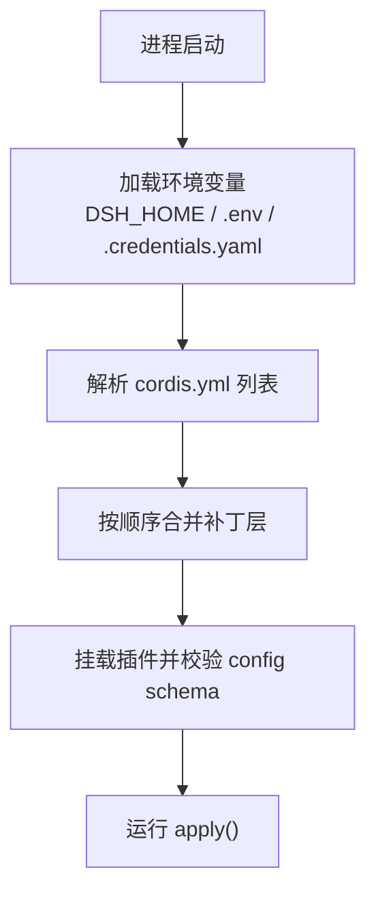
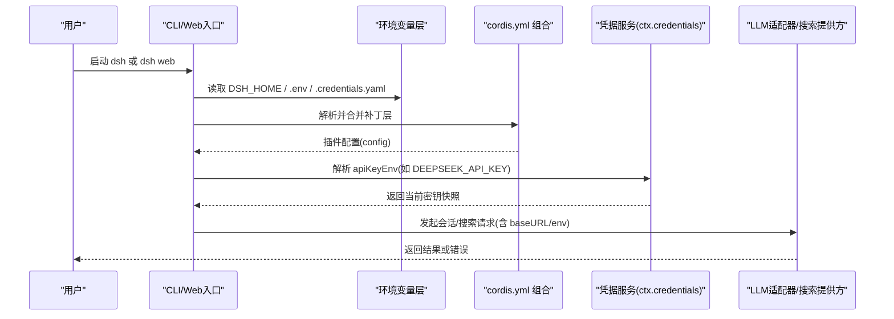
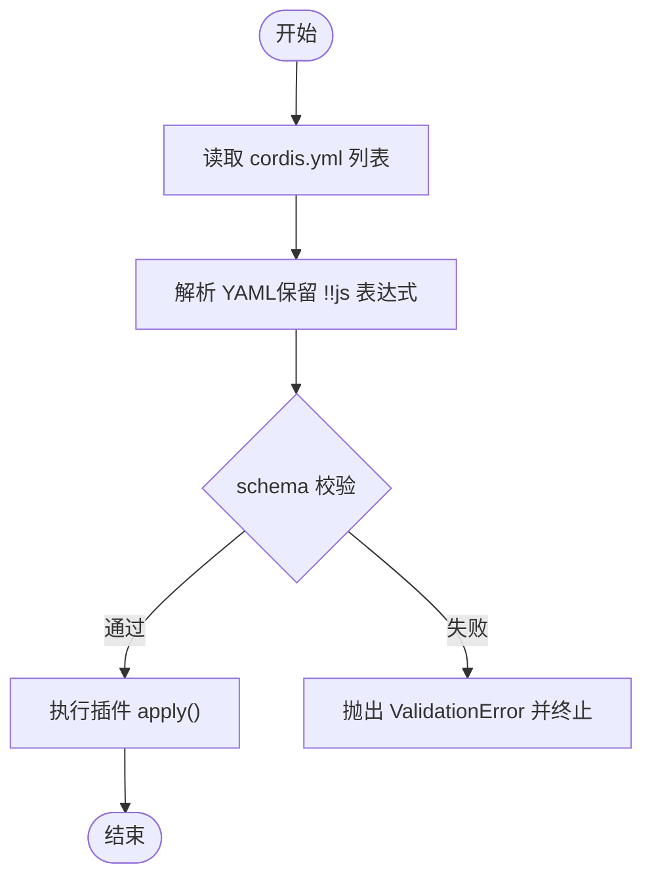
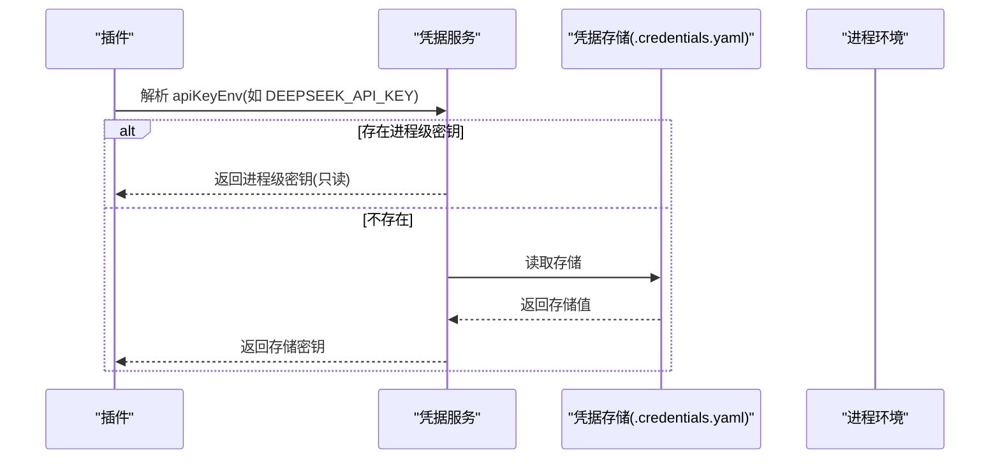
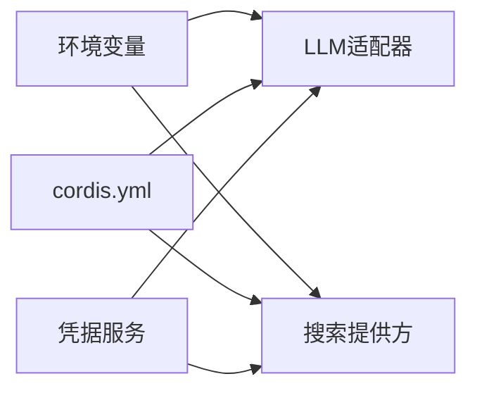

# 环境配置

<cite>
**本文引用的文件**
- [packages/web/web-search-deepseek/src/index.ts](file://packages/web/web-search-deepseek/src/index.ts)
- [packages/boot/app-boot/src/index.ts](file://packages/boot/app-boot/src/index.ts)
- [apps/cli/reference/README.zh.md](file://apps/cli/reference/README.zh.md)
- [packages/web/web-search-deepseek/README.zh.md](file://packages/web/web-search-deepseek/README.zh.md)
- [scripts/cordis-config-files.ts](file://scripts/cordis-config-files.ts)
- [scripts/cordis-yaml.ts](file://scripts/cordis-yaml.ts)
- [scripts/verify-cordis-config.ts](file://scripts/verify-cordis-config.ts)
- [scripts/verify-config-source-ownership.ts](file://scripts/verify-config-source-ownership.ts)
- [apps/cli/config/examples/github-review/cordis.yml](file://apps/cli/config/examples/github-review/cordis.yml)
- [apps/cli/config/examples/cordis/cordis.yml](file://apps/cli/config/examples/cordis/cordis.yml)
- [scripts/setup-dsh/templates/profile-web/cordis.yml](file://scripts/setup-dsh/templates/profile-web/cordis.yml)
- [packages/credentials/credentials/README.zh.md](file://packages/credentials/credentials/README.zh.md)
- [apps/cli/tests/profiles/headless/credentials.cordis.snapshot.yml](file://apps/cli/tests/profiles/headless/credentials.cordis.snapshot.yml)
- [packages/util/home-paths/tests/home-paths.spec.ts](file://packages/util/home-paths/tests/home-paths.spec.ts)
- [scripts/setup-dsh/export-env.sh](file://scripts/setup-dsh/export-env.sh)
- [scripts/setup-dsh/setup.sh](file://scripts/setup-dsh/setup.sh)
</cite>

## 目录
1. [简介](#简介)
2. [项目结构](#项目结构)
3. [核心组件](#核心组件)
4. [架构总览](#架构总览)
5. [详细组件分析](#详细组件分析)
6. [依赖关系分析](#依赖关系分析)
7. [性能考虑](#性能考虑)
8. [故障排查指南](#故障排查指南)
9. [结论](#结论)
10. [附录：环境变量与配置文件清单](#附录：环境变量与配置文件清单)

## 简介
本文件面向 DeepSeek Harness 的环境配置，聚焦以下目标：
- 说明所有关键环境变量（如 DEEPSEEK_API_KEY、DEEPSEEK_BASE_URL、DEEPSEEK_SEARCH_BASE_URL 等）的作用与设置方法。
- 解释 cordis.yml 配置文件格式、层次结构与覆盖策略。
- 给出多环境（开发、测试、生产）的配置差异与管理策略。
- 提供配置验证与故障排查指南，帮助快速定位问题。
- 提供完整示例与最佳实践建议。

## 项目结构
DeepSeek Harness 通过 Cordis Loader 将多个插件组合为可运行的应用。配置以 YAML 形式组织在 cordis*.yml 文件中，并通过“基础层 + 补丁层 + 用户层”的叠加方式生效。运行时还会读取环境变量与凭据存储，形成最终配置。

图表来源
- [scripts/cordis-config-files.ts:1-19](file://scripts/cordis-config-files.ts#L1-L19)
- [scripts/cordis-yaml.ts:1-55](file://scripts/cordis-yaml.ts#L1-L55)
- [scripts/verify-cordis-config.ts:60-88](file://scripts/verify-cordis-config.ts#L60-L88)

章节来源
- [scripts/cordis-config-files.ts:1-19](file://scripts/cordis-config-files.ts#L1-L19)
- [scripts/cordis-yaml.ts:1-55](file://scripts/cordis-yaml.ts#L1-L55)
- [scripts/verify-cordis-config.ts:60-88](file://scripts/verify-cordis-config.ts#L60-L88)

## 核心组件
- 环境变量层
  - 进程继承环境优先（只读），包括 CI 机密、容器 -e 注入等。
  - 工作区 .env 与 $DSH_HOME/.env 作为普通启动环境层。
  - 搜索端点独立于会话端点：DEEPSEEK_SEARCH_BASE_URL 仅影响搜索请求；DEEPSEEK_BASE_URL 用于会话请求。
- 凭据层
  - 凭据以“引用”形式存在于配置中（如 apiKeyEnv），实际值由凭据 seam 在每次操作时解析。
  - 默认使用 DEEPSEEK_API_KEY 作为密钥名；也可自定义 apiKeyEnv。
  - 受管凭据文档不物化到 process.env，避免污染全局环境。
- 配置层
  - cordis.yml 是插件组合清单，每个条目可带 config 块，由插件声明 schema 并在 apply 前校验。
  - 支持 group、insert、patch 等组合能力，便于分层管理。
- 根目录与用户数据
  - $DSH_HOME 为统一根目录，默认 ~/.dsh；可通过显式路径或环境变量覆盖。
  - 用户设置与凭据分别位于 settings.yaml 与 .credentials.yaml。

章节来源
- [packages/web/web-search-deepseek/src/index.ts:43-61](file://packages/web/web-search-deepseek/src/index.ts#L43-L61)
- [packages/boot/app-boot/src/index.ts:112-112](file://packages/boot/app-boot/src/index.ts#L112-L112)
- [apps/cli/reference/README.zh.md:92-92](file://apps/cli/reference/README.zh.md#L92-L92)
- [packages/credentials/credentials/README.zh.md:83-107](file://packages/credentials/credentials/README.zh.md#L83-L107)
- [packages/util/home-paths/tests/home-paths.spec.ts:35-57](file://packages/util/home-paths/tests/home-paths.spec.ts#L35-L57)

## 架构总览
下图展示了从启动到请求的关键路径：环境变量与配置文件如何汇聚成最终配置，以及凭据如何在运行时被解析。

图表来源
- [packages/web/web-search-deepseek/src/index.ts:43-61](file://packages/web/web-search-deepseek/src/index.ts#L43-L61)
- [packages/boot/app-boot/src/index.ts:112-112](file://packages/boot/app-boot/src/index.ts#L112-L112)
- [packages/credentials/credentials/README.zh.md:83-107](file://packages/credentials/credentials/README.zh.md#L83-L107)

## 详细组件分析

### 环境变量与优先级
- 环境变量优先级（从高到低）
  1) 进程继承环境（只读，不可覆盖）：如 CI 机密、容器 -e、命令行导出。
  2) 调用目录 .env 与 $DSH_HOME/.env：普通启动环境层。
  3) 配置文件中的非机密字段（如 baseURL、model 等）。
- 关键变量
  - DEEPSEEK_API_KEY：会话与搜索使用的 API 密钥名（默认）。可在配置中以 apiKeyEnv 指定其他变量名。
  - DEEPSEEK_BASE_URL：会话请求的 Anthropic 兼容基址（/messages 会追加）。
  - DEEPSEEK_SEARCH_BASE_URL：搜索请求的 Anthropic 兼容基址，独立于会话基址。
  - DSH_HOME：Harness 用户数据根目录，默认 ~/.dsh。
  - DSH_CONTEXT_WINDOW、DSH_SYSTEM_PROMPT：SDK 最小化场景下的上下文窗口与系统提示。
- 安全注意
  - 启动时提供的密钥无法被覆盖；若需切换，请先清除进程级变量再设置新值。
  - 空字符串不能存入凭据；应删除对应条目。
  - 界面与诊断不会显示密钥值，只显示是否已设置及来源。

章节来源
- [packages/web/web-search-deepseek/src/index.ts:43-61](file://packages/web/web-search-deepseek/src/index.ts#L43-L61)
- [packages/boot/app-boot/src/index.ts:112-112](file://packages/boot/app-boot/src/index.ts#L112-L112)
- [apps/cli/reference/README.zh.md:92-92](file://apps/cli/reference/README.zh.md#L92-L92)
- [packages/credentials/credentials/README.zh.md:83-107](file://packages/credentials/credentials/README.zh.md#L83-L107)
- [packages/util/home-paths/tests/home-paths.spec.ts:35-57](file://packages/util/home-paths/tests/home-paths.spec.ts#L35-L57)

### cordis.yml 配置语法与层次
- 基本结构
  - 根节点为数组，每项为一个插件条目，包含 id、name、config 等。
  - 支持 group（分组）、insert（插入）、patch（替换 config）等组合能力。
- 校验机制
  - 每个插件可导出 Config schema，Cordis 在 apply 前进行严格校验，失败即中止加载。
- 文件发现
  - 仓库扫描 **/*cordis*.yml 与 **/*cordis*.yaml（排除 node_modules/vendor/.claude 等）。
- 示例参考
  - 示例 patch 覆盖端口、插入 host runner 与工具。
  - Web 模板根 cordis.yml 为空数组，实际组合通过 bundle 与 patch 完成。

图表来源
- [scripts/cordis-yaml.ts:1-55](file://scripts/cordis-yaml.ts#L1-L55)
- [scripts/verify-cordis-config.ts:60-88](file://scripts/verify-cordis-config.ts#L60-L88)
- [apps/cli/config/examples/cordis/cordis.yml:1-20](file://apps/cli/config/examples/cordis/cordis.yml#L1-L20)
- [scripts/setup-dsh/templates/profile-web/cordis.yml:1-5](file://scripts/setup-dsh/templates/profile-web/cordis.yml#L1-L5)

章节来源
- [scripts/cordis-config-files.ts:1-19](file://scripts/cordis-config-files.ts#L1-L19)
- [scripts/cordis-yaml.ts:1-55](file://scripts/cordis-yaml.ts#L1-L55)
- [scripts/verify-cordis-config.ts:60-88](file://scripts/verify-cordis-config.ts#L60-L88)
- [apps/cli/config/examples/cordis/cordis.yml:1-20](file://apps/cli/config/examples/cordis/cordis.yml#L1-L20)
- [scripts/setup-dsh/templates/profile-web/cordis.yml:1-5](file://scripts/setup-dsh/templates/profile-web/cordis.yml#L1-L5)

### 凭据管理与密钥轮换
- 引用优先于明文
  - 配置中仅保存密钥名（apiKeyEnv），实际值由凭据 seam 在每次操作时解析。
- 存储位置
  - 受管凭据文档位于 $DSH_HOME/.credentials.yaml；两个 .env 文件是普通启动环境层。
- 动态轮换
  - 修改存储后，下一次请求即可生效，无需重启。
- 缺失处理
  - 无可用凭据时，首次运行会给出 MISSING_CREDENTIAL 引导信息。

图表来源
- [packages/credentials/credentials/README.zh.md:83-107](file://packages/credentials/credentials/README.zh.md#L83-L107)
- [apps/cli/tests/profiles/headless/credentials.cordis.snapshot.yml:1-18](file://apps/cli/tests/profiles/headless/credentials.cordis.snapshot.yml#L1-L18)

章节来源
- [packages/credentials/credentials/README.zh.md:83-107](file://packages/credentials/credentials/README.zh.md#L83-L107)
- [apps/cli/tests/profiles/headless/credentials.cordis.snapshot.yml:1-18](file://apps/cli/tests/profiles/headless/credentials.cordis.snapshot.yml#L1-L18)

### 多环境支持方案（开发/测试/生产）
- 推荐策略
  - 使用 cordis.patch.yml 与 --patch 覆盖层实现差异化配置，避免硬编码敏感信息。
  - 通过不同 .env 文件区分环境：开发用项目根 .env，测试/生产用 CI 注入或容器 -e。
  - 使用 $DSH_HOME 隔离不同环境的用户数据与凭据。
- 示例
  - Web 钩子示例通过环境变量注入端口与密钥，体现“配置仅持有引用，值来自环境”的模式。
- 注意事项
  - 禁止在 shipped 配置中内联 !!js 形式的 apiKey/baseURL/authToken/headers，以免绕过凭据与环境层。

章节来源
- [apps/cli/config/examples/github-review/cordis.yml:1-36](file://apps/cli/config/examples/github-review/cordis.yml#L1-L36)
- [scripts/verify-config-source-ownership.ts:1-55](file://scripts/verify-config-source-ownership.ts#L1-L55)

### 配置验证与诊断
- 构建期检查
  - verify-cordis-config：校验 cordis.yml 根为数组、条目合法、包解析正确等。
  - verify-config-source-ownership：拒绝 shipped 配置中内联 !!js 形式的敏感字段。
- 运行期校验
  - 插件 config schema 校验失败会抛出 ValidationError，并给出精确路径与类型信息。
- 调试技巧
  - 使用 renderConfigDump 输出最终组合后的配置树，便于定位覆盖冲突。
  - 通过 export-env.sh 导出当前运行时配置，便于复现与迁移。

章节来源
- [scripts/verify-cordis-config.ts:60-88](file://scripts/verify-cordis-config.ts#L60-L88)
- [scripts/verify-config-source-ownership.ts:1-55](file://scripts/verify-config-source-ownership.ts#L1-L55)
- [packages/boot/app-boot/src/index.ts:382-412](file://packages/boot/app-boot/src/index.ts#L382-L412)
- [scripts/setup-dsh/export-env.sh:1-41](file://scripts/setup-dsh/export-env.sh#L1-L41)

## 依赖关系分析
- 环境变量依赖
  - 会话与搜索分别依赖 DEEPSEEK_BASE_URL 与 DEEPSEEK_SEARCH_BASE_URL。
  - 搜索提供方默认使用 DEEPSEEK_API_KEY 作为密钥名，也可通过 apiKeyEnv 自定义。
- 配置依赖
  - cordis.yml 条目依赖插件导出的 Config schema；未满足则加载失败。
- 凭据依赖
  - 插件通过 ctx.credentials 解析 apiKeyEnv；若无 seam，回退到进程环境。

图表来源
- [packages/web/web-search-deepseek/src/index.ts:43-61](file://packages/web/web-search-deepseek/src/index.ts#L43-L61)
- [packages/boot/app-boot/src/index.ts:112-112](file://packages/boot/app-boot/src/index.ts#L112-L112)
- [packages/web/web-search-deepseek/README.zh.md:50-50](file://packages/web/web-search-deepseek/README.zh.md#L50-L50)

章节来源
- [packages/web/web-search-deepseek/src/index.ts:43-61](file://packages/web/web-search-deepseek/src/index.ts#L43-L61)
- [packages/web/web-search-deepseek/README.zh.md:50-50](file://packages/web/web-search-deepseek/README.zh.md#L50-L50)
- [packages/boot/app-boot/src/index.ts:112-112](file://packages/boot/app-boot/src/index.ts#L112-L112)

## 性能考虑
- 避免在 cordis.yml 中使用昂贵的 !!js 表达式；尽量使用静态值或环境变量。
- 合理拆分补丁层，减少不必要的重算与重复加载。
- 凭据解析在每次操作时进行，确保最新值生效；频繁轮换时应评估开销。
- 使用 $DSH_HOME 隔离不同环境，避免跨环境缓存污染。

[本节为通用指导，不直接分析具体文件]

## 故障排查指南
- 常见问题
  - 启动时报错：检查 cordis.yml 根是否为数组、条目是否合法、schema 是否满足。
  - 密钥无效：确认 DEEPSEEK_API_KEY 是否存在且有效；若使用 apiKeyEnv，请核对变量名。
  - 端点错误：确认 DEEPSEEK_BASE_URL（会话）与 DEEPSEEK_SEARCH_BASE_URL（搜索）是否正确。
  - 权限问题：$DSH_HOME 及其子目录权限应为仅属主可写；凭据文档不应泄露给模型。
- 定位步骤
  - 使用 export-env.sh 导出当前环境，对比期望值。
  - 使用 renderConfigDump 输出最终组合配置，查找覆盖冲突。
  - 查看插件日志与事件（如 web/deepseek-search-llm-request）以确认实际端点与请求体（不含密钥）。
- 恢复策略
  - 清理进程级密钥后再重新设置；必要时重置 $DSH_HOME 以重建干净环境。
  - 修正 cordis.yml 后重新加载；保持 schema 与 config 一致。

章节来源
- [scripts/setup-dsh/export-env.sh:1-41](file://scripts/setup-dsh/export-env.sh#L1-L41)
- [packages/boot/app-boot/src/index.ts:382-412](file://packages/boot/app-boot/src/index.ts#L382-L412)
- [packages/web/web-search-deepseek/src/index.ts:43-61](file://packages/web/web-search-deepseek/src/index.ts#L43-L61)
- [packages/credentials/credentials/README.zh.md:83-107](file://packages/credentials/credentials/README.zh.md#L83-L107)

## 结论
- 环境变量与配置文件共同决定 Harness 的行为；遵循“配置仅持有引用，值来自环境/凭据”的原则，可提升安全性与可维护性。
- 通过 cordis.yml 的分层组合与 schema 校验，可实现强一致、可审计的配置体系。
- 多环境管理建议使用补丁层与 .env 分离，结合 $DSH_HOME 隔离用户数据。
- 借助内置验证与诊断工具，可快速定位并修复配置问题。

[本节为总结，不直接分析具体文件]

## 附录：环境变量与配置文件清单
- 环境变量
  - DEEPSEEK_API_KEY：会话与搜索使用的 API 密钥名（默认）。
  - DEEPSEEK_BASE_URL：会话请求的 Anthropic 兼容基址。
  - DEEPSEEK_SEARCH_BASE_URL：搜索请求的 Anthropic 兼容基址。
  - DSH_HOME：Harness 用户数据根目录（默认 ~/.dsh）。
  - DSH_CONTEXT_WINDOW、DSH_SYSTEM_PROMPT：SDK 最小化场景下的上下文窗口与系统提示。
- 配置文件
  - cordis.yml：插件组合清单，支持 group、insert、patch。
  - settings.yaml：用户设置（由 settings seam 管理）。
  - .credentials.yaml：受管凭据存储（由凭据 seam 管理）。
  - .env：普通启动环境层（调用目录与 $DSH_HOME 下均可）。
- 示例参考
  - Web 钩子示例展示如何通过环境变量注入端口与密钥。
  - Web 模板根 cordis.yml 为空数组，实际组合通过 bundle 与 patch 完成。

章节来源
- [packages/web/web-search-deepseek/src/index.ts:43-61](file://packages/web/web-search-deepseek/src/index.ts#L43-L61)
- [packages/boot/app-boot/src/index.ts:112-112](file://packages/boot/app-boot/src/index.ts#L112-L112)
- [apps/cli/reference/README.zh.md:92-92](file://apps/cli/reference/README.zh.md#L92-L92)
- [apps/cli/config/examples/github-review/cordis.yml:1-36](file://apps/cli/config/examples/github-review/cordis.yml#L1-L36)
- [scripts/setup-dsh/templates/profile-web/cordis.yml:1-5](file://scripts/setup-dsh/templates/profile-web/cordis.yml#L1-L5)