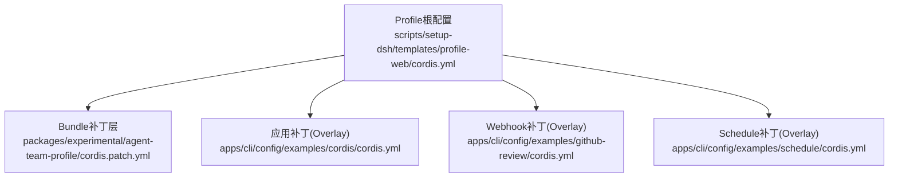
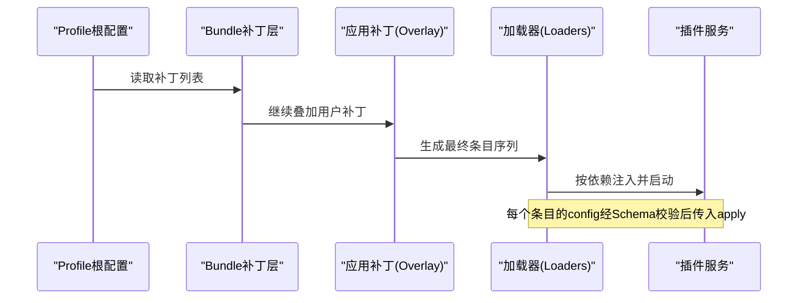
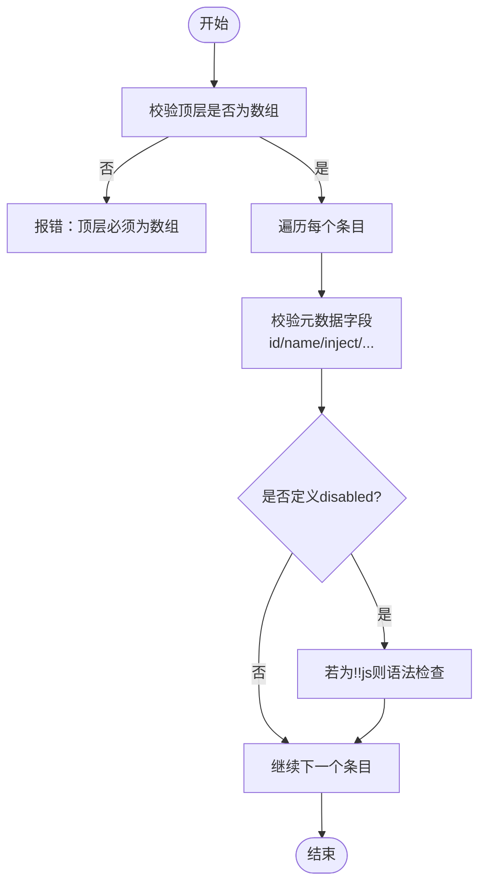
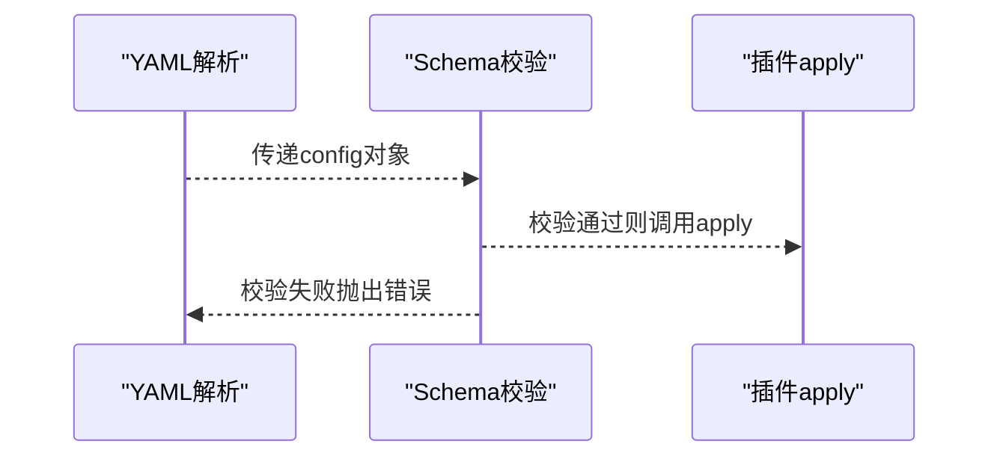
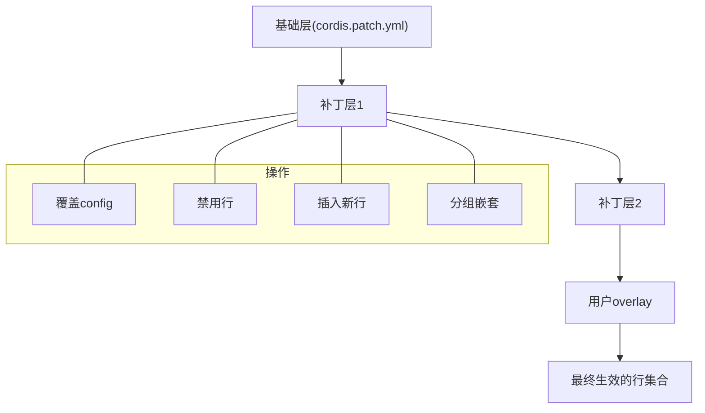
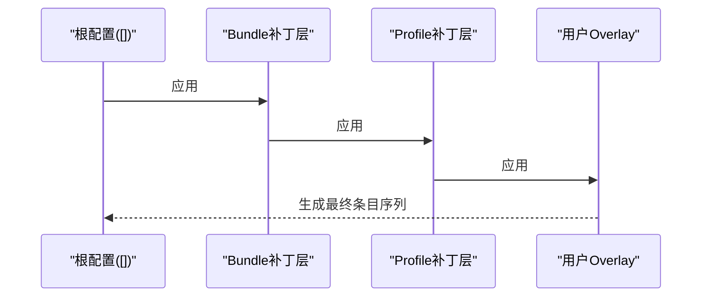
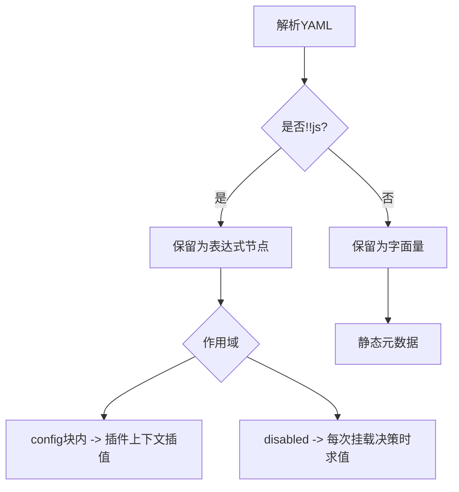
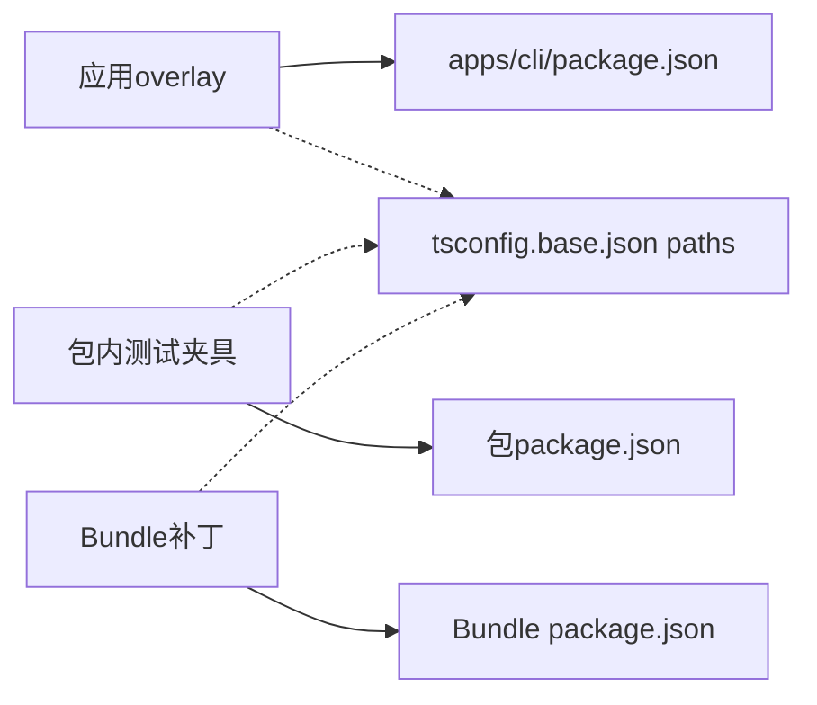

# Cordis配置文件结构

<cite>
**本文引用的文件**
- [apps/cli/config/examples/cordis/cordis.yml](file://apps/cli/config/examples/cordis/cordis.yml)
- [apps/cli/config/examples/github-review/cordis.yml](file://apps/cli/config/examples/github-review/cordis.yml)
- [apps/cli/config/examples/schedule/cordis.yml](file://apps/cli/config/examples/schedule/cordis.yml)
- [scripts/setup-dsh/templates/profile-web/cordis.yml](file://scripts/setup-dsh/templates/profile-web/cordis.yml)
- [packages/experimental/agent-team-profile/cordis.patch.yml](file://packages/experimental/agent-team-profile/cordis.patch.yml)
- [scripts/cordis-yaml.ts](file://scripts/cordis-yaml.ts)
- [scripts/verify-cordis-config.ts](file://scripts/verify-cordis-config.ts)
- [docs/cordis-tutorial/05-config.md](file://docs/cordis-tutorial/05-config.md)
- [docs/cordis-primer.md](file://docs/cordis-primer.md)
</cite>

## 目录
1. [简介](#简介)
2. [项目结构](#项目结构)
3. [核心组件](#核心组件)
4. [架构总览](#架构总览)
5. [详细组件分析](#详细组件分析)
6. [依赖关系分析](#依赖关系分析)
7. [性能考虑](#性能考虑)
8. [故障排查指南](#故障排查指南)
9. [结论](#结论)
10. [附录](#附录)

## 简介
本文件面向DeepSeek Harness中的Cordis配置文件（cordis.yml），系统性说明其层次结构、语法规范、继承与覆盖机制、加载顺序、验证规则，并提供完整示例与最佳实践。Cordis是DeepSeek Harness的插件框架，通过YAML描述“加载器条目”（Loader entries）来组合服务、工具、事件等能力；每个条目可携带配置块，由插件声明的Schema在运行前校验，确保“失败即停”，避免半配置启动。

## 项目结构
仓库中既包含“根级空配置+补丁层”的Profile模板，也包含多种示例与补丁：
- Profile根配置为空数组，实际能力通过补丁层叠加：
  - 模板根配置：[scripts/setup-dsh/templates/profile-web/cordis.yml](file://scripts/setup-dsh/templates/profile-web/cordis.yml)
- 示例补丁（overlay/patch）：
  - Web自引用工具调试补丁：[apps/cli/config/examples/cordis/cordis.yml](file://apps/cli/config/examples/cordis/cordis.yml)
  - GitHub Webhook补丁：[apps/cli/config/examples/github-review/cordis.yml](file://apps/cli/config/examples/github-review/cordis.yml)
  - Schedule补丁：[apps/cli/config/examples/schedule/cordis.yml](file://apps/cli/config/examples/schedule/cordis.yml)
- 补丁层（bundle patch）示例：
  - Agent Team补丁：[packages/experimental/agent-team-profile/cordis.patch.yml](file://packages/experimental/agent-team-profile/cordis.patch.yml)

**图表来源**
- [scripts/setup-dsh/templates/profile-web/cordis.yml:1-5](file://scripts/setup-dsh/templates/profile-web/cordis.yml#L1-L5)
- [packages/experimental/agent-team-profile/cordis.patch.yml:1-38](file://packages/experimental/agent-team-profile/cordis.patch.yml#L1-L38)
- [apps/cli/config/examples/cordis/cordis.yml:1-20](file://apps/cli/config/examples/cordis/cordis.yml#L1-L20)
- [apps/cli/config/examples/github-review/cordis.yml:1-36](file://apps/cli/config/examples/github-review/cordis.yml#L1-L36)
- [apps/cli/config/examples/schedule/cordis.yml:1-13](file://apps/cli/config/examples/schedule/cordis.yml#L1-L13)

**章节来源**
- [scripts/setup-dsh/templates/profile-web/cordis.yml:1-5](file://scripts/setup-dsh/templates/profile-web/cordis.yml#L1-L5)
- [packages/experimental/agent-team-profile/cordis.patch.yml:1-38](file://packages/experimental/agent-team-profile/cordis.patch.yml#L1-L38)
- [apps/cli/config/examples/cordis/cordis.yml:1-20](file://apps/cli/config/examples/cordis/cordis.yml#L1-L20)
- [apps/cli/config/examples/github-review/cordis.yml:1-36](file://apps/cli/config/examples/github-review/cordis.yml#L1-L36)
- [apps/cli/config/examples/schedule/cordis.yml:1-13](file://apps/cli/config/examples/schedule/cordis.yml#L1-L13)

## 核心组件
- YAML解析与表达式保留
  - 使用自定义类型将`!!js`表达式作为数据节点保留，供后续插值或校验：[scripts/cordis-yaml.ts](file://scripts/cordis-yaml.ts)
- 配置校验与依赖检查
  - 对顶层必须是数组、条目元数据合法性、插件依赖解析、源平面解析、预设与宿主平面分离等进行静态校验：[scripts/verify-cordis-config.ts](file://scripts/verify-cordis-config.ts)
- 教程与概念
  - 配置项与Schema校验、失败即停、计算型配置值（`!!js`）的使用范围与限制：[docs/cordis-tutorial/05-config.md](file://docs/cordis-tutorial/05-config.md)、[docs/cordis-primer.md](file://docs/cordis-primer.md)

**章节来源**
- [scripts/cordis-yaml.ts:1-55](file://scripts/cordis-yaml.ts#L1-L55)
- [scripts/verify-cordis-config.ts:1-565](file://scripts/verify-cordis-config.ts#L1-L565)
- [docs/cordis-tutorial/05-config.md:1-85](file://docs/cordis-tutorial/05-config.md#L1-L85)
- [docs/cordis-primer.md:1-46](file://docs/cordis-primer.md#L1-L46)

## 架构总览
Cordis配置的装配遵循“根配置 + 多层补丁”的组合模型：
- 根配置通常为空数组，仅作为挂载点。
- 每一层补丁（bundle patch、profile patch、用户overlay）以“列表”形式在同一include层级追加，后一层可覆盖/禁用/插入前一层的行。
- 每个条目支持：
  - id/name：标识与定位目标
  - config：插件配置块（受Schema校验）
  - disabled：布尔或`!!js`表达式（在每次挂载决策时求值）
  - insert/group/include：用于插入新条目、分组嵌套、引入外部配置并打补丁

**图表来源**
- [scripts/setup-dsh/templates/profile-web/cordis.yml:1-5](file://scripts/setup-dsh/templates/profile-web/cordis.yml#L1-L5)
- [packages/experimental/agent-team-profile/cordis.patch.yml:1-38](file://packages/experimental/agent-team-profile/cordis.patch.yml#L1-L38)
- [apps/cli/config/examples/cordis/cordis.yml:1-20](file://apps/cli/config/examples/cordis/cordis.yml#L1-L20)
- [docs/cordis-primer.md:37-40](file://docs/cordis-primer.md#L37-L40)

## 详细组件分析

### 顶层配置与条目结构
- 顶层必须为数组，每项为一个Loader条目对象。
- 常用字段：
  - id：唯一标识，用于后续patch定位
  - name：模块名或相对路径
  - config：插件配置块（受Schema校验）
  - disabled：布尔或`!!js`表达式（仅在disabled处允许表达式插值）
  - inject/isolate/intercept/group/insert：控制依赖、隔离、拦截、分组与插入行为

**图表来源**
- [scripts/verify-cordis-config.ts:60-88](file://scripts/verify-cordis-config.ts#L60-L88)
- [scripts/verify-cordis-config.ts:488-543](file://scripts/verify-cordis-config.ts#L488-L543)

**章节来源**
- [scripts/verify-cordis-config.ts:60-88](file://scripts/verify-cordis-config.ts#L60-L88)
- [scripts/verify-cordis-config.ts:488-543](file://scripts/verify-cordis-config.ts#L488-L543)

### 插件配置（config）与Schema校验
- 每个条目可带config块，插件需导出同名Schema进行运行时校验。
- 校验失败会立即终止加载，错误信息精确到字段路径。
- 未提供的可选字段可由Schema默认值补齐，保证apply始终收到完整配置。

**图表来源**
- [docs/cordis-tutorial/05-config.md:1-66](file://docs/cordis-tutorial/05-config.md#L1-L66)

**章节来源**
- [docs/cordis-tutorial/05-config.md:1-66](file://docs/cordis-tutorial/05-config.md#L1-L66)

### 继承与覆盖机制（补丁层）
- 补丁层（.patch.yml）与overlay（如examples下的yml）在同一include层级依次叠加。
- 后一层可对前一层的行进行：
  - 覆盖：通过id定位整行config替换
  - 禁用：设置disabled=true
  - 插入：insert新增条目
  - 分组：group=true或name为特定组名，内部config为子条目数组
- 典型用法：
  - 关闭默认功能并启用替代实现
  - 为已有服务提供新的provider或参数
  - 隔离web server等敏感能力

**图表来源**
- [packages/experimental/agent-team-profile/cordis.patch.yml:1-38](file://packages/experimental/agent-team-profile/cordis.patch.yml#L1-L38)
- [apps/cli/config/examples/cordis/cordis.yml:1-20](file://apps/cli/config/examples/cordis/cordis.yml#L1-L20)
- [apps/cli/config/examples/github-review/cordis.yml:1-36](file://apps/cli/config/examples/github-review/cordis.yml#L1-L36)
- [apps/cli/config/examples/schedule/cordis.yml:1-13](file://apps/cli/config/examples/schedule/cordis.yml#L1-L13)

**章节来源**
- [packages/experimental/agent-team-profile/cordis.patch.yml:1-38](file://packages/experimental/agent-team-profile/cordis.patch.yml#L1-L38)
- [apps/cli/config/examples/cordis/cordis.yml:1-20](file://apps/cli/config/examples/cordis/cordis.yml#L1-L20)
- [apps/cli/config/examples/github-review/cordis.yml:1-36](file://apps/cli/config/examples/github-review/cordis.yml#L1-L36)
- [apps/cli/config/examples/schedule/cordis.yml:1-13](file://apps/cli/config/examples/schedule/cordis.yml#L1-L13)

### 加载顺序与覆盖规则
- 根配置为空数组，所有能力来自补丁层与overlay。
- 加载顺序：
  1) 根配置（通常为[]）
  2) bundle补丁层（dsh.profile.bundles对应的patch）
  3) profile自身的cordis.patch.yml
  4) 用户overlay（--patch或examples下的yml）
- 覆盖规则：
  - 同id行的config会被后一层整体替换
  - disabled可禁用任意行
  - insert可在任意位置插入新行
  - group可将多个条目组织为子列表

**图表来源**
- [scripts/setup-dsh/templates/profile-web/cordis.yml:1-5](file://scripts/setup-dsh/templates/profile-web/cordis.yml#L1-L5)
- [packages/experimental/agent-team-profile/cordis.patch.yml:1-38](file://packages/experimental/agent-team-profile/cordis.patch.yml#L1-L38)
- [apps/cli/config/examples/cordis/cordis.yml:1-20](file://apps/cli/config/examples/cordis/cordis.yml#L1-L20)

**章节来源**
- [scripts/setup-dsh/templates/profile-web/cordis.yml:1-5](file://scripts/setup-dsh/templates/profile-web/cordis.yml#L1-L5)
- [packages/experimental/agent-team-profile/cordis.patch.yml:1-38](file://packages/experimental/agent-team-profile/cordis.patch.yml#L1-L38)
- [apps/cli/config/examples/cordis/cordis.yml:1-20](file://apps/cli/config/examples/cordis/cordis.yml#L1-L20)

### 动态配置值（!!js）
- 仅在以下位置允许表达式：
  - 条目的config块内
  - 条目的disabled字段
- 其他元数据字段保持静态，表达式在此处仅为普通真值数据。
- 表达式在加载时被保留为数据节点，随后在相应作用域求值。

**图表来源**
- [scripts/cordis-yaml.ts:13-30](file://scripts/cordis-yaml.ts#L13-L30)
- [docs/cordis-primer.md:37-40](file://docs/cordis-primer.md#L37-L40)
- [apps/cli/config/examples/github-review/cordis.yml:10-15](file://apps/cli/config/examples/github-review/cordis.yml#L10-L15)
- [apps/cli/config/examples/github-review/cordis.yml:25-28](file://apps/cli/config/examples/github-review/cordis.yml#L25-L28)

**章节来源**
- [scripts/cordis-yaml.ts:13-30](file://scripts/cordis-yaml.ts#L13-L30)
- [docs/cordis-primer.md:37-40](file://docs/cordis-primer.md#L37-L40)
- [apps/cli/config/examples/github-review/cordis.yml:10-15](file://apps/cli/config/examples/github-review/cordis.yml#L10-L15)
- [apps/cli/config/examples/github-review/cordis.yml:25-28](file://apps/cli/config/examples/github-review/cordis.yml#L25-L28)

### 完整示例与组织方式
- 根配置为空数组，便于通过补丁层完全控制装配：
  - 参考：[scripts/setup-dsh/templates/profile-web/cordis.yml](file://scripts/setup-dsh/templates/profile-web/cordis.yml)
- 示例补丁展示常见模式：
  - Web自引用工具调试：[apps/cli/config/examples/cordis/cordis.yml](file://apps/cli/config/examples/cordis/cordis.yml)
  - GitHub Webhook：[apps/cli/config/examples/github-review/cordis.yml](file://apps/cli/config/examples/github-review/cordis.yml)
  - Schedule：[apps/cli/config/examples/schedule/cordis.yml](file://apps/cli/config/examples/schedule/cordis.yml)
- 补丁层示例：
  - Agent Team：[packages/experimental/agent-team-profile/cordis.patch.yml](file://packages/experimental/agent-team-profile/cordis.patch.yml)

**章节来源**
- [scripts/setup-dsh/templates/profile-web/cordis.yml:1-5](file://scripts/setup-dsh/templates/profile-web/cordis.yml#L1-L5)
- [apps/cli/config/examples/cordis/cordis.yml:1-20](file://apps/cli/config/examples/cordis/cordis.yml#L1-L20)
- [apps/cli/config/examples/github-review/cordis.yml:1-36](file://apps/cli/config/examples/github-review/cordis.yml#L1-L36)
- [apps/cli/config/examples/schedule/cordis.yml:1-13](file://apps/cli/config/examples/schedule/cordis.yml#L1-L13)
- [packages/experimental/agent-team-profile/cordis.patch.yml:1-38](file://packages/experimental/agent-team-profile/cordis.patch.yml#L1-L38)

## 依赖关系分析
- 插件依赖必须在对应作用域的package.json中声明：
  - 应用overlay与打包后的CLI应用从apps/cli/package.json及其bundle依赖中解析
  - 包内测试夹具从所属包的dependencies/devDependencies解析
  - Bundle补丁从该bundle的dependencies解析
- 本地工作区包必须通过tsconfig.paths映射到源码，避免依赖构建产物导致开发体验不一致。

**图表来源**
- [scripts/verify-cordis-config.ts:227-267](file://scripts/verify-cordis-config.ts#L227-L267)
- [scripts/verify-cordis-config.ts:274-306](file://scripts/verify-cordis-config.ts#L274-L306)
- [scripts/verify-cordis-config.ts:370-388](file://scripts/verify-cordis-config.ts#L370-L388)
- [scripts/verify-cordis-config.ts:399-439](file://scripts/verify-cordis-config.ts#L399-L439)

**章节来源**
- [scripts/verify-cordis-config.ts:227-267](file://scripts/verify-cordis-config.ts#L227-L267)
- [scripts/verify-cordis-config.ts:274-306](file://scripts/verify-cordis-config.ts#L274-L306)
- [scripts/verify-cordis-config.ts:370-388](file://scripts/verify-cordis-config.ts#L370-L388)
- [scripts/verify-cordis-config.ts:399-439](file://scripts/verify-cordis-config.ts#L399-L439)

## 性能考虑
- 尽量将无关能力放入独立补丁层，按需启用，减少启动时的注册与监听数量。
- 使用disabled与group精细控制激活范围，避免不必要的服务初始化。
- 合理拆分config，将大对象拆分为多行或多组，提升可读性与维护性。
- 谨慎使用大量动态表达式，优先在必要时才用`!!js`，以减少解析与求值开销。

## 故障排查指南
- 常见错误与定位
  - 顶层不是数组：校验脚本会在首个条目前报错
  - 非预期位置的`!!js`：除config与disabled外，其他元数据字段不允许表达式
  - disabled表达式语法错误：在编译期检测并报告
  - 插件依赖缺失：根据overlay/包/Bundle的作用域提示应声明的位置
  - 预设与宿主平面重复行：同一id不应同时活跃在两个平面
- 建议步骤
  - 先运行配置校验脚本，修复所有静态错误
  - 逐步缩小overlay范围，确认问题来源层
  - 针对具体插件，查看其Schema文档或示例，核对config字段类型与必填项
  - 对于动态值，先在命令行环境打印环境变量，再写入`!!js`

**章节来源**
- [scripts/verify-cordis-config.ts:60-88](file://scripts/verify-cordis-config.ts#L60-L88)
- [scripts/verify-cordis-config.ts:488-543](file://scripts/verify-cordis-config.ts#L488-L543)
- [scripts/verify-cordis-config.ts:227-267](file://scripts/verify-cordis-config.ts#L227-L267)
- [scripts/verify-cordis-config.ts:399-439](file://scripts/verify-cordis-config.ts#L399-L439)

## 结论
Cordis配置文件采用“根配置+多层补丁”的组合模型，具备强约束的Schema校验与严格的加载顺序。通过id定位、覆盖、禁用与插入，可以在不同层面灵活定制系统能力。配合`!!js`表达式与分组机制，既能满足复杂场景，又能保持清晰的职责边界。建议在工程中严格遵循校验规则与最佳实践，确保可维护性与稳定性。

## 附录
- 快速参考
  - 根配置为空数组：[scripts/setup-dsh/templates/profile-web/cordis.yml](file://scripts/setup-dsh/templates/profile-web/cordis.yml)
  - 示例补丁：
    - Web自引用工具：[apps/cli/config/examples/cordis/cordis.yml](file://apps/cli/config/examples/cordis/cordis.yml)
    - GitHub Webhook：[apps/cli/config/examples/github-review/cordis.yml](file://apps/cli/config/examples/github-review/cordis.yml)
    - Schedule：[apps/cli/config/examples/schedule/cordis.yml](file://apps/cli/config/examples/schedule/cordis.yml)
  - 补丁层示例：[packages/experimental/agent-team-profile/cordis.patch.yml](file://packages/experimental/agent-team-profile/cordis.patch.yml)
  - 表达式与加载器说明：[docs/cordis-primer.md](file://docs/cordis-primer.md)
  - 配置与Schema校验教程：[docs/cordis-tutorial/05-config.md](file://docs/cordis-tutorial/05-config.md)
  - 校验脚本：[scripts/verify-cordis-config.ts](file://scripts/verify-cordis-config.ts)
  - YAML解析与表达式保留：[scripts/cordis-yaml.ts](file://scripts/cordis-yaml.ts)