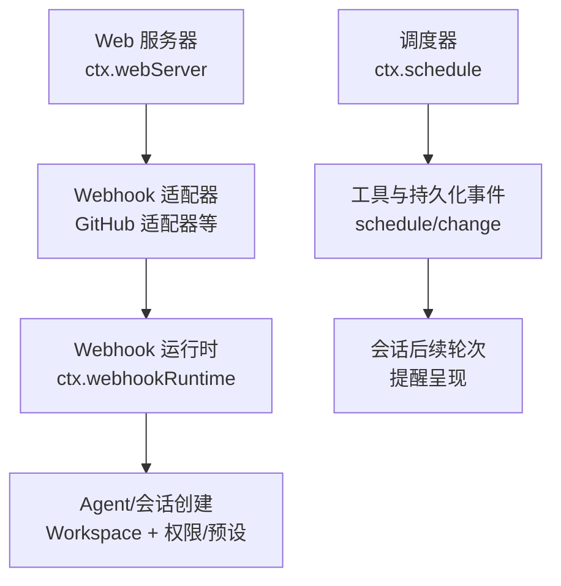
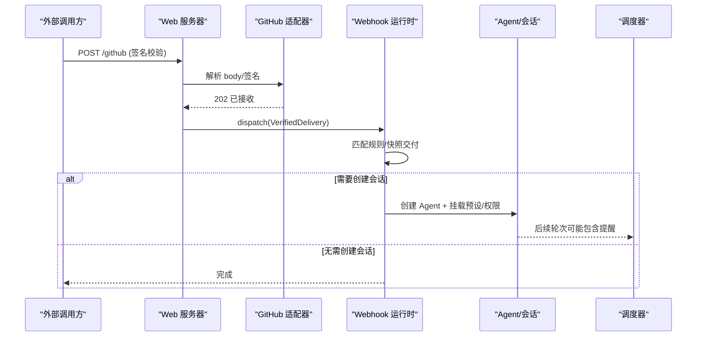
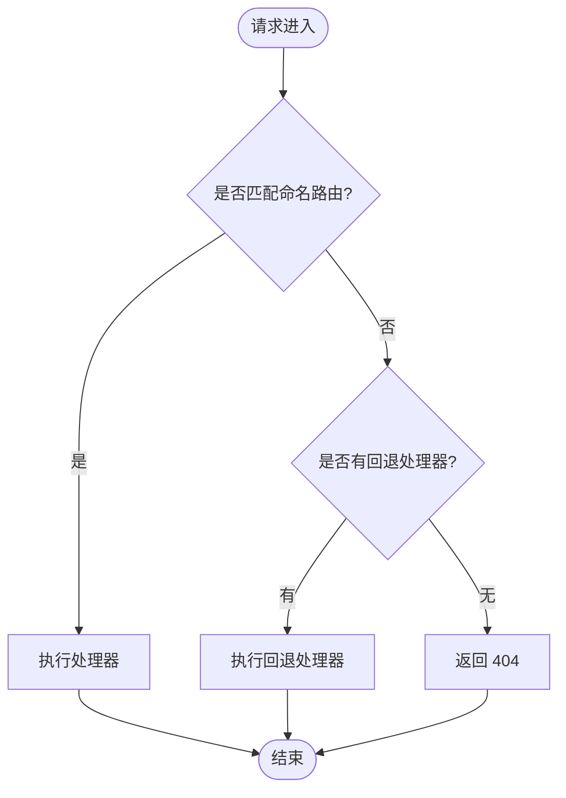
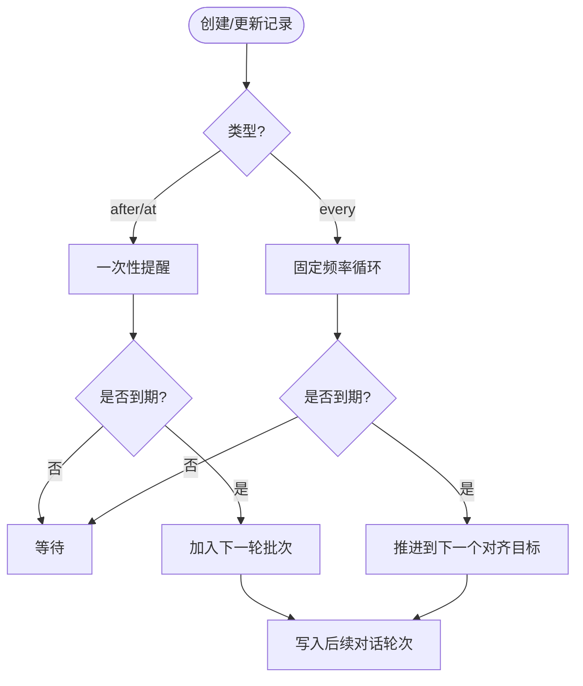
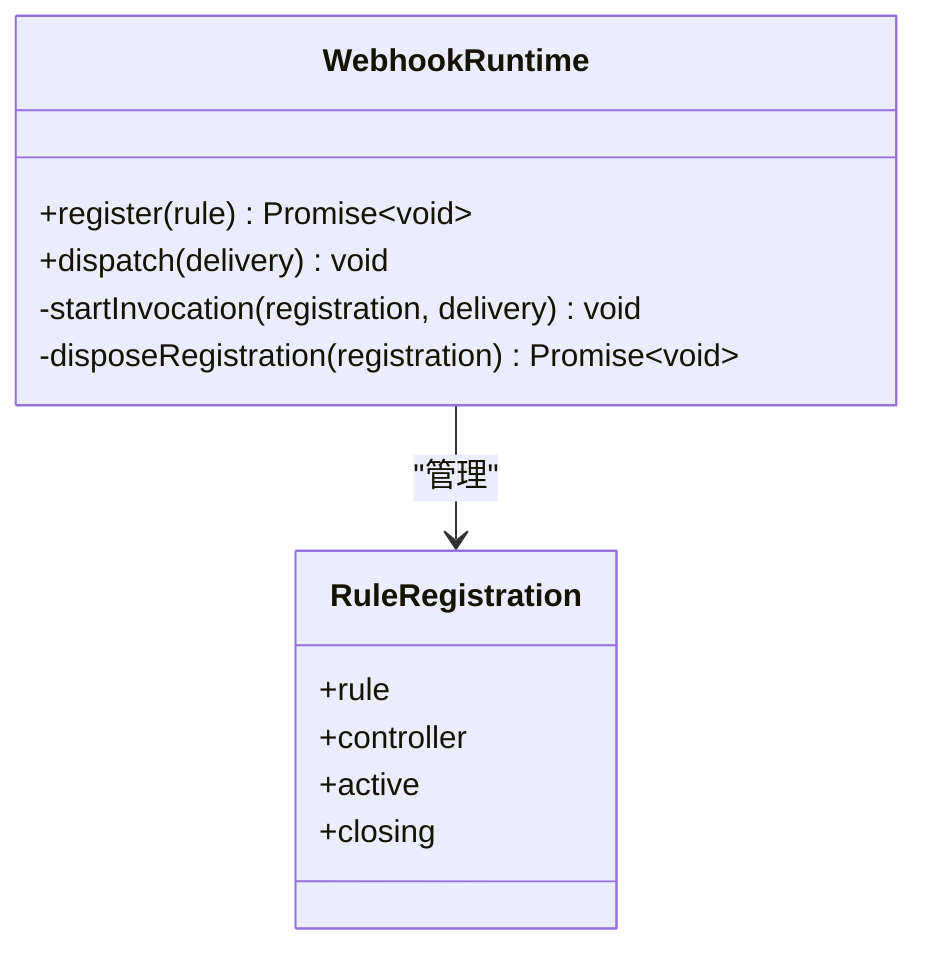
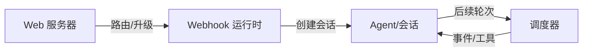

# 扩展插件配置

<cite>
**本文引用的文件**
- [packages/host/webserver/src/index.ts](file://packages/host/webserver/src/index.ts)
- [docs/subsystems/web-server.md](file://docs/subsystems/web-server.md)
- [packages/schedule/schedule/src/index.ts](file://packages/schedule/schedule/src/index.ts)
- [docs/subsystems/schedule.md](file://docs/subsystems/schedule.md)
- [packages/webhook/webhook/src/index.ts](file://packages/webhook/webhook/src/index.ts)
- [docs/subsystems/webhook.md](file://docs/subsystems/webhook.md)
- [apps/cli/config/examples/github-review/cordis.yml](file://apps/cli/config/examples/github-review/cordis.yml)
- [apps/cli/config/examples/schedule/cordis.yml](file://apps/cli/config/examples/schedule/cordis.yml)
- [apps/cli/config/examples/cordis/cordis.yml](file://apps/cli/config/examples/cordis/cordis.yml)
- [docs/config-catalog.md](file://docs/config-catalog.md)
</cite>

## 目录
1. [简介](#简介)
2. [项目结构](#项目结构)
3. [核心组件](#核心组件)
4. [架构总览](#架构总览)
5. [详细组件分析](#详细组件分析)
6. [依赖关系分析](#依赖关系分析)
7. [性能考虑](#性能考虑)
8. [故障排除指南](#故障排除指南)
9. [结论](#结论)
10. [附录：完整配置示例与最佳实践](#附录完整配置示例与最佳实践)

## 简介
本文件面向 DeepSeek Harness 的扩展插件配置，聚焦 Web 服务器、调度器（Schedule）、Webhook 三类扩展插件的配置选项、参数行为与默认值。文档同时说明各插件的 Config 接口定义、可选参数、默认行为、与核心插件的集成方式、配置优先级，以及性能调优与安全设置的最佳实践和常见问题排查方法。

## 项目结构
- Web 服务器（WebServer）提供浏览器 HTTP 承载能力，暴露 ctx.webServer，支持命名路由、升级路由、回退处理器、index.html 注入与压缩等。
- 调度器（Schedule）提供会话内持久化提醒，支持一次性延时、绝对时间触发与固定频率循环，并通过工具与持久化事件驱动后续对话轮次。
- Webhook 运行时（WebhookRuntime）将外部认证交付转换为可选根会话，提供“发后即忘”的规则注册与分发，并负责基于 Workspace 创建 Agent 会话。

图表来源
- [packages/host/webserver/src/index.ts:63-128](file://packages/host/webserver/src/index.ts#L63-L128)
- [packages/webhook/webhook/src/index.ts:58-179](file://packages/webhook/webhook/src/index.ts#L58-L179)
- [packages/schedule/schedule/src/index.ts:43-84](file://packages/schedule/schedule/src/index.ts#L43-L84)

章节来源
- [docs/subsystems/web-server.md:1-54](file://docs/subsystems/web-server.md#L1-L54)
- [docs/subsystems/schedule.md:1-193](file://docs/subsystems/schedule.md#L1-L193)
- [docs/subsystems/webhook.md:1-71](file://docs/subsystems/webhook.md#L1-L71)

## 核心组件
- Web 服务器（WebServer）
  - 作用：监听端口、注册命名/升级路由、管理回退处理器、收集 index 注入行、渲染 index.html、响应压缩。
  - 关键配置：host、port、compression、compressionLevel、compressionThresholdBytes。
  - 默认行为：仅 loopback 或显式全接口；压缩默认关闭；gzip 等级与阈值由 shipped bundle 选择。
- 调度器（Schedule）
  - 作用：在会话内维护持久化的延时/绝对时间/固定频率提醒，通过 schedule/change 事件驱动后续对话轮次。
  - 关键输入：after_seconds、at（RFC3339 或本地日历对象）、every_seconds（≥300s）。
  - 默认行为：冷启动不工作；重开恢复定时器；重复到期合并为单批；最小间隔限制。
- Webhook 运行时（WebhookRuntime）
  - 作用：注册规则、验证并快照交付数据、按 kind 匹配分发、创建 Agent 会话（可返回 null 表示不创建）。
  - 关键特性：无队列/重试/去重；回调需遵守 AbortSignal；失败隔离记录日志。

章节来源
- [docs/config-catalog.md:31-48](file://docs/config-catalog.md#L31-L48)
- [docs/config-catalog.md:320-339](file://docs/config-catalog.md#L320-L339)
- [docs/subsystems/schedule.md:7-193](file://docs/subsystems/schedule.md#L7-L193)
- [docs/subsystems/webhook.md:7-37](file://docs/subsystems/webhook.md#L7-L37)

## 架构总览
Web 服务器作为入口，可由 Webhook 适配器挂载受信任路由；Webhook 运行时接收已认证的交付后，根据规则创建会话。调度器独立于网络层，通过工具与持久化事件驱动会话后续轮次。

图表来源
- [packages/host/webserver/src/index.ts:63-128](file://packages/host/webserver/src/index.ts#L63-L128)
- [packages/webhook/webhook/src/index.ts:58-179](file://packages/webhook/webhook/src/index.ts#L58-L179)
- [packages/schedule/schedule/src/index.ts:43-84](file://packages/schedule/schedule/src/index.ts#L43-L84)

## 详细组件分析

### Web 服务器（WebServer）
- 配置项
  - host：'127.0.0.1' | '0.0.0.0'，默认 loopback。
  - port：number，0 表示系统分配。
  - compression：'none' | 'gzip'，默认 none。
  - compressionLevel：0-9，默认 1。
  - compressionThresholdBytes：未知长度流也参与压缩，默认 1024。
- 行为要点
  - 激活即监听；端口冲突拒绝初始化。
  - 命名路由必须互斥；重复注册抛错。
  - 回退处理器唯一；未命中路由默认 404 直到被占用。
  - 支持 upgrade 路由、index 注入、原始 HTML 变换。
  - 请求异常返回 400 或销毁 socket，不退出进程。
- 安全建议
  - 生产环境避免绑定 0.0.0.0；如需外网访问，配合连接层的 trustedHosts、鉴权与 Origin 检查。
  - 合理设置压缩阈值与等级，避免 CPU 与内存压力。

图表来源
- [docs/subsystems/web-server.md:9-54](file://docs/subsystems/web-server.md#L9-L54)

章节来源
- [docs/subsystems/web-server.md:29-54](file://docs/subsystems/web-server.md#L29-L54)
- [docs/config-catalog.md:31-48](file://docs/config-catalog.md#L31-L48)
- [docs/config-catalog.md:320-339](file://docs/config-catalog.md#L320-L339)

### 调度器（Schedule）
- 数据模型
  - AfterScheduleRecord：延时一次。
  - AtScheduleRecord：绝对时间一次。
  - EveryScheduleRecord：固定频率循环（≥300s），错过时只保留最新目标。
- 输入与约束
  - at 支持 RFC3339 字符串或本地日历对象（含 time_zone）。
  - every_seconds 最小 300 秒；不支持 Cron。
  - 非法偏移/时区/非未来时间/夏令时重叠区间将被拒绝。
- 持久化与回放
  - 通过 schedule/change 事件（create/delete/dispatch）作为权威变更源。
  - 冷启动/忙碌期间错过的 Every 仅推进到下一个对齐目标，不枚举历史。
- 投递边界
  - 仅在原会话存活时投递；投递进入后续普通对话轮次，无独立 Web 回执。
  - 批量合并：同一决策时间的多个 overdue Every 合并为一批。

图表来源
- [docs/subsystems/schedule.md:7-193](file://docs/subsystems/schedule.md#L7-L193)

章节来源
- [docs/subsystems/schedule.md:7-193](file://docs/subsystems/schedule.md#L7-L193)
- [packages/schedule/schedule/src/index.ts:43-84](file://packages/schedule/schedule/src/index.ts#L43-L84)

### Webhook 运行时（WebhookRuntime）
- 规则注册
  - register(rule)：id、kind、run(delivery, signal)；返回可等待的清理函数。
  - 规则在卸载时会中止并排空活跃调用。
- 分发机制
  - dispatch(delivery)：对匹配的 kind 并行启动规则；立即返回，不等待回调完成。
  - 交付数据会被快照并冻结，保证跨规则共享一致性。
- 会话创建
  - 若 run 返回 WebhookSessionRequest，则创建 Agent 会话，挂载预设与权限，附加初始 follow-up。
  - 失败路径会尝试回滚（如 detach Workspace、dispose Agent），但不替换原始错误。
- 安全与健壮性
  - 无队列/重试/去重；重复交付可能产生重复会话。
  - 每个规则的错误被隔离记录，不影响其他规则。

图表来源
- [packages/webhook/webhook/src/index.ts:58-179](file://packages/webhook/webhook/src/index.ts#L58-L179)

章节来源
- [docs/subsystems/webhook.md:7-37](file://docs/subsystems/webhook.md#L7-L37)
- [packages/webhook/webhook/src/index.ts:58-179](file://packages/webhook/webhook/src/index.ts#L58-L179)

## 依赖关系分析
- Web 服务器
  - 被连接层（trustedHosts、Cookie、请求体大小限制）增强安全性。
  - 被前端静态资源插件、HMR、API 网关等组合使用。
- 调度器
  - 依赖 agents、sessions、tools、sessionPersistence；可选 sessionProjections 提供只读视图。
  - 通过工具与事件与 Agent 生命周期耦合。
- Webhook 运行时
  - 依赖 agents、agentDefaultModel、agentPresets、permissionPresets、sessionTitle、workspaceRegistry。
  - 与 Web 服务器解耦，可通过适配器挂载到任意 WebServer。

图表来源
- [packages/host/webserver/src/index.ts:63-128](file://packages/host/webserver/src/index.ts#L63-L128)
- [packages/webhook/webhook/src/index.ts:58-179](file://packages/webhook/webhook/src/index.ts#L58-L179)
- [packages/schedule/schedule/src/index.ts:43-84](file://packages/schedule/schedule/src/index.ts#L43-L84)

章节来源
- [docs/config-catalog.md:320-339](file://docs/config-catalog.md#L320-L339)
- [docs/config-catalog.md:31-48](file://docs/config-catalog.md#L31-L48)

## 性能考虑
- Web 服务器
  - 启用 gzip 时，合理设置 compressionLevel 与 threshold，避免小响应压缩开销。
  - 长连接（SSE/WS）需确保正确释放；服务关闭时强制关闭所有连接。
- 调度器
  - 固定频率最小间隔 300 秒，避免高频计时器。
  - 批量合并减少模型轮次压力；注意会话空闲时机再推进。
- Webhook
  - 规则中异步任务应监听 AbortSignal，及时停止以节省资源。
  - 避免在规则中进行重型同步计算；必要时拆分到后台任务。

[本节为通用指导，不直接分析具体文件]

## 故障排除指南
- Web 服务器
  - 端口占用：启动失败会拒绝初始化；检查端口或改用 0 让系统分配。
  - 路由冲突：重复 (kind, path) 注册抛错；确保命名路由互斥。
  - 请求异常：返回 400 或销毁 socket；检查 URL 编码与客户端行为。
- 调度器
  - 时间/时区无效：拒绝非法偏移、非未来时间、夏令时重叠区间。
  - 未出现提醒：确认会话处于空闲且存在 schedule/change 事件；检查工具调用与持久化屏障。
- Webhook
  - 规则未触发：检查 delivery.kind 与规则 kind 是否一致；确认适配器已挂载到 WebServer。
  - 会话未创建：检查 run 返回值是否为 null；查看权限/代理预设是否有效。
  - 崩溃/重复：无去重与重试；重复交付可能创建重复会话，需在规则中做业务去重。

章节来源
- [docs/subsystems/web-server.md:29-54](file://docs/subsystems/web-server.md#L29-L54)
- [docs/subsystems/schedule.md:67-193](file://docs/subsystems/schedule.md#L67-L193)
- [docs/subsystems/webhook.md:19-37](file://docs/subsystems/webhook.md#L19-L37)

## 结论
Web 服务器、调度器与 Webhook 运行时分别承担网络入口、会话内定时与外部事件驱动的职责。通过清晰的配置接口与严格的默认行为，可在保障安全与性能的前提下灵活组合。推荐在生产环境中严格限制 Web 服务器绑定范围、合理设置压缩与超时，并在 Webhook 规则中实现必要的业务去重与资源控制。

[本节为总结，不直接分析具体文件]

## 附录：完整配置示例与最佳实践

- Web 服务器配置示例（覆盖 Cordis 工具面板）
  - 修改监听地址与端口，插入宿主运行器与工具插件。
  - 参考路径：[apps/cli/config/examples/cordis/cordis.yml](file://apps/cli/config/examples/cordis/cordis.yml)

- GitHub Webhook 示例（隔离 WebServer）
  - 启用 webhook 运行时与规则；在隔离 realm 中挂载第二个 WebServer；配置 GitHub 适配器路径与密钥环境变量。
  - 参考路径：[apps/cli/config/examples/github-review/cordis.yml](file://apps/cli/config/examples/github-review/cordis.yml)

- Schedule 示例（启用 UI 与时间上下文）
  - 插入时间上下文与调度插件，并启用 UI 展示。
  - 参考路径：[apps/cli/config/examples/schedule/cordis.yml](file://apps/cli/config/examples/schedule/cordis.yml)

- 配置优先级与集成方式
  - 通过 cordis.yml 的 insert/patch 组合不同插件；组级 isolate 可将 WebServer 隔离到独立领域。
  - 连接层（trustedHosts、Cookie、请求体上限）叠加在 WebServer 之上，形成安全边界。
  - 调度器通过工具与持久化事件与 Agent 生命周期集成；Webhook 通过适配器挂载到 WebServer 并驱动会话创建。

- 安全设置建议
  - Web 服务器：默认 loopback；如需外网访问，务必声明 trustedHosts 并启用鉴权与 Origin 检查。
  - Webhook：使用环境变量注入密钥；限制最大请求体大小；在规则中校验 payload。
  - 调度器：明确时区与时间格式；避免过短间隔导致频繁唤醒。

- 性能调优建议
  - Web 服务器：按需开启 gzip，调整等级与阈值；避免大体积静态资源阻塞。
  - 调度器：利用批量合并与最小间隔；在空闲阶段推进。
  - Webhook：异步任务遵循 AbortSignal；避免阻塞型 I/O。

章节来源
- [apps/cli/config/examples/cordis/cordis.yml:1-20](file://apps/cli/config/examples/cordis/cordis.yml#L1-L20)
- [apps/cli/config/examples/github-review/cordis.yml:1-36](file://apps/cli/config/examples/github-review/cordis.yml#L1-L36)
- [apps/cli/config/examples/schedule/cordis.yml:1-13](file://apps/cli/config/examples/schedule/cordis.yml#L1-L13)
- [docs/config-catalog.md:320-339](file://docs/config-catalog.md#L320-L339)
- [docs/subsystems/web-server.md:29-54](file://docs/subsystems/web-server.md#L29-L54)
- [docs/subsystems/webhook.md:19-37](file://docs/subsystems/webhook.md#L19-L37)
- [docs/subsystems/schedule.md:92-193](file://docs/subsystems/schedule.md#L92-L193)