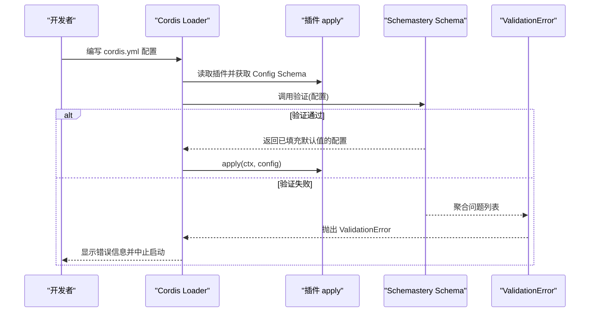
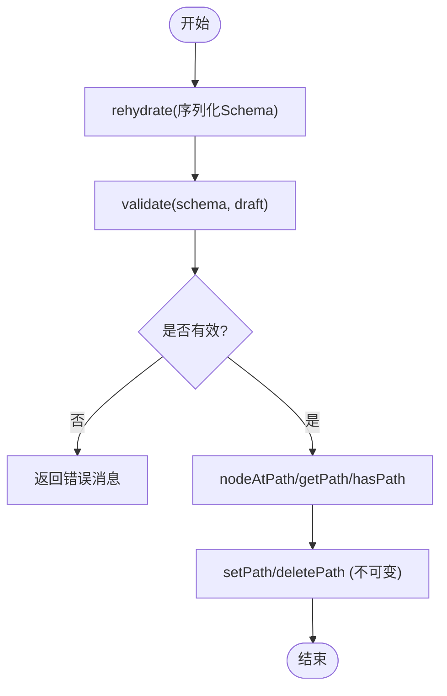
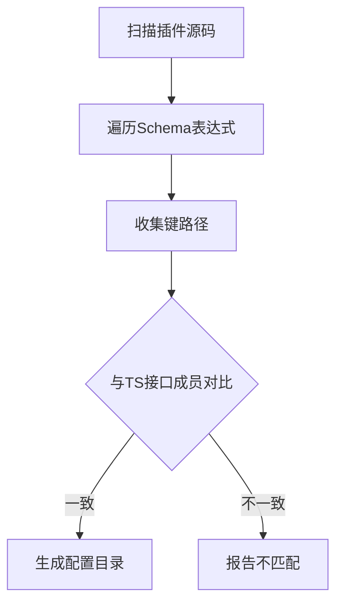
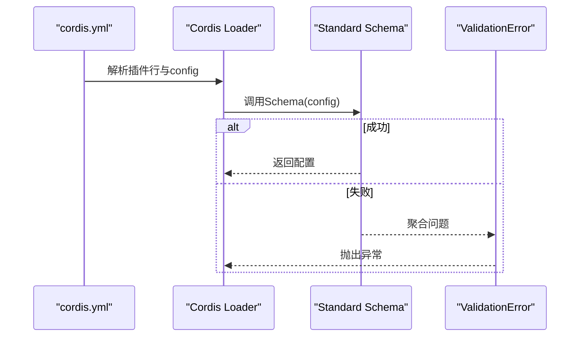
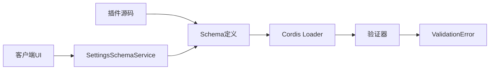

# 插件Schema验证

<cite>
**本文引用的文件**
- [packages/acp/acp/src/index.ts](file://packages/acp/acp/src/index.ts)
- [packages/client/ui-settings/src/client/schema.ts](file://packages/client/ui-settings/src/client/schema.ts)
- [scripts/gen-config-catalog.ts](file://scripts/gen-config-catalog.ts)
- [scripts/verify-cordis-config.ts](file://scripts/verify-cordis-config.ts)
- [docs/cordis-tutorial/05-config.zh.md](file://docs/cordis-tutorial/05-config.zh.md)
- [docs/user/develop/basic/config.zh.md](file://docs/user/develop/basic/config.zh.md)
- [docs/cordis-api/fiber.zh.md](file://docs/cordis-api/fiber.zh.md)
- [apps/cli/config/examples/cordis/cordis.yml](file://apps/cli/config/examples/cordis/cordis.yml)
</cite>

## 目录
1. [简介](#简介)
2. [项目结构](#项目结构)
3. [核心组件](#核心组件)
4. [架构总览](#架构总览)
5. [详细组件分析](#详细组件分析)
6. [依赖关系分析](#依赖关系分析)
7. [性能考虑](#性能考虑)
8. [故障排查指南](#故障排查指南)
9. [结论](#结论)
10. [附录：Schema定义示例与最佳实践](#附录schemadefinition示例与最佳实践)

## 简介
本文件面向DeepSeek Harness插件开发者，系统性说明如何使用Schemastery库为插件配置创建类型安全的Schema定义，并解释Cordis框架在启动时如何执行配置验证、如何报告错误。文档覆盖必填字段、默认值、数据类型校验、联合类型、数组与对象组合等复杂场景，并提供调试技巧与常见错误的解决方法。

## 项目结构
围绕插件配置与Schema验证的相关代码主要分布在以下位置：
- 插件Schema定义与使用：以ACP插件为例，展示如何在插件中导出Config Schema并在apply中使用已验证的配置。
- 客户端设置Schema服务：提供对序列化Schema的再水合、路径访问、不可变修改与同步校验能力。
- 构建期工具：用于扫描插件导出的Schema表达式、提取键路径、生成配置目录，并与TypeScript接口进行一致性检查。
- 运行期验证与错误：Cordis框架在加载插件时调用Standard Schema验证器，失败时抛出ValidationError。
- 配置示例：CLI示例中的cordis.yml展示了如何通过配置文件为插件注入配置。

```mermaid
graph TB
A["插件源码<br/>导出 Config Schema"] --> B["Cordis Loader<br/>读取 cordis.yml"]
B --> C["运行时验证<br/>Standard Schema"]
C --> |通过| D["apply(ctx, config)"]
C --> |失败| E["ValidationError<br/>聚合问题列表"]
F["构建期脚本<br/>gen-config-catalog.ts"] --> G["配置目录生成<br/>与类型一致性检查"]
H["客户端设置服务<br/>SettingsSchemaService"] --> I["UI侧预览/校验<br/>rehydrate + validate"]
```



图表来源
- [packages/acp/acp/src/index.ts:86-90](file://packages/acp/acp/src/index.ts#L86-L90)
- [docs/cordis-tutorial/05-config.zh.md:22-34](file://docs/cordis-tutorial/05-config.zh.md#L22-L34)
- [scripts/gen-config-catalog.ts:437-518](file://scripts/gen-config-catalog.ts#L437-L518)
- [packages/client/ui-settings/src/client/schema.ts:39-67](file://packages/client/ui-settings/src/client/schema.ts#L39-L67)

章节来源
- [packages/acp/acp/src/index.ts:86-90](file://packages/acp/acp/src/index.ts#L86-L90)
- [docs/cordis-tutorial/05-config.zh.md:22-34](file://docs/cordis-tutorial/05-config.zh.md#L22-L34)
- [scripts/gen-config-catalog.ts:437-518](file://scripts/gen-config-catalog.ts#L437-L518)
- [packages/client/ui-settings/src/client/schema.ts:39-67](file://packages/client/ui-settings/src/client/schema.ts#L39-L67)

## 核心组件
- 插件Schema定义（Schemastery）：插件通过导出名为Config的Schema实例，声明配置的字段、类型、默认值与约束。Cordis在加载时调用该Schema验证配置，确保apply接收到的config完整且合法。
- Cordis验证与错误：当配置不符合Schema时，框架抛出ValidationError，包含由Standard Schema产生的问题行集合，便于定位具体字段与原因。
- 客户端设置Schema服务：提供rehydrate将序列化的Schema恢复为可执行节点；validate对草稿值进行同步校验；nodeAtPath/getPath/hasPath/setPath/deletePath支持对嵌套结构的只读遍历与不可变编辑。
- 构建期Schema扫描：gen-config-catalog.ts静态解析插件源码中的Schema表达式，收集所有被验证的键路径，并与TypeScript接口成员对比，防止“类型存在但Schema未验证”的漂移。

章节来源
- [docs/cordis-tutorial/05-config.zh.md:22-34](file://docs/cordis-tutorial/05-config.zh.md#L22-L34)
- [docs/cordis-api/fiber.zh.md:359-375](file://docs/cordis-api/fiber.zh.md#L359-L375)
- [packages/client/ui-settings/src/client/schema.ts:39-67](file://packages/client/ui-settings/src/client/schema.ts#L39-L67)
- [scripts/gen-config-catalog.ts:437-518](file://scripts/gen-config-catalog.ts#L437-L518)

## 架构总览
下图展示了从配置到应用的全链路：Loader读取cordis.yml，按插件行注入配置；Cordis调用插件导出的Schema进行验证；通过后进入apply；若失败则抛出ValidationError。同时，构建期脚本会扫描Schema表达式，生成配置目录并校验与TS接口的一致性。



图表来源
- [docs/cordis-tutorial/05-config.zh.md:22-34](file://docs/cordis-tutorial/05-config.zh.md#L22-L34)
- [docs/cordis-api/fiber.zh.md:359-375](file://docs/cordis-api/fiber.zh.md#L359-L375)
- [apps/cli/config/examples/cordis/cordis.yml:10-13](file://apps/cli/config/examples/cordis/cordis.yml#L10-L13)

## 详细组件分析

### 插件Schema定义与使用（以ACP插件为例）
- 插件导出Config接口与同名Schema实例，描述provider、model、sessionListPageSize等字段，并通过natural().min(1).default(...)设置数值约束与默认值。
- apply(ctx, config)接收的类型安全配置已由Cordis验证过，可直接使用。

```mermaid
classDiagram
class AcpConfig {
+string provider?
+string model?
+number sessionListPageSize?
+Stream stream?
}
class ACPSchema {
+object({ provider, model, sessionListPageSize })
}
ACPSchema --> AcpConfig : "验证并填充默认值"
```

图表来源
- [packages/acp/acp/src/index.ts:74-90](file://packages/acp/acp/src/index.ts#L74-L90)

章节来源
- [packages/acp/acp/src/index.ts:74-90](file://packages/acp/acp/src/index.ts#L74-L90)

### 客户端设置Schema服务（SettingsSchemaService）
- rehydrate：将序列化的Schema节点恢复为可执行的Schema实例，供UI侧使用。
- validate：对草稿值进行同步校验，捕获错误并返回人类可读的消息。
- nodeAtPath/getPath/hasPath：基于schema结构或实际值进行路径导航与存在性判断。
- setPath/deletePath：对嵌套对象/数组进行不可变更新或删除，自动补齐缺失容器。



图表来源
- [packages/client/ui-settings/src/client/schema.ts:39-67](file://packages/client/ui-settings/src/client/schema.ts#L39-L67)
- [packages/client/ui-settings/src/client/schema.ts:75-150](file://packages/client/ui-settings/src/client/schema.ts#L75-L150)

章节来源
- [packages/client/ui-settings/src/client/schema.ts:39-67](file://packages/client/ui-settings/src/client/schema.ts#L39-L67)
- [packages/client/ui-settings/src/client/schema.ts:75-150](file://packages/client/ui-settings/src/client/schema.ts#L75-L150)

### 构建期Schema扫描与目录生成（gen-config-catalog.ts）
- 静态解析插件源码中的Schema表达式，识别object/array/intersect/union等构造，收集所有被验证的键路径。
- 与插件导出的TypeScript接口成员对比，确保“Schema验证的键”与“类型声明的成员”一致，避免目录过时或隐藏字段。
- 支持链式修饰（如.default()），以及跨包组合（intersect引用其他插件的Config）。



图表来源
- [scripts/gen-config-catalog.ts:437-518](file://scripts/gen-config-catalog.ts#L437-L518)
- [scripts/gen-config-catalog.ts:756-767](file://scripts/gen-config-catalog.ts#L756-L767)

章节来源
- [scripts/gen-config-catalog.ts:437-518](file://scripts/gen-config-catalog.ts#L437-L518)
- [scripts/gen-config-catalog.ts:756-767](file://scripts/gen-config-catalog.ts#L756-L767)

### 配置加载与验证流程（Loader与Cordis）
- cordis.yml中的每行代表一个插件条目，可携带config块。
- Cordis在加载时调用插件导出的Schema进行验证，失败时抛出ValidationError，包含每个问题的描述行。
- verify-cordis-config脚本用于校验Loader元数据与插件包解析的正确性。



图表来源
- [apps/cli/config/examples/cordis/cordis.yml:10-13](file://apps/cli/config/examples/cordis/cordis.yml#L10-L13)
- [docs/cordis-api/fiber.zh.md:359-375](file://docs/cordis-api/fiber.zh.md#L359-L375)
- [scripts/verify-cordis-config.ts:60-88](file://scripts/verify-cordis-config.ts#L60-L88)

章节来源
- [apps/cli/config/examples/cordis/cordis.yml:10-13](file://apps/cli/config/examples/cordis/cordis.yml#L10-L13)
- [docs/cordis-api/fiber.zh.md:359-375](file://docs/cordis-api/fiber.zh.md#L359-L375)
- [scripts/verify-cordis-config.ts:60-88](file://scripts/verify-cordis-config.ts#L60-L88)

## 依赖关系分析
- 插件与Schema：插件通过导出Config Schema暴露配置契约；Cordis在加载阶段依赖该Schema进行验证。
- 客户端与服务端：客户端通过SettingsSchemaService复用同一Schema语义进行预览与校验，保证前后端一致的验证规则。
- 构建期与运行期：构建期脚本确保Schema与类型一致；运行期Loader负责实际验证与错误上报。



图表来源
- [packages/acp/acp/src/index.ts:86-90](file://packages/acp/acp/src/index.ts#L86-L90)
- [packages/client/ui-settings/src/client/schema.ts:39-67](file://packages/client/ui-settings/src/client/schema.ts#L39-L67)
- [docs/cordis-api/fiber.zh.md:359-375](file://docs/cordis-api/fiber.zh.md#L359-L375)

章节来源
- [packages/acp/acp/src/index.ts:86-90](file://packages/acp/acp/src/index.ts#L86-L90)
- [packages/client/ui-settings/src/client/schema.ts:39-67](file://packages/client/ui-settings/src/client/schema.ts#L39-L67)
- [docs/cordis-api/fiber.zh.md:359-375](file://docs/cordis-api/fiber.zh.md#L359-L375)

## 性能考虑
- 构建期静态扫描：gen-config-catalog.ts仅对源码进行语法树遍历，复杂度与插件数量及Schema规模线性相关，适合CI集成。
- 运行期验证：Standard Schema验证通常在启动阶段执行一次，开销取决于配置大小与嵌套深度；合理拆分Schema与减少深层嵌套有助于缩短启动时间。
- 客户端预览：SettingsSchemaService.validate为同步操作，适用于UI草稿校验；应避免在高频渲染路径中进行重型计算。

[本节为通用指导，无需特定文件来源]

## 故障排查指南
- 常见错误类型
  - 类型不匹配：例如期望数组却传入字符串，会在ValidationError中给出路径与期望/实际类型。
  - 缺少必填字段：未提供required字段或未提供无默认值的字段，导致验证失败。
  - 超出范围：数字不在允许范围（如natural().min(1)）、枚举值不在联合类型内。
- 定位方法
  - 查看ValidationError聚合的问题行，逐条修复对应字段。
  - 使用客户端SettingsSchemaService.nodeAtPath与getPath定位具体路径，结合validate快速反馈。
  - 通过构建期脚本输出确认Schema验证的键是否与TS接口一致，避免“类型存在但未被Schema验证”的情况。
- 典型修复步骤
  - 为可选字段添加default，或在配置中显式提供。
  - 修正字段类型（如将字符串改为数组）。
  - 调整联合类型或数值范围以符合业务约束。

章节来源
- [docs/cordis-api/fiber.zh.md:359-375](file://docs/cordis-api/fiber.zh.md#L359-L375)
- [packages/client/ui-settings/src/client/schema.ts:39-67](file://packages/client/ui-settings/src/client/schema.ts#L39-L67)
- [scripts/gen-config-catalog.ts:756-767](file://scripts/gen-config-catalog.ts#L756-L767)

## 结论
通过Schemastery与Cordis的组合，插件配置实现了类型安全与强约束的验证机制。构建期脚本保障Schema与类型一致，运行期Loader确保配置在进入插件前完全合法。配合客户端设置服务，可在UI层提前发现并提示配置错误，显著提升开发体验与部署稳定性。

[本节为总结性内容，无需特定文件来源]

## 附录：Schema定义示例与最佳实践
- 基础类型与默认值
  - 字符串、数字、布尔值均可通过Schema.string()/number()/boolean()定义，并使用.default()提供默认值。
  - 参考：教程中的greeting与targets示例。
- 必填字段
  - 对于必须提供的字段，可通过.required()或确保无默认值的方式强制要求配置。
  - 参考：用户开发指南中的apiKey与timeout示例。
- 联合类型
  - 使用Schema.union(['fast','accurate'])限制取值范围，并结合.default()指定默认策略。
  - 参考：用户开发指南中的mode示例。
- 数组与对象
  - 使用Schema.array(T)与Schema.object({...})组合复杂结构；数组元素可为基本类型或对象。
  - 参考：教程中的targets数组与对象嵌套示例。
- 数值约束
  - 使用.natural().min(1)等链式约束确保正整数与最小值；适用于分页大小、超时阈值等。
  - 参考：ACP插件中的sessionListPageSize示例。
- 调试技巧
  - 在客户端使用SettingsSchemaService.rehydrate与validate对草稿进行即时校验。
  - 利用nodeAtPath与getPath定位具体路径，结合hasPath判断字段是否存在。
  - 使用setPath/deletePath进行不可变编辑，避免副作用。
- 常见错误与解决
  - 类型不匹配：检查字段类型与Schema定义是否一致。
  - 缺少必填字段：为字段添加default或确保配置中提供。
  - 超出范围：调整数值范围或联合类型取值。
  - 类型与Schema不一致：运行构建期脚本，根据报告修复差异。

章节来源
- [docs/cordis-tutorial/05-config.zh.md:22-34](file://docs/cordis-tutorial/05-config.zh.md#L22-L34)
- [docs/user/develop/basic/config.zh.md:23-25](file://docs/user/develop/basic/config.zh.md#L23-L25)
- [docs/user/develop/basic/config.zh.md:63-66](file://docs/user/develop/basic/config.zh.md#L63-L66)
- [packages/acp/acp/src/index.ts:86-90](file://packages/acp/acp/src/index.ts#L86-L90)
- [packages/client/ui-settings/src/client/schema.ts:39-67](file://packages/client/ui-settings/src/client/schema.ts#L39-L67)
- [packages/client/ui-settings/src/client/schema.ts:75-150](file://packages/client/ui-settings/src/client/schema.ts#L75-L150)