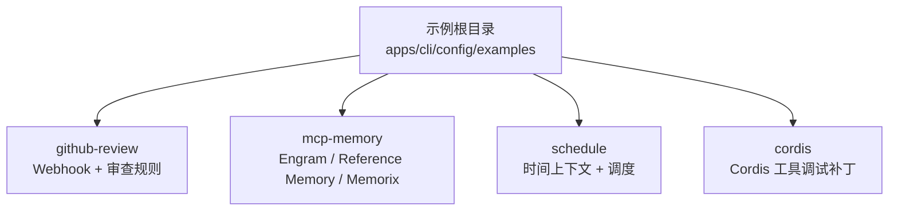
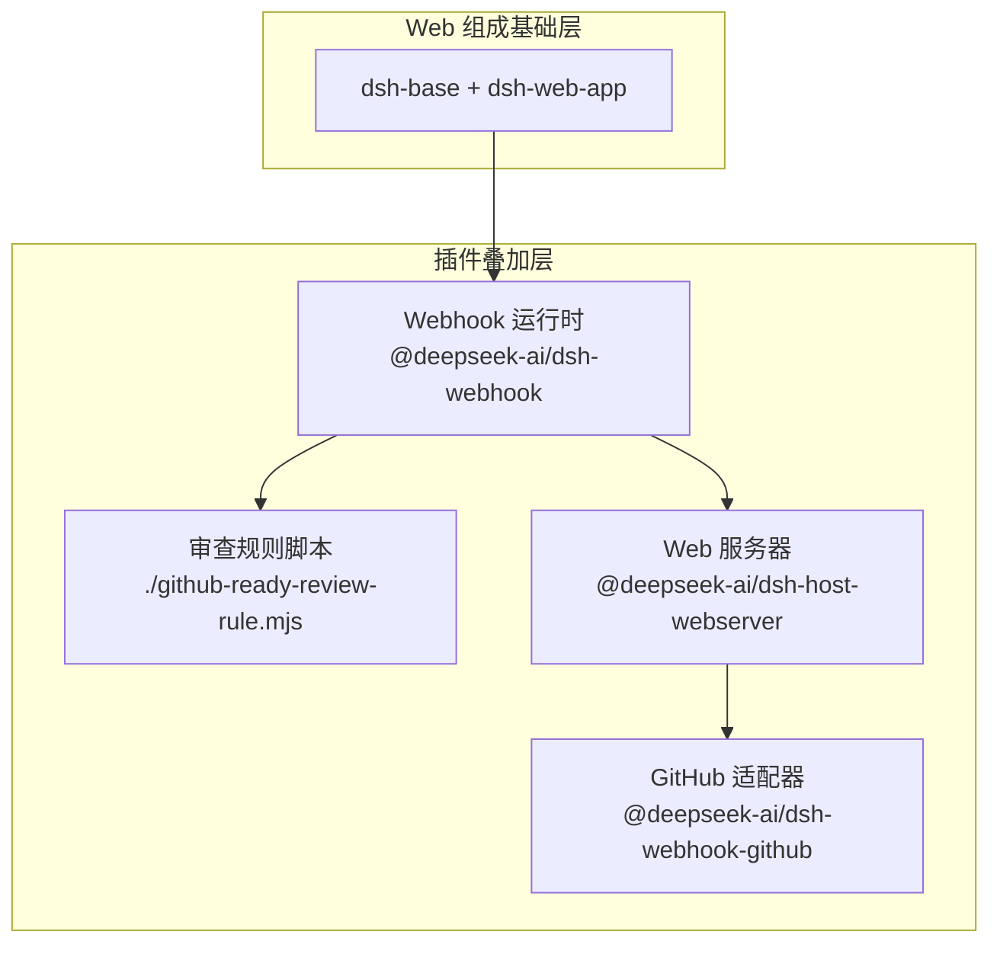
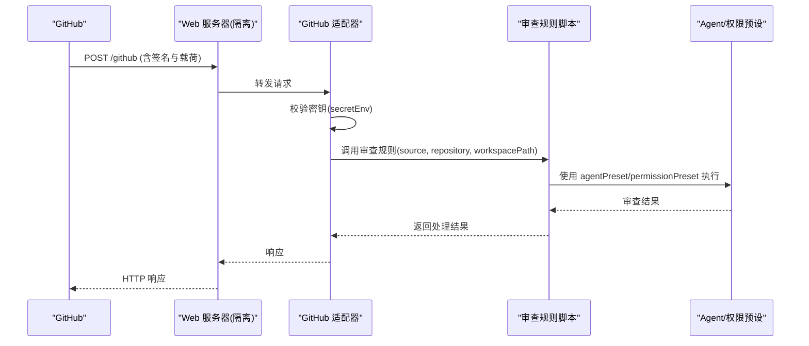
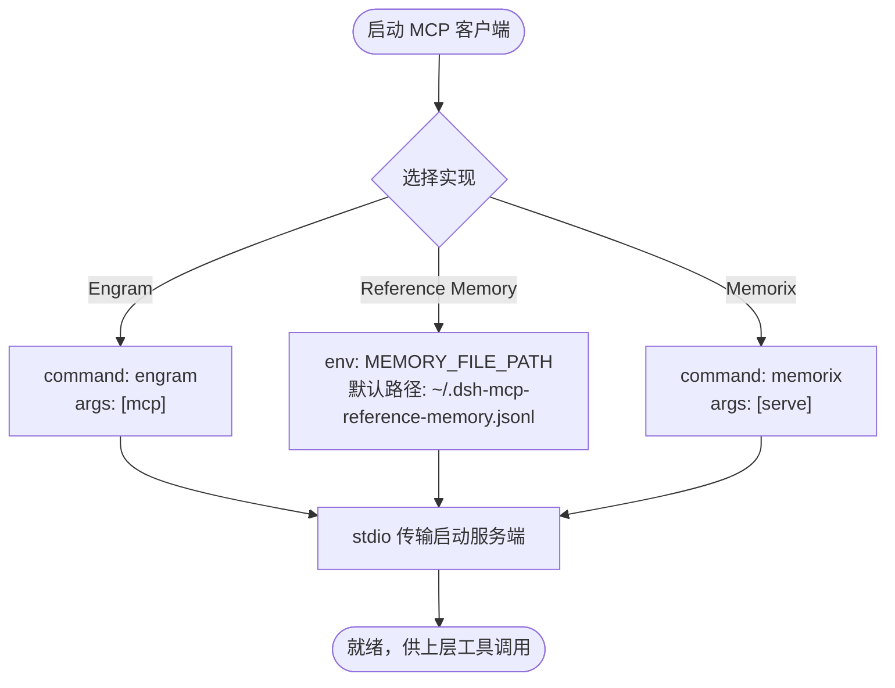
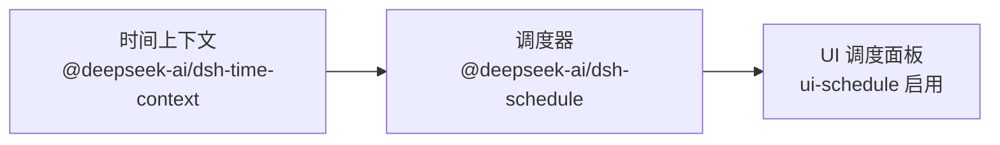
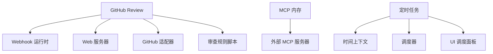

# 插件配置示例

<cite>
**本文引用的文件**
- [apps/cli/config/examples/github-review/cordis.yml](file://apps/cli/config/examples/github-review/cordis.yml)
- [apps/cli/config/examples/mcp-memory/engram.cordis.yml](file://apps/cli/config/examples/mcp-memory/engram.cordis.yml)
- [apps/cli/config/examples/mcp-memory/mcp-reference-memory.cordis.yml](file://apps/cli/config/examples/mcp-memory/mcp-reference-memory.cordis.yml)
- [apps/cli/config/examples/mcp-memory/memorix.cordis.yml](file://apps/cli/config/examples/mcp-memory/memorix.cordis.yml)
- [apps/cli/config/examples/schedule/cordis.yml](file://apps/cli/config/examples/schedule/cordis.yml)
- [apps/cli/config/examples/cordis/cordis.yml](file://apps/cli/config/examples/cordis/cordis.yml)
</cite>

## 目录
1. [简介](#简介)
2. [项目结构](#项目结构)
3. [核心组件](#核心组件)
4. [架构总览](#架构总览)
5. [详细组件分析](#详细组件分析)
6. [依赖关系分析](#依赖关系分析)
7. [性能考虑](#性能考虑)
8. [故障排查指南](#故障排查指南)
9. [结论](#结论)
10. [附录](#附录)

## 简介
本文件面向生产环境，提供 DeepSeek Harness（DSH）插件配置的实用示例与最佳实践。围绕 GitHub Review、MCP 内存、定时任务等常见场景，给出可落地的配置模板与环境差异建议；同时演示配置继承、覆盖与组合方式，环境变量注入、敏感信息管理以及配置版本控制与团队协作规范。所有示例均基于仓库内提供的示例配置文件进行说明，便于直接复用与扩展。

## 项目结构
示例配置集中在 CLI 的示例目录中，按功能场景分目录组织：
- github-review：GitHub Webhook 接入与审查规则
- mcp-memory：多种 MCP 内存服务（Engram、Reference Memory、Memorix）
- schedule：启用时间上下文与调度能力
- cordis：用于调试 Cordis 工具的 Web 组成补丁

**图示来源**
- [apps/cli/config/examples/github-review/cordis.yml:1-36](file://apps/cli/config/examples/github-review/cordis.yml#L1-L36)
- [apps/cli/config/examples/mcp-memory/engram.cordis.yml:1-12](file://apps/cli/config/examples/mcp-memory/engram.cordis.yml#L1-L12)
- [apps/cli/config/examples/mcp-memory/mcp-reference-memory.cordis.yml:1-14](file://apps/cli/config/examples/mcp-memory/mcp-reference-memory.cordis.yml#L1-L14)
- [apps/cli/config/examples/mcp-memory/memorix.cordis.yml:1-12](file://apps/cli/config/examples/mcp-memory/memorix.cordis.yml#L1-L12)
- [apps/cli/config/examples/schedule/cordis.yml:1-13](file://apps/cli/config/examples/schedule/cordis.yml#L1-L13)
- [apps/cli/config/examples/cordis/cordis.yml:1-20](file://apps/cli/config/examples/cordis/cordis.yml#L1-L20)

**章节来源**
- [apps/cli/config/examples/github-review/cordis.yml:1-36](file://apps/cli/config/examples/github-review/cordis.yml#L1-L36)
- [apps/cli/config/examples/mcp-memory/engram.cordis.yml:1-12](file://apps/cli/config/examples/mcp-memory/engram.cordis.yml#L1-L12)
- [apps/cli/config/examples/mcp-memory/mcp-reference-memory.cordis.yml:1-14](file://apps/cli/config/examples/mcp-memory/mcp-reference-memory.cordis.yml#L1-L14)
- [apps/cli/config/examples/mcp-memory/memorix.cordis.yml:1-12](file://apps/cli/config/examples/mcp-memory/memorix.cordis.yml#L1-L12)
- [apps/cli/config/examples/schedule/cordis.yml:1-13](file://apps/cli/config/examples/schedule/cordis.yml#L1-L13)
- [apps/cli/config/examples/cordis/cordis.yml:1-20](file://apps/cli/config/examples/cordis/cordis.yml#L1-L20)

## 核心组件
- GitHub Review 插件
  - 通过 Webhook 接收事件，隔离运行 Web 服务器，避免暴露 UI API
  - 使用审查规则脚本与 Agent/权限预设驱动自动化审查
- MCP 内存插件
  - 以 stdio 方式启动外部 MCP 服务器，支持不同实现（Engram、Reference Memory、Memorix）
  - 通过环境变量或内置路径管理持久化存储位置
- 定时任务插件
  - 启用时间上下文与调度能力，观察并执行已发布的任务根节点
- Cordis 调试补丁
  - 为 Web 组成打补丁，注入 Cordis 宿主与工具，便于自引用工具调试

**章节来源**
- [apps/cli/config/examples/github-review/cordis.yml:1-36](file://apps/cli/config/examples/github-review/cordis.yml#L1-L36)
- [apps/cli/config/examples/mcp-memory/engram.cordis.yml:1-12](file://apps/cli/config/examples/mcp-memory/engram.cordis.yml#L1-L12)
- [apps/cli/config/examples/mcp-memory/mcp-reference-memory.cordis.yml:1-14](file://apps/cli/config/examples/mcp-memory/mcp-reference-memory.cordis.yml#L1-L14)
- [apps/cli/config/examples/mcp-memory/memorix.cordis.yml:1-12](file://apps/cli/config/examples/mcp-memory/memorix.cordis.yml#L1-L12)
- [apps/cli/config/examples/schedule/cordis.yml:1-13](file://apps/cli/config/examples/schedule/cordis.yml#L1-L13)
- [apps/cli/config/examples/cordis/cordis.yml:1-20](file://apps/cli/config/examples/cordis/cordis.yml#L1-L20)

## 架构总览
下图展示 GitHub Review 在 Web 组成上的叠加方式：新增 Webhook 运行时、审查规则、隔离的 Web 服务器与适配器，形成独立的安全域。

**图示来源**
- [apps/cli/config/examples/github-review/cordis.yml:1-36](file://apps/cli/config/examples/github-review/cordis.yml#L1-L36)

**章节来源**
- [apps/cli/config/examples/github-review/cordis.yml:1-36](file://apps/cli/config/examples/github-review/cordis.yml#L1-L36)

## 详细组件分析

### GitHub Review 插件配置
- 作用
  - 在已打包的 Web 组成之上插入 Webhook 运行时与审查规则
  - 将 Web 服务器置于隔离域，仅暴露最小接口
- 关键要点
  - 审查规则通过本地脚本加载，支持仓库与工作区路径配置
  - Web 服务器监听本地地址与端口，可通过环境变量覆盖
  - GitHub 适配器指定来源、路径与密钥环境变量，限制请求体大小
- 环境变量
  - DSH_GITHUB_REVIEW_WORKSPACE：工作区路径，未设置时回退到当前进程工作目录
  - DSH_GITHUB_WEBHOOK_PORT：Webhook 服务端口，默认值由配置决定
  - DSH_GITHUB_WEBHOOK_SECRET：Webhook 校验密钥，来自环境变量
- 安全建议
  - 仅绑定本地回环地址
  - 使用强随机密钥并通过环境变量注入
  - 限制最大请求体大小，防止过大负载

**图示来源**
- [apps/cli/config/examples/github-review/cordis.yml:1-36](file://apps/cli/config/examples/github-review/cordis.yml#L1-L36)

**章节来源**
- [apps/cli/config/examples/github-review/cordis.yml:1-36](file://apps/cli/config/examples/github-review/cordis.yml#L1-L36)

### MCP 内存插件配置
- 作用
  - 通过 @deepseek-ai/dsh-mcp-client 以 stdio 方式启动外部 MCP 服务器
  - 支持多种实现：Engram、Reference Memory、Memorix
- 关键要点
  - Engram：指定命令与参数，cwd 指向当前工作目录
  - Reference Memory：通过环境变量 MEMORY_FILE_PATH 指定持久化文件路径，默认位于用户主目录下的 .dsh-mcp-reference-memory.jsonl
  - Memorix：以 serve 子命令启动
- 环境变量
  - MEMORY_FILE_PATH：Reference Memory 的数据文件路径，未设置时使用默认路径
- 运维建议
  - 确保目标可执行文件已安装且可在 PATH 中找到
  - 对 Reference Memory 数据文件做好备份与权限控制

**图示来源**
- [apps/cli/config/examples/mcp-memory/engram.cordis.yml:1-12](file://apps/cli/config/examples/mcp-memory/engram.cordis.yml#L1-L12)
- [apps/cli/config/examples/mcp-memory/mcp-reference-memory.cordis.yml:1-14](file://apps/cli/config/examples/mcp-memory/mcp-reference-memory.cordis.yml#L1-L14)
- [apps/cli/config/examples/mcp-memory/memorix.cordis.yml:1-12](file://apps/cli/config/examples/mcp-memory/memorix.cordis.yml#L1-L12)

**章节来源**
- [apps/cli/config/examples/mcp-memory/engram.cordis.yml:1-12](file://apps/cli/config/examples/mcp-memory/engram.cordis.yml#L1-L12)
- [apps/cli/config/examples/mcp-memory/mcp-reference-memory.cordis.yml:1-14](file://apps/cli/config/examples/mcp-memory/mcp-reference-memory.cordis.yml#L1-L14)
- [apps/cli/config/examples/mcp-memory/memorix.cordis.yml:1-12](file://apps/cli/config/examples/mcp-memory/memorix.cordis.yml#L1-L12)

### 定时任务插件配置
- 作用
  - 启用时间上下文与调度能力，使系统能够观察并执行已发布的任务根节点
- 关键要点
  - 注入时间上下文模块与调度模块
  - 显式启用 UI 中的调度视图（disabled: false）
- 适用场景
  - 周期性巡检、报告生成、数据同步等后台任务

**图示来源**
- [apps/cli/config/examples/schedule/cordis.yml:1-13](file://apps/cli/config/examples/schedule/cordis.yml#L1-L13)

**章节来源**
- [apps/cli/config/examples/schedule/cordis.yml:1-13](file://apps/cli/config/examples/schedule/cordis.yml#L1-L13)

### Cordis 调试补丁
- 作用
  - 为 Web 组成注入 Cordis 宿主与工具，便于调试自引用工具
- 注意事项
  - 该补丁相当于“类 shell 访问”，不应作为安全边界
  - 通过补丁覆盖默认端口，避免与默认服务冲突

**章节来源**
- [apps/cli/config/examples/cordis/cordis.yml:1-20](file://apps/cli/config/examples/cordis/cordis.yml#L1-L20)

## 依赖关系分析
- 组件耦合
  - GitHub Review 依赖 Webhook 运行时、Web 服务器与 GitHub 适配器，并通过审查规则与 Agent/权限预设交互
  - MCP 内存依赖外部可执行文件与 stdio 传输协议
  - 定时任务依赖时间上下文与调度模块，并与 UI 联动
- 外部依赖
  - 环境变量：DSH_GITHUB_*、MEMORY_FILE_PATH
  - 文件系统：Reference Memory 的数据文件
  - 可执行文件：engram、mcp-server-memory、memorix

**图示来源**
- [apps/cli/config/examples/github-review/cordis.yml:1-36](file://apps/cli/config/examples/github-review/cordis.yml#L1-L36)
- [apps/cli/config/examples/mcp-memory/engram.cordis.yml:1-12](file://apps/cli/config/examples/mcp-memory/engram.cordis.yml#L1-L12)
- [apps/cli/config/examples/mcp-memory/mcp-reference-memory.cordis.yml:1-14](file://apps/cli/config/examples/mcp-memory/mcp-reference-memory.cordis.yml#L1-L14)
- [apps/cli/config/examples/mcp-memory/memorix.cordis.yml:1-12](file://apps/cli/config/examples/mcp-memory/memorix.cordis.yml#L1-L12)
- [apps/cli/config/examples/schedule/cordis.yml:1-13](file://apps/cli/config/examples/schedule/cordis.yml#L1-L13)

**章节来源**
- [apps/cli/config/examples/github-review/cordis.yml:1-36](file://apps/cli/config/examples/github-review/cordis.yml#L1-L36)
- [apps/cli/config/examples/mcp-memory/engram.cordis.yml:1-12](file://apps/cli/config/examples/mcp-memory/engram.cordis.yml#L1-L12)
- [apps/cli/config/examples/mcp-memory/mcp-reference-memory.cordis.yml:1-14](file://apps/cli/config/examples/mcp-memory/mcp-reference-memory.cordis.yml#L1-L14)
- [apps/cli/config/examples/mcp-memory/memorix.cordis.yml:1-12](file://apps/cli/config/examples/mcp-memory/memorix.cordis.yml#L1-L12)
- [apps/cli/config/examples/schedule/cordis.yml:1-13](file://apps/cli/config/examples/schedule/cordis.yml#L1-L13)

## 性能考虑
- GitHub Review
  - 限制请求体大小，避免大负载影响吞吐
  - 隔离 Web 服务器减少资源竞争
- MCP 内存
  - 合理设置数据文件路径，避免频繁 I/O 热点
  - 对 Reference Memory 文件进行定期归档与压缩
- 定时任务
  - 合理设置调度频率，避免并发过高导致资源争用
  - 结合时间上下文进行窗口化执行，降低峰值压力

[本节为通用指导，不直接分析具体文件]

## 故障排查指南
- GitHub Review
  - 检查 DSH_GITHUB_WEBHOOK_SECRET 是否一致，确认签名校验失败原因
  - 验证 DSH_GITHUB_WEBHOOK_PORT 未被占用，必要时调整端口
  - 确认 DSH_GITHUB_REVIEW_WORKSPACE 指向有效的工作区
- MCP 内存
  - 确认外部可执行文件已安装且在 PATH 中
  - 检查 MEMORY_FILE_PATH 指向的路径是否存在并可写
  - 若 Reference Memory 文件损坏，尝试恢复备份
- 定时任务
  - 确认时间上下文与调度模块已正确注入
  - 查看 UI 调度面板是否启用，任务是否发布成功

**章节来源**
- [apps/cli/config/examples/github-review/cordis.yml:1-36](file://apps/cli/config/examples/github-review/cordis.yml#L1-L36)
- [apps/cli/config/examples/mcp-memory/mcp-reference-memory.cordis.yml:1-14](file://apps/cli/config/examples/mcp-memory/mcp-reference-memory.cordis.yml#L1-L14)
- [apps/cli/config/examples/schedule/cordis.yml:1-13](file://apps/cli/config/examples/schedule/cordis.yml#L1-L13)

## 结论
通过上述示例与最佳实践，可以在生产环境中稳定地启用 GitHub Review、MCP 内存与定时任务等插件能力。建议遵循以下原则：
- 使用环境变量注入敏感信息，避免硬编码
- 通过补丁与 insert 组合实现配置继承与覆盖
- 对不同环境（开发、测试、生产）采用差异化配置与最小权限策略
- 对配置文件进行版本控制与变更评审，确保可追溯与可回滚

[本节为总结性内容，不直接分析具体文件]

## 附录

### 多环境配置差异建议
- 开发
  - 使用较低的资源限制与更宽松的日志级别
  - 允许更高的并发与更大的请求体上限
- 测试
  - 固定端口与密钥，便于集成测试
  - 使用临时数据目录，测试后清理
- 生产
  - 绑定本地回环地址或使用反向代理
  - 严格的最小权限与资源配额
  - 启用审计与告警

[本节为通用指导，不直接分析具体文件]

### 配置继承、覆盖与组合最佳实践
- 使用补丁（id 匹配）覆盖已有组件的配置（如端口、主机）
- 使用 insert 追加新组件（如 Webhook 运行时、MCP 客户端）
- 通过 group 与 isolate 将相关组件分组并隔离运行域
- 将公共配置抽离为基线，按环境叠加差异

**章节来源**
- [apps/cli/config/examples/cordis/cordis.yml:1-20](file://apps/cli/config/examples/cordis/cordis.yml#L1-L20)
- [apps/cli/config/examples/github-review/cordis.yml:1-36](file://apps/cli/config/examples/github-review/cordis.yml#L1-L36)

### 环境变量注入与敏感信息管理
- 使用 !!js 表达式读取环境变量并提供默认值
- 敏感信息（如密钥）仅通过环境变量注入，不在配置中明文出现
- 对关键变量进行格式校验与范围限制（如端口号、字节数）

**章节来源**
- [apps/cli/config/examples/github-review/cordis.yml:1-36](file://apps/cli/config/examples/github-review/cordis.yml#L1-L36)
- [apps/cli/config/examples/mcp-memory/mcp-reference-memory.cordis.yml:1-14](file://apps/cli/config/examples/mcp-memory/mcp-reference-memory.cordis.yml#L1-L14)

### 配置文件的版本控制与团队协作
- 将示例配置纳入版本库，使用分支与 PR 进行变更评审
- 为每个环境维护独立的配置片段，合并时避免冲突
- 在提交信息中注明变更原因与影响范围，便于回溯

[本节为通用指导，不直接分析具体文件]