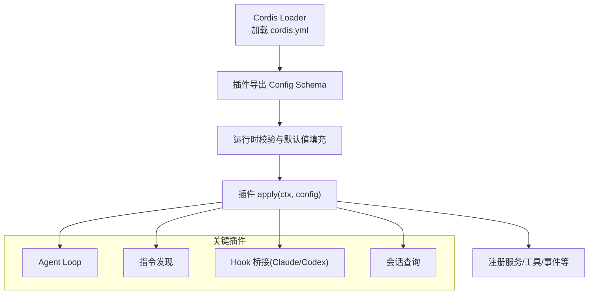
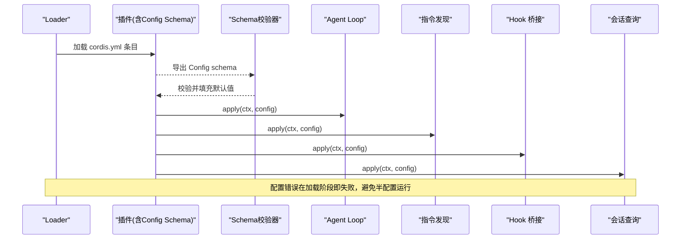
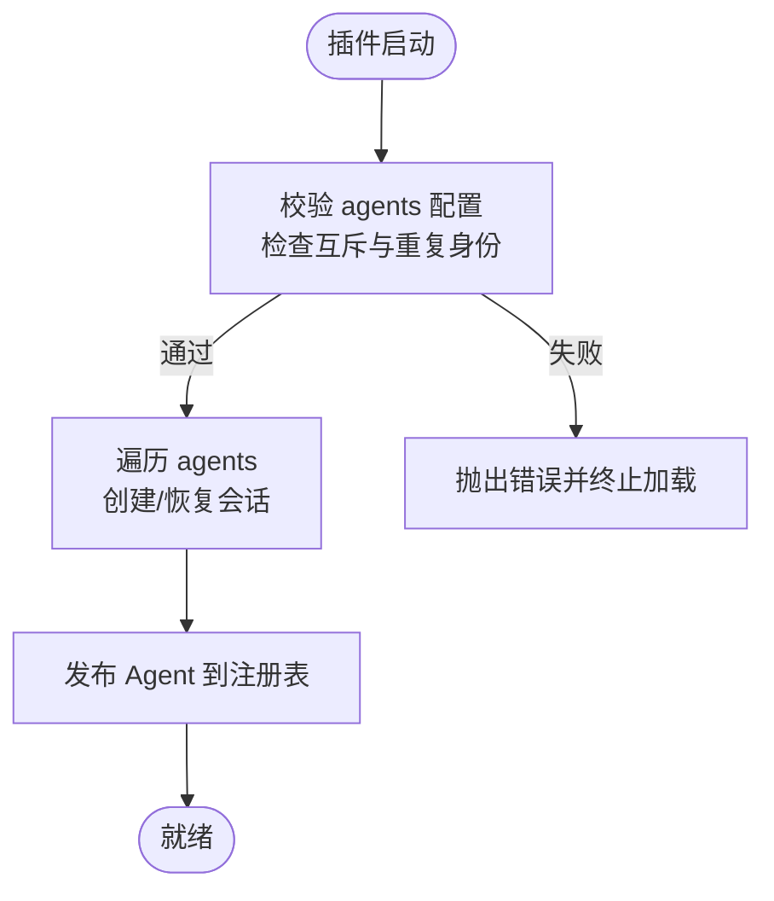
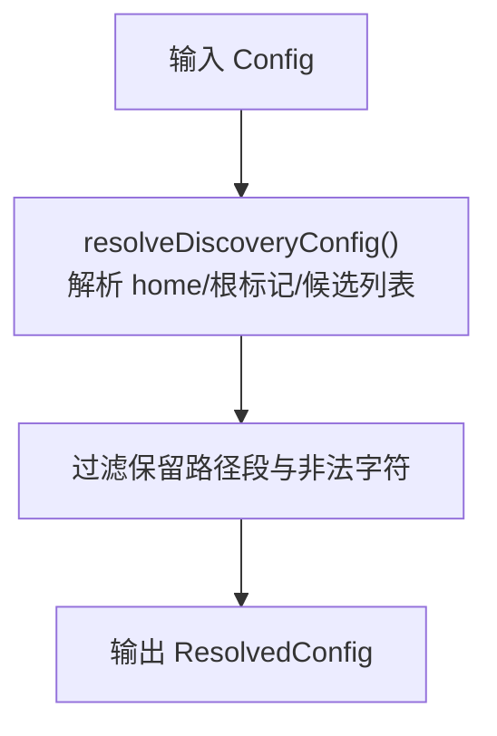
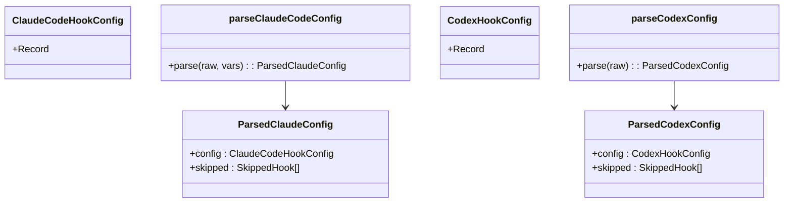
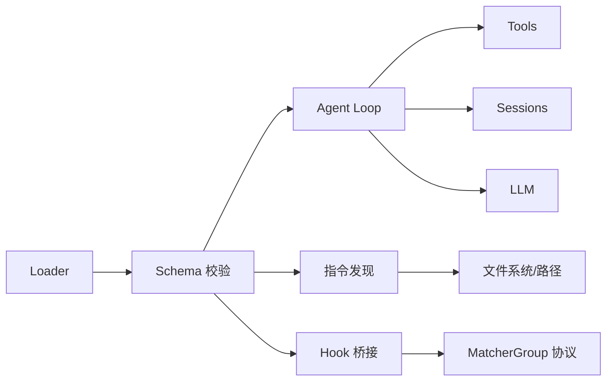

# 插件配置管理

<cite>
**本文引用的文件**
- [05-config.md](file://docs/cordis-tutorial/05-config.md)
- [config.zh.md](file://docs/user/develop/basic/config.zh.md)
- [agent-loop/index.ts](file://packages/core/agent-loop/src/index.ts)
- [agent-instructions/config.ts](file://packages/context/agent-instructions/src/config.ts)
- [hooks-claude-code/config.ts](file://packages/hooks/hooks-claude-code/src/config.ts)
- [hooks-codex/config.ts](file://packages/hooks/hooks-codex/src/config.ts)
- [session-query/config.ts](file://packages/session-query/session-query/src/config.ts)
- [cordis-yaml.ts](file://scripts/cordis-yaml.ts)
- [verify-config-source-ownership.ts](file://scripts/verify-config-source-ownership.ts)
- [hmr-config.spec.ts](file://packages/boot/app-boot/tests/hmr-config.spec.ts)
- [user-patches.spec.ts](file://packages/boot/app-boot/tests/user-patches.spec.ts)
</cite>

## 目录
1. [简介](#简介)
2. [项目结构](#项目结构)
3. [核心组件](#核心组件)
4. [架构总览](#架构总览)
5. [详细组件分析](#详细组件分析)
6. [依赖关系分析](#依赖关系分析)
7. [性能考虑](#性能考虑)
8. [故障排查指南](#故障排查指南)
9. [结论](#结论)
10. [附录](#附录)

## 简介
本文件面向 DeepSeek Harness 的插件配置管理，系统性说明：
- 插件配置的声明方式、类型定义与默认值处理
- 配置校验规则与错误处理策略
- 插件间的依赖关系与配置传递机制
- 常用插件的配置示例（Agent 循环、会话管理、工具注册等）
- 配置热重载与调试技巧

## 项目结构
DeepSeek Harness 将“插件”作为可插拔能力单元，通过 Cordis Loader 在启动时加载 `cordis.yml` 中的条目，并依据每个插件导出的 schema 对 `config` 进行校验与默认值填充。核心路径包括：
- 教程与用户文档：解释配置约定、schema 使用与 HMR
- Agent Loop 插件：提供 Agent 生命周期、会话恢复、并行工具调用等配置
- 指令发现插件：解析工作区指令文件、预算与候选列表
- Hook 桥接插件：解析第三方 hook 配置为统一匹配器组
- 会话查询插件：暴露统一的读取窗口、并发与缓存上限
- 脚本工具：解析 YAML、校验配置来源与注入元数据

**图表来源**
- [05-config.md:1-85](file://docs/cordis-tutorial/05-config.md#L1-L85)
- [agent-loop/index.ts:317-375](file://packages/core/agent-loop/src/index.ts#L317-L375)

**章节来源**
- [05-config.md:1-85](file://docs/cordis-tutorial/05-config.md#L1-L85)
- [config.zh.md:1-107](file://docs/user/develop/basic/config.zh.md#L1-L107)

## 核心组件
- 配置声明与校验
  - 插件需导出同名的 TypeScript 接口与 Schemastery schema，用于类型提示与运行时校验
  - 未提供的字段由 schema 默认值补齐；非法配置在加载阶段失败，避免半配置运行
- Agent Loop 插件
  - 提供声明式 Agent 创建/恢复、会话身份、最大并行工具调用等配置
  - 支持设置项动态更新（如 maxParallelToolCalls），并在每次调度决策时读取最新值
- 指令发现插件
  - 解析工作区指令文件候选、预算限制、根目录标记等，输出标准化配置
- Hook 桥接插件
  - 将 Claude Code / Codex 的钩子配置解析为统一的匹配器组，过滤不支持或异步钩子
- 会话查询插件
  - 暴露统一的读取窗口、持久化日志并发、冷缓存大小等配置常量与错误码

**章节来源**
- [05-config.md:1-85](file://docs/cordis-tutorial/05-config.md#L1-L85)
- [config.zh.md:1-107](file://docs/user/develop/basic/config.zh.md#L1-L107)
- [agent-loop/index.ts:317-375](file://packages/core/agent-loop/src/index.ts#L317-L375)
- [agent-instructions/config.ts:17-46](file://packages/context/agent-instructions/src/config.ts#L17-L46)
- [hooks-claude-code/config.ts:21-34](file://packages/hooks/hooks-claude-code/src/config.ts#L21-L34)
- [hooks-codex/config.ts:13-26](file://packages/hooks/hooks-codex/src/config.ts#L13-L26)
- [session-query/config.ts:14-26](file://packages/session-query/session-query/src/config.ts#L14-L26)

## 架构总览
下图展示了从 Loader 到插件配置校验、再到运行时服务的整体流程，以及各插件之间的协作关系。

**图表来源**
- [05-config.md:1-85](file://docs/cordis-tutorial/05-config.md#L1-L85)
- [agent-loop/index.ts:317-375](file://packages/core/agent-loop/src/index.ts#L317-L375)

## 详细组件分析

### Agent Loop 插件配置
- 配置项
  - maxParallelToolCalls：每步最大并行工具调用数，必须为正整数，默认来自常量
  - agents：声明式 Agent 数组，包含 id、sessionId/resumeSessionId、provider、model、reasoningEffort、maxTokens、cwd 等
- 行为与约束
  - 启动时校验重复精确会话身份、互斥字段（sessionId 与 resumeSessionId）
  - 支持通过设置项动态调整 maxParallelToolCalls，并在调度点读取最新值
  - 支持恢复已持久化的会话或首次创建新会话
- 典型用法
  - 在 cordis.yml 中声明 agents，指定模型路由与会话身份
  - 通过 settings 动态调优并行度，无需重启

**图表来源**
- [agent-loop/index.ts:317-375](file://packages/core/agent-loop/src/index.ts#L317-L375)
- [agent-loop/index.ts:340-356](file://packages/core/agent-loop/src/index.ts#L340-L356)

**章节来源**
- [agent-loop/index.ts:317-375](file://packages/core/agent-loop/src/index.ts#L317-L375)
- [agent-loop/index.ts:340-356](file://packages/core/agent-loop/src/index.ts#L340-L356)
- [agent-loop/index.ts:383-420](file://packages/core/agent-loop/src/index.ts#L383-L420)

### 指令发现插件配置
- 配置项
  - dshHome：Harness 家目录，默认取自环境变量或默认路径
  - projectRootMarkers：识别项目根目录的标记列表
  - maxBytes：渲染预算上限
  - maxSourceBytes：单文件读取字节上限
  - instructionFileCandidates/localInstructionFileCandidates：指令文件候选列表及本地覆盖
- 行为与约束
  - 规范化 home、根标记与候选列表，过滤保留路径段与非法字符
  - 输出 ResolvedConfig 供后续渲染与合并使用

**图表来源**
- [agent-instructions/config.ts:89-123](file://packages/context/agent-instructions/src/config.ts#L89-L123)

**章节来源**
- [agent-instructions/config.ts:17-46](file://packages/context/agent-instructions/src/config.ts#L17-L46)
- [agent-instructions/config.ts:89-123](file://packages/context/agent-instructions/src/config.ts#L89-L123)

### Hook 桥接插件配置（Claude Code / Codex）
- 目标
  - 将第三方 hook 配置解析为统一的 MatcherGroup，仅运行命令型同步钩子
- Claude Code
  - 支持事件映射、命令替换变量（插件根、项目根）、超时参数
  - 对不支持的事件或类型记录为 skipped，正则无效则抛出语法错误
- Codex
  - 仅支持五类事件，忽略异步钩子与非命令类型，支持 timeout/timeoutSec
  - 同样对无效 matcher 抛出语法错误

**图表来源**
- [hooks-claude-code/config.ts:21-34](file://packages/hooks/hooks-claude-code/src/config.ts#L21-L34)
- [hooks-claude-code/config.ts:78-123](file://packages/hooks/hooks-claude-code/src/config.ts#L78-L123)
- [hooks-codex/config.ts:13-26](file://packages/hooks/hooks-codex/src/config.ts#L13-L26)
- [hooks-codex/config.ts:43-86](file://packages/hooks/hooks-codex/src/config.ts#L43-L86)

**章节来源**
- [hooks-claude-code/config.ts:21-34](file://packages/hooks/hooks-claude-code/src/config.ts#L21-L34)
- [hooks-claude-code/config.ts:78-123](file://packages/hooks/hooks-claude-code/src/config.ts#L78-L123)
- [hooks-codex/config.ts:13-26](file://packages/hooks/hooks-codex/src/config.ts#L13-L26)
- [hooks-codex/config.ts:43-86](file://packages/hooks/hooks-codex/src/config.ts#L43-L86)

### 会话查询插件配置
- 配置项
  - readWindowMax：前后原始事件窗口上限
  - persistedReadConcurrency：批量读取持久化日志的最大并发
  - preparedSessionCacheSize：冷准备会话观察的缓存上限
- 错误分类
  - 提供稳定的错误码集合，便于上层区分中止、索引失败、游标无效、搜索禁用等场景

**章节来源**
- [session-query/config.ts:14-26](file://packages/session-query/session-query/src/config.ts#L14-L26)
- [session-query/config.ts:28-57](file://packages/session-query/session-query/src/config.ts#L28-L57)

### 配置声明与校验规范
- 声明方式
  - 插件导出同名 Config 接口与 schema；Cordis 在 apply 前执行校验与默认值填充
  - 可使用 !!js 标签在 config 与 disabled 字段中进行加载期计算
- 设计原则
  - 所有可调参数应暴露为配置项，避免硬编码
  - 配置错误应在加载阶段失败，给出明确信息
- 安全与来源控制
  - 禁止在 shipped 配置中内联敏感字段（如 apiKey、baseURL 等）
  - Loader 元数据与包解析由校验脚本保障

**章节来源**
- [05-config.md:1-85](file://docs/cordis-tutorial/05-config.md#L1-L85)
- [config.zh.md:1-107](file://docs/user/develop/basic/config.zh.md#L1-L107)
- [cordis-yaml.ts:1-41](file://scripts/cordis-yaml.ts#L1-L41)
- [verify-config-source-ownership.ts:12-22](file://scripts/verify-config-source-ownership.ts#L12-L22)

## 依赖关系分析
- 插件间依赖
  - Agent Loop 依赖 sessions、agents、llm、tools、systemPrompt、sessionProjections 等服务
  - 指令发现依赖路径解析与 Home 路径工具
  - Hook 桥接依赖统一协议 MatcherGroup 与诊断工具
- 配置传递
  - Loader 将 cordis.yml 的 config 块按 schema 校验后传入 apply
  - 设置项（settings）可在运行时更新，被插件以 getter 形式读取最新值
- 外部集成
  - 通过 Cordis 注入机制获取服务实例，避免直接耦合
  - 通过事件总线上报配置启动失败等异常

**图表来源**
- [agent-loop/index.ts:358-361](file://packages/core/agent-loop/src/index.ts#L358-L361)
- [agent-instructions/config.ts:7-9](file://packages/context/agent-instructions/src/config.ts#L7-L9)
- [hooks-claude-code/config.ts:9-9](file://packages/hooks/hooks-claude-code/src/config.ts#L9-L9)

**章节来源**
- [agent-loop/index.ts:358-361](file://packages/core/agent-loop/src/index.ts#L358-L361)
- [agent-instructions/config.ts:7-9](file://packages/context/agent-instructions/src/config.ts#L7-L9)
- [hooks-claude-code/config.ts:9-9](file://packages/hooks/hooks-claude-code/src/config.ts#L9-L9)

## 性能考虑
- Agent Loop
  - maxParallelToolCalls 影响每步工具调用并发度，应根据后端能力与资源限制合理设置
  - 恢复/创建会话时的持久化写入与关闭需要关注 I/O 开销
- 指令发现
  - maxBytes/maxSourceBytes 控制渲染与读取预算，避免大文件导致内存压力
- 会话查询
  - persistedReadConcurrency 与 preparedSessionCacheSize 平衡吞吐与缓存占用

[本节为通用指导，不直接分析具体文件]

## 故障排查指南
- 配置校验失败
  - 现象：加载阶段抛出验证错误，插件 fiber 进入 FAILED
  - 处理：根据错误定位字段类型、必填项与范围约束
- 配置热重载
  - 现象：修改 cordis.yml 后触发 HMR，旧实例卸载、新实例加载
  - 注意：确保 effect 自动清理，避免残留注册
- 用户补丁监听
  - 现象：watchUserPatches 监听用户补丁文件变更，失败会广播 hmr/config-update-failed
  - 处理：捕获失败原因并回滚到上一个有效配置
- 来源安全校验
  - 现象：构建或校验阶段拒绝内联敏感配置
  - 处理：将敏感信息移至环境变量或受控来源

**章节来源**
- [05-config.md:53-81](file://docs/cordis-tutorial/05-config.md#L53-L81)
- [config.zh.md:98-107](file://docs/user/develop/basic/config.zh.md#L98-L107)
- [hmr-config.spec.ts:139-179](file://packages/boot/app-boot/tests/hmr-config.spec.ts#L139-L179)
- [user-patches.spec.ts:355-381](file://packages/boot/app-boot/tests/user-patches.spec.ts#L355-L381)
- [verify-config-source-ownership.ts:12-22](file://scripts/verify-config-source-ownership.ts#L12-L22)

## 结论
DeepSeek Harness 的插件配置体系以“声明式 schema + 严格校验 + 默认值补齐”为核心，结合 Loader 与 HMR，实现了高可靠、可热更新的插件生态。Agent Loop、指令发现、Hook 桥接与会话查询等核心插件提供了丰富的配置能力，并通过设置项与事件机制实现运行时调优与故障反馈。遵循本文规范，可快速构建稳定、可维护且易于扩展的插件配置方案。

[本节为总结性内容，不直接分析具体文件]

## 附录
- 常用插件配置要点速查
  - Agent Loop：设置 maxParallelToolCalls；在 agents 中声明 provider/model/reasoningEffort；选择 sessionId 或 resumeSessionId
  - 指令发现：配置 dshHome、projectRootMarkers、maxBytes、maxSourceBytes 与指令文件候选
  - Hook 桥接：仅命令型同步钩子生效；注意事件支持与 matcher 合法性
  - 会话查询：合理设置 readWindowMax、persistedReadConcurrency、preparedSessionCacheSize
- 调试技巧
  - 使用 !!js 在 config/disabled 中进行加载期计算
  - 利用 HMR 观察配置变更与失败回调
  - 通过事件 agent-loop/config-start-failed 捕获配置驱动启动失败

[本节为补充信息，不直接分析具体文件]