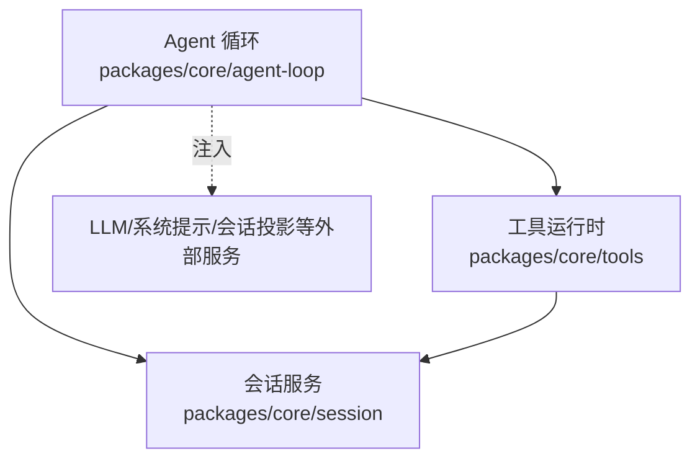
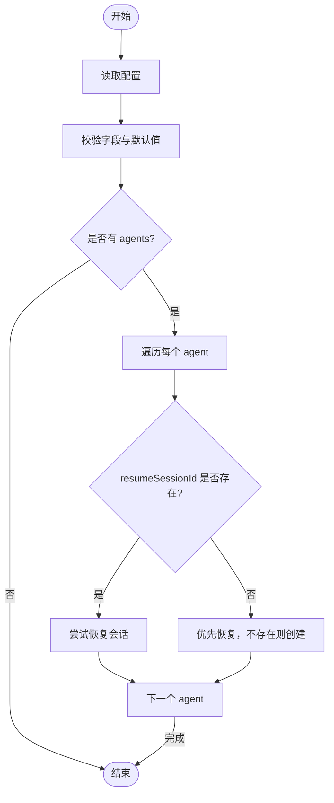
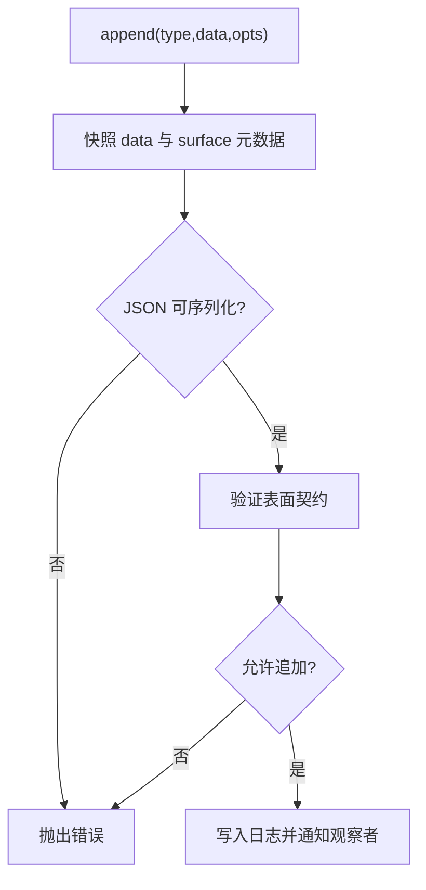
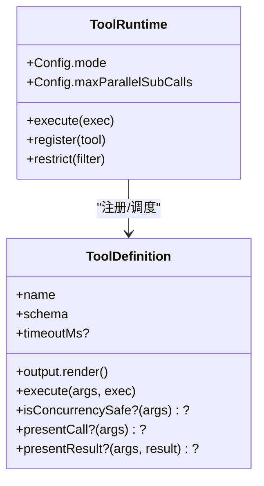
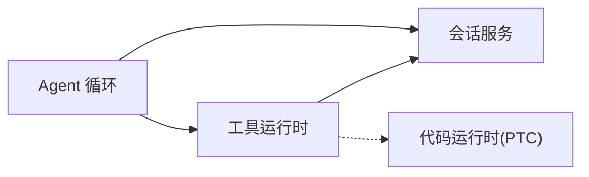

# 核心插件配置

<cite>
**本文引用的文件**
- [packages/core/agent-loop/src/index.ts](file://packages/core/agent-loop/src/index.ts)
- [packages/core/session/src/index.ts](file://packages/core/session/src/index.ts)
- [packages/core/tools/src/index.ts](file://packages/core/tools/src/index.ts)
</cite>

## 目录
1. [简介](#简介)
2. [项目结构](#项目结构)
3. [核心组件](#核心组件)
4. [架构总览](#架构总览)
5. [详细组件分析](#详细组件分析)
6. [依赖关系分析](#依赖关系分析)
7. [性能考量](#性能考量)
8. [故障排查指南](#故障排查指南)
9. [结论](#结论)
10. [附录：完整配置示例与最佳实践](#附录完整配置示例与最佳实践)

## 简介
本文聚焦 DeepSeek Harness 的核心插件配置，围绕 Agent 循环、会话管理、工具注册三大子系统，系统说明其配置接口定义、默认值处理、校验规则、参数含义与行为影响，并给出基础与高级配置示例、环境变量集成方式、插件间依赖与配置传递机制，以及常见配置错误的诊断与解决方案。目标是帮助读者在不深入源码的情况下也能正确、安全地配置和排错。

## 项目结构
本仓库采用多包（monorepo）组织，核心能力位于 packages/core 下：
- agent-loop：Agent 循环驱动、声明式 Agent 启动与会话恢复、并行工具调用上限等
- session：事件溯源的会话存储、事件追加与持久化边界、会话头校验与冻结
- tools：工具注册表、执行管线（pre-execute / execute / post-execute）、呈现模式（native/ptc/both）与并发子调用限制



图表来源
- [packages/core/agent-loop/src/index.ts:358-423](file://packages/core/agent-loop/src/index.ts#L358-L423)
- [packages/core/session/src/index.ts:1-84](file://packages/core/session/src/index.ts#L1-L84)
- [packages/core/tools/src/index.ts:780-794](file://packages/core/tools/src/index.ts#L780-L794)

章节来源
- [packages/core/agent-loop/src/index.ts:358-423](file://packages/core/agent-loop/src/index.ts#L358-L423)
- [packages/core/session/src/index.ts:1-84](file://packages/core/session/src/index.ts#L1-L84)
- [packages/core/tools/src/index.ts:780-794](file://packages/core/tools/src/index.ts#L780-L794)

## 核心组件
- Agent 循环（AgentLoop）
  - 负责创建/恢复 Agent、管理生命周期、注册系统提示变量、安装设置项以支持运行时调整工具并行度
  - 关键配置：maxParallelToolCalls、agents[]（含 id、sessionId/resumeSessionId、cwd、provider/model/reasoningEffort/maxTokens 等）
- 会话（Session）
  - 事件溯源的不可变日志，提供 append/snapshot/requestHeader 等能力；严格校验会话头与事件形状
  - 关键职责：构造/恢复时的强校验、追加路径的 JSON 可序列化与表面一致性约束、持久化边界
- 工具运行时（ToolRuntime）
  - 工具注册、可见性过滤、执行管线（pre/around/post/result）、呈现模式（native/ptc/both）、run_code 子调用并发上限
  - 关键配置：mode、maxParallelSubCalls

章节来源
- [packages/core/agent-loop/src/index.ts:317-375](file://packages/core/agent-loop/src/index.ts#L317-L375)
- [packages/core/session/src/index.ts:92-156](file://packages/core/session/src/index.ts#L92-L156)
- [packages/core/tools/src/index.ts:643-686](file://packages/core/tools/src/index.ts#L643-L686)

## 架构总览
Agent 循环在启动时解析配置、验证并应用默认值，随后根据 agents 列表创建或恢复会话与 Agent，并将工具运行时作为依赖注入到 Agent 的执行上下文中。会话层保证所有变更通过事件追加，工具运行时的执行结果最终落盘为会话事件。

```mermaid
sequenceDiagram
participant Boot as "引导/加载器"
participant Loop as "Agent 循环"
participant Tools as "工具运行时"
participant Sess as "会话服务"
participant Persist as "持久化(可选)"
Boot->>Loop : 读取配置(Config)
Loop->>Loop : 校验并应用默认值
Loop->>Tools : 注入依赖(工具注册表)
Loop->>Sess : 准备/创建会话
alt 存在持久化后端
Sess->>Persist : create/append
end
Loop->>Loop : 发布 Agent/会话并开始运行
Note over Loop,Tools : 后续工具调用由工具运行时执行，结果写入会话
```

图表来源
- [packages/core/agent-loop/src/index.ts:358-423](file://packages/core/agent-loop/src/index.ts#L358-L423)
- [packages/core/session/src/index.ts:663-749](file://packages/core/session/src/index.ts#L663-L749)
- [packages/core/tools/src/index.ts:780-794](file://packages/core/tools/src/index.ts#L780-L794)

## 详细组件分析

### Agent 循环（AgentLoop）配置
- 配置接口
  - Config.maxParallelToolCalls：每个 Agent 步骤内最大并行工具调用数；默认值来自常量；必须为正整数
  - Config.agents[]：声明式 Agent 列表，每项包含：
    - id：稳定标识，用于日志与组合 ID 前缀
    - sessionId：首次使用创建新会话的稳定 ID
    - resumeSessionId：恢复已持久化的会话 ID（与 sessionId 互斥）
    - cwd：新会话的工作目录（可选）
    - provider/model/reasoningEffort/maxTokens：模型路由与调用参数
- 默认值与校验
  - maxParallelToolCalls：缺失时使用默认值；非正整数抛出错误
  - agents：id 必填；sessionId 与 resumeSessionId 互斥；不同 agent 不得重复 exact identity；对 maxTokens 进行安全整数与正值校验
- 运行时设置
  - 通过 settings 安装命名空间，暴露 maxParallelToolCalls 供运行时动态调整；每次调度决策读取最新值
- 启动流程
  - 按 agents 顺序尝试 restore 或 create；失败时上报配置启动失败事件；注册 turnBoundary 投影与系统提示变量



图表来源
- [packages/core/agent-loop/src/index.ts:317-375](file://packages/core/agent-loop/src/index.ts#L317-L375)
- [packages/core/agent-loop/src/index.ts:425-454](file://packages/core/agent-loop/src/index.ts#L425-L454)

章节来源
- [packages/core/agent-loop/src/index.ts:317-375](file://packages/core/agent-loop/src/index.ts#L317-L375)
- [packages/core/agent-loop/src/index.ts:425-454](file://packages/core/agent-loop/src/index.ts#L425-L454)

### 会话（Session）配置与约束
- 会话头（SessionHeader）校验
  - 版本、ID、时间戳、工作目录（绝对路径）、父会话、是否种子、来源、委派深度、代理预设等字段类型与取值范围严格校验
- 事件追加（append）
  - 数据必须可无损 JSON 序列化；表面元数据（surfaceOp/sourceEventSeqs）需符合契约；禁止重入追加；追加后同步通知观察者
- 恢复与种子
  - 从持久化恢复时，对事件信封、流内容一致性等进行强校验；种子会话要求继承计数与种子一致



图表来源
- [packages/core/session/src/index.ts:663-749](file://packages/core/session/src/index.ts#L663-L749)
- [packages/core/session/src/index.ts:92-156](file://packages/core/session/src/index.ts#L92-L156)

章节来源
- [packages/core/session/src/index.ts:92-156](file://packages/core/session/src/index.ts#L92-L156)
- [packages/core/session/src/index.ts:663-749](file://packages/core/session/src/index.ts#L663-L749)

### 工具运行时（ToolRuntime）配置
- 配置接口
  - mode：工具呈现模式
    - native：直接暴露各工具名称
    - ptc：仅暴露 run_code 并通过 SDK 生成提示，内部再调度具体工具
    - both：同时暴露两种形式
  - maxParallelSubCalls：run_code 程序内并发子调用上限（默认 10，必须为正整数）
- 执行管线
  - pre-execute：允许/拒绝/请求审批
  - execute：around 包装，支持超时、重试、指标等
  - post-execute：接受/替换/阻断结果，附加上下文
  - result：最终结果观察点
- 可见性与限制
  - 支持 per-scope 的 allow/deny 限制；全局与 scoped 注册叠加



图表来源
- [packages/core/tools/src/index.ts:643-686](file://packages/core/tools/src/index.ts#L643-L686)
- [packages/core/tools/src/index.ts:780-794](file://packages/core/tools/src/index.ts#L780-L794)
- [packages/core/tools/src/index.ts:213-280](file://packages/core/tools/src/index.ts#L213-L280)

章节来源
- [packages/core/tools/src/index.ts:643-686](file://packages/core/tools/src/index.ts#L643-L686)
- [packages/core/tools/src/index.ts:780-794](file://packages/core/tools/src/index.ts#L780-L794)
- [packages/core/tools/src/index.ts:213-280](file://packages/core/tools/src/index.ts#L213-L280)

## 依赖关系分析
- Agent 循环依赖
  - 会话服务：创建/恢复会话、追加未存储后缀、等待同 ID 生命周期排空
  - 工具运行时：注入到 Agent 上下文，参与工具调度与呈现
  - 系统提示：注入 provider/model/cwd 等变量
- 工具运行时依赖
  - 会话：工具结果最终写入会话事件
  - 代码运行时（PTC 模式）：需要语言渲染器（TypeScript/Python）
- 会话服务
  - 对外暴露事件流，持久化插件订阅 session/event 与 session/flush



图表来源
- [packages/core/agent-loop/src/index.ts:358-423](file://packages/core/agent-loop/src/index.ts#L358-L423)
- [packages/core/tools/src/index.ts:780-794](file://packages/core/tools/src/index.ts#L780-L794)
- [packages/core/session/src/index.ts:1-84](file://packages/core/session/src/index.ts#L1-L84)

章节来源
- [packages/core/agent-loop/src/index.ts:358-423](file://packages/core/agent-loop/src/index.ts#L358-L423)
- [packages/core/tools/src/index.ts:780-794](file://packages/core/tools/src/index.ts#L780-L794)
- [packages/core/session/src/index.ts:1-84](file://packages/core/session/src/index.ts#L1-L84)

## 性能考量
- 工具并行度
  - Agent 循环的 maxParallelToolCalls 控制每步最大并行工具调用数；过大会增加资源竞争与输出 token 压力
  - 工具运行时的 maxParallelSubCalls 控制 run_code 程序内的并发子调用；建议与业务 I/O 特性匹配
- 会话追加成本
  - append 路径避免阻塞 I/O；持久化异步缓冲；但需确保数据可 JSON 序列化，否则会在追加阶段失败
- 呈现模式
  - ptc 模式减少直接工具暴露面，降低模型误用风险；但需要代码运行时支持

[本节为通用指导，不直接分析具体文件]

## 故障排查指南
- Agent 循环
  - 冲突身份：同一 exact identity 被多个 agent 使用会报错；检查 sessionId 与 resumeSessionId 的唯一性
  - 互斥配置：sessionId 与 resumeSessionId 不能同时设置
  - 启动失败：恢复或创建失败会记录警告并触发配置启动失败事件，便于上层监听处理
- 会话
  - 会话头版本不匹配或字段非法：检查持久化格式与迁移逻辑
  - 事件不可序列化：确保事件 data 不含函数、Symbol、BigInt 等
  - 表面契约违规：sourceEventSeqs 与 surfaceOp 不符合约定会导致追加失败
- 工具运行时
  - 未知工具：模型调用了未注册的工具名；检查工具注册与可见性限制
  - 输出无效：工具返回的值或投影不符合 output.schema；检查 schema 与实现
  - PTC 模式无渲染器：缺少对应语言的 SDK 渲染器将导致组装失败

章节来源
- [packages/core/agent-loop/src/index.ts:340-356](file://packages/core/agent-loop/src/index.ts#L340-L356)
- [packages/core/agent-loop/src/index.ts:457-477](file://packages/core/agent-loop/src/index.ts#L457-L477)
- [packages/core/session/src/index.ts:92-156](file://packages/core/session/src/index.ts#L92-L156)
- [packages/core/session/src/index.ts:663-749](file://packages/core/session/src/index.ts#L663-L749)
- [packages/core/tools/src/index.ts:481-515](file://packages/core/tools/src/index.ts#L481-L515)

## 结论
- Agent 循环提供声明式 Agent 启动与会话恢复，配合设置项支持运行时调整并行度
- 会话层以事件溯源为核心，提供强一致的追加与恢复语义，确保持久化可靠性
- 工具运行时提供灵活的呈现模式与执行管线，支持细粒度的权限控制与结果处理
- 三者协同构成 DeepSeek Harness 的核心执行骨架，合理配置可兼顾安全性、可扩展性与性能

[本节为总结，不直接分析具体文件]

## 附录：完整配置示例与最佳实践

- 基础配置（最小可用）
  - 设置 Agent 循环的 agents 数组，至少包含 id、provider、model
  - 若无需持久化，可不配置 sessionId/resumeSessionId
  - 工具模式保持默认 native，或根据安全需求切换为 ptc/both

- 高级选项
  - maxParallelToolCalls：根据模型与资源情况调优，确保不超过模型限制
  - maxTokens：为 Agent 设置合理的最大输出 token 数，避免超限
  - cwd：为新会话指定工作目录，便于工具访问本地资源
  - resumeSessionId：用于恢复历史会话，确保唯一性

- 环境变量集成
  - 可通过 Loader/配置层将环境变量映射到上述配置项（如 PROVIDER、MODEL、MAX_TOKENS、MAX_PARALLEL_TOOL_CALLS 等），再由插件配置解析合并
  - 注意：运行时设置项（如 maxParallelToolCalls）也可通过 settings 接口动态更新，适合热重载场景

- 最佳实践
  - 为每个 agent 分配稳定的 id，必要时固定 sessionId 以便跨重启复用
  - 谨慎使用 resumeSessionId，避免与 sessionId 混用造成歧义
  - 在 ptc 模式下确保代码运行时语言已注册渲染器
  - 对敏感工具使用 per-scope 的 allow/deny 限制，最小化暴露面
  - 监控工具执行结果与错误码，结合 post-execute 策略统一处理异常

[本节为概念性指导，不直接分析具体文件]