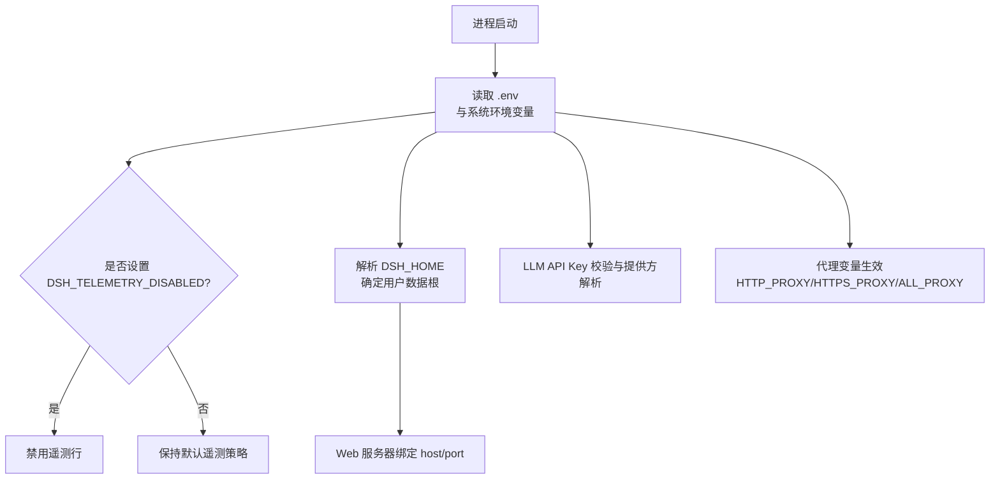
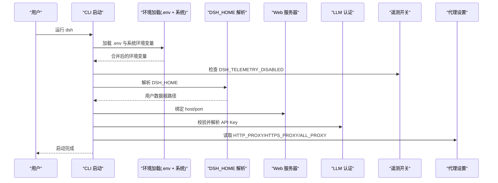
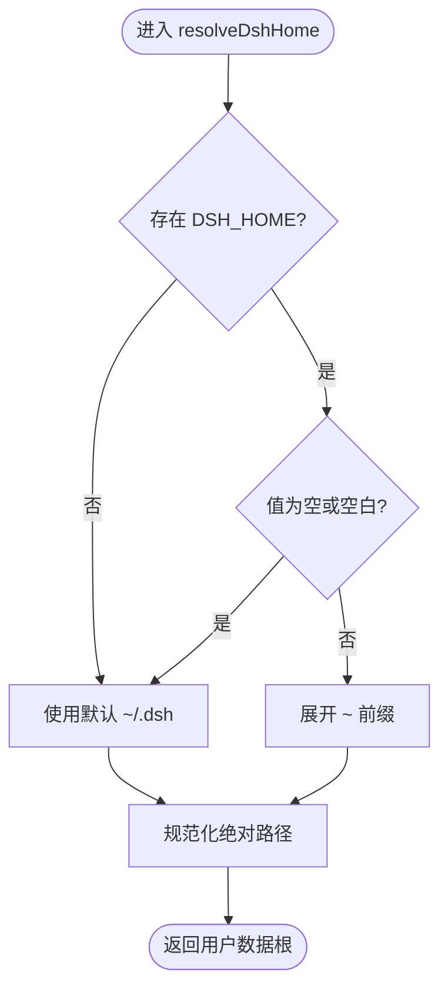
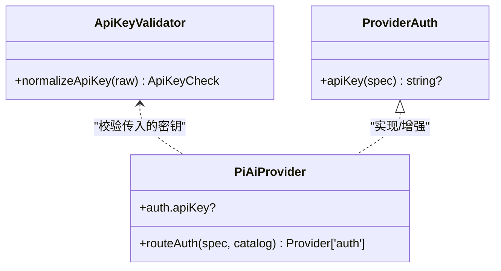
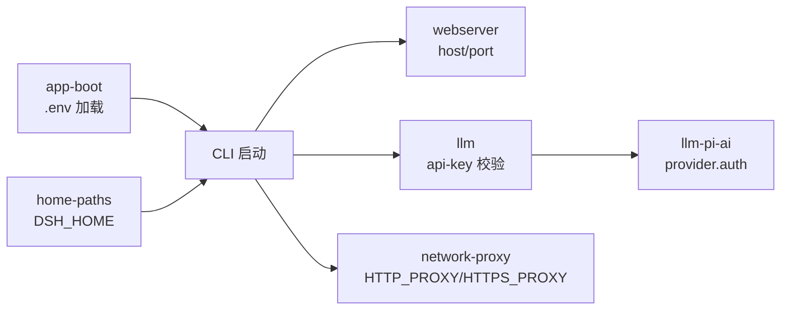

# 环境变量配置

<cite>
**本文引用的文件**
- [packages/util/home-paths/src/index.ts](file://packages/util/home-paths/src/index.ts)
- [scripts/setup-dsh/setup.env.example](file://scripts/setup-dsh/setup.env.example)
- [scripts/setup-dsh/setup.sh](file://scripts/setup-dsh/setup.sh)
- [scripts/setup-dsh/export-env.sh](file://scripts/setup-dsh/export-env.sh)
- [scripts/setup-dsh/start-all.sh](file://scripts/setup-dsh/start-all.sh)
- [apps/cli/src/profile-boot.ts](file://apps/cli/src/profile-boot.ts)
- [packages/boot/app-boot/src/index.ts](file://packages/boot/app-boot/src/index.ts)
- [docs/subsystems/web-server.zh.md](file://docs/subsystems/web-server.zh.md)
- [packages/host/webserver/src/index.d.ts](file://packages/host/webserver/src/index.d.ts)
- [packages/llm/llm/src/api-key.ts](file://packages/llm/llm/src/api-key.ts)
- [packages/llm/llm-pi-ai/src/provider.ts](file://packages/llm/llm-pi-ai/src/provider.ts)
- [docs/user/guide/network-proxy.md](file://docs/user/guide/network-proxy.md)
</cite>

## 目录
1. [简介](#简介)
2. [项目结构](#项目结构)
3. [核心组件](#核心组件)
4. [架构总览](#架构总览)
5. [详细组件分析](#详细组件分析)
6. [依赖关系分析](#依赖关系分析)
7. [性能与可靠性考虑](#性能与可靠性考虑)
8. [故障排查指南](#故障排查指南)
9. [结论](#结论)
10. [附录：环境示例与最佳实践](#附录：环境示例与最佳实践)

## 简介
本文件系统性说明 DeepSeek Harness（DSH）的环境变量配置，覆盖 DSH_HOME、API 密钥、端口、代理、遥测等关键变量；解释优先级与覆盖规则；给出开发、测试、生产环境的配置建议；并提供安全与验证方面的最佳实践。

## 项目结构
DSH 的环境变量涉及多个层次：
- 用户数据根目录：由 DSH_HOME 控制，所有用户数据统一位于该根下。
- 启动与环境加载：CLI 在启动时读取 .env 与系统环境变量，并应用遥测开关。
- 安装与部署脚本：setup.sh 通过 DSH_* 变量生成或迁移配置文件。
- Web 服务器：监听地址与端口由配置决定，默认仅回环暴露。
- LLM 认证：API Key 的格式校验与提供方解析。
- 网络代理：标准 HTTP_PROXY/HTTPS_PROXY/ALL_PROXY/NODE_EXTRA_CA_CERTS。

图表来源
- [packages/boot/app-boot/src/index.ts:74-92](file://packages/boot/app-boot/src/index.ts#L74-L92)
- [apps/cli/src/profile-boot.ts:77-104](file://apps/cli/src/profile-boot.ts#L77-L104)
- [packages/util/home-paths/src/index.ts:76-91](file://packages/util/home-paths/src/index.ts#L76-L91)
- [docs/subsystems/web-server.zh.md:29-47](file://docs/subsystems/web-server.zh.md#L29-L47)
- [packages/llm/llm/src/api-key.ts:1-41](file://packages/llm/llm/src/api-key.ts#L1-L41)
- [docs/user/guide/network-proxy.md:1-62](file://docs/user/guide/network-proxy.md#L1-L62)

章节来源
- [packages/util/home-paths/src/index.ts:76-91](file://packages/util/home-paths/src/index.ts#L76-L91)
- [packages/boot/app-boot/src/index.ts:74-92](file://packages/boot/app-boot/src/index.ts#L74-L92)
- [apps/cli/src/profile-boot.ts:77-104](file://apps/cli/src/profile-boot.ts#L77-L104)
- [docs/subsystems/web-server.zh.md:29-47](file://docs/subsystems/web-server.zh.md#L29-L47)
- [packages/llm/llm/src/api-key.ts:1-41](file://packages/llm/llm/src/api-key.ts#L1-L41)
- [docs/user/guide/network-proxy.md:1-62](file://docs/user/guide/network-proxy.md#L1-L62)

## 核心组件
- DSH_HOME：用户数据根目录，支持显式路径、环境变量覆盖与默认 ~/.dsh；空值或空白视为未设置。
- API 密钥：
  - 通用校验：normalizeApiKey 要求可打印 ASCII，拒绝空值与非法字符。
  - 提供方解析：pi-ai 路由保留已安装提供方的 auth，并在必要时注入 harness 的 apiKey 方法。
- Web 服务器：host 仅允许 127.0.0.1 与 0.0.0.0；port=0 表示操作系统分配端口。
- 代理：遵循标准 HTTP_PROXY/HTTPS_PROXY/ALL_PROXY；企业代理可能需要 NODE_EXTRA_CA_CERTS。
- 遥测：DSH_TELEMETRY_DISABLED 为硬关闭开关；DSH_TELEMETRY_MODE 控制模式（FULL/FEEDBACK_ONLY/DISABLED）。
- 安装脚本：setup.sh 使用大量 DSH_* 变量生成/迁移配置，支持非交互模式与升级。

章节来源
- [packages/util/home-paths/src/index.ts:76-91](file://packages/util/home-paths/src/index.ts#L76-L91)
- [packages/llm/llm/src/api-key.ts:1-41](file://packages/llm/llm/src/api-key.ts#L1-L41)
- [packages/llm/llm-pi-ai/src/provider.ts:109-135](file://packages/llm/llm-pi-ai/src/provider.ts#L109-L135)
- [docs/subsystems/web-server.zh.md:29-47](file://docs/subsystems/web-server.zh.md#L29-L47)
- [docs/user/guide/network-proxy.md:1-62](file://docs/user/guide/network-proxy.md#L1-L62)
- [apps/cli/src/profile-boot.ts:77-104](file://apps/cli/src/profile-boot.ts#L77-L104)
- [scripts/setup-dsh/setup.sh:41-61](file://scripts/setup-dsh/setup.sh#L41-L61)

## 架构总览
下图展示环境变量从进程启动到各子系统生效的关键流程：

图表来源
- [packages/boot/app-boot/src/index.ts:74-92](file://packages/boot/app-boot/src/index.ts#L74-L92)
- [apps/cli/src/profile-boot.ts:77-104](file://apps/cli/src/profile-boot.ts#L77-L104)
- [packages/util/home-paths/src/index.ts:76-91](file://packages/util/home-paths/src/index.ts#L76-L91)
- [docs/subsystems/web-server.zh.md:29-47](file://docs/subsystems/web-server.zh.md#L29-L47)
- [packages/llm/llm/src/api-key.ts:1-41](file://packages/llm/llm/src/api-key.ts#L1-L41)
- [docs/user/guide/network-proxy.md:1-62](file://docs/user/guide/network-proxy.md#L1-L62)

## 详细组件分析

### DSH_HOME 与用户数据根
- 优先级：显式配置 > DSH_HOME 环境变量 > 默认 ~/.dsh。
- 空值处理：空或空白视为未设置，不会回退到当前工作目录。
- 路径展开：支持 ~ 前缀扩展。
- 显示标签：默认显示为 ~/.dsh，自定义显示为 $DSH_HOME。

图表来源
- [packages/util/home-paths/src/index.ts:76-91](file://packages/util/home-paths/src/index.ts#L76-L91)

章节来源
- [packages/util/home-paths/src/index.ts:76-91](file://packages/util/home-paths/src/index.ts#L76-L91)

### API 密钥校验与提供方解析
- 校验规则：trim 后必须非空且仅包含可打印 ASCII（排除空格与 Latin-1），否则拒绝。
- 提供方行为：pi-ai 路由优先使用已安装提供方的 auth；若提供方无 apiKey 方法但需要密钥，则注入 harness 的 apiKey 解析。
- 缺失语义：未命名凭据时走提供方自身的环境发现或 OAuth；空白字段不触发覆盖。

图表来源
- [packages/llm/llm/src/api-key.ts:1-41](file://packages/llm/llm/src/api-key.ts#L1-L41)
- [packages/llm/llm-pi-ai/src/provider.ts:109-135](file://packages/llm/llm-pi-ai/src/provider.ts#L109-L135)

章节来源
- [packages/llm/llm/src/api-key.ts:1-41](file://packages/llm/llm/src/api-key.ts#L1-L41)
- [packages/llm/llm-pi-ai/src/provider.ts:109-135](file://packages/llm/llm-pi-ai/src/provider.ts#L109-L135)

### Web 服务器端口与主机
- host：仅接受 127.0.0.1（默认）与 0.0.0.0（刻意外网暴露）。
- port：数字端口；0 表示操作系统分配端口。
- 安全提示：非回环绑定需自行提供 TLS/认证/Origin 策略。

章节来源
- [docs/subsystems/web-server.zh.md:29-47](file://docs/subsystems/web-server.zh.md#L29-L47)
- [packages/host/webserver/src/index.d.ts:37-42](file://packages/host/webserver/src/index.d.ts#L37-L42)

### 代理与环境变量
- 支持的代理变量：HTTP_PROXY、HTTPS_PROXY、ALL_PROXY（ALL_PROXY 可作为双协议回退）。
- 企业代理证书：NODE_EXTRA_CA_CERTS 在进程启动时生效。
- 子进程继承：bash 工具、git、gh、MCP 子进程均继承这些变量；Node 子进程版本差异影响代理行为。
- 密码安全：代理 URL 中的用户名/密码会出现在子进程环境中，需谨慎。

章节来源
- [docs/user/guide/network-proxy.md:1-62](file://docs/user/guide/network-proxy.md#L1-L62)

### 遥测开关与默认策略
- 硬关闭：任何非空的 DSH_TELEMETRY_DISABLED 都会禁用遥测行（包括 '0'/'false'）。
- 模式：DSH_TELEMETRY_MODE 控制上传策略（FULL/FEEDBACK_ONLY/DISABLED）；共享基础默认反馈门控。
- 端点：DSH_TELEMETRY_OTLP_URL 指定上报端点。
- 启动阶段：CLI 在加载 cordis 之前解析遥测开关，避免被运行时修改。

章节来源
- [apps/cli/src/profile-boot.ts:77-104](file://apps/cli/src/profile-boot.ts#L77-L104)
- [.agents/notes/implemented/feature/2026-07-31-web-telemetry-default-mount.md:11-24](file://.agents/notes/implemented/feature/2026-07-31-web-telemetry-default-mount.md#L11-L24)
- [.agents/notes/implemented/feature/2026-08-10-telemetry-default-off.md:15-21](file://.agents/notes/implemented/feature/2026-08-10-telemetry-default-off.md#L15-L21)
- [.agents/notes/implemented/feature/2026-08-25-feedback-gated-telemetry-default.zh.md:1-13](file://.agents/notes/implemented/feature/2026-08-25-feedback-gated-telemetry-default.zh.md#L1-L13)

### 安装脚本与 DSH_* 变量
- setup.sh 读取大量 DSH_* 变量用于生成/迁移配置，支持 --non-interactive 与 --upgrade。
- 典型变量：
  - DSH_PROXY_USER_KEY：MemoryCore 实例唯一密钥。
  - DSH_DEEPSEEK_API_KEY、DSH_FEISHU_APP_ID、DSH_FEISHU_APP_SECRET：写入仓库 .env。
  - DSH_PROXY_UPSTREAM_URL、DSH_PROXY_UPSTREAM_API_KEY：上游 LLM。
  - DSH_KERNEL_GATEWAY_API_KEY：面板元数据 api_key。
  - DSH_TDAI_LLM_API_KEY、DSH_TDAI_LLM_BASE_URL、DSH_TDAI_LLM_MODEL：内存栈 LLM。
  - DSH_MEMORY_DATA_DIR：内存数据目录。
  - DSH_GITLAB_BOT_USERNAME、DSH_GITLAB_API_BASE、DSH_GITLAB_TOKEN：GitLab MR 集成。
- export-env.sh：从运行中配置导出 DSH_* 以便复现。
- start-all.sh：管理 MemoryCore 等服务端口与健康检查。

章节来源
- [scripts/setup-dsh/setup.sh:41-61](file://scripts/setup-dsh/setup.sh#L41-L61)
- [scripts/setup-dsh/setup.env.example:1-88](file://scripts/setup-dsh/setup.env.example#L1-L88)
- [scripts/setup-dsh/export-env.sh:1-168](file://scripts/setup-dsh/export-env.sh#L1-L168)
- [scripts/setup-dsh/start-all.sh:74-101](file://scripts/setup-dsh/start-all.sh#L74-L101)

## 依赖关系分析
- CLI 启动依赖 app-boot 的 .env 加载与遥测开关解析。
- home-paths 提供 DSH_HOME 解析，供其他模块统一访问用户数据根。
- webserver 根据配置绑定 host/port，受 CLI 组合层约束。
- LLM 认证链：api-key 校验 -> 提供方 auth -> 请求携带 apiKey。
- 代理变量在多处被子进程继承，影响模型调用、网页抓取、MCP 服务。

图表来源
- [packages/boot/app-boot/src/index.ts:74-92](file://packages/boot/app-boot/src/index.ts#L74-L92)
- [packages/util/home-paths/src/index.ts:76-91](file://packages/util/home-paths/src/index.ts#L76-L91)
- [docs/subsystems/web-server.zh.md:29-47](file://docs/subsystems/web-server.zh.md#L29-L47)
- [packages/llm/llm/src/api-key.ts:1-41](file://packages/llm/llm/src/api-key.ts#L1-L41)
- [packages/llm/llm-pi-ai/src/provider.ts:109-135](file://packages/llm/llm-pi-ai/src/provider.ts#L109-L135)
- [docs/user/guide/network-proxy.md:1-62](file://docs/user/guide/network-proxy.md#L1-L62)

章节来源
- [packages/boot/app-boot/src/index.ts:74-92](file://packages/boot/app-boot/src/index.ts#L74-L92)
- [packages/util/home-paths/src/index.ts:76-91](file://packages/util/home-paths/src/index.ts#L76-L91)
- [docs/subsystems/web-server.zh.md:29-47](file://docs/subsystems/web-server.zh.md#L29-L47)
- [packages/llm/llm/src/api-key.ts:1-41](file://packages/llm/llm/src/api-key.ts#L1-L41)
- [packages/llm/llm-pi-ai/src/provider.ts:109-135](file://packages/llm/llm-pi-ai/src/provider.ts#L109-L135)
- [docs/user/guide/network-proxy.md:1-62](file://docs/user/guide/network-proxy.md#L1-L62)

## 性能与可靠性考虑
- 遥测上报：批量周期、超时与队列大小已在共享基础中设定，确保退出时合理释放资源。
- 代理连接：企业代理证书需在进程启动前设置，避免后续重试开销。
- Web 服务器：gzip 压缩与阈值可调，避免对短响应造成过大开销。
- 端口冲突：start-all.sh 在启动前检测端口占用并等待释放，减少启动失败。

[本节为通用指导，不直接分析具体文件]

## 故障排查指南
- DSH_HOME 未生效：确认环境变量非空且非空白；检查是否被显式覆盖。
- API Key 无效：检查 normalizeApiKey 校验结果（空值或非法字符）；确认提供方是否支持 apiKey 解析。
- Web 服务器无法绑定：检查 host 是否为 127.0.0.1 或 0.0.0.0；port 是否为可用端口或 0。
- 代理失败：确认 HTTP_PROXY/HTTPS_PROXY/ALL_PROXY 格式正确；企业代理需设置 NODE_EXTRA_CA_CERTS。
- 遥测未上报：检查 DSH_TELEMETRY_DISABLED 是否非空；确认 DSH_TELEMETRY_MODE 与端点配置。

章节来源
- [packages/util/home-paths/src/index.ts:76-91](file://packages/util/home-paths/src/index.ts#L76-L91)
- [packages/llm/llm/src/api-key.ts:1-41](file://packages/llm/llm/src/api-key.ts#L1-L41)
- [docs/subsystems/web-server.zh.md:29-47](file://docs/subsystems/web-server.zh.md#L29-L47)
- [docs/user/guide/network-proxy.md:1-62](file://docs/user/guide/network-proxy.md#L1-L62)
- [apps/cli/src/profile-boot.ts:77-104](file://apps/cli/src/profile-boot.ts#L77-L104)

## 结论
DSH 的环境变量体系围绕 DSH_HOME、API 密钥、端口、代理与遥测五大主题构建，具备清晰的优先级与严格的校验机制。通过 CLI 启动阶段的集中解析与安装脚本的 DSH_* 变量驱动，可在不同环境中稳定复用配置。遵循安全最佳实践（最小权限、敏感信息隔离、严格校验）可显著降低风险。

[本节为总结性内容，不直接分析具体文件]

## 附录：环境示例与最佳实践

### 环境变量优先级与覆盖规则
- DSH_HOME：显式路径 > DSH_HOME 环境变量 > 默认 ~/.dsh；空值视为未设置。
- .env 与系统环境变量：系统环境变量优先于 .env；代理变量必须在进程启动前设置。
- 遥测：DSH_TELEMETRY_DISABLED 为非空即关闭；DSH_TELEMETRY_MODE 控制模式；端点由 DSH_TELEMETRY_OTLP_URL 指定。
- 安装脚本：setup.sh 的 DSH_* 变量优先于交互式提示；--non-interactive 模式下缺失必填项将失败。

章节来源
- [packages/util/home-paths/src/index.ts:76-91](file://packages/util/home-paths/src/index.ts#L76-L91)
- [packages/boot/app-boot/src/index.ts:74-92](file://packages/boot/app-boot/src/index.ts#L74-L92)
- [apps/cli/src/profile-boot.ts:77-104](file://apps/cli/src/profile-boot.ts#L77-L104)
- [scripts/setup-dsh/setup.sh:41-61](file://scripts/setup-dsh/setup.sh#L41-L61)

### 开发、测试、生产环境配置示例
- 开发环境：
  - 使用本地 DSH_HOME（如 ~/dev-dsh），启用反馈门控遥测，代理指向本地调试代理。
  - Web 服务器绑定 127.0.0.1，端口可设为 0 以自动分配。
- 测试环境：
  - 设置 DSH_TELEMETRY_DISABLED=1 以禁用上报；使用独立 DSH_HOME 隔离数据。
  - 代理与 LLM 端点指向测试后端。
- 生产环境：
  - 明确设置 DSH_HOME 到受控目录；严格校验 API Key；Web 服务器仅暴露必要端口并通过反向代理提供 TLS。
  - 设置 NODE_EXTRA_CA_CERTS 与企业代理；遥测模式按合规要求配置。

[本节为概念性示例，不直接分析具体文件]

### 安全最佳实践与敏感信息保护
- 将敏感变量（如 API Key、代理密码）置于系统环境变量或安全的 .env 文件中，并确保不被提交至版本库。
- 使用 DSH_HOME 隔离不同环境的数据与凭据。
- 避免在生产环境暴露 Web 服务器到公网；如需暴露，务必通过反向代理提供 TLS 与认证。
- 代理 URL 中的密码会被子进程继承，建议使用无密码入口或外部认证方式。

章节来源
- [docs/user/guide/network-proxy.md:1-62](file://docs/user/guide/network-proxy.md#L1-L62)
- [packages/boot/app-boot/src/index.ts:74-92](file://packages/boot/app-boot/src/index.ts#L74-L92)
- [docs/subsystems/web-server.zh.md:29-47](file://docs/subsystems/web-server.zh.md#L29-L47)

### 环境变量验证与默认值处理
- API Key：normalizeApiKey 强制非空与合法字符集；提供方解析保留原生环境发现能力。
- DSH_HOME：空值或空白视为未设置，回退到默认路径。
- 遥测：DSH_TELEMETRY_DISABLED 非空即关闭；DSH_TELEMETRY_MODE 默认反馈门控；端点可覆盖。
- 安装脚本：setup.sh 对必填项进行强校验，缺失时在非交互模式下失败。

章节来源
- [packages/llm/llm/src/api-key.ts:1-41](file://packages/llm/llm/src/api-key.ts#L1-L41)
- [packages/util/home-paths/src/index.ts:76-91](file://packages/util/home-paths/src/index.ts#L76-L91)
- [apps/cli/src/profile-boot.ts:77-104](file://apps/cli/src/profile-boot.ts#L77-L104)
- [scripts/setup-dsh/setup.sh:41-61](file://scripts/setup-dsh/setup.sh#L41-L61)