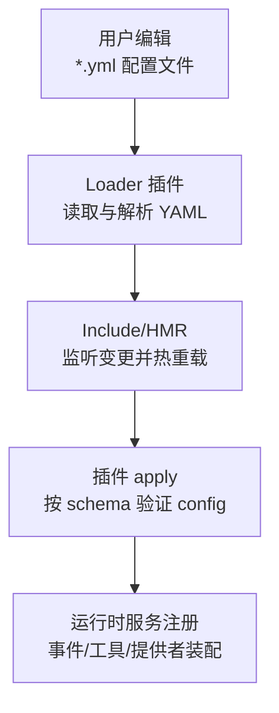
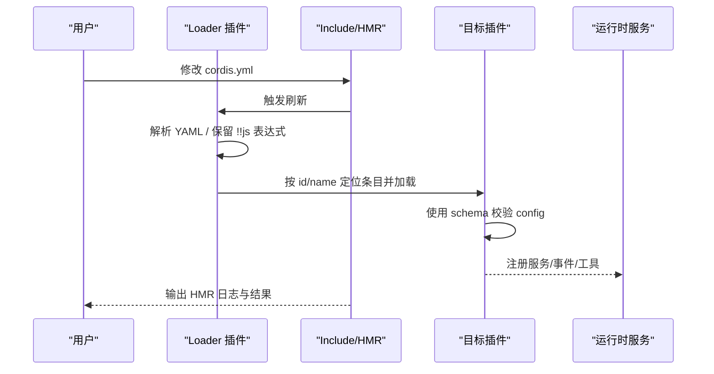
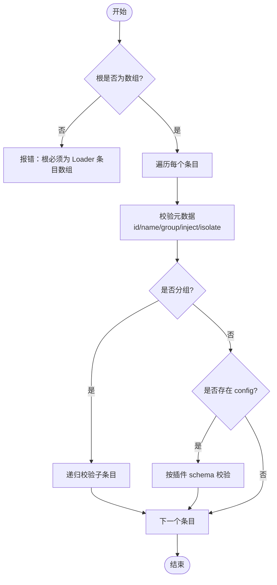
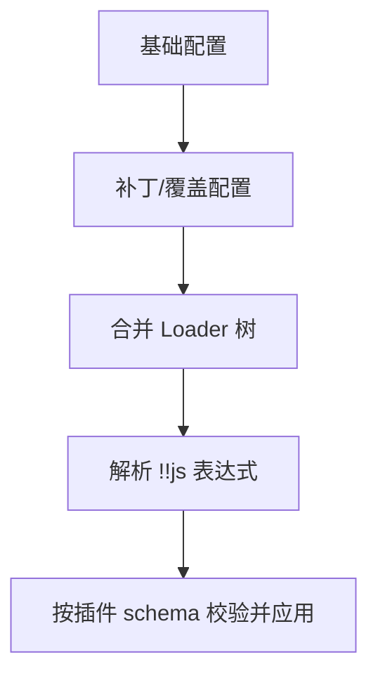
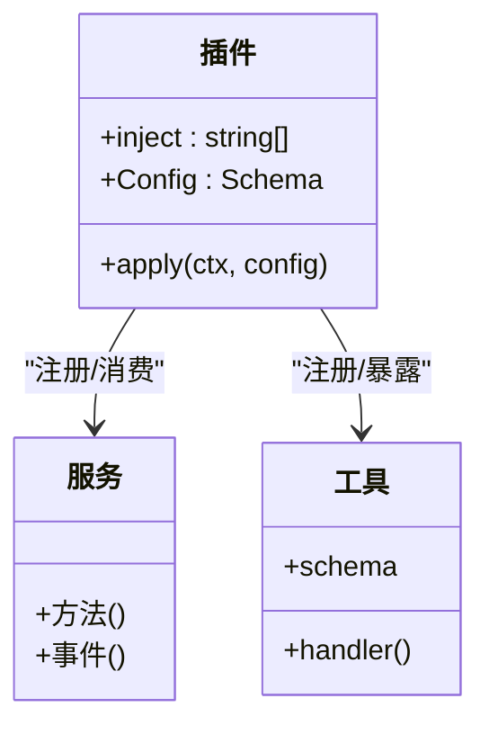
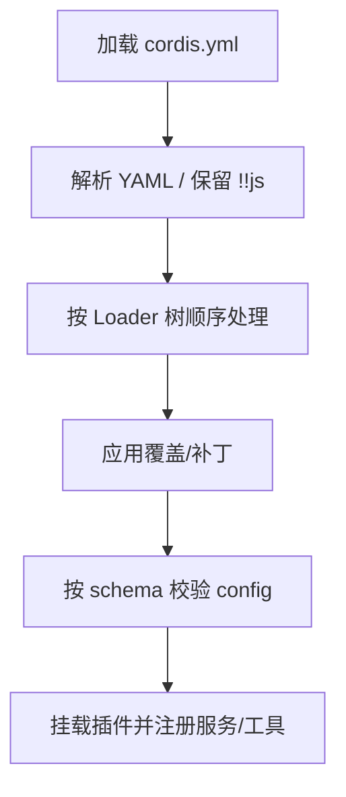
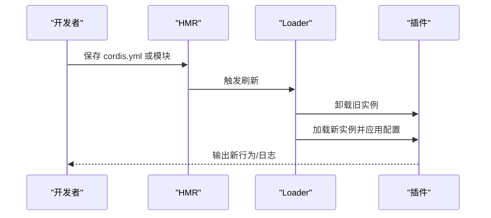

# 配置文件管理

<cite>
**本文引用的文件**
- [cordis.yml](file://apps/cli/config/examples/cordis/cordis.yml)
- [cordis.yml（GitHub Review）](file://apps/cli/config/examples/github-review/cordis.yml)
- [cordis.yml（Schedule）](file://apps/cli/config/examples/schedule/cordis.yml)
- [配置目录清单](file://docs/config-catalog.md)
- [Cordis 入门](file://docs/cordis-primer.md)
- [教程：组合与热重载](file://docs/cordis-tutorial/06-composition-and-hmr.md)
- [教程：配置](file://docs/cordis-tutorial/05-config.md)
- [Cordis YAML 解析工具](file://scripts/cordis-yaml.ts)
- [Loader 配置文件发现](file://scripts/cordis-config-files.ts)
- [校验 Loader 配置与包解析](file://scripts/verify-cordis-config.ts)
- [禁止在 shipped 配置中内联凭据](file://scripts/verify-config-source-ownership.ts)
- [应用启动：配置热重载测试](file://packages/boot/app-boot/tests/config-reload.spec.ts)
- [HMR 精确配置路径测试](file://packages/boot/app-boot/tests/hmr-config.spec.ts)
</cite>

## 目录
1. [简介](#简介)
2. [项目结构](#项目结构)
3. [核心组件](#核心组件)
4. [架构总览](#架构总览)
5. [详细组件分析](#详细组件分析)
6. [依赖关系分析](#依赖关系分析)
7. [性能考虑](#性能考虑)
8. [故障排查指南](#故障排查指南)
9. [结论](#结论)
10. [附录](#附录)

## 简介
本文件面向 DeepSeek Harness 的 cordis.yml 配置文件管理，系统性说明其语法结构、层次组织、继承与覆盖机制、插件/服务/工具等配置项的作用与用法，并提供完整示例与最佳实践。同时解释加载顺序、覆盖规则、验证机制、热重载能力与调试技巧，并指导如何为不同环境创建与管理多个配置文件。

## 项目结构
仓库中的 Cordis 配置文件以 *.yml/*.yaml 形式存在，CLI 示例位于 apps/cli/config/examples 下；脚本层提供解析、发现与校验能力；文档层提供配置目录清单与教程。

**图表来源**
- [Cordis YAML 解析工具:1-41](file://scripts/cordis-yaml.ts#L1-L41)
- [Loader 配置文件发现:1-19](file://scripts/cordis-config-files.ts#L1-L19)
- [教程：组合与热重载:1-63](file://docs/cordis-tutorial/06-composition-and-hmr.md#L1-L63)

**章节来源**
- [Loader 配置文件发现:1-19](file://scripts/cordis-config-files.ts#L1-L19)
- [Cordis YAML 解析工具:1-41](file://scripts/cordis-yaml.ts#L1-L41)

## 核心组件
- 配置文件根节点：每个 cordis.yml 必须是一个 Loader Entry 数组，每项代表一个可装载的插件或分组。
- 条目元数据：id、name、group、inject、intercept、isolate 等字段用于标识、依赖声明、分组隔离与拦截。
- 配置块：每个条目可携带 config 块，由对应插件的 schema 进行类型与值校验。
- 表达式支持：YAML 中的 !!js 表达式会被保留并在 Loader 上下文中插值，常用于读取环境变量或动态计算。
- 分组与隔离：通过 group 与 isolate 将一组条目作为整体挂载/卸载，并为特定服务名创建独立作用域实例。
- 热重载：HMR 会监听配置与模块变化，对已运行插件执行卸载/重新加载，保证增量更新且不影响其他部分。

**章节来源**
- [Cordis 入门:37-40](file://docs/cordis-primer.md#L37-L40)
- [教程：配置:1-66](file://docs/cordis-tutorial/05-config.md#L1-L66)
- [教程：组合与热重载:7-22](file://docs/cordis-tutorial/06-composition-and-hmr.md#L7-L22)
- [Cordis YAML 解析工具:13-30](file://scripts/cordis-yaml.ts#L13-L30)

## 架构总览
下图展示了从配置文件到运行时服务的装配流程，包括解析、校验、注入与热重载。

**图表来源**
- [Cordis YAML 解析工具:23-30](file://scripts/cordis-yaml.ts#L23-L30)
- [校验 Loader 配置与包解析:60-88](file://scripts/verify-cordis-config.ts#L60-L88)
- [教程：组合与热重载:23-60](file://docs/cordis-tutorial/06-composition-and-hmr.md#L23-L60)

## 详细组件分析

### 配置文件语法与层次组织
- 根节点：必须是 Loader Entry 数组。
- 单条目的关键字段：
  - id：稳定标识，便于 HMR 区分“编辑现有条目”和“删除+新增”。
  - name：指向插件模块或包名。
  - inject：声明所需服务键，未满足时处于 PENDING。
  - group/isolate：将子条目作为一组整体挂载/卸载，并为指定服务创建隔离实例。
  - disabled：禁用某条目但不删除，便于快速切换。
  - config：该条目的配置对象，将被对应插件的 schema 校验。
- 嵌套分组：group=true 或 name 为 cordis:group 的条目可在其 config 中列出子条目列表。

**图表来源**
- [校验 Loader 配置与包解析:60-88](file://scripts/verify-cordis-config.ts#L60-L88)
- [校验 Loader 配置与包解析:190-200](file://scripts/verify-cordis-config.ts#L190-L200)

**章节来源**
- [校验 Loader 配置与包解析:60-88](file://scripts/verify-cordis-config.ts#L60-L88)
- [校验 Loader 配置与包解析:190-200](file://scripts/verify-cordis-config.ts#L190-L200)
- [Cordis YAML 解析工具:43-54](file://scripts/cordis-yaml.ts#L43-L54)

### 继承机制与覆盖规则
- Include 与补丁：通过 include/patch 机制将多个配置文件合并为一个 Loader 树；补丁会替换目标行的整个 config。
- 优先级：后出现的覆盖先出现的同名配置；组内的 isolate 会为指定服务创建独立实例，避免相互影响。
- 表达式插值：!!js 表达式在 Loader 上下文插值，适合读取环境变量或动态计算；Include 会在目标激活前保留嵌套表达式。

**图表来源**
- [Cordis 入门:37-40](file://docs/cordis-primer.md#L37-L40)
- [校验 Loader 配置与包解析:60-88](file://scripts/verify-cordis-config.ts#L60-L88)

**章节来源**
- [Cordis 入门:37-40](file://docs/cordis-primer.md#L37-L40)
- [校验 Loader 配置与包解析:60-88](file://scripts/verify-cordis-config.ts#L60-L88)

### 插件配置、服务配置与工具配置
- 插件配置：每个插件导出与其 TypeScript 接口同名的 schema，Loader 在 apply 前校验 config。
- 服务配置：通过 inject 声明依赖的服务键；服务由其他插件提供，未就绪时处于 PENDING。
- 工具配置：工具通常由插件在服务中注册，其可见模式与行为可通过相关插件的配置控制（如工具呈现模式）。

**图表来源**
- [教程：配置:1-66](file://docs/cordis-tutorial/05-config.md#L1-L66)
- [Cordis 入门:7-13](file://docs/cordis-primer.md#L7-L13)

**章节来源**
- [教程：配置:1-66](file://docs/cordis-tutorial/05-config.md#L1-L66)
- [Cordis 入门:7-13](file://docs/cordis-primer.md#L7-L13)

### 完整示例与最佳实践
- Web 自引用工具示例：通过 patch 覆盖 webserver 端口并插入 host runner 与 cordis 工具。
- GitHub Webhook 示例：使用 insert 插入 webhook 运行时与规则，并以 group 隔离 webServer。
- Schedule 示例：插入时间上下文与调度器，并通过 disabled 开关 UI 组件。

建议：
- 始终为条目设置稳定的 id，便于 HMR 精准识别变更。
- 敏感信息优先通过环境变量或受管凭据文档，避免在配置文件中硬编码。
- 使用 group 与 isolate 将相关条目打包，提升可维护性与隔离性。
- 利用 disabled 快速启用/禁用功能，而不破坏配置结构。

**章节来源**
- [cordis.yml（Web 示例）:1-20](file://apps/cli/config/examples/cordis/cordis.yml#L1-L20)
- [cordis.yml（GitHub Review）:1-36](file://apps/cli/config/examples/github-review/cordis.yml#L1-L36)
- [cordis.yml（Schedule）:1-13](file://apps/cli/config/examples/schedule/cordis.yml#L1-L13)

### 加载顺序、覆盖规则与验证机制
- 加载顺序：按 Loader 树顺序解析，后者优先覆盖前者；include/patch 的顺序决定最终合并结果。
- 覆盖规则：补丁替换目标行的整个 config；group 内的 isolate 可为指定服务创建独立实例。
- 验证机制：
  - 根节点必须为数组。
  - 每条目的元数据需合法。
  - 插件 config 按 schema 校验，错误会阻止加载。
  - 内置校验还会检查包解析、预设平面分离、客户端半面声明等。

**图表来源**
- [校验 Loader 配置与包解析:60-88](file://scripts/verify-cordis-config.ts#L60-L88)
- [校验 Loader 配置与包解析:190-200](file://scripts/verify-cordis-config.ts#L190-L200)

**章节来源**
- [校验 Loader 配置与包解析:60-88](file://scripts/verify-cordis-config.ts#L60-L88)
- [校验 Loader 配置与包解析:190-200](file://scripts/verify-cordis-config.ts#L190-L200)

### 热重载与调试技巧
- 热重载：HMR 监听配置与模块变更，对受影响插件执行卸载/重新加载，保持运行中应用不受影响。
- 调试技巧：
  - 为所有条目设置 id，确保 HMR 能精准识别变更。
  - 使用 disabled 快速切换功能。
  - 通过 console/logger 服务观察 HMR 日志。
  - 若插件一直处于 PENDING，检查其 inject 的服务是否被提供。

**图表来源**
- [教程：组合与热重载:23-60](file://docs/cordis-tutorial/06-composition-and-hmr.md#L23-L60)
- [应用启动：配置热重载测试:30-54](file://packages/boot/app-boot/tests/config-reload.spec.ts#L30-L54)
- [HMR 精确配置路径测试:15-27](file://packages/boot/app-boot/tests/hmr-config.spec.ts#L15-L27)

**章节来源**
- [教程：组合与热重载:23-60](file://docs/cordis-tutorial/06-composition-and-hmr.md#L23-L60)
- [应用启动：配置热重载测试:30-54](file://packages/boot/app-boot/tests/config-reload.spec.ts#L30-L54)
- [HMR 精确配置路径测试:15-27](file://packages/boot/app-boot/tests/hmr-config.spec.ts#L15-L27)

### 多环境配置管理
- 使用 include/patch 将基础配置与环境特定配置组合。
- 通过环境变量 (!!js) 注入不同环境的参数（如端口、路径、密钥引用）。
- 将敏感信息放入受管凭据文档或环境变量，避免写入配置。
- 使用 disabled 开关在不同环境中启用/禁用功能。

**章节来源**
- [Cordis 入门:37-40](file://docs/cordis-primer.md#L37-L40)
- [cordis.yml（GitHub Review）:10-35](file://apps/cli/config/examples/github-review/cordis.yml#L10-L35)

## 依赖关系分析
- 配置文件发现：脚本扫描仓库中的 *.yml/*.yaml，排除翻译侧车与 vendor/node_modules。
- 解析与分类：扩展 YAML schema 以保留 !!js 表达式；识别分组条目。
- 校验与保障：校验根节点、元数据、包解析、预设平面分离、客户端半面声明等。
- 安全约束：禁止在 shipped 配置中内联凭据或端点。

**图表来源**
- [Loader 配置文件发现:1-19](file://scripts/cordis-config-files.ts#L1-L19)
- [Cordis YAML 解析工具:13-30](file://scripts/cordis-yaml.ts#L13-L30)
- [校验 Loader 配置与包解析:60-88](file://scripts/verify-cordis-config.ts#L60-L88)
- [禁止在 shipped 配置中内联凭据:1-22](file://scripts/verify-config-source-ownership.ts#L1-L22)

**章节来源**
- [Loader 配置文件发现:1-19](file://scripts/cordis-config-files.ts#L1-L19)
- [Cordis YAML 解析工具:13-30](file://scripts/cordis-yaml.ts#L13-L30)
- [校验 Loader 配置与包解析:60-88](file://scripts/verify-cordis-config.ts#L60-L88)
- [禁止在 shipped 配置中内联凭据:1-22](file://scripts/verify-config-source-ownership.ts#L1-L22)

## 性能考虑
- 合理拆分配置：将大配置拆分为多个 include/patch，减少单次变更的影响范围。
- 谨慎使用全局状态：尽量通过 isolate 隔离服务实例，避免跨组副作用。
- 控制热重载频率：开发阶段开启 HMR，生产环境关闭不必要的监听。
- 避免过度依赖外部资源：在配置中仅做轻量插值，复杂逻辑放在插件内部。

[本节为通用指导，不直接分析具体文件]

## 故障排查指南
- 根节点不是数组：检查 cordis.yml 顶层是否为条目数组。
- 条目元数据非法：确认 id/name/group/inject/isolate 等字段格式正确。
- 插件 config 校验失败：对照插件导出的 schema 修正字段类型与必填项。
- 插件一直 PENDING：检查 inject 的服务是否已被提供；必要时添加依赖插件。
- 热重载无效：确认条目设置了稳定 id；检查 HMR 监听根目录是否正确。
- 凭据内联警告：将敏感信息移至环境变量或受管凭据文档。

**章节来源**
- [校验 Loader 配置与包解析:60-88](file://scripts/verify-cordis-config.ts#L60-L88)
- [校验 Loader 配置与包解析:190-200](file://scripts/verify-cordis-config.ts#L190-L200)
- [教程：组合与热重载:59-63](file://docs/cordis-tutorial/06-composition-and-hmr.md#L59-L63)
- [禁止在 shipped 配置中内联凭据:1-22](file://scripts/verify-config-source-ownership.ts#L1-L22)

## 结论
DeepSeek Harness 的 cordis.yml 提供了强大的插件化配置能力：通过明确的语法、严格的 schema 校验、灵活的 include/patch 覆盖机制以及可靠的热重载，使得在不同环境下组装、定制与演进系统变得简单而稳健。遵循本文的最佳实践，可以构建出高内聚、低耦合、易维护的配置体系。

[本节为总结，不直接分析具体文件]

## 附录
- 配置目录清单：查看各插件的可用配置项与依赖服务。
- 教程：逐步学习配置、组合与热重载。
- 示例：参考 CLI 示例中的多种场景。

**章节来源**
- [配置目录清单:1-800](file://docs/config-catalog.md#L1-L800)
- [教程：配置:1-66](file://docs/cordis-tutorial/05-config.md#L1-L66)
- [教程：组合与热重载:1-63](file://docs/cordis-tutorial/06-composition-and-hmr.md#L1-L63)
- [cordis.yml（Web 示例）:1-20](file://apps/cli/config/examples/cordis/cordis.yml#L1-L20)
- [cordis.yml（GitHub Review）:1-36](file://apps/cli/config/examples/github-review/cordis.yml#L1-L36)
- [cordis.yml（Schedule）:1-13](file://apps/cli/config/examples/schedule/cordis.yml#L1-L13)