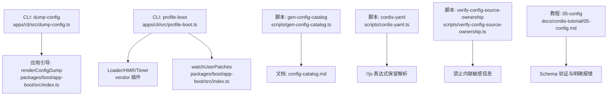
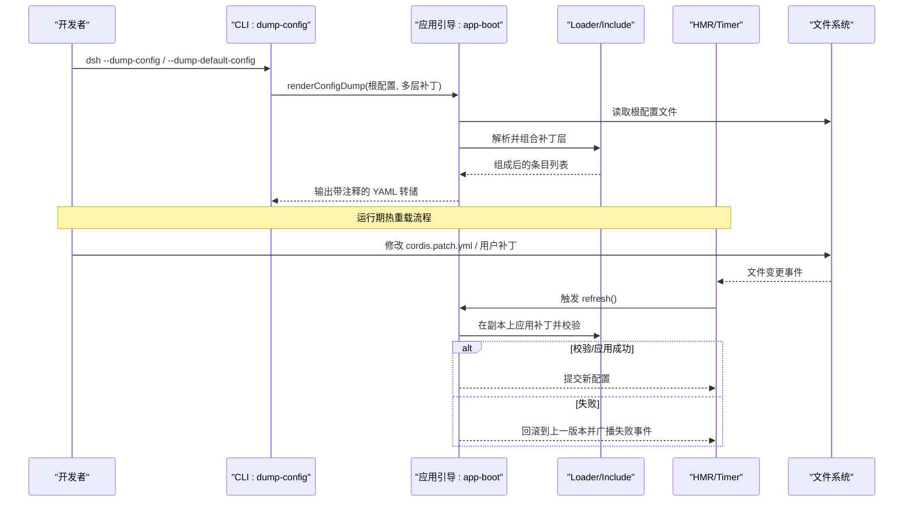
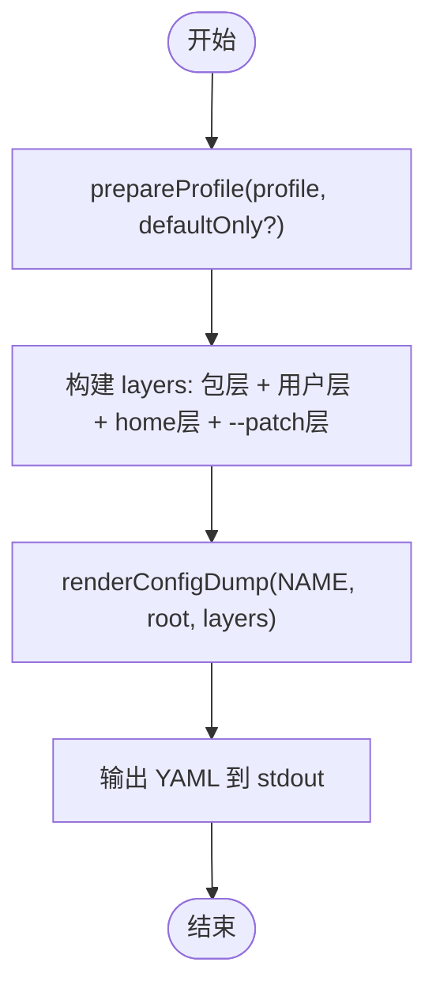
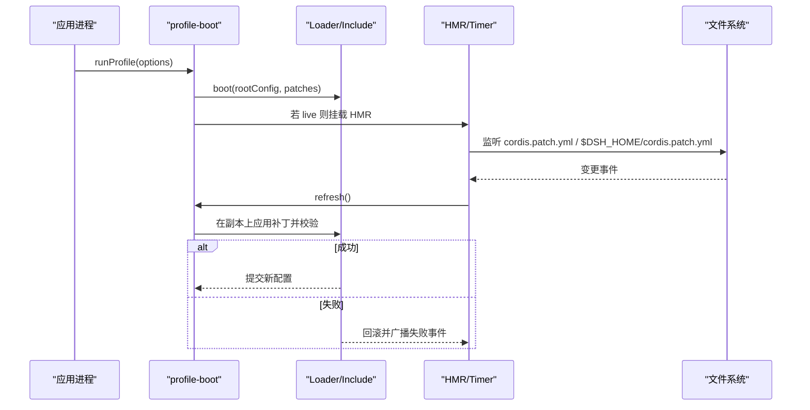
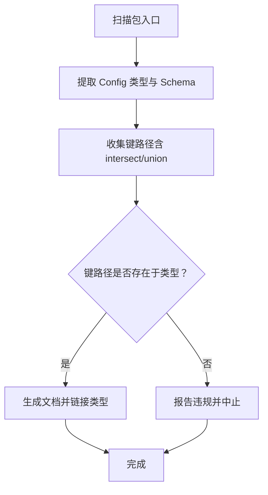
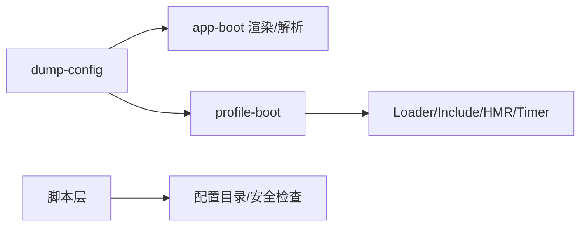

# 配置验证与调试

<cite>
**本文引用的文件**
- [dump-config.ts](file://apps/cli/src/dump-config.ts)
- [profile-boot.ts](file://apps/cli/src/profile-boot.ts)
- [index.ts（app-boot）](file://packages/boot/app-boot/src/index.ts)
- [gen-config-catalog.ts](file://scripts/gen-config-catalog.ts)
- [cordis-yaml.ts](file://scripts/cordis-yaml.ts)
- [verify-config-source-ownership.ts](file://scripts/verify-config-source-ownership.ts)
- [05-config.md](file://docs/cordis-tutorial/05-config.md)
- [inherited.md](file://docs/cordis-api/inherited.md)
- [hmr-config.spec.ts](file://packages/boot/app-boot/tests/hmr-config.spec.ts)
- [user-patches.spec.ts](file://packages/boot/app-boot/tests/user-patches.spec.ts)
- [error.ts（llm）](file://packages/llm/llm/src/error.ts)
</cite>

## 目录
1. [简介](#简介)
2. [项目结构](#项目结构)
3. [核心组件](#核心组件)
4. [架构总览](#架构总览)
5. [详细组件分析](#详细组件分析)
6. [依赖关系分析](#依赖关系分析)
7. [性能考虑](#性能考虑)
8. [故障排查指南](#故障排查指南)
9. [结论](#结论)
10. [附录](#附录)

## 简介
本文件面向 DeepSeek Harness 的配置系统，聚焦“配置验证与调试”的完整闭环：从配置的语法、类型与依赖校验，到运行时热重载与动态更新；从配置转储、错误链诊断到性能监控与最佳实践。文档以仓库中的 CLI、应用启动、HMR、脚本工具与教程为依据，提供可操作的排障路径与扩展指南。

## 项目结构
围绕配置验证与调试的关键位置如下：
- CLI 层：提供配置转储入口，按 profile 组装补丁层并输出 YAML。
- 应用启动层：负责加载 profile、组合补丁栈、安装失败即停策略、挂载 HMR 并监听用户补丁变更。
- 应用引导库：提供渲染配置转储、解析与校验基础能力。
- 脚本与检查：生成配置目录、解析带 !!js 的 YAML、校验 shipped 配置来源安全。
- 教程与 API：说明插件配置 schema 验证机制与事件体系。

图表来源
- [dump-config.ts:1-54](file://apps/cli/src/dump-config.ts#L1-L54)
- [index.ts（app-boot）:400-430](file://packages/boot/app-boot/src/index.ts#L400-L430)
- [profile-boot.ts:1-321](file://apps/cli/src/profile-boot.ts#L1-L321)
- [gen-config-catalog.ts:1-200](file://scripts/gen-config-catalog.ts#L1-L200)
- [cordis-yaml.ts:1-41](file://scripts/cordis-yaml.ts#L1-L41)
- [verify-config-source-ownership.ts:1-22](file://scripts/verify-config-source-ownership.ts#L1-L22)
- [05-config.md:1-66](file://docs/cordis-tutorial/05-config.md#L1-L66)

章节来源
- [dump-config.ts:1-54](file://apps/cli/src/dump-config.ts#L1-L54)
- [profile-boot.ts:1-321](file://apps/cli/src/profile-boot.ts#L1-L321)
- [index.ts（app-boot）:400-430](file://packages/boot/app-boot/src/index.ts#L400-L430)
- [gen-config-catalog.ts:1-200](file://scripts/gen-config-catalog.ts#L1-L200)
- [cordis-yaml.ts:1-41](file://scripts/cordis-yaml.ts#L1-L41)
- [verify-config-source-ownership.ts:1-22](file://scripts/verify-config-source-ownership.ts#L1-L22)
- [05-config.md:1-66](file://docs/cordis-tutorial/05-config.md#L1-L66)

## 核心组件
- 配置转储（dump-config）
  - 作用：在不启动应用的前提下，按 profile 的补丁层顺序输出最终配置树，便于对比默认与用户覆盖差异。
  - 关键点：支持仅输出默认层或包含用户层与 --patch 叠加层；基于 Loader 的 include 算法但不执行 !!js。
- 应用启动与热重载（profile-boot）
  - 作用：加载 profile、组合补丁栈、安装 fail-loud、在 live 模式下挂载 HMR 并监听用户补丁变更。
  - 关键点：每次重新组合使用结构化克隆避免引用污染；支持 home 级补丁与 --patch 叠加；失败时回滚并保持旧状态。
- 配置目录生成与校验（gen-config-catalog）
  - 作用：扫描包入口、提取 Config 类型与 Schema，生成文档并校验键路径与类型一致性。
  - 关键点：对 intersect/union 等组合模式进行键收集；强制要求 schema 枚举路径存在于声明类型上。
- YAML 解析与 !!js 处理（cordis-yaml）
  - 作用：在解析 Cordis YAML 时保留 !!js 表达式为数据而非执行，供后续 Loader 安全处理。
- 安全限制（verify-config-source-ownership）
  - 作用：禁止 shipped 配置中内联敏感字段（如 apiKey/baseURL 等），防止凭据泄露。
- 插件配置验证（教程）
  - 作用：每个插件导出 Schema，Cordis 在 apply 前验证配置，错误立即抛出，确保插件不会半配启动。

章节来源
- [dump-config.ts:1-54](file://apps/cli/src/dump-config.ts#L1-L54)
- [profile-boot.ts:1-321](file://apps/cli/src/profile-boot.ts#L1-L321)
- [gen-config-catalog.ts:1-200](file://scripts/gen-config-catalog.ts#L1-L200)
- [cordis-yaml.ts:1-41](file://scripts/cordis-yaml.ts#L1-L41)
- [verify-config-source-ownership.ts:1-22](file://scripts/verify-config-source-ownership.ts#L1-L22)
- [05-config.md:1-66](file://docs/cordis-tutorial/05-config.md#L1-L66)

## 架构总览
下图展示配置从“静态定义与校验”到“运行时加载与热重载”的全链路。

图表来源
- [dump-config.ts:1-54](file://apps/cli/src/dump-config.ts#L1-L54)
- [index.ts（app-boot）:400-430](file://packages/boot/app-boot/src/index.ts#L400-L430)
- [profile-boot.ts:243-313](file://apps/cli/src/profile-boot.ts#L243-L313)
- [hmr-config.spec.ts:109-137](file://packages/boot/app-boot/tests/hmr-config.spec.ts#L109-L137)
- [user-patches.spec.ts:355-381](file://packages/boot/app-boot/tests/user-patches.spec.ts#L355-L381)

## 详细组件分析

### 配置转储（dump-config）
- 功能要点
  - 按 profile 的 bundle 层、profile 自身 patch、home 级 patch、--patch 叠加层顺序组装。
  - 输出带源注释的 YAML，便于定位每层的贡献。
  - 支持“仅默认层”模式，用于对比用户覆盖。
- 关键实现路径
  - CLI 入口调用 prepareProfile 获取 profile 与 layers。
  - 将各层转换为 ConfigDumpLayer 并调用 renderConfigDump。
  - 以 Loader 的空根文件作为锚点，保证与运行时一致。

图表来源
- [dump-config.ts:1-54](file://apps/cli/src/dump-config.ts#L1-L54)
- [index.ts（app-boot）:400-430](file://packages/boot/app-boot/src/index.ts#L400-L430)

章节来源
- [dump-config.ts:1-54](file://apps/cli/src/dump-config.ts#L1-L54)
- [index.ts（app-boot）:400-430](file://packages/boot/app-boot/src/index.ts#L400-L430)

### 应用启动与热重载（profile-boot）
- 功能要点
  - 组合补丁栈：bundle 层 → profile 层 → home 层 → overlays（--patch）→ 遥测开关。
  - 首次启动：写入空根配置，装载 Loader/Timer/HMR，安装 fail-loud。
  - 热重载：仅在 live 模式下启用；监听用户补丁变化，增量刷新并回滚失败。
  - 安全性：每次重组使用结构化克隆，避免引用污染导致旧值残留。
- 关键行为
  - watchUserPatches 同时监听 profile 与 home 补丁文件。
  - 失败通过 hmr/config-update-failed 事件广播，不中断后续刷新。
  - 进程信号（SIGTERM/SIGINT）与快速退出（ctx.appExit）统一收敛到 shutdown。

图表来源
- [profile-boot.ts:157-174](file://apps/cli/src/profile-boot.ts#L157-L174)
- [profile-boot.ts:243-313](file://apps/cli/src/profile-boot.ts#L243-L313)
- [hmr-config.spec.ts:109-137](file://packages/boot/app-boot/tests/hmr-config.spec.ts#L109-L137)
- [user-patches.spec.ts:355-381](file://packages/boot/app-boot/tests/user-patches.spec.ts#L355-L381)

章节来源
- [profile-boot.ts:157-174](file://apps/cli/src/profile-boot.ts#L157-L174)
- [profile-boot.ts:243-313](file://apps/cli/src/profile-boot.ts#L243-L313)
- [hmr-config.spec.ts:109-137](file://packages/boot/app-boot/tests/hmr-config.spec.ts#L109-L137)
- [user-patches.spec.ts:355-381](file://packages/boot/app-boot/tests/user-patches.spec.ts#L355-L381)

### 配置目录生成与类型/依赖校验（gen-config-catalog）
- 功能要点
  - 扫描包入口，提取 Config 类型与 Schema，生成 docs/config-catalog.md。
  - 对 intersect/union 组合模式收集所有键路径，并校验这些路径必须存在于声明的类型上。
  - 对未解析的外部类型保持“未知”，但会硬错误于无法静态遍历的形状，保证目录为“唯一真相”。
- 关键规则
  - 相对导入需显式 .ts 扩展名，且不允许跨包别名。
  - 成员属性需具备 JSDoc 文档，否则报告违规。
  - 支持全局类型白名单，新增需显式维护。

图表来源
- [gen-config-catalog.ts:1-200](file://scripts/gen-config-catalog.ts#L1-L200)
- [gen-config-catalog.ts:463-757](file://scripts/gen-config-catalog.ts#L463-L757)

章节来源
- [gen-config-catalog.ts:1-200](file://scripts/gen-config-catalog.ts#L1-L200)
- [gen-config-catalog.ts:463-757](file://scripts/gen-config-catalog.ts#L463-L757)

### YAML 解析与 !!js 处理（cordis-yaml）
- 功能要点
  - 扩展 YAML 解析器，保留 !!js 表达式为数据对象，避免在解析阶段执行任意代码。
  - 提供 isJsExpr 判断，供上层安全消费。
- 适用场景
  - Loader 在受控环境下再执行 !!js 表达式，提升安全性与可审计性。

章节来源
- [cordis-yaml.ts:1-41](file://scripts/cordis-yaml.ts#L1-L41)

### 安全限制（verify-config-source-ownership）
- 功能要点
  - 针对 shipped 配置（apps/*/config、packages/*/*/cordis.patch.yml、python 内置配置）禁止内联敏感字段（apiKey/baseURL/authToken 等）。
  - 通过正则匹配行级形式，提前阻断凭据泄露风险。

章节来源
- [verify-config-source-ownership.ts:1-22](file://scripts/verify-config-source-ownership.ts#L1-L22)

### 插件配置验证（教程）
- 功能要点
  - 插件导出 Config 接口与同名 Schema，Cordis 在 apply 前验证配置。
  - 错误配置会抛出 ValidationError，并给出精确路径提示，确保插件不会半配启动。
  - 支持默认值填充，apply 始终接收完整配置。

章节来源
- [05-config.md:1-66](file://docs/cordis-tutorial/05-config.md#L1-L66)

## 依赖关系分析
- 组件耦合
  - CLI dump-config 依赖 app-boot 的渲染与解析能力，以及 profile-boot 的 profile 准备。
  - profile-boot 依赖 Loader/Include/HMR/Timer 等 vendor 插件，并通过 watchUserPatches 协调热重载。
  - 脚本层独立于运行时，用于生成文档与静态校验。
- 外部依赖
  - Loader/Include/HMR/Timer 由 vendor 提供，通过 Context 注入服务。
  - YAML 解析使用 js-yaml，并扩展 !!js 标签。
- 潜在循环
  - 运行时通过事件解耦（如 hmr/config-update-failed），避免直接循环依赖。

图表来源
- [dump-config.ts:1-54](file://apps/cli/src/dump-config.ts#L1-L54)
- [profile-boot.ts:1-321](file://apps/cli/src/profile-boot.ts#L1-L321)
- [gen-config-catalog.ts:1-200](file://scripts/gen-config-catalog.ts#L1-L200)
- [cordis-yaml.ts:1-41](file://scripts/cordis-yaml.ts#L1-L41)

章节来源
- [dump-config.ts:1-54](file://apps/cli/src/dump-config.ts#L1-L54)
- [profile-boot.ts:1-321](file://apps/cli/src/profile-boot.ts#L1-L321)
- [gen-config-catalog.ts:1-200](file://scripts/gen-config-catalog.ts#L1-L200)
- [cordis-yaml.ts:1-41](file://scripts/cordis-yaml.ts#L1-L41)

## 性能考虑
- 热重载开销控制
  - 文件变更合并与去抖：chokidar 默认原子写合并窗口，避免频繁刷新。
  - 串行化刷新：registerConfig 返回 disposer，确保销毁时等待活跃工作完成。
  - 副本重组：每次重组使用结构化克隆，避免共享引用导致的额外比对成本。
- 日志与诊断
  - 错误链渲染：聚合 cause 链与 AggregateError 成员，减少重复渲染与遮蔽。
  - 子代理诊断截断：限制字节数并保留标记，避免超大诊断影响性能。
- 建议
  - 尽量使用增量补丁与 id 目标替换，减少全量重建。
  - 在开发环境开启 HMR，生产环境关闭模块重载，仅保留配置热更新。

章节来源
- [hmr-config.spec.ts:109-137](file://packages/boot/app-boot/tests/hmr-config.spec.ts#L109-L137)
- [user-patches.spec.ts:355-381](file://packages/boot/app-boot/tests/user-patches.spec.ts#L355-L381)
- [error.ts（llm）:102-130](file://packages/llm/llm/src/error.ts#L102-L130)

## 故障排查指南
- 常见错误与定位
  - 配置语法错误：使用 dsh --dump-config 查看最终 YAML，结合错误消息定位具体层。
  - 类型不匹配：根据教程中的 ValidationError 提示，修正 schema 与配置项类型。
  - 依赖缺失：gen-config-catalog 会报告无法解析的类型或键路径缺失。
  - 敏感信息泄露：verify-config-source-ownership 会拒绝内联 apiKey/baseURL 等。
- 热重载问题
  - 观察 hmr/config-update-failed 事件，确认失败原因与回滚是否生效。
  - 检查 watcher 是否正确注册到确切路径，并在父目录不存在时仍能创建监听。
- 调试技巧
  - 使用 --dump-default-config 与 --dump-config 对比，快速识别用户覆盖。
  - 在 live 模式下逐步缩小补丁范围，定位冲突层。
  - 关注进程信号与快速退出，确保资源正确释放。

章节来源
- [dump-config.ts:1-54](file://apps/cli/src/dump-config.ts#L1-L54)
- [05-config.md:1-66](file://docs/cordis-tutorial/05-config.md#L1-L66)
- [gen-config-catalog.ts:1-200](file://scripts/gen-config-catalog.ts#L1-L200)
- [verify-config-source-ownership.ts:1-22](file://scripts/verify-config-source-ownership.ts#L1-L22)
- [hmr-config.spec.ts:109-137](file://packages/boot/app-boot/tests/hmr-config.spec.ts#L109-L137)
- [user-patches.spec.ts:355-381](file://packages/boot/app-boot/tests/user-patches.spec.ts#L355-L381)

## 结论
DeepSeek Harness 的配置系统通过“静态校验 + 运行时验证 + 热重载回滚”的组合，实现了高可靠的可观测性与可维护性。借助配置转储、错误链诊断与脚本化工具，用户可以高效定位问题并安全地迭代配置。遵循最佳实践与性能建议，可在开发与生产环境中获得一致的体验。

## 附录
- 事件参考
  - 内部事件与 HMR/Loader 事件可用于钩入配置更新生命周期，详见继承事件文档。
- 自定义验证器与调试钩子
  - 在插件中导出 Schema，利用 Standard Schema 兼容的验证器进行类型与约束校验。
  - 订阅 hmr/config-update-failed 等事件，记录失败上下文并实现告警。
- 最佳实践
  - 将公共配置放入 bundle 层，用户特定配置放入 profile/home 层，避免冲突。
  - 使用 id 目标替换而非整行覆盖，提高可维护性。
  - 在 CI 中运行 gen-config-catalog 与 verify-config-source-ownership，确保文档与安全策略同步。

章节来源
- [inherited.md:23-40](file://docs/cordis-api/inherited.md#L23-L40)
- [05-config.md:1-66](file://docs/cordis-tutorial/05-config.md#L1-L66)
- [gen-config-catalog.ts:1-200](file://scripts/gen-config-catalog.ts#L1-L200)
- [verify-config-source-ownership.ts:1-22](file://scripts/verify-config-source-ownership.ts#L1-L22)