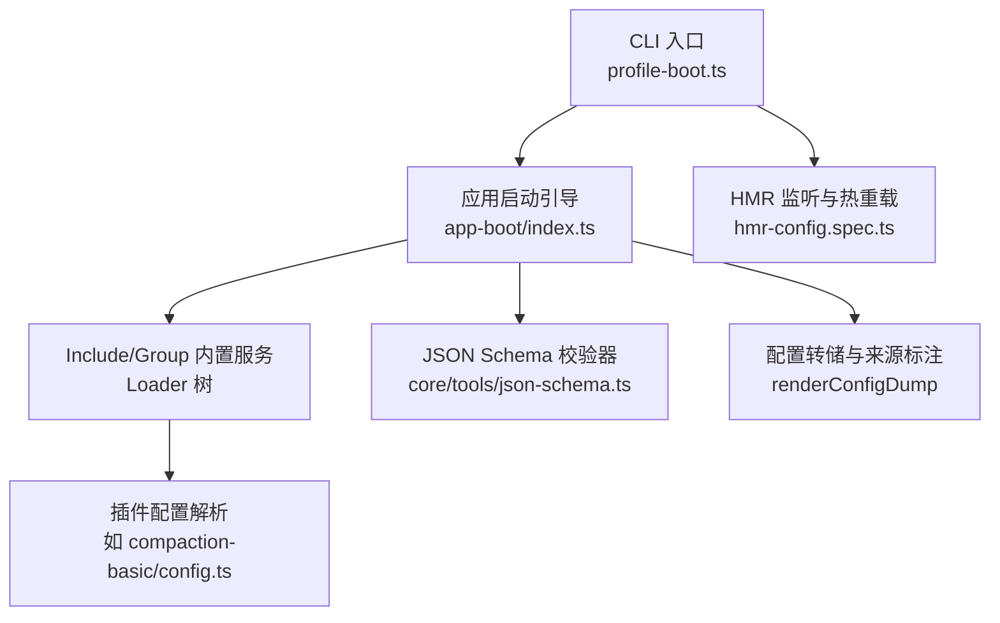
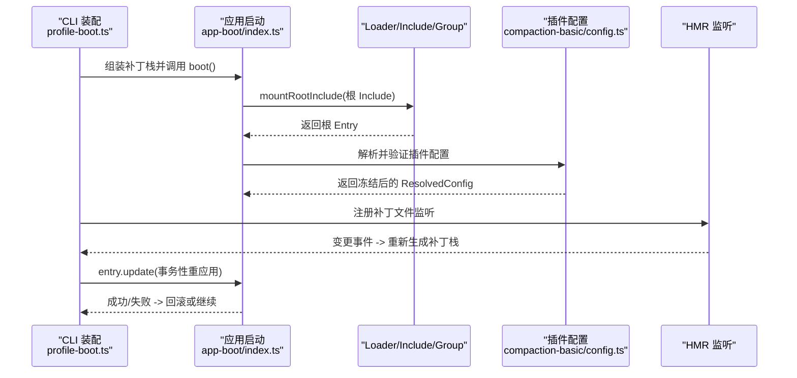
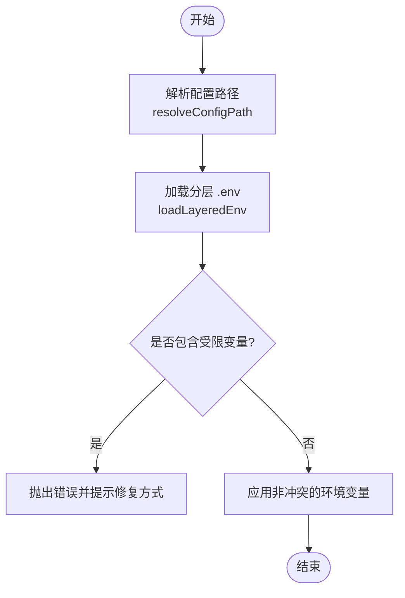
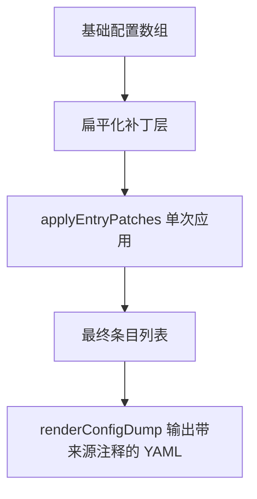
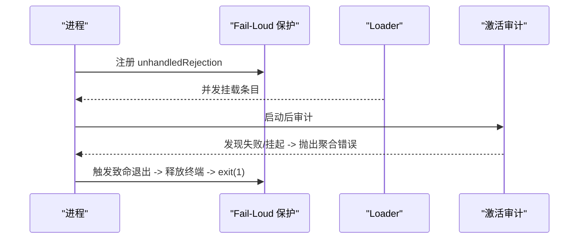
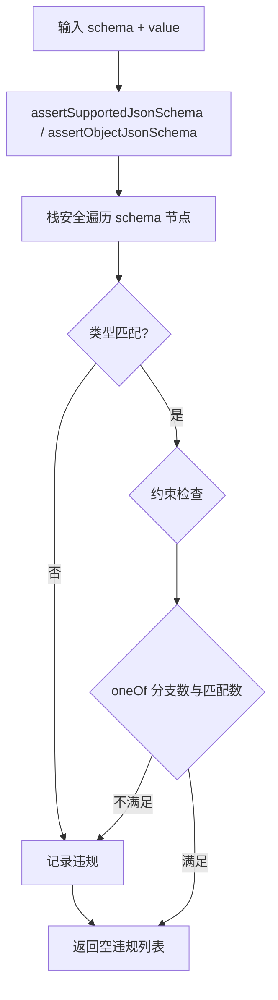
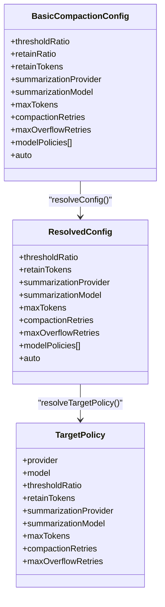
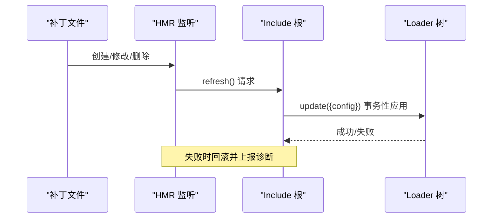
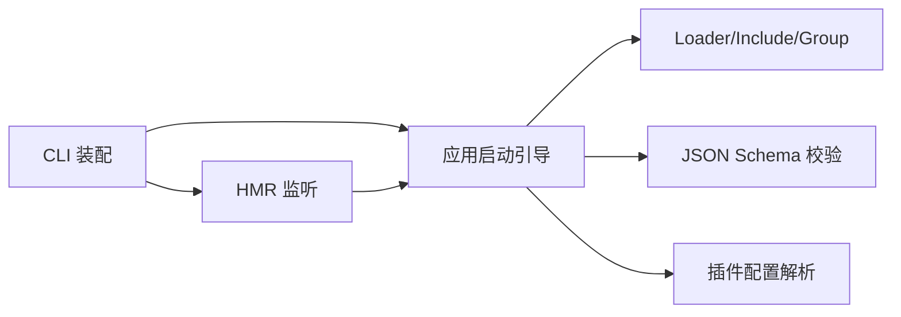

# 配置验证与故障排查

<cite>
**本文引用的文件**
- [packages/boot/app-boot/src/index.ts](file://packages/boot/app-boot/src/index.ts)
- [apps/cli/src/profile-boot.ts](file://apps/cli/src/profile-boot.ts)
- [packages/core/tools/src/json-schema.ts](file://packages/core/tools/src/json-schema.ts)
- [packages/compaction/compaction-basic/src/config.ts](file://packages/compaction/compaction-basic/src/config.ts)
- [packages/boot/app-boot/tests/hmr-config.spec.ts](file://packages/boot/app-boot/tests/hmr-config.spec.ts)
- [scripts/gen-config-catalog.ts](file://scripts/gen-config-catalog.ts)
</cite>

## 目录
1. [简介](#简介)
2. [项目结构](#项目结构)
3. [核心组件](#核心组件)
4. [架构总览](#架构总览)
5. [详细组件分析](#详细组件分析)
6. [依赖关系分析](#依赖关系分析)
7. [性能考虑](#性能考虑)
8. [故障排查指南](#故障排查指南)
9. [结论](#结论)
10. [附录](#附录)

## 简介
本文件面向 DeepSeek Harness 的配置系统，聚焦“配置验证、错误检测、调试与日志、热重载与恢复、性能调优、自定义验证规则编写”等主题。文档基于仓库中的启动引导、CLI 配置装配、JSON Schema 校验、插件级配置解析以及 HMR（热模块替换）相关实现进行系统化说明，并提供可操作的排障流程与最佳实践。

## 项目结构
DeepSeek Harness 的配置与验证涉及多个层次：
- 应用启动层：负责加载环境变量、解析配置文件路径、挂载根 Include、执行 boot 并审计条目激活状态。
- CLI 装配层：组合 profile、bundle、用户补丁、覆盖层与遥测开关，驱动 boot 并安装 HMR 监听。
- 通用校验层：提供受控 JSON Schema 子集的强校验能力，用于工具输出、工作流、子代理等结构化数据。
- 插件配置层：各插件在自身 config.ts 中定义键集合、默认值、范围约束与目标策略合并。
- 调试与诊断：提供配置转储、HMR 精确路径监听、失败即退出保护、条目激活断言等。

**图示来源**
- [apps/cli/src/profile-boot.ts:157-174](file://apps/cli/src/profile-boot.ts#L157-L174)
- [packages/boot/app-boot/src/index.ts:519-562](file://packages/boot/app-boot/src/index.ts#L519-L562)
- [packages/compaction/compaction-basic/src/config.ts:67-97](file://packages/compaction/compaction-basic/src/config.ts#L67-L97)
- [packages/core/tools/src/json-schema.ts:385-405](file://packages/core/tools/src/json-schema.ts#L385-L405)
- [packages/boot/app-boot/tests/hmr-config.spec.ts:139-179](file://packages/boot/app-boot/tests/hmr-config.spec.ts#L139-L179)

**章节来源**
- [apps/cli/src/profile-boot.ts:157-174](file://apps/cli/src/profile-boot.ts#L157-L174)
- [packages/boot/app-boot/src/index.ts:519-562](file://packages/boot/app-boot/src/index.ts#L519-L562)

## 核心组件
- 配置路径与环境加载
  - 支持快照模式下的配置文件名替换；安全加载 .env 并拒绝危险变量注入。
- 根 Include 挂载与补丁叠加
  - 将 base 配置与多层 patch（bundle、profile、home、overlay、遥测开关）按序扁平化应用。
- 配置转储与来源追踪
  - 以带注释的 YAML 输出最终组成结果，标注每行来源及被哪些层修改过。
- 失败即退出保护
  - 捕获未处理拒绝，打印诊断并等待终端释放后退出，避免终端状态残留。
- 条目激活审计
  - 检查所有启用条目的 fiber 状态，收集缺失服务或激活失败原因并抛出聚合错误。
- JSON Schema 强校验
  - 仅允许受控关键字，严格类型与约束检查，返回完整违规列表。
- 插件配置解析
  - 白名单键校验、默认值合并、范围与互斥约束、目标策略合并与预算计算。
- HMR 与热重载
  - 精确路径监听、串行刷新、初始扫描抑制、回收时等待任务完成。

**章节来源**
- [packages/boot/app-boot/src/index.ts:64-72](file://packages/boot/app-boot/src/index.ts#L64-L72)
- [packages/boot/app-boot/src/index.ts:198-219](file://packages/boot/app-boot/src/index.ts#L198-L219)
- [packages/boot/app-boot/src/index.ts:353-371](file://packages/boot/app-boot/src/index.ts#L353-L371)
- [packages/boot/app-boot/src/index.ts:412-475](file://packages/boot/app-boot/src/index.ts#L412-L475)
- [packages/boot/app-boot/src/index.ts:642-682](file://packages/boot/app-boot/src/index.ts#L642-L682)
- [packages/boot/app-boot/src/index.ts:725-758](file://packages/boot/app-boot/src/index.ts#L725-L758)
- [packages/core/tools/src/json-schema.ts:385-405](file://packages/core/tools/src/json-schema.ts#L385-L405)
- [packages/compaction/compaction-basic/src/config.ts:67-97](file://packages/compaction/compaction-basic/src/config.ts#L67-L97)
- [packages/boot/app-boot/tests/hmr-config.spec.ts:139-179](file://packages/boot/app-boot/tests/hmr-config.spec.ts#L139-L179)

## 架构总览
下图展示从 CLI 到 Loader 树、再到插件配置的完整装配与验证链路，以及 HMR 对补丁层的监听与事务性更新。

**图示来源**
- [apps/cli/src/profile-boot.ts:210-276](file://apps/cli/src/profile-boot.ts#L210-L276)
- [packages/boot/app-boot/src/index.ts:519-562](file://packages/boot/app-boot/src/index.ts#L519-L562)
- [packages/compaction/compaction-basic/src/config.ts:67-97](file://packages/compaction/compaction-basic/src/config.ts#L67-L97)
- [packages/boot/app-boot/tests/hmr-config.spec.ts:139-179](file://packages/boot/app-boot/tests/hmr-config.spec.ts#L139-L179)

## 详细组件分析

### 配置路径与环境加载
- 配置文件路径解析支持“回放模式”下自动切换为快照文件。
- 分层加载 .env：进程环境 > 项目目录 > Harness Home；先解析再应用，防止部分生效。
- 禁止在 .env 中设置关键引导变量（如网络代理、TLS、解释器钩子等），Home 层仅允许特定代理变量。

**图示来源**
- [packages/boot/app-boot/src/index.ts:64-72](file://packages/boot/app-boot/src/index.ts#L64-L72)
- [packages/boot/app-boot/src/index.ts:198-219](file://packages/boot/app-boot/src/index.ts#L198-L219)

**章节来源**
- [packages/boot/app-boot/src/index.ts:64-72](file://packages/boot/app-boot/src/index.ts#L64-L72)
- [packages/boot/app-boot/src/index.ts:198-219](file://packages/boot/app-boot/src/index.ts#L198-L219)

### 根 Include 挂载与补丁叠加
- 将 base 配置与多层 patch 按顺序扁平化，并通过 include 的 applyEntryPatches 一次性应用，保证可见性与顺序一致性。
- 支持相对路径插入插件名的锚定转换。
- 通过 renderConfigDump 输出带来源注释的最终 YAML，便于定位来源与变更影响。

**图示来源**
- [packages/boot/app-boot/src/index.ts:353-371](file://packages/boot/app-boot/src/index.ts#L353-L371)
- [packages/boot/app-boot/src/index.ts:412-475](file://packages/boot/app-boot/src/index.ts#L412-L475)

**章节来源**
- [packages/boot/app-boot/src/index.ts:353-371](file://packages/boot/app-boot/src/index.ts#L353-L371)
- [packages/boot/app-boot/src/index.ts:412-475](file://packages/boot/app-boot/src/index.ts#L412-L475)

### 失败即退出保护与条目激活审计
- 安装 unhandledRejection 处理器，打印诊断并在超时内等待释放钩子，确保终端状态恢复。
- 启动后审计所有启用条目：若存在未加载或未激活的条目，收集缺失服务或失败原因并抛出聚合错误。

**图示来源**
- [packages/boot/app-boot/src/index.ts:642-682](file://packages/boot/app-boot/src/index.ts#L642-L682)
- [packages/boot/app-boot/src/index.ts:725-758](file://packages/boot/app-boot/src/index.ts#L725-L758)

**章节来源**
- [packages/boot/app-boot/src/index.ts:642-682](file://packages/boot/app-boot/src/index.ts#L642-L682)
- [packages/boot/app-boot/src/index.ts:725-758](file://packages/boot/app-boot/src/index.ts#L725-L758)

### JSON Schema 强校验
- 仅允许受控关键字：type、oneOf、properties、required、additionalProperties、items、enum、const 及注解字段。
- 严格类型检查、枚举/常量约束、oneOf 唯一匹配、对象属性必需与额外属性控制。
- 返回值包含所有违规路径，便于批量修复。

**图示来源**
- [packages/core/tools/src/json-schema.ts:385-405](file://packages/core/tools/src/json-schema.ts#L385-L405)
- [packages/core/tools/src/json-schema.ts:486-656](file://packages/core/tools/src/json-schema.ts#L486-L656)

**章节来源**
- [packages/core/tools/src/json-schema.ts:385-405](file://packages/core/tools/src/json-schema.ts#L385-L405)
- [packages/core/tools/src/json-schema.ts:486-656](file://packages/core/tools/src/json-schema.ts#L486-L656)

### 插件配置解析（以压缩策略为例）
- 白名单键校验，未知键直接报错。
- 默认值合并与范围约束：阈值比例、保留比例/令牌、最大令牌、重试次数等。
- 目标策略合并：按 provider/model 精确覆盖，计算 token 预算并校验 retain < threshold。
- 摘要目标成对校验：provider 与 model 必须同时为空或非空。

**图示来源**
- [packages/compaction/compaction-basic/src/config.ts:67-97](file://packages/compaction/compaction-basic/src/config.ts#L67-L97)
- [packages/compaction/compaction-basic/src/config.ts:105-125](file://packages/compaction/compaction-basic/src/config.ts#L105-L125)

**章节来源**
- [packages/compaction/compaction-basic/src/config.ts:67-97](file://packages/compaction/compaction-basic/src/config.ts#L67-L97)
- [packages/compaction/compaction-basic/src/config.ts:105-125](file://packages/compaction/compaction-basic/src/config.ts#L105-L125)
- [packages/compaction/compaction-basic/src/config.ts:133-167](file://packages/compaction/compaction-basic/src/config.ts#L133-L167)

### HMR 与热重载机制
- 精确路径监听：针对 cordis.patch.yml 与 home 补丁文件建立 watcher。
- 串行刷新：同一文件的多次写入会被节流与序列化，避免并发更新导致的状态错乱。
- 初始扫描抑制：主 watcher 忽略初始扫描事件，避免与首次 apply 竞争。
- 回收等待：dispose 会等待队列中的刷新任务完成，确保清理顺序正确。

**图示来源**
- [packages/boot/app-boot/src/index.ts:253-285](file://packages/boot/app-boot/src/index.ts#L253-L285)
- [packages/boot/app-boot/tests/hmr-config.spec.ts:139-179](file://packages/boot/app-boot/tests/hmr-config.spec.ts#L139-L179)

**章节来源**
- [packages/boot/app-boot/src/index.ts:253-285](file://packages/boot/app-boot/src/index.ts#L253-L285)
- [packages/boot/app-boot/tests/hmr-config.spec.ts:139-179](file://packages/boot/app-boot/tests/hmr-config.spec.ts#L139-L179)

## 依赖关系分析
- CLI 装配依赖应用启动引导提供的 boot、mountRootInclude、watchUserPatches 等能力。
- 应用启动引导依赖 Loader、Include、Group 内置服务，并通过 JSON Schema 校验器保障结构化数据。
- 插件配置解析依赖统一的键白名单与范围校验工具，确保配置一致性与安全性。
- HMR 依赖 Timer 与 HMR 插件，CLI 会在需要时按需挂载。

**图示来源**
- [apps/cli/src/profile-boot.ts:210-276](file://apps/cli/src/profile-boot.ts#L210-L276)
- [packages/boot/app-boot/src/index.ts:519-562](file://packages/boot/app-boot/src/index.ts#L519-L562)
- [packages/core/tools/src/json-schema.ts:385-405](file://packages/core/tools/src/json-schema.ts#L385-L405)
- [packages/compaction/compaction-basic/src/config.ts:67-97](file://packages/compaction/compaction-basic/src/config.ts#L67-L97)

**章节来源**
- [apps/cli/src/profile-boot.ts:210-276](file://apps/cli/src/profile-boot.ts#L210-L276)
- [packages/boot/app-boot/src/index.ts:519-562](file://packages/boot/app-boot/src/index.ts#L519-L562)

## 性能考虑
- 补丁应用采用单次扁平化与一次 applyEntryPatches 调用，减少中间态与重复计算。
- HMR 使用节流与串行队列，避免高频编辑导致的并发竞争与死锁。
- 配置转储仅在调试场景使用，生产环境建议关闭或限制频率。
- 插件配置解析中对数值型参数进行快速范围检查，尽早失败以减少后续开销。
- 对于大模型上下文窗口相关的压缩策略，合理设置 thresholdRatio 与 retainTokens，避免过度压缩或内存压力。

[本节为通用指导，无需具体文件引用]

## 故障排查指南
- 常见错误与定位
  - 配置文件格式错误：YAML 解析失败或顶层非数组，查看 parsePatchList 的错误信息。
  - 环境变量污染：.env 设置了受限变量，根据错误提示将变量移至进程环境或 Home 层。
  - 插件未激活：assertEntriesActivated 会列出未激活条目及其缺失服务。
  - JSON Schema 校验失败：collect 所有违规路径，逐项修复。
  - 插件配置键错误：validateKeys 会报告未知键；范围校验失败会给出具体数值要求。
- 调试工具
  - 配置转储：使用 renderConfigDump 输出带来源注释的 YAML，定位补丁影响。
  - HMR 监听：通过 hmr-config.spec 中的用例思路，验证精确路径监听与串行刷新。
  - 失败即退出：观察 stderr 诊断与退出码，确认终端释放是否成功。
- 热重载问题
  - 初始扫描竞争：确保主 watcher 忽略初始事件，避免与首次 apply 竞争。
  - 回收死锁：确保 dispose 等待刷新任务完成，避免在回收阶段阻塞。
- 恢复机制
  - 事务性更新：update 失败时回滚已变更条目，保持树一致性。
  - 失败即退出：在终端释放后统一退出，避免半残状态。

**章节来源**
- [packages/boot/app-boot/src/index.ts:353-371](file://packages/boot/app-boot/src/index.ts#L353-L371)
- [packages/boot/app-boot/src/index.ts:198-219](file://packages/boot/app-boot/src/index.ts#L198-L219)
- [packages/boot/app-boot/src/index.ts:725-758](file://packages/boot/app-boot/src/index.ts#L725-L758)
- [packages/core/tools/src/json-schema.ts:385-405](file://packages/core/tools/src/json-schema.ts#L385-L405)
- [packages/compaction/compaction-basic/src/config.ts:277-282](file://packages/compaction/compaction-basic/src/config.ts#L277-L282)
- [packages/boot/app-boot/src/index.ts:412-475](file://packages/boot/app-boot/src/index.ts#L412-L475)
- [packages/boot/app-boot/tests/hmr-config.spec.ts:139-179](file://packages/boot/app-boot/tests/hmr-config.spec.ts#L139-L179)

## 结论
DeepSeek Harness 的配置系统通过分层装配、强校验、事务性热重载与严格的失败即退出策略，提供了高可靠、可观测且易调试的配置体验。结合配置转储、HMR 监听与插件级解析，能够快速定位与修复配置问题，并在运行时安全地应用变更。建议在团队中推广白名单键校验、范围约束与目标策略合并的最佳实践，以提升配置质量与稳定性。

## 附录
- 自定义配置验证规则编写要点
  - 明确键白名单与类型约束，优先使用 validateKeys 与范围断言函数。
  - 对复杂结构使用 JSON Schema 子集进行强校验，收集全部违规路径。
  - 对目标策略类配置，提供合并与预算计算函数，并在边界条件上抛出明确错误。
  - 在 CLI 或插件初始化阶段尽早校验，避免延迟失败。
- 参考实现路径
  - 键白名单与范围校验：见插件配置解析中的 validateKeys、assertPositiveInteger、assertRatio 等。
  - JSON Schema 强校验：见 core/tools/json-schema.ts 中的 assertSupportedJsonSchema 与 validateJsonSchemaValue。
  - 配置转储与来源标注：见 app-boot/index.ts 中的 renderConfigDump。
  - HMR 监听与串行刷新：见 hmr-config.spec.ts 中的测试用例思路。

**章节来源**
- [packages/compaction/compaction-basic/src/config.ts:277-311](file://packages/compaction/compaction-basic/src/config.ts#L277-L311)
- [packages/core/tools/src/json-schema.ts:385-405](file://packages/core/tools/src/json-schema.ts#L385-L405)
- [packages/core/tools/src/json-schema.ts:646-656](file://packages/core/tools/src/json-schema.ts#L646-L656)
- [packages/boot/app-boot/src/index.ts:412-475](file://packages/boot/app-boot/src/index.ts#L412-L475)
- [packages/boot/app-boot/tests/hmr-config.spec.ts:139-179](file://packages/boot/app-boot/tests/hmr-config.spec.ts#L139-L179)