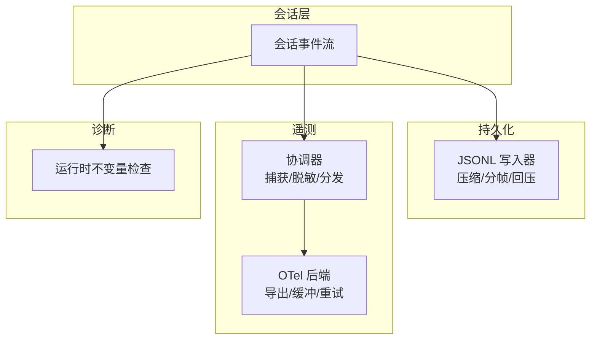
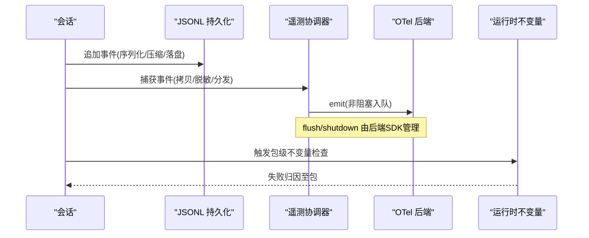
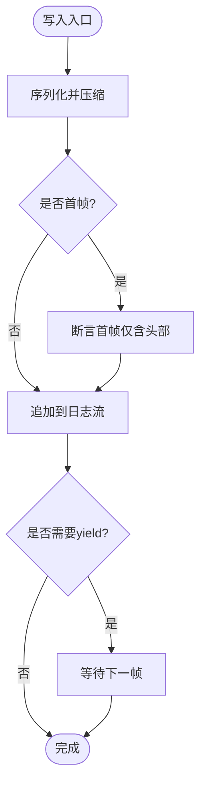
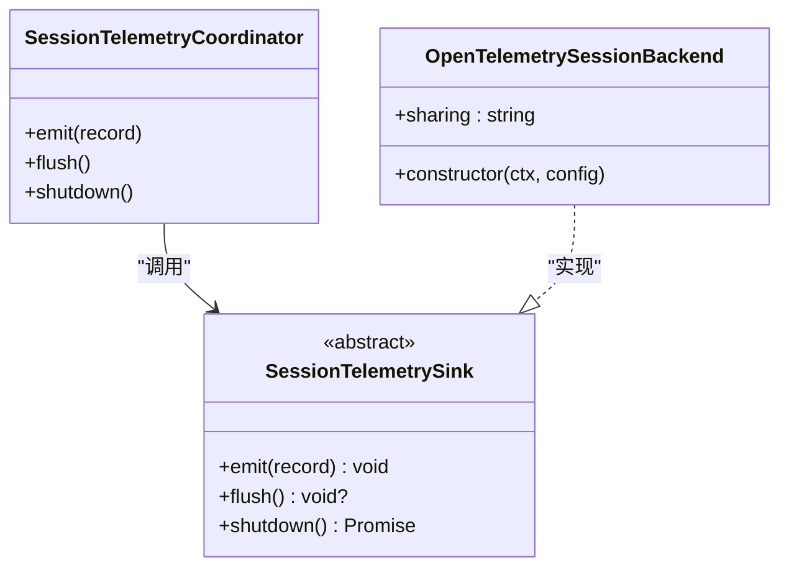
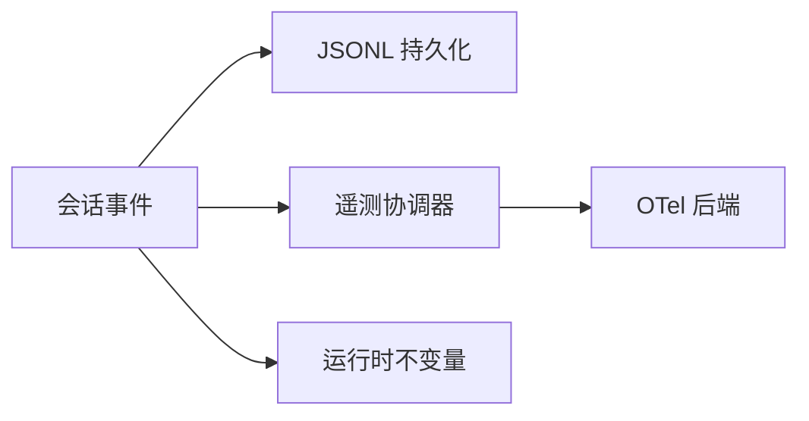

# 监控与日志管理

<cite>
**本文引用的文件**
- [packages/runtime-diagnostics/README.md](file://packages/runtime-diagnostics/README.md)
- [packages/session/session-telemetry/src/index.ts](file://packages/session/session-telemetry/src/index.ts)
- [packages/session/session-telemetry-otel/src/index.ts](file://packages/session/session-telemetry-otel/src/index.ts)
- [packages/session/session-persistence-jsonl/src/index.ts](file://packages/session/session-persistence-jsonl/src/index.ts)
- [packages/experimental/code-runtime-python/py/bootstrap.py](file://packages/experimental/code-runtime-python/py/bootstrap.py)
- [python/sdk/src/deepseek_harness/client.py](file://python/sdk/src/deepseek_harness/client.py)
- [apps/cli/src/profile-boot.ts](file://apps/cli/src/profile-boot.ts)
- [apps/cli/src/process-shutdown.ts](file://apps/cli/src/process-shutdown.ts)
- [docs/subsystems/session-telemetry.md](file://docs/subsystems/session-telemetry.md)
</cite>

## 目录
1. [简介](#简介)
2. [项目结构](#项目结构)
3. [核心组件](#核心组件)
4. [架构总览](#架构总览)
5. [详细组件分析](#详细组件分析)
6. [依赖关系分析](#依赖关系分析)
7. [性能考虑](#性能考虑)
8. [故障排查指南](#故障排查指南)
9. [结论](#结论)
10. [附录](#附录)

## 简介
本文件面向运维与平台工程师，系统化说明 DeepSeek Harness 的运行时诊断、监控与日志管理体系。内容涵盖：
- 运行时诊断系统的架构与数据收集机制
- 性能指标监控配置（CPU、内存、网络等）
- 结构化日志记录方案与日志聚合分析集成
- 告警规则与通知渠道设置方法
- 故障排查工具与性能调优指南

## 项目结构
DeepSeek Harness 将“会话事件持久化”“遥测导出”“运行时不变量检查”解耦为独立子系统，便于按需启用、组合与替换：
- 会话日志持久化：JSONL 格式、压缩、回压控制、冷启动优化
- 遥测后端：抽象接口 + OpenTelemetry 实现，支持模式切换与共享策略披露
- 运行时不变量：按包注册并运行契约校验，失败归因到拥有者包
- CLI 启动与进程关闭：启动画像、优雅停机、资源释放

图表来源
- [packages/session/session-persistence-jsonl/src/index.ts:55-83](file://packages/session/session-persistence-jsonl/src/index.ts#L55-L83)
- [packages/session/session-telemetry/src/index.ts:162-178](file://packages/session/session-telemetry/src/index.ts#L162-L178)
- [packages/session/session-telemetry-otel/src/index.ts:141-168](file://packages/session/session-telemetry-otel/src/index.ts#L141-L168)
- [packages/runtime-diagnostics/README.md:1-50](file://packages/runtime-diagnostics/README.md#L1-L50)

章节来源
- [packages/runtime-diagnostics/README.md:1-50](file://packages/runtime-diagnostics/README.md#L1-L50)
- [packages/session/session-persistence-jsonl/src/index.ts:55-83](file://packages/session/session-persistence-jsonl/src/index.ts#L55-L83)
- [packages/session/session-telemetry/src/index.ts:162-178](file://packages/session/session-telemetry/src/index.ts#L162-L178)
- [packages/session/session-telemetry-otel/src/index.ts:141-168](file://packages/session/session-telemetry-otel/src/index.ts#L141-L168)

## 核心组件
- 会话日志持久化（JSONL）
  - 以 JSONL 行式存储会话事件，支持 zstd 压缩与分帧；首帧仅含头部用于快速校验；冷观察与恢复复用解析缓存，减少重复开销
  - 提供压缩格式枚举与默认值，确保可插拔与向后兼容
- 遥测协调器与后端
  - 协调器负责捕获、脱敏、分发；后端实现最小非阻塞 emit/flush/shutdown 契约
  - OTel 后端根据模式（全量/仅反馈/禁用）初始化 SDK 管线，并在禁用模式下仅记录本地警告
- 运行时不变量检查
  - 按包注册并执行运行时契约校验，失败时归因到包级拥有者；通过全局开关与包名过滤控制检查范围
- CLI 启动与优雅停机
  - 启动阶段生成启动画像，便于定位冷启动瓶颈
  - 进程关闭阶段触发资源释放与收尾任务，保障数据一致性

章节来源
- [packages/session/session-persistence-jsonl/src/index.ts:55-83](file://packages/session/session-persistence-jsonl/src/index.ts#L55-L83)
- [packages/session/session-telemetry/src/index.ts:162-178](file://packages/session/session-telemetry/src/index.ts#L162-L178)
- [packages/session/session-telemetry-otel/src/index.ts:141-168](file://packages/session/session-telemetry-otel/src/index.ts#L141-L168)
- [packages/runtime-diagnostics/README.md:1-50](file://packages/runtime-diagnostics/README.md#L1-L50)
- [apps/cli/src/profile-boot.ts](file://apps/cli/src/profile-boot.ts)
- [apps/cli/src/process-shutdown.ts](file://apps/cli/src/process-shutdown.ts)

## 架构总览
下图展示从会话事件到持久化与遥测导出的完整链路，以及运行时不变量检查的并行接入点。

图表来源
- [packages/session/session-persistence-jsonl/src/index.ts:55-83](file://packages/session/session-persistence-jsonl/src/index.ts#L55-L83)
- [packages/session/session-telemetry/src/index.ts:162-178](file://packages/session/session-telemetry/src/index.ts#L162-L178)
- [packages/session/session-telemetry-otel/src/index.ts:141-168](file://packages/session/session-telemetry-otel/src/index.ts#L141-L168)
- [packages/runtime-diagnostics/README.md:1-50](file://packages/runtime-diagnostics/README.md#L1-L50)

## 详细组件分析

### 会话日志持久化（JSONL）
- 设计要点
  - 每行一个 JSON 记录，便于流式处理与增量消费
  - 使用 zstd 压缩提升磁盘占用与传输效率；首帧仅包含头部，便于快速校验与恢复
  - 冷观察与恢复复用已解析日志，限制缓存条目数量，避免内存膨胀
- 关键常量与行为
  - 压缩格式枚举与默认值
  - 解码 yield 间隔，平衡事件边界与 setImmediate 开销
  - 首帧断言：确保头帧完整性

图表来源
- [packages/session/session-persistence-jsonl/src/index.ts:55-83](file://packages/session/session-persistence-jsonl/src/index.ts#L55-L83)

章节来源
- [packages/session/session-persistence-jsonl/src/index.ts:55-83](file://packages/session/session-persistence-jsonl/src/index.ts#L55-L83)

### 遥测协调器与后端（OpenTelemetry）
- 协调器职责
  - 捕获会话事件，生成逻辑记录（通道、时间、严重级别、属性、主体）
  - 维护手写字段与去重键（session.id, event.seq），保证幂等消费
  - 暴露共享策略（full / feedback-only / disabled）供上层展示
- 后端契约
  - emit：必须非阻塞入队，异常被协调器捕获不污染主循环
  - flush：可选提示，由后端决定时机
  - shutdown：等待管道静默，保证之前发出的记录可达
- OTel 后端
  - 根据模式决定是否初始化 SDK 与导出器
  - 禁用模式下仅记录本地警告，避免无意义开销

图表来源
- [packages/session/session-telemetry/src/index.ts:162-178](file://packages/session/session-telemetry/src/index.ts#L162-L178)
- [packages/session/session-telemetry-otel/src/index.ts:141-168](file://packages/session/session-telemetry-otel/src/index.ts#L141-L168)

章节来源
- [docs/subsystems/session-telemetry.md:1-195](file://docs/subsystems/session-telemetry.md#L1-L195)
- [packages/session/session-telemetry/src/index.ts:162-178](file://packages/session/session-telemetry/src/index.ts#L162-L178)
- [packages/session/session-telemetry-otel/src/index.ts:141-168](file://packages/session/session-telemetry-otel/src/index.ts#L141-L168)

### 运行时不变量检查
- 作用
  - 在运行时验证各包的持久化事件与数据关系，失败时归因到包级拥有者
- 配置
  - 全局开关控制是否启用
  - 包名过滤器精确选择要执行的检查集
- 使用场景
  - 生产环境开启关键不变量，辅助快速发现数据不一致问题

章节来源
- [packages/runtime-diagnostics/README.md:1-50](file://packages/runtime-diagnostics/README.md#L1-L50)

### CLI 启动画像与优雅停机
- 启动画像
  - 在 CLI 启动阶段采集启动耗时与阶段划分，帮助识别冷启动瓶颈
- 优雅停机
  - 进程关闭时触发资源释放、刷新缓冲区、关闭导出管道，确保数据一致性与资源回收

章节来源
- [apps/cli/src/profile-boot.ts](file://apps/cli/src/profile-boot.ts)
- [apps/cli/src/process-shutdown.ts](file://apps/cli/src/process-shutdown.ts)

### Python SDK 子代理日志预算与截断
- 设计要点
  - 对子代理输出进行序列化成本计费，防止恶意或异常文本导致内存/配额溢出
  - 合并多片段输出时，首片段承担完整 JSON 字符串成本，后续片段仅计内容成本
  - 超出预算时截断并标记，避免 worker 因系统限制退出而丢失诊断信息

章节来源
- [packages/experimental/code-runtime-python/py/bootstrap.py:183-204](file://packages/experimental/code-runtime-python/py/bootstrap.py#L183-L204)

### 通知与会话树关联
- 功能
  - 根据父/子会话关系过滤通知，确保只向相关会话树推送
- 关键点
  - 针对特定方法（如子代理开始/结束）采用 parentSessionId/childSessionId 判断
  - 其他通知通过 sessionId 匹配其所属会话树

章节来源
- [python/sdk/src/deepseek_harness/client.py:506-536](file://python/sdk/src/deepseek_harness/client.py#L506-L536)

## 依赖关系分析
- 松耦合
  - 会话事件同时写入持久化与遥测，二者互不阻塞
  - 遥测后端可替换，协调器仅依赖最小接口
- 外部依赖
  - OpenTelemetry SDK 负责缓冲、重试、导出
  - JSONL 压缩库用于高效存储与传输
- 潜在风险
  - 若后端 emit 阻塞或抛出未捕获异常，可能影响主循环；协调器已做异常隔离
  - 日志压缩首帧损坏会导致恢复失败；需配合校验与降级策略

图表来源
- [packages/session/session-persistence-jsonl/src/index.ts:55-83](file://packages/session/session-persistence-jsonl/src/index.ts#L55-L83)
- [packages/session/session-telemetry/src/index.ts:162-178](file://packages/session/session-telemetry/src/index.ts#L162-L178)
- [packages/session/session-telemetry-otel/src/index.ts:141-168](file://packages/session/session-telemetry-otel/src/index.ts#L141-L168)
- [packages/runtime-diagnostics/README.md:1-50](file://packages/runtime-diagnostics/README.md#L1-L50)

## 性能考虑
- 日志写入
  - 使用 zstd 压缩降低磁盘与网络开销；首帧仅头部便于快速校验
  - 控制解码 yield 间隔，避免事件边界切分带来的额外调度开销
- 遥测导出
  - emit 必须非阻塞；flush/shutdown 由后端 SDK 管理，避免阻塞主循环
  - 禁用模式下不初始化 SDK，减少资源占用
- 启动与停机
  - 启动画像帮助定位冷启动热点；优雅停机确保缓冲刷新与资源释放
- 子代理输出
  - 基于序列化成本的预算控制，防止异常输入导致资源耗尽

[本节为通用指导，无需具体文件引用]

## 故障排查指南
- 常见问题定位
  - 日志不可用：检查 JSONL 首帧是否损坏；确认压缩格式与解压路径
  - 遥测缺失：确认后端模式是否为禁用；检查 emit 是否被拦截或异常隔离
  - 通知错配：核对会话树父子关系字段是否正确传递
  - 启动慢：查看启动画像，定位耗时阶段
  - 进程卡住：检查优雅停机流程是否被阻塞
- 建议步骤
  - 启用运行时不变量检查，获取包级失败归因
  - 调整遥测模式为仅反馈，减少导出压力
  - 临时关闭压缩或增大 yield 间隔，观察写入延迟变化
  - 结合 CLI 启动画像与停机日志，定位资源释放问题

章节来源
- [packages/session/session-persistence-jsonl/src/index.ts:55-83](file://packages/session/session-persistence-jsonl/src/index.ts#L55-L83)
- [packages/session/session-telemetry-otel/src/index.ts:141-168](file://packages/session/session-telemetry-otel/src/index.ts#L141-L168)
- [python/sdk/src/deepseek_harness/client.py:506-536](file://python/sdk/src/deepseek_harness/client.py#L506-L536)
- [apps/cli/src/profile-boot.ts](file://apps/cli/src/profile-boot.ts)
- [apps/cli/src/process-shutdown.ts](file://apps/cli/src/process-shutdown.ts)
- [packages/runtime-diagnostics/README.md:1-50](file://packages/runtime-diagnostics/README.md#L1-L50)

## 结论
DeepSeek Harness 通过“会话事件 -> 持久化 + 遥测 + 不变量检查”的解耦架构，实现了高内聚、低耦合的可观测性体系。运维人员可依据部署需求灵活启用遥测模式、调整日志压缩与写入策略，并结合启动画像与优雅停机能力，快速定位与解决问题。在生产环境中，建议开启关键不变量检查、合理配置遥测模式，并建立日志聚合与告警闭环，以提升系统稳定性与可维护性。

## 附录
- 术语
  - 会话事件：一次交互中产生的结构化数据单元
  - 遥测：对外上报的运行态信号与度量
  - 不变量：系统在运行时必须满足的约束条件
- 参考
  - 会话遥测服务定义与事件规范
  - JSONL 持久化格式与压缩策略
  - 运行时不变量检查的包级注册与过滤

[本节为概念性补充，无需具体文件引用]