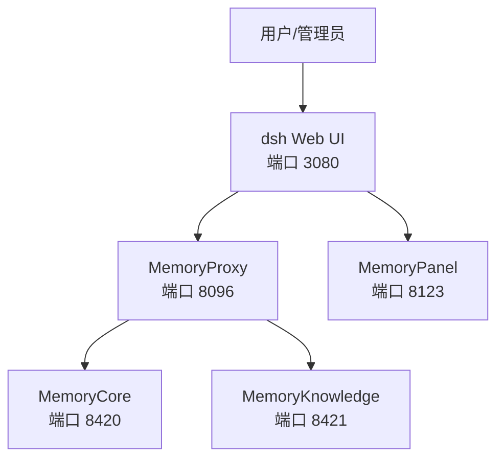
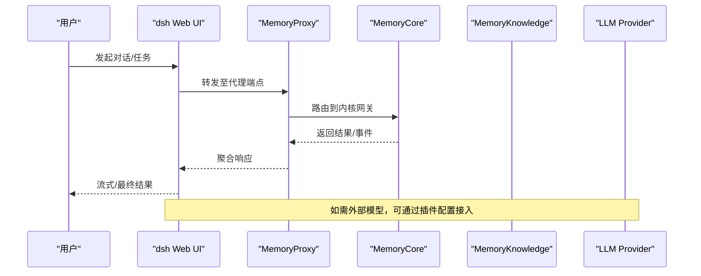
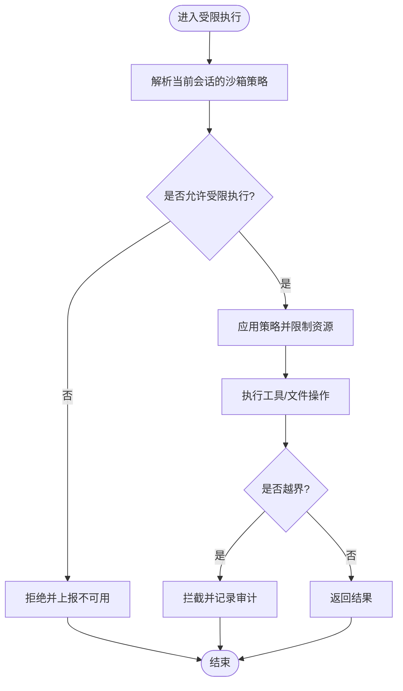
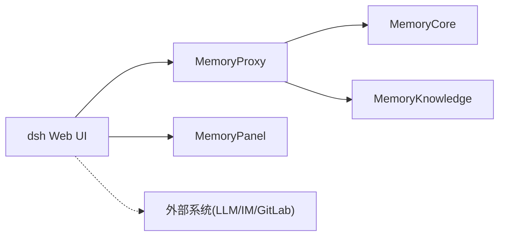

# 部署与运维

<cite>
**本文引用的文件**
- [README.md](file://README.md)
- [setup.env.example](file://scripts/setup-dsh/setup.env.example)
- [setup-dsh/README.md](file://scripts/setup-dsh/README.md)
- [config-catalog.md](file://docs/config-catalog.md)
- [sandbox.md](file://docs/subsystems/sandbox.md)
- [web-server.md](file://docs/subsystems/web-server.md)
- [credentials.md](file://docs/subsystems/credentials.md)
- [settings.md](file://docs/subsystems/settings.md)
- [client-connection-config:407-432](file://docs/config-catalog.md#L407-L432)
- [api-gateway-config:277-291](file://docs/config-catalog.md#L277-L291)
- [bash-local-config:360-384](file://docs/config-catalog.md#L360-L384)
- [code-runtime-worker-thread-config:450-485](file://docs/config-catalog.md#L450-L485)
- [attachment-local-config:325-358](file://docs/config-catalog.md#L325-L358)
- [compaction-basic-config:487-531](file://docs/config-catalog.md#L487-L531)
</cite>

## 目录
1. [简介](#简介)
2. [项目结构](#项目结构)
3. [核心组件](#核心组件)
4. [架构总览](#架构总览)
5. [详细组件分析](#详细组件分析)
6. [依赖关系分析](#依赖关系分析)
7. [性能考虑](#性能考虑)
8. [故障排查指南](#故障排查指南)
9. [结论](#结论)
10. [附录](#附录)

## 简介
本文档面向生产环境的 DeepSeek Harness（dsh）部署与运维，覆盖环境配置、多环境支持、容器化与编排、云平台最佳实践、安全沙箱与权限控制、性能调优、监控告警与日志管理，以及生产上线操作清单。内容基于仓库内提供的脚本、模板与子系统文档整理而成，确保可追溯与可执行。

## 项目结构
- 应用入口与运行方式：通过 CLI 启动 Web UI 或无头模式；默认监听本地端口并可选择自动打开浏览器。
- 一键初始化与多服务编排：提供 setup 脚本族，生成 ~/.dsh 下的 settings、凭据、profile 等，并可拉起 MemoryCore/Proxy/Knowledge/Panel 与 dsh Web UI。
- 插件化配置体系：所有插件的部署级配置在配置目录中集中声明，支持按环境拆分与叠加。
- 子系统能力：Web 服务、凭据管理、沙箱隔离、会话与持久化、LLM 流式输出等。

图表来源
- [setup-dsh/README.md:132-165](file://scripts/setup-dsh/README.md#L132-L165)

章节来源
- [README.md:17-41](file://README.md#L17-L41)
- [setup-dsh/README.md:132-189](file://scripts/setup-dsh/README.md#L132-L189)

## 核心组件
- 运行时与插件系统：以 Cordis 为内核，插件通过 cordis.yml 装配，配置项在配置目录中声明。
- Web 服务与客户端连接：对外暴露 Web UI 与 API，支持可信主机白名单、请求体大小限制、Cookie 生命周期等。
- 凭据与环境变量：支持本地凭据文件与环境变量注入，敏感信息通过环境变量或受保护文件管理。
- 沙箱与权限：提供受限执行模式与策略解析，确保工具与文件系统调用在边界内执行。
- LLM 集成与压缩：支持模型选择、流式输出、上下文压缩策略与结果裁剪。

章节来源
- [config-catalog.md:1-10](file://docs/config-catalog.md#L1-L10)
- [web-server.md](file://docs/subsystems/web-server.md)
- [credentials.md](file://docs/subsystems/credentials.md)
- [sandbox.md:23-94](file://docs/subsystems/sandbox.md#L23-L94)
- [config-catalog.md:277-291](file://docs/config-catalog.md#L277-L291)
- [config-catalog.md:325-358](file://docs/config-catalog.md#L325-L358)
- [config-catalog.md:487-531](file://docs/config-catalog.md#L487-L531)

## 架构总览
下图展示典型本地/云部署的服务拓扑与数据流向：Web UI 作为统一入口，经代理访问记忆栈（MemoryCore/Proxy/Knowledge），并通过插件与外部 LLM、IM、GitLab 等系统集成。

图表来源
- [setup-dsh/README.md:152-165](file://scripts/setup-dsh/README.md#L152-L165)
- [config-catalog.md:277-291](file://docs/config-catalog.md#L277-L291)

## 详细组件分析

### 环境配置与多环境支持
- 环境变量与密钥
  - 使用 DSH_* 前缀的环境变量进行一键引导，包括代理密钥、飞书机器人凭据、上游 LLM 地址与密钥、TDAI 相关参数、GitLab 令牌等。
  - 建议将敏感值放入 .env 或受保护的配置文件，避免提交到版本库。
- 配置文件
  - settings.yaml：全局设置（如 LLM 列表、功能开关）。
  - credentials.yaml：凭据文件路径与热更新行为可配置。
  - profiles/web/cordis.yml 与 cordis.patch.yml：插件装配与补丁层，用于多环境差异化配置。
- 多环境策略
  - 通过不同 profile 与 patch 层组合实现 dev/stage/prod 差异。
  - 利用 trustedHosts、maxRequestBodyBytes、cookieMaxAgeDays 等配置区分内外网访问策略。

章节来源
- [setup.env.example:1-88](file://scripts/setup-dsh/setup.env.example#L1-L88)
- [setup-dsh/README.md:84-107](file://scripts/setup-dsh/README.md#L84-L107)
- [credentials.md](file://docs/subsystems/credentials.md)
- [settings.md](file://docs/subsystems/settings.md)
- [client-connection-config:407-432](file://docs/config-catalog.md#L407-L432)

### Docker 容器化与编排
- 镜像构建建议
  - 将 dsh 产物与必要依赖打包为最小镜像；仅暴露 3080（Web UI）与 8123（面板，若需外网访问）。
  - 将 MemoryCore/Proxy/Knowledge/Panel 作为独立服务容器，通过内部网络通信。
- 编排要点
  - 使用 Compose/Kubernetes 管理服务间依赖顺序与健康检查。
  - 将凭据与密钥通过 Secret/ConfigMap 注入，避免硬编码。
  - 对 3080/8123 启用反向代理与 TLS 终止。
- 健康检查与重启策略
  - 参考各服务的 /health 端点进行就绪探测。
  - 设置合理的重启策略与资源限制，防止雪崩。

章节来源
- [setup-dsh/README.md:132-165](file://scripts/setup-dsh/README.md#L132-L165)

### 云平台部署最佳实践
- 负载均衡
  - 在 Ingress/Gateway 层对 dsh Web UI 做水平扩展与流量分发。
  - 对 MemoryPanel 与 dsh 均开启健康检查与优雅退出。
- 自动扩缩容
  - 基于 CPU/内存与自定义指标（如队列长度、LLM 延迟）触发 HPA。
  - 对无状态 Web 实例优先扩缩，对有状态服务（如存储）谨慎扩容。
- 监控与告警
  - 采集应用指标（QPS、错误率、延迟）、系统指标（CPU、内存、磁盘 IO）与业务指标（会话数、工具调用成功率）。
  - 配置阈值告警与通知渠道（邮件、IM、短信）。

[本节为通用指导，不直接分析具体文件]

### 安全沙箱机制与权限控制
- 沙箱模式与策略
  - 支持受限执行模式（非 full-access），策略随调用传递，确保并发会话互不影响。
  - 强制执行完整性分为 full/partial，调用方需根据平台能力做降级或拒绝。
- 权限与访问控制
  - 通过 trustedHosts 限制可信任来源，结合 Cookie 生命周期控制会话。
  - 凭据文件支持热加载与去抖，减少频繁 I/O。
- 工具与文件系统边界
  - Bash 与 FS 插件遵循沙箱策略，限制工作目录与写入范围。
  - 代码执行器具备计算时长、堆大小、输出大小等硬性上限。

图表来源
- [sandbox.md:23-94](file://docs/subsystems/sandbox.md#L23-L94)

章节来源
- [sandbox.md:23-94](file://docs/subsystems/sandbox.md#L23-L94)
- [client-connection-config:407-432](file://docs/config-catalog.md#L407-L432)
- [credentials.md](file://docs/subsystems/credentials.md)

### 关键插件配置速查
- Web 客户端连接
  - trustedHosts：声明可信任的主机名/IP，避免非环回地址被拒绝。
  - cookieMaxAgeDays：浏览器会话有效期。
  - maxRequestBodyBytes：API 请求体大小上限。
- API 网关
  - websocketHeartbeatIntervalMs：心跳间隔，保障长连接存活。
- Bash 本地执行
  - cwd/timeoutMs/maxTimeoutMs/maxOutputBytes/maxSpillBytes/graceMs：控制命令执行环境与资源。
- 代码执行器（Worker Thread）
  - computeMs/maxWallMs/maxOutputBytes/maxOldGenerationSizeMb：限制计算时间、堆大小与输出体积。
- 附件处理
  - 图片尺寸、像素、字节上限与并发压缩度，防止恶意大文件攻击。
- 上下文压缩
  - 阈值比例、保留比例/Token、摘要模型与重试次数，平衡质量与成本。

章节来源
- [client-connection-config:407-432](file://docs/config-catalog.md#L407-L432)
- [api-gateway-config:277-291](file://docs/config-catalog.md#L277-L291)
- [bash-local-config:360-384](file://docs/config-catalog.md#L360-L384)
- [code-runtime-worker-thread-config:450-485](file://docs/config-catalog.md#L450-L485)
- [attachment-local-config:325-358](file://docs/config-catalog.md#L325-L358)
- [compaction-basic-config:487-531](file://docs/config-catalog.md#L487-L531)

## 依赖关系分析
- 服务依赖
  - dsh Web UI 依赖 MemoryProxy，后者再依赖 MemoryCore 与 MemoryKnowledge。
  - MemoryPanel 为无状态面板，依赖后端接口。
- 插件依赖
  - 各插件通过 Cordis 注册服务与配置，存在显式 Requires 声明，便于装配校验。
- 外部依赖
  - LLM 提供商、飞书、GitLab 等通过凭据与环境变量接入。

图表来源
- [setup-dsh/README.md:152-165](file://scripts/setup-dsh/README.md#L152-L165)

章节来源
- [config-catalog.md:1-10](file://docs/config-catalog.md#L1-L10)
- [setup-dsh/README.md:152-165](file://scripts/setup-dsh/README.md#L152-L165)

## 性能考虑
- 并发与限流
  - 调整最大并行工具调用数，避免过载。
  - 合理设置请求体大小与超时，防止慢请求拖垮服务。
- 资源上限
  - 代码执行器设置 computeMs、maxWallMs、堆大小上限，避免 OOM 与长时间占用。
  - 附件处理限制图片尺寸与并发度，降低峰值压力。
- 上下文压缩
  - 根据模型窗口与预算设置压缩阈值与保留比例，减少 Token 消耗。
- 缓存与预热
  - 对静态资源与常用配置启用缓存；对热点会话进行预加载。

[本节为通用指导，不直接分析具体文件]

## 故障排查指南
- 常见问题定位
  - 无法访问 Web UI：检查 trustedHosts 与防火墙端口开放情况。
  - 代理连接失败：确认 MemoryProxy/ Core 健康端点可达，核对上游 LLM 地址与密钥。
  - 凭据加载失败：检查凭据文件路径、权限与热更新配置。
  - 沙箱报错：查看执行模式与策略解析结果，确认平台能力是否满足 full 约束。
- 日志与诊断
  - 使用 start-all.sh 管理的日志目录收集服务日志。
  - 针对 Web 与 API 层开启请求日志与错误追踪。
  - 对 LLM 调用与工具执行增加埋点，便于链路追踪。

章节来源
- [setup-dsh/README.md:132-165](file://scripts/setup-dsh/README.md#L132-L165)
- [client-connection-config:407-432](file://docs/config-catalog.md#L407-L432)
- [credentials.md](file://docs/subsystems/credentials.md)
- [sandbox.md:23-94](file://docs/subsystems/sandbox.md#L23-L94)

## 结论
DeepSeek Harness 提供了插件化、可编排、可观测的生产级 Agent 运行框架。通过环境变量与配置文件的多层组合，可实现多环境差异化部署；借助沙箱与权限控制，确保执行安全；配合监控与日志体系，形成完整的运维闭环。建议在云上采用容器化与编排方案，结合负载均衡与自动扩缩容，持续优化性能与稳定性。

## 附录
- 快速启动清单
  - 准备环境变量与凭据，复制模板并填写敏感值。
  - 运行一键初始化脚本，生成 settings、凭据与 profile。
  - 启动全部服务，等待健康检查通过后访问 Web UI。
- 升级与回滚
  - 使用升级模式迁移配置与修复依赖，避免破坏性重建。
  - 对镜像与配置变更采用灰度发布与回滚策略。
- 安全加固
  - 最小权限原则，仅暴露必要端口与服务。
  - 定期轮换密钥，启用审计与告警。

[本节为通用指导，不直接分析具体文件]