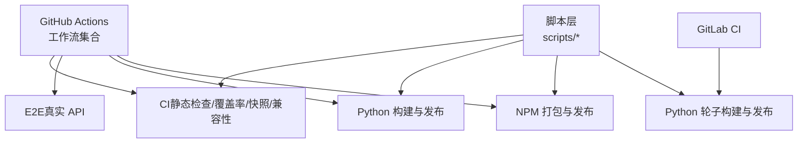
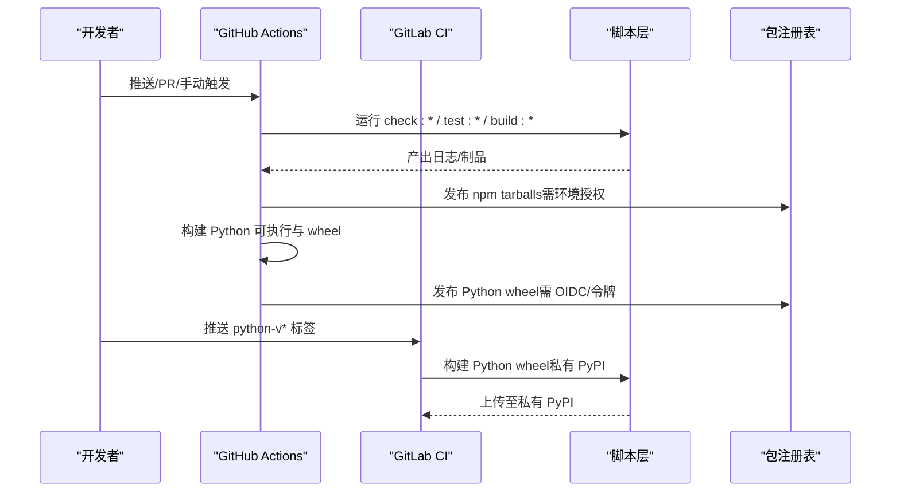
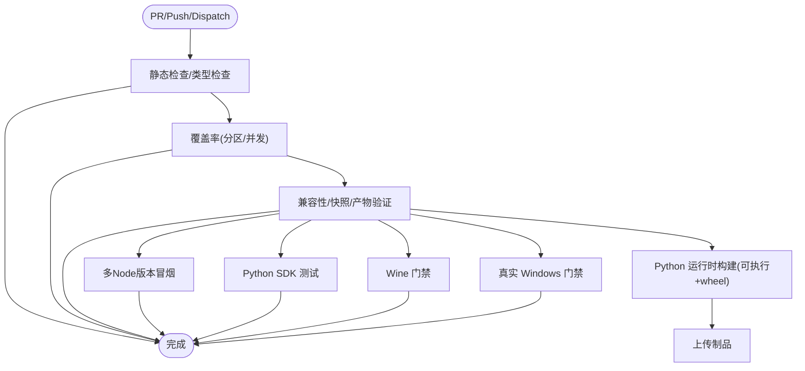
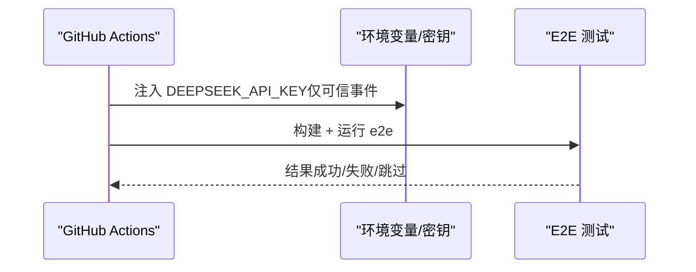
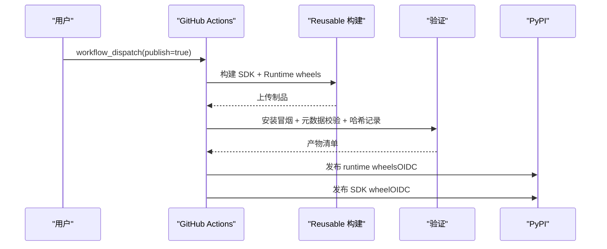
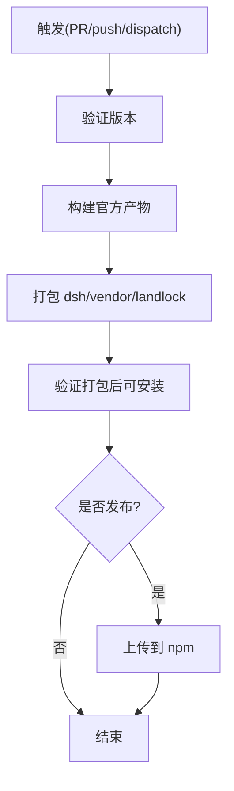
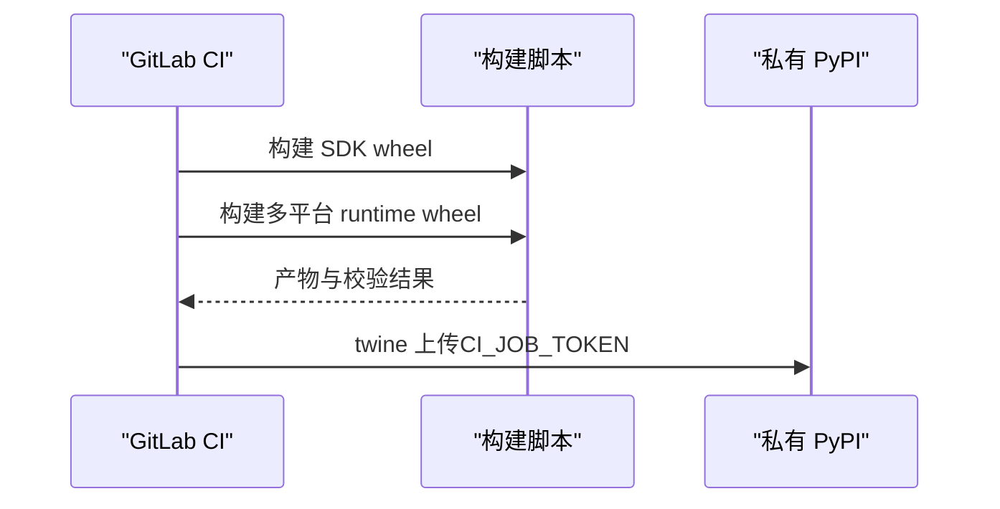
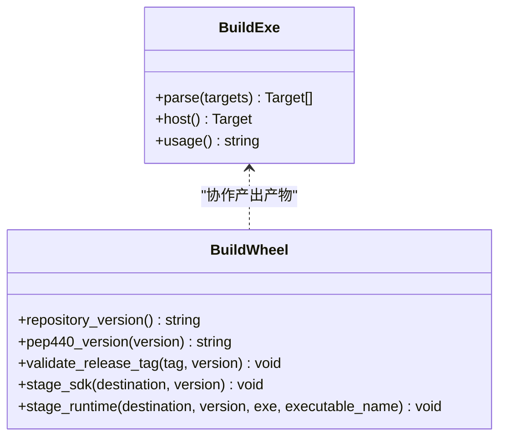
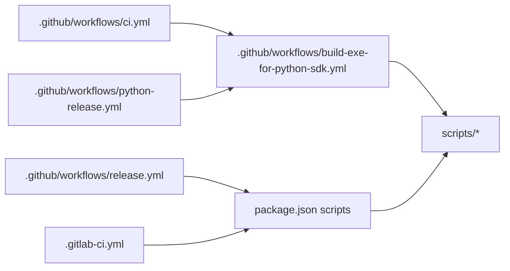

# CI/CD 流水线

<cite>
**本文引用的文件**
- [ci.yml](file://.github/workflows/ci.yml)
- [release.yml](file://.github/workflows/release.yml)
- [python-release.yml](file://.github/workflows/python-release.yml)
- [build-exe-for-python-sdk.yml](file://.github/workflows/build-exe-for-python-sdk.yml)
- [e2e.yml](file://.github/workflows/e2e.yml)
- [.gitlab-ci.yml](file://.gitlab-ci.yml)
- [package.json](file://package.json)
- [build-exe-for-python-sdk.ts](file://scripts/build-exe-for-python-sdk.ts)
- [build-python-release.py](file://scripts/build-python-release.py)
</cite>

## 目录
1. [简介](#简介)
2. [项目结构](#项目结构)
3. [核心组件](#核心组件)
4. [架构总览](#架构总览)
5. [详细组件分析](#详细组件分析)
6. [依赖关系分析](#依赖关系分析)
7. [性能与并发](#性能与并发)
8. [故障排查指南](#故障排查指南)
9. [结论](#结论)
10. [附录：分支策略与合并请求检查](#附录：分支策略与合并请求检查)

## 简介
本指南面向希望在本仓库中配置、扩展和维护 CI/CD 流水线的工程师。内容覆盖 GitHub Actions 与 GitLab CI 的配置选项与工作流定义，涵盖自动化测试、代码质量检查、构建流程、发布与版本管理、多平台构建、包发布与部署自动化、自定义任务与扩展点，以及分支策略和合并请求检查的落地方式。

## 项目结构
仓库采用多工作区（pnpm workspaces）组织，包含 Node.js 应用、Python SDK、原生工具与文档站点等。CI/CD 相关的主要入口如下：
- GitHub Actions：位于 .github/workflows，提供日常 CI、E2E、Python 构建与发布、NPM 打包与发布等工作流。
- GitLab CI：根目录 .gitlab-ci.yml，用于 Python 包的构建与发布到私有 PyPI。
- 脚本层：scripts 下提供统一的构建、校验与发布脚本，被各工作流复用。

图表来源
- [ci.yml:1-120](file://.github/workflows/ci.yml#L1-L120)
- [e2e.yml:1-120](file://.github/workflows/e2e.yml#L1-L120)
- [python-release.yml:1-250](file://.github/workflows/python-release.yml#L1-L250)
- [release.yml:1-150](file://.github/workflows/release.yml#L1-L150)
- [.gitlab-ci.yml:1-131](file://.gitlab-ci.yml#L1-L131)

章节来源
- [ci.yml:1-120](file://.github/workflows/ci.yml#L1-L120)
- [e2e.yml:1-120](file://.github/workflows/e2e.yml#L1-L120)
- [python-release.yml:1-250](file://.github/workflows/python-release.yml#L1-L250)
- [release.yml:1-150](file://.github/workflows/release.yml#L1-L150)
- [.gitlab-ci.yml:1-131](file://.gitlab-ci.yml#L1-L131)

## 核心组件
- 通用 CI（Node）：负责静态检查、覆盖率、快照、兼容性与产物验证，支持 Linux/Windows 矩阵与自托管回退池。
- E2E（真实 API）：在可信事件下执行端到端测试，严格限制密钥使用范围。
- Python 构建与发布：跨平台构建单文件可执行程序与 Python wheel，并进行兼容性、GLIBC/部署目标校验与发布。
- NPM 打包与发布：对 packages/ 与 apps/ 进行统一版本打包与发布，含安装验证。
- GitLab CI：基于标签触发 Python 包的构建与发布到私有 PyPI。

章节来源
- [ci.yml:66-335](file://.github/workflows/ci.yml#L66-L335)
- [e2e.yml:30-120](file://.github/workflows/e2e.yml#L30-L120)
- [python-release.yml:28-250](file://.github/workflows/python-release.yml#L28-L250)
- [release.yml:36-150](file://.github/workflows/release.yml#L36-L150)
- [.gitlab-ci.yml:1-131](file://.gitlab-ci.yml#L1-L131)

## 架构总览
下图展示了从触发事件到构建、测试、发布的关键路径与依赖关系。

图表来源
- [ci.yml:66-335](file://.github/workflows/ci.yml#L66-L335)
- [python-release.yml:28-250](file://.github/workflows/python-release.yml#L28-L250)
- [release.yml:36-150](file://.github/workflows/release.yml#L36-L150)
- [.gitlab-ci.yml:1-131](file://.gitlab-ci.yml#L1-L131)

## 详细组件分析

### GitHub Actions：通用 CI（Node）
- 触发条件：push 到 master、pull_request、workflow_dispatch（可选套件）。
- 关键作业：
  - node-24：静态检查与契约就绪类型检查。
  - node-24-coverage：全量覆盖率，支持分区与并发控制。
  - node-24-consumers：兼容性、快照与产物验证，含 Playwright 缓存与 bubblewrap 准备。
  - node-compat：多 Node 版本兼容性冒烟。
  - python-sdk：Python SDK 无密钥测试套件。
  - python-runtime：调用 reusable 工作流构建 Linux x64 可执行与 wheel。
  - windows：Wine 环境下阻塞性 Windows 门禁。
  - windows-native：真实 Windows 内核完整门禁。
  - serial-*：自托管备用池串行演练，持续证明可用性。
- 并发与回退：通过 concurrency 组与仓库变量实现 Linux/Windows 回退到自托管池；PR 可取消进行中任务，push 不取消以保留证据。

图表来源
- [ci.yml:66-335](file://.github/workflows/ci.yml#L66-L335)
- [ci.yml:336-651](file://.github/workflows/ci.yml#L336-L651)

章节来源
- [ci.yml:1-800](file://.github/workflows/ci.yml#L1-L800)

### GitHub Actions：E2E（真实 DeepSeek API）
- 触发：workflow_dispatch、push（main/master）、pull_request（受信任事件）、cron 夜间任务。
- 安全模型：仅读取仓库权限；密钥仅在可信事件中可用；fork 与 Dependabot PR 自动跳过以避免密钥泄露。
- 前置检查：强制要求 DEEPSEEK_API_KEY 存在，否则失败，避免“全部跳过”假绿。
- 执行：构建官方产物后运行端到端测试，设置并行度与超时。

图表来源
- [e2e.yml:1-120](file://.github/workflows/e2e.yml#L1-L120)

章节来源
- [e2e.yml:1-120](file://.github/workflows/e2e.yml#L1-L120)

### GitHub Actions：Python 构建与发布
- 触发：手动触发（publish=true/false），或 PR 添加特定标签进行 dry-run。
- 构建：调用 reusable 工作流构建 SDK wheel 与多平台 runtime wheel（Linux x64/arm64、macOS arm64）。
- 验证：安装本地 wheel 进行冒烟测试；校验 wheel 清单与大小；生成 SHA256SUMS。
- 发布：分两步发布到公共 PyPI（runtime 与 SDK），使用 OIDC 认证与环境保护。

图表来源
- [python-release.yml:28-250](file://.github/workflows/python-release.yml#L28-L250)
- [build-exe-for-python-sdk.yml:56-327](file://.github/workflows/build-exe-for-python-sdk.yml#L56-L327)

章节来源
- [python-release.yml:1-250](file://.github/workflows/python-release.yml#L1-L250)
- [build-exe-for-python-sdk.yml:1-327](file://.github/workflows/build-exe-for-python-sdk.yml#L1-L327)

### GitHub Actions：NPM 打包与发布
- 触发：PR、master push、手动触发（publish=true）。
- 打包：验证版本、构建官方产物、打包所有 dsh 家族包与 vendored 框架、Landlock entry，并验证安装。
- 发布：从 dist/npm 上传到 npm registry，使用环境保护与令牌。

图表来源
- [release.yml:36-150](file://.github/workflows/release.yml#L36-L150)

章节来源
- [release.yml:1-150](file://.github/workflows/release.yml#L1-L150)

### GitLab CI：Python 构建与发布
- 触发：匹配 python-v* 标签时运行，否则 never。
- 阶段：build、publish。
- 构建：为 SDK 与多平台 runtime 构建 wheel，执行冒烟测试与 manylinux/GLIBC/部署目标校验。
- 发布：使用 twine 上传到项目私有 PyPI，使用 CI_JOB_TOKEN 鉴权。

图表来源
- [.gitlab-ci.yml:1-131](file://.gitlab-ci.yml#L1-L131)

章节来源
- [.gitlab-ci.yml:1-131](file://.gitlab-ci.yml#L1-L131)

### 构建脚本与可重用能力
- scripts/build-exe-for-python-sdk.ts：解析目标 triple（node24-linux-x64/node24-linux-arm64/node24-macos-arm64），构建 SEA 模式可执行，输出到 dist-exe，并生成 Python 节点载体。
- scripts/build-python-release.py：按仓库版本构建 SDK 或 runtime wheel，校验 PEP 440 版本与平台 tag，复制许可证文件，最终用 uv 构建 wheel。

图表来源
- [build-exe-for-python-sdk.ts:1-200](file://scripts/build-exe-for-python-sdk.ts#L1-L200)
- [build-python-release.py:1-200](file://scripts/build-python-release.py#L1-L200)

章节来源
- [build-exe-for-python-sdk.ts:1-200](file://scripts/build-exe-for-python-sdk.ts#L1-L200)
- [build-python-release.py:1-200](file://scripts/build-python-release.py#L1-L200)

## 依赖关系分析
- 工作流间依赖：
  - python-release.yml 依赖 build-exe-for-python-sdk.yml 构建可执行与 wheel。
  - ci.yml 中的 python-runtime 作业调用 reusable 工作流。
  - release.yml 独立于 Python 发布，专注 NPM 家族。
- 脚本依赖：
  - package.json 暴露大量 check/test/build/release 命令，供工作流直接调用。
  - 构建脚本依赖 pnpm、uv、pkg、manylinux 容器等外部工具。

图表来源
- [ci.yml:328-335](file://.github/workflows/ci.yml#L328-L335)
- [python-release.yml:28-35](file://.github/workflows/python-release.yml#L28-L35)
- [release.yml:36-150](file://.github/workflows/release.yml#L36-L150)
- [.gitlab-ci.yml:1-131](file://.gitlab-ci.yml#L1-L131)
- [package.json:19-147](file://package.json#L19-L147)

章节来源
- [ci.yml:328-335](file://.github/workflows/ci.yml#L328-L335)
- [python-release.yml:28-35](file://.github/workflows/python-release.yml#L28-L35)
- [release.yml:36-150](file://.github/workflows/release.yml#L36-L150)
- [.gitlab-ci.yml:1-131](file://.gitlab-ci.yml#L1-L131)
- [package.json:19-147](file://package.json#L19-L147)

## 性能与并发
- 并发控制：
  - 通过 DSH_GATE_CONCURRENCY、DSH_COVERAGE_MAX_WORKERS、DSH_PUBLINT_CONCURRENCY、DSH_SNAPSHOT_MAX_CONCURRENCY 等环境变量调节并行度。
  - concurrency 组确保同一 ref 的任务有序或可取消，避免互相抢占。
- 缓存策略：
  - pnpm store、Playwright 浏览器缓存、Wine apt 缓存、pkg 二进制缓存等，显著缩短冷启动时间。
- 资源隔离：
  - Linux 使用 bubblewrap 沙箱；Windows 使用 Wine 与真实 Windows 双轨门禁；自托管 VM 作为备用池持续演练。

章节来源
- [ci.yml:118-264](file://.github/workflows/ci.yml#L118-L264)
- [ci.yml:346-421](file://.github/workflows/ci.yml#L346-L421)
- [ci.yml:465-651](file://.github/workflows/ci.yml#L465-L651)

## 故障排查指南
- 常见失败原因与定位：
  - 版本不一致：Python 构建要求标签与 package.json 版本一致，否则中止。
  - 密钥缺失：E2E 在缺少密钥时会显式失败，避免假绿。
  - 平台不兼容：Linux 可执行必须满足 manylinux_2_28 的 GLIBC 上限；macOS 需满足部署目标。
  - 缓存失效：pnpm store 或浏览器缓存未命中导致冷启动慢，可清理缓存重试。
  - 并发过高：覆盖率/快照/测试并发过高导致资源争用，可调低并发参数。
- 建议步骤：
  - 查看对应 job 的日志与制品。
  - 确认环境变量与仓库变量（如 DSH_CI_FAILOVER_*、PUBLIC_PYPI_RELEASE_ENABLED）。
  - 在本地复现：使用相同 Node/Python 版本与 pnpm 锁文件。

章节来源
- [python-release.yml:97-138](file://.github/workflows/python-release.yml#L97-L138)
- [e2e.yml:85-101](file://.github/workflows/e2e.yml#L85-L101)
- [build-exe-for-python-sdk.yml:185-219](file://.github/workflows/build-exe-for-python-sdk.yml#L185-L219)
- [build-exe-for-python-sdk.yml:281-299](file://.github/workflows/build-exe-for-python-sdk.yml#L281-L299)

## 结论
本项目的 CI/CD 体系以 GitHub Actions 为主、GitLab CI 为辅，覆盖了从静态检查、测试、构建到发布的完整链路。通过可重用工作流、脚本化构建与严格的版本/平台校验，实现了多平台、多语言的稳定交付。结合并发控制与缓存优化，兼顾了速度与可靠性。建议在新增功能时优先复用现有 gate 与脚本，保持流水线的一致性与可维护性。

## 附录：分支策略与合并请求检查
- 分支策略：
  - master/main：主分支触发 CI 与 E2E；发布通过标签驱动（dsh-v*、python-v*）。
  - PR：触发静态检查、覆盖率、快照、兼容性、Windows 门禁与 Python 构建验证。
- 合并请求检查：
  - 必需状态检查：静态检查、覆盖率、消费者验证、Windows 门禁、Python 构建（Linux x64）。
  - 非阻塞信号：真实 Windows 内核门禁、自托管串行演练。
  - 回退机制：通过仓库变量将 Linux/Windows 作业重定向到自托管池，保障稳定性。
- 自定义扩展点：
  - 新增 gate：在 package.json 中添加 check:* 命令，并在 ci.yml 中引用。
  - 新增平台：在 build-exe-for-python-sdk.yml 的 plan 与 matrix 中增加目标 triple。
  - 新增发布：参考 release.yml 与 python-release.yml，增加环境与权限保护。

章节来源
- [ci.yml:66-335](file://.github/workflows/ci.yml#L66-L335)
- [ci.yml:465-651](file://.github/workflows/ci.yml#L465-L651)
- [python-release.yml:28-250](file://.github/workflows/python-release.yml#L28-L250)
- [release.yml:36-150](file://.github/workflows/release.yml#L36-L150)
- [package.json:19-147](file://package.json#L19-L147)