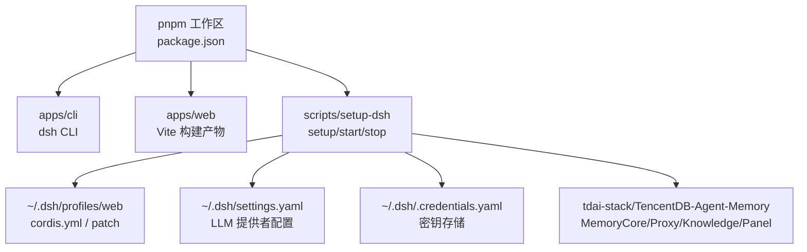
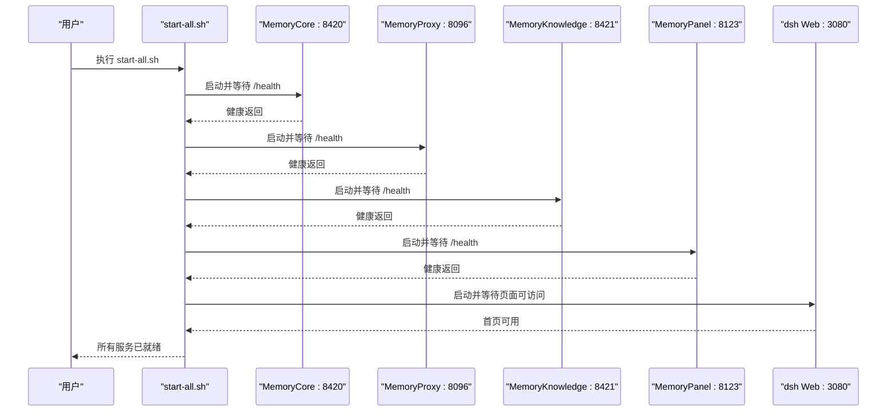
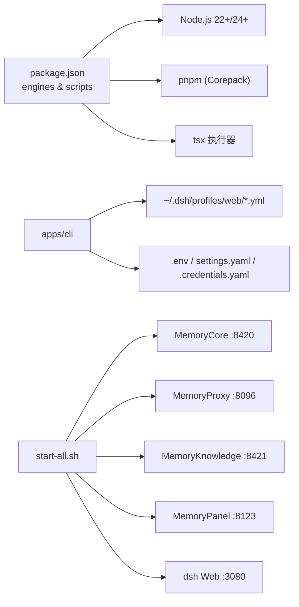

# 本地部署

<cite>
**本文引用的文件**
- [scripts/setup-dsh/setup.sh](file://scripts/setup-dsh/setup.sh)
- [scripts/setup-dsh/start-all.sh](file://scripts/setup-dsh/start-all.sh)
- [scripts/setup-dsh/stop-all.sh](file://scripts/setup-dsh/stop-all.sh)
- [scripts/setup-dsh/lib.sh](file://scripts/setup-dsh/lib.sh)
- [scripts/setup-dsh/setup.env.example](file://scripts/setup-dsh/setup.env.example)
- [package.json](file://package.json)
- [apps/cli/package.json](file://apps/cli/package.json)
- [apps/web/package.json](file://apps/web/package.json)
- [README.md](file://README.md)
- [apps/cli/README.md](file://apps/cli/README.md)
- [docs/development.md](file://docs/development.md)
</cite>

## 目录
1. [简介](#简介)
2. [项目结构](#项目结构)
3. [核心组件](#核心组件)
4. [架构总览](#架构总览)
5. [详细组件分析](#详细组件分析)
6. [依赖关系分析](#依赖关系分析)
7. [性能与启动优化](#性能与启动优化)
8. [故障排查指南](#故障排查指南)
9. [结论](#结论)
10. [附录：Docker 容器化示例](#附录docker-容器化示例)

## 简介
本指南面向希望在本地完整运行 DeepSeek Harness（dsh）的开发者，覆盖从环境准备、一键初始化脚本使用、环境变量与配置文件说明，到 Web 界面与 CLI 工具的启动、端口配置、插件加载与调试模式，以及常见问题定位与 Docker 容器化示例。内容基于仓库内提供的脚本与文档整理而成，确保与实际代码行为一致。

## 项目结构
- 根工作区由 pnpm workspace 管理，包含 apps/cli（CLI 入口）、apps/web（Web 前端构建产物）、packages/*（功能包）、scripts/*（构建与运维脚本）等。
- 本地一键部署由 scripts/setup-dsh 下的脚本完成，负责生成用户级配置、克隆并配置 Memory 栈（MemoryCore/MemoryProxy/MemoryKnowledge/MemoryPanel），以及安装依赖与构建必要的前端资源。
- 服务启动顺序与生命周期管理由 start-all.sh 统一编排，stop-all.sh 按反向依赖停止进程。

图表来源
- [package.json:1-18](file://package.json#L1-L18)
- [scripts/setup-dsh/setup.sh:159-231](file://scripts/setup-dsh/setup.sh#L159-L231)
- [scripts/setup-dsh/setup.sh:233-457](file://scripts/setup-dsh/setup.sh#L233-L457)

章节来源
- [package.json:1-18](file://package.json#L1-L18)
- [scripts/setup-dsh/setup.sh:159-231](file://scripts/setup-dsh/setup.sh#L159-L231)
- [scripts/setup-dsh/setup.sh:233-457](file://scripts/setup-dsh/setup.sh#L233-L457)

## 核心组件
- dsh CLI：提供 profile 启动、插件管理与 web 命令别名；支持 --profile、--patch、--dump-config 等能力。
- Web 前端：通过 Vite 构建，最终由 dsh web 命令以静态资源方式提供。
- 本地堆栈：MemoryCore（网关）、MemoryProxy（代理）、MemoryKnowledge（知识/图）、MemoryPanel（面板）。
- 配置体系：settings.yaml（LLM 提供者）、.credentials.yaml（密钥）、profiles/web/cordis.yml 与 cordis.patch.yml（插件与补丁）、repo 根 .env（API Key 等）。

章节来源
- [apps/cli/README.md:1-48](file://apps/cli/README.md#L1-L48)
- [apps/web/package.json:1-49](file://apps/web/package.json#L1-L49)
- [scripts/setup-dsh/setup.sh:164-231](file://scripts/setup-dsh/setup.sh#L164-L231)
- [scripts/setup-dsh/setup.sh:233-457](file://scripts/setup-dsh/setup.sh#L233-L457)

## 架构总览
下图展示了本地一键部署后各组件的启动顺序与健康检查流程。start-all.sh 会依次启动 MemoryCore、MemoryProxy、MemoryKnowledge、MemoryPanel，最后启动 dsh Web UI，并在每个服务启动后等待健康端点就绪。

图表来源
- [scripts/setup-dsh/start-all.sh:90-110](file://scripts/setup-dsh/start-all.sh#L90-L110)
- [scripts/setup-dsh/lib.sh:73-92](file://scripts/setup-dsh/lib.sh#L73-L92)

章节来源
- [scripts/setup-dsh/start-all.sh:1-126](file://scripts/setup-dsh/start-all.sh#L1-L126)
- [scripts/setup-dsh/lib.sh:1-93](file://scripts/setup-dsh/lib.sh#L1-L93)

## 详细组件分析

### 开发环境搭建与依赖
- Node.js：要求 Node 22.19+ 或 24+；仓库通过 package.json 的 engines 字段约束版本。
- pnpm：使用 Corepack 管理的 pnpm@11.7.0；首次需 corepack enable。
- Git：需要较新版本以启用 worktree 相关特性。
- 可选：DeepSeek API Key，用于 Web、headless 与真实 API 测试。

步骤建议
- 克隆仓库后在根目录执行依赖安装与类型检查，确保环境就绪。
- 若 postinstall 未生效，手动安装 hooks 工具。

章节来源
- [docs/development.md:9-40](file://docs/development.md#L9-L40)
- [package.json:8-10](file://package.json#L8-L10)
- [package.json:19-47](file://package.json#L19-L47)

### setup.sh 脚本使用方法
- 作用：一次性初始化 dsh 用户目录（默认 ~/.dsh），生成 settings.yaml、.credentials.yaml、web profile 及其补丁、仓库根 .env，并可选择克隆与配置 TencentDB-Agent-Memory 栈。
- 常用参数：
  - --dsh-home PATH：指定 dsh 家目录
  - --workspace PATH：指定工作区路径
  - --branch REF：指定 Memory 栈分支
  - --skip-memory：跳过内存栈克隆与配置
  - --skip-install：不安装内存服务依赖
  - --force：覆盖已有生成文件
  - --non-interactive：非交互模式，缺失必填项直接失败
- 交互式提示：脚本会提示输入密钥与可选值；也可通过 DSH_* 环境变量预先注入。

章节来源
- [scripts/setup-dsh/setup.sh:1-47](file://scripts/setup-dsh/setup.sh#L1-L47)
- [scripts/setup-dsh/setup.sh:74-87](file://scripts/setup-dsh/setup.sh#L74-L87)
- [scripts/setup-dsh/setup.sh:94-147](file://scripts/setup-dsh/setup.sh#L94-L147)

### 环境变量与配置文件
- 用户级配置
  - ~/.dsh/settings.yaml：LLM 提供者与模型配置（由模板复制生成）
  - ~/.dsh/.credentials.yaml：密钥存储（如 PROXY_USER_KEY），权限严格限制
  - ~/.dsh/profiles/web/{package.json, cordis.yml, cordis.patch.yml, pnpm-workspace.yaml}：Web profile 定义与补丁
- 仓库根 .env：存放 DEEPSEEK_API_KEY、FEISHU_APP_ID/SECRET、GITLAB_TOKEN 等
- Memory 栈配置
  - proxy-config.yaml：MemoryProxy 上游 LLM 地址与密钥
  - tdai-gateway.yaml：MemoryCore 网关配置（LLM 基址、模型、数据目录）
  - MemoryPanel/.env、MemoryKnowledge/.env：各自服务的运行环境变量
  - metadata-instances.json：面板实例注册信息（含网关 bearer）

- 关键 DSH_* 环境变量（部分）
  - DSH_PROXY_USER_KEY、DSH_FEISHU_FALLBACK_CHAT_ID、DSH_DEEPSEEK_API_KEY、DSH_FEISHU_APP_ID/SECRET
  - DSH_PROXY_UPSTREAM_URL、DSH_PROXY_UPSTREAM_API_KEY
  - DSH_KERNEL_GATEWAY_API_KEY
  - DSH_TDAI_LLM_API_KEY、DSH_TDAI_LLM_BASE_URL、DSH_TDAI_LLM_MODEL、DSH_MEMORY_DATA_DIR
  - DSH_GITLAB_BOT_USERNAME、DSH_GITLAB_API_BASE、DSH_GITLAB_TOKEN

章节来源
- [scripts/setup-dsh/setup.sh:159-231](file://scripts/setup-dsh/setup.sh#L159-L231)
- [scripts/setup-dsh/setup.sh:233-457](file://scripts/setup-dsh/setup.sh#L233-L457)
- [scripts/setup-dsh/setup.env.example:1-55](file://scripts/setup-dsh/setup.env.example#L1-L55)

### 启动 Web 界面与 CLI 工具
- 一键启动全部服务：执行 start-all.sh，将按依赖顺序启动 MemoryCore、MemoryProxy、MemoryKnowledge、MemoryPanel，最后启动 dsh Web UI（默认绑定 0.0.0.0:3080）。
- 单独启动 Web：在仓库根执行 pnpm dsh web，或通过 start-all.sh 自动拉起。
- CLI 模式：
  - dsh --profile <name>：启动指定 profile
  - dsh web：等价于 --profile web
  - dsh plugin --profile <name> <pnpm args>：在 profile 目录下管理插件
- 端口与主机：
  - MemoryCore:8420、MemoryProxy:8096、MemoryKnowledge:8421、MemoryPanel:8123、dsh Web:3080
  - 可通过命令行参数调整 Web 主机与端口（例如 --host 0.0.0.0 --port 3080）
- 插件加载：
  - profile 目录下的 cordis.yml 与 cordis.patch.yml 定义插件与补丁层
  - 支持通过 --patch 叠加额外补丁
  - 可使用 --dump-default-config 与 --dump-config 查看组合后的配置树而不实际启动

章节来源
- [scripts/setup-dsh/start-all.sh:90-110](file://scripts/setup-dsh/start-all.sh#L90-L110)
- [apps/cli/README.md:7-43](file://apps/cli/README.md#L7-L43)
- [README.md:15-37](file://README.md#L15-L37)

### 调试模式与日志
- 健康检查：start-all.sh 在每个服务启动后调用 wait_healthy，轮询 HTTP 健康端点或监听端口。
- 日志位置：$DSH_HOME/run/logs/<service>.log
- PID 管理：$DSH_HOME/run/pids/<service>.pid
- 调试建议：
  - 观察对应服务的日志文件定位启动失败原因
  - 确认端口未被占用（is_listening 检测）
  - 使用 --non-interactive 进行自动化验证，避免交互式阻塞
  - 使用 --dump-config 检查配置组合是否正确

章节来源
- [scripts/setup-dsh/lib.sh:73-92](file://scripts/setup-dsh/lib.sh#L73-L92)
- [scripts/setup-dsh/start-all.sh:69-88](file://scripts/setup-dsh/start-all.sh#L69-L88)
- [apps/cli/README.md:30-43](file://apps/cli/README.md#L30-L43)

## 依赖关系分析
- 运行时依赖
  - Node.js：受 engines 约束
  - pnpm：通过 Corepack 管理
  - tsx：用于 TypeScript 直接执行（CLI 与脚本）
- 组件耦合
  - dsh Web 依赖构建产物（apps/web 的 dist）
  - Memory 栈各服务通过 HTTP 健康端点进行启动顺序协调
  - 配置解耦：settings.yaml、.credentials.yaml、profile 补丁与 repo .env 分离，便于安全与复用

图表来源
- [package.json:8-10](file://package.json#L8-L10)
- [package.json:19-47](file://package.json#L19-L47)
- [scripts/setup-dsh/start-all.sh:90-110](file://scripts/setup-dsh/start-all.sh#L90-L110)

章节来源
- [package.json:8-10](file://package.json#L8-L10)
- [package.json:19-47](file://package.json#L19-L47)
- [scripts/setup-dsh/start-all.sh:90-110](file://scripts/setup-dsh/start-all.sh#L90-L110)

## 性能与启动优化
- 依赖安装缓存：Memory 栈各服务使用 pnpm/npm 安装依赖，必要时可结合 CI 缓存加速。
- 前端构建：MemoryPanel 的 Web UI 首次需构建一次，后续可直接启动。
- 健康检查超时：可根据机器性能调整 wait_healthy 的超时时间（脚本内部固定上限，可在自定义脚本中扩展）。
- 并行度：当前启动为串行以保证依赖顺序；如需并行，应在保证健康检查正确性的前提下改造。

[本节为通用指导，无需特定文件引用]

## 故障排查指南
- 端口冲突或服务未就绪
  - 现象：start-all.sh 报服务未健康或端口被占用
  - 处理：使用 stop-all.sh 停止所有服务，释放端口后重试；检查 lsof/netstat 确认占用情况
- 缺少配置文件
  - 现象：启动时报 missing xxx — run setup.sh first
  - 处理：重新执行 setup.sh 生成所需配置；或使用 --force 覆盖
- 密钥无效或不可用
  - 现象：代理认证失败或“key 不可用”
  - 处理：检查 .credentials.yaml 与 MemoryCore 数据库中的用户/密钥是否匹配；必要时重新生成 PROXY_USER_KEY
- 前端 404
  - 现象：MemoryPanel 首页返回 404
  - 处理：首次克隆需构建前端资源；确保 build 输出存在
- 健康检查失败
  - 现象：wait_healthy 超时退出
  - 处理：查看对应服务的日志文件定位错误；确认网络可达与防火墙设置

章节来源
- [scripts/setup-dsh/start-all.sh:46-67](file://scripts/setup-dsh/start-all.sh#L46-L67)
- [scripts/setup-dsh/start-all.sh:90-110](file://scripts/setup-dsh/start-all.sh#L90-L110)
- [scripts/setup-dsh/setup.sh:233-457](file://scripts/setup-dsh/setup.sh#L233-L457)
- [scripts/setup-dsh/lib.sh:73-92](file://scripts/setup-dsh/lib.sh#L73-L92)

## 结论
通过 setup.sh 与 start-all.sh，开发者可以快速在本地搭建完整的 DeepSeek Harness 运行环境，包括 Web 界面、CLI 工具与 Memory 栈。借助清晰的配置分层与环境变量管理，部署过程具备可重复性与可维护性。配合 stop-all.sh 与日志定位，能够高效解决常见部署问题。

[本节为总结性内容，无需特定文件引用]

## 附录：Docker 容器化示例
以下示例展示如何将 dsh Web 与 Memory 栈服务容器化。请根据实际环境与镜像源进行调整。

- 基础镜像选择
  - Node.js：建议使用 Node 22 或 24 官方镜像，与 engines 约束一致
  - pnpm：通过 Corepack 启用或在镜像中预装
- 构建阶段
  - 安装依赖：pnpm install
  - 构建产物：pnpm run build 与 pnpm run build:web
- 运行阶段
  - 暴露端口：3080（Web）、8420/8096/8421/8123（Memory 栈）
  - 挂载配置：将 ~/.dsh 目录映射至容器内，保持配置持久化
  - 环境变量：传入必要的 DSH_* 与 API Key
- 健康检查
  - 使用 curl 检查各服务 /health 端点，确保容器就绪后再转发流量

注意
- 生产环境务必限制对外暴露的端口，并通过反向代理与鉴权保护 /api 等敏感接口
- 密钥与证书应通过环境变量或挂载卷注入，避免写入镜像

[本节为概念性示例，不直接映射具体源码文件]