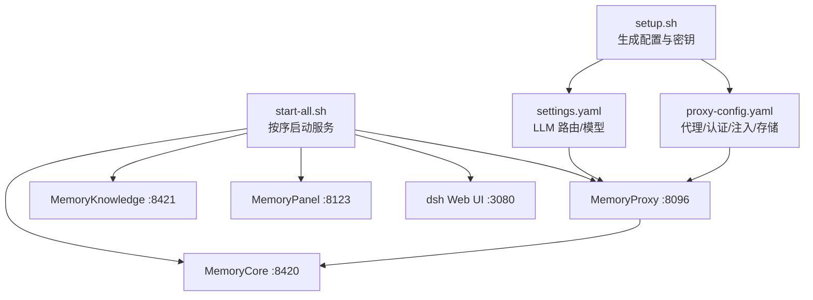
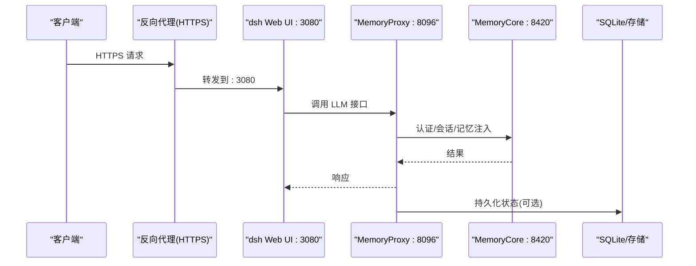
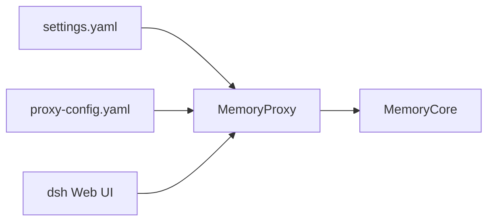

# 生产环境配置

<cite>
**本文引用的文件**
- [setup.env.example](file://scripts/setup-dsh/setup.env.example)
- [setup.sh](file://scripts/setup-dsh/setup.sh)
- [start-all.sh](file://scripts/setup-dsh/start-all.sh)
- [stop-all.sh](file://scripts/setup-dsh/stop-all.sh)
- [settings.yaml](file://scripts/setup-dsh/templates/settings.yaml)
- [proxy-config.yaml](file://scripts/setup-dsh/templates/tdai-stack/proxy-config.yaml)
- [config-catalog.md](file://docs/config-catalog.md)
- [architecture.md](file://docs/architecture.md)
- [storage-sqlite/index.ts](file://packages/storage/storage-sqlite/src/index.ts)
- [storage-sqlite/README.md](file://packages/storage/storage-sqlite/README.md)
- [session-projection-cache/index.ts](file://packages/session/session-projection-cache/src/index.ts)
- [webserver/README.md](file://packages/host/webserver/README.md)
- [launch-environment/index.ts](file://packages/util/launch-environment/src/index.ts)
</cite>

## 目录
1. [简介](#简介)
2. [项目结构](#项目结构)
3. [核心组件](#核心组件)
4. [架构总览](#架构总览)
5. [详细组件分析](#详细组件分析)
6. [依赖关系分析](#依赖关系分析)
7. [性能考虑](#性能考虑)
8. [故障排查指南](#故障排查指南)
9. [结论](#结论)
10. [附录](#附录)

## 简介
本指南面向将 DeepSeek Harness（dsh）及其配套 Memory 栈部署到生产环境的运维与平台团队。内容覆盖系统要求、安全配置、环境变量、SSL/TLS 与反向代理、负载均衡与高可用、数据库与缓存、存储优化、监控指标与日志轮转、告警、备份恢复与数据迁移等主题，并结合仓库中的脚本、模板与插件配置给出可操作的步骤与注意事项。

## 项目结构
- 引导与启动
  - setup.sh：一键生成 dsh home、profile、Memory 栈配置与环境变量；负责密钥与敏感信息的安全写入。
  - start-all.sh / stop-all.sh：按依赖顺序启动/停止 MemoryCore、MemoryProxy、MemoryKnowledge、MemoryPanel 与 dsh Web UI，并基于健康检查等待就绪。
- 配置模板
  - settings.yaml：LLM 提供商路由、默认模型、上下文窗口与最大 token 等。
  - proxy-config.yaml：MemoryProxy 的监听地址、上游 LLM、认证、会话注入、持久化存储等。
- 运行时与插件
  - storage-sqlite：KV 存储后端，支持 WAL 与多种 journal 模式。
  - session-projection-cache：会话投影缓存，写回策略与冷读路径。
  - webserver：开发期 Web 服务，明确无 TLS/鉴权/源策略，需前置反向代理加固。
- 环境与来源
  - launch-environment：记录环境变量来源层级（进程、项目 .env、用户 .env），用于审计与调试。

**图示来源**
- [setup.sh:164-456](file://scripts/setup-dsh/setup.sh#L164-L456)
- [start-all.sh:90-110](file://scripts/setup-dsh/start-all.sh#L90-L110)
- [settings.yaml:1-53](file://scripts/setup-dsh/templates/settings.yaml#L1-L53)
- [proxy-config.yaml:1-75](file://scripts/setup-dsh/templates/tdai-stack/proxy-config.yaml#L1-L75)

**章节来源**
- [setup.sh:1-540](file://scripts/setup-dsh/setup.sh#L1-L540)
- [start-all.sh:1-126](file://scripts/setup-dsh/start-all.sh#L1-L126)
- [stop-all.sh:1-44](file://scripts/setup-dsh/stop-all.sh#L1-L44)
- [settings.yaml:1-53](file://scripts/setup-dsh/templates/settings.yaml#L1-L53)
- [proxy-config.yaml:1-75](file://scripts/setup-dsh/templates/tdai-stack/proxy-config.yaml#L1-L75)

## 核心组件
- 引导与生命周期
  - setup.sh：创建 $DSH_HOME、settings.yaml、.credentials.yaml、Web profile、Memory 栈配置与依赖安装；支持非交互模式与幂等重跑。
  - start-all.sh：检测端口与 PID，按依赖顺序启动服务并通过健康端点确认就绪；提供停止脚本。
- 配置与编排
  - settings.yaml：定义 LLM 提供商、默认模型、上下文窗口与最大 token；通过 MemoryProxy 暴露统一入口。
  - proxy-config.yaml：设置监听地址、上游 LLM、认证、会话注入、技能注入、持久化存储（SQLite）。
- 存储与会话
  - storage-sqlite：KV 存储后端，支持 WAL 与多 journal 模式；对网络挂载场景建议切换为 rollback-journal。
  - session-projection-cache：写回策略（节流+强制落盘点）、冷读路径（缓存→持久化→注册表→回写），失败软降级。
- 前端与服务
  - webserver：开发期 Web 服务，无 TLS/鉴权/源策略，生产需前置反向代理进行加固。

**章节来源**
- [setup.sh:164-456](file://scripts/setup-dsh/setup.sh#L164-L456)
- [start-all.sh:90-110](file://scripts/setup-dsh/start-all.sh#L90-L110)
- [settings.yaml:1-53](file://scripts/setup-dsh/templates/settings.yaml#L1-L53)
- [proxy-config.yaml:1-75](file://scripts/setup-dsh/templates/tdai-stack/proxy-config.yaml#L1-L75)
- [storage-sqlite/index.ts:23-48](file://packages/storage/storage-sqlite/src/index.ts#L23-L48)
- [storage-sqlite/README.md:1-20](file://packages/storage/storage-sqlite/README.md#L1-L20)
- [session-projection-cache/index.ts:62-89](file://packages/session/session-projection-cache/src/index.ts#L62-L89)
- [webserver/README.md:19-23](file://packages/host/webserver/README.md#L19-L23)

## 架构总览
下图展示生产部署中各组件的交互关系：外部流量经反向代理进入 dsh Web UI，dsh 通过 LLM 适配器访问 MemoryProxy，后者转发至上游 LLM 并与 MemoryCore 协作完成记忆注入、会话绑定与持久化。

**图示来源**
- [start-all.sh:90-110](file://scripts/setup-dsh/start-all.sh#L90-L110)
- [proxy-config.yaml:1-75](file://scripts/setup-dsh/templates/tdai-stack/proxy-config.yaml#L1-L75)
- [settings.yaml:1-53](file://scripts/setup-dsh/templates/settings.yaml#L1-L53)

## 详细组件分析

### 环境变量与安全配置
- 环境变量来源与优先级
  - 进程环境 > 项目 .env > 用户 .env；可通过 launch-environment 追溯来源。
- 关键 DSH_* 变量
  - 代理用户密钥、飞书回调、上游 LLM URL/Key、内核网关 API Key、MemoryCore LLM Key/BaseURL/Model、GitLab 集成等。
- 安全要点
  - 所有密钥仅写入 $DSH_HOME 或 <repo>/.env，权限严格限制（如 0600/0700）。
  - 禁止在配置文件中硬编码密钥，优先使用环境变量或凭据文件。
  - 非 loopback 暴露必须配合反向代理与防火墙。

**章节来源**
- [launch-environment/index.ts:1-29](file://packages/util/launch-environment/src/index.ts#L1-L29)
- [setup.env.example:1-55](file://scripts/setup-dsh/setup.env.example#L1-L55)
- [setup.sh:164-231](file://scripts/setup-dsh/setup.sh#L164-L231)
- [setup.sh:233-456](file://scripts/setup-dsh/setup.sh#L233-L456)

### SSL 证书与反向代理
- 内置 Web 服务无 TLS/鉴权/源策略，生产应置于 Nginx/Traefik 等反向代理之后，启用 HTTPS、CORS/Origin 校验与访问控制。
- 反向代理需透传 Host/X-Forwarded-* 头，确保 dsh 的信任主机列表生效。

**章节来源**
- [webserver/README.md:19-23](file://packages/host/webserver/README.md#L19-L23)
- [config-catalog.md:392-415](file://docs/config-catalog.md#L392-L415)

### 负载均衡与高可用
- 多实例部署
  - 将多个 dsh Web 实例置于反向代理后做负载均衡；每个实例独立 $DSH_HOME 与 .env。
  - MemoryProxy 与 MemoryCore 可按需水平扩展；注意会话绑定与状态一致性。
- 健康检查与优雅停机
  - 使用 start-all.sh 的健康检查机制；停止时按依赖逆序发送 SIGTERM，超时则 SIGKILL。

**章节来源**
- [start-all.sh:71-110](file://scripts/setup-dsh/start-all.sh#L71-L110)
- [stop-all.sh:11-41](file://scripts/setup-dsh/stop-all.sh#L11-L41)

### 数据库配置与存储优化
- SQLite 后端
  - 本地磁盘建议使用 WAL；网络挂载文件系统建议切换为 delete/truncate/persist 等 rollback-journal 模式。
  - 数据库与目录以 owner-only 创建，避免越权访问。
- 会话投影缓存
  - 写回策略：节流 + 强制落盘点（turn/end、会话释放）；冷读路径：缓存→持久化→注册表→回写；失败软降级。
- 存储域与 KV
  - 存储 hub 的 sqlite 后端提供 KV 能力，适合高频小对象；大对象建议外置对象存储。

**章节来源**
- [storage-sqlite/index.ts:23-48](file://packages/storage/storage-sqlite/src/index.ts#L23-L48)
- [storage-sqlite/README.md:1-20](file://packages/storage/storage-sqlite/README.md#L1-L20)
- [session-projection-cache/index.ts:62-89](file://packages/session/session-projection-cache/src/index.ts#L62-L89)

### 缓存策略
- 内存缓存
  - 会话投影缓存作为热路径缓存，降低持久化压力。
- 代理层缓存
  - 可在反向代理层对静态资源与只读接口启用缓存；对动态 LLM 请求谨慎缓存。
- 外部缓存
  - 如需跨实例共享状态，可在 MemoryProxy 侧评估 Redis 开关（当前模板关闭，本地单实例用 SQLite）。

**章节来源**
- [session-projection-cache/index.ts:62-89](file://packages/session/session-projection-cache/src/index.ts#L62-L89)
- [proxy-config.yaml:66-75](file://scripts/setup-dsh/templates/tdai-stack/proxy-config.yaml#L66-L75)

### 监控指标、日志轮转与告警
- 指标收集
  - 建议在反向代理层采集 QPS、延迟、错误率；在应用侧暴露健康端点（start-all.sh 已使用）。
- 日志轮转
  - MemoryProxy 日志输出到指定目录；结合系统日志轮转工具（如 logrotate）管理。
- 告警
  - 基于健康端点与错误率阈值设置告警；对 MemoryCore/Proxy/Knowledge/Panel/Web 分别监控。

**章节来源**
- [start-all.sh:90-110](file://scripts/setup-dsh/start-all.sh#L90-L110)
- [proxy-config.yaml:14-17](file://scripts/setup-dsh/templates/tdai-stack/proxy-config.yaml#L14-L17)

### 备份恢复与数据迁移
- 备份范围
  - $DSH_HOME（含 settings.yaml、.credentials.yaml、profiles、tdai-stack 配置与数据目录）。
  - MemoryCore 数据目录（metadata.db 等）。
- 恢复流程
  - 停服 → 替换数据 → 校验权限 → 启动并验证健康端点。
- 迁移策略
  - 变更 settings.yaml 与 proxy-config.yaml 前进行灰度；必要时保留旧版本以便回滚。

**章节来源**
- [setup.sh:164-456](file://scripts/setup-dsh/setup.sh#L164-L456)
- [start-all.sh:90-110](file://scripts/setup-dsh/start-all.sh#L90-L110)

## 依赖关系分析
- 启动依赖
  - dsh Web UI 依赖 LLM 适配器；适配器通过 MemoryProxy 访问上游 LLM；MemoryProxy 依赖 MemoryCore 完成认证与记忆注入。
- 配置依赖
  - settings.yaml 决定默认模型与路由；proxy-config.yaml 决定代理行为与存储后端。
- 运行依赖
  - start-all.sh 通过端口探测与 PID 文件避免重复启动；stop-all.sh 按依赖逆序优雅停止。

**图示来源**
- [settings.yaml:1-53](file://scripts/setup-dsh/templates/settings.yaml#L1-L53)
- [proxy-config.yaml:1-75](file://scripts/setup-dsh/templates/tdai-stack/proxy-config.yaml#L1-L75)
- [start-all.sh:90-110](file://scripts/setup-dsh/start-all.sh#L90-L110)

**章节来源**
- [architecture.md:15-37](file://docs/architecture.md#L15-L37)
- [start-all.sh:90-110](file://scripts/setup-dsh/start-all.sh#L90-L110)

## 性能考虑
- 并发与限流
  - 根据模型能力与上游配额调整并行度与超时；在反向代理层设置连接数与速率限制。
- 存储与 I/O
  - 本地磁盘使用 WAL；网络挂载改用 rollback-journal；减少频繁小写，合并批量写。
- 缓存命中
  - 合理设置投影缓存阈值与写回间隔；对热点查询启用代理层缓存。
- 资源隔离
  - 容器化部署时限制 CPU/内存；Worker 线程与沙箱执行设置上限，防止资源耗尽。

[本节为通用指导，不直接分析具体文件]

## 故障排查指南
- 无法启动或端口占用
  - 使用 start-all.sh 重新运行，脚本会跳过已监听端口；检查 PID 文件与健康端点。
- 健康检查失败
  - 逐一检查 MemoryCore/Proxy/Knowledge/Panel/Web 的健康端点；查看对应日志目录。
- 权限问题
  - 确认 $DSH_HOME 与配置文件权限为 0700/0600；.credentials.yaml 必须 owner-only。
- 上游 LLM 不可达
  - 校验 proxy-config.yaml 的上游 URL 与 API Key；检查网络连通性与证书。
- 会话与记忆异常
  - 检查 MemoryCore 数据目录与 SQLite 文件完整性；必要时重建索引或恢复备份。

**章节来源**
- [start-all.sh:71-110](file://scripts/setup-dsh/start-all.sh#L71-L110)
- [stop-all.sh:11-41](file://scripts/setup-dsh/stop-all.sh#L11-L41)
- [setup.sh:164-231](file://scripts/setup-dsh/setup.sh#L164-L231)
- [setup.sh:233-456](file://scripts/setup-dsh/setup.sh#L233-L456)

## 结论
生产环境应以“最小权限、显式配置、可观测性”为原则：通过 setup.sh 生成并固化配置，使用反向代理提供 TLS 与访问控制，采用 SQLite WAL 或合适的 journal 模式保障存储可靠性，借助健康检查与日志轮转实现可运维性，并以备份恢复与灰度发布保障稳定性与可回滚性。

## 附录
- 快速启动清单
  - 准备 DSH_* 环境变量与密钥
  - 运行 setup.sh 生成配置与依赖
  - 运行 start-all.sh 启动服务并验证健康端点
  - 配置反向代理与监控告警
  - 制定备份与回滚计划

[本节为操作提示，不直接分析具体文件]