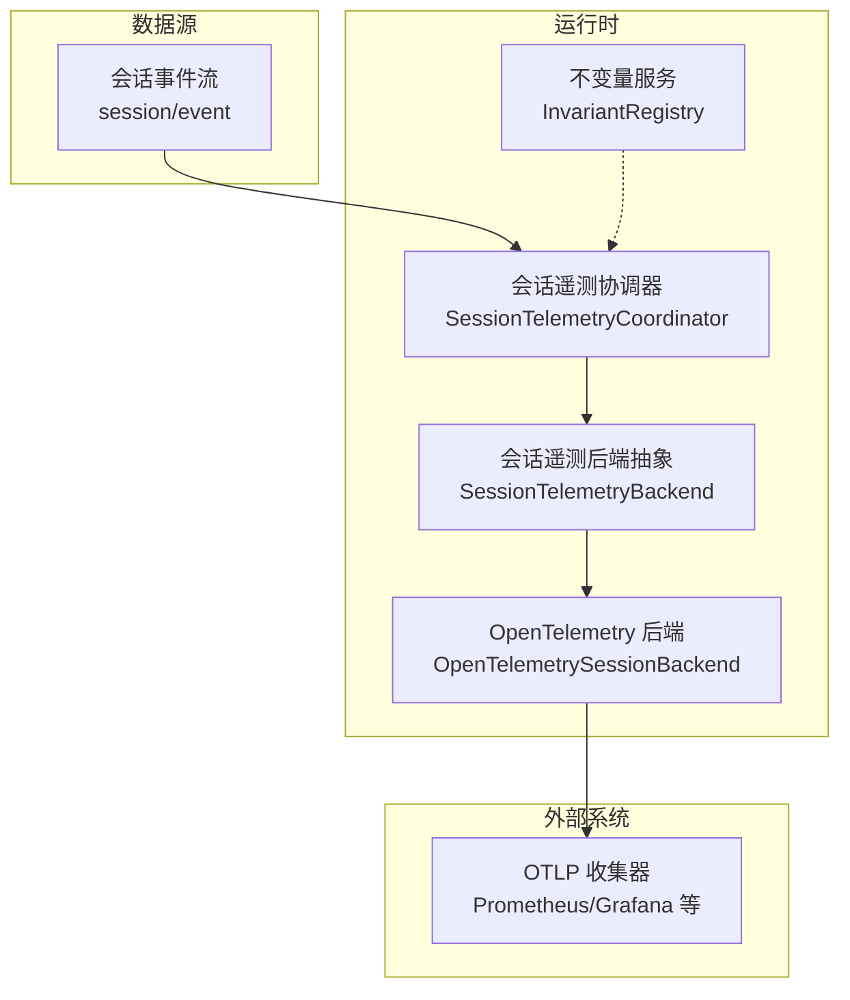
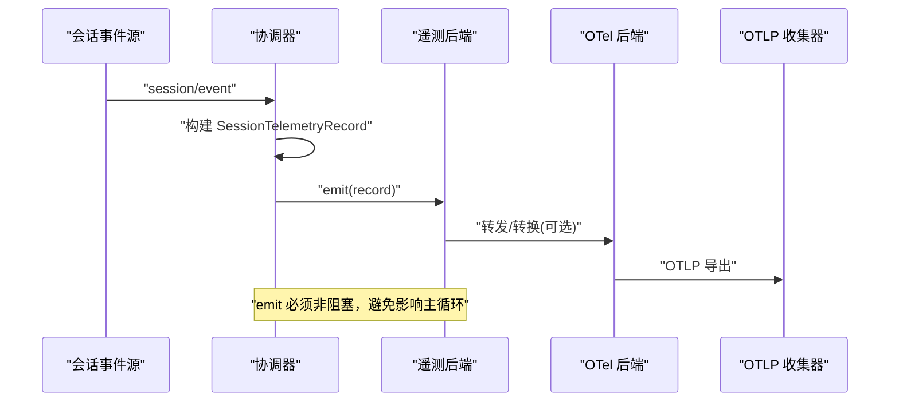
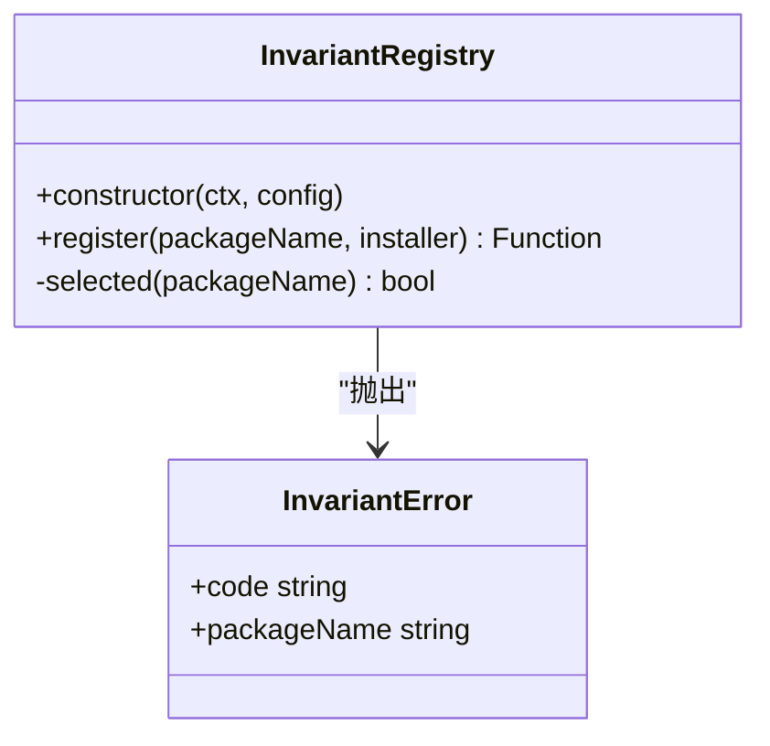
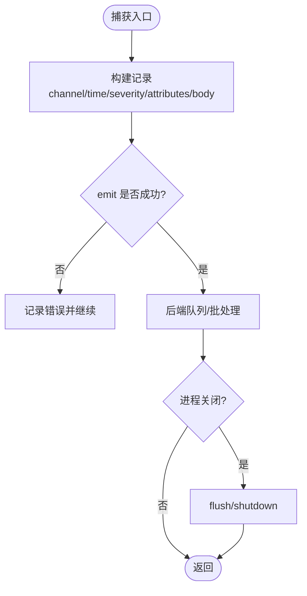
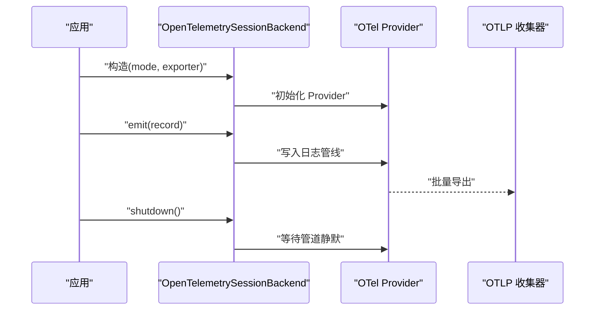
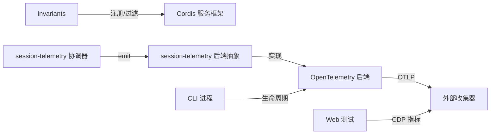

# 监控与日志

<cite>
**本文引用的文件**
- [packages/runtime-diagnostics/invariants/src/index.ts](file://packages/runtime-diagnostics/invariants/src/index.ts)
- [packages/runtime-diagnostics/invariants/src/invariant.ts](file://packages/runtime-diagnostics/invariants/src/invariant.ts)
- [packages/session/session-telemetry/src/index.ts](file://packages/session/session-telemetry/src/index.ts)
- [packages/session/session-telemetry-otel/src/index.ts](file://packages/session/session-telemetry-otel/src/index.ts)
- [packages/session/session-telemetry-otel/tests/otel.spec.ts](file://packages/session/session-telemetry-otel/tests/otel.spec.ts)
- [apps/cli/src/bin.ts](file://apps/cli/src/bin.ts)
- [apps/cli/src/process-shutdown.ts](file://apps/cli/src/process-shutdown.ts)
- [apps/web/tests/complex-history.perf.ts](file://apps/web/tests/complex-history.perf.ts)
- [packages/llm/token-meter/tests/token-meter.spec.ts](file://packages/llm/token-meter/tests/token-meter.spec.ts)
</cite>

## 目录
1. [简介](#简介)
2. [项目结构](#项目结构)
3. [核心组件](#核心组件)
4. [架构总览](#架构总览)
5. [详细组件分析](#详细组件分析)
6. [依赖关系分析](#依赖关系分析)
7. [性能考量](#性能考量)
8. [故障诊断指南](#故障诊断指南)
9. [结论](#结论)
10. [附录](#附录)

## 简介
本章节面向 DeepSeek Harness 的运行时可观测性，聚焦以下目标：
- 内置监控指标的采集与导出：包括性能指标、错误统计与资源使用情况。
- 日志级别配置、日志格式化与日志文件管理。
- 与外部监控系统（如 OpenTelemetry/Prometheus/Grafana）的集成方式。
- 故障诊断工具与调试技巧。
- 告警规则配置与通知机制建议。
- 性能分析与瓶颈识别方法。

## 项目结构
本项目将“运行时不变量检查”和“会话遥测”拆分为独立包，并通过 Cordis 服务注册机制装配到运行时：
- 运行时不变量：提供可配置的包级不变量注册与执行框架，用于在启动或运行期校验关键假设，失败时抛出结构化异常。
- 会话遥测：定义统一的捕获侧接口与协调器，负责从会话事件流中抽取逻辑记录并交给后端实现；OTel 后端负责将记录通过 OTLP 导出。
- CLI/Web 入口：CLI 进程生命周期管理与 Web 端浏览器性能指标采集。

图表来源
- [packages/session/session-telemetry/src/index.ts:1-179](file://packages/session/session-telemetry/src/index.ts#L1-L179)
- [packages/session/session-telemetry-otel/src/index.ts:141-168](file://packages/session/session-telemetry-otel/src/index.ts#L141-L168)
- [packages/runtime-diagnostics/invariants/src/index.ts:94-197](file://packages/runtime-diagnostics/invariants/src/index.ts#L94-L197)

章节来源
- [packages/runtime-diagnostics/invariants/src/index.ts:94-197](file://packages/runtime-diagnostics/invariants/src/index.ts#L94-L197)
- [packages/session/session-telemetry/src/index.ts:1-179](file://packages/session/session-telemetry/src/index.ts#L1-L179)
- [packages/session/session-telemetry-otel/src/index.ts:141-168](file://packages/session/session-telemetry-otel/src/index.ts#L141-L168)

## 核心组件
- 不变量服务（InvariantRegistry）
  - 作用：按包名白/黑名单过滤，启用或禁用各包的运行时不变量检查；失败时抛出带稳定错误码的结构化异常，便于机器路由与聚合。
  - 关键点：支持全局开关、正则包名过滤、子 Fiber 隔离安装与释放。
- 会话遥测协调器与后端
  - 作用：从会话事件流中捕获逻辑记录（包含通道、时间、严重级别、属性与主体），以非阻塞方式投递给后端；后端负责批处理、重试、队列与丢失策略。
  - 关键点：emit 必须非阻塞；flush/shutdown 由后端实现；共享策略（full/feedback-only/disabled）对外暴露。
- OpenTelemetry 后端
  - 作用：基于 OpenTelemetry SDK 将记录导出至 OTLP 接收端；根据模式决定上报范围；默认关闭以避免隐私泄露。
  - 关键点：注入 sessions 服务；mode 解析；sharing 状态映射；shutdown 超时控制。

章节来源
- [packages/runtime-diagnostics/invariants/src/index.ts:14-29](file://packages/runtime-diagnostics/invariants/src/index.ts#L14-L29)
- [packages/runtime-diagnostics/invariants/src/index.ts:94-197](file://packages/runtime-diagnostics/invariants/src/index.ts#L94-L197)
- [packages/session/session-telemetry/src/index.ts:47-131](file://packages/session/session-telemetry/src/index.ts#L47-L131)
- [packages/session/session-telemetry-otel/src/index.ts:141-168](file://packages/session/session-telemetry-otel/src/index.ts#L141-L168)

## 架构总览
下图展示了从会话事件到外部监控系统的端到端流程，以及不变量检查对运行时的保障。

图表来源
- [packages/session/session-telemetry/src/index.ts:47-131](file://packages/session/session-telemetry/src/index.ts#L47-L131)
- [packages/session/session-telemetry-otel/src/index.ts:141-168](file://packages/session/session-telemetry-otel/src/index.ts#L141-L168)

## 详细组件分析

### 不变量服务（InvariantRegistry）
- 设计要点
  - 通过 Service 注册为 invariants，提供 register(packageName, installer) 能力。
  - 支持 enabled、package_allowlist、package_blocklist 三项配置，编译为正则进行匹配。
  - 每个注册的包在子 Fiber 中执行，失败会释放该注册并保留上下文一致性。
  - 违反不变量时抛出 InvariantError，包含稳定 code 与 packageName，便于下游聚合与告警。
- 复杂度与性能
  - 注册阶段正则编译一次；选择判断为 O(n) 正则匹配，n 为允许/排除列表长度。
  - 安装过程在子 Fiber 内异步完成，不阻塞主流程。
- 错误处理
  - 非法参数（空包名、重复注册、无效正则）直接抛错。
  - 安装失败会清理注册表并返回 disposer。

图表来源
- [packages/runtime-diagnostics/invariants/src/index.ts:94-197](file://packages/runtime-diagnostics/invariants/src/index.ts#L94-L197)
- [packages/runtime-diagnostics/invariants/src/index.ts:49-66](file://packages/runtime-diagnostics/invariants/src/index.ts#L49-L66)

章节来源
- [packages/runtime-diagnostics/invariants/src/index.ts:14-29](file://packages/runtime-diagnostics/invariants/src/index.ts#L14-L29)
- [packages/runtime-diagnostics/invariants/src/index.ts:94-197](file://packages/runtime-diagnostics/invariants/src/index.ts#L94-L197)
- [packages/runtime-diagnostics/invariants/src/invariant.ts:10-29](file://packages/runtime-diagnostics/invariants/src/invariant.ts#L10-L29)

### 会话遥测协调器与后端
- 数据模型
  - SessionTelemetryRecord：包含 channel（ledger/ops）、time、severity（info/warn/error）、attributes、body。
  - severity 在捕获时预映射，error 来自事件自身结果或 agent-error 操作记录。
- 协调器职责
  - 监听 session/event，构造记录并以非阻塞 emit 投递给后端。
  - 提供 session-telemetry/record 事件作为脱敏扩展点，不影响原始日志。
- 后端契约
  - emit：必须非阻塞，错误被协调器捕获并记录，不传播到主循环。
  - flush：可选提示，后端自行控制并发与顺序。
  - shutdown：等待管道静默，确保已入队记录送达。

图表来源
- [packages/session/session-telemetry/src/index.ts:47-131](file://packages/session/session-telemetry/src/index.ts#L47-L131)

章节来源
- [packages/session/session-telemetry/src/index.ts:47-131](file://packages/session/session-telemetry/src/index.ts#L47-L131)

### OpenTelemetry 后端
- 模式与共享策略
  - mode 解析后映射为 sharing 状态：full / feedback-only / disabled。
  - 默认 DISABLED，避免意外外发敏感数据。
- 导出与生命周期
  - 使用 OTLP exporter 将记录发送到指定 URL。
  - shutdown 带有超时控制，确保优雅退出。
- 测试验证
  - 覆盖不同模式的 sharing 状态与无记录发送行为。

图表来源
- [packages/session/session-telemetry-otel/src/index.ts:141-168](file://packages/session/session-telemetry-otel/src/index.ts#L141-L168)
- [packages/session/session-telemetry-otel/tests/otel.spec.ts:98-106](file://packages/session/session-telemetry-otel/tests/otel.spec.ts#L98-L106)
- [packages/session/session-telemetry-otel/tests/otel.spec.ts:371-401](file://packages/session/session-telemetry-otel/tests/otel.spec.ts#L371-L401)

章节来源
- [packages/session/session-telemetry-otel/src/index.ts:141-168](file://packages/session/session-telemetry-otel/src/index.ts#L141-L168)
- [packages/session/session-telemetry-otel/tests/otel.spec.ts:98-106](file://packages/session/session-telemetry-otel/tests/otel.spec.ts#L98-L106)
- [packages/session/session-telemetry-otel/tests/otel.spec.ts:371-401](file://packages/session/session-telemetry-otel/tests/otel.spec.ts#L371-L401)

### CLI 进程生命周期与优雅关闭
- 进程关闭钩子：在 CLI 层统一处理进程退出信号，触发遥测后端的 shutdown，确保队列清空。
- 建议：在自定义插件或服务中订阅进程关闭事件，调用对应服务的 dispose/shutdown。

章节来源
- [apps/cli/src/bin.ts](file://apps/cli/src/bin.ts)
- [apps/cli/src/process-shutdown.ts](file://apps/cli/src/process-shutdown.ts)

### 浏览器性能指标采集（Web）
- 通过 Chrome DevTools Protocol 获取 Performance.getMetrics，提取 DOM 节点数、事件监听器数量、JS Heap 使用等指标。
- 可用于前端性能回归与容量规划。

章节来源
- [apps/web/tests/complex-history.perf.ts:515-542](file://apps/web/tests/complex-history.perf.ts#L515-L542)

### LLM Token 计量（示例）
- 提供不可变测量结果的断言用例，展示如何冻结与校验度量对象，保证下游消费安全。

章节来源
- [packages/llm/token-meter/tests/token-meter.spec.ts:148-167](file://packages/llm/token-meter/tests/token-meter.spec.ts#L148-L167)

## 依赖关系分析
- 不变量服务依赖 Cordis 的 Context/Service 与 schemastery 配置校验。
- 会话遥测协调器依赖 Cordis 的事件系统与 Service 注册。
- OTel 后端依赖 OTel SDK 与 exporter，注入 sessions 服务以获取上下文。
- CLI/Web 层通过各自入口与生命周期钩子与遥测后端交互。

图表来源
- [packages/runtime-diagnostics/invariants/src/index.ts:94-197](file://packages/runtime-diagnostics/invariants/src/index.ts#L94-L197)
- [packages/session/session-telemetry/src/index.ts:1-179](file://packages/session/session-telemetry/src/index.ts#L1-L179)
- [packages/session/session-telemetry-otel/src/index.ts:141-168](file://packages/session/session-telemetry-otel/src/index.ts#L141-L168)
- [apps/web/tests/complex-history.perf.ts:515-542](file://apps/web/tests/complex-history.perf.ts#L515-L542)

章节来源
- [packages/runtime-diagnostics/invariants/src/index.ts:94-197](file://packages/runtime-diagnostics/invariants/src/index.ts#L94-L197)
- [packages/session/session-telemetry/src/index.ts:1-179](file://packages/session/session-telemetry/src/index.ts#L1-L179)
- [packages/session/session-telemetry-otel/src/index.ts:141-168](file://packages/session/session-telemetry-otel/src/index.ts#L141-L168)

## 性能考量
- 热路径非阻塞：遥测 emit 必须仅做入队，避免阻塞会话主循环。
- 批处理与抖动：后端应合理设置批次大小与刷新间隔，平衡延迟与吞吐。
- 资源占用：Heap、DOM 节点、事件监听器数量等指标可用于评估内存与渲染压力。
- 压缩与存储：会话日志 ZIP 压缩级别可调，权衡 CPU 与体积。

[本节为通用指导，不直接分析具体文件]

## 故障诊断指南
- 不变量失败
  - 现象：抛出 InvariantError，包含稳定 code 与 packageName。
  - 定位：查看包名与消息，结合 allow/blocklist 配置确认是否误过滤。
  - 修复：调整配置或修复包内假设。
- 遥测未上报
  - 现象：后端 sharing=disabled 或未配置 exporter。
  - 定位：检查 mode 与 exporter.url；确认 OTLP 可达性与鉴权头。
  - 修复：启用 FULL/FEEDBACK_ONLY 并配置正确 endpoint。
- 进程退出丢数据
  - 现象：shutdown 前队列未完全导出。
  - 定位：检查后端 shutdown 超时与 flush 策略；确认 CLI 关闭钩子是否正确调用。
- 浏览器性能退化
  - 现象：HeapUsedSize、JSEventListeners、Nodes 增长异常。
  - 定位：通过 CDP 指标对比基线，定位泄漏或过度监听。

章节来源
- [packages/runtime-diagnostics/invariants/src/index.ts:49-66](file://packages/runtime-diagnostics/invariants/src/index.ts#L49-L66)
- [packages/session/session-telemetry-otel/src/index.ts:141-168](file://packages/session/session-telemetry-otel/src/index.ts#L141-L168)
- [apps/web/tests/complex-history.perf.ts:515-542](file://apps/web/tests/complex-history.perf.ts#L515-L542)

## 结论
DeepSeek Harness 通过“不变量服务”与“会话遥测”两大支柱，提供了从运行期假设校验到事件级可观测性的完整能力。配合 CLI/Web 的生命周期管理与浏览器指标采集，可在多端场景下实现一致的诊断与性能分析体验。生产部署建议：
- 默认关闭遥测外发，按需开启并最小化上报范围。
- 使用不变量白名单精准启用关键包检查。
- 在后端侧做好批处理与优雅关闭，确保数据完整性。
- 建立告警规则与可视化看板，持续跟踪性能与错误趋势。

[本节为总结，不直接分析具体文件]

## 附录

### 内置监控指标与导出方法
- 性能指标
  - 前端：DOM 节点数、事件监听器数量、JS Heap 使用等（CDP Performance.getMetrics）。
  - 后端：会话事件速率、错误率、Token 用量（可通过 token-meter 等扩展）。
- 错误统计
  - 不变量失败（InvariantError.code='INVARIANT'）。
  - 会话错误（tool-result isError、agent-error 等操作记录）。
- 资源使用
  - 内存与堆大小（浏览器 HeapUsedSize）。
  - 日志存储压缩级别（ZIP DEFLATE 级别）。

章节来源
- [apps/web/tests/complex-history.perf.ts:515-542](file://apps/web/tests/complex-history.perf.ts#L515-L542)
- [packages/llm/token-meter/tests/token-meter.spec.ts:148-167](file://packages/llm/token-meter/tests/token-meter.spec.ts#L148-L167)
- [packages/runtime-diagnostics/invariants/src/index.ts:49-66](file://packages/runtime-diagnostics/invariants/src/index.ts#L49-L66)

### 日志级别、格式与管理
- 级别
  - 遥测记录预映射 severity：info/warn/error。
  - 不变量失败统一为错误级别。
- 格式
  - 记录包含 channel、time、severity、attributes、body，便于结构化查询与聚合。
- 管理
  - 通过 session-telemetry/record 事件进行脱敏与裁剪。
  - 后端负责持久化/导出策略（批处理、重试、丢弃策略）。

章节来源
- [packages/session/session-telemetry/src/index.ts:47-131](file://packages/session/session-telemetry/src/index.ts#L47-L131)

### 与 Prometheus/Grafana 集成
- 推荐路径
  - 使用 OTel Collector 将 OTLP 日志/指标转换为 Prometheus 格式，再推送至 Prometheus。
  - Grafana 连接 Prometheus 进行可视化与告警。
- 注意事项
  - 明确上报范围（full/feedback-only/disabled）。
  - 合理设置采样与批处理，避免过载。
  - 使用 attributes 作为标签键，便于多维分析。

[本节为概念性说明，不直接分析具体文件]

### 告警规则与通知
- 基于遥测记录的告警
  - 针对 error 级别记录（如 tool-result isError、agent-error）设置阈值告警。
  - 针对不变量失败（INVARIANT）设置即时告警。
- 通知渠道
  - 通过 OTel Collector 或中间件转发至邮件/IM/工单系统。
- 建议
  - 区分环境（开发/预发/生产）与告警等级。
  - 避免告警风暴：去重、合并、抑制。

[本节为概念性说明，不直接分析具体文件]

### 性能分析与瓶颈识别
- 前端
  - 关注 JSHeapUsedSize、JSEventListeners、Nodes 变化趋势。
  - 结合用户操作路径，定位热点页面与组件。
- 后端
  - 关注会话事件吞吐、错误率、token 消耗。
  - 通过 attributes 维度（session.id、event.type）下钻分析。
- 工具
  - 浏览器 CDP 指标、OTel 导出链路、日志聚合平台。

章节来源
- [apps/web/tests/complex-history.perf.ts:515-542](file://apps/web/tests/complex-history.perf.ts#L515-L542)
- [packages/session/session-telemetry/src/index.ts:47-131](file://packages/session/session-telemetry/src/index.ts#L47-L131)