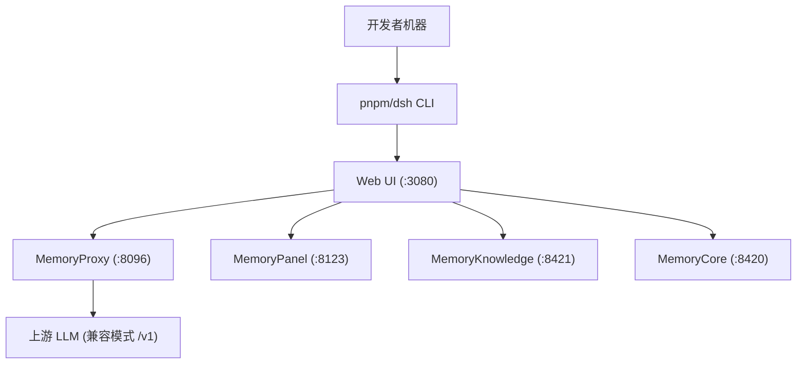
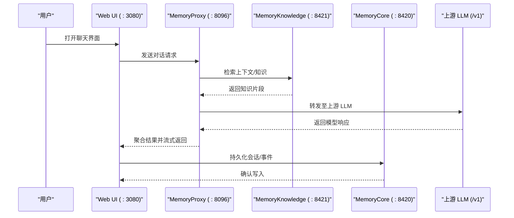
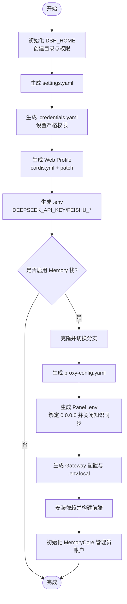
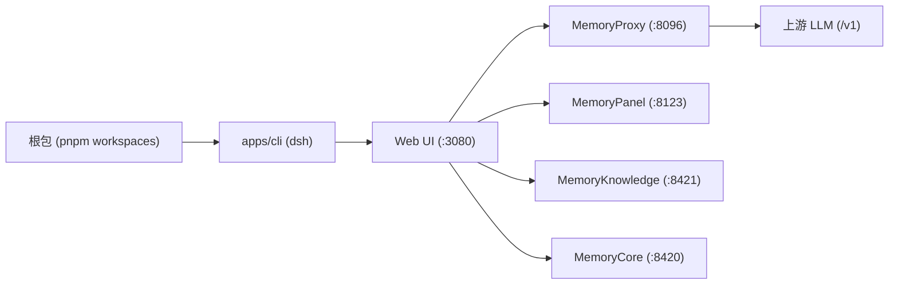

# 部署运维

<cite>
**本文引用的文件**
- [README.md](file://README.md)
- [package.json](file://package.json)
- [setup.sh](file://scripts/setup-dsh/setup.sh)
- [setup.env.example](file://scripts/setup-dsh/setup.env.example)
- [settings.yaml](file://scripts/setup-dsh/templates/settings.yaml)
- [cordis.yml](file://scripts/setup-dsh/templates/profile-web/cordis.yml)
- [ci.yml](file://.github/workflows/ci.yml)
- [web-server.i18n.yaml](file://docs/subsystems/web-server.i18n.yaml)
</cite>

## 目录
1. [简介](#简介)
2. [项目结构](#项目结构)
3. [核心组件](#核心组件)
4. [架构总览](#架构总览)
5. [详细组件分析](#详细组件分析)
6. [依赖关系分析](#依赖关系分析)
7. [性能考虑](#性能考虑)
8. [故障排查指南](#故障排查指南)
9. [结论](#结论)
10. [附录](#附录)

## 简介
本文件面向 DeepSeek Harness（dsh）的部署与运维，覆盖本地一键启动、生产环境配置要点、容器化思路、环境变量与安全、监控与日志、备份恢复与数据迁移、负载均衡与高可用、以及 CI/CD 流水线自动化。内容基于仓库内脚本、模板与 CI 配置整理，确保可落地执行。

## 项目结构
- 应用入口与命令：通过根包脚本暴露 dsh CLI，支持 web 模式启动 Web UI。
- 本地一键引导：提供 setup.sh 脚本，生成用户级配置、Web 配置文件、可选的 Memory 栈（代理、面板、知识、核心）及 GitLab MR 集成。
- 配置模板：settings.yaml 定义 LLM 提供方与默认模型；profile-web 下的 cordis.yml 作为空入口，实际能力通过补丁注入。
- CI/CD：GitHub Actions 工作流包含静态检查、覆盖率、快照、兼容性、Windows/Wine 验证等。

图表来源
- [setup.sh:254-419](file://scripts/setup-dsh/setup.sh#L254-L419)
- [setup.sh:533-537](file://scripts/setup-dsh/setup.sh#L533-L537)
- [settings.yaml:5-53](file://scripts/setup-dsh/templates/settings.yaml#L5-L53)

章节来源
- [README.md:13-37](file://README.md#L13-L37)
- [package.json:19-147](file://package.json#L19-L147)
- [setup.sh:1-540](file://scripts/setup-dsh/setup.sh#L1-L540)
- [settings.yaml:1-53](file://scripts/setup-dsh/templates/settings.yaml#L1-L53)
- [cordis.yml:1-5](file://scripts/setup-dsh/templates/profile-web/cordis.yml#L1-L5)

## 核心组件
- dsh CLI 与 Web 服务：提供 Web UI 与 Agent 编排能力，默认监听 127.0.0.1:3080，可通过参数调整 host/port。
- Memory 栈（可选）：
  - MemoryProxy：统一 LLM 路由与鉴权，转发到上游或本地 Core。
  - MemoryCore：会话与记忆存储、网关。
  - MemoryKnowledge：知识检索服务。
  - MemoryPanel：可视化面板，便于查看会话与注入效果。
- 配置体系：
  - settings.yaml：LLM 提供方、默认模型、模型能力元信息。
  - profile-web/cordis.yml：空入口，通过 cordis.patch.yml 注入插件与能力。
  - .credentials.yaml：存放 PROXY_USER_KEY 等敏感信息，权限严格限制。

章节来源
- [README.md:13-37](file://README.md#L13-L37)
- [package.json:19-147](file://package.json#L19-L147)
- [setup.sh:164-231](file://scripts/setup-dsh/setup.sh#L164-L231)
- [settings.yaml:5-53](file://scripts/setup-dsh/templates/settings.yaml#L5-L53)
- [cordis.yml:1-5](file://scripts/setup-dsh/templates/profile-web/cordis.yml#L1-L5)

## 架构总览
下图展示本地一键启动后的典型调用链：Web UI 发起对话请求，经由 MemoryProxy 路由到上游 LLM 或本地 MemoryCore，同时可联动 Knowledge 与 Panel。

图表来源
- [setup.sh:254-419](file://scripts/setup-dsh/setup.sh#L254-L419)
- [setup.sh:533-537](file://scripts/setup-dsh/setup.sh#L533-L537)
- [settings.yaml:5-53](file://scripts/setup-dsh/templates/settings.yaml#L5-L53)

## 详细组件分析

### 本地一键部署流程
- 运行引导脚本，自动创建用户目录、生成 settings.yaml、.credentials.yaml、Web Profile 配置。
- 可选择克隆并配置 Memory 栈（Proxy/Core/Knowledge/Panel），生成各自配置与环境变量。
- 安装依赖并构建前端资源（如 Panel 的 web/dist）。
- 输出启动顺序与端口说明，便于手动或脚本化启动。

图表来源
- [setup.sh:159-231](file://scripts/setup-dsh/setup.sh#L159-L231)
- [setup.sh:233-419](file://scripts/setup-dsh/setup.sh#L233-L419)
- [setup.sh:421-457](file://scripts/setup-dsh/setup.sh#L421-L457)

章节来源
- [setup.sh:1-540](file://scripts/setup-dsh/setup.sh#L1-L540)

### 环境变量与安全
- 关键环境变量（示例见模板）：
  - DSH_PROXY_USER_KEY：Memory 代理用户密钥，唯一且不可复制。
  - DSH_DEEPSEEK_API_KEY、DSH_FEISHU_APP_ID、DSH_FEISHU_APP_SECRET：直接 API 与飞书集成所需。
  - DSH_PROXY_UPSTREAM_URL、DSH_PROXY_UPSTREAM_API_KEY：代理上游 LLM 地址与密钥。
  - DSH_KERNEL_GATEWAY_API_KEY：面板元数据实例的 bearer（可为空时回退）。
  - DSH_TDAI_LLM_API_KEY、DSH_TDAI_LLM_BASE_URL、DSH_TDAI_LLM_MODEL：MemoryCore 网关 LLM 配置。
  - DSH_MEMORY_DATA_DIR：MemoryCore 数据目录（默认在用户目录下）。
  - DSH_GITLAB_BOT_USERNAME、DSH_GITLAB_API_BASE、DSH_GITLAB_TOKEN：可选的 GitLab MR 集成。
- 安全建议：
  - 所有密钥文件（如 .credentials.yaml、settings.yaml、proxy-config.yaml）需设置为仅所有者可读写。
  - 避免将真实值提交到版本库；使用 .env 与模板占位符管理。
  - 面板默认无鉴权，若暴露在局域网应通过防火墙限制访问 :8123。

章节来源
- [setup.env.example:1-55](file://scripts/setup-dsh/setup.env.example#L1-L55)
- [setup.sh:30-46](file://scripts/setup-dsh/setup.sh#L30-L46)
- [setup.sh:171-186](file://scripts/setup-dsh/setup.sh#L171-L186)
- [setup.sh:257-271](file://scripts/setup-dsh/setup.sh#L257-L271)
- [setup.sh:274-310](file://scripts/setup-dsh/setup.sh#L274-L310)
- [setup.sh:318-361](file://scripts/setup-dsh/setup.sh#L318-L361)

### 生产环境配置要点
- 网络暴露：
  - Web UI 默认绑定 127.0.0.1；如需对外暴露，请通过反向代理（Nginx/Traefik）并开启 TLS。
  - 面板与内部服务建议仅内网可达，必要时加防火墙策略。
- 配置分离：
  - 使用 settings.yaml 管理 LLM 提供方与模型列表；密钥通过环境变量或凭据存储注入，不直接写入配置。
  - 使用 profile-web/cordis.yml 作为空入口，通过 cordis.patch.yml 注入插件与能力，便于分层管理。
- 数据目录：
  - 明确 MEMORY_DATA_DIR 路径并做定期备份；确保磁盘容量与 I/O 满足预期。
- 进程管理：
  - 建议使用 systemd/supervisor/docker 管理各服务生命周期，配合健康检查与重启策略。

章节来源
- [setup.sh:274-291](file://scripts/setup-dsh/setup.sh#L274-L291)
- [setup.sh:533-537](file://scripts/setup-dsh/setup.sh#L533-L537)
- [settings.yaml:5-53](file://scripts/setup-dsh/templates/settings.yaml#L5-L53)

### 容器化部署方案（概念性）
- 镜像拆分：
  - dsh-web：包含 Node 运行时与构建产物，暴露 :3080。
  - memory-proxy：Node 服务，加载 proxy-config.yaml。
  - memory-core/knowledge/panel：按服务独立镜像，挂载数据卷。
- 配置注入：
  - 通过环境变量与 ConfigMap/Secret 注入密钥与配置，避免硬编码。
- 网络与存储：
  - 使用 Docker Compose 或 Kubernetes Service/Ingress 管理内部通信与外部入口。
  - 持久化 MemoryCore 数据目录，确保跨 Pod 共享或外置存储。
- 健康检查与滚动更新：
  - 为各服务实现 /health 探针；结合 readiness/liveness 探针保障可用性。

注：本节为概念性指导，具体镜像与编排文件需根据团队规范补充。

### 监控指标与日志
- 指标采集：
  - 可在服务中暴露 metrics 端点（例如框架 service 中的 metrics 命名空间），由 Prometheus 抓取。
  - 对关键路径（代理转发、模型调用、会话持久化）埋点，记录延迟、错误率与吞吐。
- 日志管理：
  - 集中收集 stdout/stderr 日志，结合结构化日志字段（session_id、provider、model、trace_id）。
  - 对敏感信息脱敏，避免泄露密钥与用户数据。
- 告警策略：
  - 针对错误率突增、上游 LLM 超时、数据库写入失败等场景设置阈值告警。

章节来源
- [web-server.i18n.yaml:1-6](file://docs/subsystems/web-server.i18n.yaml#L1-L6)

### 备份恢复与数据迁移
- 备份范围：
  - MemoryCore 数据目录（含 SQLite 数据库）。
  - settings.yaml、.credentials.yaml、proxy-config.yaml、panel 配置等。
- 恢复步骤：
  - 停止相关服务，拷贝数据目录与配置文件到目标环境。
  - 校验权限与路径一致性，重启服务后验证面板与代理连通性。
- 迁移注意事项：
  - 不同版本间注意 schema 变更；升级前备份并在测试环境验证。
  - 若更换上游 LLM 或模型，需同步更新 settings.yaml 与代理配置。

章节来源
- [setup.sh:318-361](file://scripts/setup-dsh/setup.sh#L318-L361)
- [setup.sh:421-457](file://scripts/setup-dsh/setup.sh#L421-L457)

### 负载均衡、水平扩展与高可用
- 负载均衡：
  - 将多个 dsh-web 实例置于反向代理之后，按会话粘性或轮询分发。
  - 上游 LLM 若支持多实例，可在代理层做健康检查与故障转移。
- 水平扩展：
  - 无状态 Web UI 可横向扩容；有状态服务（如 MemoryCore）需共享存储或分片。
- 高可用：
  - 多副本部署 + 健康检查 + 自动重启。
  - 数据库层面采用 WAL 与定期备份，必要时引入主从或集群。

注：本节为通用实践建议，具体实施需结合基础设施与业务负载。

### CI/CD 流水线与自动化部署
- 质量门禁：
  - 静态检查、类型检查、覆盖率、快照对比、兼容性矩阵（Node 版本）、Windows/Wine 验证。
- 缓存优化：
  - pnpm store 与 Playwright 浏览器缓存加速构建。
- 发布流程：
  - 触发条件（push/PR/dispatch），并行执行多任务，失败快速阻断。
- 自动化部署建议：
  - 将构建产物推送到制品库，由部署流水线拉取并滚动更新。
  - 使用环境变量与密钥管理（CI Secrets）注入敏感配置。

章节来源
- [ci.yml:1-800](file://.github/workflows/ci.yml#L1-L800)

## 依赖关系分析
- 构建与运行依赖：
  - Node.js 版本要求与 pnpm 工作区管理。
  - 各子模块通过 workspace 组织，CLI 入口指向 apps/cli/src/bin.ts。
- 外部依赖：
  - Memory 栈（可选）：Proxy/Core/Knowledge/Panel。
  - 上游 LLM：通过兼容模式 /v1 接口接入。
- 配置依赖：
  - settings.yaml 决定 LLM 提供方与模型；profile-web 通过补丁注入能力。

图表来源
- [package.json:11-18](file://package.json#L11-L18)
- [package.json:141-147](file://package.json#L141-L147)
- [setup.sh:533-537](file://scripts/setup-dsh/setup.sh#L533-L537)

章节来源
- [package.json:1-188](file://package.json#L1-L188)
- [setup.sh:533-537](file://scripts/setup-dsh/setup.sh#L533-L537)

## 性能考虑
- 构建与安装：
  - 使用 pnpm store 缓存与 frozen-lockfile 提升稳定性与速度。
  - 并行执行任务（如安装与 bubblewrap 准备）缩短冷启动时间。
- 运行时：
  - 合理设置并发度（如 DSH_GATE_CONCURRENCY、DSH_SNAPSHOT_MAX_CONCURRENCY）。
  - 上游 LLM 超时与重试策略需结合业务 SLA 调优。
- 存储：
  - 关注 MemoryCore 数据目录的 I/O 性能与容量规划。
  - 定期压缩与归档历史会话，避免膨胀。

章节来源
- [ci.yml:118-179](file://.github/workflows/ci.yml#L118-L179)
- [ci.yml:180-264](file://.github/workflows/ci.yml#L180-L264)
- [setup.sh:363-419](file://scripts/setup-dsh/setup.sh#L363-L419)

## 故障排查指南
- 常见问题定位：
  - 面板无法访问：检查 .env 中 HOST 绑定与防火墙策略。
  - 代理认证失败：确认 .credentials.yaml 中 PROXY_USER_KEY 与上游密钥一致。
  - 模型不可用：核对 settings.yaml 中 provider 与 model id，以及上游 LLM 连通性。
- 日志与诊断：
  - 查看服务 stdout/stderr 日志，关注错误堆栈与上下文。
  - 使用面板观察会话注入与知识检索效果。
- 恢复步骤：
  - 清理临时文件与 node_modules，重新安装依赖。
  - 重置配置并重新运行引导脚本（谨慎操作，避免覆盖已有数据）。

章节来源
- [setup.sh:274-291](file://scripts/setup-dsh/setup.sh#L274-L291)
- [setup.sh:318-361](file://scripts/setup-dsh/setup.sh#L318-L361)
- [setup.sh:421-457](file://scripts/setup-dsh/setup.sh#L421-L457)

## 结论
DeepSeek Harness 提供了完善的本地一键部署能力与可扩展的 Memory 栈，适合从开发到生产的渐进式演进。通过合理的配置管理、安全策略、监控与备份机制，可实现稳定可靠的 Agent 平台。建议在生产环境中结合反向代理、容器化编排与 CI/CD 流水线，形成端到端的自动化交付与运维闭环。

## 附录
- 快速启动参考：
  - 本地启动顺序与端口见引导脚本输出。
  - 通过 Web UI 进行对话与调试，面板用于观察注入效果。
- 配置参考：
  - settings.yaml 中的提供方与模型列表。
  - 环境变量模板用于注入密钥与上游地址。

章节来源
- [setup.sh:525-540](file://scripts/setup-dsh/setup.sh#L525-L540)
- [settings.yaml:5-53](file://scripts/setup-dsh/templates/settings.yaml#L5-L53)
- [setup.env.example:1-55](file://scripts/setup-dsh/setup.env.example#L1-L55)