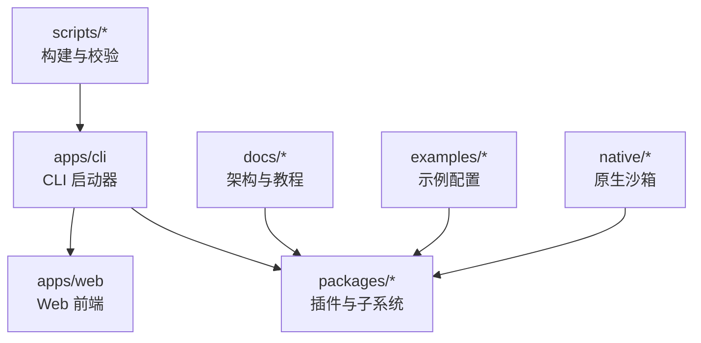
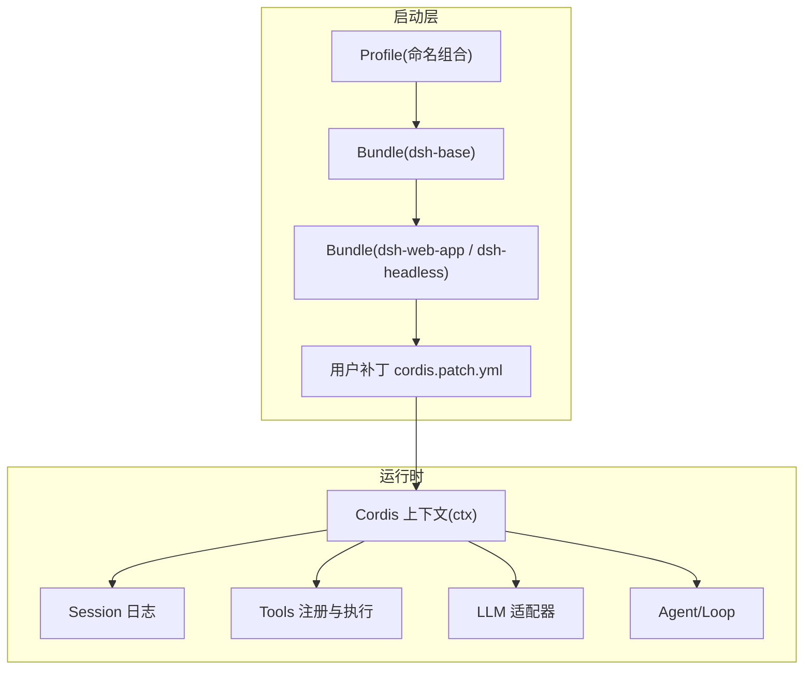
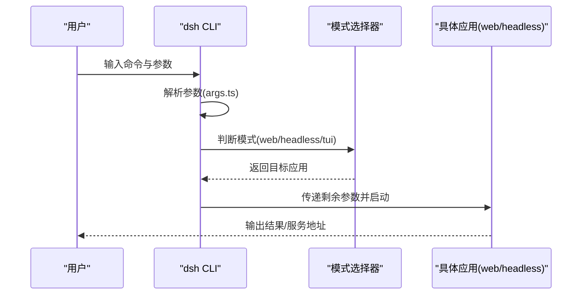
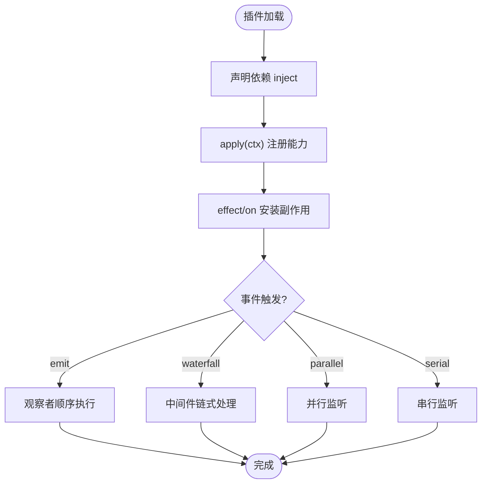
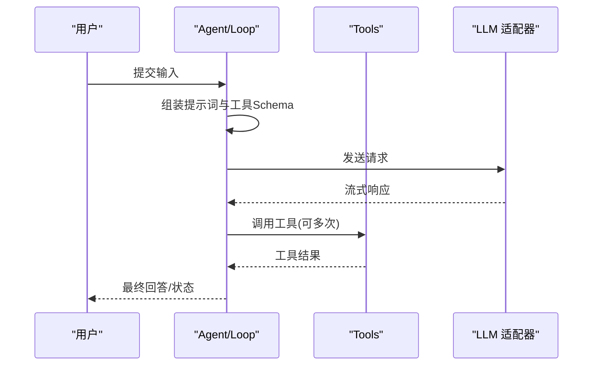
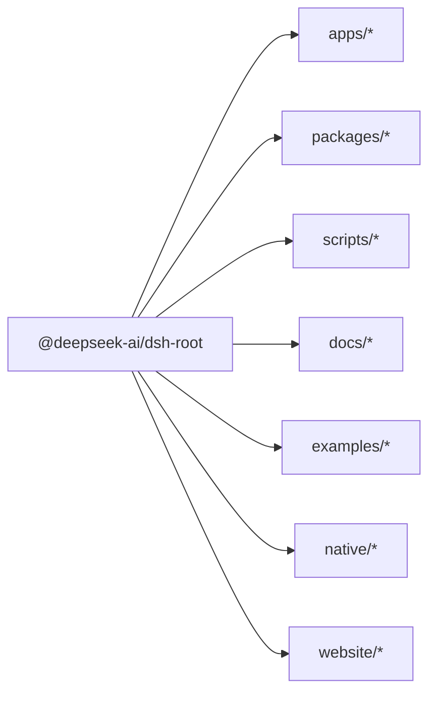

# 项目概览

<cite>
**本文引用的文件**
- [README.md](file://README.md)
- [package.json](file://package.json)
- [apps/cli/README.md](file://apps/cli/README.md)
- [apps/web/package.json](file://apps/web/package.json)
- [docs/architecture.md](file://docs/architecture.md)
- [docs/cordis-primer.md](file://docs/cordis-primer.md)
- [THIRD_PARTY_NOTICES.md](file://THIRD_PARTY_NOTICES.md)
- [CONTRIBUTING.md](file://CONTRIBUTING.md)
- [apps/cli/src/args.ts](file://apps/cli/src/args.ts)
</cite>

## 目录
1. [简介](#简介)
2. [项目结构](#项目结构)
3. [核心组件](#核心组件)
4. [架构总览](#架构总览)
5. [详细组件分析](#详细组件分析)
6. [依赖关系分析](#依赖关系分析)
7. [性能与可扩展性](#性能与可扩展性)
8. [故障排查指南](#故障排查指南)
9. [结论](#结论)
10. [附录：快速开始与使用示例](#附录快速开始与使用示例)

## 简介
DeepSeek Harness（简称 dsh）是由 DeepSeek AI 开源的“智能体编排框架”。其设计哲学是“一切皆插件”，通过内置的 Cordis 插件框架，将模型适配器、工具注册表、会话日志、Agent 循环等全部以插件形式提供，从而在配置层面即可替换任意能力。项目当前处于开发者预览阶段，迭代迅速，API 和配置可能包含破坏性变更。

- 目标与价值主张
  - 为开发者与团队提供可插拔、可组合的智能体运行基座，支持 Web UI、命令行与无头模式等多种运行方式。
  - 通过“插件即服务”的机制，让扩展点清晰、边界明确，便于生态共建与二次开发。
- 技术栈要点
  - Node.js 运行时（要求特定版本范围），TypeScript 工程化，Vite 构建前端，pnpm 工作区管理多包仓库。
  - 基于 Cordis 的插件体系，事件驱动与服务发现，支持热重载与可逆效果。
- 许可证与社区
  - 项目采用 MIT 许可证；第三方依赖许可见 THIRD_PARTY_NOTICES.md。
  - 社区渠道包括 GitHub Discussions、Discord 频道以及插件主题标签 dsh-plugin。

章节来源
- [README.md:1-60](file://README.md#L1-L60)
- [THIRD_PARTY_NOTICES.md:1-10](file://THIRD_PARTY_NOTICES.md#L1-L10)
- [CONTRIBUTING.md:1-24](file://CONTRIBUTING.md#L1-L24)

## 项目结构
仓库采用多包工作区组织，核心目录说明如下：
- apps
  - cli：产品启动器与命令入口，负责解析参数、选择并引导不同 Profile（web/headless 等）。
  - web：Web 前端应用，基于 Vite 构建，由 CLI 的 web 模式提供服务。
- packages：按子系统划分的插件与能力实现（如 session、tools、llm、agent-loop、scope 等）。
- docs：架构、Cordis 教程、子系统文档、用户指南与食谱。
- examples：示例 Agent 配置与用例，覆盖代码模式、无头执行、MCP 内存等场景。
- scripts：构建、校验、发布、文档生成等工程脚本。
- native：原生安全沙箱相关工具（Landlock 等）。
- website：文档站点源码与构建产物。

图表来源
- [package.json:11-18](file://package.json#L11-L18)
- [apps/cli/README.md:1-48](file://apps/cli/README.md#L1-L48)
- [apps/web/package.json:1-49](file://apps/web/package.json#L1-L49)

章节来源
- [package.json:11-18](file://package.json#L11-L18)
- [apps/cli/README.md:1-48](file://apps/cli/README.md#L1-L48)
- [apps/web/package.json:1-49](file://apps/web/package.json#L1-L49)

## 核心组件
- 插件框架（Cordis）
  - 插件以 Service 对象形式存在，声明依赖 inject，通过 ctx 暴露稳定键名（如 ctx.tools、ctx.llm、ctx.sessions）。
  - 事件系统支持 emit/waterfall/parallel/serial 多种分发模式，注册项可通过 effect/on 安装并在卸载时回滚。
- 配置文件与组合
  - 通过 Profile + Bundle 分层叠加，形成最终运行树；支持用户 patch 与 --patch 覆盖。
  - 可使用 --dump-config/--dump-default-config 查看组合结果。
- 关键子系统
  - Session：追加式事件日志与内存存储。
  - System Prompt：提示词片段与工具 Schema 组装。
  - Tools：作用域化工具注册与受保护执行管线。
  - Agent/Agent Loop：Agent 接口与默认驱动。
  - LLM：消息与流式协议及适配器切面。

章节来源
- [docs/cordis-primer.md:1-45](file://docs/cordis-primer.md#L1-L45)
- [docs/architecture.md:9-38](file://docs/architecture.md#L9-L38)
- [docs/architecture.md:39-62](file://docs/architecture.md#L39-L62)

## 架构总览
dsh 的架构围绕“一切皆插件”展开：所有功能都以插件形式贡献到共享上下文，任何部分均可被配置替换。Profile 与 Bundle 构成启动时的分层组合，用户可在最上层注入补丁或覆盖行为。

图表来源
- [docs/architecture.md:15-38](file://docs/architecture.md#L15-L38)
- [docs/architecture.md:39-62](file://docs/architecture.md#L39-L62)

章节来源
- [docs/architecture.md:15-38](file://docs/architecture.md#L15-L38)
- [docs/architecture.md:39-62](file://docs/architecture.md#L39-L62)

## 详细组件分析

### CLI 启动器与运行模式
- 入口与参数
  - CLI 统一解析 argv，区分 web、headless、tui 等模式，并将非识别参数透传给对应应用。
  - 支持 --profile、--patch、--dump-config、--dump-default-config 等选项。
- 运行模式
  - web：启动 Web UI 并提供本地服务，默认打开浏览器（可 --no-open）。
  - headless：一次性持久会话，打印最终答案后退出。
  - tui：终端界面（由其他 profile 提供）。
- 参数路由
  - 父级选项与子命令选项严格分离，避免误传。

图表来源
- [apps/cli/src/args.ts:147-169](file://apps/cli/src/args.ts#L147-L169)
- [apps/cli/README.md:7-43](file://apps/cli/README.md#L7-L43)

章节来源
- [apps/cli/README.md:7-43](file://apps/cli/README.md#L7-L43)
- [apps/cli/src/args.ts:147-169](file://apps/cli/src/args.ts#L147-L169)

### Web 前端与应用
- 前端构建
  - 基于 Vite 构建 React 应用，产物由 CLI 的 web 模式提供静态资源与 API 网关。
- 开发与部署
  - 开发时使用 dev/watch 脚本；生产构建产物由根脚本统一打包。
- 安全与访问
  - 默认绑定 127.0.0.1；LAN 访问需显式指定 host 并通过信任边界控制。

章节来源
- [apps/web/package.json:1-49](file://apps/web/package.json#L1-L49)
- [README.md:13-37](file://README.md#L13-L37)

### 插件与扩展点（Cordis）
- 插件生命周期
  - 插件实现 Service，声明 inject 依赖，apply(ctx) 中注册能力；effect/on 注册的副作用可逆。
- 事件与通信
  - 通过 typed events 进行观察、包装、并行或串行处理；waterfall 用于中间件式拦截。
- 扩展建议
  - 将能力封装为插件，优先用事件做策略与拦截，用服务方法做直接调用。

图表来源
- [docs/cordis-primer.md:7-45](file://docs/cordis-primer.md#L7-L45)

章节来源
- [docs/cordis-primer.md:7-45](file://docs/cordis-primer.md#L7-L45)

### 会话与 Agent 循环
- 会话日志
  - 追加式事件日志，作为模型可见上下文的唯一来源；所有进入模型的输入必须可从日志重建。
- 轮次与步骤
  - turn：零或多步；step：一次模型请求及其工具调用。
  - 事件包括 turn/*、step/*、user/message、assistant/*、tool/* 等，部分为水坝事件需调用 next()。
- 能力切面
  - 通过 ctx.* 暴露可替换能力（fs、tools、llm、shell、jobs、sandbox 等）。

图表来源
- [docs/architecture.md:63-98](file://docs/architecture.md#L63-L98)

章节来源
- [docs/architecture.md:63-98](file://docs/architecture.md#L63-L98)

## 依赖关系分析
- 工作区与包管理
  - pnpm 工作区，Node 引擎限定版本范围；根 package.json 定义脚本与工作区路径。
- 第三方依赖
  - 运行时依赖涵盖 LSP、PTY、Markdown/Math 渲染、OpenTelemetry、React/Vite 等。
  - 官方平台载荷授权与版本清单见 THIRD_PARTY_NOTICES.md。
- 内嵌框架
  - Cordis 及相关插件以 vendor 形式内嵌，保持 MIT 许可与上游一致性。

图表来源
- [package.json:11-18](file://package.json#L11-L18)
- [THIRD_PARTY_NOTICES.md:12-27](file://THIRD_PARTY_NOTICES.md#L12-L27)

章节来源
- [package.json:1-18](file://package.json#L1-L18)
- [THIRD_PARTY_NOTICES.md:12-27](file://THIRD_PARTY_NOTICES.md#L12-L27)

## 性能与可扩展性
- 可扩展性
  - 插件化架构使新增能力（模型、工具、文件系统、沙箱、后台任务等）无需改动核心，仅通过注册与事件扩展。
  - 通过 Profile/Bundles 组合，可按场景裁剪能力集。
- 性能考量
  - 会话日志追加式写入，利于回放与审计；事件分发模式按需选择（并发 vs 串行）。
  - 工具执行管线具备守卫与权限控制，减少不必要开销。
- 优化建议
  - 合理拆分插件，避免过度耦合；对高频事件使用 emit/parallel，对决策型流程使用 waterfall/serial。
  - 利用 --dump-config 检查实际组合树，减少冗余插件。

[本节为通用指导，不直接分析具体文件]

## 故障排查指南
- 常见问题定位
  - 参数错误：CLI 会拒绝父级选项传入子命令，并给出用法提示。
  - 配置错误：使用 --dump-config/--dump-default-config 查看组合后的配置树，定位冲突或重复行。
  - 启动失败：检查 Node 版本、端口占用、网络绑定策略（LAN 访问需显式 host）。
- 调试手段
  - 启用日志与追踪（OpenTelemetry 等）；在工具与 Agent 事件中插入监听，记录关键状态。
  - 使用快照测试与回放机制复现问题。

章节来源
- [apps/cli/src/args.ts:147-169](file://apps/cli/src/args.ts#L147-L169)
- [apps/cli/README.md:30-43](file://apps/cli/README.md#L30-L43)
- [README.md:13-37](file://README.md#L13-L37)

## 结论
DeepSeek Harness 以“一切皆插件”为核心，借助 Cordis 提供了高度可扩展的智能体编排基座。通过 Profile/Bundles 的组合机制，用户可以灵活拼装出面向 Web UI、命令行和无头模式的多种运行形态。对于初学者，它提供了清晰的入门路径与丰富的示例；对于有经验的开发者，它提供了明确的扩展点与强大的事件/服务机制，便于深度定制与生态共建。

[本节为总结，不直接分析具体文件]

## 附录：快速开始与使用示例
- 从 npm 运行（推荐）
  - 安装 Node.js 后，执行 npx @deepseek-ai/dsh web，默认在 http://127.0.0.1:3080 启动 Web UI 并自动打开浏览器；如需仅启动服务器而不打开浏览器，可加 --no-open。
- 从源码运行
  - 克隆仓库，安装依赖并构建，然后使用 pnpm dsh web 启动。
- 常用命令
  - dsh web：启动 Web UI（等价于 --profile web）。
  - dsh --profile headless "任务描述"：运行一次性持久会话，输出最终答案后退出。
  - dsh --profile <name>：启动指定名称的 Profile。
  - dsh plugin --profile <name> <pnpm args>：在 Profile 目录下管理插件。
- 查看组合配置
  - dsh --profile web --dump-config：打印实际启动的配置树。
  - dsh --profile web --dump-default-config：打印 bundle 层默认配置（不含用户层）。

章节来源
- [README.md:13-37](file://README.md#L13-L37)
- [apps/cli/README.md:7-43](file://apps/cli/README.md#L7-L43)