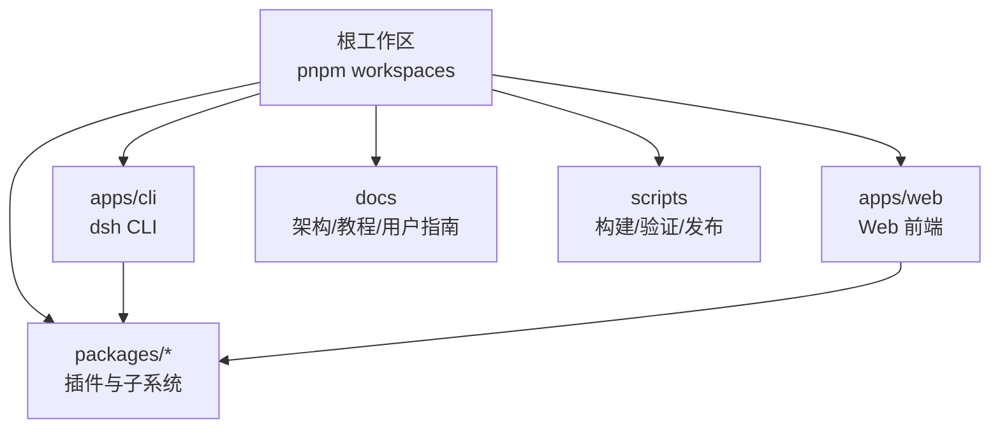
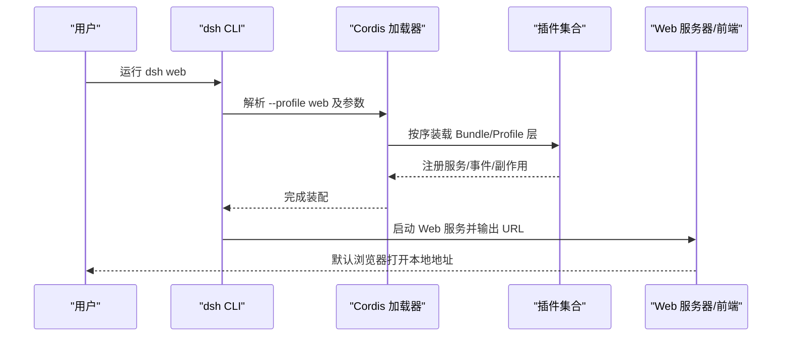
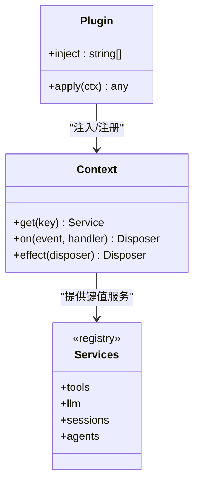
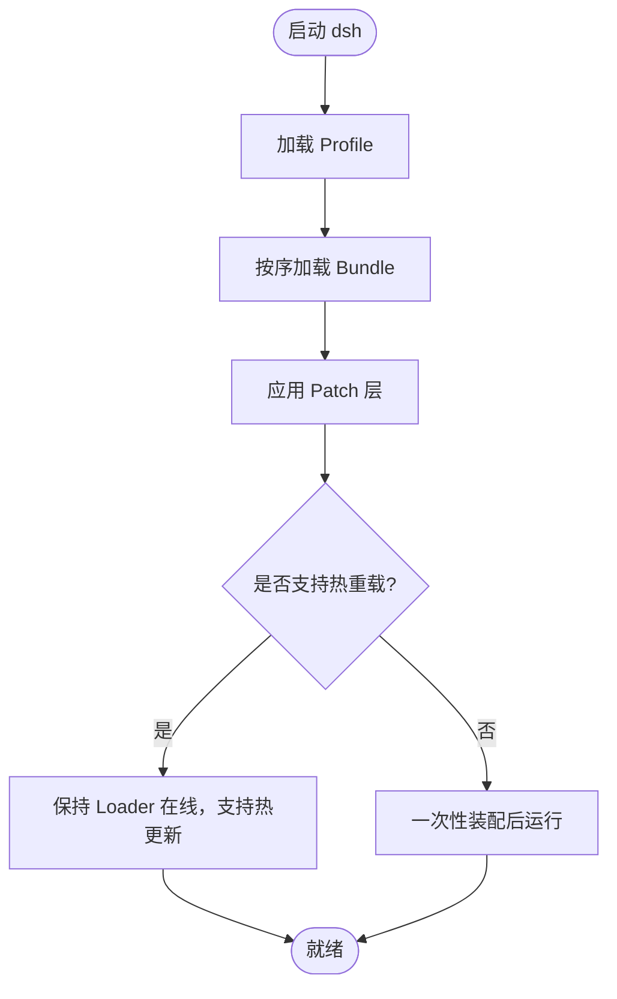
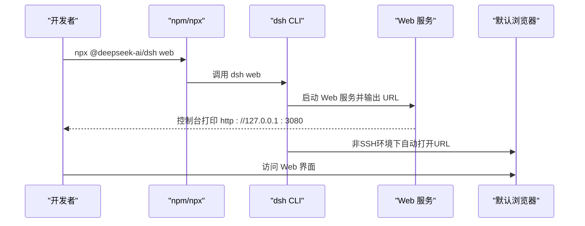
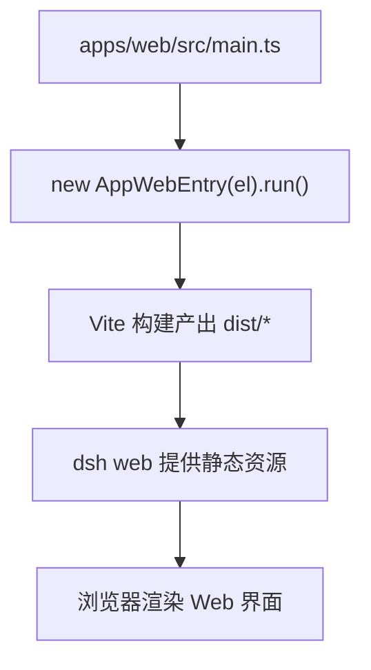
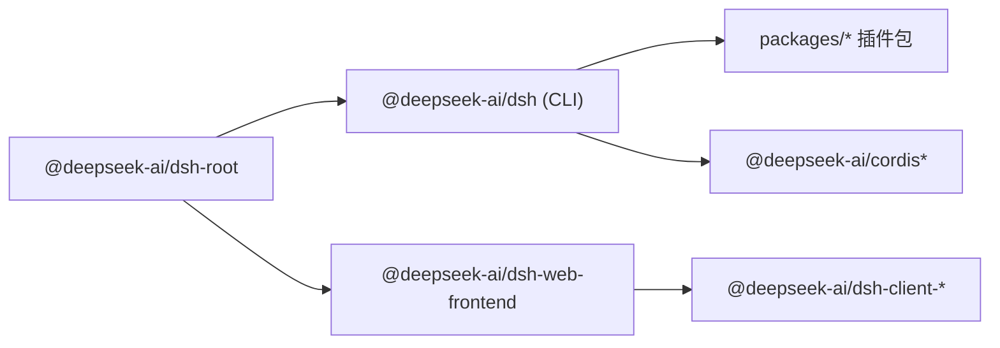

# 项目概述

<cite>
**本文引用的文件**
- [README.md](file://README.md)
- [package.json](file://package.json)
- [apps/cli/package.json](file://apps/cli/package.json)
- [apps/web/package.json](file://apps/web/package.json)
- [apps/web/src/main.ts](file://apps/web/src/main.ts)
- [docs/architecture.md](file://docs/architecture.md)
- [docs/cordis-primer.md](file://docs/cordis-primer.md)
- [CONTRIBUTING.md](file://CONTRIBUTING.md)
- [docs/user/guide/index.md](file://docs/user/guide/index.md)
</cite>

## 目录
1. [简介](#简介)
2. [项目结构](#项目结构)
3. [核心组件](#核心组件)
4. [架构总览](#架构总览)
5. [详细组件分析](#详细组件分析)
6. [依赖关系分析](#依赖关系分析)
7. [性能考量](#性能考量)
8. [故障排查指南](#故障排查指南)
9. [结论](#结论)
10. [附录](#附录)

## 简介
DeepSeek Harness（简称 dsh）是由 DeepSeek AI 开源的 Agent 运行框架，采用“一切皆插件”的设计哲学，基于 Cordis 插件框架构建。其目标是提供一个可组合、可扩展、可替换的运行时，将模型适配器、工具注册表、会话日志、Agent 循环等全部以插件形式组织，通过配置与补丁在启动时组装成不同 Profile（如 web、headless、sdk、acp），从而满足从 Web 界面到无头执行、SDK 服务等多种使用场景。

项目当前处于开发者预览阶段，迭代迅速，存在兼容性破坏性变更的可能；使用前请阅读安全提示。

**章节来源**
- [README.md:1-16](file://README.md#L1-L16)

## 项目结构
仓库采用 monorepo 组织，核心目录包括：
- apps：应用入口，包含 CLI（dsh）和 Web 前端
- packages：按能力划分的插件包（如 session、tools、llm、webhook、settings 等）
- docs：架构、子系统、教程、用户指南等文档
- scripts：构建、验证、发布等工程脚本
- native、python、website、snapshots、vendor 等支撑目录

**图表来源**
- [package.json:11-18](file://package.json#L11-L18)
- [apps/cli/package.json:1-24](file://apps/cli/package.json#L1-L24)
- [apps/web/package.json:1-29](file://apps/web/package.json#L1-L29)

**章节来源**
- [package.json:11-18](file://package.json#L11-L18)

## 核心组件
- dsh CLI：统一入口，提供 profile 选择、插件管理、浏览器 UI 别名等能力
- Web 前端：基于 Vite 构建的 React 客户端，由 CLI 的 web 命令提供服务并打开浏览器
- Cordis 插件框架：上下文 + 服务 + 事件 + 可逆副作用的组合机制，所有功能以插件形式挂载
- Profile/Bundles：启动时按序叠加的配置层，决定最终运行的插件树
- 子系统：session、tools、llm、webhook、settings、jobs、shell、sandbox 等，均作为插件暴露能力

**章节来源**
- [apps/cli/package.json:1-24](file://apps/cli/package.json#L1-L24)
- [apps/web/package.json:1-29](file://apps/web/package.json#L1-L29)
- [docs/architecture.md:9-29](file://docs/architecture.md#L9-L29)

## 架构总览
Cordis 是 dsh 的底层插件框架。每个插件实现 Service，声明依赖 inject，通过 ctx 获取/注册服务，使用类型化事件通信，并通过 effect/on 注册可撤销副作用。Profile 由多个 Bundle 组成，启动时按顺序加载，形成可热重载或一次性应用的插件树。

**图表来源**
- [docs/architecture.md:15-47](file://docs/architecture.md#L15-L47)
- [docs/cordis-primer.md:7-13](file://docs/cordis-primer.md#L7-L13)
- [apps/cli/reference/README.zh.md:68-80](file://apps/cli/reference/README.zh.md#L68-L80)

**章节来源**
- [docs/architecture.md:9-47](file://docs/architecture.md#L9-L47)
- [docs/cordis-primer.md:7-46](file://docs/cordis-primer.md#L7-L46)

## 详细组件分析

### 基于 Cordis 的“一切皆插件”设计
- 插件即 Service：函数或类，支持 inject 声明依赖，apply(ctx) 中消费/提供能力
- 上下文即服务仓库：稳定键名（如 ctx.tools、ctx.llm、ctx.sessions）解耦实现
- 类型化事件：emit/waterfall/parallel/serial/bail 多种分发模式，契约化扩展点
- 可逆副作用：effect/on 注册，卸载时自动回滚，保证热重载与清理正确性

**图表来源**
- [docs/cordis-primer.md:7-13](file://docs/cordis-primer.md#L7-L13)
- [docs/architecture.md:49-63](file://docs/architecture.md#L49-L63)

**章节来源**
- [docs/cordis-primer.md:7-46](file://docs/cordis-primer.md#L7-L46)
- [docs/architecture.md:49-63](file://docs/architecture.md#L49-L63)

### Profile 与 Bundle 的启动装配
- Profile：命名组合，列出要堆叠的 Bundle，保存用户 patch
- Bundle：分发格式，包含 Cordis 配置行与代码，可被上层覆盖
- 装配顺序：Profile 列出的 Bundle → Profile 的 cordis.patch.yml → 家目录 patch → --patch 覆盖
- 应用：web 默认支持热重载；headless/sdk/acp 一次性应用

**图表来源**
- [docs/architecture.md:15-39](file://docs/architecture.md#L15-L39)

**章节来源**
- [docs/architecture.md:15-39](file://docs/architecture.md#L15-L39)

### Web 界面快速开始
- 通过 npm 安装 Node.js 后，直接运行 npx @deepseek-ai/dsh web，默认监听 http://127.0.0.1:3080 并尝试打开默认浏览器
- SSH 环境仅打印宿主机 URL，不尝试打开本地浏览器
- 可通过 --no-open 关闭自动打开浏览器
- 从源码运行需先构建产物，再执行 pnpm dsh web

**图表来源**
- [README.md:17-41](file://README.md#L17-L41)
- [apps/cli/reference/README.zh.md:68-80](file://apps/cli/reference/README.zh.md#L68-L80)
- [docs/user/guide/index.md:1-31](file://docs/user/guide/index.md#L1-L31)

**章节来源**
- [README.md:17-41](file://README.md#L17-L41)
- [apps/cli/reference/README.zh.md:68-80](file://apps/cli/reference/README.zh.md#L68-L80)
- [docs/user/guide/index.md:1-31](file://docs/user/guide/index.md#L1-L31)

### 前端入口与构建
- Web 前端入口 main.ts 初始化 AppWebEntry 并运行
- 使用 Vite 构建，产物由 CLI 的 web 命令提供静态服务
- 开发模式可通过 pnpm run dev:web 进行 watcher 构建

**图表来源**
- [apps/web/src/main.ts:1-7](file://apps/web/src/main.ts#L1-L7)
- [apps/web/package.json:24-30](file://apps/web/package.json#L24-L30)

**章节来源**
- [apps/web/src/main.ts:1-7](file://apps/web/src/main.ts#L1-L7)
- [apps/web/package.json:24-30](file://apps/web/package.json#L24-L30)

## 依赖关系分析
- CLI 依赖大量 dsh-* 插件包与 Cordis 相关插件，构成完整运行时
- Web 前端依赖 dsh-client-web 等客户端库，并由 CLI 提供运行环境
- 根 package.json 定义 workspaces，统一管理版本与脚本

**图表来源**
- [package.json:11-18](file://package.json#L11-L18)
- [apps/cli/package.json:26-100](file://apps/cli/package.json#L26-L100)
- [apps/web/package.json:32-56](file://apps/web/package.json#L32-L56)

**章节来源**
- [package.json:11-18](file://package.json#L11-L18)
- [apps/cli/package.json:26-100](file://apps/cli/package.json#L26-L100)
- [apps/web/package.json:32-56](file://apps/web/package.json#L32-L56)

## 性能考量
- 启动装配：web 支持热重载，headless/sdk/acp 一次性装配，避免生命周期失效
- 事件分发：waterfall/serial/parallel/bail 等模式影响并发与短路行为，应依据语义选择
- 会话日志：所有模型可见输入必须可重放，确保回放与 UI 一致性
- 工具执行：受保护的工具执行管线，结合策略与沙箱控制开销

[本节为通用指导，无需特定文件引用]

## 故障排查指南
- 启动失败或端口占用：检查 CLI 输出的 URL 与端口，必要时调整 --port 或 --host
- SSH 环境无法自动打开浏览器：属预期行为，手动复制宿主机 URL 访问
- 构建产物缺失：从源码运行前需执行构建脚本生成产物
- 插件冲突或覆盖：通过 --dump-config 查看最终装配结果，定位覆盖层

**章节来源**
- [README.md:17-41](file://README.md#L17-L41)
- [apps/cli/reference/README.zh.md:68-80](file://apps/cli/reference/README.zh.md#L68-L80)

## 结论
DeepSeek Harness 以 Cordis 为内核，将“一切皆插件”的理念贯穿到产品各层，通过 Profile/Bundles 的有序装配实现高度可定制的运行态。开发者预览阶段强调快速迭代与兼容性风险，建议在生产使用前评估变更策略。借助 CLI 与 Web 界面，用户可以快速体验并扩展能力；社区鼓励通过插件生态与讨论区参与贡献。

[本节为总结，无需特定文件引用]

## 附录
- 开发者预览与兼容性：项目处于开发者预览，存在破坏性变更可能；使用前请阅读安全提示
- 社区与支持：通过 GitHub Discussions 反馈问题，给插件仓库添加 dsh-plugin 主题以便发现，加入 Discord 社区
- 贡献方式：目前不接受外部 PR，但欢迎创建插件、撰写指南、回答问题等生态贡献

**章节来源**
- [README.md:11-16](file://README.md#L11-L16)
- [README.md:43-51](file://README.md#L43-L51)
- [CONTRIBUTING.md:1-24](file://CONTRIBUTING.md#L1-L24)